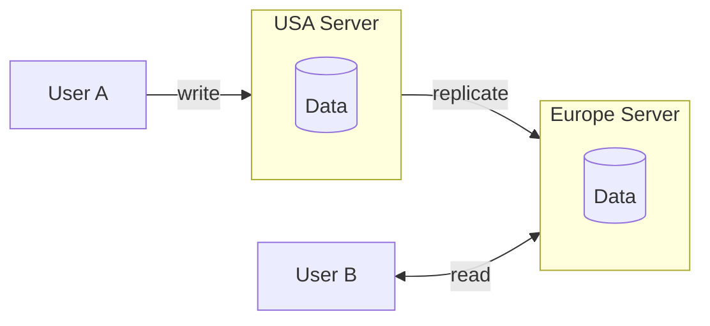
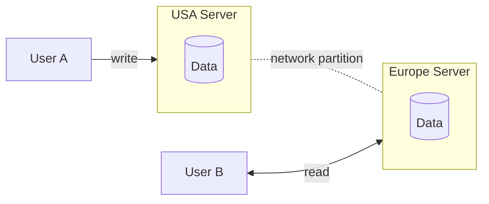

## Teorema CAP

Domine os trade-offs fundamentais entre **consistência** e **disponibilidade** em sistemas distribuídos.

O Teorema CAP costuma ser um ponto de confusão para candidatos, mas ele é **fundamental** para a forma como você aborda o design de sistemas em entrevistas.
Aqui vamos explicar o que ele é, como funciona e quais **decisões práticas** você precisa tomar ao considerar o Teorema CAP durante a fase de **requisitos não funcionais** em uma entrevista de *System Design*.

---

## O que é o Teorema CAP?

Em sua essência, o Teorema CAP afirma que, em um **sistema distribuído**, você só pode garantir **duas** das **três** propriedades abaixo ao mesmo tempo:

### Consistência (Consistency)

Todos os nós veem os **mesmos dados ao mesmo tempo**.
Quando um dado é gravado em um nó, todas as leituras subsequentes, em qualquer nó, retornarão esse valor atualizado.

### Disponibilidade (Availability)

Toda requisição feita a um nó que não falhou recebe uma resposta, **sem garantia** de que essa resposta contenha a versão mais recente dos dados.

### Tolerância a Partições (Partition Tolerance)

O sistema continua operando mesmo que ocorram falhas de comunicação ou perda de mensagens entre partes do sistema (ou seja, *network partitions*).

⚠️ **Atenção:** a consistência no contexto do Teorema CAP é **diferente** da consistência garantida por bancos ACID. Confunde mesmo — e você não está sozinho nisso.

---

## O insight mais importante do Teorema CAP

Em **qualquer sistema distribuído**, a **tolerância a partições é obrigatória**.
Falhas de rede **vão acontecer**, e seu sistema precisa lidar com isso.

👉 Portanto, na prática, o Teorema CAP se resume a uma única pergunta:

> **Durante uma falha de rede, você prioriza Consistência ou Disponibilidade?**

---

## Entendendo o Teorema CAP com um exemplo prático

Imagine que você mantém um site com **dois servidores**:

* Um nos **EUA**
* Um na **Europa**

Quando um usuário atualiza seu perfil público (por exemplo, o nome de exibição):

1. O Usuário A se conecta ao servidor mais próximo (EUA) e atualiza o nome
2. Essa atualização é replicada para o servidor da Europa
3. Quando o Usuário B (na Europa) acessa o perfil, ele vê o nome atualizado

Tudo funciona bem… **até ocorrer uma partição de rede** entre os servidores dos EUA e da Europa.

Agora surge uma decisão crítica:

Quando o Usuário B tenta visualizar o perfil do Usuário A, o sistema deve:

* **Opção A:** Retornar erro, pois não pode garantir que o dado esteja atualizado (**prioriza consistência**)
* **Opção B:** Mostrar dados possivelmente desatualizados (**prioriza disponibilidade**)

### Qual escolher?

Nesse caso, a resposta é clara:
👉 É melhor mostrar um nome antigo do que **não mostrar nada**.

É exatamente aqui que o Teorema CAP se torna prático.

---

## Quando priorizar Consistência

Alguns sistemas **não podem tolerar inconsistência**, mesmo que isso afete a disponibilidade:

### 🎟️ Sistemas de reserva de ingressos

Se dois usuários conseguirem reservar o mesmo assento por causa de uma falha de rede, o resultado é catastrófico.

### 🛒 Controle de estoque em e-commerce

Se houver apenas um item em estoque e múltiplos usuários conseguirem comprá-lo, o sistema quebra a regra de negócio.

### 💰 Sistemas financeiros

Plataformas de negociação precisam exibir dados **precisos e atualizados**. Dados defasados podem causar prejuízos reais.

---

## Quando priorizar Disponibilidade

A maioria dos sistemas **tolera alguma inconsistência** e deve priorizar disponibilidade, adotando **consistência eventual**.

Isso significa que:

> O sistema **eventualmente** ficará consistente, mas pode levar segundos ou minutos.

### Exemplos comuns:

* 📱 **Redes sociais**
  Ver uma foto de perfil antiga por alguns minutos é aceitável.
* 🎬 **Plataformas de conteúdo (Netflix)**
  Descrições desatualizadas temporariamente não são críticas.
* ⭐ **Sites de avaliação (Yelp)**
  Horários levemente defasados são melhores do que não mostrar informação nenhuma.

👉 Pergunta-chave:

> **Seria catastrófico se o usuário visse dados inconsistentes por um curto período?**

* Se **sim** → priorize **consistência**
* Se **não** → priorize **disponibilidade**

---

## Teorema CAP em entrevistas de System Design

O Teorema CAP é um dos **primeiros pontos** que você deve discutir em uma entrevista de *System Design*, pois ele influencia diretamente toda a arquitetura.

O fluxo típico é:

1. Definir requisitos funcionais (features)
2. Definir requisitos não funcionais (qualidades do sistema)

👉 Nos requisitos não funcionais, a pergunta central é:

> **Este sistema precisa priorizar consistência ou disponibilidade?**

---

## Se você priorizar Consistência

Seu design pode incluir:

### 🔐 Transações distribuídas

Uso de *two-phase commit* para manter cache, banco e outros storages sincronizados.
✔️ Garante consistência
❌ Aumenta latência e complexidade

### 🧱 Soluções de nó único

Um único banco como fonte de verdade.
✔️ Evita problemas de consistência
❌ Limita escalabilidade

### Tecnologias comuns:

* PostgreSQL
* MySQL
* Google Spanner
* DynamoDB (modo de consistência forte)

---

## Se você priorizar Disponibilidade

Seu design pode incluir:

### 📚 Múltiplas réplicas

Replicação assíncrona para leitura em múltiplos nós, mesmo com dados levemente defasados.

### 🔄 Change Data Capture (CDC)

Mudanças no banco primário são propagadas de forma assíncrona para caches e réplicas.

### Tecnologias comuns:

* Cassandra
* DynamoDB (multi-AZ)
* Redis Cluster

📌 A maioria dos bancos distribuídos modernos permite configurar **níveis diferentes** de consistência.

---

## Considerações avançadas (nível sênior)

Na prática, a escolha entre consistência e disponibilidade **não é binária**.
Sistemas reais costumam misturar os dois, dependendo da funcionalidade.

### Exemplo 1: Sistema de ingressos

* **Compra de assento:** consistência forte
* **Visualização de eventos:** disponibilidade

### Exemplo 2: Aplicativo de relacionamento

* **Match:** consistência
* **Visualização de perfil:** disponibilidade

Em entrevistas, isso demonstra maturidade arquitetural.

---

## Níveis de consistência

Nem toda consistência é “tudo ou nada”:

* **Consistência forte:**
  Toda leitura reflete a escrita mais recente (cara, porém necessária em sistemas críticos).
* **Consistência causal:**
  Eventos relacionados aparecem na mesma ordem para todos.
* **Read-your-own-writes:**
  O usuário sempre vê suas próprias atualizações imediatamente.
* **Consistência eventual:**
  O sistema converge com o tempo (DNS é um exemplo clássico).

---

## Conclusão

O Teorema CAP é essencial e **define a base** do seu raciocínio em *System Design*.
Mas ele não precisa ser complicado.

👉 Basta se perguntar:

> **Toda leitura precisa refletir a escrita mais recente?**

* Se **sim** → priorize **consistência**
* Se **não** → priorize **disponibilidade**

Esse simples raciocínio já te coloca **à frente da maioria dos candidatos** em entrevistas técnicas.
