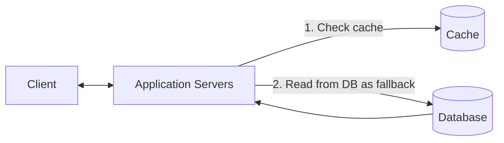
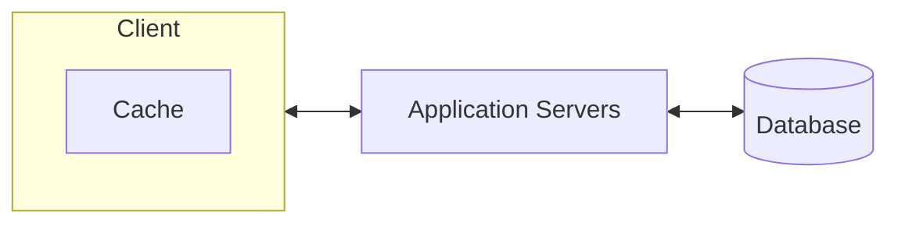
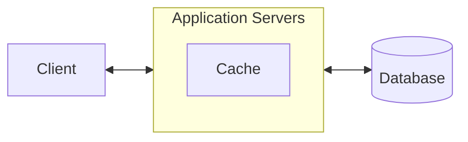
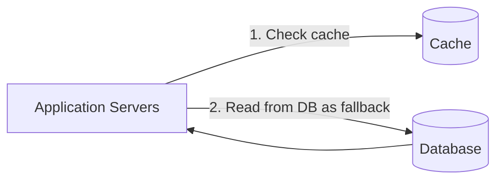
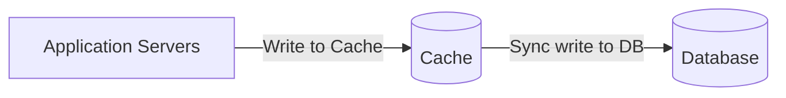
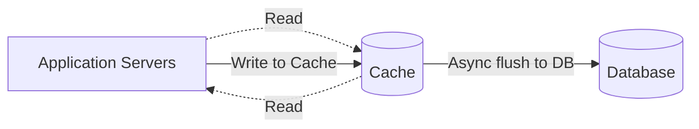
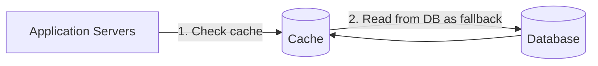
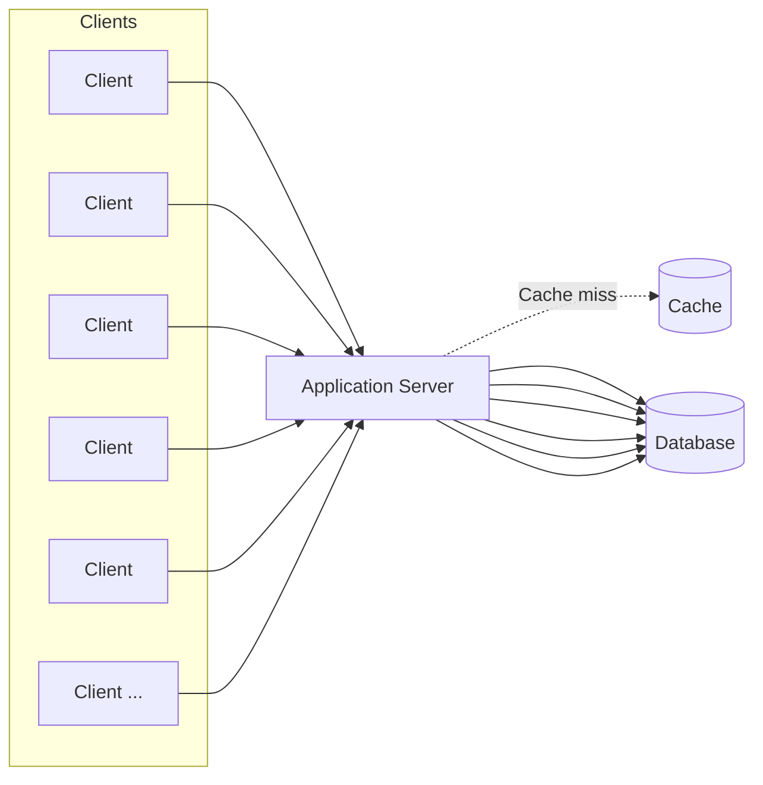

# **Caching**

Aprenda sobre caching e quando utilizá-lo em entrevistas de System Design.

---

Caching aparece em praticamente toda entrevista de system design quando é necessário lidar com tráfego intenso de leitura. Seu banco de dados vira gargalo, a latência começa a subir, e o entrevistador só está esperando você dizer a palavra mágica: **cache**.

Ler um perfil de usuário no Postgres pode levar 50 ms, enquanto ler de um cache em memória como o Redis leva apenas 1 ms. Isso é uma melhoria de **50x**. Bancos leem dados do disco e cada consulta paga esse custo. Memória fica muito mais perto da CPU e evita esse tempo.

Caches são essenciais para sistemas escaláveis. Eles reduzem a carga no banco de dados e diminuem drasticamente a latência. Mas também introduzem novos desafios, como invalidação e tratamento de falhas.

Este guia cobre os fundamentos de caching, quando e onde usá-lo, armadilhas comuns e como falar sobre caching de maneira clara em entrevistas.

---

# **Onde Fazer Cache**

Quando a maioria dos engenheiros ouve “cache”, pensa imediatamente em **Redis ou Memcached entre a aplicação e o banco de dados**. É o tipo mais comum e o que mais importa em entrevistas.

Mas o cache aparece em várias camadas: browser, CDN, aplicação e até no próprio banco.

Vamos analisar os principais locais onde podemos armazenar cache, por que cada um existe e quando faz sentido utilizá-los.

---

# **External Caching**

Um cache externo é um serviço de cache independente que sua aplicação acessa via rede. É o modelo clássico de cache: você armazena dados muito acessados em algo como Redis ou Memcached para não precisar consultar o banco sempre.

**Por que usar:**

* Todos os servidores da aplicação compartilham o mesmo cache.
* Suporte a políticas de expiração como LRU e TTL.
* Escala bem horizontalmente.

Em entrevistas, **usar Redis como cache externo** é quase sempre a resposta padrão. Mencione isso em qualquer sistema com alto volume de leitura.

Comece por aqui; só mencione CDN ou cache no cliente se o problema exigir.

---

# **CDN (Content Delivery Network)**

Uma CDN é uma rede distribuída de servidores que armazena conteúdo perto dos usuários. Em vez de toda requisição ir ao servidor de origem, a CDN devolve cópias armazenadas em edge servers ao redor do mundo.

CDNs modernas (Cloudflare, Fastly, Akamai):

* Cacheiam mais do que arquivos estáticos
* Podem armazenar respostas públicas de APIs
* Podem executar lógica no edge
* Podem aplicar regras de segurança

Mas o uso mais comum e eficiente ainda é **entrega de mídias** (imagens, vídeos, assets).

### **Como funciona:**

1. O usuário solicita uma imagem.
2. A requisição vai para o edge server mais próximo.
3. Se a imagem está ali, retorna imediatamente.
4. Se não, o edge baixa do origin, armazena e devolve.
5. Futuras requisições da região pegam diretamente do edge.

Sem CDN, uma requisição da Índia para um servidor na Virgínia adiciona 250–300 ms. Com CDN, 20–40 ms.

Em entrevistas, **introduza CDN quando o sistema serve conteúdo estático em escala**.

---

# **Client-Side Caching**

Cache no cliente é guardar dados perto do usuário:

* Browser (HTTP Cache, localStorage)
* Aplicativos mobile (armazenamento local)
* Bibliotecas de cliente que armazenam metadados (ex: Redis clients)

No backend, você tem pouco controle. Dados podem ficar obsoletos.

Exemplos:

* Strava mantém seus dados offline no app
* Browser reutiliza imagens já baixadas

Use apenas quando fizer sentido na experiência do usuário.

---

# **In-Process Caching**

Muitos ignoram que **cada servidor de aplicação tem muita memória**. Você pode armazenar dados diretamente no processo, ainda mais rápido que Redis (porque não envolve rede).

Use para valores pequenos e muito acessados:

* Feature flags
* Valores de configuração
* Pequenos datasets
* Hot keys
* Contadores
* Valores pré-computados

### Limitações:

* Cada instância tem seu próprio cache
* Mudanças não propagam automaticamente
* Não substitui Redis

Em entrevistas, mencione como **camada de otimização**, nunca como solução principal.

---

# **Arquiteturas de Cache**

Existem quatro padrões principais que você precisa conhecer.

---

## **1. Cache-Aside (Lazy Loading)**

Padrão mais comum — use como padrão nas entrevistas.

### Como funciona:

1. Aplicação verifica o cache.
2. Se existir → retorna.
3. Se não → busca no banco, armazena no cache, retorna.

Cache-Aside mantém o cache leve, mas um cache-miss gera latência extra.

**Se só puder lembrar um padrão, lembre este.**

---

## **2. Write-Through**

Aplicação escreve **apenas no cache**.
O cache escreve **sincronamente** no banco antes de confirmar.

### Vantagens:

* Leitura sempre atualizada.

### Desvantagens:

* Escrita mais lenta.
* Pode poluir o cache com dados pouco utilizados.
* Sofre com o problema de "dual-write".

Use quando **consistência forte** é mais importante que velocidade de escrita.

---

## **3. Write-Behind (Write-Back)**

Aplicação escreve **só no cache**.
O cache escreve no banco **assíncronamente**.

### Vantagens:

* Escritas extremamente rápidas.

### Riscos:

* Se o cache cair antes de persistir → perda de dados.
* Eventual consistency.

Usado em workloads onde perda mínima é aceitável, como métricas e analytics.

---

## **4. Read-Through**

A aplicação nunca fala com o banco.
O cache atua como proxy inteligente: em caso de cache-miss ele busca no banco e armazena.

CDNs funcionam assim.

No backend, é menos comum que Cache-Aside.

---

# **Políticas de Evicção**

Caches têm limite de memória. Quando ficam cheios, precisam decidir o que remover.

### **LRU** – Least Recently Used

Evicta o item menos acessado recentemente.
É o padrão mais usado.

### **LFU** – Least Frequently Used

Remove o item menos acessado ao longo do tempo.
Bom para conteúdos consistentemente populares.

### **FIFO** – First In First Out

Remove o mais antigo na ordem de inserção.
Simples, mas pouco eficiente.

### **TTL** – Time To Live

Expira itens antigos automaticamente.
Quase sempre usado em conjunto com outras políticas.

---

# **Problemas Comuns de Cache**

Caching acelera, mas introduz outros problemas. Entrevistadores adoram testar se você conhece esses efeitos colaterais.

---

## **1. Cache Stampede (Thundering Herd)**

Quando um item popular expira e milhares de requisições tentam reconstruí-lo simultaneamente, derrubando o banco.

### Soluções:

* **Request coalescing** (apenas uma requisição reconstrói)
* **Cache warming**
* TTL com jitter

---

## **2. Inconsistência entre Cache e Banco**

Clássico:

* Escrita vai para o banco
* Cache ainda tem valor antigo

Soluções:

* **Invalidar cache após escrita**
* **TTL curto**
* **Aceitar eventual consistency**

---

## **3. Hot Keys**

Chaves extremamente populares podem sobrecarregar:

* Um único nó Redis
* Uma única shard

Soluções:

* Replicar hot keys
* Cache local como fallback
* Rate limiting em chaves específicas

---

# **Caching em Entrevistas de System Design**

Caching aparece o tempo todo. Mostre que você:

1. Identifica o gargalo
2. Justifica o uso do cache
3. Escolhe o tipo correto
4. Explica trade-offs
5. Lida com falhas

---

## **Quando Mencionar Caching**

Não comece falando de cache. Primeiro:

* Mostre o gargalo
* Dê números aproximados
* Depois introduza o cache

Exemplos clássicos:

* Workload pesado de leitura
* Consultas caras
* Alta latência
* Alta CPU no banco

---

## **Como Introduzir Caching**

### **1. Identifique o gargalo**

Exemplo:

> “O endpoint de perfil é chamado 500 vezes por segundo, cada query leva 30ms. É o gargalo.”

### **2. Decida o que será cacheado**

Cache apenas:

* Dados lidos frequentemente
* Dados raramente alterados
* Dados caros de processar

### **3. Escolha o padrão de cache**

Exemplo:

> “Usarei Cache-Aside com Redis.”

### **4. Defina política de expiração**

Exemplo:

> “TTL de 10 minutos + LRU.”

### **5. Explique como lidar com falhas**

Mostre maturidade:

* Invalidação
* Fallback ao banco
* Circuit breaker
* Stampede control

---

# **Conclusão**

Caching é a solução quando ler do banco é **lento** ou **caro**.
Ele acelera drasticamente leituras, mas adiciona complexidade:

* Staleness
* Invalidação
* Falhas
* Hot keys

Em entrevistas:

* Identifique o gargalo
* Justifique o uso do cache
* Escolha o tipo e padrão
* Adicione TTL
* Mostre como trata falhas

E lembre-se:

**Não faça cache de tudo.**
Cache só quando o custo/benefício compensa.

---
