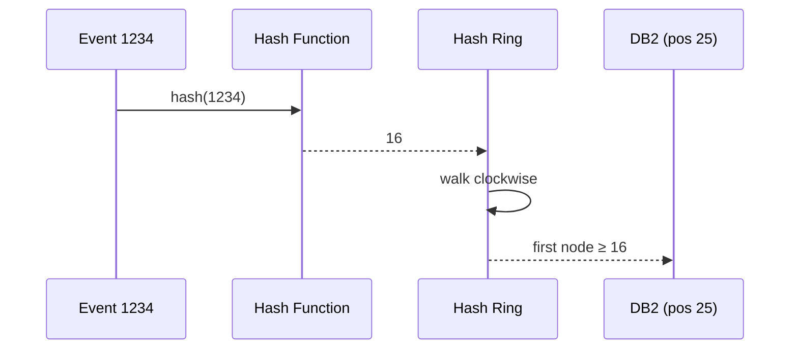
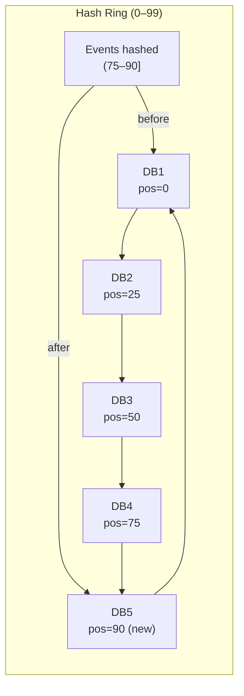
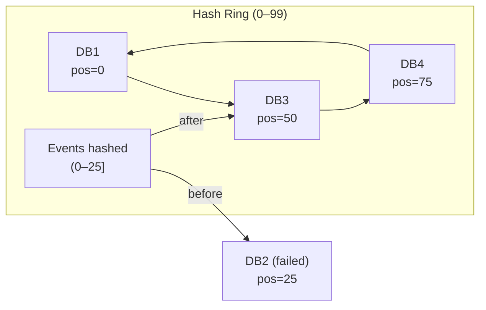
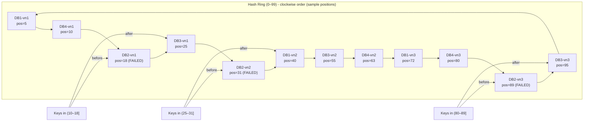

# Consistent Hashing (Hashing Consistente)

**Qual problema o consistent hashing resolve, como ele funciona e como você pode usá-lo em entrevistas.**

---

## Visão Geral

Ao se preparar para entrevistas de *system design*, é quase certo que você já tenha se deparado com **consistent hashing**. Trata-se de um algoritmo fundamental em sistemas distribuídos, usado para distribuir dados entre um cluster de servidores.

Existem literalmente milhares de materiais explicando esse conceito na internet, mas muitos acabam sendo excessivamente acadêmicos.
Neste guia, vamos apresentar uma visão **direta e objetiva** sobre consistent hashing: **qual problema ele resolve, como funciona e como explicá-lo bem em entrevistas**.

---

## Consistent Hashing por Meio de um Exemplo

Vamos construir a intuição com um exemplo prático.

Imagine que você está projetando um sistema de venda de ingressos, como o *TicketMaster*. Inicialmente, o sistema é simples:

* Um único banco de dados armazenando todos os eventos
* Clientes fazem requisições para consultar informações dos eventos

Tudo funciona bem no começo.


Mas o sucesso traz novos desafios.

À medida que a plataforma cresce e passa a hospedar mais eventos, **um único banco de dados não consegue mais suportar a carga**. Surge então a necessidade de distribuir os dados entre múltiplos bancos — processo conhecido como **sharding**.

---

## Sharding

A grande pergunta passa a ser:

> **Como decidir qual evento deve ser armazenado em qual instância de banco de dados?**

---

## Primeira Tentativa: Hashing Simples com Módulo

A abordagem mais direta é o **hashing com operador módulo**:

1. Aplicamos uma função de hash sobre o `event_id`, gerando um número
2. Aplicamos o operador módulo (%) usando o número de bancos disponíveis
3. O resultado indica o banco de dados responsável pelo evento

Em código:

```text
database_id = hash(event_id) % number_of_databases
```

### Exemplo com 3 bancos de dados

* Evento `#1234` → `hash(1234) % 3 = 1` → Banco 1
* Evento `#5678` → `hash(5678) % 3 = 0` → Banco 0
* Evento `#9012` → `hash(9012) % 3 = 2` → Banco 2

À primeira vista, parece perfeito.

---

## Problema ao Adicionar um Novo Nó

Agora imagine que você precise adicionar um **quarto banco de dados**.

O cálculo muda para:

```text
database_id = hash(event_id) % 4
```

Você faz o deploy… e de repente **a atividade no banco de dados explode** — em todos os nós, não apenas no novo.


### O que aconteceu?

A simples mudança no divisor do módulo **alterou o destino de quase todos os eventos**.

Exemplo:

* Antes: `hash(1234) % 3 = 1` → Banco 1
* Agora: `hash(1234) % 4 = 0` → Banco 0

Isso significa mover dados do Banco 1 para o Banco 0.
E esse não é um caso isolado — **quase todos os dados precisam ser redistribuídos**, causando:

* Pico de carga
* Lentidão
* Indisponibilidade temporária para os usuários

---

## Problema ao Remover um Nó

O mesmo problema ocorre quando um banco falha.

Se um banco cai:

* Antes: `hash(event_id) % 3`
* Depois: `hash(event_id) % 2`

Resultado? **Redistribuição massiva de dados novamente.**

Fica claro que **hashing simples com módulo não é suficiente**.

---

## Entra em Cena: Consistent Hashing

O **consistent hashing** resolve exatamente esse problema:
👉 **minimizar a redistribuição de dados quando nós entram ou saem do sistema**.

### A ideia central

* Tanto os **dados** quanto os **servidores** são posicionados em um **espaço circular**, chamado de **hash ring**.

---

## O Hash Ring

Funcionamento básico:

1. Criamos um anel de hash com um espaço fixo (por simplicidade, 0 a 100)
2. Distribuímos os bancos de dados nesse anel

   * Exemplo com 4 bancos: posições `0`, `25`, `50` e `75`
3. Para armazenar um evento:

   * Aplicamos o hash no `event_id`
   * Caminhamos no sentido horário no anel
   * O primeiro banco encontrado é o responsável pelo dado



> Na prática, o espaço de hash costuma ser de `0` a `2³² - 1`, mas o conceito é o mesmo.

---

## Adicionando um Banco de Dados

Suponha que adicionamos um novo banco na posição `90`.


## Situação representada na imagem 

* Espaço de hash: `0–99`
* Bancos:

  * DB1 → `0`
  * DB2 → `25`
  * DB3 → `50`
  * DB4 → `75`
  * **DB5 → `90` (novo nó)**
* Regra do consistent hashing:

  * **Somente os eventos no intervalo (75, 90] são realocados**
  * Antes → iam para **DB1**
  * Agora → passam a ir para **DB5**
  * 
O que acontece?

* **Somente os eventos entre 75 e 90 precisam ser movidos**
* Antes, eles iam para o banco da posição 0
* Todos os outros dados permanecem exatamente onde estavam

Resultado:

* Em vez de mover quase 100% dos dados
* Movemos apenas ~15% do total

---

## Removendo um Banco de Dados

Agora imagine que o banco da posição `25` falhe.

# 🔄 Remoção de um Nó — DB2 falhando (Consistent Hashing)

## Situação inicial (antes da falha)

* Espaço de hash: `0–99`
* Bancos:

  * DB1 → `0`
  * **DB2 → `25`**
  * DB3 → `50`
  * DB4 → `75`
* Regra:

  * Cada evento vai para o **primeiro nó no sentido horário**

---

## O que acontece quando DB2 falha?

👉 **Somente os eventos que eram mapeados para DB2 precisam ser movidos**

* Intervalo afetado: `(0, 25]`
* Antes: `(0, 25] → DB2`
* Depois: `(0, 25] → DB3`
* Todos os demais dados permanecem **exatamente onde estavam**

---

## Mermaid — Remoção do DB2



---

## Correspondência direta com o hash ring real

| Elemento          | Significado                               |
| ----------------- | ----------------------------------------- |
| `(0–25]`          | Intervalo que era responsabilidade do DB2 |
| `before → DB2`    | Mapeamento original                       |
| `after → DB3`     | Novo destino após a falha                 |
| Outros intervalos | **Nenhuma mudança**                       |

---
* Apenas os dados mapeados para esse banco precisam ser movidos
* Eles passam a ir para o próximo banco no sentido horário (`50`)
* Todo o resto permanece intacto

---

## Nós Virtuais (Virtual Nodes)

Ainda existe um problema.

Quando um banco falha, **todo o seu tráfego pode ir para um único vizinho**, causando desequilíbrio de carga.

### Solução: Nós Virtuais

Em vez de posicionar cada banco em **um único ponto** do anel, nós o posicionamos em **vários pontos**, usando variações do nome:

* `"DB1-vn1"`
* `"DB1-vn2"`
* `"DB1-vn3"`

## 🧩 Mermaid — DB2 com Virtual Nodes e Falha (vn1, vn2, vn3)

### Exemplo (ring 0–99) com vnodes intercalados

* DB1: posições 5, 40, 72
* DB2: posições **18, 31, 89** (vai falhar)
* DB3: posições 25, 55, 95
* DB4: posições 10, 63, 80

Quando DB2 cai:

* o intervalo que apontava para **DB2-vn1(18)** vai para o próximo vnode (clockwise) → **DB3-vn1(25)**
* o intervalo que apontava para **DB2-vn2(31)** vai para o próximo → **DB1-vn2(40)**
* o intervalo que apontava para **DB2-vn3(89)** vai para o próximo → **DB3-vn3(95)**

---


---
## O que isso demonstra (exatamente o ponto dos virtual nodes)

* Sem vnodes: **toda a carga do DB2 iria para o DB3** (vizinho imediato).
* Com vnodes: a carga do DB2 é **dividida**:

  * Parte vai para DB3
  * Parte vai para DB1
  * Outra parte vai para DB3 de novo (outro vnode), etc.

Ou seja: **falha de um nó → redistribuição mais uniforme**.

---
Isso faz com que os nós virtuais fiquem espalhados pelo anel.

### Benefício

Se um banco falhar:

* Cada nó virtual redistribui sua carga para bancos diferentes
* A carga é espalhada de forma muito mais equilibrada

Quanto mais nós virtuais por banco, **mais uniforme é a distribuição**.

---

## Consistent Hashing no Mundo Real

Embora o exemplo tenha usado bancos de dados, o consistent hashing se aplica a vários cenários:

* Bancos de dados distribuídos
* Caches distribuídos
* Filas e brokers de mensagens
* Servidores de aplicação

### Exemplos reais:

* **Apache Cassandra** — distribuição de dados em anel
* **Amazon DynamoDB** — usa consistent hashing internamente
* **CDNs** — decidem qual servidor de borda armazena determinado conteúdo

---

## Quando Usar Consistent Hashing em Entrevistas

Na maioria dos sistemas modernos, **essa complexidade já vem embutida**.

Se você estiver usando:

* DynamoDB
* Cassandra
* Redis Cluster

Normalmente basta mencionar que **o sistema usa consistent hashing internamente**.

### Quando aprofundar?

Em entrevistas focadas em **infraestrutura**, onde você precisa projetar tudo do zero:

* Banco de dados distribuído
* Cache distribuído
* Message broker distribuído

Nesses casos, esteja pronto para explicar:

* Por que hashing simples com módulo falha
* Como o hash ring funciona
* O papel dos nós virtuais
* Estratégias para lidar com falhas e escalabilidade
* Como evitar *hot spots*

---

## Conclusão

O **consistent hashing** revolucionou sistemas distribuídos ao resolver um problema aparentemente simples:

> **Como distribuir dados entre servidores sem precisar redistribuir tudo quando o cluster muda?**

A solução é elegante:

👉 **Organize tudo em um círculo e caminhe no sentido horário.**

Hoje, esse conceito está presente em diversos sistemas críticos que usamos diariamente.

Em entrevistas de *system design*, lembre-se:

* Na maioria das vezes, você **não precisa implementar** consistent hashing
* Basta reconhecer **quando ele está sendo usado**
* E aprofundar apenas quando o cenário exigir

