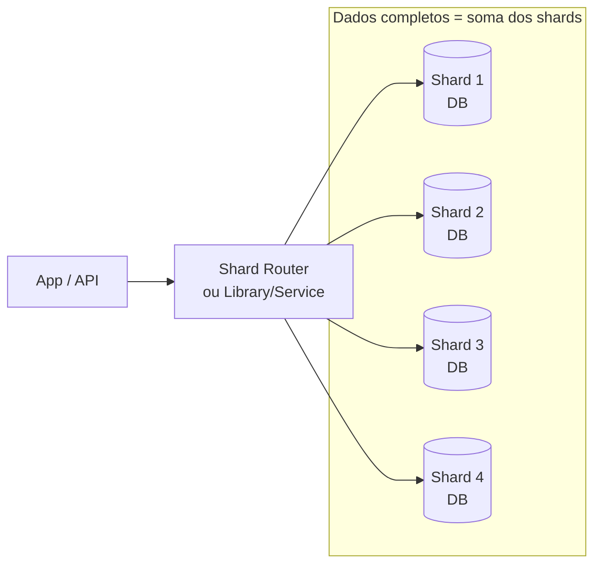
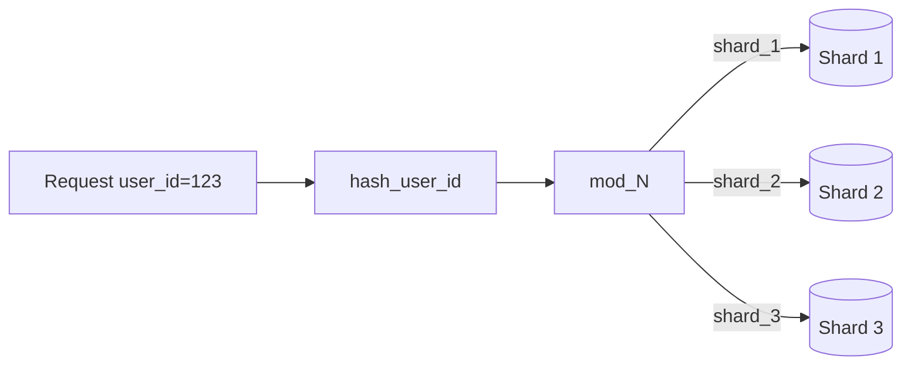
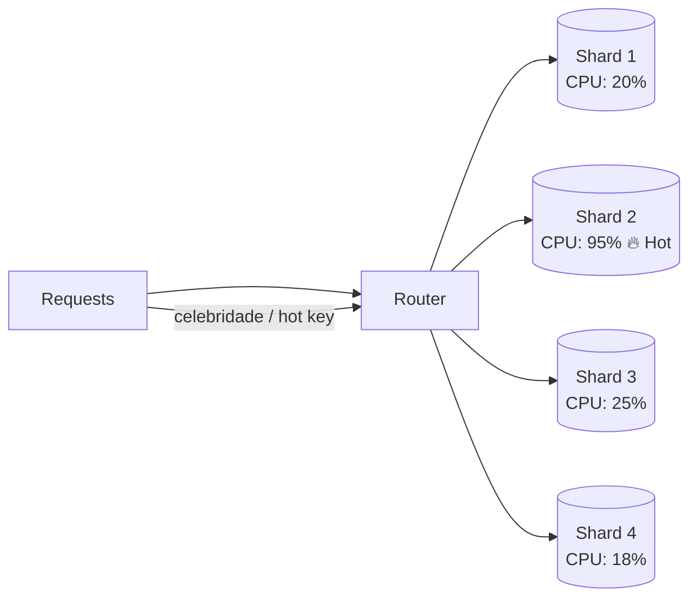
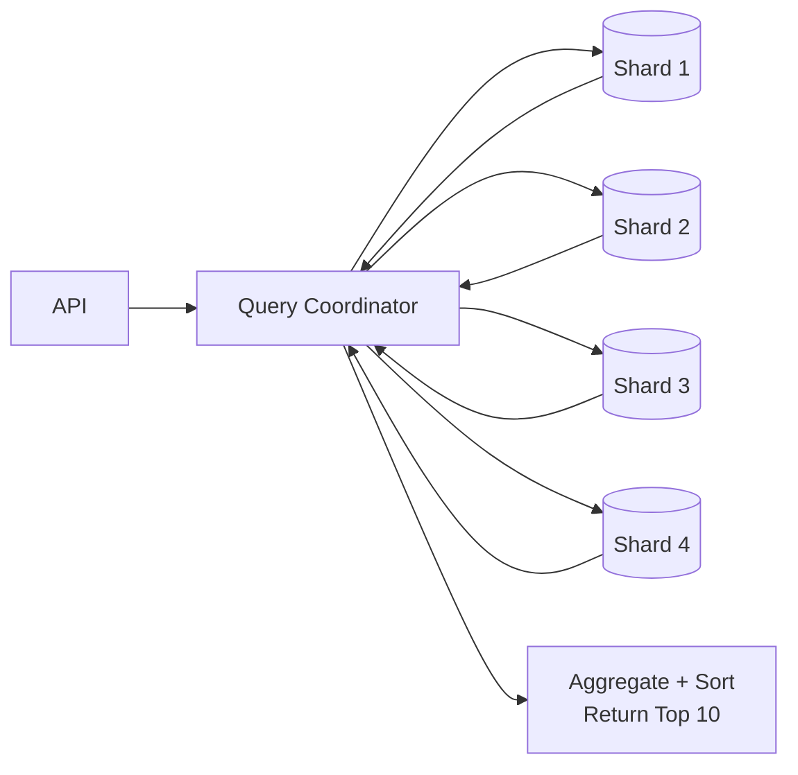

## Sharding

Seu app está decolando. O tráfego cresce, usuários se cadastram e o banco de dados fica cada vez maior. No começo, você resolve isso fazendo **scale up**: troca por uma instância maior, com mais CPU, memória e armazenamento. Funciona por um tempo.

Mas chega um ponto em que você atinge o limite do que **uma única máquina** aguenta. Consultas ficam lentas, escrita vira gargalo e o armazenamento chega perto do máximo. Até bancos fortes na nuvem (ex.: Amazon Aurora) têm teto (algo como **centenas de TB**).

Quando um único banco não dá conta, sobra essencialmente uma saída:

**Dividir os dados em várias máquinas.**

Isso é **sharding**. É necessário em grande escala, mas traz desafios: escolher a **shard key**, rotear queries, evitar **hotspots** e **rebalancear** dados quando os shards crescem.

> Observação comum: “partitioning” e “sharding” muitas vezes são usados como sinônimos.
> **Tecnicamente**:
>
> * **Partitioning**: divide dados **dentro da mesma instância** (mesma máquina/cluster lógico do mesmo DB).
> * **Sharding**: divide dados **entre máquinas diferentes** (vários bancos independentes).

---

## Primeiro: o que é Partitioning?

**Partitioning** é dividir uma tabela grande em partes menores **dentro do mesmo banco**. Você não adiciona máquinas; você organiza os dados para o banco trabalhar melhor.

Exemplo: uma tabela `orders` com 500 milhões de linhas e 2 TB. Uma query “pedidos do último mês” pode acabar varrendo coisa demais. Índices ficam enormes; operações de manutenção (vacuum/analyze/rebuild) ficam pesadas e podem travar.

Partitioning resolve dividindo em **partições**. Os dados continuam na mesma máquina, só ficam separados logicamente. A query do último mês olha apenas a partição relevante.

Tipos comuns:

* **Horizontal**: divide **linhas** (mesmas colunas, menos linhas por partição). Ex.: 1 partição por ano.
* **Vertical**: divide **colunas** (mesmas linhas, menos colunas por “partição”). Ex.: colunas mais acessadas separadas de colunas grandes/raras.

---

## O que é Sharding?

**Sharding** é **partitioning horizontal entre várias máquinas**. Cada shard guarda um **subconjunto** do dataset. Diferente do partitioning, sharding espalha carga por **bancos independentes**.

### Mermaid — visão geral de sharding (substitui a imagem “Sharding”)

Cada shard é um banco “standalone” com sua própria CPU, memória, storage e pool de conexões. Nenhuma máquina guarda tudo — isso permite escalar **capacidade** e **throughput** adicionando shards.

---

## Como fazer sharding

Você precisa decidir duas coisas (que andam juntas):

1. **Por qual campo shardear (shard key)**: define como os dados são agrupados.
2. **Como distribuir**: regra para mapear grupos → shards.

---

## Escolhendo a Shard Key

Em entrevistas é comum dizer “vou shardear por **[campo]**”. O segredo é justificar.

Uma shard key ruim causa:

* distribuição desigual,
* **hotspots** (um shard apanha e os outros ficam ociosos),
* queries que precisam bater em **todos** os shards.

Uma boa shard key costuma ter:

* **Alta cardinalidade** (muitos valores únicos),
* **Distribuição uniforme**,
* **Alinhamento com queries** (consultas comuns devem bater em **1 shard**).

Exemplos bons:

* 🟢 `user_id` (apps centrados no usuário)
* 🟢 `order_id` (e-commerce: buscar/atualizar pedido específico)

Exemplos ruins:

* 🔴 `is_premium` (boolean: no máximo 2 shards, um vira monstro)
* 🔴 `created_at` em tabelas crescendo (todos writes vão para o shard “mais recente”)

---

## Estratégias de Sharding

### 1) Range-based sharding

Você define faixas contínuas do valor (ex.: `user_id` 1–1M, 1M–2M…).

**Prós**: simples; bom para range scans.
**Contras**: tende a concentrar tráfego (ex.: dados “recentes” no último shard).

### 2) Hash-based sharding (padrão mais comum)

Você aplica hash no shard key e usa módulo:

`shard = hash(user_id) % N`

**Prós**: ótima distribuição.
**Contras**: adicionar/remover shards pode remapear “quase tudo” (precisa de estratégia de reshard).
Solução clássica: **consistent hashing** (move menos dados ao mudar N).

### Mermaid — hash-based routing

### 3) Directory-based sharding

Um “diretório” (tabela/serviço) diz onde cada chave mora.

**Prós**: flexível (mover usuário “celebridade” para shard dedicado).
**Contras**: toda request precisa de lookup; vira dependência crítica (SPOF/latência).
Em entrevistas, costuma ser “overkill” a menos que você tenha um motivo forte.

---

## Desafios do Sharding

### 1) Hot Spots e desequilíbrio de carga

Mesmo com shard key boa, alguns shards podem receber muito mais tráfego.

Causa comum: **problema da celebridade** (um usuário gera 1000x mais acesso). Mesmo com hash perfeito, o “hot key” continua caindo no mesmo shard.

### Mermaid — hotspot (substitui “Hot Spots”)

Como lidar:

* isolar hot keys em shards dedicados (mais fácil com directory-based),
* usar shard key composta (ex.: `hash(user_id + date)` dependendo do caso),
* split/migração dinâmica (alguns bancos ajudam nisso).

---

### 2) Operações “cross-shard”

Quando a query precisa de dados que estão em shards diferentes, ela fica cara:

* você consulta vários shards,
* espera respostas,
* agrega resultados no app/serviço.

Ex.: “top 10 posts globais” → precisa consultar *todos* os shards.

### Mermaid — fan-out para todos os shards (substitui “Cross-Shard Operations”)

Como minimizar:

* **cache** (ex.: “top 10” por 5 min),
* **denormalizar** para manter “dados relacionados” juntos,
* aceitar cross-shard para casos raros,
* pré-computar com job/stream (trending/leaderboards).

---

### 3) Manter consistência (transações distribuídas)

Em um único banco: transações são simples.
Em sharding: se dados de uma operação estão em shards diferentes, uma transação “única” não existe.

2PC existe, mas é lento e frágil; muita gente evita.

Alternativas:

* desenhar para **evitar transações cross-shard** (colocar dados do usuário no mesmo shard),
* usar **Sagas** (passos + compensações),
* aceitar **eventual consistency** quando fizer sentido.

---

## Sharding em bancos modernos

Muitos bancos distribuídos fazem sharding automaticamente quando você escolhe a “partition key”. Exemplos comuns:

* Cassandra, DynamoDB, MongoDB (com mecânicas diferentes)
* camadas SQL: Vitess (MySQL), Citus (Postgres)
* “distributed SQL” gerenciado: Spanner, Aurora etc.

Em entrevista normalmente basta:
“Vamos usar **user_id** como partition/shard key e um mecanismo de distribuição (hash/consistent hashing)”.

---

## Sharding em entrevistas de System Design

Quando mencionar:

* quando você provar o gargalo: **storage**, **write throughput**, **read throughput**.

Roteiro bom:

1. identificar gargalo,
2. explicar por que 1 DB não escala,
3. propor sharding,
4. dizer shard key + estratégia,
5. trade-offs (cross-shard, hotspots, resharding).

---
