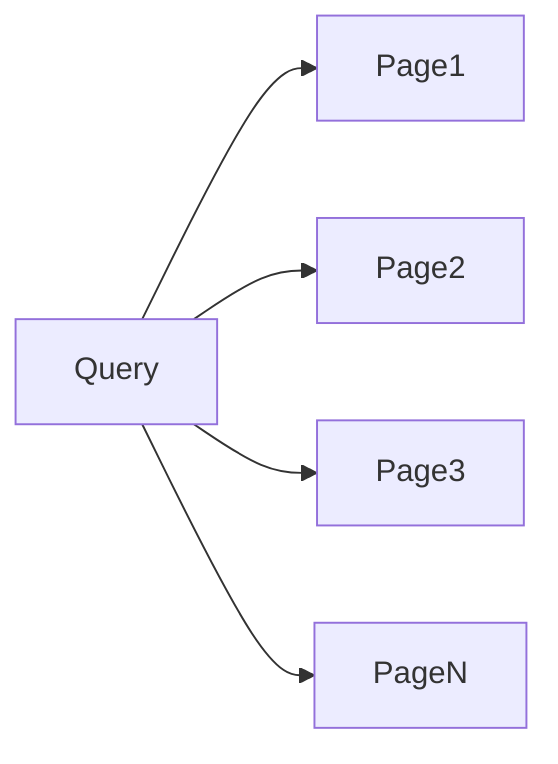
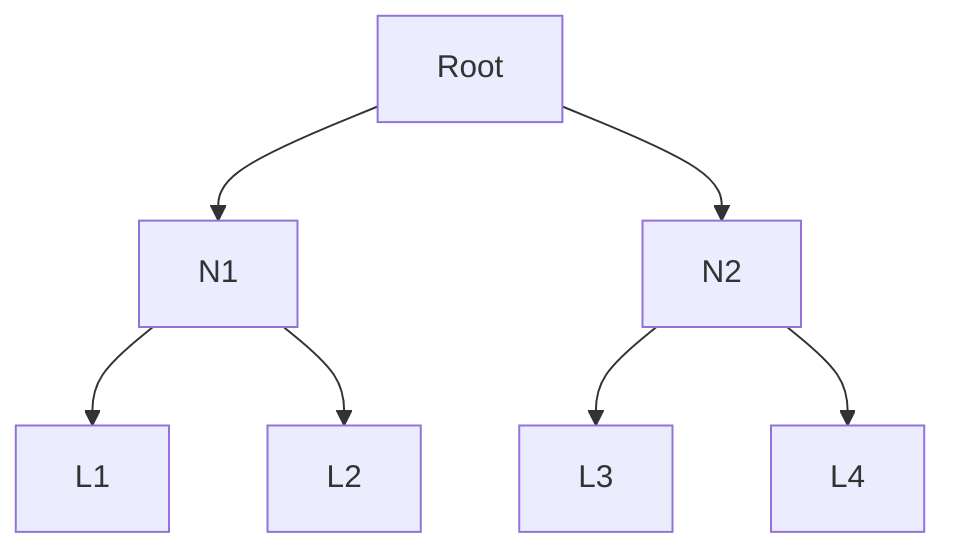

# Database Indexing

Aprenda como o **indexamento de bancos de dados** funciona e como **otimizar suas queries**.

---

## Por que indexação é tão importante?

Performance de banco de dados pode **fazer ou quebrar** aplicações modernas. Pense no que é necessário para buscar o perfil de um usuário pelo email em uma tabela com milhões de registros. Sem nenhuma otimização, o banco teria que verificar cada linha sequencialmente, escaneando todos os registros até encontrar uma correspondência.

Para uma tabela com milhões de linhas, isso se torna **dolorosamente lento** — como procurar um livro específico em uma biblioteca folheando **cada livro, um por um**.

É aqui que **índices** entram.

Ao manter **estruturas de dados separadas**, otimizadas para busca, os índices permitem que o banco localize rapidamente os registros desejados **sem examinar todas as linhas**.

Desde encontrar produtos em um catálogo de e-commerce até carregar perfis de usuários em uma rede social, **índices são o que tornam buscas rápidas possíveis**.

Saber **quando** adicionar um índice, **em quais colunas**, e **qual tipo de índice usar** é uma parte crítica de system design.
Em entrevistas, escolher os índices certos é frequentemente um ponto-chave:

* Engenheiros **pleno**: espera-se domínio de estratégias básicas
* Engenheiros **sênior/staff**: espera-se domínio de **tipos de índice e seus trade-offs**

Este deep dive cobre como índices funcionam **por baixo do capô** e os diferentes tipos que você vai encontrar. Começaremos com os conceitos centrais de armazenamento e acesso, e depois exploraremos tipos específicos como **B-trees**, **hash**, **geoespaciais**, **LSM**, entre outros.

---

## Como índices funcionam

Quando armazenamos dados em um banco, no fim das contas eles são escritos em disco como um conjunto de arquivos.
Os dados da tabela principal geralmente são armazenados como um **heap file** — essencialmente um conjunto de linhas **sem ordem específica**.

Pense nisso como um caderno onde você vai anotando entradas conforme elas chegam, uma após a outra.

---

## Armazenamento físico e padrões de acesso

A menos que você esteja entrevistando para um cargo focado em internals de banco de dados, esses detalhes não costumam ser cobrados diretamente. Ainda assim, eles são uma base importante para entender **por que índices existem**.

Bancos modernos enfrentam um desafio fundamental:

* Os dados vivem no disco (hoje, geralmente SSD)
* Mas só podem ser processados quando estão na **memória**

Isso significa que cada query envolve carregar páginas do disco para a RAM.

### Sem índice: scan sequencial

Sem um índice, o banco precisa ler **todas as páginas**, uma por uma, verificando se cada uma contém o dado procurado.



Com milhões de páginas, isso significa milhões de leituras de disco relativamente lentas apenas para encontrar **um único registro**.

Mesmo com:

* Cache
* Prefetch
* Buffer pools

… o problema fundamental permanece: **scan sequencial não escala**.

---

### Com índice: acesso direcionado

Com índices, mudamos completamente o padrão de acesso.
Em vez de ler tudo, seguimos um **caminho estruturado** diretamente até onde o dado está.


É a diferença entre:

* Ler todas as páginas de um livro
* Usar o índice para ir direto ao capítulo correto

Mesmo em SSDs, acesso aleatório ainda é significativamente mais lento que acesso sequencial.
Em HDDs, a diferença é **ainda mais dramática** — o que torna indexação absolutamente crítica.

---

## Custo dos índices

Índices **não são gratuitos**. Eles introduzem trade-offs importantes.

### Custo em armazenamento

Cada índice consome espaço em disco — às vezes quase tanto quanto os próprios dados.

### Custo em escrita

Em cada:

* INSERT
* UPDATE
* DELETE

o banco precisa atualizar:

* A tabela principal
* **Todos os índices associados**

Com muitos índices, uma única escrita pode gerar múltiplas operações de I/O.

### Quando índices podem atrapalhar

Casos clássicos:

* Tabelas com **muitas escritas e poucas leituras** (ex: logs)
* Tabelas muito pequenas (centenas de linhas)

Nesses cenários, o custo de manter índices pode superar seus benefícios.

Na prática, o impacto em memória costuma ser superestimado — bancos modernos gerenciam buffer pools de forma inteligente. Mesmo assim, é boa prática **monitorar o uso de índices** e remover os que não agregam valor.

---

# Tipos de Índices

Existem muitos tipos de índices, mas a maioria é especializada.
Em entrevistas de system design, você quase sempre vai discutir **um subconjunto pequeno e essencial**.

---

## Índices B-tree

Índices **B-tree** são o tipo mais comum de índice em bancos de dados.
Eles organizam dados de forma balanceada para garantir buscas, inserções e remoções eficientes.

---

### Estrutura de uma B-tree

Uma B-tree é uma árvore **auto-balanceada** que mantém dados ordenados.
Diferente de árvores binárias, cada nó pode ter **muitos filhos** (centenas, na prática).



Regras fundamentais:

* Todos os nós folha estão na mesma profundidade
* Cada nó contém entre `m/2` e `m` chaves
* Um nó com `k` chaves tem `k+1` filhos
* As chaves dentro do nó são mantidas ordenadas

Cada nó é dimensionado para caber em **uma página de disco** (ex: 8 KB), maximizando eficiência de I/O.

Buscar um registro pode exigir apenas:

* Nó raiz
* Um nó intermediário
* Um nó folha

Ou seja: **2–3 leituras de disco**.

---

### Exemplos do mundo real

B-trees estão por toda parte:

* **PostgreSQL**

  * Chaves primárias
  * Constraints únicas
  * Índices regulares

```sql
CREATE TABLE users (
  id SERIAL PRIMARY KEY,
  email VARCHAR(255) UNIQUE
);
```

Aqui, o PostgreSQL cria automaticamente **dois índices B-tree**.

* **MongoDB**

  * Usa B+ trees para seus índices

```js
db.users.createIndex({ email: 1 });
```

* **DynamoDB**

  * Organiza itens por sort key
  * Internamente usa uma arquitetura **LSM-style**, não B-tree

---

### Por que B-trees são o padrão

B-trees se tornaram padrão porque:

* Mantêm dados ordenados
* São auto-balanceadas
* Minimizam I/O
* Funcionam bem para igualdade **e** intervalos
* Evitam degradação com inserts aleatórios

👉 Em entrevistas: **B-tree é sempre uma escolha segura**.

---

## LSM Trees (Log-Structured Merge Trees)

B-trees funcionam muito bem para workloads balanceados.
Mas e quando você precisa lidar com **enormes volumes de escrita**?

Imagine um sistema como DataDog:

* Milhões de métricas por segundo
* Milhares de servidores
* Escritas contínuas

É aqui que **LSM Trees** brilham.

---

### Como LSM Trees funcionam

A ideia central:
**escrever sequencialmente** e organizar depois.

Fluxo simplificado:


* Escritas vão primeiro para memória (MemTable)
* Periodicamente, são “flushadas” para disco como SSTables
* Em background, ocorre **compaction**

---

### Trade-offs das LSM Trees

**Vantagens**

* Escritas extremamente rápidas
* Escrita sequencial (ótima para disco)
* Escala muito bem para ingestão massiva

**Desvantagens**

* Leituras mais caras (múltiplas SSTables)
* Compaction consome CPU e I/O
* Maior complexidade operacional

---

### Onde LSM Trees aparecem

* Cassandra
* HBase
* RocksDB
* DynamoDB (internamente)
* LevelDB

Em entrevistas:

* Use LSM quando o foco for **write throughput**
* Use B-tree quando precisar de **queries flexíveis e ordenação**

---

## Hash Indexes

Hash indexes usam uma função hash para mapear chaves diretamente a buckets.


### Características

* Extremamente rápidos para igualdade
* Não suportam range queries
* Pouco usados como padrão

Normalmente aparecem:

* Em caches
* Em estruturas internas
* Em casos muito específicos

---

## Índices Geoespaciais

Índices geoespaciais são usados para consultas como:

* “Pontos dentro de um raio”
* “Regiões que se sobrepõem”

Estruturas comuns:

* R-trees
* Quadtrees
* GiST (no PostgreSQL)


Em entrevistas:

* Mencione quando trabalhar com mapas, localização, logística

---

## Índices Full-text

Full-text search permite buscas por palavras, relevância e ranking.

* PostgreSQL: `tsvector`, `tsquery`
* MongoDB: text indexes
* Alternativa dedicada: Elasticsearch

Use quando:

* Busca textual é importante
* LIKE `%texto%` não escala

---

# Como falar sobre índices em entrevistas

Quando discutir indexação:

1. **Explique o padrão de acesso**
2. **Escolha o índice com base nisso**
3. **Mostre que entende os custos**
4. **Evite indexar “por reflexo”**

Frase forte de entrevista:

> “Eu adicionaria esse índice porque otimiza o caminho crítico de leitura, aceitando o custo adicional de escrita.”

---

# Conclusão

Índices são fundamentais para performance de bancos de dados modernos. Eles transformam scans lineares em acessos direcionados, permitindo que sistemas escalem para milhões ou bilhões de registros.

Entender **como índices funcionam**, **quando usá-los** e **quais trade-offs eles introduzem** é essencial para qualquer engenheiro que participe de system design — especialmente em entrevistas.
