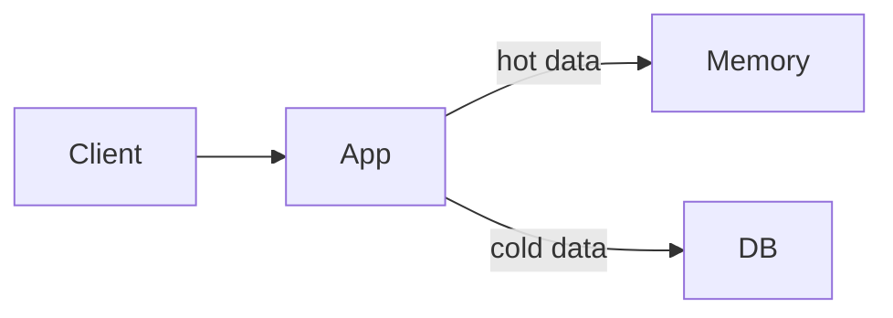
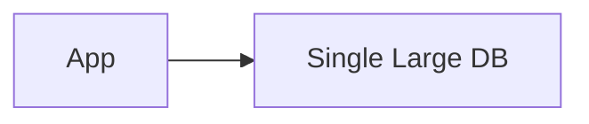
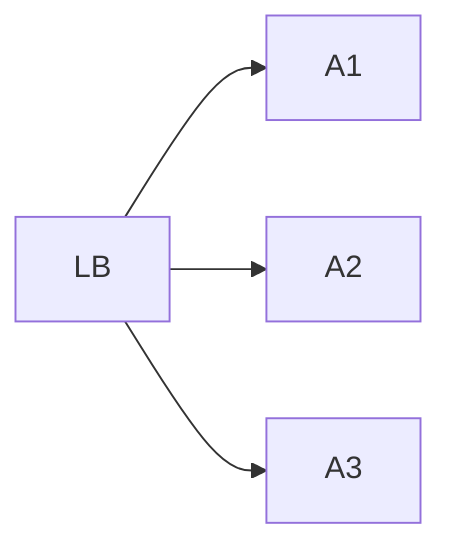

# Numbers to Know

Aprenda **quais números você precisa conhecer** para entrevistas de **System Design**.

---

Nossa indústria evolui rapidamente. O hardware sobre o qual construímos sistemas muda o tempo todo, o que significa que até livros relativamente recentes podem ficar desatualizados muito rápido. Um livro publicado há apenas alguns anos pode ainda ensinar padrões corretos, mas citar números que estão **errados por ordens de magnitude**.

Um dos maiores sinais de que um candidato tem apenas conhecimento teórico, mas pouca experiência prática, em uma entrevista de system design, é quando ele se apoia em **restrições de hardware ultrapassadas**. Ele faz cálculos de escala usando números de 2015 (ou até 2020!) que subestimam drasticamente o que sistemas modernos conseguem fazer. Surgem preocupações com tamanho de banco, limites de memória e custo de armazenamento que faziam sentido naquela época, mas que hoje levariam a soluções **superdimensionadas e desnecessariamente complexas**.

Isso não é culpa do candidato — ele está fazendo a coisa certa ao estudar. Mas entender as **capacidades reais do hardware moderno** é crucial para tomar boas decisões de system design.
Quando shardear um banco, quando cachear agressivamente, como lidar com objetos grandes — todas essas decisões dependem de ter uma noção realista do que o hardware atual suporta.

Vamos olhar para os números que **realmente importam em 2025**.

---

# Limites de Hardware Moderno

Servidores modernos concentram um poder computacional impressionante.

Uma instância **AWS M6i.32xlarge** oferece:

* **512 GiB de RAM**
* **128 vCPUs**
* Ideal para workloads gerais

Instâncias otimizadas para memória vão ainda mais longe:

* **X1e.32xlarge**: ~4 TB de RAM
* **U-24tb1.metal**: até **24 TB de RAM**

Esse salto é extremamente relevante. Muitas aplicações que antes **exigiam sistemas distribuídos** agora conseguem rodar confortavelmente em **uma única máquina**.

---

## Armazenamento

A capacidade de armazenamento também cresceu de forma significativa.

* **i3en.24xlarge**: ~60 TB de SSD local
* **D3en.12xlarge**: ~336 TB de HDD local
* **Object storage (S3)**: praticamente ilimitado, petabytes são comuns

Hoje, armazenamento raramente é o principal gargalo.
O problema deixou de ser *“cabe ou não cabe”* e passou a ser *“como organizar e acessar eficientemente”*.

---

## Rede e Latência

A rede não ficou para trás:

* **Dentro do datacenter**:

  * 10 Gbps é comum
  * Até 20 Gbps em instâncias de alto desempenho
* **Entre regiões**:

  * 100 Mbps a 1 Gbps
* **Latência**:

  * 1–2 ms intra-região
  * 50–150 ms inter-região

Essa previsibilidade torna possível projetar sistemas distribuídos com **comportamento consistente**, desde que você respeite as leis da física.

---

## O impacto real dessas mudanças

Esses números não são melhorias incrementais — são uma **mudança de patamar**.

Quando livros falam em:

* “Shardear banco aos 100 GB”
* “Evitar objetos grandes em memória”
* “Não carregar muitos dados em RAM”

Eles estão partindo de **restrições antigas**.
O hardware atual muda fundamentalmente como pensamos system design.

---

# Aplicando Esses Números em Entrevistas de System Design

Agora vamos ver como esses números influenciam decisões práticas em entrevistas.

---

## Caching

Uma das perguntas mais comuns:

> “Precisamos de cache?”

Hoje, um único servidor pode ter **centenas de gigabytes de RAM**.

Isso significa:

* Muitas tabelas inteiras podem caber em memória
* Caches locais (in-process) já resolvem vários problemas
* Cache distribuído só se justifica quando:

  * Há múltiplas instâncias
  * Há necessidade de consistência compartilhada
  * O volume ultrapassa facilmente a RAM de um nó

**Erro comum em entrevista:**
Introduzir Redis logo de cara, sem justificar por volume, latência ou concorrência.

Frase madura:

> “Antes de um cache distribuído, eu avaliaria quanto do dataset cabe em RAM local.”

---

## Bancos de Dados

Com discos grandes e memória abundante:

* Bancos **relacionais** escalam muito mais verticalmente do que antigamente
* Um banco único com centenas de GB ou até poucos TB **não é absurdo**
* Sharding precoce adiciona:

  * Complexidade
  * Riscos operacionais
  * Dificuldade de transações

Shardear faz sentido quando:

* Escrita ultrapassa o que um nó aguenta
* Conjuntos de dados crescem para dezenas de TB
* Latência geográfica é requisito

---

## Application Servers

Hoje é normal rodar:

* 50–200 threads
* Centenas de conexões simultâneas
* Processar milhares de requisições por segundo

Em entrevistas:

* Não subestime um único servidor
* Use múltiplos nós para:

  * Alta disponibilidade
  * Isolamento de falhas
  * Escala horizontal previsível

---

## Message Queues

Filas modernas lidam com volumes enormes:

* Kafka: milhões de mensagens por segundo
* SQS / PubSub: escala praticamente ilimitada
* Latência geralmente na casa de **milissegundos**

O erro clássico:

> “Vamos colocar uma fila porque sim.”

Fila faz sentido quando:

* Precisamos desacoplar produtores e consumidores
* Precisamos absorver picos
* Precisamos de reprocessamento

---

# Cheat Sheet – Números Importantes (2025)

### Latência

* L1 cache: ~1 ns
* RAM: ~100 ns
* SSD: ~100 µs
* Rede intra-região: ~1 ms
* Rede inter-região: ~100 ms

### Capacidade

* RAM por nó: 128 GB → vários TB
* SSD local: dezenas de TB
* Object storage: petabytes

### Throughput

* Rede local: 10–20 Gbps
* Bancos modernos: dezenas de milhares de QPS por nó
* Filas: milhões de msgs/s

---

# Erros Comuns em Entrevistas

## 1) Usar números desatualizados

> “100 GB é muito para um banco”

Hoje, muitas vezes **não é**.

---

## 2) Superdistribuir cedo demais

Shardear, cachear e particionar sem necessidade real.

---

## 3) Ignorar latência de rede

Especialmente entre regiões.

---

## 4) Confundir limite técnico com limite organizacional

Às vezes o problema não é hardware — é operação, custo ou time.

---

# Conclusão

Conhecer números modernos é tão importante quanto conhecer padrões arquiteturais. Decisões de system design não existem no vácuo — elas são moldadas pelo que o hardware **realmente consegue fazer hoje**.

Em entrevistas, candidatos fortes:

* Usam números realistas
* Justificam decisões com base em capacidade atual
* Evitam over-engineering
* Mostram maturidade ao escalar **quando necessário**, não antes
