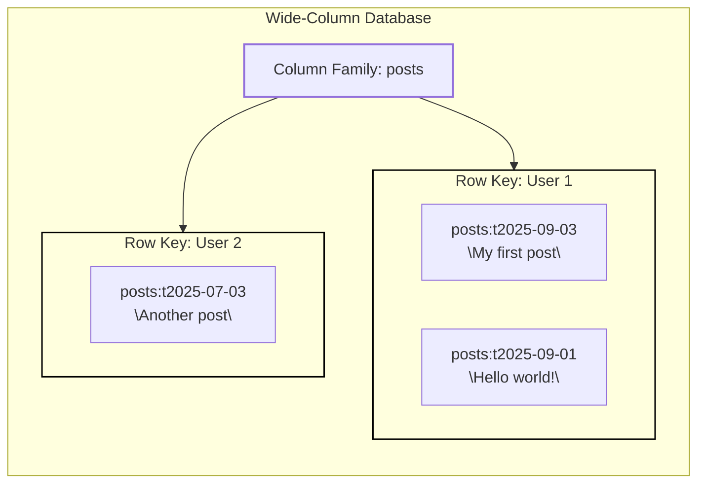
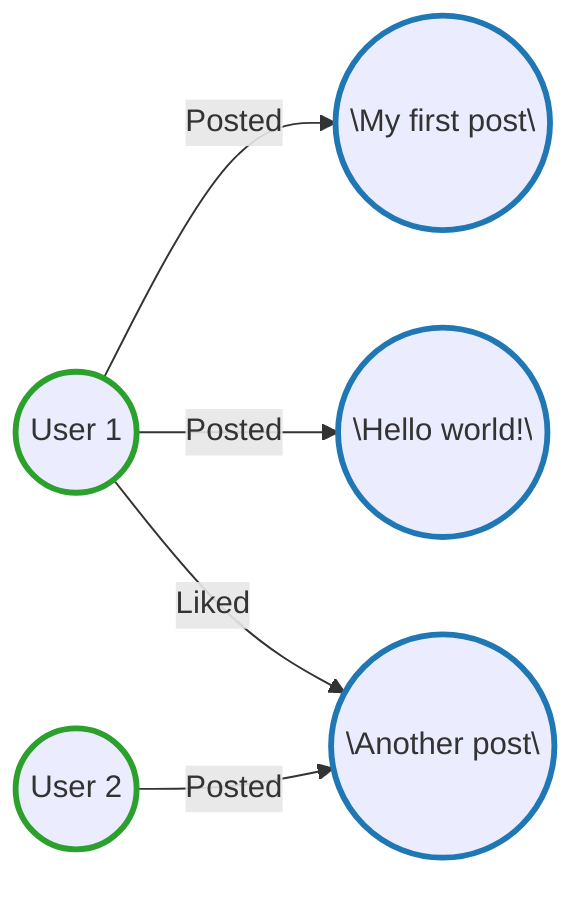
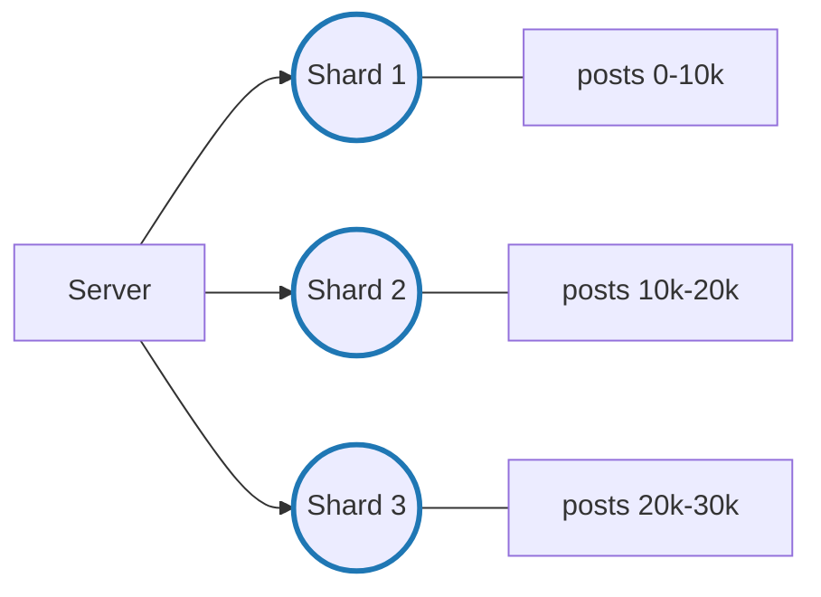

## Modelagem de Dados (Data Modeling)

Aprenda sobre modelagem de dados para entrevistas de design de sistemas.

Modelagem de dados é o processo de definir como os dados da sua aplicação são estruturados, armazenados e relacionados. Na prática, isso significa decidir quais entidades existem, como elas são identificadas e como se conectam entre si.

Em uma entrevista de *system design*, o nível de exigência é bem menor do que em uma entrevista específica de modelagem de dados (comum em processos de data engineering). Você **não** precisa normalizar tudo nem produzir um diagrama de esquema completo. O esperado é algo **claro, funcional e alinhado aos requisitos do sistema**.

No framework de *Delivery*, a modelagem de dados aparece duas vezes:

1. **Durante o levantamento de requisitos**, quando você identifica as entidades principais. Normalmente, elas mapeiam 1:1 para tabelas ou coleções e formam a base do esquema.
2. **Na etapa de High-Level Design**, quando você esboça um esquema básico ao lado do componente de banco de dados, incluindo campos principais, relacionamentos e uma observação sobre índices ou particionamento para suportar os principais padrões de consulta.

Isso já é suficiente para a maioria dos entrevistadores perceber que seu modelo de dados não vai desmoronar sob uso real.

```mermaid
erDiagram
  USERS {
    userId PK
    name
    email UNIQUE
    createdAt
  }

  POSTS {
    postId PK
    userId FK
    content
    mediaUrls
    createdAt
  }

  COMMENTS {
    commentId PK
    postId FK
    userId FK
    content
    createdAt
  }

  USERS ||--o{ POSTS : creates
  USERS ||--o{ COMMENTS : writes
  POSTS ||--o{ COMMENTS : has
```
---

## Modelagem de Dados em uma Entrevista

Um esquema razoável é mais do que apenas desenhar caixas. Ele sustenta o restante do design: escalabilidade de leituras e escritas, preservação de consistência quando necessário e respostas sobre crescimento ou auditoria sem precisar voltar atrás.

Um modelo de dados mal feito gera problemas dolorosos no futuro. Um modelo **“bom o suficiente”** mantém a conversa focada onde realmente importa.

---

## Opções de Modelos de Banco de Dados

Antes de desenhar o esquema, você precisa escolher o tipo de banco de dados. Modelos diferentes influenciam diretamente como os dados serão estruturados.

Em entrevistas, há a tentação de impressionar escolhendo bancos “exóticos”. **Evite isso.**
Na maioria dos casos, a resposta correta é **um banco relacional**. Ele é o padrão, a menos que os requisitos indiquem claramente algo diferente.

Se você não tiver experiência sólida e opiniões bem fundamentadas sobre outro tipo de banco, a recomendação é simples: **use PostgreSQL**.

Isso não significa que outros modelos não sejam importantes. Mostrar que você sabe *quando* usá-los demonstra maturidade e entendimento de trade-offs. Ainda assim, o protagonista costuma ser o SQL.

---

## Bancos de Dados Relacionais (SQL)

Bancos relacionais organizam dados em tabelas com esquemas fixos, onde:

* Linhas representam entidades
* Colunas representam atributos
* Relacionamentos são impostos por chaves estrangeiras
* Transações seguem garantias **ACID**

A maioria dos problemas de system design se encaixa naturalmente nesse modelo.
Exemplos:

* Rede social: usuários, posts, comentários, curtidas
* E-commerce: usuários, produtos, pedidos, pagamentos

Tudo isso se encaixa bem em tabelas relacionais com integridade garantida por constraints e foreign keys.

### Exemplo: Tabela `users`

| id (PK) | username | email                                       | created_at       |
| ------- | -------- | ------------------------------------------- | ---------------- |
| 1       | john_doe | [john@example.com](mailto:john@example.com) | 2024-01-01 10:00 |
| 2       | jane_doe | [jane@example.com](mailto:jane@example.com) | 2024-01-01 10:05 |

### Tabela `posts`

| id (PK) | user_id (FK) | content | created_at |
| ------- | ------------ | ------- | ---------- |

### Tabela `likes`

| id (PK) | user_id (FK) | post_id (FK) | created_at |
| ------- | ------------ | ------------ | ---------- |

SQL é excelente para consultas complexas. Buscar *“todos os posts de usuários seguidos por alguém, ordenados por data”* é simples com *joins*.

⚠️ **Cuidado**: *joins* entre muitas tabelas podem virar armadilhas de performance em grande escala. Em entrevistas, mencionar consultas muito complexas pode levantar alertas. Pense em:

* Views desnormalizadas
* Cache
* Dados pré-computados

Quando **consistência forte** é requisito (pagamentos, estoque, cobranças), as garantias ACID do SQL são a escolha correta.

O argumento comum contra bancos relacionais é escalabilidade — e isso costuma ser exagerado.
Bancos SQL modernos escalam bem com:

* Réplicas de leitura
* Sharding
* Pool de conexões
* Cache

Empresas como Facebook, Airbnb e Stripe usam bases relacionais em larga escala.

**Exemplos:** PostgreSQL, MySQL, SQLite.

---

## Bancos de Documentos

Bancos de documentos armazenam dados em estruturas tipo JSON, com esquemas flexíveis. São úteis quando você não conhece todos os campos antecipadamente.

Em vez de tabelas separadas, você **embute dados relacionados** dentro do documento.

### Exemplo: coleção `users`

```json
{
  "_id": "507f1f77bcf86cd799439011",
  "username": "john_doe",
  "email": "john@example.com",
  "posts": [
    {
      "content": "Hello, world!",
      "created_at": "2024-01-01T10:00:00Z"
    }
  ],
  "created_at": "2024-01-01T10:00:00Z"
}
```

Isso elimina *joins*, mas atualizar um post exige atualizar o documento inteiro.

Em entrevistas, os requisitos geralmente são bem definidos, então **raramente existe “esquema em constante mudança”**. Por isso, bancos de documentos quase nunca são a melhor escolha.

**Quando considerar em vez de SQL:**

* Esquemas que mudam com frequência
* Dados profundamente aninhados
* Registros com estruturas muito diferentes entre si

**Impacto na modelagem:**
Mais desnormalização, mais dados duplicados, menos consistência — em troca de leitura mais rápida.

**Exemplos:** MongoDB, Firestore, CouchDB.

---

## Bancos Key-Value

Bancos key-value fazem buscas extremamente rápidas por chave exata. Porém, oferecem pouquíssima flexibilidade de consulta.

**Quando considerar:**

* Cache
* Sessões
* Feature flags
* Workloads com escrita muito intensa

Na prática, eles **complementam** o SQL, não o substituem.
O padrão clássico é:

* SQL como fonte da verdade
* Cache key-value (ex: Redis) para dados quentes

**Impacto na modelagem:**
Modelo extremamente plano, altamente desnormalizado, com dados duplicados para suportar diferentes padrões de acesso.


```mermaid
flowchart LR
  S[Server]
  KV[(Key-Value Store)]
  PG[(Database (Postgres))]

  S -->|1. Check cache| KV
  S -->|2. If miss, check DB| PG
  PG -.->|Populate cache (flattened doc by query pattern)| KV

  subgraph PG_SCHEMA[Postgres Schema]
    direction TB

    subgraph USERS_T[Users]
      direction TB
      U1[userId (pk)]
      U2[name]
      U3[email (unique)]
      U4[createdAt]
    end

    subgraph POSTS_T[Posts]
      direction TB
      P1[postId (pk)]
      P2[userId (fk, index)]
      P3[content]
      P4[mediaUrls]
      P5[createdAt (index)]
    end

    subgraph COMMENTS_T[Comments]
      direction TB
      C1[commentId (pk)]
      C2[postId (fk, index)]
      C3[userId (fk, index)]
      C4[content]
      C5[createdAt (index)]
    end

    U1 -->|1:N| P2
    U1 -->|1:N| C3
    P1 -->|1:N| C2
  end

  PG --- PG_SCHEMA

  style KV stroke:#1f77ff,stroke-width:3px
```

**Exemplos:** Redis, DynamoDB, Memcached.

---

## Bancos Wide-Column

Bancos wide-column organizam dados em famílias de colunas e são otimizados para:

* Escritas massivas
* Dados de séries temporais
* Append-only workloads

Cada nova escrita adiciona colunas, sem alterar dados existentes.

**Quando considerar:**

* Telemetria
* Logs de eventos
* IoT
* Analytics em larga escala

**Impacto na modelagem:**
Modelagem totalmente guiada por padrões de consulta, com duplicação de dados e tempo como elemento central.

**Exemplos:** Cassandra, HBase.



---

## Bancos de Grafos

Bancos de grafos armazenam dados como nós e arestas, otimizados para navegar relacionamentos.

**Honestamente?** Quase nunca são a melhor escolha em entrevistas.
Mesmo empresas com grafos gigantes (Facebook, LinkedIn) usam SQL para os dados centrais.

Eles soam sofisticados, mas adicionam complexidade operacional desnecessária.

**Exemplos:** Neo4j, Amazon Neptune.



---

## Fundamentos de Design de Esquema

### Comece pelos Requisitos

Tudo gira em torno de três fatores:

1. **Volume de dados**
   Pode exigir separação física de dados (ex: usuários e posts em bancos diferentes).

2. **Padrões de acesso** (o mais importante)
   Pergunte: *quais queries cada endpoint precisa suportar?*

3. **Requisitos de consistência**

   * Financeiro → consistência forte
   * Feed de atividades → consistência eventual

Em entrevistas, **conecte explicitamente suas decisões a esses fatores**.

---

## Entidades, Chaves e Relacionamentos

Exemplo de rede social:

* users (id PK)
* posts (id PK, user_id FK)
* comments (id PK, post_id FK, user_id FK)
* likes (user_id FK, post_id FK)

Relacionamentos:

* 1:N → usuário → posts
* N:M → usuários ↔ posts (likes)
* 1:1 → raro e geralmente evitável

Foreign keys garantem integridade, mas custam performance em escrita. Em escala extrema, algumas empresas as removem e validam na aplicação — citar isso em entrevista mostra maturidade.

---

## Indexação para Padrões de Acesso

Índices aceleram consultas.

Exemplo:

* Índice em `posts.user_id`
* Índice em `posts.created_at`
* Índice composto `(user_id, created_at)`

Sempre conecte índices aos endpoints:

> “O endpoint GET /users/{id}/posts precisa de índice em posts.user_id”.

---

## Normalização vs Desnormalização

**Normalizado:**
Cada dado existe em um único lugar → menos inconsistência.

**Desnormalizado:**
Dados repetidos → leitura mais rápida, manutenção mais difícil.

Em entrevistas:

* Comece normalizado
* Desnormalize apenas quando necessário
* Prefira cache para otimizações de leitura

Exceções válidas:

* Analytics
* Logs
* Sistemas extremamente read-heavy

---

## Escalabilidade e Sharding

Quando um banco não comporta mais os dados, é preciso shardear.

Regra de ouro: **shard pelo principal padrão de acesso**.

* “Posts por usuário” → shard por `user_id`
* “Posts recentes globais” → shard por tempo

Evite consultas cross-shard sempre que possível.


---

## Conclusão

Modelagem de dados é essencial em entrevistas de system design, mas **não é o foco principal**.

O objetivo é:

* Criar um esquema razoável
* Alinhado aos requisitos
* E seguir adiante com o design do sistema

Comece simples, explique suas decisões e mostre que você sabe ajustar o modelo conforme o sistema cresce.
Segue o **Mermaid final**, limpo e fiel ao *Final Whiteboard*, focado apenas no **modelo relacional em Postgres** (sem cache, sem sharding, sem wide-column), exatamente como costuma fechar uma entrevista de *System Design*.

---

```mermaid
erDiagram
  USERS {
    userId PK
    name
    email UNIQUE
    createdAt
  }

  POSTS {
    postId PK
    userId FK
    content
    mediaUrls
    createdAt
  }

  COMMENTS {
    commentId PK
    postId FK
    userId FK
    content
    createdAt
  }

  USERS ||--o{ POSTS : creates
  USERS ||--o{ COMMENTS : writes
  POSTS ||--o{ COMMENTS : has
```

---

### Por que esse é um **bom “final board” de entrevista**

* ✅ **Modelo simples e normalizado**
* ✅ Relacionamentos claros (1:N e N:M via tabela intermediária implícita)
* ✅ Índices nos campos de acesso mais comum
* ✅ PostgreSQL como *default choice*
* ✅ Fácil de evoluir para:

  * cache
  * sharding
  * denormalização controlada

---
