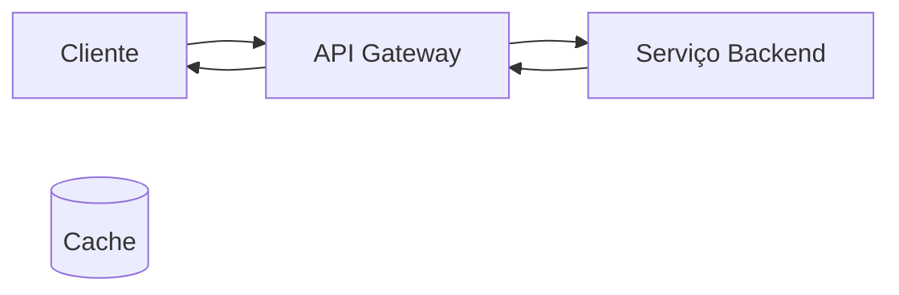
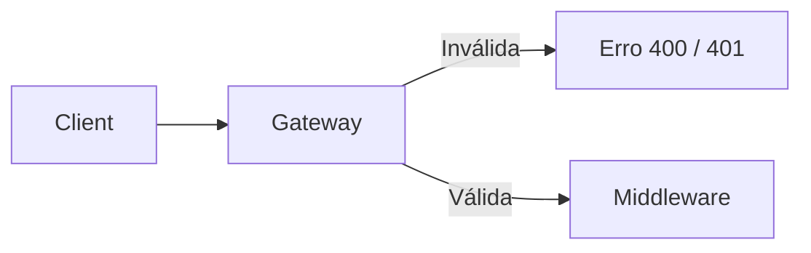
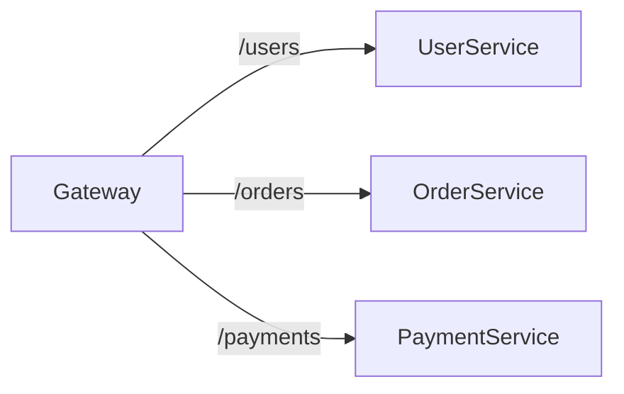
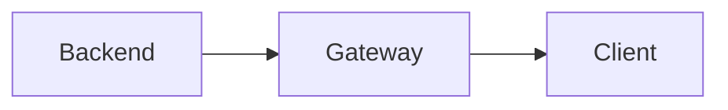
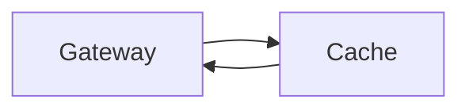
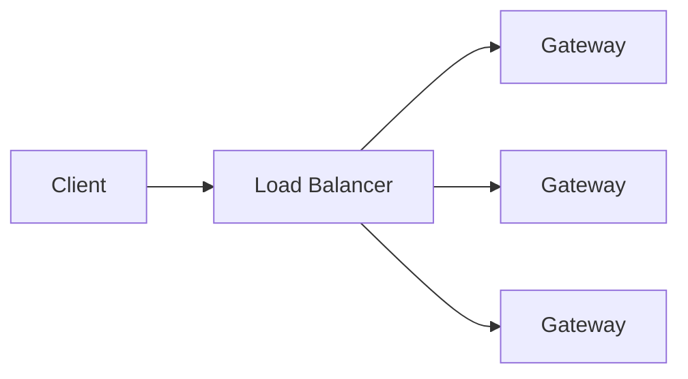
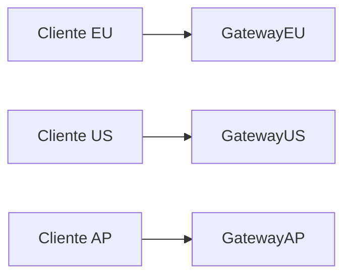

# API Gateway

Aprenda **quando** e **como** incorporar **API Gateways** de forma eficaz em entrevistas de *System Design*.

---

## O que é um API Gateway?

Há uma grande chance de você já ter interagido com um **API Gateway hoje**, mesmo sem perceber. Ele é um **componente central das arquiteturas modernas**, especialmente com a popularização de **microserviços**.

Pense nele como a **recepção de um hotel de luxo**. Assim como hóspedes não precisam saber onde ficam a lavanderia ou a manutenção, **clientes não deveriam precisar conhecer a estrutura interna dos seus microserviços**.

Um **API Gateway** atua como um **ponto único de entrada** para todas as requisições dos clientes, sendo responsável por **gerenciar e encaminhar** essas requisições para os serviços de backend adequados.
Da mesma forma que a recepção cuida de check-in, alocação de quartos e solicitações dos hóspedes, o gateway cuida de **middleware centralizado**, como autenticação, roteamento e tratamento de requisições.

A evolução dos API Gateways acompanha diretamente o surgimento da **arquitetura de microserviços**. À medida que aplicações monolíticas foram divididas em serviços menores e especializados, surgiu a necessidade de um **ponto central de controle**.
Sem um API Gateway, os clientes precisariam se comunicar diretamente com múltiplos serviços — seria como pedir para o hóspede procurar cada funcionário do hotel para resolver algo diferente.

API Gateways são **componentes finos e relativamente simples**, com um propósito bem definido. Aqui, o foco é **o que você precisa saber para entrevistas de system design**, sem complexidade desnecessária.

---

## Responsabilidades Principais

A **função principal** de um API Gateway é o **roteamento de requisições** — decidir **qual serviço de backend** deve tratar cada chamada.

Curiosamente, em entrevistas, muitos candidatos introduzem um gateway e falam bastante de *middleware*, mas **esquecem de mencionar o motivo principal da sua existência: roteamento**.

Hoje em dia, além do roteamento, os API Gateways também lidam com preocupações transversais (*cross-cutting concerns*), como:

* Autenticação
* Rate limiting
* Cache
* Terminação SSL/TLS
* Logging e monitoramento
* Entre outros

---

## Fluxo de uma Requisição

Vamos acompanhar uma requisição do início ao fim.

### Visão Geral do Fluxo

---

### Etapas do Fluxo

1. Validação da requisição
2. Execução de middleware (auth, rate limiting, etc.)
3. Roteamento para o serviço correto
4. Processamento no backend
5. Transformação da resposta
6. Cache opcional

---

## 1) Validação da Requisição

Antes de qualquer outra coisa, o API Gateway verifica se a requisição:

* Possui URL válida
* Contém headers obrigatórios
* Possui body no formato esperado

Essa validação antecipada evita que requisições inválidas cheguem aos serviços internos.
Por exemplo, se um app mobile envia um JSON malformado ou esquece uma API key, **não faz sentido propagar essa requisição**. O gateway pode rejeitá-la rapidamente, economizando recursos.

---

## 2) Middleware

O API Gateway pode executar diversas tarefas de middleware, como:

* Autenticação (JWT, OAuth)
* Rate limiting
* Terminação SSL
* Logging e monitoramento
* Compressão de respostas
* CORS
* Whitelist / blacklist de IPs
* Validação de tamanho da requisição
* Timeout de respostas
* Versionamento de APIs
* Throttling
* Integração com service discovery

Para **entrevistas**, os mais relevantes são:

* Autenticação
* Rate limiting
* IP whitelist/blacklist

💡 **Dica de entrevista**
Basta dizer algo como:

> “Vou usar um API Gateway para lidar com roteamento e middleware básico.”

E seguir em frente.

---

## 3) Roteamento

O gateway mantém uma **tabela de roteamento** que mapeia requisições para serviços de backend, com base em:

* Path da URL
* Método HTTP
* Query parameters
* Headers

Exemplo de roteamento:

O gateway avalia rapidamente essas regras e encaminha a requisição ao serviço correto.

---

## 4) Comunicação com o Backend

Normalmente os serviços usam **HTTP**, mas em alguns casos podem usar **gRPC** internamente.

O API Gateway pode **traduzir protocolos**, permitindo que:

* Clientes usem HTTP
* Serviços internos usem gRPC (ou outro protocolo)

Isso desacopla clientes da implementação interna.

---

## 5) Transformação da Resposta

O gateway transforma a resposta do backend no formato esperado pelo cliente.

Exemplo conceitual:

Internamente o serviço pode usar gRPC, Protobuf ou outro formato, enquanto o cliente recebe **JSON limpo e consistente**.

---

## 6) Cache

Antes de devolver a resposta, o gateway pode **armazená-la em cache**, especialmente se:

* Os dados não mudam com frequência
* A resposta não é específica por usuário

Estratégias comuns:

* Cache completo de resposta
* Cache parcial
* Invalidação por TTL ou eventos

O cache pode ser **em memória** ou distribuído (ex: Redis).

---

## Escalando um API Gateway

Há duas dimensões principais: **carga** e **distribuição geográfica**.

---

### Escalabilidade Horizontal

API Gateways costumam ser **stateless**, o que facilita escalar horizontalmente.

**Importante distinguir:**

* **Client → Gateway**: geralmente um load balancer dedicado (ELB, NGINX)
* **Gateway → Serviços**: o próprio gateway pode balancear entre instâncias

💡 Em entrevistas, **um único bloco “API Gateway + Load Balancer” é suficiente**.

---

### Distribuição Global

Para aplicações globais, o gateway pode ser distribuído por região:

* Deploy regional
* GeoDNS
* Sincronização de configuração

---

## API Gateways Populares

### Serviços Gerenciados

* **AWS API Gateway**
* **Azure API Management**
* **Google Cloud Endpoints**

Vantagem: integração total com a nuvem
Desvantagem: custo

---

### Soluções Open Source

* **Kong**
* **Tyk**
* **Express Gateway**

Ideais para **on-premises** ou maior controle.

---

## Quando Propor um API Gateway?

**Resumo rápido (TL;DR):**

✅ Use quando:

* Arquitetura de microserviços
* Múltiplos serviços backend
* Necessidade de desacoplamento cliente ↔ serviços

❌ Evite quando:

* Arquitetura simples cliente-servidor
* Aplicação monolítica
* Um único tipo de cliente

Em sistemas simples, um API Gateway pode ser **complexidade desnecessária**.

---
