# **Apache Cassandra**

Aprenda como você pode usar o **Cassandra** para resolver uma grande variedade de problemas em **System Design**.

---

## 📘 O que é Cassandra?

Bancos de dados são um dos pilares do system design, e um dos mais versáteis e populares que você pode ter em sua caixa de ferramentas é o **Cassandra**.

O Cassandra foi originalmente desenvolvido pelo Facebook para suportar o rápido crescimento do recurso de **busca de mensagens da inbox**. Desde então, foi adotado por inúmeras empresas para escalar armazenamento, throughput e leitura de dados. Empresas como **Discord, Netflix, Apple e Bloomberg** utilizam Cassandra em produção.

O **Apache Cassandra** é um banco de dados **NoSQL distribuído e open-source**, que implementa um modelo de **wide-column store particionado**, com **consistência eventual**. Ele roda em **clusters**, escala horizontalmente usando hardware comum e combina ideias do **Dynamo** e do **Bigtable** para lidar com grandes volumes de dados, alto volume de consultas e requisitos flexíveis de armazenamento.

---

## 🧱 Fundamentos do Cassandra

### Modelo de Dados

Os principais conceitos do modelo de dados do Cassandra são:

* **Keyspace**
  Unidade organizacional de mais alto nível (equivalente a um *database* em bancos relacionais).
  Define **estratégias de replicação** e contém **UDTs (User Defined Types)**.

* **Table**
  Vive dentro de um keyspace. Define colunas e a estrutura da **primary key**.

* **Row**
  Um registro identificado unicamente por sua **primary key**.

* **Column**
  Unidade real de armazenamento.
  ➜ Nem todas as colunas precisam existir em todas as linhas
  ➜ Cada coluna possui um **timestamp**
  ➜ Conflitos são resolvidos por **Last Write Wins**


## Mermaid — Cassandra Data Model (Keyspace / Tables / Rows)

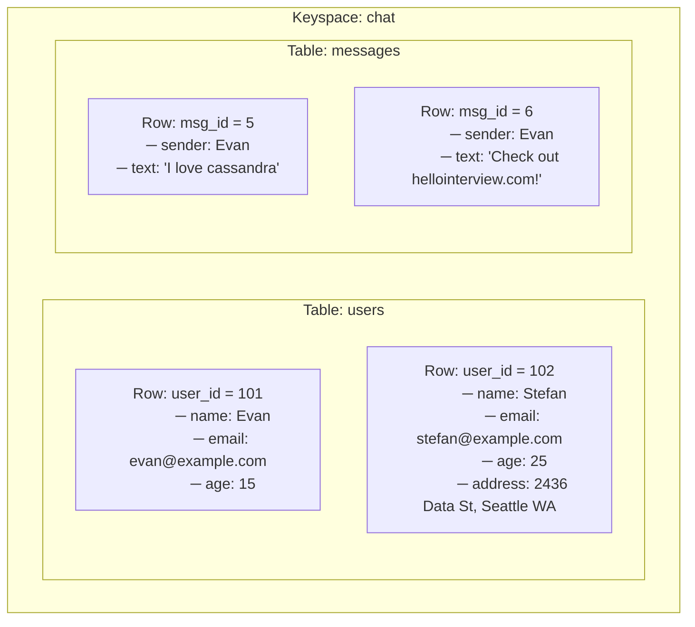

---

## 🧠 Observações importantes (didáticas)

* **Keyspace (`chat`)**
  ➜ Contêiner lógico de alto nível (equivalente a um *database*)

* **Tables independentes (`users` e `messages`)**
  ➜ Não existe relação implícita entre tabelas em Cassandra
  ➜ O campo `sender` **não é foreign key**

* **Wide-column behavior evidenciado**
  ➜ `address` existe apenas no `user_id = 102`
  ➜ Isso é **esperado e normal** em Cassandra

* **Rows identificadas por Primary Key**
  ➜ `user_id` e `msg_id` representam a identidade da linha
  ➜ A imagem não entra em partition/clustering key (corretamente)


### Cassandra como JSON

```json
{
  "keyspace1": {
    "table1": {
      "row1": { "col1": 1, "col2": "2" },
      "row2": { "col1": 10, "col3": 3.0 },
      "row3": {
        "col4": {
          "company": "Hello Interview",
          "city": "Seattle",
          "state": "WA"
        }
      }
    }
  }
}
```

---

## 🔑 Primary Key

A **primary key** define **unicidade, distribuição e ordenação** dos dados.

* **Partition Key**
  Determina **em qual partição** os dados ficam.

* **Clustering Key**
  Define a **ordem dos dados dentro da partição**.

Exemplos em CQL:

```sql
PRIMARY KEY (a)
PRIMARY KEY ((a), b)
PRIMARY KEY ((a, b), c)
PRIMARY KEY (a, b, c)
```

> O conceito é praticamente idêntico ao de **partition key + sort key** do DynamoDB.

---

## 🧭 Particionamento (Consistent Hashing)

O Cassandra escala horizontalmente usando **hashing consistente**.

### Problema do hash tradicional

* Rebalanceamento massivo quando nós entram/saem
* Distribuição desigual de carga

### Solução: Hash Ring

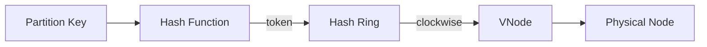

### Virtual Nodes (VNodes)

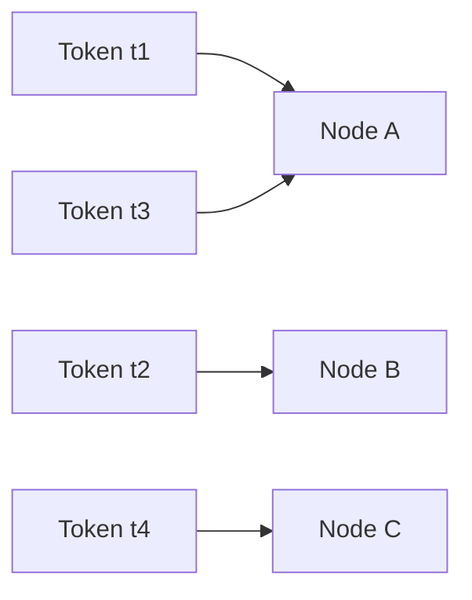

✔ Melhor balanceamento
✔ Rebalanceamento mais barato
✔ Uso proporcional de recursos

---

## 🔁 Replicação

Cassandra replica dados caminhando **no sentido horário do anel**.

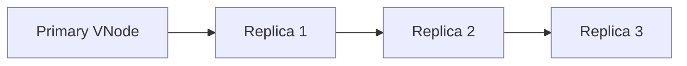

📌 **Nunca replica dois VNodes no mesmo nó físico**

### Estratégias de Replicação

* **SimpleStrategy**
  ➜ Testes e ambientes simples

* **NetworkTopologyStrategy** (produção)
  ➜ Multi-datacenter
  ➜ Rack-aware

```sql
-- Simple
{'class':'SimpleStrategy','replication_factor':3}

-- Multi-DC
{'class':'NetworkTopologyStrategy','dc1':3,'dc2':2}
```

---

## ⚖️ Consistência (CAP)

Cassandra é **AP (Availability + Partition Tolerance)** por padrão.

### Consistency Levels

* `ONE`
* `QUORUM`
* `ALL`

### QUORUM explicado

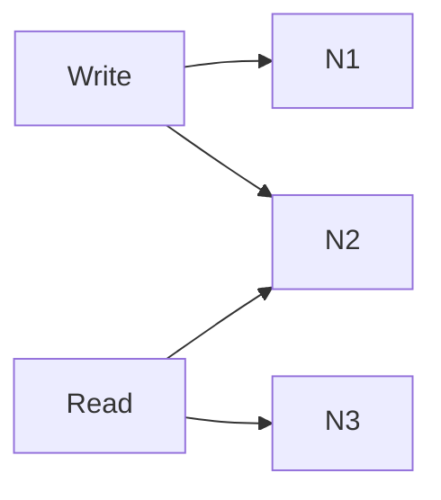

✔ Escritas e leituras sempre compartilham **pelo menos um nó**

---

## 🚦 Query Routing

Qualquer nó pode ser **coordinator**.

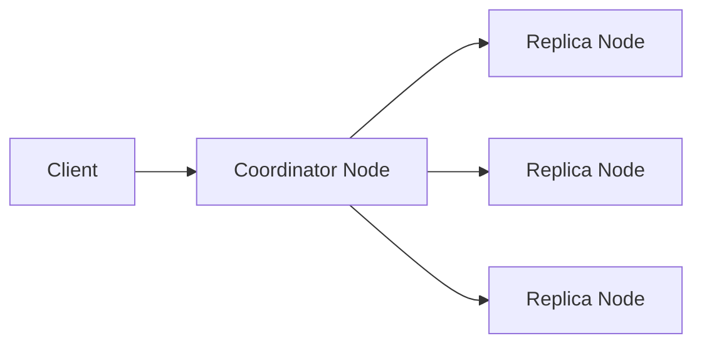

Os nós se comunicam via **Gossip** e conhecem:

* Topologia
* Tokens
* Estado do cluster

---

## 💾 Modelo de Armazenamento (LSM Tree)

Cassandra é **write-optimized**.

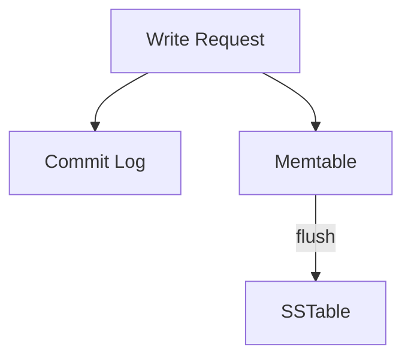

### Componentes

* **Commit Log** → durabilidade
* **Memtable** → escrita rápida em memória
* **SSTable** → arquivos imutáveis em disco

### Leitura

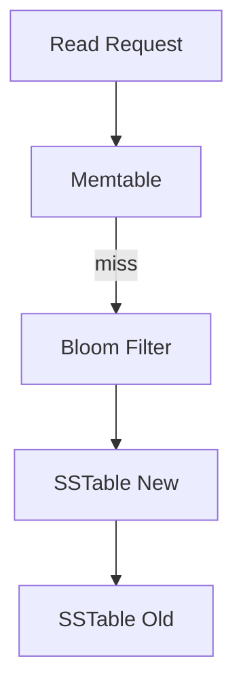

---

## 🧹 Compaction

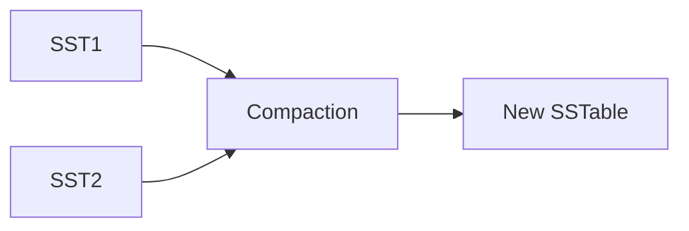

✔ Remove tombstones
✔ Consolida dados
✔ Mantém performance

---

## 🗣️ Gossip

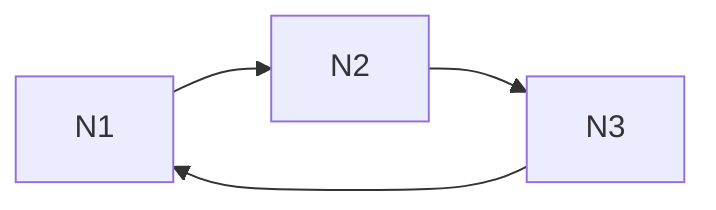

* Peer-to-peer
* Vector clocks
* Seed nodes garantem convergência do cluster

---

## 💥 Tolerância a Falhas

### Hinted Handoff

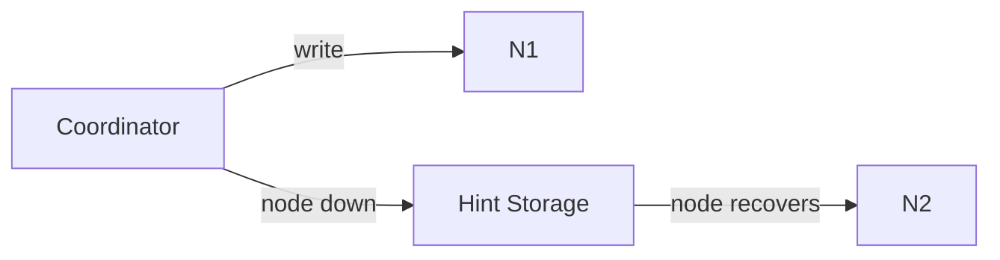

✔ Evita perda de escrita
✔ Curto prazo

---

## 🧠 Modelagem de Dados (Query-Driven)

Cassandra **não usa JOINs**.
Modelagem é baseada em **padrões de acesso**.

---

## 📩 Exemplo: Discord

### Schema original (problema de partição grande)

```sql
PRIMARY KEY (channel_id, message_id)
```

### Solução: Buckets temporais

```sql
PRIMARY KEY ((channel_id, bucket), message_id)
```

✔ Partições limitadas
✔ Escrita eficiente
✔ Leitura previsível

---

## 🎟️ Exemplo: Ticketmaster

### Tickets por seção

```sql
PRIMARY KEY ((event_id, section_id), seat_id)
```

### Estatísticas denormalizadas

```sql
PRIMARY KEY (event_id, section_id)
```

✔ UX influencia diretamente o schema
✔ Eventual consistency é aceitável

---

## 🚀 Recursos Avançados

* **SAI (Storage Attached Indexes)**
* **Materialized Views**
* **Search via Solr / Elastic**

---

## 🎯 Cassandra em Entrevistas

### Quando usar

✔ Alta disponibilidade
✔ Alto volume de escrita
✔ Escalabilidade horizontal
✔ Schemas flexíveis

### Quando evitar

❌ Consistência forte
❌ JOINs complexos
❌ Agregações ad-hoc

---

## 🧾 Resumo

Cassandra é um banco **poderosíssimo** para sistemas distribuídos **orientados a disponibilidade e escala**.
Seu verdadeiro valor aparece quando:

* A modelagem é **query-driven**
* O acesso é previsível
* A arquitetura entende seus **trade-offs**

---
