# **Apache Cassandra**

Aprenda como você pode usar o **Cassandra** para resolver uma grande variedade de problemas em **System Design**.

---

## 📘 O que é Cassandra?

Bancos de dados são um dos pilares do system design, e um dos mais versáteis e populares que você pode ter em sua caixa de ferramentas é o **Cassandra**.

O Cassandra foi originalmente desenvolvido pelo Facebook para suportar o rápido crescimento do recurso de **busca de mensagens da inbox**. Desde então, foi adotado por inúmeras empresas para escalar armazenamento, throughput e leitura de dados. Empresas como **Discord, Netflix, Apple e Bloomberg** utilizam Cassandra em produção.

O **Apache Cassandra** é um banco de dados **NoSQL distribuído e open-source**, que implementa um modelo de **wide-column store particionado**, com **consistência eventual**. Ele roda em **clusters**, escala horizontalmente usando hardware comum e combina ideias do **Dynamo** (ver DynamoDB) e do **Bigtable** para lidar com grandes volumes de dados, alto volume de consultas e requisitos flexíveis de armazenamento.

Neste deep dive, vamos destrinchar os recursos do Cassandra que o tornam atraente como banco, especialmente para system design. Também vamos explorar seus internals mais importantes para “desmistificar” como ele entrega esses recursos. Por fim, veremos quando e como usar Cassandra.

---

## 🧱 Fundamentos do Cassandra

### Modelo de Dados

Os principais conceitos do modelo de dados do Cassandra são:

* **Keyspace**
  Unidade organizacional de mais alto nível (equivalente a um *database* em bancos relacionais).
  Define **estratégias de replicação** para gerenciar redundância e disponibilidade. Também “possui” quaisquer **UDTs (User Defined Types)** que você criar.

* **Table**
  Vive dentro de um keyspace. Organiza dados em linhas e define seu schema (colunas + estrutura de primary key).

* **Row**
  Um registro identificado unicamente por sua **primary key**. Cada row armazena valores em múltiplas colunas.

* **Column**
  Unidade real de armazenamento: nome, tipo e valor para aquela row.
  ➜ Nem todas as colunas precisam existir em todas as linhas (wide-column)
  ➜ Cada coluna tem metadado de **timestamp** (quando foi escrita)
  ➜ Conflitos de escrita entre réplicas são resolvidos por **Last Write Wins**

Além disso, colunas suportam muitos tipos, incluindo **UDTs** e **valores JSON**, o que torna Cassandra bem flexível tanto para dados “flat” quanto dados aninhados.

---

## Mermaid — Cassandra Data Model (Keyspace / Tables / Rows)

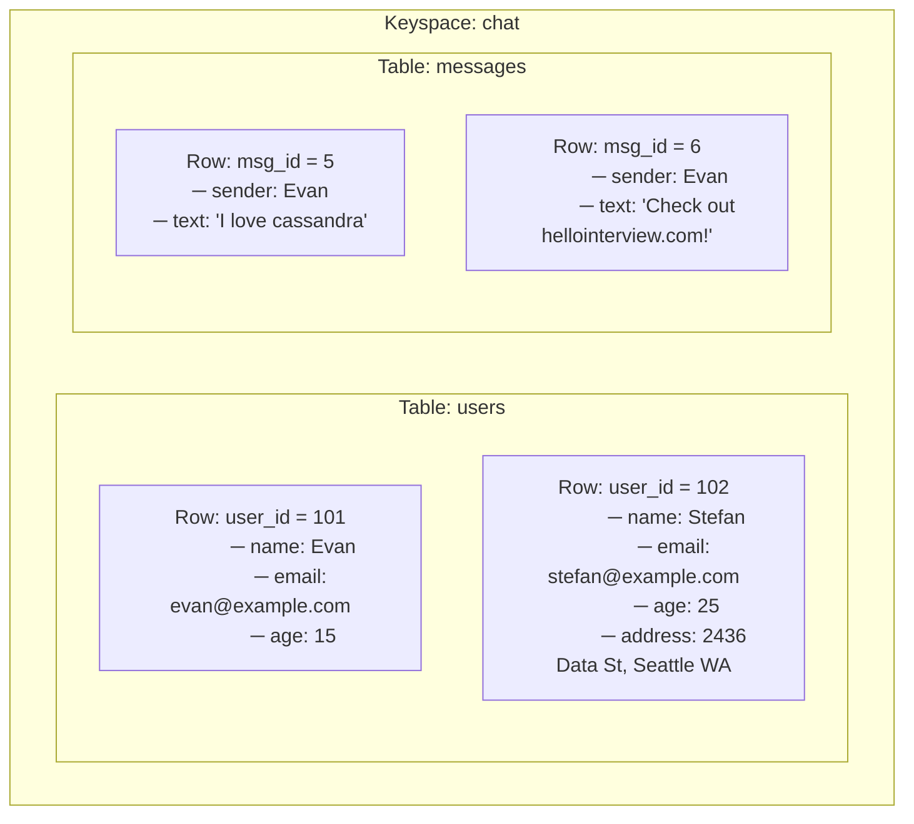

---

## 🧠 Observações importantes (didáticas)

* **Keyspace (`chat`)**
  ➜ Contêiner lógico de alto nível (equivalente a um *database*)

* **Tables independentes (`users` e `messages`)**
  ➜ Não existe relação implícita entre tabelas em Cassandra
  ➜ O campo `sender` **não é foreign key**

* **Wide-column behavior evidenciado**
  ➜ `address` existe apenas no `user_id = 102`
  ➜ Isso é **esperado e normal** em Cassandra

* **Rows identificadas por Primary Key**
  ➜ `user_id` e `msg_id` representam a identidade da linha
  ➜ A imagem não entra em partition/clustering key (corretamente)

---

### Cassandra como JSON

Em um nível bem básico, dá para imaginar as estruturas do Cassandra como um grande JSON:

```json
{
  "keyspace1": {
    "table1": {
      "row1": { "col1": 1, "col2": "2" },
      "row2": { "col1": 10, "col3": 3.0 },
      "row3": {
        "col4": {
          "company": "Hello Interview",
          "city": "Seattle",
          "state": "WA"
        }
      }
    }
  }
}
```

---

## 🔑 Primary Key

A **primary key** define **unicidade, distribuição e ordenação** dos dados.

* **Partition Key**
  Uma ou mais colunas usadas para determinar **em qual partição** a row fica.

* **Clustering Key**
  Zero ou mais colunas que definem a **ordem/sort** das rows dentro da partição. Isso dá controle explícito de ordenação quando faz diferença para o modelo.

Quando você cria uma tabela em Cassandra via **CQL**, a primary key é parte do schema:

```sql
-- Primary key with partition key a, no clustering keys
CREATE TABLE t (a text, b text, c text, PRIMARY KEY (a));

-- Primary key with partition key a, clustering key b ascending
CREATE TABLE t (a text, b text, c text PRIMARY KEY ((a), b))
WITH CLUSTERING ORDER BY (b ASC);

-- Primary key with composite partition key a + b, clustering key c
CREATE TABLE t (a text, b text, c text, d text, PRIMARY KEY ((a, b), c));

-- Primary key with partition key a, clustering keys b + c
CREATE TABLE t (a text, b text, c text, d text, PRIMARY KEY ((a), b, c));

-- Primary key with partition key a, clustering keys b + c (alternative syntax)
CREATE TABLE t (a text, b text, c text, d text, PRIMARY KEY (a, b, c));
```

> O conceito de primary key e seus subcomponentes pode lembrar a definição de chave primária do DynamoDB. Esse conceito é essencialmente compartilhado 1:1 entre os dois bancos.

---

## 🧩 Conceitos-chave (para entrevistas)

Ao introduzir Cassandra em uma entrevista de system design, você precisa saber mais do que “como usar”. Você deve conseguir explicar **como ele funciona**, caso o entrevistador aprofunde em armazenamento, escalabilidade, eficiência de queries etc. Esses detalhes influenciam diretamente o design.

---

## 🧭 Particionamento (Consistent Hashing)

O Cassandra escala horizontalmente particionando dados em muitos nós. Para particionar bem, ele usa **consistent hashing**.

### Problema do hash tradicional

No hash tradicional, você escolhe N nós e usa:

`hash(value) % num_nodes`

Funciona, mas gera dois problemas:

* Se o número de buckets muda (nó entrou/saiu), **muitos valores** mudam de nó → muito movimento de dados.
* Pode acontecer de muita coisa cair no mesmo nó → **carga desigual**.

### Solução: Hash Ring (consistent hashing)

Ao invés de `mod`, consistent hashing mapeia o hash para um intervalo (um **anel**). Você caminha no sentido horário até encontrar o primeiro nó responsável.

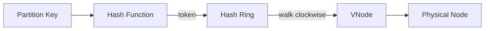

Isso reduz remapeamento: quando um nó entra/sai, afeta principalmente a região adjacente.

### Virtual Nodes (VNodes)

O anel, sozinho, ainda pode sofrer com distribuição desigual. Para melhorar, Cassandra usa **vnodes**: muitos pontos no anel pertencem ao mesmo nó físico.

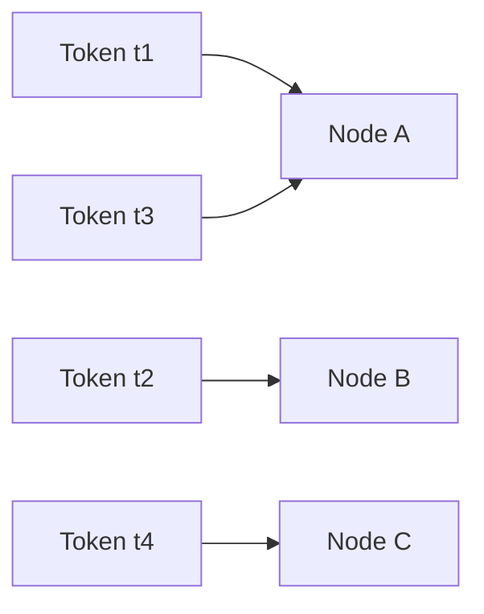

✔ Melhor balanceamento
✔ Rebalanceamento mais barato
✔ Nós maiores podem ter mais vnodes

---

## 🔁 Replicação

Partições são replicadas para aumentar disponibilidade. A escolha das réplicas é feita varrendo o anel no sentido horário a partir do vnode “primário”.

Se a replicação for 3, Cassandra pega o vnode dono do token e encontra mais 2 vnodes no sentido horário. Ele **pula vnodes do mesmo nó físico** para não concentrar réplicas em uma única máquina.

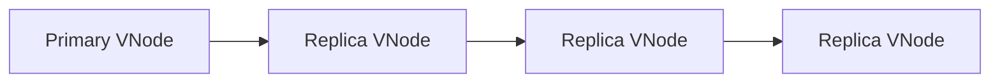

📌 **Nunca replica dois VNodes no mesmo nó físico**

### Estratégias de Replicação

* **SimpleStrategy**
  ➜ útil para cenários simples e testes (basicamente varredura clockwise)

* **NetworkTopologyStrategy** (produção)
  ➜ “data center / rack aware”
  ➜ espalha réplicas em DCs e racks diferentes para sobreviver a incidentes reais (queda de rack ou DC)

CQL (fiel ao original):

```sql
-- 3 replicas
ALTER KEYSPACE hello_interview
WITH REPLICATION = { 'class' : 'SimpleStrategy', 'replication_factor' : 3 };

-- 3 replicas in data center 1, 2 replicas in data center 2
ALTER KEYSPACE hello_interview
WITH REPLICATION = { 'class' : 'NetworkTopologyStrategy', 'dc1' : 3, 'dc2' : 2 };
```

---

## ⚖️ Consistência (CAP)

Cassandra é um sistema distribuído e está sujeito ao **CAP theorem**. Ele permite ajustar consistência em reads/writes, o que te dá controle do trade-off consistência vs disponibilidade.

Cassandra **não oferece transações** nem garantias ACID. Ele só suporta writes **atômicos e isolados no nível de row dentro de uma partition** — e basicamente para por aí.

### Consistency Levels

* `ONE`
* `QUORUM`
* `ALL`

### QUORUM explicado

`QUORUM` exige maioria: `n/2 + 1`.
Com 3 réplicas, quorum = 2. Usando QUORUM em read e write, sempre existe pelo menos um nó em comum, então leituras “enxergam” escritas.

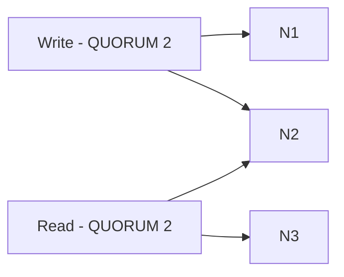

✔ Escritas e leituras compartilham **pelo menos um nó**
✔ Cassandra tende a **eventual consistency**: com tempo suficiente, réplicas convergem

---

## 🚦 Query Routing

Qualquer nó pode atuar como **coordinator**.

O client escolhe um nó; esse nó vira coordinator e consulta as réplicas corretas (com base em hashing consistente + replicação + consistency level).

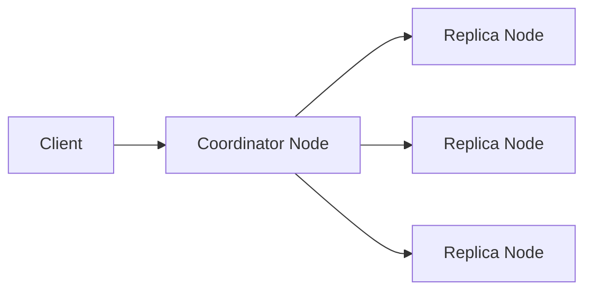

Os nós se comunicam via **Gossip** e conhecem:

* Topologia
* Tokens
* Estado do cluster

---

## 💾 Modelo de Armazenamento (LSM Tree)

O modelo de armazenamento explica um dos maiores pontos fortes do Cassandra em system design: **write throughput**.

Cassandra usa um **LSM-tree** no lugar de um B-tree. Ele favorece write speed em troca de read speed. Create/update/delete normalmente geram **novas entradas** (append), e o estado é determinado pela ordem dos updates. Deletes viram **tombstones**.

### Componentes (LSM)

* **Commit Log** → write-ahead log para durabilidade
* **Memtable** → estrutura em memória, ordenada por primary key
* **SSTable** → arquivo imutável em disco (flush do memtable)

### Fluxo de escrita

1. Write chega no nó
2. Escreve no **commit log**
3. Escreve no **memtable**
4. Memtable atinge limite → flush → vira **SSTable**
5. Entradas do commit log associadas àquele memtable são removidas (para economizar espaço)

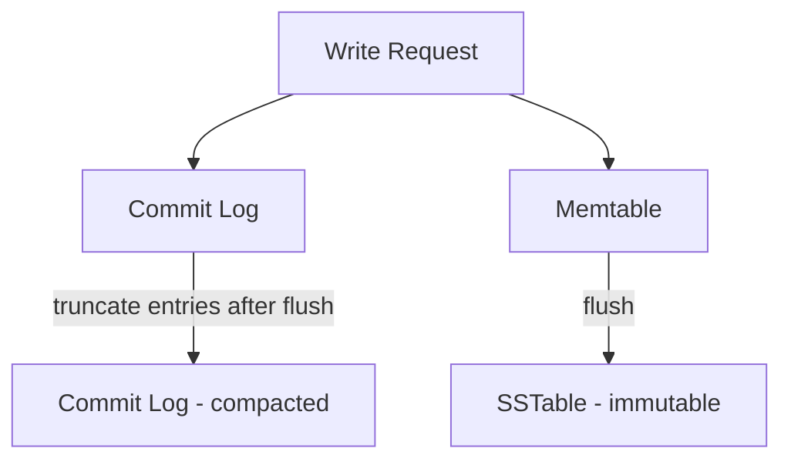

### Leitura

1. Lê o **memtable** primeiro (mais recente)
2. Se não estiver lá, usa **bloom filter** para decidir quais SSTables podem ter a chave
3. Lê SSTables do **mais novo para o mais antigo** até encontrar o valor mais recente

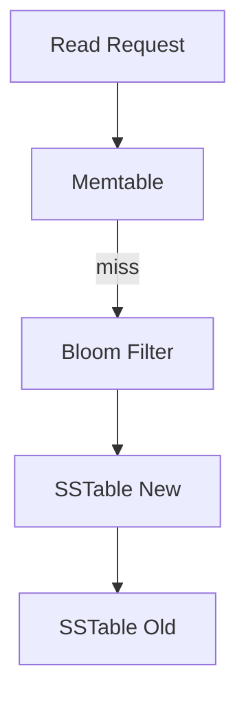

### Conceitos adicionais

* **Compaction**
  Consolida SSTables (ordenadas) para reduzir bloat e remover tombstones (deletes). É eficiente porque tudo é sorted.

* **SSTable Indexing**
  Cassandra mantém arquivos/estruturas que mapeiam chaves para offsets em bytes dentro da SSTable (ex.: key=12 → offset=984), facilitando leitura em disco.

---

## 🧹 Compaction (visão)

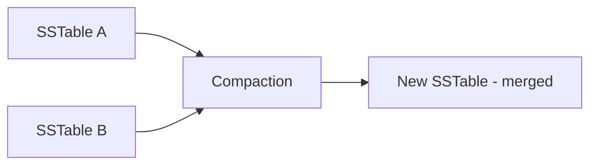

✔ Remove tombstones
✔ Consolida estado
✔ Mantém performance

---

## 🗣️ Gossip

Gossip é o mecanismo peer-to-peer para distribuir estado do cluster.

Os nós mantêm informações como: quem está vivo, schema, etc.
Cada nó mantém:

* **generation**: timestamp quando o nó foi bootstrapado
* **version**: relógio lógico que incrementa (aprox. a cada segundo)

No cluster, isso forma um tipo de **vector clock**, ajudando a ignorar informações antigas recebidas via gossip.

Os nós fazem gossip com outros nós com viés probabilístico para **seed nodes**. Seed nodes são “hotspots” de gossip para evitar sub-clusters isolados. Eles são descobertos por service discovery padrão.

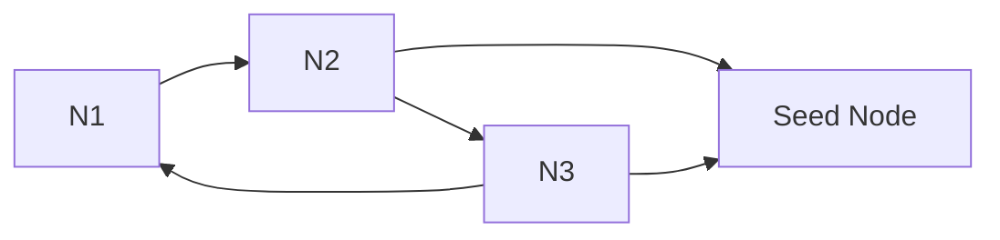

---

## 💥 Tolerância a Falhas

### Detecção de falhas (Phi Accrual Failure Detector)

Cassandra usa **Phi Accrual Failure Detector** durante gossip. Cada nó decide independentemente se outro nó está disponível. Se um nó não responde, ele pode ser “convicted” e o cluster para de rotear writes para ele.

O Cassandra não considera um nó “morto para sempre” a menos que o administrador o **decommission** ou o **rebuild**. Isso evita rebalanceamentos por falhas intermitentes.

### Hinted Handoff

Se o coordinator precisa escrever em réplicas e alguma está offline, ele guarda um “hint” temporário para a write não falhar. Quando a réplica volta, o hint é aplicado.

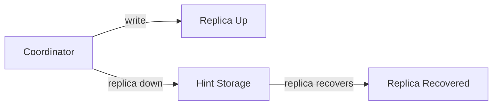

✔ Evita perda de escrita no curto prazo
✔ Hints expiram; longos períodos offline tendem a exigir rebuild/read repair

---

## 🧠 Modelagem de Dados (Query-Driven)

Cassandra **não usa JOINs**, nem foreign keys, nem integridade referencial.
Ele favorece queries de **tabela única**, então a modelagem precisa ser **orientada por access patterns**.

Pontos principais:

* Partition Key (o que define a partição)
* Tamanho de partição (pior caso, cresce indefinidamente?)
* Clustering Key (ordenação)
* Denormalização (duplicar dados quando necessário para servir queries)

---

## 📩 Exemplo: Discord

Canais podem ter volume alto. Usuários pedem mensagens recentes e scrollam. Faz sentido ordenar por “mais recente”.

### Schema original

```sql
CREATE TABLE messages (
  channel_id bigint,
  message_id bigint,
  author_id bigint,
  content text,
  PRIMARY KEY (channel_id, message_id)
) WITH CLUSTERING ORDER BY (message_id DESC);
```

Por que `message_id` ao invés de `created_at`?
Discord usa **Snowflake IDs**: um UUID ordenável cronologicamente. Isso evita colisões de PK que poderiam ocorrer com timestamps (mesmo com milissegundos).

Esse schema concentra tudo de um canal em uma partição (`channel_id`). Isso evita query tipo **scatter-gather**, mas cria um problema: alguns canais ficam com partições gigantes e crescimento contínuo.

### Solução: Buckets temporais

Discord adiciona `bucket` ao partition key. Um bucket representa **10 dias** de dados, alinhado a um epoch definido por eles: **DISCORD_EPOCH = 1 Jan 2015**.

```sql
CREATE TABLE messages (
  channel_id bigint,
  bucket int,
  message_id bigint,
  author_id bigint,
  content text,
  PRIMARY KEY ((channel_id, bucket), message_id)
) WITH CLUSTERING ORDER BY (message_id DESC);
```

Benefícios:

✔ Partições limitadas (10 dias)
✔ Partições não crescem indefinidamente
✔ Quase sempre lê/escreve em **uma** partição (bucket atual)

Casos em que pode tocar mais de um bucket:

1. quando “vira o bucket” com o passar do tempo
2. canais inativos (minoria), onde o “último bucket” pode não ser o atual

---

## 🎟️ Exemplo: Ticketmaster

A UI de browsing de assentos não exige consistência forte: disponibilidade muda o tempo todo. Se o usuário iniciar compra, o sistema pode checar um banco consistente para confirmar.

### Primeira versão: 1 partição por evento

```sql
CREATE TABLE tickets (
  event_id bigint,
  seat_id bigint,
  price bigint,
  -- seat_id is added as a clustering key to ensure primary key uniqueness; order
  -- doesn't matter for the app access patterns
  PRIMARY KEY (event_id, seat_id)
);
```

Problemas:

* eventos com 10k+ tickets exigem muito trabalho de “resumo/total” por query
* eventos populares geram alto volume de acessos no browsing

### UX sugere particionar por seção (section_id)

A UI mostra um mapa com **seções**, cada seção tem info agregada. Ao clicar, mostra assentos.

```sql
CREATE TABLE tickets (
  event_id bigint,
  section_id bigint,
  seat_id bigint,
  price bigint,
  PRIMARY KEY ((event_id, section_id), seat_id)
);
```

✔ Distribui um evento em múltiplas partições (uma por seção)
✔ Partições menores
✔ Mapeia melhor o access pattern da UI

### Tabela denormalizada para visão “top-level”

Para mostrar todas as seções com estatísticas (ex.: “100+”), cria-se uma tabela separada:

```sql
CREATE TABLE event_sections (
  event_id bigint,
  section_id bigint,
  num_tickets bigint,
  price_floor bigint,
  -- section_id is added as a clustering key to ensure primary key uniqueness; order
  -- doesn't matter for the app access patterns
  PRIMARY KEY (event_id, section_id)
);
```

✔ Denormalização para servir a UI com eficiência
✔ Precisão total não é necessária (eventual consistency ok)
✔ Geralmente poucas seções (<100), então serve bem em uma partição por `event_id`

---

## 🚀 Recursos Avançados

* **SAI (Storage Attached Indexes)**
  Índices secundários globais em colunas. Performance pior que queries por partition key, mas ainda boa. Útil para padrões menos frequentes (evita criar tabela denormalizada extra).

* **Materialized Views**
  Cassandra materializa automaticamente uma tabela derivada de outra (denormalização automática), reduzindo complexidade na aplicação.

* **Search Indexing**
  Integrações com motores de busca distribuídos como ElasticSearch / Solr (ex.: Stratio Lucene Index).

---

## 🎯 Cassandra em Entrevistas

### Quando usar

✔ Alta disponibilidade
✔ Alto volume de escrita
✔ Escalabilidade horizontal
✔ Schemas flexíveis / wide-column (colunas esparsas)
✔ Access patterns claros (query-driven schema)

### Quando evitar

❌ Consistência forte / transações ACID
❌ JOINs e consultas complexas multi-tabela
❌ Agregações ad-hoc

---

## 🧾 Resumo

Cassandra é um banco **muito versátil** para sistemas distribuídos orientados a **escala e disponibilidade**. Ele brilha quando:

* A modelagem é **query-driven**
* Os access patterns são claros
* Você explora seu **write throughput** (LSM tree)
* Você entende e aceita os **trade-offs** de consistência

---
