# Redis

Aprenda como usar o **Redis** para resolver uma grande variedade de problemas em **System Design**.


---

## Por que Redis é tão importante em System Design?

Projetos de system design envolvem muitas tecnologias, conceitos e padrões diferentes. Porém, **uma tecnologia se destaca pela versatilidade: Redis**.

Isso é especialmente valioso em entrevistas, porque permite **ir fundo em poucas ferramentas**, em vez de conhecer superficialmente dezenas delas. Quanto mais profundamente você entende Redis, maiores as chances de atingir o nível esperado pelo entrevistador.

Além da versatilidade, Redis se destaca pela **simplicidade**:

* Estruturas parecidas com linguagens de programação:

  * strings
  * hashes
  * sets
  * sorted sets
  * streams
* Pouca “mágica” interna (sem otimizadores complexos ou query planners obscuros)
* Extremamente rápido para operações simples

Redis faz **muito bem uma coisa**: executar operações simples **muito rápido**.

---

## Redis Basics

Redis se define como um **“data structure store”**, escrito em **C**, que é:

* **In-memory** 🫢
* **Single-threaded** 😱

Essas escolhas tornam o Redis **extremamente rápido** e **fácil de raciocinar**.

### Durabilidade (Tradeoff Importante)

Redis **não é ideal quando durabilidade é requisito crítico**.

* Pode usar **AOF (Append-Only File)** para reduzir perda de dados
* Mas **não oferece as mesmas garantias** de um banco relacional tradicional
* Esse tradeoff é **intencional**, em favor de desempenho

👉 Alternativas como **AWS MemoryDB** sacrificam um pouco de performance para ganhar persistência em disco.

---

## Estruturas de Dados Fundamentais

Redis suporta:

* **Strings**
* **Hashes** (objetos / dicionários)
* **Lists**
* **Sets**
* **Sorted Sets** (filas de prioridade)
* **Bloom Filters** (probabilísticos, com falsos positivos)
* **Geospatial Indexes**
* **Time Series**

Além disso, suporta padrões de comunicação como:

* **Pub/Sub**
* **Streams**

Esses recursos podem substituir soluções mais complexas como **Kafka**, **SNS/SQS**, dependendo do caso.

---

## Modelo Lógico do Redis

Redis é, no fundo, um **key-value store**:

* **Keys** → sempre strings
* **Values** → qualquer estrutura suportada

> Toda estrutura em Redis **sempre tem uma chave**.

### Organização de chaves é tudo

A forma como você define suas keys **define como seus dados serão distribuídos e escalados** no cluster.

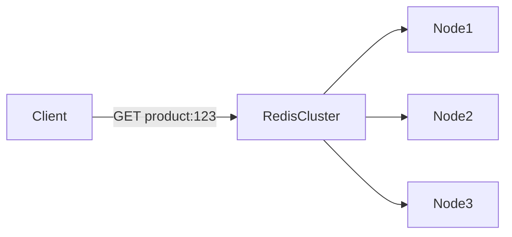

---

## Comandos Redis

Redis usa um **protocolo próprio**, baseado em strings simples.

Exemplo:

```text
SET foo 1
GET foo        # retorna 1
INCR foo       # retorna 2
XADD mystream * name Sara surname OConnor
```

### Exemplo com Sets

* `SADD` → adiciona elemento
* `SCARD` → quantidade de elementos
* `SMEMBERS` → lista os elementos
* `SISMEMBER` → verifica existência

Esses comandos são quase idênticos às operações de um `Set` em qualquer linguagem.

---

## Configurações de Infraestrutura

Redis pode rodar como:

* **Single node**
* **Primary + replica (HA)**
* **Cluster**

### Redis Cluster e Hash Slots

No modo cluster:

* Cada key é mapeada para um **hash slot**
* Clientes mantêm um mapa local: **slot → node**
* Se o slot mudar, o servidor responde com `MOVED`

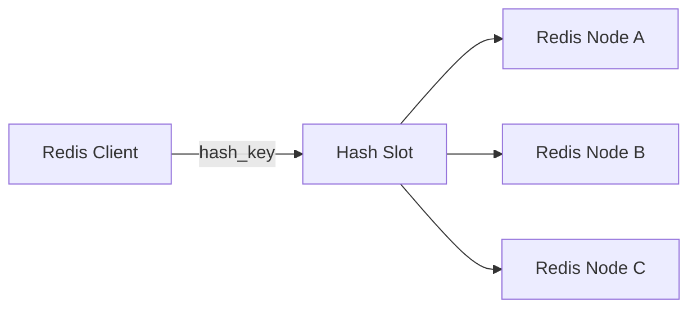

🧠 Pense nos hash slots como uma **lista telefônica**: o cliente sabe exatamente onde buscar cada chave.

---

## Performance

Redis é **absurdamente rápido**:

* ~100.000 writes por segundo
* Latência de leitura em **microssegundos**

Isso viabiliza padrões que seriam anti-pattern em SQL.

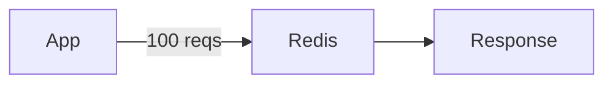

---

## Redis como Cache

Caso de uso mais comum.

* Keys → chaves de cache
* Values → objetos (JSON, Hash, etc)
* Fácil de escalar adicionando nós

Exemplo:

```text
product:123 → { name, price, inventoryCount }
```

### TTL (Time To Live)

* Redis **garante** que valores expirados não serão lidos
* TTL controla **evicção automática**

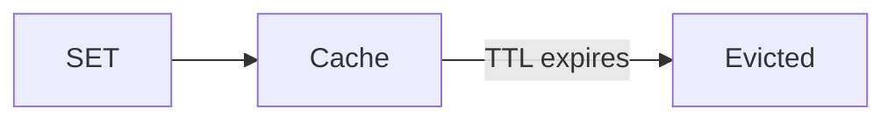

⚠️ Redis **não resolve sozinho** o problema de **hot keys**.

---

## Redis como Distributed Lock

Útil quando:

* Precisamos garantir exclusividade
* Evitar ações simultâneas (ex: compra de ingresso)

### Lock simples com INCR + TTL

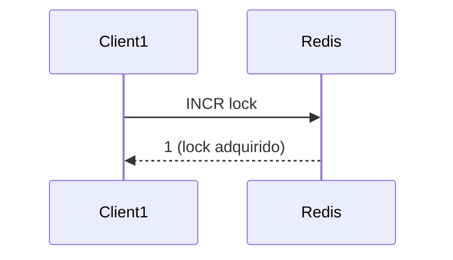

* `INCR == 1` → lock adquirido
* `INCR > 1` → lock ocupado
* `DEL` → libera lock

Para cenários críticos: **Redlock + fencing tokens**.

---

## Redis para Leaderboards

Usa **Sorted Sets** (`ZSET`):

```text
ZADD tiger_posts 500 post1
ZADD tiger_posts 1 post2
ZREMRANGEBYRANK tiger_posts 0 -6
```

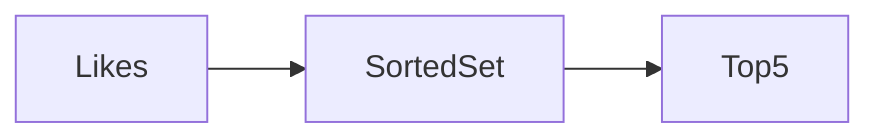

* Inserção: O(log N)
* Consulta: O(log N)
* Ideal para rankings, feeds, scores

---

## Redis para Rate Limiting

### Fixed Window

* `INCR` + `EXPIRE`
* Se valor > N → bloqueia

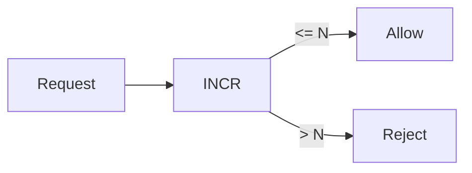

### Sliding Window

* Sorted Set com timestamps
* Remove entradas antigas
* Executar tudo em **Lua** para atomicidade

---

## Redis para Proximity Search

Redis suporta **índices geoespaciais**:

```text
GEOADD key lon lat member
GEOSEARCH key FROMLONLAT lon lat BYRADIUS r km
```

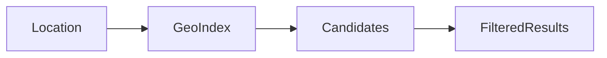

* Geohashes → bounding boxes
* Segunda passada filtra raio exato

---

## Redis Streams (Event Sourcing)

Streams são **logs append-only**, semelhantes ao Kafka.

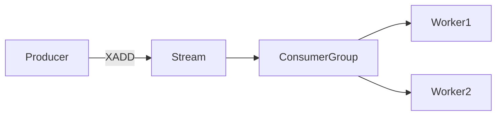

* `XADD` → adiciona evento
* `XREADGROUP` → consome
* `XCLAIM` → reassume mensagens de workers mortos

Ideal para filas de trabalho resilientes.

---

## Redis Pub/Sub

Comunicação em tempo real:

```text
SPUBLISH channel message
SSUBSCRIBE channel
```

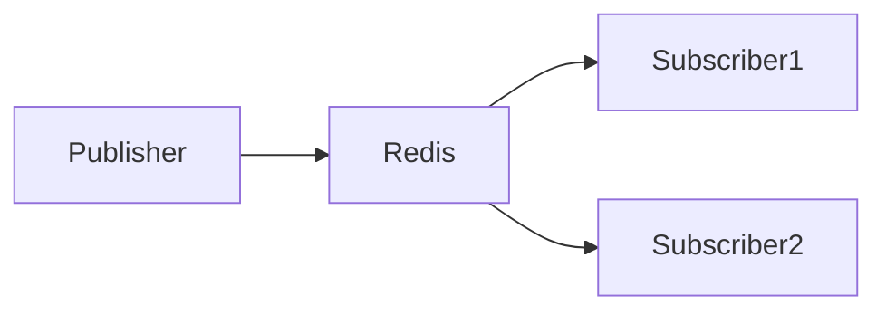

Características:

* Não persistente
* “At most once”
* Extremamente rápido
* Agora **sharded** (escala horizontal)

⚠️ Não serve para replay ou consumo offline
👉 Use **Streams** se precisar disso.

---

## Problemas: Hot Key

Quando uma chave recebe **muito mais tráfego** que as outras.

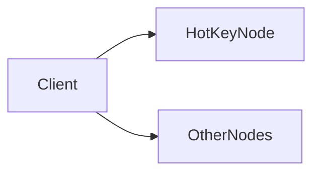

### Soluções possíveis

* Cache local no cliente
* Replicar dados em múltiplas keys
* Read replicas escaláveis

Em entrevistas:
✔️ Reconhecer o problema
✔️ Propor mitigação

---

## Resumo

Redis é:

* 🚀 Extremamente rápido
* 🧠 Simples de entender
* 🧩 Muito versátil

Por se basear em **estruturas simples**, Redis facilita o raciocínio sobre **escala, consistência e tradeoffs**, permitindo **discussões profundas em entrevistas de System Design** sem exigir conhecimento excessivo de internals.

---
