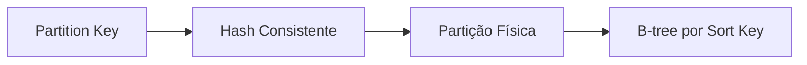
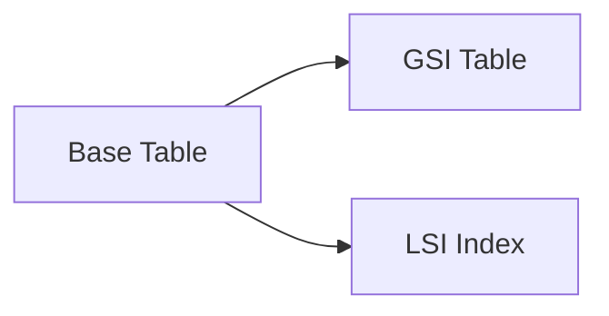
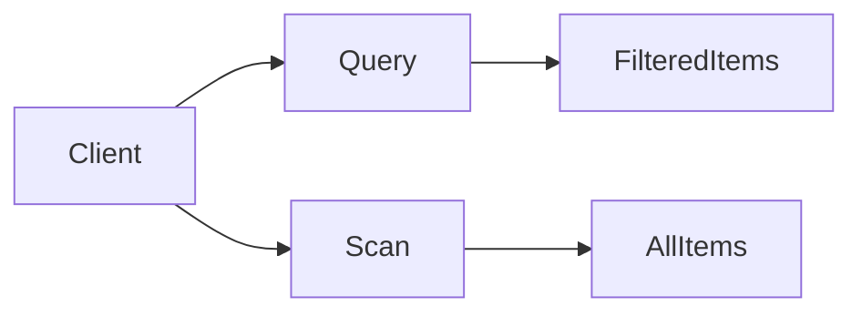
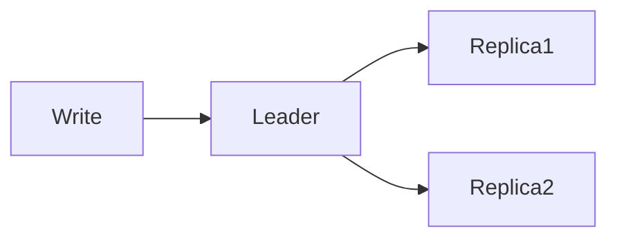
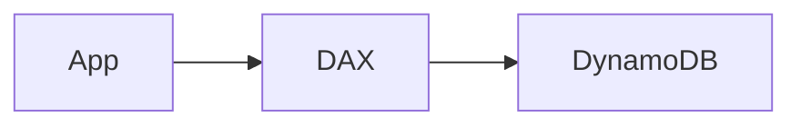

# DynamoDB

Aprenda como você pode usar o DynamoDB para resolver uma grande variedade de problemas em **System Design**.

---

## O que é DynamoDB?

O DynamoDB é um serviço **key-value**, **altamente escalável** e **totalmente gerenciado**, fornecido pela Amazon Web Services.
Legal, muitos buzzwords. Mas o que isso realmente significa — e por que isso importa?

### Fully-Managed (Totalmente Gerenciado)

Isso significa que a AWS cuida de **todos os aspectos operacionais** do banco de dados.
A natureza totalmente gerenciada permite que a AWS assuma tarefas como:

* Provisionamento de hardware
* Configuração
* Aplicação de patches
* Escalonamento automático

Tudo isso libera os desenvolvedores para focarem **exclusivamente no desenvolvimento da aplicação**, e não na operação da infraestrutura.

### Highly Scalable (Altamente Escalável)

O DynamoDB consegue lidar com **volumes massivos de dados e tráfego**.
Ele escala automaticamente para cima ou para baixo conforme a necessidade da aplicação, **sem downtime** e **sem degradação de performance**.

### Key-Value

O DynamoDB é um banco de dados **NoSQL**, ou seja, não utiliza o modelo relacional tradicional.
Em vez disso, trabalha com um modelo **key-value**, permitindo armazenamento e recuperação de dados de forma flexível.

**A moral da história:**
O DynamoDB é extremamente fácil de usar e consegue escalar para suportar uma enorme variedade de aplicações.
Para entrevistas de system design, ele tem praticamente **tudo** o que você precisa de um banco de dados. Inclusive, hoje ele **suporta transações**, neutralizando uma das maiores críticas históricas ao DynamoDB.

É importante notar que o DynamoDB **não é open-source**, então não conseguimos inspecionar seus internals da mesma forma que fazemos com tecnologias abertas como Kafka ou Redis.
Por isso, o foco aqui será **como você interage com ele**, e não cada detalhe interno. Para olhar “por baixo do capô”, dependemos da documentação da AWS e do **DynamoDB Paper**.

Neste deep dive, vamos detalhar **exatamente o que você precisa saber** sobre DynamoDB para responder qualquer pergunta sobre ele em entrevistas de system design. E, de quebra, você também aprenderá conceitos práticos que podem ser aplicados em projetos reais.

---

## “Posso usar DynamoDB em uma entrevista?”

Essa é uma pergunta comum:

> “Eu posso usar DynamoDB em uma entrevista?”

A resposta é simples: **pergunte ao entrevistador**.

* Muitos dirão **sim**, esperando apenas que você saiba utilizá-lo corretamente.
* Outros podem dizer **não**, preferindo alternativas open-source para evitar vendor lock-in.

Como sempre: é só perguntar 😊

---

## Modelo de Dados (Data Model)

No DynamoDB, os dados são organizados em **tabelas**, onde cada tabela contém múltiplos **itens**, que representam registros individuais.

Isso é parecido com bancos relacionais, mas com diferenças importantes focadas em **escalabilidade e flexibilidade**.

### Tabelas (Tables)

* Estrutura de mais alto nível no DynamoDB
* Cada tabela possui obrigatoriamente uma **chave primária**
* Suporta **índices secundários**, permitindo consultas além da chave primária

### Itens (Items)

* Equivalentes às linhas de um banco relacional
* Cada item deve ter uma chave primária
* Tamanho máximo: **400 KB por item**, considerando todos os atributos

### Atributos (Attributes)

* Pares chave-valor que compõem o item
* Tipos suportados:

  * Escalares: string, number, boolean
  * Conjuntos: string set, number set
* Podem ser **aninhados**, permitindo estruturas complexas dentro de um único item

O DynamoDB é **schema-less**:
Você **não precisa definir um schema previamente**.
Itens da mesma tabela podem ter atributos diferentes, e novos atributos podem ser adicionados a qualquer momento.

⚠️ Essa flexibilidade exige que a **validação de dados seja feita na aplicação**, pois o DynamoDB não impõe uniformidade de atributos.

---

## Exemplo de Tabela

Considere uma tabela `users`:

```json
{
  "PersonID": 101,
  "LastName": "Smith",
  "FirstName": "Fred",
  "Phone": "555-4321"
}
```

```json
{
  "PersonID": 102,
  "LastName": "Jones",
  "FirstName": "Mary",
  "Address": {
    "Street": "123 Main",
    "City": "Anytown",
    "State": "OH",
    "ZIPCode": 12345
  }
}
```

```json
{
  "PersonID": 103,
  "LastName": "Stephens",
  "FirstName": "Howard",
  "Address": {
    "Street": "123 Main",
    "City": "London",
    "PostalCode": "ER3 5K8"
  },
  "FavoriteColor": "Blue"
}
```

Cada item representa um usuário com atributos variados.
Observe que alguns itens possuem atributos exclusivos, como `FavoriteColor`, evidenciando a flexibilidade do DynamoDB.

Embora o DynamoDB utilize JSON para **transmissão**, o formato de armazenamento interno é **proprietário**, permitindo que o usuário foque apenas na modelagem dos dados.

---

## Partition Key e Sort Key

Toda tabela DynamoDB é definida por uma **chave primária**, que pode ser:

### Partition Key

* Atributo único que determina a localização física do item
* O valor é **hasheado** para decidir em qual partição o item será armazenado

### Sort Key (Opcional)

* Segundo atributo da chave primária composta
* Permite ordenar itens dentro da mesma partição
* Habilita **range queries** e ordenação eficiente

---

## Chave Primária na Prática

Em entrevistas, é essencial **explicitar sua escolha de partition key e sort key**.

Você deve escolher a partition key de acordo com:

* Padrões de acesso mais comuns
* Distribuição uniforme de dados

Se precisar de ordenação ou consultas por intervalo, inclua uma sort key.

### Exemplo: Chat em Grupo

* **Partition Key:** `chat_id`
* **Sort Key:** `message_id`

Isso permite buscar todas as mensagens de um chat e ordená-las cronologicamente.

Por que não usar timestamp como sort key?
Porque timestamps **não garantem unicidade**. Múltiplas mensagens podem ocorrer no mesmo milissegundo.

Alternativas melhores:

* Contadores auto-incrementais por partição
* UUID v1
* Snowflake IDs
* ULID

---

## O que acontece por baixo do capô?

O DynamoDB combina duas estruturas fundamentais:



### Detalhamento

* **Partition Key:**
  Usa hashing consistente para distribuir dados entre nós

* **Sort Key:**
  Dentro da partição, os itens são organizados em **B-trees**, permitindo buscas e ordenação eficientes

* **Consulta composta:**
  Primeiro resolve a partição, depois percorre a B-tree

Essa abordagem permite:

* Escalabilidade horizontal
* Queries eficientes dentro das partições

---

## Índices Secundários (Secondary Indexes)

Quando você precisa consultar dados por um atributo que **não é a partition key**, entram os índices secundários.

### Global Secondary Index (GSI)

* Possui **partition key diferente** da tabela base
* Dados ficam em **partições físicas separadas**
* Replicação independente

### Local Secondary Index (LSI)

* Usa a **mesma partition key** da tabela
* Apenas muda a sort key
* Armazenado junto com a partição original



### Diferença Física Importante

* **GSI:** mais flexível, maior custo
* **LSI:** mais eficiente localmente, menos flexível

---

## Quando Usar GSI

Exemplo de chat:

* Tabela base: buscar mensagens por `chat_id`
* Novo requisito: buscar todas as mensagens de um `user_id`

Solução:
Criar um **GSI** com:

* Partition Key: `user_id`
* Sort Key: `message_id`

---

## Quando Usar LSI

Se você quiser ordenar mensagens **dentro de um chat** por outro critério, como `num_attachments`, use um **LSI**.

---

## Comparação GSI vs LSI

| Feature       | GSI               | LSI                     |
| ------------- | ----------------- | ----------------------- |
| Partition Key | Diferente         | Igual à tabela          |
| Uso           | Consultas globais | Consultas locais        |
| Tamanho       | Sem limite        | 10 GB por partition key |
| Throughput    | Independente      | Compartilhado           |
| Consistência  | Eventual          | Eventual ou forte       |
| Exclusão      | Pode excluir      | Só excluindo tabela     |
| Quantidade    | Até 20            | Até 5                   |

---

## Operações de Acesso a Dados

Existem duas operações principais:

### Scan

* Lê **todos os itens**
* Ineficiente
* Deve ser evitada em grandes volumes

### Query

* Usa partition key (e opcionalmente sort key)
* Muito mais eficiente



---

## Consistência e CAP Theorem

O DynamoDB suporta dois modelos:

### Eventual Consistency (Padrão)

* Mais disponível
* Menor latência
* Pode retornar dados desatualizados
* Modelo **AP / BASE**

### Strong Consistency

* Leituras sempre refletem a última escrita
* Maior latência
* Modelo **CP / ACID**



---

## Escalabilidade e Alta Disponibilidade

* Auto-sharding
* Load balancing
* Replicação entre AZs
* Global Tables para replicação multi-região

---

## Segurança

* Criptografia em repouso (default)
* Criptografia em trânsito (opcional)
* IAM para controle de acesso
* VPC Endpoints para acesso privado

---

## Modelo de Preço

* **On-demand:** paga por requisição

* **Provisionado:** define RCU/WCU

* 1 RCU = 4 KB lidos/s

* 1 WCU = 1 KB escrito/s

Esses números ajudam a **validar viabilidade financeira** em entrevistas.

---

## Funcionalidades Avançadas

### DAX (DynamoDB Accelerator)

Cache in-memory nativo com latência sub-milissegundo.



### Streams

CDC nativo para:

* Lambdas
* Elasticsearch
* Analytics em tempo real

---

## DynamoDB em Entrevistas

### Quando usar

* Alta escala
* Baixa latência
* Simplicidade operacional

### Quando não usar

* Queries complexas
* Alto custo de escrita
* Forte necessidade relacional
* Vendor lock-in

---

## Conclusão

O DynamoDB é poderoso, escalável e extremamente eficiente.
Para entrevistas, é uma excelente escolha — desde que você entenda:

* Modelagem de dados
* Partition e sort keys
* Índices secundários
* Consistência
* Custos
* Funcionalidades avançadas

E lembre-se: o DynamoDB **suporta ACID e transações**, então a velha discussão SQL vs NoSQL já ficou para trás.
