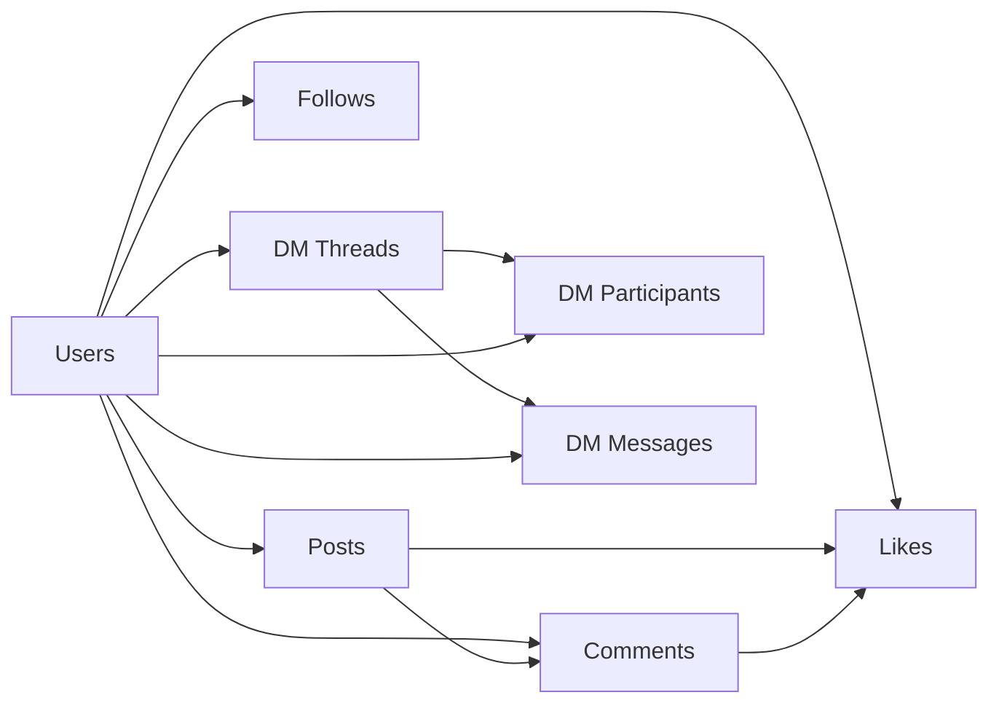
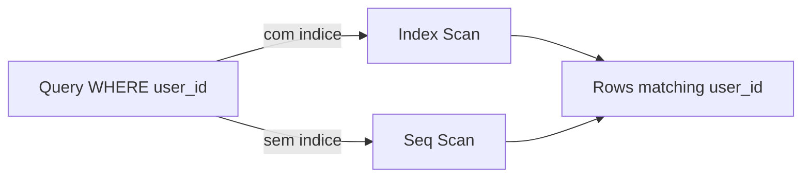
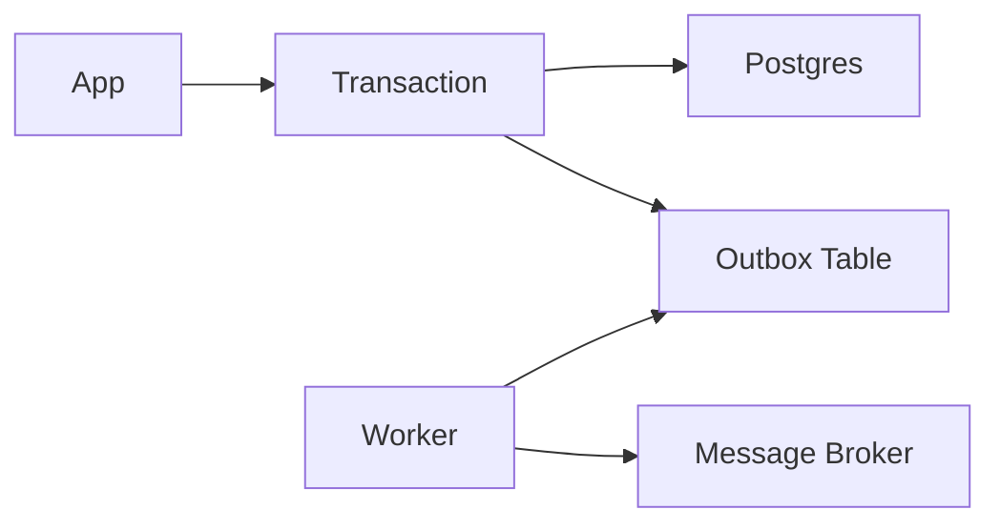
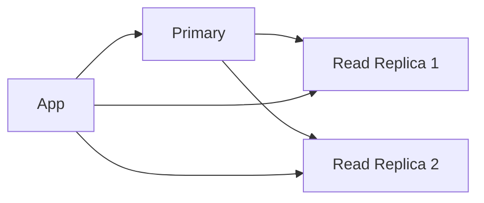
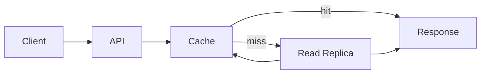
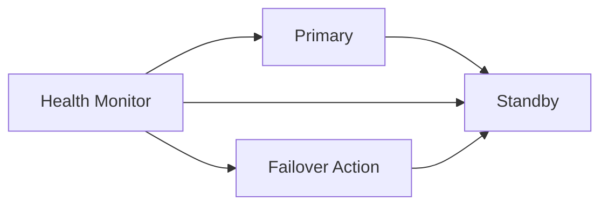

# PostgreSQL

Aprenda **quando** e **como** usar PostgreSQL nas suas entrevistas de **System Design**.

É bem provável que você acabe discutindo PostgreSQL em uma entrevista de system design. Afinal, ele é consistentemente citado como um dos bancos de dados mais apreciados na pesquisa de desenvolvedores do Stack Overflow e é usado por empresas que vão de Reddit a Instagram — e até mesmo pelo site que você está lendo agora.

Dito isso, é importante entender que, embora o PostgreSQL seja recheado de recursos e capacidades, seu entrevistador **não** está procurando um DBA. Ele quer ver se você consegue tomar decisões arquiteturais bem fundamentadas. **Quando** você deve escolher PostgreSQL? **Quando** você deve buscar outra opção? Quais são os trade-offs principais?

Eu frequentemente vejo candidatos tropeçarem aqui. Eles ou mergulham fundo demais em internals do PostgreSQL (falando de MVCC e WAL quando o entrevistador só quer saber se ele consegue lidar com relacionamentos entre dados), ou fazem afirmações muito amplas como “NoSQL escala melhor do que PostgreSQL” sem entender as nuances.

Neste deep dive, vamos focar especificamente no que você precisa saber sobre PostgreSQL para entrevistas de system design. Vamos começar com um exemplo prático, explorar capacidades e limites que devem orientar suas escolhas, e avançar para cenários comuns de entrevista.

Para este deep dive, vamos assumir que você tem uma compreensão básica de SQL. Se você não tiver, há um **Apêndice: Conceitos Básicos de SQL** no fim desta página para revisar.

Vamos começar.

---

## Um Exemplo Motivador

Vamos construir a intuição sobre PostgreSQL com um exemplo concreto. Imagine que estamos projetando uma plataforma de rede social — não um monstro como o Facebook, mas uma plataforma que está crescendo e precisa de uma base sólida.

Nossa plataforma precisa lidar com alguns relacionamentos fundamentais:

* Usuários podem criar posts
* Usuários podem comentar em posts
* Usuários podem seguir outros usuários
* Usuários podem curtir tanto posts quanto comentários
* Usuários podem criar mensagens diretas (DMs) com outros usuários

Esse é exatamente o tipo de cenário que aparece em entrevistas. Os relacionamentos entre entidades são claros, mas não triviais, e existem questões interessantes de consistência e escalabilidade.

**O que torna isso interessante do ponto de vista de banco de dados?**
Operações diferentes têm requisitos diferentes:

* Operações multi-etapas, como criar threads de DM, precisam ser **atômicas** (criar a thread, adicionar participantes e armazenar a primeira mensagem deve acontecer “junto”)
* Relacionamentos de comentário e follow precisam de **integridade referencial** (não dá para ter um comentário sem post válido, nem seguir um usuário inexistente)
* Contagens de curtidas podem ser **eventualmente consistentes** (não é crítico se demora alguns segundos para atualizar)
* Quando alguém pede o perfil de um usuário, precisamos buscar eficientemente posts recentes, contagem de seguidores e outros metadados
* Usuários precisam poder pesquisar posts e encontrar outros usuários
* Conforme a plataforma cresce, precisamos lidar com mais dados e queries mais complexas

Essa combinação — relacionamentos complexos, necessidades mistas de consistência, busca e espaço para crescimento — é um exemplo perfeito para explorar forças e limitações do PostgreSQL. Ao longo deste deep dive, vamos voltar a esse exemplo para manter tudo ancorado no mundo real.

### Diagrama de Relacionamentos (conceitual)



> Observação: em SQL relacional, essas setas normalmente se materializam via **FKs** (foreign keys) e tabelas de junção (join tables), especialmente em relacionamentos muitos-para-muitos.

---

## Capacidades e Limitações Centrais

Com o exemplo motivador em mente, vamos entrar no que o PostgreSQL faz bem — e onde ele começa a sofrer. A maioria das discussões de system design sobre PostgreSQL gira em torno de:

* Performance de leitura
* Capacidade de escrita
* Garantias de consistência
* Flexibilidade de schema (e evolução)
* Como escalar leituras e obter alta disponibilidade
* Limites práticos de throughput e crescimento

Entender essas características centrais ajuda você a justificar escolhas com maturidade, em vez de frases genéricas.

---

## Performance de Leitura (Read Performance)

Primeiro, performance de leitura — isso é crítico porque, na maioria das aplicações, **leituras superam escritas**. No nosso exemplo de rede social, usuários passam muito mais tempo consumindo posts e perfis do que criando conteúdo.

Em entrevistas de system design, você não precisa mergulhar em internals do query planner. Em vez disso, foque em padrões práticos de performance e quando faz sentido usar diferentes tipos de índice.

Quando um usuário abre um perfil, precisamos buscar eficientemente os posts daquele usuário. Sem indexação adequada, o PostgreSQL teria que varrer todas as linhas da tabela `posts` para encontrar as correspondentes — algo que fica cada vez mais caro conforme os dados crescem.

É aqui que índices entram.

### Indexação Básica

A forma mais fundamental de acelerar leituras no PostgreSQL é usando índices. Por padrão, o PostgreSQL usa índices **B-tree**, que funcionam muito bem para:

* Igualdade exata (`WHERE email = 'user@example.com'`)
* Consultas por intervalo (`WHERE created_at > '2024-01-01'`)
* Ordenação (`ORDER BY username`) quando a ordem do índice ajuda

Por padrão, PostgreSQL cria um índice B-tree para a **chave primária**, mas você pode criar índices em outras colunas também.

```sql
-- Índice “pão com manteiga”
CREATE INDEX idx_users_email ON users(email);

-- Índice multi-coluna para padrões comuns de query
CREATE INDEX idx_posts_user_date ON posts(user_id, created_at);
```

Um erro comum em entrevistas é sugerir “colocar índice em tudo”. Lembre:

* Cada índice deixa **writes mais lentas** (o índice precisa ser atualizado)
* Índices ocupam **espaço em disco**
* O planner pode decidir que um sequential scan é mais rápido (e ignorar seu índice)

### Um mapa mental de leitura com índice vs sem índice



---

## Além de Índices Básicos

PostgreSQL é rico em tipos de índice. Em entrevistas, você normalmente só precisa conhecer **quando** cada família aparece, não os detalhes de implementação.

### Índices B-tree

* Default e mais comum
* Ótimo para igualdade, range, ordenação

### Índices Hash

* Focados em igualdade
* Menos comuns em discussões gerais (B-tree costuma bastar)

### Índices GIN

* Muito usados para:

  * Busca em arrays / JSONB
  * Full-text search
* Exemplo mental: “tags”, “atributos dinâmicos”, documentos JSON.

### Índices GiST / SP-GiST

* Úteis para dados “não lineares”:

  * Geoespacial
  * Similaridade, ranges avançados
  * Tipos especializados

### Full-text search e índices

PostgreSQL tem suporte nativo a full-text search (tsvector/tsquery). Em um sistema social, isso pode servir para uma busca inicial por posts, antes de evoluir para um motor dedicado (como Elasticsearch) se requisitos de relevância e escala crescerem.

---

## Essenciais de Otimização de Queries (Query Optimization Essentials)

Em entrevistas, o “nível certo” de conversa costuma ser:

1. **Escolher índices coerentes** com padrões de acesso
2. Evitar queries que explodem em custo
3. Pensar em paginação e ordenação
4. Entender trade-offs de JOINs

### Paginação: OFFSET vs Keyset

Um ponto excelente para entrevistas.

* `OFFSET` fica caro em páginas altas (o banco “pula” muita coisa).
* “Keyset pagination” (seek) é mais estável em grandes volumes.

Exemplo mental: feed de posts ordenado por `created_at` e `post_id`:

```sql
-- Paginação por cursor (keyset)
SELECT *
FROM posts
WHERE (created_at, post_id) < (:last_created_at, :last_post_id)
ORDER BY created_at DESC, post_id DESC
LIMIT 20;
```

### JOINs: poder e custo

O PostgreSQL brilha em relacionamentos: JOINs, constraints, integridade referencial.
Mas JOINs muito pesados em tabelas gigantes podem exigir:

* Boa indexação nas colunas de join
* Estratégias de particionamento
* Caches externos para endpoints “quentes”

---

## Performance de Escrita (Write Performance)

Escritas são onde muitos sistemas “sentem o peso” quando crescem. No nosso exemplo:

* Criar posts e comentários: writes frequentes
* Likes: writes massivos (dependendo do produto)
* DMs: writes constantes e exigem atomicidade

PostgreSQL consegue lidar com altas taxas de escrita, mas não é “mágica”. O que costuma importar:

* Índices (cada write atualiza índices)
* Contenção (muitos writes na mesma linha/mesmo conjunto)
* Tamanho e padrão de transações
* I/O de disco e checkpointing
* Modelagem: você está atualizando contadores “na linha” ou usando eventos?

### Armadilha clássica: contadores de likes

“Atualizar uma coluna `like_count` a cada like” pode gerar contenção (hot row).
Uma abordagem comum é:

* Registrar likes como eventos/linhas
* Agregar em batch / assíncrono
* Ou manter contador com estratégia que evita hot spots (depende do caso)

---

## Limitações de Throughput (Throughput Limitations)

Em system design, “limitação” raramente é um número fixo. Normalmente é um conjunto de gargalos:

* CPU (parse/plan/execute)
* Memória (cache do banco, work_mem)
* Disco/IOPS (WAL, flush, checkpoints)
* Rede (em replicação)
* Contenção por lock / concorrência
* Índices demais e/ou errados

O ponto-chave: **PostgreSQL escala muito bem verticalmente** e também escala leituras com réplicas. Para writes, o caminho típico é:

* otimização + particionamento + sharding (quando realmente necessário)

---

## Otimizações para Escrita (Write Performance Optimizations)

Algumas estratégias que aparecem bem em entrevistas:

### 1) Batch writes

Inserções em lote reduzem overhead por transação.

### 2) Ajustar índices

Índices demais e multi-coluna “por instinto” podem destruir write throughput.

### 3) Separar cargas

Exemplo: likes e eventos podem ir para uma tabela/event-store separada.

### 4) Particionamento

Pode ajudar com:

* Tabelas de log/eventos
* Time-series (por data)
* Dados que crescem sem limite claro

### 5) Outbox pattern

Quando você precisa de consistência entre gravação no banco e publicação em um broker/event stream.



---

## Replicação (Replication)

PostgreSQL suporta replicação com foco forte em:

* **Read replicas** (para escalar leituras)
* **Alta disponibilidade** (failover)
* **Disaster recovery** (cópia em outra região)

O modelo mais comum em entrevistas:

* 1 primário (writer)
* N réplicas (read-only)
* Aplicação roteia reads para réplicas e writes para primário



> Em termos práticos: replicação implica **atraso** (replication lag). Isso conversa diretamente com consistência.

---

## Escalando Leituras (Scaling reads)

Para endpoints de leitura intensiva (feed, perfil, exploração), você normalmente combina:

* Índices bons
* Read replicas
* Cache (Redis/memcached)
* CDN para conteúdo estático (imagens, mídia)

Estratégia mental para perfil do usuário:



---

## Alta Disponibilidade (High Availability)

Em entrevistas, o “básico bem explicado” é:

* O banco pode falhar
* Você precisa de failover
* Você precisa de backups e recuperação

Arquitetura comum:

* Primary em uma AZ
* Standby/Replica em outra AZ
* Orquestrador/manager decide failover (depende do stack)



---

## Consistência de Dados (Data Consistency)

Aqui o PostgreSQL é “o clássico”:

* Forte suporte a integridade relacional
* Constraints
* Transações ACID
* Isolamento configurável

No nosso exemplo:

* Comentários precisam de um post válido: FK
* Follows precisam apontar para usuário válido: FK
* DMs precisam de atomicidade: transação

---

## Transações (Transactions)

Transação é onde PostgreSQL brilha em entrevistas quando seu caso pede:

* “Tudo ou nada”
* Múltiplas tabelas atualizadas juntas
* Garantias fortes em operações críticas

Exemplo conceitual: criação de DM thread


Se falhar em qualquer etapa, você dá rollback e mantém o banco consistente.

---

## Quando Usar PostgreSQL (e Quando Não Usar)

### Quando PostgreSQL é uma ótima escolha

Use PostgreSQL quando você tem:

* Relacionamentos claros e importantes
* Necessidade de integridade referencial e constraints
* Queries complexas (JOINs, agregações)
* Transações importantes (ACID)
* Necessidade de evoluir o sistema com consistência e confiança

No nosso exemplo de rede social:

* Core de usuários, posts, comentários, follows e DMs encaixa muito bem em PostgreSQL.

### Quando você deve pensar duas vezes

PostgreSQL pode não ser a melhor escolha quando:

* Você precisa de writes massivos e distribuídos globalmente com baixa latência por região
* Você precisa de “scale-out de escrita” imediato (sem camadas extras)
* Seu modelo é muito “document-first” e muda o tempo todo (e você não quer governança de schema)
* Você quer evitar completamente operações complexas de HA/replicação (e prefere um serviço gerenciado)

---

## Quando Considerar Alternativas

Em entrevistas, normalmente aparecem comparações como:

* **DynamoDB / Cassandra**: throughput alto, modelagem orientada a acesso, escala horizontal (trade-offs fortes em queries e joins)
* **MongoDB**: documentos, flexibilidade de schema, queries diferentes
* **Elasticsearch**: busca e relevância (não é banco transacional primário)
* **MySQL**: similar para muitos casos, diferenças em recursos/implementação
* **NewSQL / Spanner-like**: consistência + escala global (depende do cenário)

O ponto não é “um é melhor”, e sim: **qual casa melhor com seus requisitos**.

---

## Summary

*(Mantendo a linha do material original: uma conclusão curta e alinhada ao que foi discutido, sem substituir o conteúdo acima.)*

PostgreSQL é frequentemente uma escolha excelente em system design porque oferece modelagem relacional forte, transações ACID, integridade referencial e capacidade robusta de consulta. Em entrevistas, o que importa é demonstrar que você entende **quando** ele é o “fit” natural (relacionamentos, consistência, queries complexas) e **quais trade-offs** surgem quando você precisa de escala extrema, baixa latência global, ou padrões de acesso que favorecem bancos orientados a chave-valor/documento.

---

# Apêndice: Conceitos Básicos de SQL

## Princípios de Banco Relacional

Bancos relacionais modelam dados como:

* **Tabelas** (relações)
* **Linhas** (tuplas)
* **Colunas** (atributos)

E relacionamentos são representados por:

* Chaves primárias (PK)
* Chaves estrangeiras (FK)
* Tabelas de junção (para muitos-para-muitos)

---

## Propriedades ACID

### Atomicidade (Tudo ou Nada)

Uma transação ou acontece por completo, ou não acontece.

### Consistência (Integridade de Dados)

O banco sempre vai de um estado válido para outro estado válido, respeitando constraints.

### Isolamento (Transações Concorrentes)

Transações simultâneas não devem “atrapalhar” a visão consistente do sistema (o nível exato depende do isolamento configurado).

### Durabilidade (Persistência Permanente)

Depois do commit, o dado não “some” mesmo com falhas (dentro das garantias do sistema e do hardware).

---

## Por que ACID importa?

Porque muitas operações de produto precisam de garantias fortes:

* Reservas (tickets, assentos, estoque)
* Transferências financeiras
* Criação de entidades compostas (como DM threads com participantes)
* Consistência de relacionamentos (FKs e constraints)

---

## Linguagem SQL

SQL é usada para:

* Definir estruturas (`CREATE TABLE`, `ALTER TABLE`)
* Consultar dados (`SELECT`)
* Modificar dados (`INSERT`, `UPDATE`, `DELETE`)
* Controlar transações (`BEGIN`, `COMMIT`, `ROLLBACK`)

