# Flink

Aprenda como você pode usar o Flink para resolver uma grande variedade de problemas em **System Design**.

---

Muitos problemas de system design vão exigir **processamento de streams**. Você tem um fluxo contínuo de dados e quer processar, transformar ou analisar esse fluxo **em tempo real**.

Processamento de streams é, de fato, **difícil** e **caro** de fazer direito. Muitos problemas que parecem problemas de stream processing podem, na verdade, ser reduzidos a problemas de **batch processing**, onde você usaria algo como Spark ou (se você for antigo o suficiente) Hadoop.

Antes de embarcar em uma solução de stream processing, faça a pergunta crítica:

> “Eu realmente preciso de latências em tempo real?”

Para muitos problemas, a resposta é **não** — e os engenheiros que vierem depois de você vão agradecer por você ter poupado a dor de cabeça operacional.

O exemplo mais básico disso seria um serviço lendo cliques de um tópico Kafka, fazendo uma transformação trivial (talvez reformatando os dados para ingestão) e escrevendo em um banco de dados. Fácil.

---

## Processamento simples de stream com Kafka (exemplo básico)

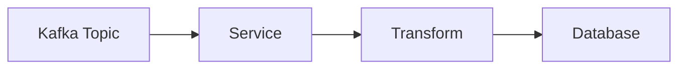

Até aqui, cada evento pode ser processado de forma independente. Geralmente, isso é simples: ler, transformar, gravar.

---

## Quando fica mais complexo: janelas e estado

Mas as coisas podem ficar substancialmente mais complexas a partir daí.

Imagine que queremos acompanhar a **contagem de cliques por usuário** nos **últimos 5 minutos**. Por causa dessa janela de 5 minutos, introduzimos **estado** no problema.

Cada mensagem não pode mais ser processada isoladamente, porque precisamos lembrar a contagem de mensagens anteriores.

É verdade que podemos fazer isso no serviço “na mão”, mantendo contadores em memória — mas isso introduz uma série de novos problemas.

### O problema do estado em memória: crash

Um exemplo: se o novo serviço cair, ele perde todo o estado. Basicamente, a contagem referente aos 5 minutos anteriores **some**.

O serviço poderia, hipoteticamente, se recuperar disso relendo todas as mensagens do tópico Kafka, mas isso é **lento** e **caro**.

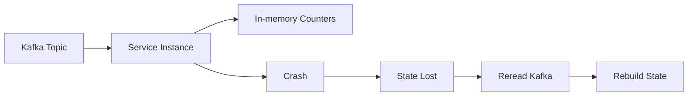

---

### O problema de escalar: redistribuir estado

Outro problema é escalabilidade.

Se quisermos adicionar uma nova instância porque estamos lidando com mais cliques, precisamos descobrir como **redistribuir o estado** das instâncias existentes para a nova.

Isso é uma dança complicada com muitos cenários de falha.

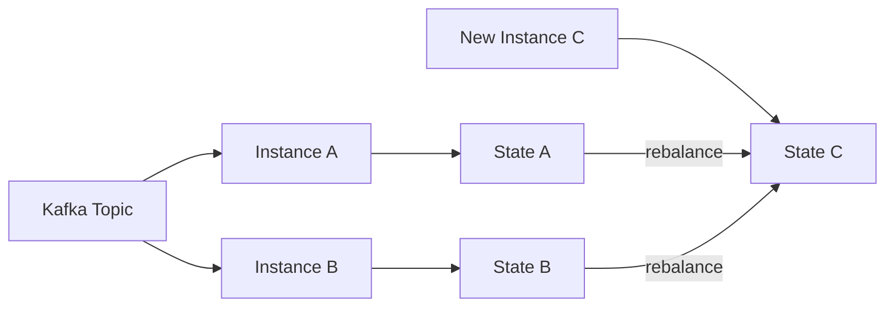

> A ideia aqui é: o estado “pertence” a alguma partição/chave. Ao aumentar ou diminuir o número de instâncias, você precisa realocar chaves e mover estado de forma segura.

---

### O problema de eventos fora de ordem ou atrasados

E se eventos chegarem **fora de ordem** ou **atrasados**?
Isso provavelmente vai acontecer — e impacta diretamente a precisão das contagens.

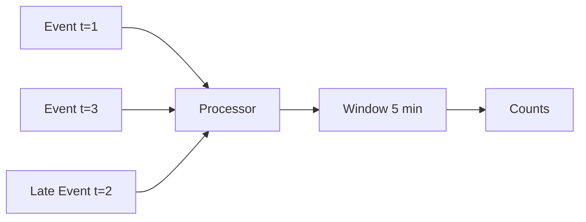

---

E as coisas só ficam mais difíceis conforme adicionamos mais complexidade e mais “statefulness”.

Felizmente, engenheiros vêm construindo esses sistemas há décadas e desenvolveram abstrações úteis.

Entra em cena um dos motores de stream processing mais poderosos: **Apache Flink**.

---

## O que é o Flink?

O Flink é um framework para construir aplicações de stream processing que resolve alguns dos problemas complicados como os discutidos acima — e vários outros.

Embora desse para falar de Flink por dias, neste deep dive vamos focar em duas perspectivas diferentes para entendê-lo:

1. **Como o Flink é usado**
   Há uma boa chance de você encontrar um problema orientado a stream na entrevista, e o Flink é uma ferramenta poderosa e flexível quando faz sentido aplicá-lo.

2. **Como o Flink funciona por dentro (alto nível)**
   O Flink resolve muita coisa por você, mas em entrevistas é importante que você entenda como ele faz isso, para responder perguntas de aprofundamento e sustentar seu design. Vamos cobrir as partes importantes.

Vamos nessa!

---

# Conceitos Básicos (Basic Concepts)

A seguir estão os pilares que aparecem em praticamente qualquer conversa sobre Flink.

---

## Sources e Sinks

Em qualquer pipeline de stream processing você tem:

* **Source**: de onde os dados entram (Kafka, Kinesis, arquivos, sockets, CDC, etc.)
* **Sink**: para onde os dados saem (Kafka, banco de dados, data lake, Elasticsearch, etc.)

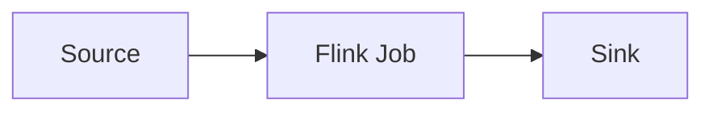

O Flink oferece conectores e integrações para muitas fontes e destinos comuns.

---

## Streams

Um **stream** é um fluxo contínuo de eventos.

Um ponto importante em stream processing é que “tempo” pode significar coisas diferentes. Mesmo antes de entrar nos detalhes, em entrevistas costuma ser útil saber que “tempo no stream” não é sempre “tempo do relógio do servidor”.

Você frequentemente vai se importar com:

* Eventos chegando continuamente
* Possível desordem temporal
* Atrasos
* Agrupamentos por janelas (windows)

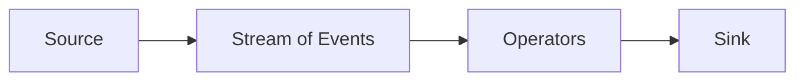

---

## Operators

Operators são as transformações que você aplica ao stream. Exemplos típicos:

* map (transformar cada evento)
* filter (descartar eventos)
* keyBy (agrupar por chave, como user_id)
* window (definir janelas de tempo, como 5 minutos)
* reduce/aggregate (somar, contar, calcular métricas)
* join (combinar streams ou stream com dados “lentos”)

Um fluxo típico de “contagem de cliques por usuário em 5 minutos” conceitualmente parece:

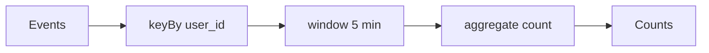

O ponto: quando você introduz **keyBy** + **window** + **aggregate**, você está dizendo “vou precisar de estado por chave”.

---

## State (Estado)

**State** é o coração de problemas “realmente de streaming”.

Quando você precisa manter contexto entre eventos (como contagens, sessões, janelas, rankings, detecção de fraude, etc.), você precisa de estado.

O Flink fornece abstrações para estado que ajudam a resolver:

* Como manter o estado de forma consistente mesmo com falhas
* Como restaurar estado após crash
* Como redistribuir estado quando escala horizontalmente
* Como lidar com eventos atrasados e fora de ordem (dependendo do design e das configurações)

Visualmente, quando você faz keyBy, você normalmente “particiona” o stream por chave e cada partição mantém seu estado:

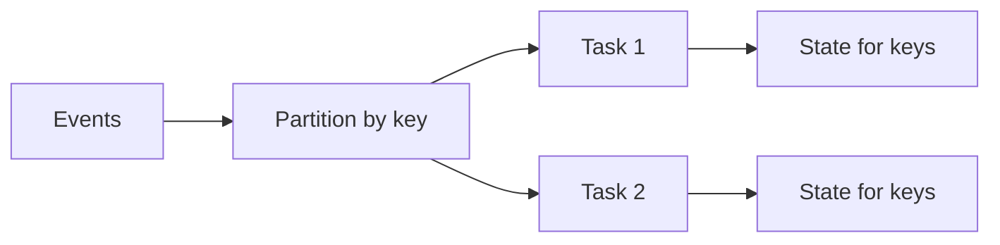

Sem uma camada robusta para estado, você acaba reinventando uma quantidade enorme de mecanismos (checkpoint, recovery, rebalance, etc.) e paga caro em complexidade operacional.


# Tempo no Flink (Time Semantics)

Um dos conceitos mais importantes — e mais confusos — em stream processing é **tempo**. Diferente de sistemas batch, em streaming o “tempo” não é algo óbvio.

O Flink distingue explicitamente **três noções de tempo**, e entender isso é fundamental para responder perguntas profundas em entrevistas.

---

## Processing Time

**Processing Time** é simplesmente o tempo do relógio da máquina que está executando o operador.

* Fácil de entender
* Baixo overhead
* Mas **impreciso** para dados distribuídos

Se um evento chega atrasado ou fora de ordem, o Flink não tem como “corrigir” o resultado.


**Quando usar?**

* Métricas aproximadas
* Casos onde precisão temporal não é crítica
* Monitoramento simples

---

## Event Time

**Event Time** é o tempo embutido no próprio evento — por exemplo, um timestamp gerado quando o clique aconteceu no navegador do usuário.

Esse é o modelo mais poderoso (e mais usado em produção).

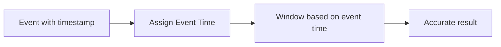

Com event time, o Flink consegue:

* Lidar com eventos fora de ordem
* Processar eventos atrasados
* Produzir resultados corretos mesmo com delays de rede

**Em entrevistas:**
Sempre que você ouvir “eventos podem chegar atrasados”, **event time + watermarks** devem acender na sua cabeça.

---

## Ingestion Time

**Ingestion Time** é um meio-termo:

* Timestamp atribuído quando o evento entra no Flink
* Mais consistente que processing time
* Menos preciso que event time

Hoje é menos comum e raramente aparece como melhor escolha em entrevistas.

---

# Watermarks

Se eventos podem chegar atrasados, surge uma pergunta fundamental:

> “Como o sistema sabe que já pode fechar uma janela?”

A resposta é: **watermarks**.

Uma watermark é essencialmente uma afirmação do sistema:

> “Não espero receber eventos com timestamp menor que X”.

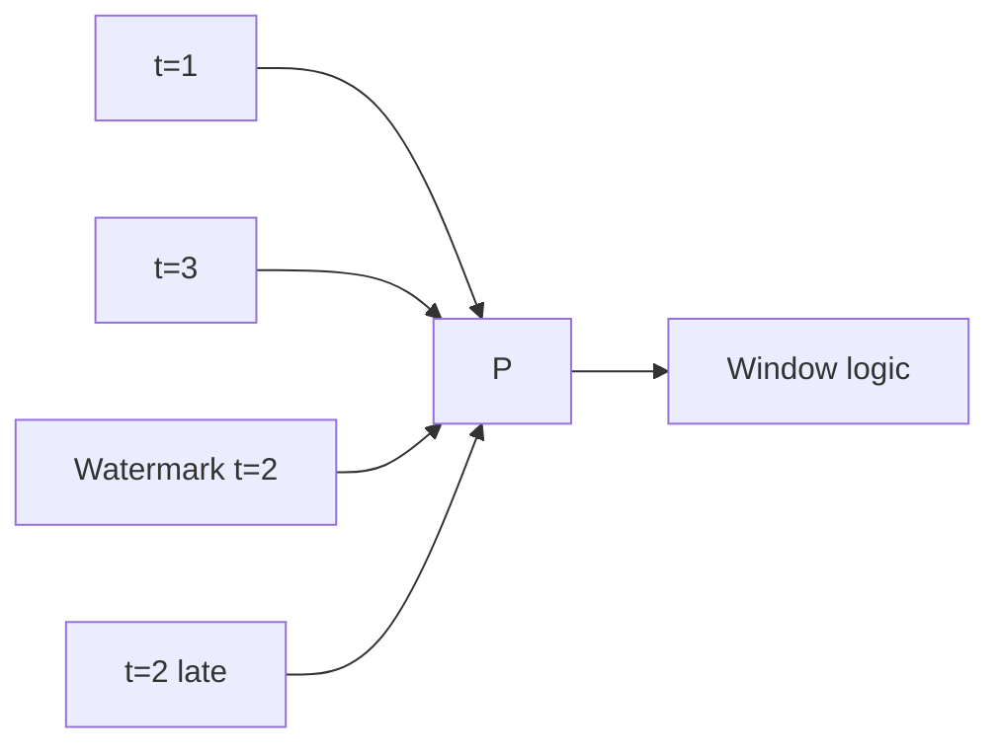

* Eventos com timestamp **menor que a watermark** são considerados atrasados
* Dependendo da configuração, podem:

  * Ser descartados
  * Atualizar resultados
  * Ir para uma side output

**Em entrevistas:**
Watermarks são o mecanismo que permite **event time sem travar indefinidamente** esperando eventos que talvez nunca cheguem.

---

# Janelas (Windows)

Streams são infinitos. Para calcular métricas, precisamos “recortar” o tempo em **janelas**.

O Flink oferece vários tipos de janelas.

---

## Tumbling Windows

Janelas fixas, sem sobreposição.

Exemplo: contagem de cliques a cada 5 minutos.

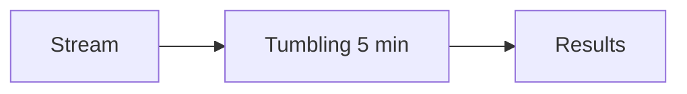

* Simples
* Muito comuns
* Fácil de explicar em entrevistas

---

## Sliding Windows

Janelas com sobreposição.

Exemplo: a cada 1 minuto, calcular métricas dos últimos 5 minutos.

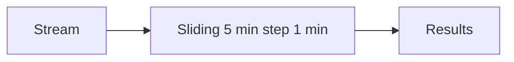

* Mais custo computacional
* Mais “tempo real”
* Ótimas para métricas móveis

---

## Session Windows

Janelas baseadas em **inatividade**.

Exemplo: sessões de usuário que expiram após 30 minutos sem eventos.

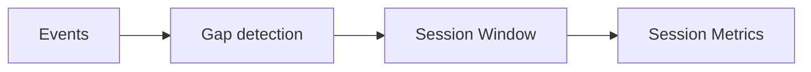

* Muito úteis para comportamento de usuário
* Natural para analytics e fraud detection

---

# Estado Avançado (State Internals)

Já falamos de estado conceitualmente. Agora vamos ao que interessa em entrevistas:

> “Como o Flink mantém estado **com segurança**?”

---

## Keyed State vs Operator State

### Keyed State

* Associado a uma chave (`keyBy`)
* Cada chave tem seu próprio estado
* Escala naturalmente com paralelismo

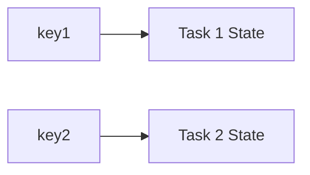

### Operator State

* Associado ao operador
* Compartilhado pela instância
* Menos comum, mas útil em certos casos (ex: offsets customizados)

---

## Backends de Estado

O Flink permite escolher **onde** o estado é armazenado:

* **Heap State Backend**

  * Rápido
  * Limitado pela memória da JVM

* **RocksDB State Backend**

  * Estado persistido em disco
  * Suporta estados enormes
  * Muito comum em produção

**Trade-off clássico:**
Memória vs durabilidade vs performance.

---

# Checkpointing

Checkpointing é o mecanismo que permite ao Flink oferecer **fault tolerance**.

Periodicamente, o Flink tira um “snapshot” consistente do estado.

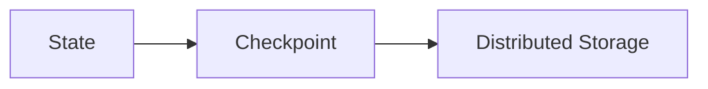

Se uma tarefa falhar:

* O job reinicia
* O estado é restaurado do último checkpoint
* O processamento continua como se nada tivesse acontecido

**Em entrevistas:**
Checkpointing é o que evita “reprocessar tudo desde o início”.

---

## Exactly-Once Semantics

Uma das maiores forças do Flink é oferecer **exactly-once processing**.

Isso significa:

* Cada evento afeta o estado **uma única vez**
* Mesmo com falhas
* Mesmo com retries

Isso é alcançado combinando:

* Checkpoints
* Barriers
* Integração correta com sources e sinks

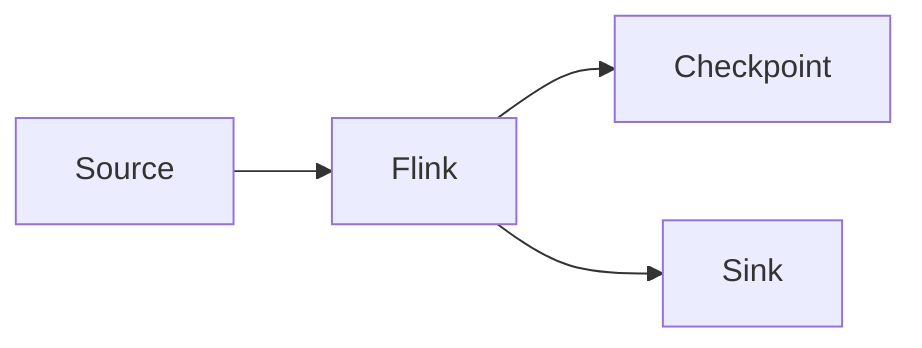

⚠️ Importante:
Exactly-once **depende do sink**.
Kafka, databases transacionais e sistemas compatíveis conseguem manter essa garantia.

---

# Savepoints

Savepoints são parecidos com checkpoints, mas **controlados pelo usuário**.

Eles permitem:

* Atualizar código
* Alterar paralelismo
* Migrar jobs
* Fazer deploys sem perder estado


Em entrevistas, isso é ouro para mostrar maturidade operacional.

---

# Backpressure

Backpressure acontece quando um downstream é mais lento que o upstream.

O Flink trata backpressure **nativamente**:

* Ele desacelera automaticamente a fonte
* Evita estouro de memória
* Mantém o sistema estável

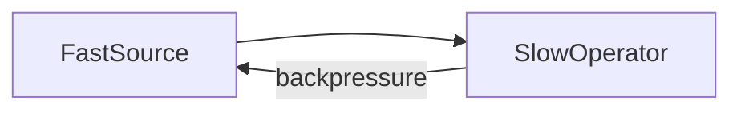

**Em entrevistas:**
Backpressure é sinal de sistema bem projetado — não um bug.

---

# Escalabilidade

O Flink escala horizontalmente por **paralelismo**.

* Cada operador pode rodar com múltiplas subtasks
* `keyBy` garante que a mesma chave vá sempre para a mesma subtask

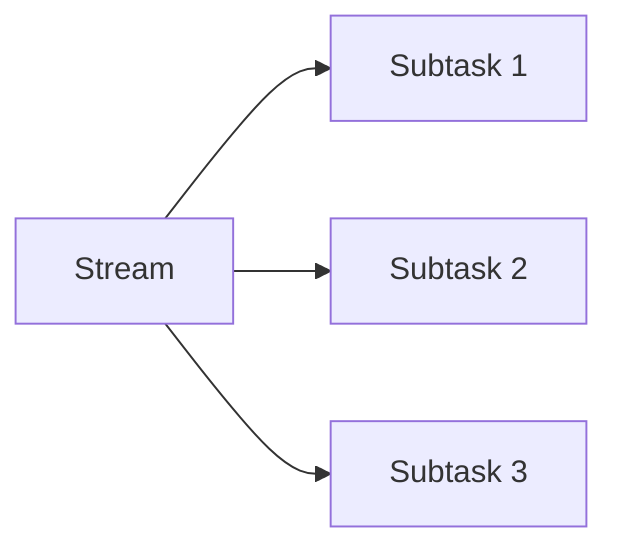

Reescalar implica:

* Redistribuir chaves
* Migrar estado
* Restaurar via checkpoint/savepoint

Tudo isso é **transparente** para o desenvolvedor.

---

# Flink em Arquiteturas de System Design

Flink aparece naturalmente em arquiteturas modernas:

```mermaid
flowchart LR
  Kafka --> Flink
  Flink --> KafkaOut[Kafka]
  Flink --> DB[Database]
  Flink --> ES[Search Index]
  Flink --> DL[Data Lake]
```

Casos comuns:

* Métricas em tempo real
* Detecção de fraude
* Enriquecimento de eventos
* Materialized views em streaming
* Agregações contínuas

---

# Quando Usar Flink (e Quando Não Usar)

## Quando Flink é a escolha certa

Use Flink quando você precisa de:

* Processamento **realmente em tempo real**
* Estado consistente
* Exactly-once semantics
* Janelas complexas
* Eventos fora de ordem
* Alta confiabilidade

## Quando NÃO usar Flink

Evite Flink quando:

* Batch resolve o problema
* Latência de minutos é aceitável
* Pipeline é simples demais
* Custo operacional não se justifica

> **Pergunta-chave de entrevista:**
> “Eu realmente preciso de latência de segundos ou milissegundos?”

---

# Flink em Entrevistas de System Design

Quando mencionar Flink, deixe claro:

* Qual é o **problema de streaming**
* Por que **batch não resolve**
* Onde está o **estado**
* Como lida com **falhas**
* Como escala
* Quais garantias oferece (at-least-once vs exactly-once)

Se você conseguir explicar isso com clareza, o entrevistador **sabe que você entende streaming de verdade**.

---

## Conclusão

O Flink é um dos frameworks de stream processing mais completos e poderosos disponíveis hoje. Ele resolve problemas que rapidamente se tornam intratáveis quando implementados “na mão”: estado distribuído, falhas, escalabilidade, eventos atrasados e consistência.

Em entrevistas de system design, Flink não é apenas uma ferramenta — é uma **declaração de que você entende os desafios reais do processamento de dados em tempo real**.
