# ZooKeeper

Aprenda como você pode usar o ZooKeeper para resolver uma grande variedade de problemas em **System Design**.

Coordenar sistemas distribuídos é difícil. Embora o poder computacional e as técnicas de escalabilidade tenham evoluído drasticamente, o problema fundamental permanece: **como orquestrar dezenas ou centenas de servidores para trabalharem juntos de forma consistente**?

Quando essas máquinas precisam:

* Eleger líderes
* Manter configurações consistentes
* Detectar falhas em tempo real

você enfrenta exatamente os problemas que o **Apache ZooKeeper** foi projetado para resolver.

Lançado em 2008, o ZooKeeper envelheceu, e diversas alternativas surgiram ao longo dos anos. Ainda assim, ele permanece **central no ecossistema Apache**, sendo usado (direta ou indiretamente) por sistemas como Kafka, HBase, Hadoop YARN, entre outros.

Apesar da idade, entender ZooKeeper ensina **conceitos fundamentais de sistemas distribuídos** que continuam válidos mesmo que você nunca o utilize diretamente. Ao aprender como o ZooKeeper resolve coordenação por meio de primitivas simples — **namespace hierárquico, znodes e watches** — você ganha intuição para problemas universais como:

* Consenso
* Eleição de líderes
* Gerenciamento de configuração
* Coordenação distribuída

Vamos percorrer como o ZooKeeper funciona, quando você deve usá-lo e como ele se encaixa no cenário moderno de sistemas distribuídos.

---

# Um Exemplo Motivador

Para entender por que coordenação é difícil, vamos começar com um exemplo simples. Imagine que você está construindo um aplicativo de chat.

Inicialmente, seu chat roda em **um único servidor**. A vida é simples.
Quando Alice envia uma mensagem para Bob, ambos estão conectados ao mesmo servidor. O servidor sabe exatamente para onde enviar a mensagem — tudo está em memória, com baixa latência e **nenhuma coordenação distribuída é necessária**.

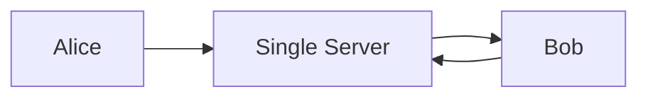

---

## O problema surge ao escalar

Agora, seu aplicativo cresce. Você adiciona mais servidores para lidar com mais usuários.

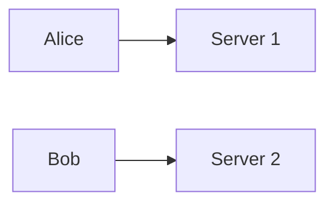

Perguntas começam a surgir:

* Como o servidor 1 sabe que Bob está conectado ao servidor 2?
* Onde essa informação é armazenada?
* O que acontece se o servidor que mantém esse mapeamento cair?
* E se dois servidores acreditarem ser o “líder” ao mesmo tempo?

Essas perguntas não são exclusivas de chat apps. Elas aparecem em:

* Clusters de banco de dados
* Sistemas de mensageria
* Plataformas de microserviços
* Infraestrutura distribuída em geral

É exatamente aqui que entra o ZooKeeper.

---

# Fundamentos do ZooKeeper (ZooKeeper Basics)

ZooKeeper é um **serviço centralizado de coordenação** para sistemas distribuídos.
Ele **não** é um banco de dados de aplicação, nem um message broker. Seu foco é **coordenação**, não dados de negócio.

---

## Modelo de Dados: ZNodes

O ZooKeeper expõe um **namespace hierárquico**, semelhante a um sistema de arquivos.

```mermaid
flowchart TB
  root[/]
  root --> app[/app]
  app --> config[/config]
  app --> leaders[/leaders]
  app --> workers[/workers]
```

### ZNodes

Cada nó nesse namespace é chamado de **znode**.

Um znode pode conter:

* Um pequeno volume de dados (tipicamente configuração ou metadata)
* Metadados (versão, timestamps, ACLs)
* Filhos (outros znodes)

### Tipos de ZNodes

* **Persistent**
  Continua existindo até ser explicitamente removido

* **Ephemeral**
  Existe apenas enquanto a sessão do cliente estiver ativa

* **Sequential**
  ZooKeeper adiciona automaticamente um sufixo incremental

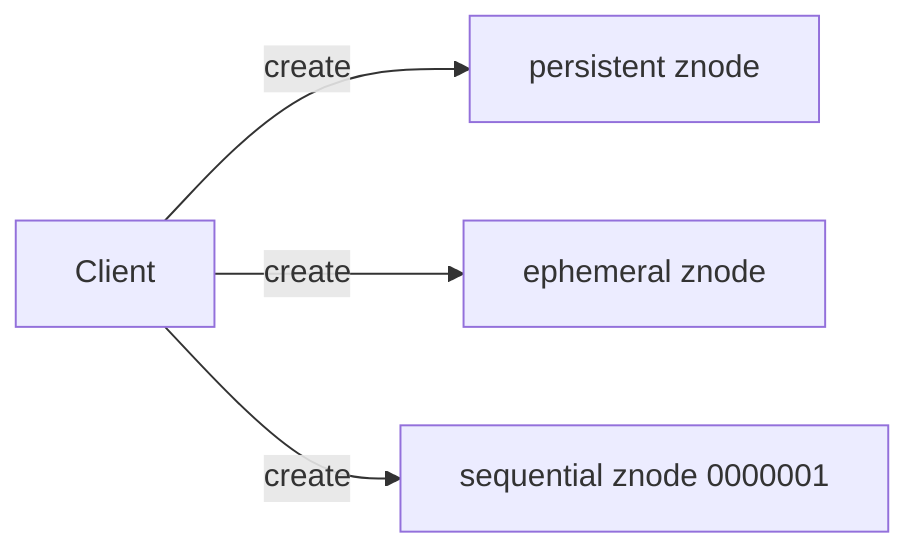

Esses tipos simples permitem construir abstrações poderosas.

---

## Papéis dos Servidores e Ensemble

ZooKeeper roda como um **ensemble** — um conjunto de servidores ZooKeeper.

Normalmente:

* 3, 5 ou 7 nós
* Sempre número ímpar (para quorum)

### Papéis principais

* **Leader**

  * Processa todas as escritas
  * Coordena consenso

* **Follower**

  * Replica dados
  * Atende leituras
  * Participa de eleições

* **Observer** (opcional)

  * Replica dados
  * Não participa do quorum (útil para escalar leituras)

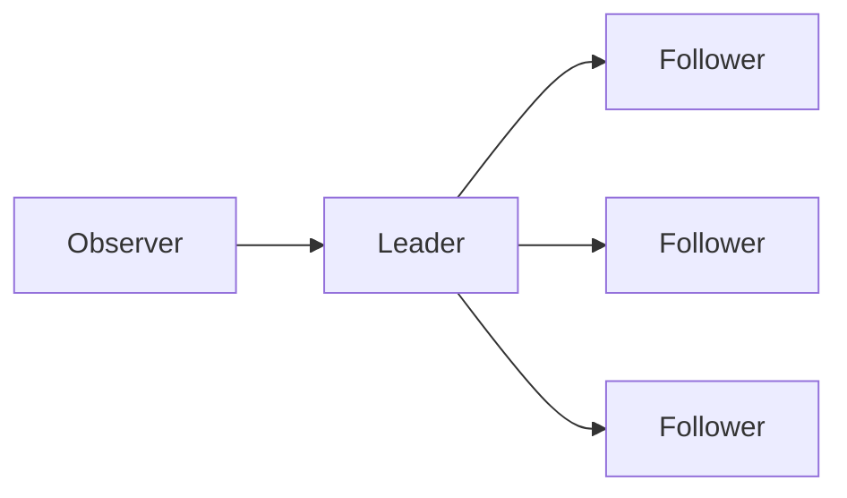

---

## Watches: Sabendo Quando Algo Muda

ZooKeeper permite que clientes registrem **watches** em znodes.

Um watch é uma notificação:

> “Me avise quando esse znode mudar.”

Eventos comuns:

* Criação
* Atualização
* Exclusão
* Mudança nos filhos

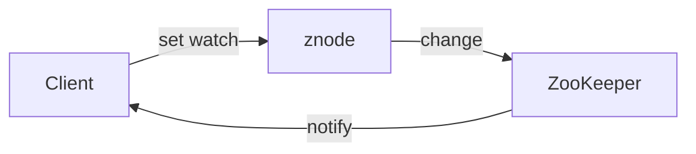

⚠️ Importante:
Watches são **one-shot**. Após disparar, precisam ser registrados novamente.

---

# Capacidades-Chave (Key Capabilities)

Com essas primitivas simples, o ZooKeeper permite construir soluções para problemas clássicos.

---

## ZooKeeper para Gerenciamento de Configuração

Configurações centralizadas são um problema clássico.

* Onde armazenar?
* Como atualizar?
* Como propagar mudanças?

Com ZooKeeper:

* Configurações ficam em znodes
* Serviços registram watches
* Mudanças são propagadas automaticamente

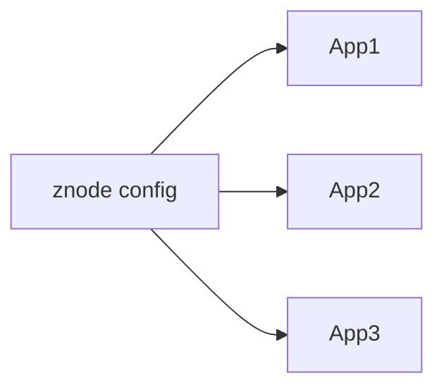

---

## ZooKeeper para Service Discovery

Serviços podem se registrar dinamicamente no ZooKeeper usando znodes efêmeros.

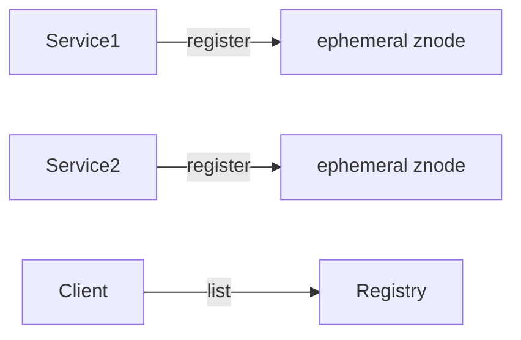

Se o serviço cair:

* A sessão expira
* O znode desaparece
* Clientes são notificados

---

## ZooKeeper para Eleição de Líder

Eleição de líder é um dos usos mais clássicos.

Estratégia comum:

* Cada participante cria um znode **sequential**
* O menor número é o líder
* Watches monitoram o predecessor

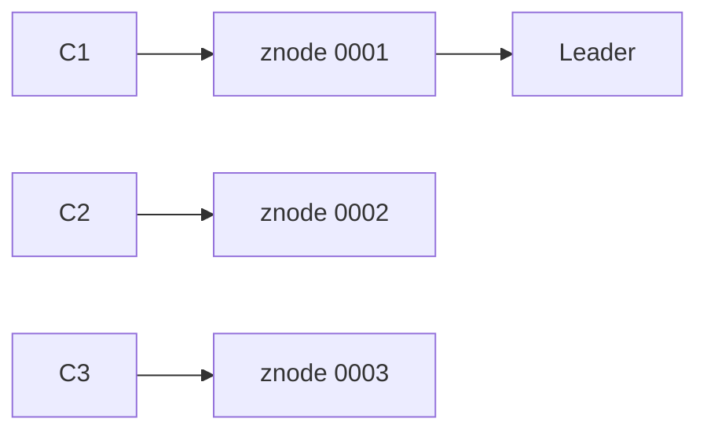

Se o líder cair, o próximo assume automaticamente.

---

## ZooKeeper para Locks Distribuídos

Locks distribuídos são difíceis de fazer corretamente.

ZooKeeper fornece um padrão confiável:

* Lock = znode sequential
* Menor número possui o lock
* Demais aguardam via watch

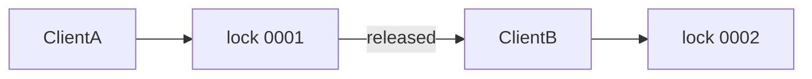

---

# Como o ZooKeeper Funciona Internamente

Agora vamos ao “por baixo do capô”.

---

## Consenso com ZAB

ZooKeeper usa o protocolo **ZAB (ZooKeeper Atomic Broadcast)**.

Objetivos:

* Ordem total das escritas
* Consistência forte
* Recuperação após falhas

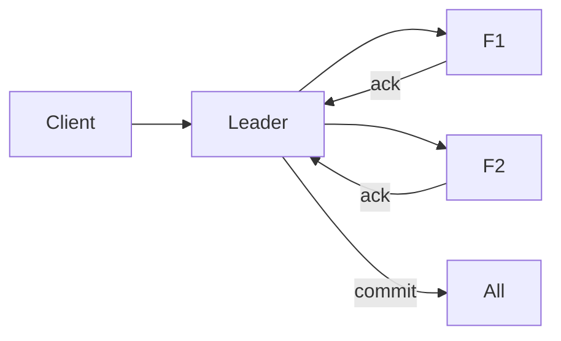

---

## Garantias de Consistência Forte

ZooKeeper oferece:

* Escritas lineares
* Leituras consistentes (dependendo do quorum)
* Visão ordenada das mudanças

Isso o torna ideal para coordenação, não para dados de alta taxa de escrita.

---

## Operações de Leitura e Escrita

* **Writes**

  * Sempre passam pelo líder
  * Exigem quorum

* **Reads**

  * Podem ser atendidas por followers
  * Podem ser “stale” se não sincronizadas

---

## Sessões e Gerenciamento de Conexão

Clientes mantêm sessões com ZooKeeper.

Se:

* Cliente trava
* Rede falha
* Timeout expira

👉 Sessão é encerrada
👉 Znodes efêmeros são removidos
👉 Watches disparam

---

## Arquitetura de Armazenamento

* Dados mantidos em memória
* Persistência via logs e snapshots
* Escritas são pequenas e rápidas
* Não projetado para grandes volumes de dados

---

## Lidando com Falhas

ZooKeeper assume falhas como parte normal do sistema.

* Líder pode cair
* Nova eleição ocorre
* Sistema continua funcionando se quorum existir

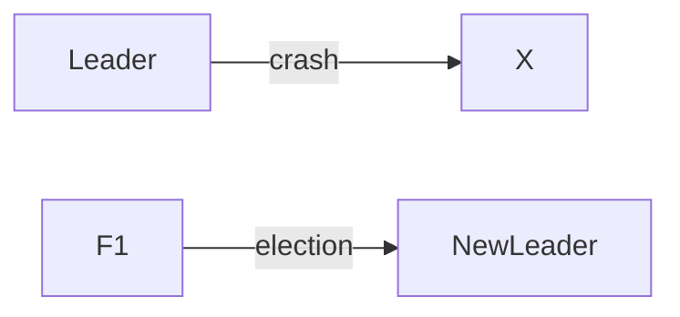

---

# ZooKeeper no Mundo Moderno

ZooKeeper continua relevante, mas o cenário mudou.

---

## Uso Atual em Sistemas Distribuídos

Ainda usado por:

* Kafka (especialmente versões mais antigas)
* HBase
* Hadoop
* Solr
* Infraestrutura Apache em geral

---

## Alternativas a Considerar

Hoje existem alternativas modernas:

* etcd
* Consul
* Kubernetes API Server
* Raft-based systems

Todas resolvem problemas semelhantes com arquiteturas diferentes.

---

## Limitações

ZooKeeper **não é**:

* Banco de dados de aplicação
* Sistema de alta taxa de escrita
* Solução para grandes blobs de dados

Principais limitações:

* Escala limitada
* Escritas centralizadas no líder
* Complexidade operacional

---

# Então… quando usar ZooKeeper?

Use ZooKeeper quando você precisa de:

## Smart Routing

* Saber onde está o líder
* Descobrir serviços ativos
* Coordenar decisões globais

## Problemas de Infraestrutura

* Coordenação de clusters
* Metadata crítica
* Orquestração distribuída

## Locks Distribuídos Duráveis

* Garantias fortes
* Recuperação correta após falhas

---

# Resumo

ZooKeeper é um serviço de coordenação distribuída com consistência forte, usado para resolver problemas fundamentais como eleição de líderes, service discovery, gerenciamento de configuração e locks distribuídos.

Mesmo com alternativas modernas, compreender ZooKeeper fornece uma base sólida para entender **coordenação distribuída**, um dos temas mais importantes em system design.

---

## Referências

* Apache ZooKeeper Documentation
* ZooKeeper: Wait-free coordination for Internet-scale systems
* Designing Data-Intensive Applications – Martin Kleppmann
