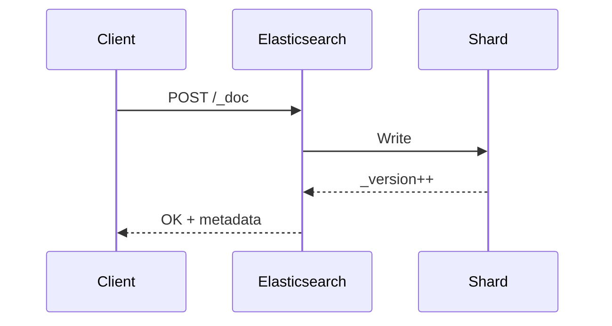
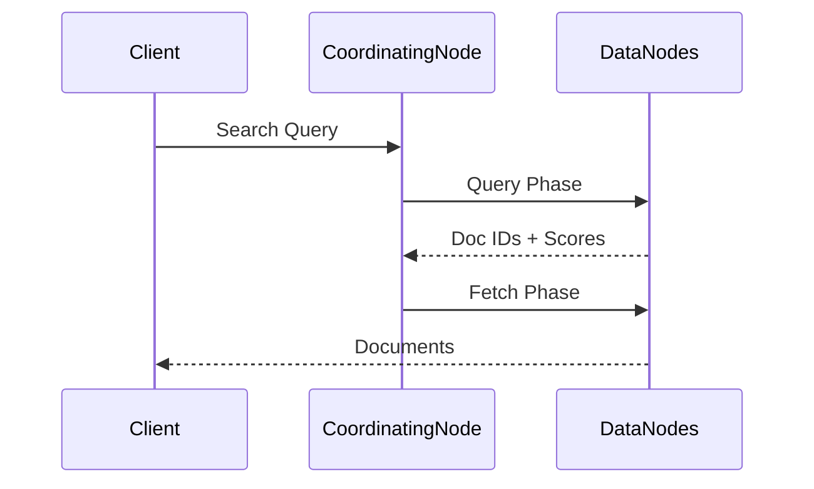
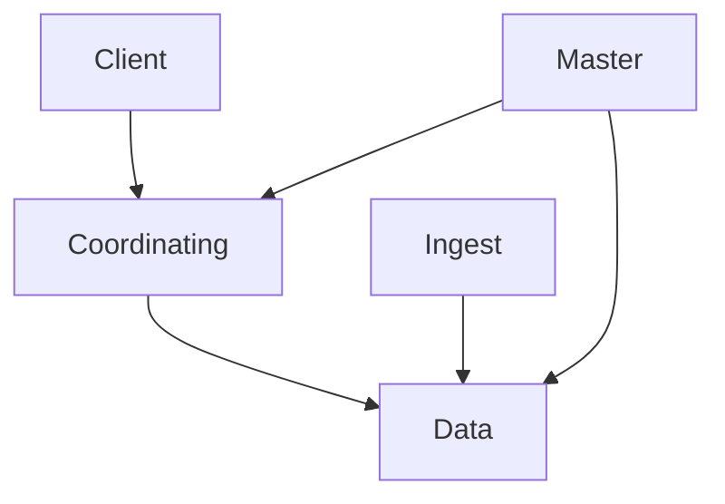
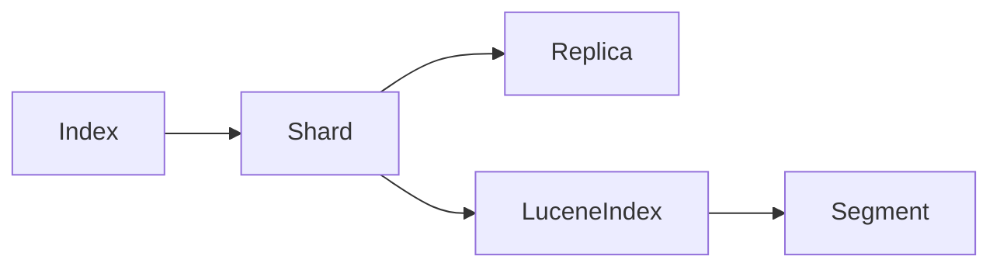

## Elasticsearch


Aprenda como você pode usar o **Elasticsearch** para resolver uma grande variedade de problemas em **System Design**.

---

## Visão Geral

Muitos problemas de design de sistemas envolvem **busca e recuperação de dados**:

> “Tenho muitos *itens* e quero encontrar rapidamente os corretos.”

Embora bancos de dados tradicionais (ex.: PostgreSQL com índice full-text) resolvam muitos casos, **em certa escala ou complexidade** você precisará de um sistema especializado. Normalmente surgem requisitos como:

* ordenação
* filtragem
* ranking
* facetas
* busca textual avançada

É nesse ponto que entra um dos motores de busca mais conhecidos do mundo: **Elasticsearch**.

---

## Objetivos deste estudo

Do ponto de vista de entrevistas e arquitetura:

1. **Como usar Elasticsearch**
   Dá a você uma ferramenta poderosa — raramente um problema de busca é “complexo demais” para o Elasticsearch.

2. **Como o Elasticsearch funciona por dentro**
   Fundamental para entrevistas de **infraestrutura**, **cloud** ou quando o entrevistador pede para você “imaginar que Elasticsearch não existe”.

---

## Conceitos Básicos

### Documentos

Unidades individuais de dados (JSON).

```json
{
  "id": "XYZ123",
  "title": "The Great Gatsby",
  "author": "F. Scott Fitzgerald",
  "price": 10.99,
  "createdAt": "2024-01-01T00:00:00.000Z"
}
```

---

### Índices

Um **índice** é uma coleção de documentos (similar a uma tabela SQL).

> ⚠️ Atenção: “index” aqui não é apenas uma estrutura auxiliar, mas o *container lógico* de dados.

Exemplos de índices:

* books
* users
* reviews
* orders

---

### Mappings e Fields

O **mapping** define o *schema* do índice:

```json
{
  "properties": {
    "id": { "type": "keyword" },
    "title": { "type": "text" },
    "author": { "type": "text" },
    "price": { "type": "float" },
    "createdAt": { "type": "date" }
  }
}
```

👉 O mapping determina:

* o que é pesquisável
* como os dados são indexados
* impacto direto em **performance e memória**

---

## Mermaid — Documento → Índice → Mapping


---

## Uso Básico

### Criar um Índice

```http
PUT /books
{
  "settings": {
    "number_of_shards": 1,
    "number_of_replicas": 1
  }
}
```

---

### Definir Mapping

```http
PUT /books/_mapping
{
  "properties": {
    "title": { "type": "text" },
    "author": { "type": "keyword" },
    "price": { "type": "float" }
  }
}
```

---

### Inserir Documentos

```http
POST /books/_doc
{
  "title": "The Great Gatsby",
  "author": "F. Scott Fitzgerald",
  "price": 9.99
}
```

Resposta importante:

```json
{
  "_id": "kLEHMYkBq7V9x4qGJOnh",
  "_version": 1
}
```

➡️ O campo `_version` permite **controle de concorrência otimista**.

---

## Mermaid — Ciclo de Escrita



---

## Atualização de Documentos

* Atualização total (`PUT`)
* Atualização parcial (`_update`)
* Proteção contra overwrite via `version`

```http
POST /books/_update/{id}
{
  "doc": {
    "price": 14.99
  }
}
```

---

## Busca

### Busca Simples

```http
GET /books/_search
{
  "query": {
    "match": {
      "title": "Great"
    }
  }
}
```

### Busca com Filtros

```http
{
  "query": {
    "bool": {
      "must": [
        { "match": { "title": "Great" } },
        { "range": { "price": { "lte": 15 } } }
      ]
    }
  }
}
```

---

## Mermaid — Fluxo de Busca



---

## Ordenação (Sort)

* Por campo
* Por múltiplos campos
* Por script (Painless)
* Por campos aninhados

```http
"sort": [
  { "price": "asc" },
  { "publish_date": "desc" }
]
```

---

## Paginação

### From / Size (simples, porém caro)

```json
{
  "from": 0,
  "size": 10
}
```

⚠️ Ineficiente para paginação profunda.

---

### Search After (eficiente)

```json
"search_after": [1463538857, "654323"]
```

✔️ Sem duplicações
✔️ Escala bem
❌ Não permite pular páginas

---

### Cursor com PIT

```http
POST /my_index/_pit?keep_alive=1m
```

✔️ Visão consistente
❌ Mais custo de cluster

---

## Arquitetura do Cluster


### Tipos de Nós

* **Master** – coordenação do cluster
* **Data** – armazenamento e busca
* **Coordinating** – frontend de queries
* **Ingest** – transformação de dados
* **ML** – machine learning

---

## Mermaid — Tipos de Nós



---

## Shards, Réplicas e Lucene

Apache Lucene é o motor interno do Elasticsearch.

* Índice → Shards
* Shard → Lucene Index
* Lucene Index → Segments (imutáveis)

---

## Mermaid — “Bonecas Russas” do Elasticsearch



---

## Segments (Imutabilidade)

* Inserts → novos segmentos
* Updates → delete lógico + insert
* Deletes → marcados e limpos em merge

### Benefícios

✔️ Cache eficiente
✔️ Concorrência simples
✔️ Alta performance de leitura

---

## Índice Invertido


Transforma busca de **O(n)** em **O(1)**:

```
"lazy" → [doc12, doc53]
```

---

## Doc Values

Estrutura **colunar** usada para:

* ordenação
* agregações
* analytics

📌 Similar ao que Spark / Redshift fazem.

---

## Em Entrevistas de System Design

### Boas práticas

✔️ Elasticsearch **não é banco transacional**
✔️ Ideal para **leitura pesada**
✔️ Aceita **consistência eventual**
✔️ Requer **denormalização**
✔️ Geralmente alimentado por **CDC**

---

## Lições Arquiteturais

* **Imutabilidade** melhora cache, compressão e concorrência
* **Separação de responsabilidades** (coordenação vs dados)
* **Estruturas de dados importam**
* **Trade-offs CAP são reais**
* **Distribuição ≠ simplicidade**

---
