# Kafka — System Design Deep Dive (PT-BR)

## O que é Kafka

O **Apache Kafka** é uma plataforma open-source de **event streaming distribuído**, usada tanto como **fila de mensagens** quanto como **sistema de streams**.
Ele foi projetado para **alto desempenho**, **escala horizontal** e **durabilidade**, sendo capaz de processar volumes massivos de eventos em tempo real.

---

## Exemplo Motivador — Visão Simples (Producer → Queue → Consumer)

Imagine um site da **Copa do Mundo** que precisa atualizar estatísticas em tempo real:

* Gol
* Cartão
* Substituição

Cada evento é enviado para uma fila por um **producer** e processado por um **consumer**.

### Visão inicial (fila simples)

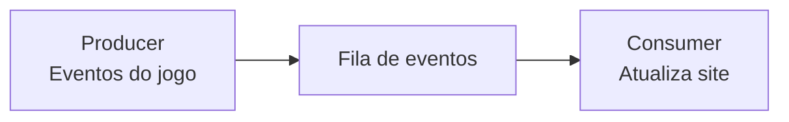

⚠️ Problema: **não escala**.

---

## Escalando o Exemplo — Muitos Jogos, Muitos Eventos

Agora imagine:

* 1.000 jogos
* Todos ao mesmo tempo
* Milhões de eventos

Uma única fila vira gargalo.

---

## Particionamento — Garantindo Ordem por Jogo

A solução é **distribuir eventos por chave** (ex: `game_id`).
Eventos do mesmo jogo **sempre vão para a mesma partição**, preservando a ordem.

### Partições por chave (conceito central do Kafka)

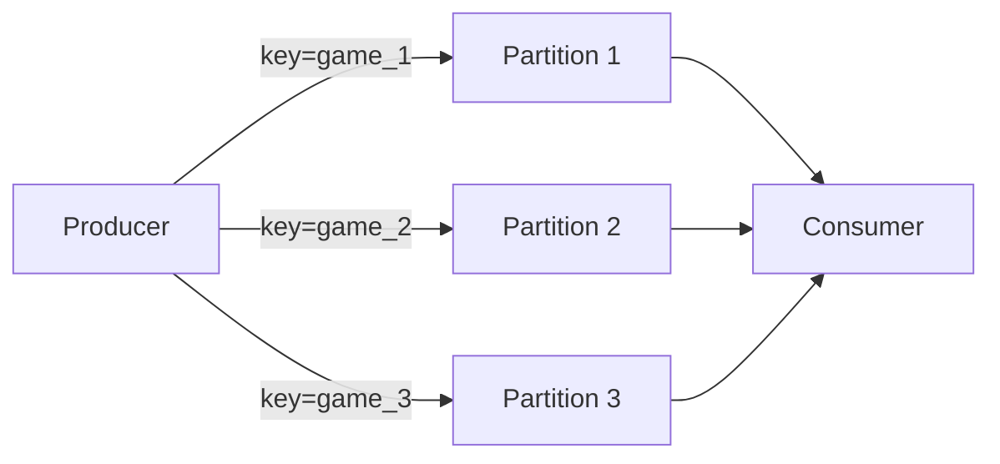

✔️ Ordem garantida **dentro da partição**
✔️ Processamento em paralelo **entre partições**

---

## Consumer Groups — Escalando o Consumo

Mesmo com partições, um único consumer pode não aguentar a carga.
Kafka resolve isso com **Consumer Groups**:

* Cada **partição é consumida por apenas um consumer do grupo**
* Kafka faz o balanceamento automaticamente

### Consumer Group em ação

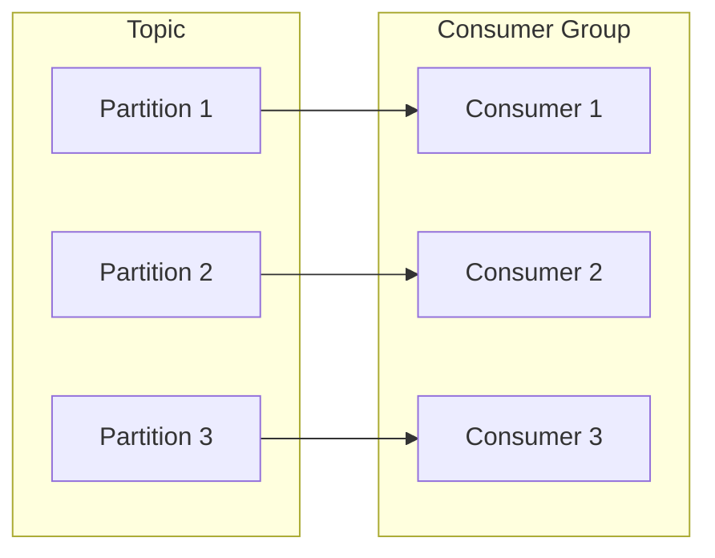

✔️ Cada evento é processado **uma única vez por grupo**
✔️ Escala horizontal simples

---

## Topics — Separando Domínios (Futebol vs Basquete)

Para evitar misturar dados:

* Futebol → `soccer-topic`
* Basquete → `basketball-topic`

Consumers assinam apenas os tópicos relevantes.

### Múltiplos tópicos

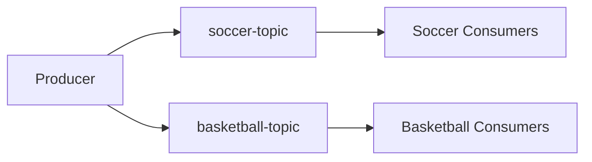

---

## Arquitetura Kafka — Brokers, Topics e Partitions

### Cluster Kafka

* Um **cluster** é composto por vários **brokers**
* Cada broker armazena **partições**
* Tópicos são apenas **agrupamentos lógicos**

### Visão realista do cluster

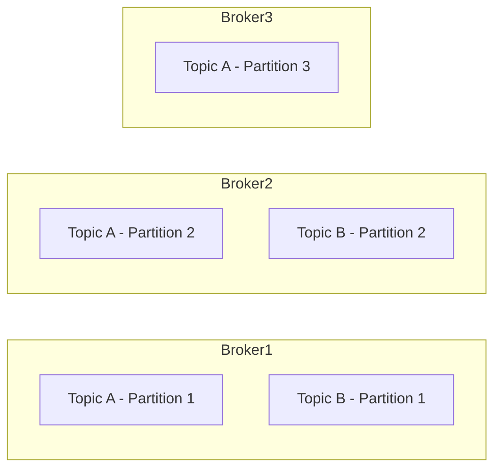

📌 **Tópico ≠ Partição**

* Tópico: conceito lógico
* Partição: unidade física de escala

---

## Como Kafka Escreve Mensagens

Uma mensagem (record) possui:

* **value** (obrigatório)
* **key** (opcional, mas altamente recomendado)
* timestamp
* headers

### Roteamento da mensagem

```mermaid
flowchart LR
    Producer -->|hash(key)| PartitionSelector
    PartitionSelector --> Partition
    Partition --> Broker
```

📌 Regra clássica:

```
partition = hash(key) % número_de_partições
```

---

## Partição como Commit Log (Append-Only)

Cada partição é um **log imutável**, apenas append.

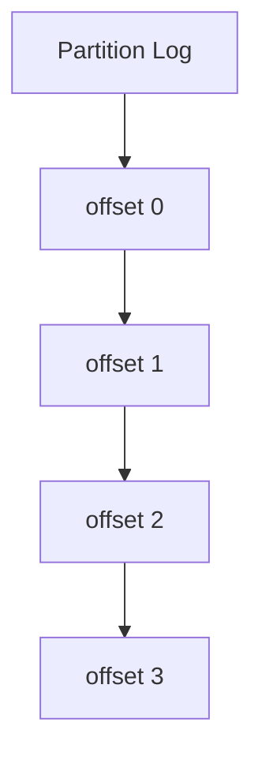

✔️ Imutável
✔️ Altíssimo throughput
✔️ Fácil replicação

---

## Offsets — Controle do Consumo

Consumers **controlam seus próprios offsets**.

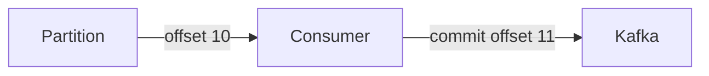

✔️ Retomada após falha
✔️ Exactly-once / At-least-once depende da estratégia

---

## Replicação — Leader e Followers

Kafka usa **Leader–Follower replication**.

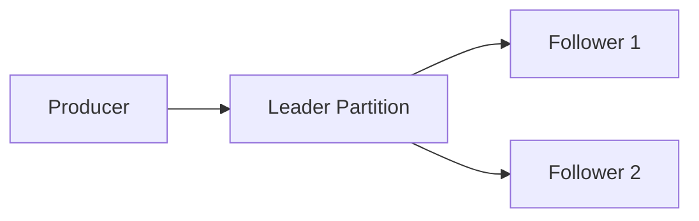

* Producer escreve **somente no leader**
* Followers replicam passivamente
* Se o leader cair → follower assume

---

## Consumo — Modelo Pull (Não Push)

Kafka **não empurra** mensagens.

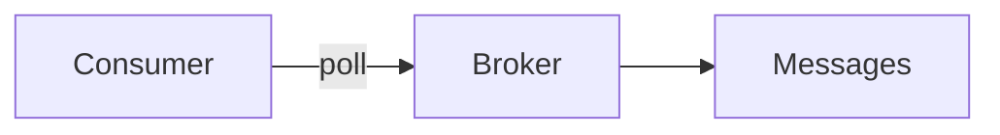

✔️ Controle de backpressure
✔️ Batch eficiente
✔️ Consumers lentos não derrubam o sistema

---

## Quando Usar Kafka em Entrevistas

### Use Kafka quando:

* Processamento assíncrono
* Ordem importa
* Producer e consumer precisam escalar independentemente

### Streams:

* Processamento contínuo
* Múltiplos consumidores
* Near real-time

---

## Escalabilidade — O Ponto Central da Entrevista

### Estratégias

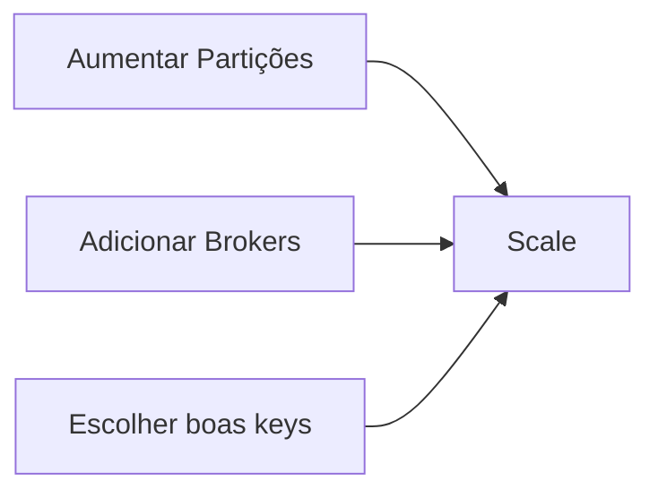

📌 **Particionamento é a decisão mais importante**

---

## Hot Partitions — Problema Clássico

Exemplo: anúncios da Nike explodindo em cliques.

### Estratégias

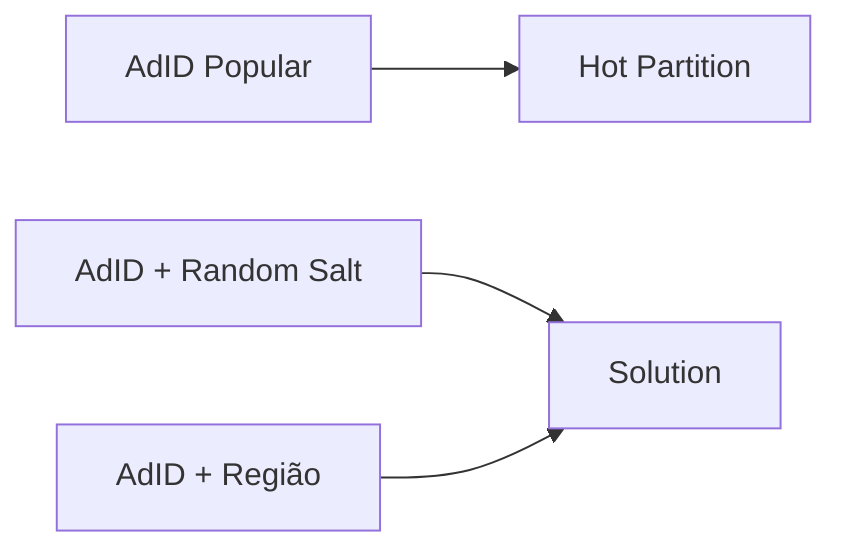

---

## Confiabilidade — E se o Consumer cair?

Kafka lida bem com isso:

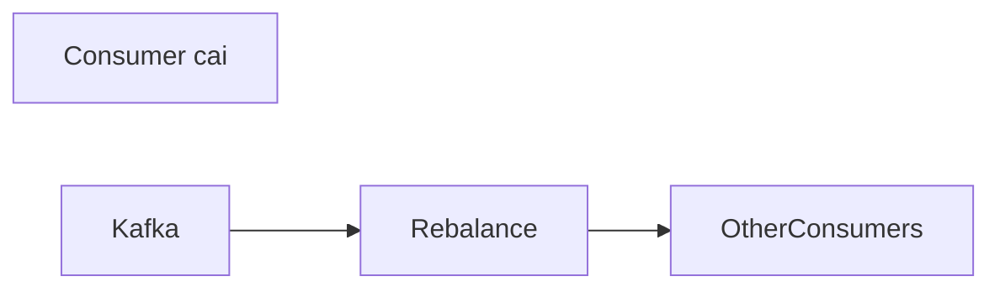

✔️ Offset salvo
✔️ Rebalance automático

---

## Retentativas e DLQ

Kafka não tem retry nativo no consumer.

### Padrão comum

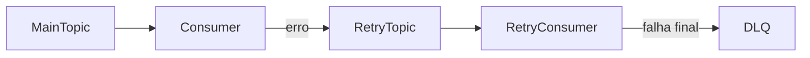

---

## Retention Policy

Mensagens não são apagadas ao consumir.

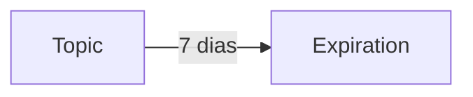

* Baseado em tempo ou tamanho
* Default: 7 dias

---

## Resumo Final

* Kafka é um **log distribuído**
* Escala via **partições**
* Ordem garantida **por partição**
* Consumer Groups garantem **processamento único**
* Sempre disponível, **às vezes consistente** 😄

---
