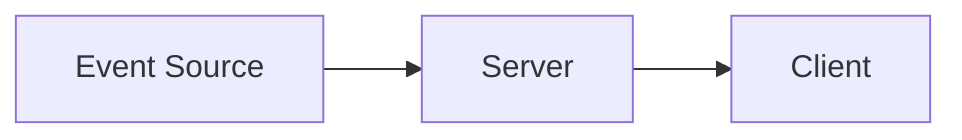
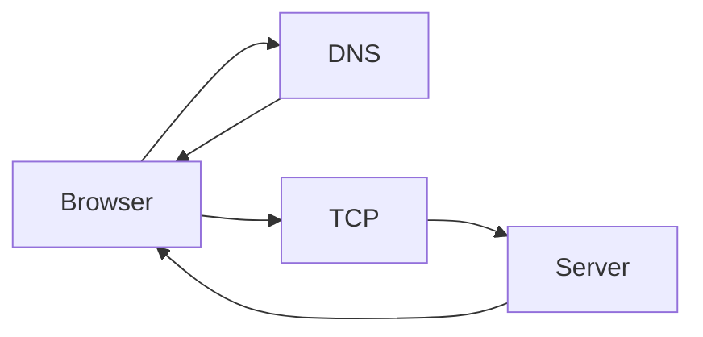
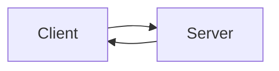
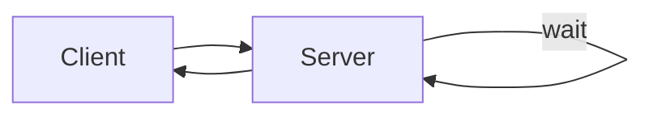
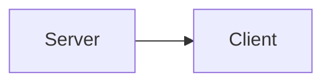
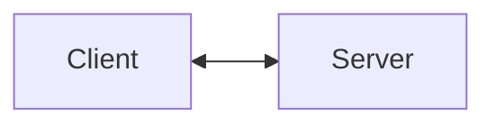
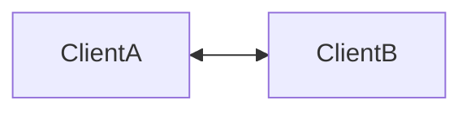
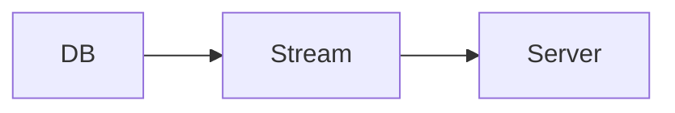
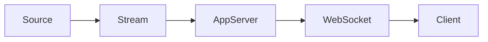

# Real-time Updates

Aprenda sobre **métodos para disparar atualizações em tempo real** no seu system design.

⚡ **Real-time Updates** aborda o desafio de entregar **notificações imediatas e mudanças de dados** dos servidores para os clientes **no exato momento em que os eventos acontecem**.
De aplicações de chat, onde mensagens precisam chegar instantaneamente, até dashboards ao vivo exibindo métricas em tempo real, os usuários esperam ser notificados **assim que algo acontece**.

Esse padrão cobre as abordagens arquiteturais necessárias para permitir **comunicação bidirecional, de baixa latência**, entre clientes e servidores.

---

# O Problema

Considere um editor colaborativo de documentos como o **Google Docs**.

Quando um usuário digita um caractere, **todos os outros usuários** visualizando o documento precisam ver essa alteração **em poucos milissegundos**.

Em aplicações desse tipo, você **não pode** fazer com que cada usuário fique consultando o servidor a cada poucos milissegundos sem **destruir sua infraestrutura**.

O desafio central é estabelecer **canais de comunicação eficientes e persistentes** entre clientes e servidores.

O HTTP tradicional segue o modelo **request–response**:

1. O cliente faz uma requisição
2. O servidor responde
3. A conexão é encerrada

Esse modelo funciona muito bem para navegação web tradicional, mas **falha completamente** quando o servidor precisa **empurrar dados proativamente** para o cliente.

Infelizmente, para muitos candidatos, esses problemas (quando existem) costumam ser resolvidos uma única vez por um time especializado de infraestrutura. Isso significa que muitos desafios de system design exigem que você atravesse uma ponte que talvez nunca tenha precisado construir antes.

Não se preocupe — neste padrão cobriremos exatamente o que você precisa saber para **tomar boas decisões em entrevistas**. E quem sabe, no futuro, você seja a pessoa que vai construir essa camada no seu próximo projeto.

---

## Exemplos Clássicos que Usam Real-time Updates

Esse padrão aparece repetidamente em entrevistas:

* Design Ticketmaster
* Design Uber
* Design WhatsApp
* Design Robinhood
* Design Google Docs
* Design Strava
* Design Online Auction
* Design Facebook Live Comments

---

# A Solução: Dois “Hops”

Quando sistemas exigem atualizações em tempo real, notificações push, etc., a solução **sempre envolve duas partes distintas**:

1. **Hop 1:** como levar atualizações **do servidor para o cliente**
2. **Hop 2:** como levar atualizações **da fonte de eventos para o servidor**

Esses dois hops têm **trade-offs completamente diferentes**, então vamos analisá-los separadamente.

---

# Hop 1 — Protocolos Cliente–Servidor

O primeiro hop trata de **como estabelecer comunicação eficiente entre clientes e servidores**.

Embora HTTP request–response funcione para muitos casos, sistemas em tempo real frequentemente precisam de:

* Conexões persistentes
* Ou estratégias inteligentes de polling

É aqui que entramos no **cerne de redes**.

---

## Networking 101 (o mínimo necessário)

Antes de mergulhar nos protocolos de tempo real, vale entender o básico de redes. Em essência, **esses problemas são problemas de rede**.

Redes seguem uma arquitetura em camadas (modelo OSI). Para system design, três camadas aparecem o tempo todo.

---

## Camadas de Rede Relevantes para Entrevistas

### Camada de Rede (Layer 3)

* IP (Internet Protocol)
* Responsável por:

  * Endereçamento
  * Roteamento
  * Fragmentação de pacotes
* Não garante:

  * Entrega
  * Ordem
  * Não duplicação

> “Best effort delivery”.

---

### Camada de Transporte (Layer 4)

Aqui entram **TCP** e **UDP**.

#### TCP

* Orientado a conexão
* Garante:

  * Entrega
  * Ordem
  * Não duplicação
* Custo:

  * Handshake
  * Estado
  * Overhead

#### UDP

* Não orientado a conexão
* Não garante nada
* Extremamente rápido

> “Spray and pray”.

---

### Camada de Aplicação (Layer 7)

Protocolos usados diretamente pelas aplicações:

* DNS
* HTTP
* WebSockets
* WebRTC

Eles abstraem os detalhes de transporte e permitem comunicação sem que o desenvolvedor pense em pacotes ou bits.

---

## Ciclo de Vida de uma Requisição HTTP

Quando você digita uma URL no navegador:

1. DNS resolve domínio → IP
2. TCP handshake
3. Requisição HTTP
4. Resposta HTTP
5. Conexão é encerrada

Esse modelo **não escala bem para updates em tempo real**.

---

# Estratégias para Real-time Updates (Hop 1)

Agora entramos nas opções reais.

---

## Simple Polling (Baseline)

O cliente pergunta periodicamente:

> “Tem algo novo?”

### Prós

* Simples
* Fácil de implementar

### Contras

* Latência alta
* Desperdício de recursos
* Escala muito mal

Usado apenas como baseline conceitual.

---

## Long Polling (A Solução Fácil)

O cliente faz uma requisição e o servidor **segura a resposta** até haver algo novo.

### Prós

* Reduz polling excessivo
* Compatível com HTTP

### Contras

* Conexões presas
* Difícil de escalar
* Latência ainda variável

Muito comum em sistemas legados.

---

## Server-Sent Events (SSE)

Canal **unidirecional**:

* Servidor → Cliente

### Características

* Baseado em HTTP
* Conexão persistente
* Apenas texto
* Cliente não envia mensagens pelo canal

### Quando usar

* Notificações
* Feeds
* Logs em tempo real

---

## WebSockets — O Campeão Full-Duplex

WebSockets criam uma **conexão bidirecional persistente**.

### Prós

* Baixa latência
* Comunicação em tempo real
* Full-duplex

### Contras

* Gerenciamento de conexões
* Mais complexo que HTTP
* Load balancing exige cuidado (sticky sessions ou brokers)

👉 **Resposta padrão em entrevistas** para chats, colaboração e feeds ao vivo.

---

## WebRTC — Peer-to-Peer

WebRTC permite comunicação **direta entre clientes**, sem passar pelo servidor após o setup inicial.

### Quando usar

* Vídeo
* Áudio
* Streaming P2P

### Quando não usar

* Escala massiva sem media servers
* Casos simples de notificação

---

# Hop 2 — Da Fonte de Eventos para o Servidor

Agora a outra metade do problema:
**como os eventos chegam ao servidor?**

Fontes comuns:

* Banco de dados
* Filas (Kafka, PubSub)
* Streams
* Serviços internos

Modelos comuns:

* Push (event-driven)
* Pull (polling interno)
* Change Data Capture (CDC)

---

## Push vs Pull no Servidor

### Pull

* Servidor consulta periodicamente a fonte
* Simples
* Latência maior

### Push

* Fonte empurra eventos
* Baixa latência
* Mais eficiente

---

# Arquitetura Completa de Real-time Updates

Esse padrão aparece repetidamente em entrevistas.

---

# Quando Usar Real-time Updates

Use quando:

* Usuário espera feedback imediato
* Colaboração em tempo real
* Eventos financeiros
* Chats e feeds ao vivo

Não use quando:

* Latência de segundos é aceitável
* Batch resolve
* Complexidade não se justifica

---

# Como falar disso em entrevistas

Frase forte:

> “Real-time updates exigem dois hops distintos: ingestão de eventos no backend e entrega eficiente ao cliente.”

Se você explicar:

* Por que HTTP não basta
* Quando usar WebSockets vs SSE
* Como escalar conexões
* Como eventos chegam ao servidor

👉 Você demonstra **maturidade real em system design**.

---

## Conclusão

Real-time updates não são apenas um detalhe de UX — eles moldam completamente a arquitetura do sistema. Entender os trade-offs entre polling, long polling, SSE, WebSockets e WebRTC é essencial para projetar sistemas modernos e para se destacar em entrevistas de system design.
