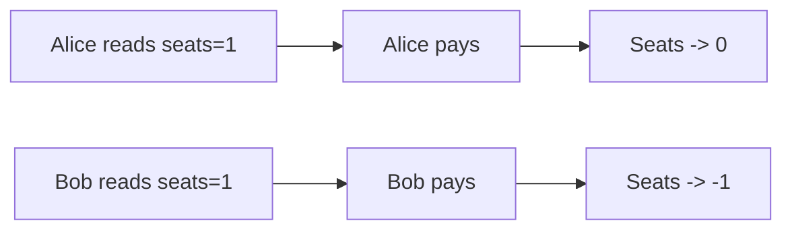
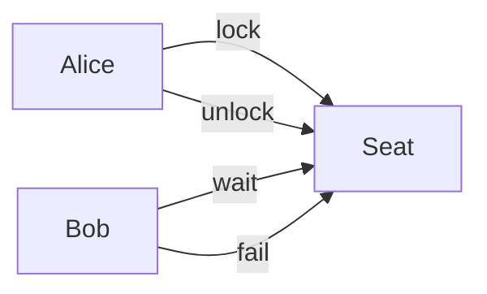
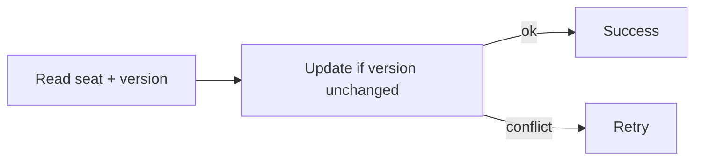
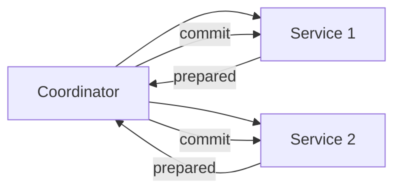
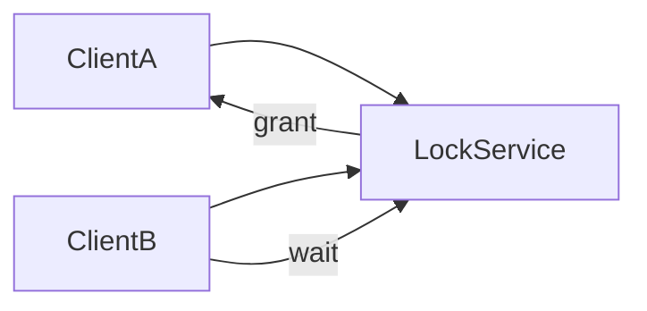
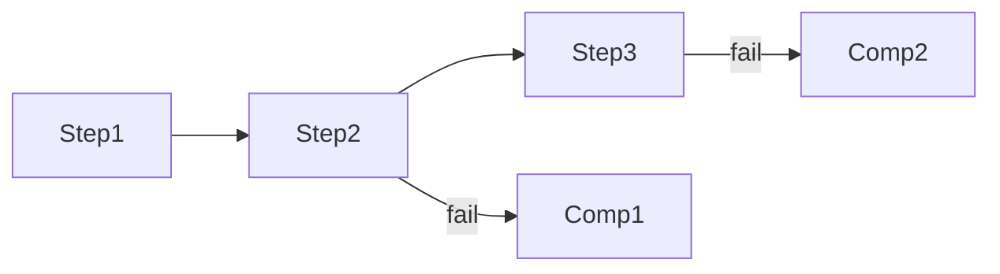

# Dealing with Contention

Aprenda como **lidar com alta contenção** na sua entrevista de **System Design**.

🔒 **Contention (contenção)** ocorre quando múltiplos processos competem simultaneamente pelo **mesmo recurso**. Isso pode ser a compra do último ingresso de um show, um lance em um leilão ou qualquer cenário semelhante.
Sem tratamento adequado, surgem **race conditions**, **double-booking** e **estado inconsistente**.

Este padrão apresenta soluções que vão desde **transações simples em banco de dados** até **coordenação distribuída mais complexa**, mostrando quando **controle de concorrência otimista** é melhor que **locking pessimista** e como escalar além de um único nó.

---

# O Problema

Considere a compra de ingressos online.

Há **1 assento restante** para o show do The Weeknd.
Alice e Bob querem esse último assento e clicam em **“Buy Now” exatamente no mesmo instante**.

Sem coordenação adequada, o seguinte acontece:

1. A requisição de Alice lê: “1 assento disponível”
2. A requisição de Bob lê: “1 assento disponível”
   *(as duas leituras acontecem antes de qualquer escrita)*
3. Alice verifica `1 ≥ 1` → segue para pagamento
4. Bob verifica `1 ≥ 1` → segue para pagamento
5. Alice é cobrada $500, contador de assentos vai para 0
6. Bob é cobrado $500, contador de assentos vai para -1
7. Ambos recebem confirmação **com o mesmo assento**

No dia do show, os dois aparecem acreditando possuir **Row 5, Seat 12**.
Um deles será expulso, o local terá que emitir reembolso e lidar com dois clientes extremamente insatisfeitos.

---

## Linha do tempo da race condition



Essa é a definição clássica de **race condition**:
o resultado depende da ordem não controlada das operações concorrentes.

---

# A Solução (Visão Geral)

Existem **duas grandes categorias** de soluções:

1. **Soluções em nó único**
2. **Soluções distribuídas (múltiplos nós)**

A escolha depende de:

* Escala
* Latência
* Criticidade do recurso
* Complexidade aceitável

---

# Soluções em Nó Único

Se tudo acontece em **um único banco de dados**, a vida é relativamente mais simples.

---

## Atomicidade

A regra básica:

> “Ler + validar + escrever deve acontecer como **uma única operação atômica**.”

Exemplo conceitual:

```sql
UPDATE tickets
SET seats = seats - 1
WHERE event_id = 123
AND seats > 0;
```

Se o `UPDATE` afetar:

* 1 linha → sucesso
* 0 linhas → ingressos esgotados

Nenhuma race condition ocorre porque a verificação e a atualização são atômicas.

---

## Pessimistic Locking

Aqui, você **bloqueia o recurso antes de usá-lo**.

Exemplo mental:

* Alice obtém o lock do assento
* Bob espera
* Alice finaliza
* Bob percebe que não há mais assentos



### Prós

* Fácil de raciocinar
* Garantias fortes

### Contras

* Reduz throughput
* Pode gerar **deadlocks**
* Escala mal sob alta contenção

---

## Isolation Levels

Bancos relacionais oferecem níveis de isolamento:

* Read Uncommitted
* Read Committed
* Repeatable Read
* Serializable

Para contenção:

* **Serializable** elimina race conditions
* Mas é caro e pode abortar transações

Em entrevistas, basta demonstrar que você entende que **nível de isolamento impacta concorrência**.

---

## Optimistic Concurrency Control (OCC)

Aqui, você assume que **conflitos são raros**.

Fluxo:

1. Leia o recurso
2. Faça alterações
3. Verifique se ninguém mudou antes de você
4. Se mudou → retry

Normalmente feito com **versionamento**:



### Prós

* Escala melhor
* Sem locks longos

### Contras

* Requisições podem falhar e repetir
* Precisa lidar com retries

👉 Excelente escolha quando contenção é moderada.

---

# Soluções em Múltiplos Nós

Quando o sistema cresce, a coisa complica.

Agora você tem:

* Vários app servers
* Vários bancos
* Possivelmente múltiplas regiões

---

## Two-Phase Commit (2PC)

2PC tenta manter atomicidade entre múltiplos sistemas.

Fases:

1. **Prepare**: todos dizem “posso?”
2. **Commit**: todos confirmam



### Problemas

* Bloqueante
* Coordenador é SPOF
* Difícil de escalar

👉 Quase sempre **desencorajado** em entrevistas modernas.

---

## Distributed Locks

Um serviço centralizado (ou consenso) controla locks.

Exemplos:

* ZooKeeper
* etcd
* Redis (com cuidado!)



### Prós

* Funciona em sistemas distribuídos
* Conceito simples

### Contras

* Latência
* Falhas de lock
* Cuidado extremo com timeouts

---

## Saga Pattern

Sagas evitam locks globais.

Ideia:

* Cada passo é uma transação local
* Falhas são compensadas



Em ingressos:

* Reserva assento
* Cobra pagamento
* Se pagamento falhar → libera assento

👉 Muito comum em arquiteturas modernas.

---

# Escolhendo a Abordagem Correta

Perguntas-chave:

* O recurso é **escasso**?
* A contenção é **alta ou rara**?
* O impacto de erro é grave?
* Qual o custo de retry?

---

# Quando Usar em Entrevistas

Este padrão aparece quando:

* Recursos são limitados
* Há competição simultânea
* Erros custam dinheiro ou reputação

---

## Sinais de Reconhecimento

Se você ouvir:

* “último assento”
* “última vaga”
* “saldo”
* “inventário”
* “lance em leilão”

👉 **Contenção** é o problema central.

---

## Cenários Comuns de Entrevista

* Ticketmaster
* Booking.com
* Uber (matching)
* Leilões online
* Flash sales
* Estoque de e-commerce

---

# Quando NÃO Over-engineerar

Evite:

* Locks distribuídos para baixa concorrência
* 2PC sem necessidade real
* Coordenação complexa quando um `UPDATE` atômico resolve

Frase madura:

> “Enquanto estivermos em um único banco, eu resolveria isso com atomicidade e controle otimista.”

---

# Deep Dives Comuns em Entrevistas

### “Como evitar deadlocks com locking pessimista?”

* Ordem consistente de locks
* Timeouts
* Escopo mínimo

---

### “E se o coordenador cair durante uma transação distribuída?”

* Timeout
* Rollback
* Recovery baseado em logs

---

### “Como lidar com o problema ABA no controle otimista?”

* Versionamento forte
* UUIDs
* Compare-and-swap

---

### “E a performance quando todo mundo quer o mesmo recurso?”

* Filas
* Rate limiting
* Backpressure
* UX adaptativo (fila virtual)

---

# Conclusão

Contenção é um problema inevitável em sistemas concorrentes. O diferencial de um bom system designer não é eliminar contenção, mas **reconhecê-la cedo** e escolher a **solução mais simples que funcione**.

Em entrevistas, mostrar que você:

* Reconhece race conditions
* Entende trade-offs
* Evita over-engineering
* Evolui a solução conforme a escala

… é exatamente o que diferencia um candidato mediano de um candidato forte.
