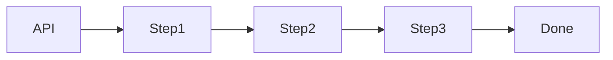
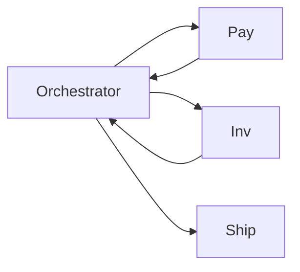
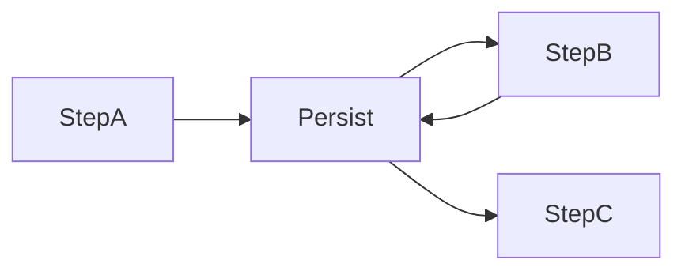
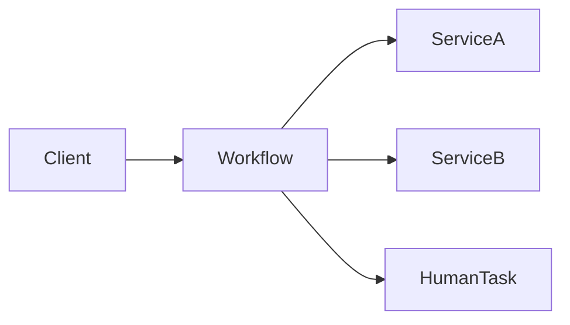
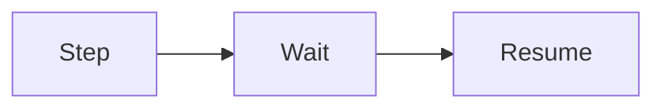

# Multi-step Processes

Aprenda sobre **processos multi-etapas** e como lidar com eles em system design usando **sagas, sistemas de workflow e execução durável (durable execution)**.

⚙️ **Sistemas reais de produção** precisam sobreviver a falhas, retries e operações de longa duração que podem se estender por **horas ou dias**.
Frequentemente, esses sistemas assumem a forma de **processos multi-etapas** (multi-step processes) ou **sagas**, que envolvem a coordenação de múltiplos serviços e sistemas.

Esse é um **foco constante de desafios operacionais e de design** para engenheiros, e existem várias abordagens diferentes para lidar com isso.

---

# O Problema

Muitos sistemas do mundo real acabam coordenando **dezenas ou até centenas de serviços diferentes** para completar uma única requisição do usuário.
Construir processos multi-etapas confiáveis em sistemas distribuídos é **surpreendentemente difícil**.

Enquanto sistemas “limpos” como bancos de dados lidam basicamente com:

* Um `write`
* Um `read`

… aplicações reais precisam:

* Chamar serviços externos (frequentemente instáveis)
* Esperar humanos
* Sobreviver a crashes
* Lidar com retries
* Manter estado por longos períodos

Mesmo uma sequência aparentemente simples se torna complexa em ambientes distribuídos.

> Existe uma palestra famosa chamada **“Six Little Lines of Fail”**, que mostra como sistemas distribuídos tornam até fluxos simples inesperadamente frágeis.

---

## Exemplo Motivador: Fulfillment de E-commerce

Considere o fluxo de um pedido em um e-commerce:

1. Cobrar o pagamento
2. Reservar o estoque
3. Criar a etiqueta de envio
4. Esperar um humano separar o item
5. Enviar email de confirmação
6. Aguardar retirada / envio

Cada etapa:

* Chama serviços diferentes
* Pode falhar ou dar timeout
* Pode levar segundos, minutos ou dias
* Pode depender de sistemas externos

Durante esse processo:

* Seu servidor pode cair
* Um deploy pode acontecer
* Você pode precisar alterar o fluxo
* Um serviço externo pode ficar fora

A complexidade do mundo real rapidamente destrói o “fluxograma bonitinho” que parecia simples no papel.

---

## O Pesadelo do Fulfillment

Agora imagine:

* Pagamento aprovado, mas estoque indisponível
* Estoque reservado, mas pagamento falha
* Servidor cai após cobrar o cliente
* Sistema é reiniciado no meio do processo
* O fluxo muda enquanto pedidos antigos ainda estão em andamento

---

## “Remendos” Ingênuos (e por que não escalam)

É claro que dá para “consertar” isso organicamente:

* Adicionar retries em cada serviço
* Criar ações compensatórias em cada etapa
* Usar filas de delay
* Criar hooks para tarefas humanas
* Adicionar lógica de recuperação manual

Mas isso leva a:

* Código extremamente complexo
* Forte acoplamento entre lógica de negócio e infraestrutura
* Dificuldade de evoluir o fluxo
* Fragilidade operacional

Você mistura:

* **Preocupações de sistema** (crashes, retries, timeouts)
* **Preocupações de negócio** (o que fazer se não houver estoque?)

👉 **Isso é um mau design.**

---

# A Solução: Workflows e Durable Execution

Sistemas de **workflow** e **execução durável** existem exatamente para resolver esse problema.

Eles aparecem frequentemente em entrevistas de system design, especialmente quando:

* Há muito estado
* Há muitos passos
* Há muitas falhas possíveis

Entrevistadores gostam desse tema porque:

* Ele domina plantões (oncall)
* Ele expõe desafios reais de produção
* Ele separa designs ingênuos de designs maduros

Neste capítulo, vamos cobrir:

* O que são esses sistemas
* Como funcionam
* Como usá-los corretamente em entrevistas

---

## Problemas Clássicos que Usam Multi-step Processes

* Design Uber
* Design de Sistema de Pagamentos
* Order Fulfillment
* Provisionamento de infraestrutura
* Onboarding de clientes
* Processos regulatórios

---

# Soluções

Existem várias abordagens. Vamos começar pela mais simples.

---

## Single Server Orchestration (Orquestração em um Servidor)

A solução mais ingênua é:

* Um único serviço
* Um método que chama todos os outros serviços
* Estado mantido em memória ou banco

### Problemas dessa abordagem

* Se o servidor cair, você perde o estado
* Re-execução é difícil
* Lógica de retry fica espalhada
* Não escala bem
* Difícil evoluir o fluxo

👉 Aceitável apenas para **fluxos simples e rápidos**.

---

# Sagas

Quando processos envolvem múltiplos serviços, entramos no mundo das **Sagas**.

Uma saga é:

> Uma sequência de transações locais, cada uma com uma **ação compensatória**.

---

## Saga Orquestrada

Um **orquestrador central** controla o fluxo.

Se algo falhar:

* O orquestrador executa compensações
* Ex: estornar pagamento, liberar estoque

### Prós

* Fluxo claro
* Fácil de entender
* Centraliza decisões

### Contras

* Orquestrador vira SPOF lógico
* Pode crescer demais

---

## Saga Coreografada

Não há orquestrador central.
Cada serviço reage a eventos.

### Prós

* Desacoplamento
* Boa escalabilidade

### Contras

* Fluxo difícil de visualizar
* Debug complicado
* Mais difícil de evoluir

👉 Em entrevistas, **orquestração é mais fácil de explicar**.

---

# Execução Durável (Durable Execution)

Durable execution leva a ideia além.

Ideia central:

> O **estado do workflow é persistido de forma confiável**, permitindo retomada automática após falhas.

Características:

* Estado salvo após cada passo
* Retentativas automáticas
* Código escrito como se fosse síncrono
* Execução “imortal”

Se o processo cair:

* Ele **retoma exatamente do último ponto seguro**
* Sem duplicar efeitos colaterais

---

## Idempotência

Execução durável **exige idempotência**.

* Uma etapa pode ser executada mais de uma vez
* O resultado final deve ser o mesmo

Exemplos:

* Cobrança com idempotency key
* Criação de recurso com ID determinístico

---

# Sistemas de Workflow

Sistemas de workflow fornecem:

* Orquestração
* Persistência de estado
* Retentativas
* Timeouts
* Esperas longas
* Visibilidade operacional

Exemplos comuns no mercado:

* Temporal
* AWS Step Functions
* Cadence
* Camunda

---

## Esperando Humanos (Long-running Steps)

Workflows lidam naturalmente com:

* Esperas de horas ou dias
* Aprovação manual
* Eventos externos

Sem threads presas. Sem polling manual.

---

# Falhas, Retries e Timeouts

Workflows permitem políticas declarativas:

* Retry automático
* Backoff exponencial
* Timeout por etapa
* Fallbacks

Tudo isso **fora da lógica de negócio**.

---

# Evolução de Fluxos

Outro grande benefício:

* Versões antigas continuam rodando
* Versões novas usam lógica atualizada
* Migração controlada

Sem isso, mudar um fluxo ativo é um pesadelo.

---

# Quando Usar em Entrevistas

Use esse padrão quando:

* Há múltiplos passos
* Há dependência entre etapas
* Há serviços externos
* Há falhas inevitáveis
* Há estado de longa duração

---

## Sinais de Reconhecimento

Se o enunciado mencionar:

* “Vários passos”
* “Processo longo”
* “Pode falhar no meio”
* “Depende de humanos”
* “Precisa de compensação”

👉 **Multi-step process** é o problema central.

---

# Quando NÃO Over-engineerar

Evite:

* Workflow engine para 2 passos simples
* Sagas quando uma transação resolve
* Durable execution sem falhas reais

Frase madura:

> “Enquanto o fluxo for curto e síncrono, eu manteria simples.”

---

# Deep Dives Comuns em Entrevistas

### “E se o serviço cair no meio do processo?”

* Estado persistido
* Retomada automática

---

### “Como evitar efeitos colaterais duplicados?”

* Idempotência
* Chaves determinísticas

---

### “Como lidar com mudanças no fluxo?”

* Versionamento de workflows

---

### “E se uma compensação falhar?”

* Retentativas
* Intervenção manual
* Estados de erro explícitos

---

# Conclusão

Processos multi-etapas são inevitáveis em sistemas reais. O desafio não é evitá-los, mas **gerenciá-los corretamente**.

Sagas, workflows e execução durável fornecem as abstrações certas para:

* Separar lógica de negócio de falhas
* Tornar sistemas resilientes
* Manter sanidade operacional

Em entrevistas de system design, dominar esse padrão mostra que você **já sentiu a dor da produção** — e sabe como evitá-la.
