# Scaling Reads

Aprenda **como escalar leituras (reads)** na sua entrevista de **System Design**.

📖 **Scaling Reads** aborda o desafio de atender **altos volumes de requisições de leitura** quando sua aplicação cresce de centenas para milhões de usuários.
Enquanto **writes criam dados**, **reads os consomem** — e, na prática, o tráfego de leitura cresce muito mais rápido do que o de escrita.

Este padrão cobre estratégias arquiteturais para lidar com **cargas massivas de leitura** sem sobrecarregar o banco de dados primário.

---

# O Problema

Considere um feed do Instagram.

Ao abrir o aplicativo, você recebe dezenas de fotos imediatamente. Cada foto exige múltiplas consultas:

* Metadados da imagem
* Informações do usuário
* Contagem de likes
* Prévia de comentários

Isso pode facilmente resultar em **100+ operações de leitura** apenas para carregar um feed.

Enquanto isso, você talvez publique **uma única foto por dia** — uma única escrita.

Esse desbalanceamento é extremamente comum:

* Para cada tweet publicado, **milhares leem**
* Para cada produto inserido na Amazon, **centenas navegam**
* O YouTube serve **bilhões de visualizações** por dia, mas apenas milhões de uploads

A proporção típica começa em **10:1 (reads:writes)** e frequentemente chega a **100:1 ou mais** em aplicações centradas em conteúdo.

À medida que as leituras aumentam, seu banco começa a sofrer.

E, na maioria das vezes, isso **não é um problema de código** — é **física**:

* CPUs têm limite de instruções por segundo
* Memória é finita
* I/O de disco é limitado por hardware

Quando você atinge esses limites, **otimizações locais não são suficientes**.

Então… qual é a solução?

---

## Problemas Clássicos que Envolvem Scaling Reads

Esse padrão aparece repetidamente em entrevistas:

* Design Ticketmaster
* Design Bit.ly
* Design Instagram
* Design Facebook News Feed
* Design YouTube Top K
* Design Yelp
* Design Distributed Cache
* Design Rate Limiter
* Design YouTube
* Design Facebook Post Search
* Design Local Delivery Service
* Design News Aggregator

---

# A Solução (Visão Geral)

Escalar leituras segue uma **progressão natural**, da solução mais simples até arquiteturas distribuídas:

1. **Otimizar leituras dentro do banco**
2. **Escalar o banco horizontalmente**
3. **Adicionar camadas externas de cache**

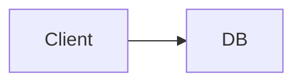

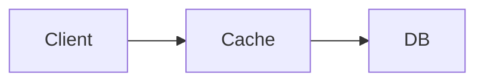

Vamos detalhar cada etapa.

---

# 1️⃣ Otimizar Dentro do Banco de Dados

Sempre comece aqui.
É o passo mais barato, simples e frequentemente suficiente.

---

## Indexação

Índices transformam **scans sequenciais** em **lookups direcionados**.

Sem índice:

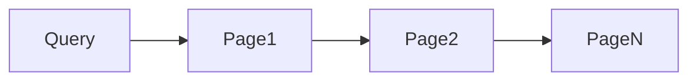

Com índice:

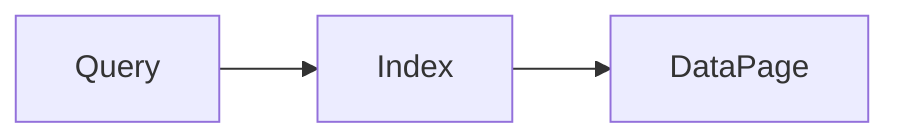

Boas práticas para entrevistas:

* Indexar colunas usadas em `WHERE`, `JOIN`, `ORDER BY`
* Usar índices compostos para padrões comuns
* Evitar indexar tudo “por reflexo”

Frase madura:

> “Primeiro eu garantiria que as queries críticas estão bem indexadas.”

---

## Hardware Upgrades (Escala Vertical)

Antes de distribuir:

* Mais CPU
* Mais RAM
* SSD mais rápido

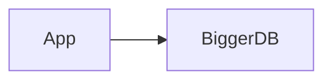

Hoje, um único banco pode lidar com:

* Centenas de GB ou alguns TB
* Dezenas de milhares de QPS

Limitações:

* Custo crescente
* Limite físico
* SPOF se não houver réplica

---

# 2️⃣ Escalar o Banco Horizontalmente

Quando otimização local não basta, distribuímos leituras.

---

## Read Replicas

A abordagem mais comum.

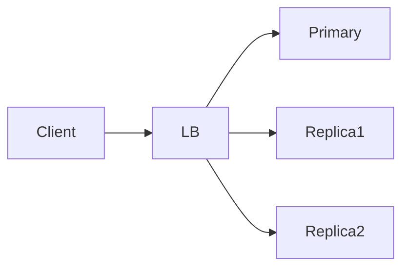

* Writes → Primary
* Reads → Replicas

### Prós

* Fácil de implementar
* Escala linearmente
* Mantém modelo relacional

### Contras

* Consistência eventual
* Lag de replicação
* Queries críticas podem exigir o primary

Frase de entrevista:

> “Eu rotearia reads não críticas para réplicas.”

---

## Read/Write Splitting

A aplicação decide:

* Writes → primary
* Reads → replicas

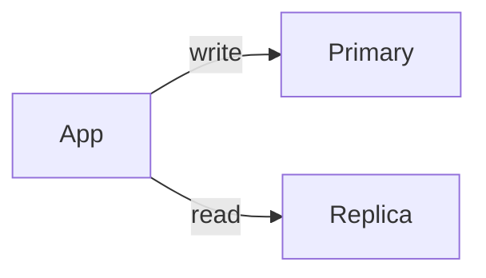

Exige cuidado com:

* Reads após writes
* Sessões
* UX consistente

---

# 3️⃣ Cache Externo (O Grande Multiplicador)

Quando réplicas não bastam, **cache** entra em cena.

---

## Cache de Leitura (Read-through)

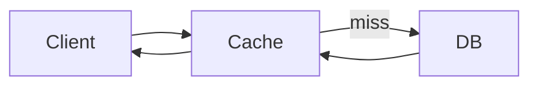

* Dados populares ficam na memória
* Reduz carga no banco drasticamente

---

## Write-through / Write-back

* Write-through: escreve no cache e no banco
* Write-back: escreve no cache e persiste depois

Mais comum em:

* Sessões
* Counters
* Feeds

---

## TTL e Invalidação

Cache exige:

* TTL
* Invalidação explícita
* Aceitar inconsistência eventual

Frase madura:

> “Cache troca consistência por escala.”

---

# Outros Padrões Importantes para Reads

---

## Precomputation (Materialized Views)

Compute antes de precisar.

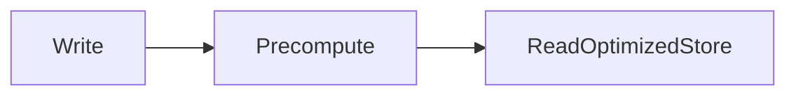

Exemplos:

* Top posts
* Rankings
* Feeds agregados

---

## Fanout-on-write vs Fanout-on-read

**Fanout-on-read**

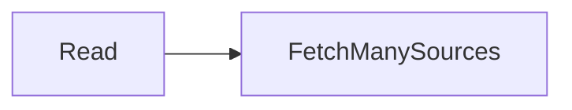

**Fanout-on-write**

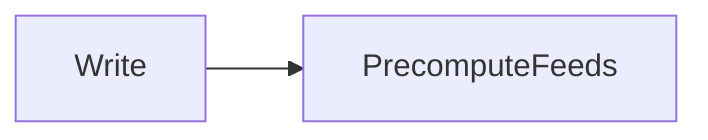

Trade-off clássico:

* Fanout-on-read: simples, caro em leitura
* Fanout-on-write: caro em escrita, rápido em leitura

---

## CDN (Para Conteúdo Estático)

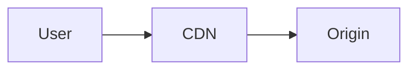

* Imagens
* Vídeos
* JS/CSS

CDN é essencial para:

* Escala global
* Latência baixa
* Redução extrema de reads no backend

---

# Como Falar Sobre Scaling Reads em Entrevistas

Checklist mental:

1. Onde estão os gargalos?
2. Posso otimizar queries?
3. Posso escalar verticalmente?
4. Posso adicionar réplicas?
5. O que posso cachear?
6. Posso pré-computar?

---

## Erros Comuns

❌ Introduzir cache cedo demais
❌ Ignorar consistência
❌ Usar réplica para tudo
❌ Esquecer invalidação

---

# Conclusão

Escalar leituras é um dos problemas mais comuns — e mais bem compreendidos — em system design. A chave é **seguir a progressão natural**: otimizar primeiro, distribuir depois, cachear por último.

Candidatos fortes:

* Reconhecem padrões de leitura
* Justificam trade-offs
* Evitam over-engineering
* Projetam com dados reais em mente
