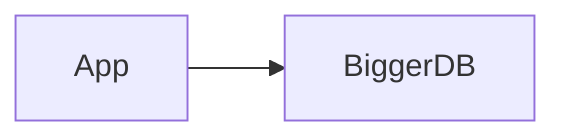
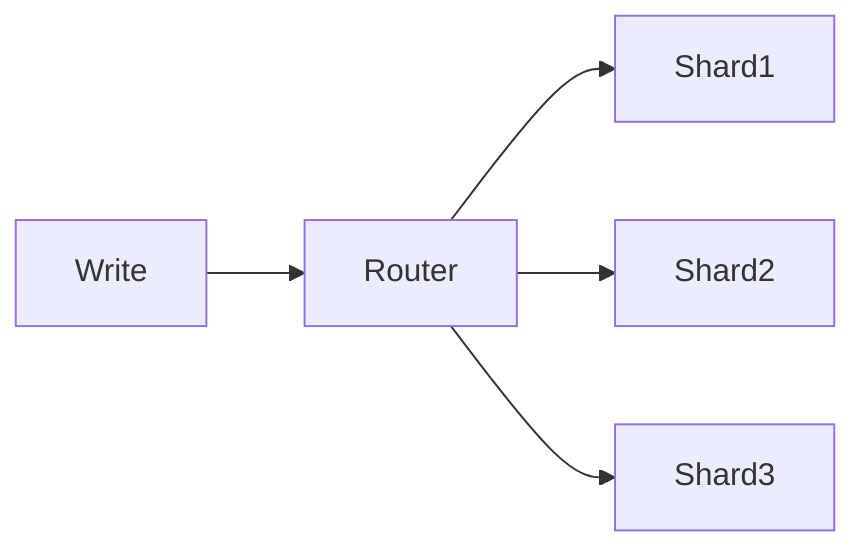
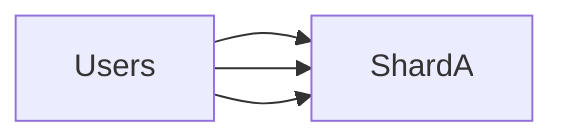
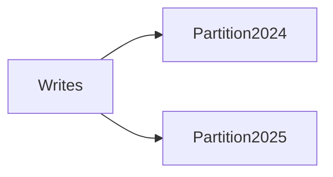
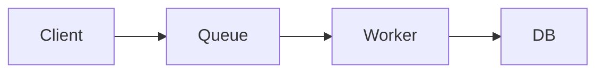
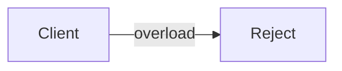
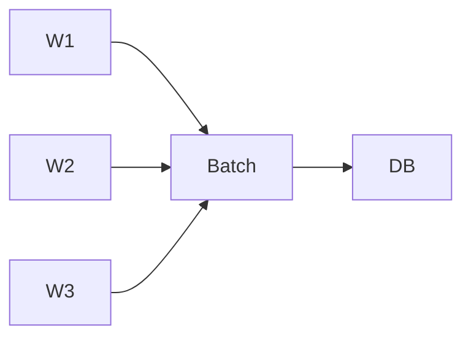
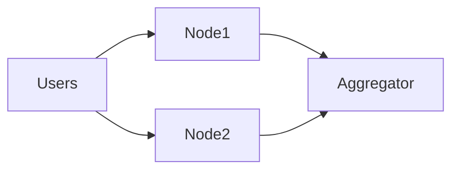

# Scaling Writes

Aprenda **como escalar operações de escrita (writes)** na sua entrevista de **System Design**.

📈 **Scaling Writes** aborda o desafio de lidar com **altos volumes de escrita** quando um único banco de dados ou um único servidor se torna o gargalo.
À medida que sua aplicação cresce de centenas para **milhões de writes por segundo**, componentes individuais atingem limites rígidos de:

* I/O de disco
* CPU
* Banda de rede

E entrevistadores **adoram** explorar exatamente esses gargalos.

---

# O Desafio

Muitos problemas de system design começam com requisitos modestos. Tudo parece simples… até o entrevistador perguntar:

> **“E como isso escala?”**

Você provavelmente já está confortável com o lado das leituras:

* Read replicas
* Cache
* CDN

Mas o **lado das escritas** costuma ser **muito mais difícil**.

Writes:

* São mutáveis
* Envolvem contenção
* Precisam preservar integridade
* Geram efeitos colaterais

Writes **burstadas**, de alto throughput e com muita contenção, são um pesadelo arquitetural.
Há várias escolhas possíveis — algumas ajudam a escalar, outras pioram drasticamente a situação.

Entrevistadores usam esse padrão para ver **como você reage ao “sucesso descontrolado”** do produto deles.

---

## Desafios Comuns de Escrita

* Muitos usuários escrevendo o mesmo recurso
* Escritas pequenas, mas extremamente frequentes
* Escritas dependentes de ordenação
* Contadores globais
* Writes síncronos em caminhos críticos
* Picos (bursts) imprevisíveis

---

## Problemas Clássicos que Envolvem Scaling Writes

Esse padrão aparece frequentemente em entrevistas:

* Design YouTube Top K
* Design Strava
* Design Rate Limiter
* Design Facebook Post Search

---

# A Solução (Visão Geral)

Escalar writes **não é apenas** adicionar mais hardware.
Há decisões arquiteturais fundamentais que determinam se o sistema escala ou colapsa.

Uma combinação de **quatro estratégias** permite escalar além de um único banco ou servidor:

1. **Escala vertical e escolhas de banco**
2. **Sharding e particionamento**
3. **Absorção de bursts com filas e load shedding**
4. **Batching e agregação hierárquica**

Vamos começar **sem sair de um único servidor**, antes de distribuir o sistema.

---

# 1️⃣ Vertical Scaling e Otimização de Escritas

Sempre comece pelo caminho mais simples.

---

## Vertical Scaling

Antes de shardear:

* Mais CPU
* Mais RAM
* Discos mais rápidos
* Configuração correta do banco

Hoje, um único nó pode lidar com:

* Dezenas de milhares de writes/s
* Centenas de GB ou TB
* Throughput muito maior do que “livros antigos” sugerem

### Limitações

* Escala finita
* Custo cresce rápido
* SPOF se não houver réplica

---

## Otimização de Writes no Banco

Algumas otimizações comuns:

* Índices mínimos (writes pagam o custo)
* Transações curtas
* Evitar locks longos
* Ajustar WAL / journaling
* Bulk inserts

Frase madura:

> “Writes pagam por cada índice — eu indexaria apenas o essencial.”

---

## Escolha do Banco de Dados

Nem todo banco é igual para escrita.

* **PostgreSQL / MySQL**

  * Ótimos até certo volume
  * Escritas síncronas
* **LSM-based (Cassandra, DynamoDB)**

  * Escritas sequenciais
  * Excelente throughput
* **Time-series / append-only**

  * Escritas extremamente rápidas

👉 Em entrevistas, mostrar que você **troca tecnologia conforme o padrão de escrita** é um diferencial.

---

# 2️⃣ Sharding e Particionamento

Quando um nó não aguenta mais, **divida os dados**.

---

## Sharding por Chave

Cada shard é responsável por um subconjunto dos dados.

Exemplos de chaves:

* user_id
* region
* hash(id)

### Prós

* Escala linear
* Distribui carga

### Contras

* Joins ficam difíceis
* Transações cross-shard são complexas
* Rebalanceamento é doloroso

---

## Hot Shards (Problema Clássico)

Se muitos writes vão para a mesma chave:

Soluções:

* Salting
* Shards virtuais
* Hierarquia de agregação

---

## Partitioning (Dentro do Mesmo Banco)

Exemplo:

* Particionar por data
* Particionar por região

Reduz:

* Lock contention
* Índices gigantes
* Overhead de manutenção

---

# 3️⃣ Lidando com Bursts: Filas e Load Shedding

Writes raramente chegam de forma estável.

---

## Queues para Absorver Bursts

Fila desacopla produtores de consumidores.

### Benefícios

* Absorve picos
* Controla throughput
* Protege o banco

### Trade-off

* Latência maior
* Consistência eventual

---

## Load Shedding

Quando tudo está saturado:

* Rejeitar requests
* Aplicar rate limit
* Priorizar usuários premium

Frase madura:

> “É melhor falhar rápido do que colapsar o sistema inteiro.”

---

# 4️⃣ Batching e Agregação Hierárquica

Nem todo write precisa ser imediato.

---

## Batching

Agrupar múltiplas escritas em uma só.

Exemplos:

* Logs
* Métricas
* Likes
* Visualizações

---

## Agregação Hierárquica

Especialmente útil para contadores globais.

* Cada nó agrega localmente
* Agregação global acontece depois

👉 Padrão clássico em **YouTube views**, **Strava metrics**, **analytics**.

---

# Outros Padrões Importantes para Writes

---

## Append-only + Compaction

* Escrita rápida
* Leitura mais complexa
* Compaction em background

Usado em:

* LSM Trees
* Event sourcing

---

## Eventual Consistency

Writes escalam melhor quando:

* Você aceita atraso
* Usa eventos
* Evita locks globais

---

# Como Falar Sobre Scaling Writes em Entrevistas

Checklist mental:

1. Onde está o gargalo físico?
2. Preciso mesmo de write síncrono?
3. Posso shardear?
4. Posso enfileirar?
5. Posso agrupar?
6. Posso aceitar inconsistência eventual?

---

## Erros Comuns

❌ Shardear cedo demais
❌ Ignorar contenção
❌ Writes síncronos desnecessários
❌ Contadores globais ingênuos

---

# Conclusão

Escalar writes é **significativamente mais difícil** do que escalar reads. O segredo não está apenas em hardware, mas em **arquitetura consciente de gargalos físicos**.

Candidatos fortes:

* Reconhecem padrões de escrita
* Escolhem bancos adequados
* Usam filas, batching e sharding com critério
* Aceitam trade-offs de consistência quando necessário

Em entrevistas, mostrar que você **respeita os limites da física** e projeta sistemas resilientes é exatamente o que diferencia um bom candidato de um excelente.
