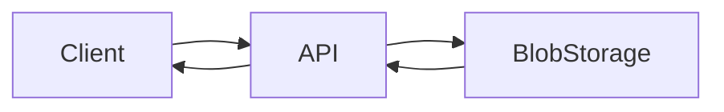
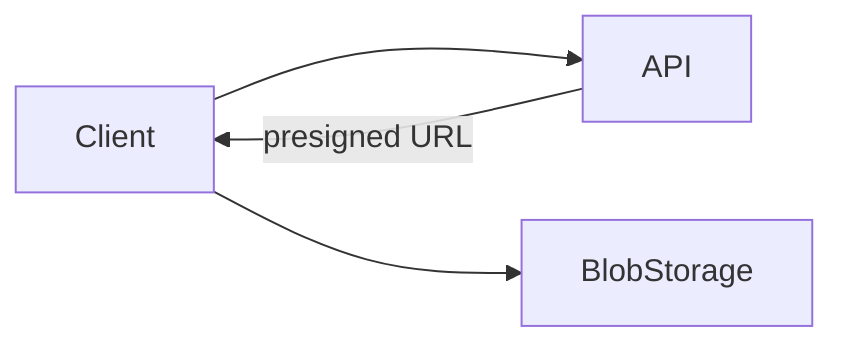
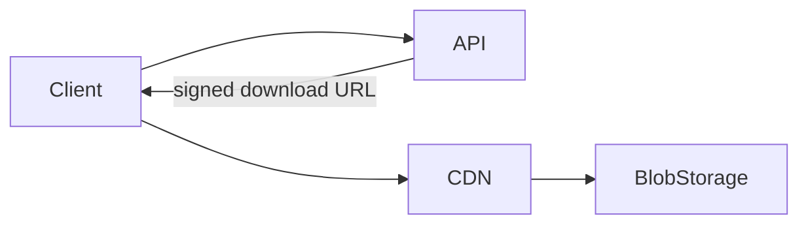
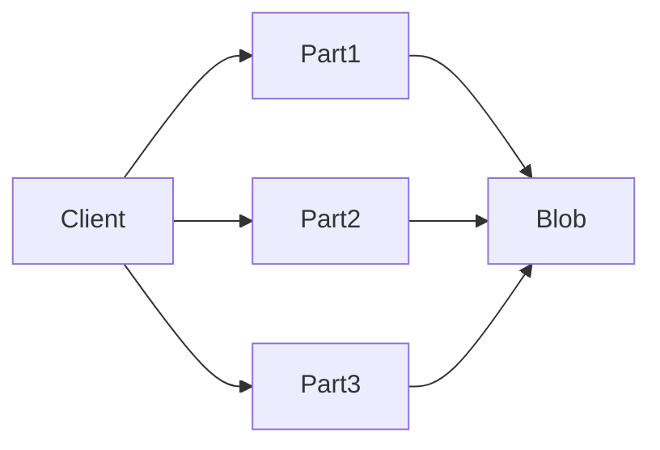
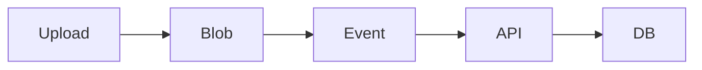
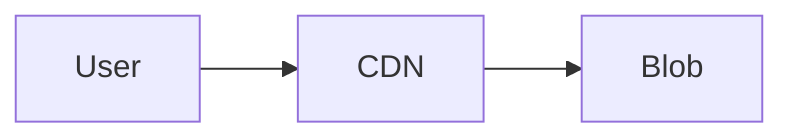

# Handling Large Blobs

Aprenda **como lidar com arquivos grandes (large blobs)** na sua entrevista de **System Design**.

📁 Arquivos grandes como **vídeos, imagens e documentos** exigem tratamento especial em sistemas distribuídos.
Em vez de empurrar gigabytes através dos seus servidores, este padrão usa **URLs pré-assinadas (presigned URLs)** para permitir que os clientes façam upload **diretamente no blob storage** e façam download **diretamente via CDN**.

Com isso, você ganha:

* Uploads resumíveis
* Transferências paralelas
* Acompanhamento de progresso

👉 É isso que separa **sistemas reais de produção** de **projetos de demonstração**.

---

# O Problema

Se você já estudou system design, provavelmente já ouviu a regra básica:

> **Arquivos grandes não pertencem ao banco de dados.**

Eles devem ir para **blob storage** (como S3), enquanto o banco guarda apenas **metadados**.

Essa separação permite:

* Escalar storage independentemente de compute
* Manter o banco rápido
* Evitar backups e réplicas gigantes

---

## Por que blob storage?

Bancos de dados são excelentes para:

* Dados estruturados
* Queries complexas
* Transações

Mas são **péssimos** para grandes objetos binários.

Problemas de armazenar um arquivo de 100MB em um BLOB no banco:

* Queries ficam lentas
* Backups demoram muito
* Replicação se torna pesada
* Locks maiores
* Uso ineficiente de cache

Object stores como S3 são projetados exatamente para isso:

* Capacidade praticamente ilimitada
* **Durabilidade de 11 nines (99.999999999%)**
* Cobrança por objeto e por acesso
* Alta disponibilidade

📌 Regra prática de entrevista:

> Se é maior que **~10MB** e não precisa de SQL, provavelmente deve ir para blob storage.

---

## O problema que sobra: transferência de dados

Blob storage resolve **onde armazenar**, mas não resolve **como transferir**.

A abordagem ingênua é usar o servidor como proxy:

---

## Servidor como Proxy (Abordagem Ingênua)

Fluxo:

* Cliente envia 2GB → API
* API repassa 2GB → storage
* O mesmo acontece no download

### Por que isso quebra?

* Consome banda do servidor
* Aumenta latência
* Limita throughput
* Torna o servidor gargalo
* Custa caro

Funciona para arquivos pequenos, **não escala** para blobs grandes.

---

# A Solução (Visão Geral)

A solução moderna separa claramente responsabilidades:

* **Servidor**: controle, autorização, metadados
* **Blob storage + CDN**: transferência de bytes

A chave é **URLs pré-assinadas**.

---

# Simple Direct Upload

No upload direto, o servidor **não recebe os bytes**.

Fluxo:

1. Cliente pede permissão para upload
2. API gera uma **presigned URL**
3. Cliente envia o arquivo **diretamente** ao storage

### Benefícios

* Servidor não é gargalo
* Uploads escalam naturalmente
* Segurança via assinatura e expiração

---

# Simple Direct Download

O mesmo vale para downloads.

* API autoriza
* Cliente baixa direto do CDN
* Latência mínima
* Escala global

---

# Uploads Resumíveis (Para Arquivos Grandes)

Para arquivos realmente grandes, falhas são inevitáveis.

👉 Uploads resumíveis são obrigatórios.

---

## Multipart / Chunked Upload

O arquivo é dividido em partes.

Características:

* Upload em paralelo
* Retry apenas do chunk que falhou
* Retomada após falhas
* Melhor UX

---

## E se falhar em 99%?

Com multipart:

* Apenas o último chunk precisa ser reenviado
* Progresso não é perdido
* Nenhum desperdício de banda

---

# Desafios de Sincronização de Estado

Transferir bytes fora do servidor cria novos desafios.

---

## Estado “pendente”

Pergunta clássica:

> “O upload terminou mesmo?”

Solução comum:

* Criar registro de upload no banco
* Marcar como `PENDING`
* Confirmar via callback/evento do storage
* Atualizar para `COMPLETED`

---

## Limpeza de uploads incompletos

* TTL para uploads pendentes
* Jobs de limpeza
* Lifecycle rules no storage

---

# Terminologia dos Cloud Providers

Embora os conceitos sejam iguais, os nomes mudam:

* AWS: Presigned URLs, Multipart Upload
* GCP: Signed URLs, Resumable Uploads
* Azure: SAS Tokens

👉 Em entrevistas, **use os conceitos**, não fique preso ao vendor.

---

# Segurança e Prevenção de Abuso

Pergunta obrigatória:

## “Como evitar abuso?”

Respostas maduras:

* URLs com expiração curta
* Limite de tamanho
* Limite de tipo MIME
* Rate limit na geração de URLs
* Validação pós-upload
* Scan de vírus/malware

---

# Metadados

Nunca armazene metadados importantes no blob.

Exemplos de metadados no banco:

* user_id
* tipo do arquivo
* tamanho
* checksum
* status
* timestamps
* permissões

O blob storage guarda **apenas bytes**.

---

# Garantindo Downloads Rápidos

* CDN na frente do storage
* Cache regional
* URLs assinadas
* Range requests
* Compressão quando aplicável

---

# Quando Usar em Entrevistas

Use esse padrão quando:

* Arquivos são grandes
* Muitos usuários fazem upload/download
* Sistema precisa escalar globalmente
* Performance importa

---

## Cenários Clássicos de Entrevista

* YouTube (vídeos)
* Google Drive (documentos)
* WhatsApp (mídia)
* Dropbox
* Sistemas de documentos legais
* Upload de imagens em redes sociais

---

# Quando NÃO Usar em Entrevistas

Evite mencionar se:

* Arquivos são pequenos (<1MB)
* Sistema é interno e simples
* Escala não é relevante

Não complique sem necessidade.

---

# Deep Dives Comuns em Entrevistas

### “E se o upload falhar em 99%?”

→ Multipart upload + retry por chunk

---

### “Como evitar uploads maliciosos?”

→ Validação + scan + expiração

---

### “Onde guardar metadados?”

→ Banco de dados, não no blob

---

### “Como garantir download rápido no mundo todo?”

→ CDN + cache + URLs assinadas

---

# Conclusão

Arquivos grandes exigem **arquitetura específica**. O segredo é separar:

* **Controle** (API)
* **Estado** (DB)
* **Bytes** (Blob + CDN)

Sistemas maduros **nunca** roteiam gigabytes através dos seus servidores sem necessidade.

Em entrevistas, demonstrar que você:

* Entende gargalos de rede
* Usa presigned URLs
* Lida com falhas reais
* Pensa em segurança e UX

… mostra que você projeta **sistemas de produção**, não apenas diagramas bonitos.
