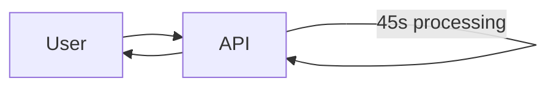
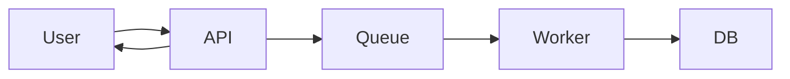
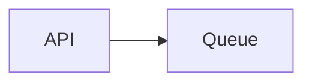
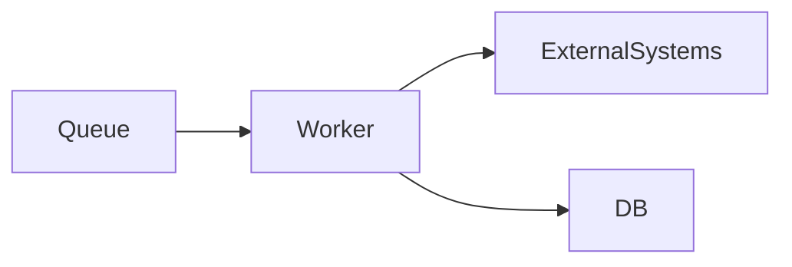
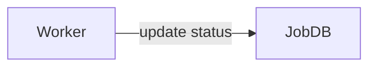
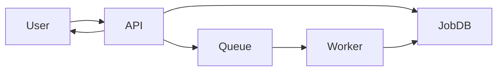
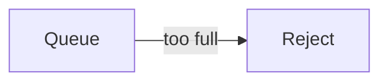
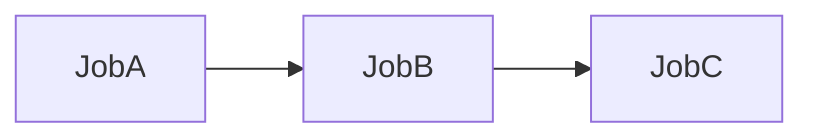

# Managing Long-Running Tasks

Aprenda sobre o **padrão de tarefas de longa duração (long-running tasks)** e como utilizá-lo no seu **system design**.

🏃 O padrão **Managing Long-Running Tasks** divide requisições de API em **duas fases distintas**:

1. **Confirmação imediata (acknowledgment)**
2. **Processamento em background**

Quando usuários submetem tarefas pesadas (como **codificação de vídeo**), o servidor web:

* Valida rapidamente a requisição
* Enfileira um job em uma fila (Redis, RabbitMQ, etc.)
* Retorna um **job ID** em poucos milissegundos

Enquanto isso, **workers separados** ficam constantemente consumindo a fila, executando o trabalho pesado e atualizando o status do job no banco de dados.

---

# O Problema

Vamos começar com um cenário simples.

Imagine um site onde usuários visualizam seus perfis.
Quando o usuário acessa a página:

* O servidor consulta o banco
* Formata a resposta
* Retorna os dados

Tudo isso leva **menos de 100 ms**.
O usuário clica e vê o resultado quase instantaneamente. Tudo ótimo.

Agora mude o requisito.

Em vez de apenas mostrar dados, precisamos **gerar um relatório PDF anual** da atividade do usuário.

Esse processo envolve:

* Consultar múltiplas tabelas
* Agregar milhões de registros
* Gerar gráficos
* Renderizar um documento final

Tempo total: **~45 segundos**.

---

## O problema do processamento síncrono

Com processamento síncrono:

* O navegador fica esperando 45 segundos
* Load balancers geralmente têm timeout de **30–60s**
* A requisição pode nem completar
* UX é péssima (spinner infinito, sem feedback)

Mesmo que funcione, **ninguém quer esperar isso**.

---

## Exemplos comuns de tarefas longas

O PDF é só um exemplo. Outros casos clássicos:

* Upload de vídeo → transcodificação (minutos)
* Upload de foto → resize + thumbnails
* Envio de newsletter para milhares de usuários
* Importação de CSV grande
* Processamento de dados analíticos
* Treinamento de modelos
* Geração de relatórios complexos

Todas essas tarefas **excedem o tempo razoável de espera do usuário**.

---

# A Solução: Processamento Assíncrono

A solução é **desacoplar a requisição do processamento pesado**.

Fluxo:

1. Usuário envia a requisição
2. API valida rapidamente
3. API cria um job e retorna um **job_id**
4. Worker executa o trabalho em background
5. Status é atualizado

O usuário não espera o processamento — ele apenas acompanha.

---

# O que o usuário vê

* “Seu relatório está sendo gerado”
* Barra de progresso ou status
* Notificação quando concluir
* Possibilidade de sair e voltar depois

👉 UX profissional.

---

# Trade-offs

Nenhuma solução vem de graça.

---

## O que você ganha

* APIs rápidas e responsivas
* Nenhum timeout
* Melhor UX
* Escalabilidade
* Isolamento de falhas
* Controle de throughput

---

## O que você perde

* Complexidade arquitetural
* Consistência imediata
* Mais componentes operacionais
* Necessidade de observabilidade

Frase madura de entrevista:

> “Troco simplicidade por confiabilidade e UX.”

---

# Como Implementar

O padrão tem **três componentes principais**.

---

## 1️⃣ Message Queue (Fila)

A fila desacopla o produtor (API) do consumidor (worker).

Responsabilidades:

* Armazenar jobs pendentes
* Garantir entrega
* Suportar retries
* Controlar throughput

Características desejáveis:

* At-least-once delivery
* Visibilidade
* Delay / retry
* Dead-letter queue

---

## 2️⃣ Workers

Workers são processos separados que executam o trabalho pesado.

Boas práticas:

* Stateless
* Escaláveis horizontalmente
* Idempotentes
* Com timeout e retry

---

## 3️⃣ Estado do Job

O estado precisa ser persistido.

Exemplo de estados:

* PENDING
* RUNNING
* COMPLETED
* FAILED
* RETRYING

Isso permite:

* Consultar progresso
* Retomar após falha
* Debug
* Observabilidade

---

# Juntando Tudo

Essa arquitetura aparece **constantemente** em entrevistas.

---

# Quando Usar em Entrevistas

Use esse padrão quando:

* A tarefa leva mais que alguns segundos
* Há risco de timeout
* O trabalho é pesado
* O usuário não precisa do resultado imediato
* O sistema precisa escalar

---

## Exemplos Clássicos de Entrevista

* Codificação de vídeo (YouTube)
* Geração de relatórios
* Importação de dados
* Envio de emails em massa
* Processamento de imagens
* Treinamento de ML
* Backup e exportações

---

# Deep Dives Comuns em Entrevistas

Entrevistadores adoram aprofundar aqui.

---

## Como lidar com falhas?

* Retry automático
* Backoff exponencial
* Marcar job como FAILED
* Intervenção manual se necessário

---

## E falhas repetidas?

* Dead-letter queue
* Limite de retries
* Alerta para time de operação

---

## Como evitar trabalho duplicado?

* Idempotência
* Job IDs determinísticos
* Locks lógicos
* Deduplicação no worker

---

## Como lidar com backpressure?

* Limitar consumo da fila
* Escalar workers gradualmente
* Rejeitar novos jobs
* Priorizar jobs críticos

---

## Como lidar com workloads mistos?

* Filas separadas
* Workers especializados
* Priorização
* QoS

---

## Como orquestrar dependências entre jobs?

Quando jobs dependem uns dos outros:

* DAGs
* Workflow engines
* Jobs encadeados

Para fluxos complexos, isso evolui para **workflows duráveis** (padrão anterior).

---

# Padrões Relacionados

* Queues
* Sagas
* Workflow systems
* Durable execution
* Event-driven architecture

---

# Erros Comuns

❌ Processar tudo síncrono
❌ Não persistir estado
❌ Não lidar com retries
❌ Workers não idempotentes
❌ Falta de observabilidade

---

# Conclusão

Tarefas de longa duração são inevitáveis em sistemas reais. A diferença entre sistemas amadores e sistemas de produção está em **como você lida com elas**.

Separar:

* **Request rápido**
* **Processamento pesado em background**

é um dos padrões mais importantes de system design.

Em entrevistas, demonstrar que você:

* Evita timeouts
* Pensa em UX
* Lida com falhas
* Controla throughput
* Mantém o sistema saudável

… mostra que você **já operou sistemas reais em produção**.
