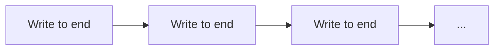
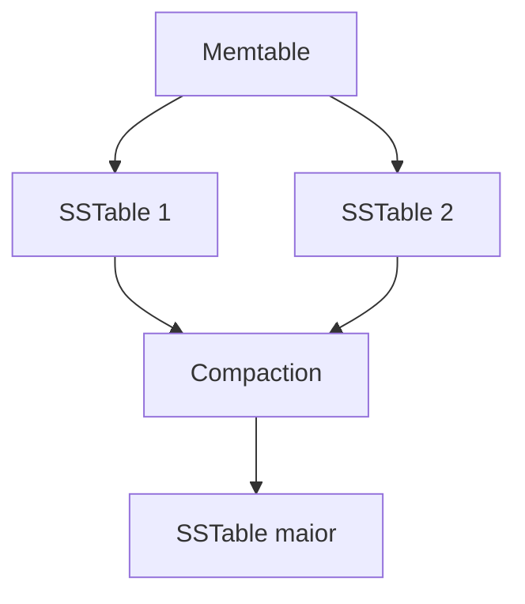
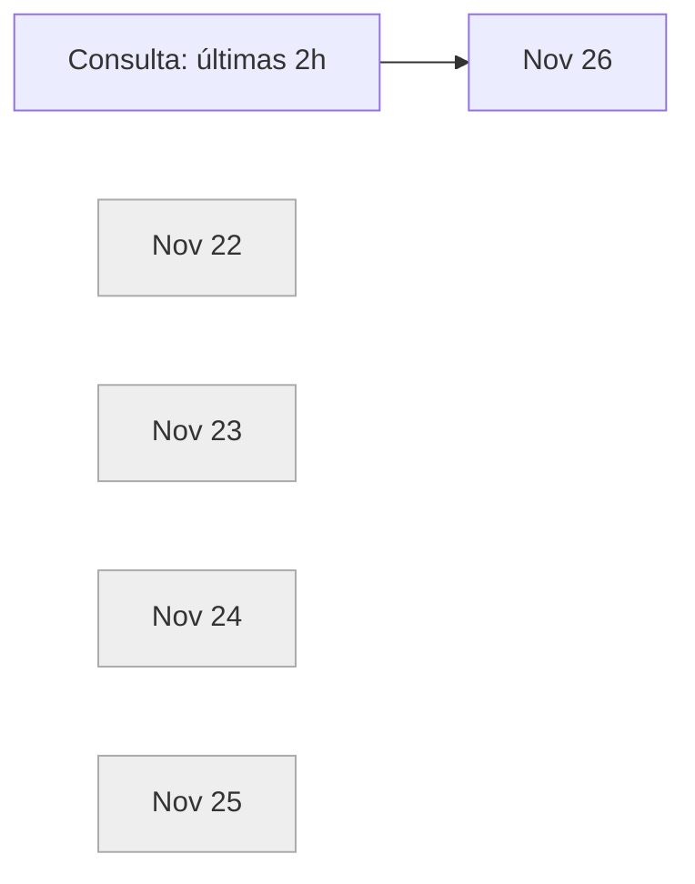
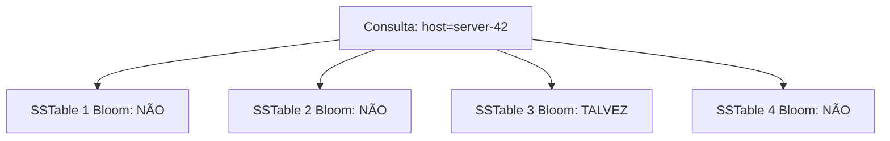
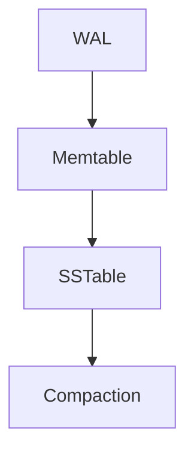

# Bancos de Dados de Séries Temporais (Time Series Databases)

Aprenda os conceitos por trás de bancos de dados de séries temporais, como **LSM trees**, **armazenamento append-only** e **delta encoding**.

---

**Assista ao vídeo explicativo**
Assista ao autor explicando o problema passo a passo.

---

Neste aprofundamento, vamos cobrir os padrões que permitem bancos de dados de séries temporais com **altíssima taxa de escrita**. Embora, em conjunto, essas ideias façam os bancos de séries temporais realmente brilharem, cada uma delas tem **aplicabilidade mais ampla em sistemas distribuídos**, especialmente em entrevistas de system design focadas em infraestrutura.

O que esperamos demonstrar é que **nenhuma dessas ideias é terrivelmente complexa**: são ideias simples, e a “mágica” está em como você as combina.

Antes de mergulharmos, vale um alerta importante sobre bancos de dados de séries temporais em geral: **só porque você tem dados temporais não significa que você precisa de um banco de séries temporais**.
O clássico exemplo do problema **Top-K** ilustra isso bem: à primeira vista, parece que um TSDB ajudaria, mas na prática ele pode **dificultar**, pois precisamos **ordenar e agregar dados através de um número enorme de séries** — algo para o qual a maioria dos TSDBs **não foi projetada**.

Tenha cuidado ao recorrer a um banco de dados de séries temporais quando um banco de uso geral como **Postgres** ou **DynamoDB** pode ser mais adequado. A recomendação é **esticar ao máximo soluções genéricas** e só recorrer a tecnologias especializadas quando surgir um **gargalo real** que não possa ser resolvido de outra forma.
Entender os **limites** dos TSDBs (como veremos neste guia) ajuda a saber **quando eles se aplicam**.

Vamos então entender como bancos de dados de séries temporais funcionam.

---

## Um Exemplo Motivador

Imagine que você está projetando um sistema de monitoramento para um provedor de nuvem.
Você tem **100.000 servidores**, cada um emitindo **5 métricas a cada 10 segundos**: uso de CPU, memória, I/O de disco e tráfego de rede.

Isso resulta em:

* **50.000 métricas por segundo**
* **4,3 bilhões de pontos de dados por dia**

E os usuários querem consultar esses dados para **dashboards**, **alertas** e **debug** de problemas da última semana.

Vamos tentar armazenar isso em um Postgres “vanilla”:

```sql
CREATE TABLE metrics (
    timestamp TIMESTAMP,
    host VARCHAR(255),
    metric_name VARCHAR(255),
    value DOUBLE PRECISION
);
```

Com **4,3 bilhões de linhas por dia**, você chega a algo em torno de **30 bilhões de linhas por semana**.
Mesmo com índices, consultas simples como:

> “Mostre a média de CPU do host-42 na última hora”

tornam-se **dolorosamente lentas**, e o desempenho de escrita degrada conforme adicionamos mais índices.

Pior ainda: a taxa de escrita necessária (**50.000 writes/segundo**, com picos maiores) **derruba uma única instância de Postgres**.
O armazenamento também é extremamente ineficiente: cada linha armazena repetidamente o nome completo do host e da métrica, inflando para **50–100 bytes por ponto**, quando a informação real (timestamp + float) ocupa apenas **16 bytes**.

Podemos fazer **muito melhor**.

Bancos de dados de séries temporais como InfluxDB, TimescaleDB e Prometheus são construídos especificamente para esse tipo de carga.
Mas **como eles funcionam?**

---

## Os Blocos Fundamentais

Vamos falar sobre todas as peças que fazem um banco de dados de séries temporais “roncar”.
Esses bancos normalmente lidam com **volumes tão grandes de dados** que o armazenamento em disco é a única opção viável.

Vamos começar por aí.

---

## Armazenamento Append-Only

A primeira ideia é enganosamente simples:
**se você escreve muitos dados, não atualize dados no lugar. Sempre acrescente novos dados no final do arquivo.**

Por que isso importa?

Em bancos tradicionais, ao atualizar uma linha, o banco precisa:

1. Encontrar a localização da linha no disco
2. Ler os dados atuais
3. Modificá-los em memória
4. Escrever os dados de volta

Isso envolve **I/O aleatório**, uma das causas mais comuns de problemas de desempenho.

### Escrita tradicional (I/O aleatório)


Discos rígidos precisam mover fisicamente o braço de leitura, o que limita a **100–200 operações por segundo**.
Mesmo SSDs, embora muito mais rápidos, ainda têm desempenho significativamente melhor com **acesso sequencial**.

### Escrita append-only (I/O sequencial)



SSDs conseguem lidar com **centenas de milhares de escritas sequenciais por segundo**, e até discos mecânicos chegam a **dezenas de milhares**.

---

## I/O Aleatório vs. Sequencial

Mas espere: se só anexamos dados, **como organizamos para leitura?**

É aqui que entra a próxima peça.

---

## LSM Trees (Log-Structured Merge Trees)

LSM trees são o **ingrediente secreto** por trás de muitos bancos de alta taxa de escrita, incluindo InfluxDB, Cassandra e LevelDB.

A ideia central é **transformar escritas aleatórias caras em escritas sequenciais baratas**, e depois **reorganizar os dados em segundo plano** para tornar as leituras eficientes.

### Passo 1: Escrita em Memória (Memtable)

Quando os dados chegam, eles vão para um **buffer em memória** (memtable).
Esse buffer é normalmente uma estrutura **ordenada** (árvore rubro-negra, skip list, etc.).

Por que manter ordenado?

* Permite **busca binária**
* Torna consultas por intervalo eficientes
* Facilita a **mesclagem (merge sort)** durante a compactação

Escritas são extremamente rápidas, pois só envolvem **RAM**.

---

### Passo 2: Flush para Disco (SSTable)

Quando a memtable enche, ela é gravada em disco como um arquivo **imutável e ordenado**, chamado **SSTable**.

Como os dados já estão ordenados, o flush é apenas uma **escrita sequencial**.

Depois disso, a memtable é limpa e reutilizada.

---

### Passo 3: Compactação em Segundo Plano

Com o tempo, vários SSTables se acumulam.
Ler passa a ser mais caro, pois é preciso verificar vários arquivos.

A **compactação** roda em segundo plano, mesclando SSTables menores em maiores, removendo:

* Duplicatas
* Tombstones (marcadores de deleção)



A beleza desse modelo é que **escritas nunca bloqueiam leituras**.
Dados novos entram na memtable enquanto threads de fundo organizam dados antigos.

### Trade-offs

* Leituras podem ser mais lentas (verificar vários SSTables)
* Existe **amplificação de escrita** (dados são reescritos durante compactação)

Use LSM trees quando você tem **muitas escritas** e aceita trocar um pouco de desempenho de leitura por isso.

---

## Delta Encoding e Compressão

Dados de séries temporais têm uma característica especial: **valores adjacentes são muito parecidos**.

Exemplo de CPU:

```
45.2%, 45.3%, 45.1%, 45.4%
```

Armazenar o valor completo sempre desperdiça espaço.

### Delta Encoding

```text
Valores brutos:   [45.2] [45.3] [45.1] [45.4]
Delta encoding:   [45.2] [+0.1] [-0.2] [+0.3]
```

Os deltas são números pequenos, exigindo menos bits.

Com **varint (inteiro de tamanho variável)**, números pequenos usam menos bytes.
Isso transforma 8 bytes por valor em **1–2 bytes** na prática.

---

### Compressão de Timestamps (Delta-of-Delta)

Timestamps costumam ser regulares:

```text
Timestamps brutos: 1000, 1010, 1020, 1030, 1040
Deltas:            10,   10,   10,   10
Delta-of-delta:    10,   0,    0,    0
```

Quando o intervalo é constante, é possível codificar milhões de timestamps com **quase zero overhead**.
O paper **Gorilla (Facebook)** mostrou compressão média de **1 bit por timestamp**.

---

### Compressão de Floats com XOR

Floats similares, quando aplicamos XOR, geram muitos zeros:

```text
Valor 1: 0 10000010 01101000101000111101011
Valor 2: 0 10000010 01101000110000100000000
XOR:     0 00000000 00000000011000011101011
```

Armazenando apenas os bits significativos, obtém-se compressão extrema.
Na prática: **~1,37 bytes por valor**, contra **8 bytes** de um double.

Em entrevistas, **não memorize números**. O ponto central é:
**dados com alta redundância comprimem muito bem**, e séries temporais são ideais para isso.

---

## Particionamento por Tempo (Sharding Temporal)

Outro conceito-chave é **organizar dados por tempo**.

Exemplo: uma partição por dia ou por semana.

### Benefícios

* **Escritas localizadas**: tudo vai para a partição do “agora”
* **Leituras eficientes**: o banco sabe exatamente quais partições consultar
* **Retenção simples**: basta apagar partições antigas



Esse padrão é praticamente universal em TSDBs.

---

## Bloom Filters para Otimizar Leituras

Como LSM trees espalham dados em vários SSTables, localizar uma série pode exigir múltiplas leituras de disco.

**Bloom filters** resolvem isso.

Cada SSTable mantém um Bloom filter com suas chaves.

* “Definitivamente não está aqui” → pula o arquivo
* “Talvez esteja aqui” → lê do disco

Nunca há **falsos negativos**.



Na prática, ~10 bits por chave dão **1% de falso positivo**, reduzindo dezenas de leituras de disco para apenas 1 ou 2.

---

## Downsampling e Rollups

Dados recentes precisam de alta resolução, dados antigos não.

Política típica:

* Últimas 24h: 10s
* Últimos 7 dias: 1 min
* Últimos 30 dias: 5 min
* Último ano: 1h

```text
Dados brutos (10s):   8.640 pontos/dia
Rollup 1 min:         1.440 pontos/dia
Rollup 1 hora:           24 pontos/dia
```

Rollups armazenam **min, max, soma, contagem**, acelerando consultas históricas.

Esse trade-off aparece frequentemente em entrevistas como uma **negociação de requisitos**.

---

## Metadados em Nível de Bloco

Cada bloco mantém metadados como:

* min/max timestamp
* às vezes min/max valor

Se uma consulta pede CPU > 10% e o bloco só tem 0–5%, o bloco inteiro é ignorado.

Isso se soma ao particionamento temporal para manter consultas rápidas mesmo com grandes volumes.

---

## Juntando Tudo: Um Motor de Séries Temporais

### Modelo de Dados

* **Medições (metrics)**
* **Tags** (indexadas, para filtros)
* **Campos (fields)** (valores medidos)
* **Timestamp**

Exemplo:

```text
cpu_usage,host=server-1,region=us-west value=45.2 1699999200000000000
```

Tags são indexadas. Fields não.

Confundir isso leva a **péssimo desempenho** ou ao **problema de cardinalidade**.

---

### Engine de Armazenamento

* WAL (durabilidade)
* Buffer em memória (memtable)
* Flush para disco (arquivos imutáveis)
* Compactação em segundo plano



---

### Execução de Consultas

```sql
SELECT mean(value) FROM cpu_usage 
WHERE host = 'server-1' 
  AND time > now() - 1h
GROUP BY time(5m)
```

Fluxo:

1. Seleciona partições relevantes
2. Usa índice de tags
3. Lê buffer + disco
4. Agrega em streaming

Explora **localidade temporal** e **localidade por série**.

---

## Onde Tudo Quebra: Cardinalidade

Tags de alta cardinalidade (ex.: `user_id`) explodem o índice em memória.

* Milhões ou bilhões de séries → **OOM**
* Consultas lentas

Esses valores devem ser **fields**, não tags — perdendo os benefícios de leitura.

---

## Conclusão

Bancos de séries temporais assumem:

* Baixa cardinalidade
* Dados regulares
* Pequenos deltas

Quando essas premissas valem, obtemos ganhos de **10–100x**.
Quando não valem, um banco genérico pode ser melhor.

Não é mágica. É:

* Append-only logs
* LSM trees
* Compressão inteligente
* Bloom filters
* Rollups
* Modelagem cuidadosa

Entender isso é uma marca clara de **candidato staff+**.
