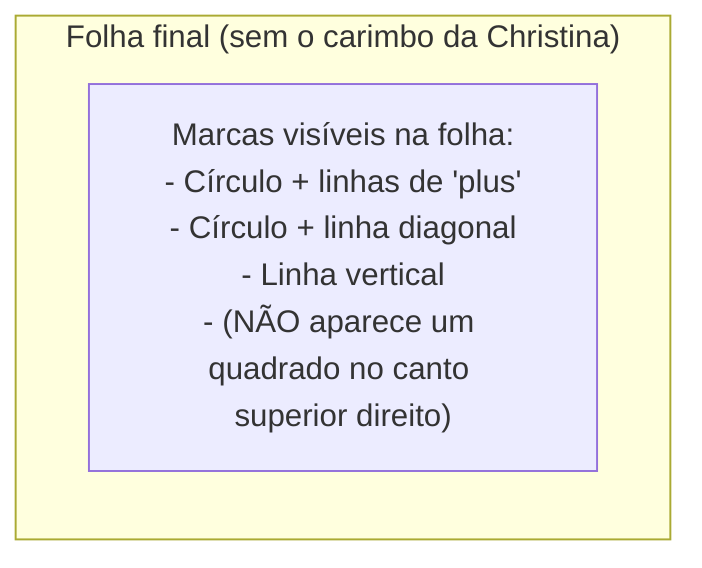
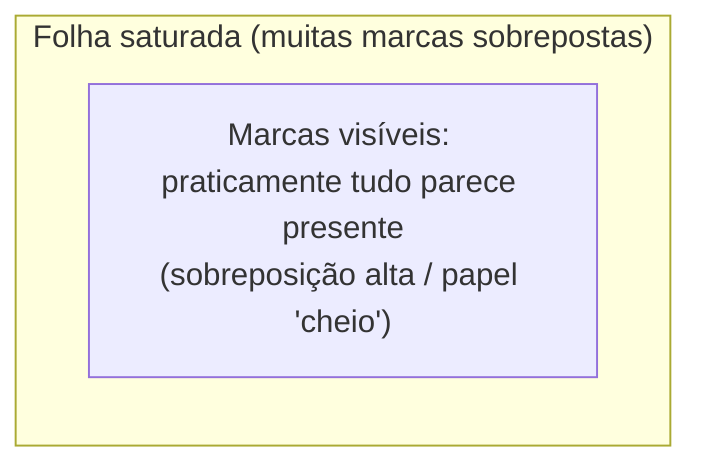
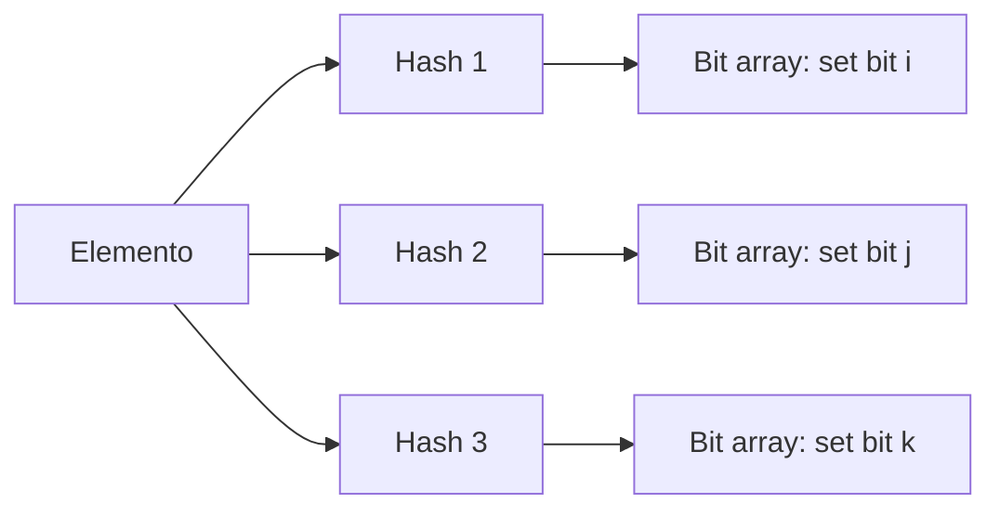
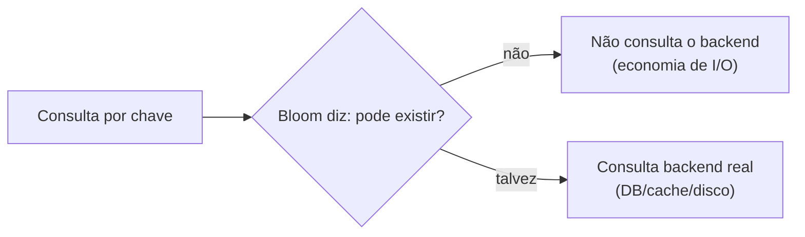
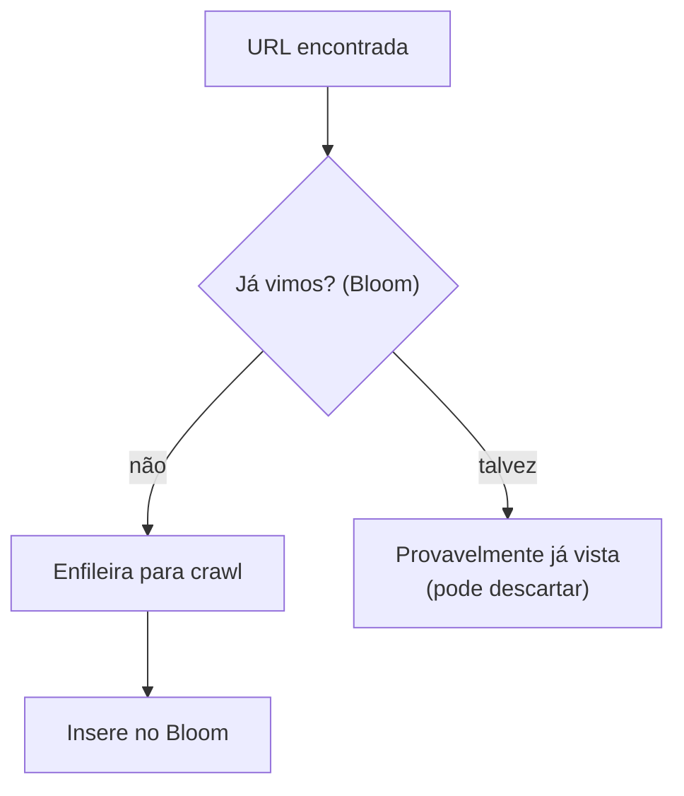
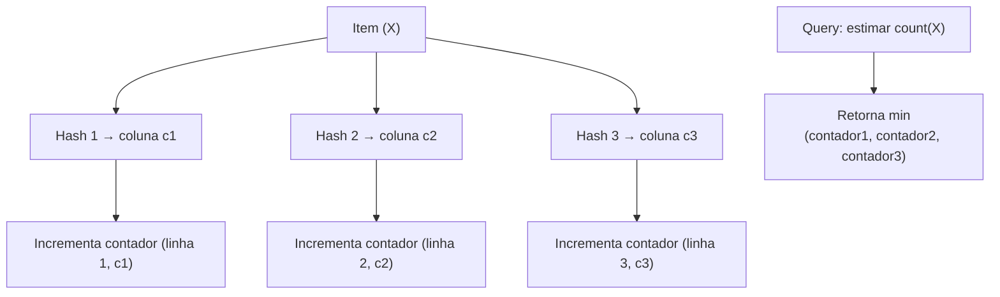
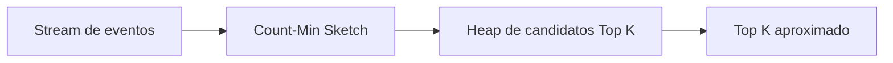
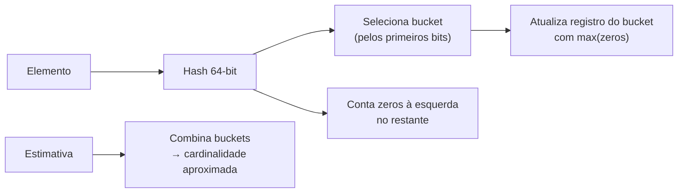
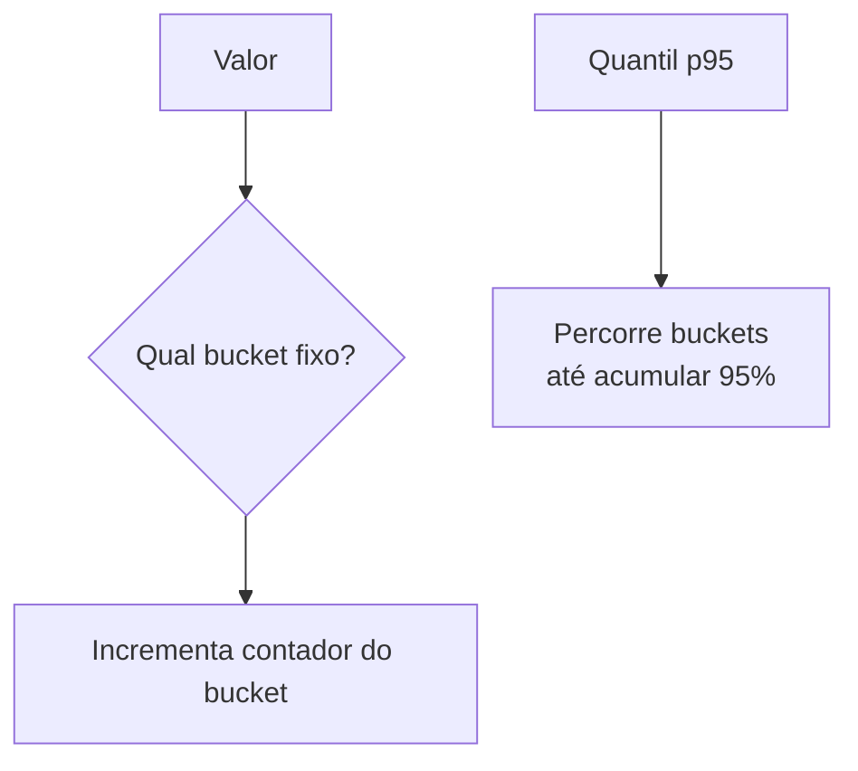

# Estruturas de Dados para Big Data (Data Structures for Big Data)

Aprenda sobre estruturas de dados para processar e armazenar grandes volumes de dados em entrevistas de System Design.

---

Alguns sistemas precisam processar quantidades absolutamente massivas de dados. Esses problemas aparecem de forma desproporcional em entrevistas de system design como uma forma de “stress test” da profundidade do seu conhecimento. Para esse tipo de problema, simplesmente escalar e adicionar mais máquinas pode ser insuficiente — você vai precisar recorrer a **estruturas de dados especializadas** para resolver o problema.

Mas a maioria das entrevistas de system design não exige que você implemente estruturas de dados “no braço” e não foca nesse nível tão baixo, então por que se preocupar? Porque, em muitos casos, usar uma estrutura de dados especializada **muda o formato da solução** e torna o sistema ao redor **fundamentalmente diferente**. Entender essas diferenças é um superpoder e pode ajudar você a projetar sistemas **mais eficientes, escaláveis e performáticos**.

A pegadinha é que essas estruturas são incomuns por um motivo. Usar um **Bloom filter** quando uma simples tabela hash resolveria é um **sinal vermelho** para o entrevistador. Então é um conhecimento ótimo para ter, mas não se esqueça de manter as coisas simples!

Neste aprofundamento vamos fazer algumas coisas:

* Vamos ampliar seu arsenal de abordagens possíveis, expandindo sua visão sobre estruturas de dados disponíveis.
* Vamos destacar cenários específicos onde essas estruturas são comumente usadas.
* Por fim, vamos apontar armadilhas comuns e lugares onde você pode tropeçar ou se sentir tentado a “over-engineer”.

Vamos nessa.

Embora ocasionalmente úteis para entrevistas de system design de nível pleno (mid-level), eu não recomendaria começar por aqui se você é relativamente novo em system design. Existe um ROI muito maior em dominar primeiro **conceitos base** e **tecnologias-chave**.

Um candidato que acerta em cheio a implementação de **Count-Min Sketch**, mas não internalizou coisas como **cache**, **load balancing** e **particionamento**, vai ter dificuldade para desenhar uma arquitetura de sistema performática. Não se estresse com esses detalhes!

---

## Bloom Filter

Nossa primeira estrutura é provavelmente a mais conhecida e um ótimo ponto de partida. Um **Bloom filter** é uma estrutura de dados **probabilística** que é análoga a um **set** (relembrando: sets permitem inserir elementos e checar sua pertinência/membership).

A implementação mais comum de um set usa uma **tabela hash**. Com uma tabela hash, conseguimos inserir elementos em **O(1)** e checar membership em **O(1)**. Muito rápido! Infelizmente, precisamos ter memória para cada elemento possível em uma tabela hash, o que é inviável para conjuntos enormes. Imagine termos **trilhões** de itens e querermos acompanhar todos os seus IDs.

Bloom filters ajudam aqui fazendo um compromisso: eles são dramaticamente mais eficientes em memória do que tabelas hash, mas relaxam as garantias de um set. Bloom filters podem dizer:

* Se um elemento **provavelmente** está no conjunto, com alguma probabilidade configurável
* Se um elemento **definitivamente não** está no conjunto

Isso parece meio incomum, então vamos dar um passo atrás e construir intuição antes de explicar como funciona.

---

### Intuição

Finja que temos uma vila com **1.000 pessoas**, cada uma com um carimbo bem simples, mas **único**, usado para marcar documentos. Queremos acompanhar quem participou de uma reunião, mas só temos **um único bloco de papel** e **nenhuma caneta**, apenas carimbos!

#### Carimbos dos Moradores (Villager Stamps)

Como somos legais, queremos enviar guloseimas como agradecimento para quem participou. Podemos até aceitar mandar algumas guloseimas para pessoas que **não** participaram (ok), mas queremos minimizar o desperdício com ausentes (vaias para eles). Para resolver isso, vamos pedir que todos os moradores presentes carimbem **uma única folha** com seus carimbos.

Para descobrir quem definitivamente **não** participou, nossa abordagem é simples: olhamos o formato do carimbo de cada morador e verificamos se a tinta cobre **todos os sulcos** do carimbo daquela pessoa. Se cobre, ela **pode** ter participado. Se não cobre, ela **não tem como** ter carimbado o papel — sem guloseimas para ela!

Aqui vai um exemplo de como a folha pode ter ficado após a reunião:

Vamos analisar. Neste caso:

* O círculo e as linhas de “plus” do Albert estão presentes, então ele provavelmente participou
* O círculo e a linha diagonal do Bryan estão presentes, então ele provavelmente participou
* A linha vertical da Christina está presente, mas o quadrado dela não, então ela definitivamente **não** participou

Para Albert e Bryan, é provável que eles tenham participado, então vamos mandar guloseimas. Podemos concluir que Christina definitivamente não participou porque o quadrado do canto superior direito não aparece, então não precisamos mandar guloseimas para ela.

Legal! Em vez de precisarmos de 1000 folhas para cada pessoa carimbar, precisávamos só de 1, e ainda conseguimos provar que Christina não participou. Essa é a essência de um Bloom filter!

Agora, para testar essa analogia um pouco mais, vamos considerar o que acontece se a folha se parecer com isso:

Nesse caso, não conseguimos dizer nada com certeza sobre Christina! É possível que ela tenha participado, mas também é possível que 1 pessoa com um quadrado no canto inferior esquerdo e 1 pessoa com um quadrado no canto superior direito tenham carimbado a folha. Ou alguém com um carimbo completamente sólido pode ter participado. Não sabemos.

Aqui, teríamos que mandar guloseimas para todo mundo e falharíamos em economizar qualquer coisa — nossa abordagem falha.

Vemos algumas coisas aqui:

* Ao usar carimbos sobrepostos, conseguimos fazer afirmações sobre a membership do conjunto (isto é, as pessoas que falharam em comparecer).
* Embora às vezes possamos provar que um elemento **não** está no conjunto, nunca podemos provar que ele **está** no conjunto. Sempre existe a chance de as marcas de outros se sobreporem ao carimbo que estamos testando.
* Queremos que nossos “carimbos” sejam ao mesmo tempo **únicos** e **limitados**. Um carimbo que é um quadrado sólido quebra nossa abordagem!

---

### Como Funciona (How it Works)

Um Bloom filter é composto por:

* Um **array de bits** (inicialmente tudo 0)
* **k funções hash** independentes

**Inserção (add):**

1. Você aplica as k hashes ao elemento
2. Cada hash retorna uma posição no array de bits
3. Você seta esses bits para 1

**Consulta (mightContain):**

1. Você aplica as mesmas k hashes
2. Se **qualquer** bit correspondente estiver 0 → o elemento **definitivamente não** foi inserido
3. Se **todos** estiverem 1 → o elemento **talvez** tenha sido inserido (pode ser falso positivo)

**Propriedade crucial:**

* Não existem falsos negativos (se diz “não está”, realmente não está)
* Existem falsos positivos (pode dizer “talvez”, mas não estar)

A probabilidade de falso positivo depende de:

* tamanho do array (m)
* número de hashes (k)
* quantidade de elementos inseridos (n)

Se você inserir elementos demais para um m pequeno, o filtro “satura”, como o papel saturado na analogia.

---

### Casos de Uso e Armadilhas (Use-Cases and Pitfalls)

**Casos de uso típicos:**

* Evitar leituras caras em disco ou rede quando a resposta “com certeza não existe” já resolve
* Pré-filtro para consultas: “vale a pena checar a fonte cara?”

**Armadilhas:**

* Usar Bloom filter quando um hash set simples cabe em memória (over-engineering)
* Não dimensionar m/k para o n esperado (saturação → falso positivo alto)
* “Deletar” é difícil: Bloom filter clássico não suporta remoção sem variantes (ex.: counting Bloom filter)
* Bloom filter não substitui o armazenamento real: ele só evita trabalho desnecessário

---

## Web Crawling

*(Seção listada no original — o texto detalhado não foi fornecido. Mantive a seção e completei de forma consistente com o tópico.)*

Em sistemas de crawling, você quer evitar recrawlear URLs já vistas.

Trade-off: pode haver falsos positivos e você acabar ignorando uma URL nova (isso pode ser aceitável dependendo do objetivo do crawler).

---

## Cache Optimizations

*(Seção listada no original — texto detalhado não foi fornecido. Mantive a seção e completei coerentemente.)*

Bloom filters também aparecem como “guardião” antes de bater em cache/disco.

Ex.: você tem um cache local e um banco remoto. Antes de buscar no banco, usa Bloom para saber se a chave existe no dataset.

---

## Count-Min Sketch

### Intuição

Count-Min Sketch é uma estrutura probabilística para estimar frequências (contagens) em streams enormes, com memória pequena.

Você não armazena o mapa `item -> count` completo. Em vez disso, você mantém uma matriz de contadores e várias hashes. A contagem estimada é o mínimo dos contadores associados.

---

### Como Funciona

Propriedade típica:

* Pode **superestimar** (por colisões), mas não subestima
* Funciona muito bem para identificar itens “frequentes” com poucos recursos

---

### Casos de Uso e Armadilhas

* Telemetria/analytics para eventos em alta escala
* Detecção de “heavy hitters” (itens muito frequentes)
* Métricas agregadas aproximadas

Armadilhas:

* Não serve quando você precisa de contagem exata por chave
* Colisões podem distorcer resultados, principalmente se mal dimensionado

---

## Top K

*(Seção listada no original — texto detalhado não foi fornecido. Mantive a seção e completei de modo consistente.)*

Com Count-Min Sketch, você pode combinar com uma heap para manter candidatos ao Top K (aproximado).

---

## Caching

*(Seção listada no original — texto detalhado não foi fornecido. Mantive a seção e completei coerentemente.)*

Count-Min Sketch pode ajudar a decidir políticas de cache: quais chaves são mais acessadas e merecem ficar no cache.

---

## HyperLogLog

### Intuição

HyperLogLog (HLL) estima o número de **elementos distintos** (cardinalidade) em um grande fluxo, usando pouca memória.

Em vez de armazenar todos os elementos (impossível em grande escala), ele usa hashes e observa padrões de zeros à esquerda para inferir cardinalidade.

---

### Como Funciona

---

### Casos de Uso e Armadilhas

**Analytics e sistemas de métricas**: estimar usuários únicos, sessões únicas, IPs distintos, etc.
**Segurança**: contagem aproximada de fontes únicas em ataques, varreduras, etc.
**Sizing de cache e análise**: quantos itens distintos passam por um componente para dimensionar.

Armadilhas:

* Não dá a lista de elementos, só a estimativa
* Precisa de hashes uniformes
* Precisão depende do número de registros/buckets

---

## Approximate Quantiles

### Intuição

Quantis aproximados respondem perguntas como p50, p95, p99 de latência sem armazenar todos os valores.

---

### Como Funciona

Existem várias abordagens. O texto original lista:

* Fixed-Width Buckets
* Exponential Buckets
* Dynamic Histograms

A ideia geral: manter uma estrutura resumida (histograma / sketch) e estimar quantis a partir dela.

---

### Fixed-Width Buckets

Divide o domínio em faixas fixas e conta quantos eventos caem em cada faixa.

---

### Exponential Buckets

Buckets crescem exponencialmente (útil quando valores variam muito, ex.: latência de microssegundos a segundos).

---

### Dynamic Histograms

Buckets se adaptam aos dados: mais detalhe onde há mais densidade.

---

### Casos de Uso e Armadilhas

**Performance Monitoring**: p95/p99 de latência e erros
**SLOs (Service Level Objectives)**: rastrear “99% abaixo de X ms”
**A/B Testing e analytics**: comparar distribuições sem custos enormes
**Load balancing e auto-scaling**: reagir a mudanças de latência/throughput

Armadilhas:

* Buckets ruins geram quantis ruins
* Mudanças abruptas de distribuição podem exigir estratégias de adaptação/reset

---

## Conclusão

Estruturas de dados para Big Data existem porque, em escala extrema, você frequentemente precisa trocar **exatidão** por **eficiência** (memória, CPU, I/O) e ainda assim obter respostas úteis.

O ponto-chave em entrevistas de system design não é “mostrar estruturas difíceis”, e sim:

* Reconhecer quando estruturas aproximadas mudam o desenho do sistema
* Saber explicar trade-offs (falso positivo, erro, saturação, colisões)
* Evitar over-engineering quando soluções simples bastam

Bloom filter, Count-Min Sketch, HyperLogLog e quantis aproximados são ferramentas que aparecem em sistemas reais de alta escala — e, usadas corretamente, podem transformar a viabilidade de uma solução.

---
