# Capítulo 01 — Escalando de Zero a Milhões de Usuários

> Baseado no Capítulo 1: *Scale from Zero to Millions of Users*.

## 1. Objetivo do capítulo

Projetar um sistema capaz de atender milhões de usuários não começa com uma arquitetura complexa. O caminho natural é iniciar com uma solução simples, funcionando para poucos usuários, e evoluir gradualmente conforme surgem novos gargalos de desempenho, disponibilidade e escalabilidade.

Neste capítulo, a evolução arquitetural acontece em etapas:

1. servidor único;
2. separação entre aplicação e banco de dados;
3. escalabilidade vertical e horizontal;
4. balanceador de carga;
5. replicação de banco de dados;
6. cache;
7. CDN;
8. camada web sem estado;
9. múltiplos data centers;
10. fila de mensagens para desacoplamento.

---

## 2. Arquitetura inicial: servidor único

No início, todos os componentes podem executar em um único servidor:

* aplicação web;
* API mobile;
* cache, se existir;
* banco de dados;
* arquivos estáticos.

Essa abordagem é simples, barata e suficiente para baixo volume de acessos. O problema é que ela concentra tudo em um único ponto: se o servidor falhar, todo o sistema fica indisponível.

### 2.1 Fluxo básico de requisição

O usuário acessa o sistema por um domínio, como `www.mysite.com` ou `api.mysite.com`. O DNS resolve esse domínio para um endereço IP, e o navegador ou aplicativo mobile envia a requisição HTTP ao servidor.

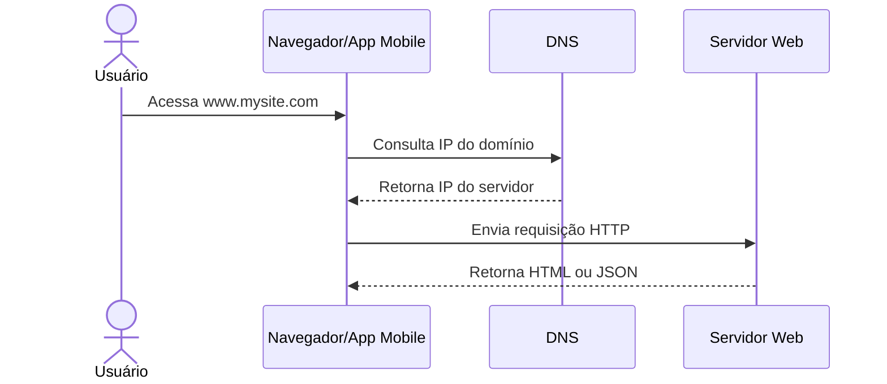
```mermaid
sequenceDiagram
    actor U as Usuário
    participant B as Navegador/App Mobile
    participant DNS as DNS
    participant S as Servidor Web

    U->>B: Acessa www.mysite.com
    B->>DNS: Consulta IP do domínio
    DNS-->>B: Retorna IP do servidor
    B->>S: Envia requisição HTTP
    S-->>B: Retorna HTML ou JSON
```

### 2.2 Servidor único

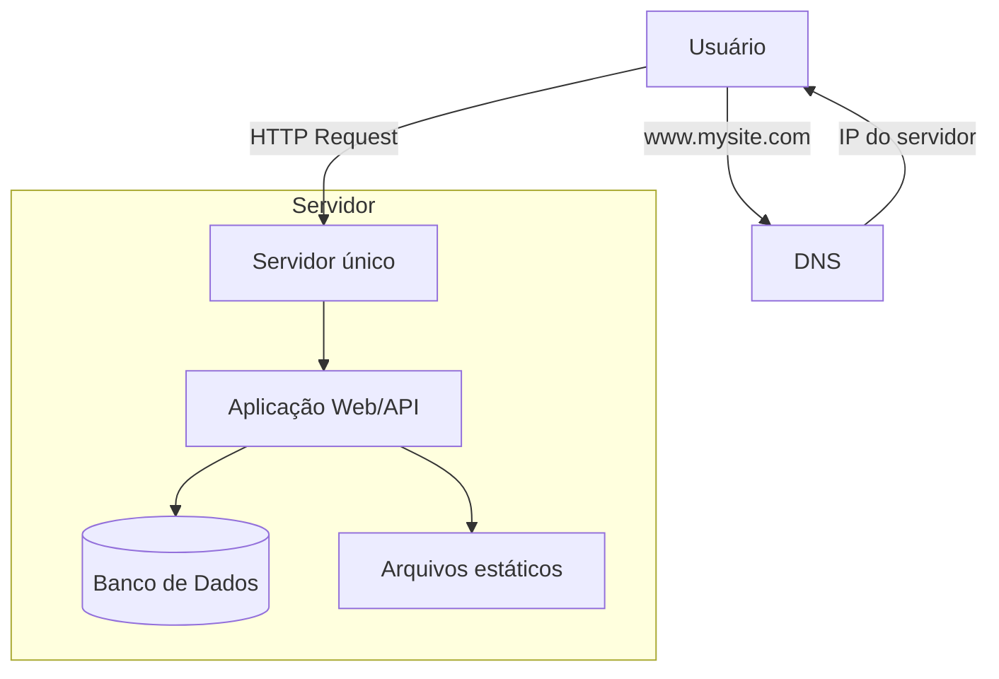
```mermaid
flowchart TD
    U[Usuário] -->|www.mysite.com| DNS[DNS]
    DNS -->|IP do servidor| U
    U -->|HTTP Request| S[Servidor único]

    subgraph Servidor
        S --> APP[Aplicação Web/API]
        APP --> DB[(Banco de Dados)]
        APP --> STATIC[Arquivos estáticos]
    end
```

### 2.3 Limitações

| Limitação                            | Impacto                                           |
| ------------------------------------ | ------------------------------------------------- |
| Ponto único de falha                 | Se o servidor cair, todo o sistema cai.           |
| Escalabilidade limitada              | CPU, memória e disco têm limite físico.           |
| Manutenção arriscada                 | Qualquer parada afeta todos os usuários.          |
| Baixa separação de responsabilidades | Aplicação e dados competem pelos mesmos recursos. |

---

## 3. Separação entre aplicação e banco de dados

Com o crescimento da base de usuários, um único servidor deixa de ser suficiente. O primeiro passo de evolução é separar a aplicação do banco de dados.

A aplicação passa a executar em um servidor web, enquanto os dados ficam em um servidor dedicado de banco de dados.

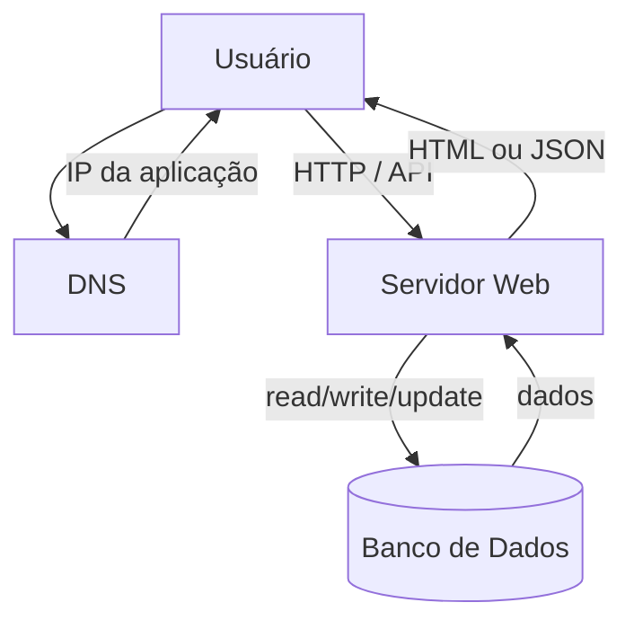
```mermaid
flowchart TD
    U[Usuário] --> DNS[DNS]
    DNS -->|IP da aplicação| U
    U -->|HTTP / API| WEB[Servidor Web]
    WEB -->|read/write/update| DB[(Banco de Dados)]
    DB -->|dados| WEB
    WEB -->|HTML ou JSON| U
```

### 3.1 Vantagens da separação

| Vantagem               | Explicação                                                  |
| ---------------------- | ----------------------------------------------------------- |
| Escala independente    | Aplicação e banco podem crescer separadamente.              |
| Melhor uso de recursos | O banco pode ter hardware otimizado para I/O e memória.     |
| Mais organização       | Cada camada assume uma responsabilidade clara.              |
| Base para evolução     | Permite adicionar balanceamento, replicação e cache depois. |

---

## 4. Escolha do banco de dados

O capítulo diferencia dois grandes grupos:

### 4.1 Bancos relacionais

Bancos relacionais, também chamados de RDBMS ou bancos SQL, armazenam dados em tabelas e linhas. São adequados para cenários com forte consistência, relacionamentos bem definidos e consultas estruturadas.

Exemplos citados:

* MySQL;
* Oracle;
* PostgreSQL.

### 4.2 Bancos não relacionais

Bancos NoSQL foram criados para necessidades específicas de escala, flexibilidade e distribuição. As principais categorias são:

* chave-valor;
* grafos;
* colunares;
* documentos.

Exemplos citados:

* CouchDB;
* Neo4j;
* Cassandra;
* HBase;
* Amazon DynamoDB.

### 4.3 Quando considerar NoSQL

O NoSQL pode ser adequado quando:

* a aplicação exige latência muito baixa;
* os dados são pouco relacionais;
* há necessidade de serializar e desserializar dados como JSON, XML ou YAML;
* é necessário armazenar grande volume de dados.

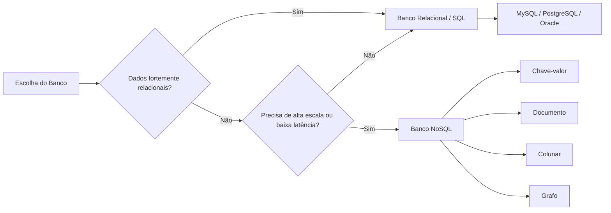
```mermaid
flowchart LR
    A[Escolha do Banco] --> B{Dados fortemente relacionais?}
    B -->|Sim| SQL[Banco Relacional / SQL]
    B -->|Não| C{Precisa de alta escala ou baixa latência?}
    C -->|Sim| NOSQL[Banco NoSQL]
    C -->|Não| SQL

    SQL --> SQLEx[MySQL / PostgreSQL / Oracle]
    NOSQL --> N1[Chave-valor]
    NOSQL --> N2[Documento]
    NOSQL --> N3[Colunar]
    NOSQL --> N4[Grafo]
```

---

## 5. Escalabilidade vertical vs horizontal

### 5.1 Escalabilidade vertical

Escalar verticalmente significa aumentar a capacidade de uma máquina existente, adicionando mais CPU, memória, disco ou recursos de rede.

Também é conhecida como **scale up**.

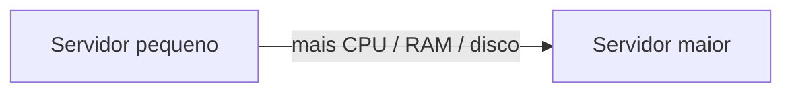
```mermaid
flowchart LR
    S1[Servidor pequeno] -->|mais CPU / RAM / disco| S2[Servidor maior]
```

**Vantagem principal:** simplicidade.

**Limitações:**

* existe limite físico para crescimento;
* não resolve bem alta disponibilidade;
* se o servidor cair, o sistema pode ficar indisponível;
* pode ter custo elevado em grandes capacidades.

### 5.2 Escalabilidade horizontal

Escalar horizontalmente significa adicionar mais servidores ao conjunto de recursos.

Também é conhecida como **scale out**.

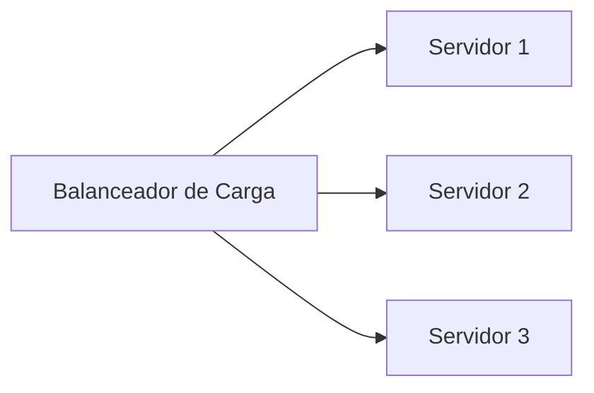
```mermaid
flowchart LR
    LB[Balanceador de Carga] --> S1[Servidor 1]
    LB --> S2[Servidor 2]
    LB --> S3[Servidor 3]
```

**Vantagens:**

* melhor distribuição de carga;
* maior disponibilidade;
* possibilidade de adicionar ou remover servidores conforme demanda;
* mais adequada para sistemas de grande escala.

---

## 6. Balanceador de carga

Quando muitos usuários acessam o sistema ao mesmo tempo, um único servidor web pode atingir seu limite. O balanceador de carga resolve esse problema distribuindo as requisições entre vários servidores.

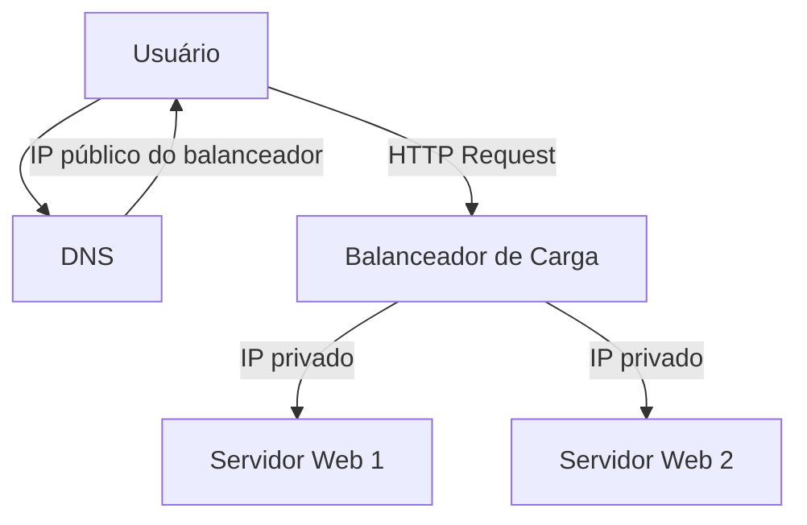
```mermaid
flowchart TD
    U[Usuário] --> DNS[DNS]
    DNS -->|IP público do balanceador| U
    U -->|HTTP Request| LB[Balanceador de Carga]

    LB -->|IP privado| S1[Servidor Web 1]
    LB -->|IP privado| S2[Servidor Web 2]
```

### 6.1 Benefícios

| Benefício             | Explicação                                                                 |
| --------------------- | -------------------------------------------------------------------------- |
| Distribuição de carga | Requisições são divididas entre servidores disponíveis.                    |
| Alta disponibilidade  | Se um servidor falhar, o tráfego pode ir para outro.                       |
| Segurança             | Servidores web podem usar IPs privados e não ficarem expostos diretamente. |
| Elasticidade          | Novos servidores podem ser adicionados ao pool.                            |

### 6.2 Evolução com balanceador

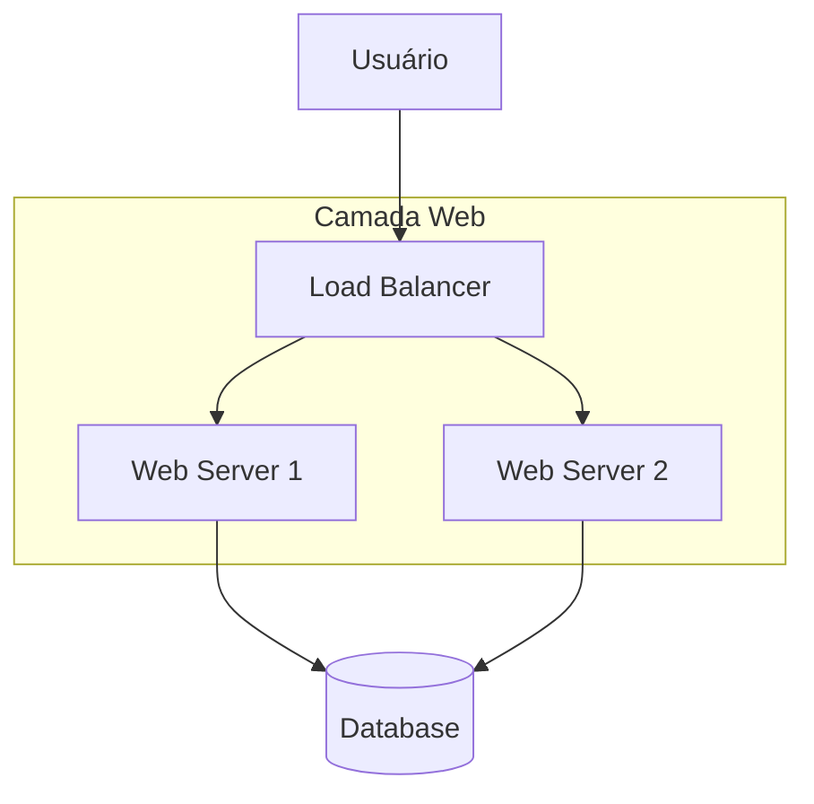
```mermaid
flowchart TD
    U[Usuário] --> LB[Load Balancer]

    subgraph Web_Tier[Camada Web]
        LB --> W1[Web Server 1]
        LB --> W2[Web Server 2]
    end

    W1 --> DB[(Database)]
    W2 --> DB
```

Mesmo com balanceador, o banco de dados ainda pode ser um ponto único de falha. Por isso, o próximo passo é a replicação.

---

## 7. Replicação de banco de dados

Replicação de banco de dados é uma técnica em que os dados são copiados de um banco principal para um ou mais bancos secundários.

O modelo apresentado é **master-slave**:

* o **master** recebe operações de escrita, atualização e exclusão;
* os **slaves** recebem operações de leitura;
* as alterações feitas no master são replicadas para os slaves.

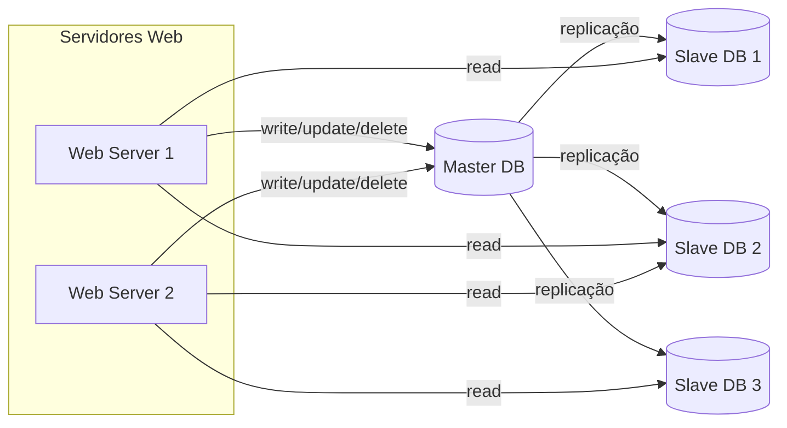
```mermaid
flowchart LR
    subgraph Web[Servidores Web]
        W1[Web Server 1]
        W2[Web Server 2]
    end

    W1 -->|write/update/delete| M[(Master DB)]
    W2 -->|write/update/delete| M

    M -->|replicação| S1[(Slave DB 1)]
    M -->|replicação| S2[(Slave DB 2)]
    M -->|replicação| S3[(Slave DB 3)]

    W1 -->|read| S1
    W1 -->|read| S2
    W2 -->|read| S2
    W2 -->|read| S3
```

### 7.1 Vantagens da replicação

| Vantagem                | Explicação                                                |
| ----------------------- | --------------------------------------------------------- |
| Melhor desempenho       | Leituras podem ser distribuídas entre réplicas.           |
| Maior confiabilidade    | Dados existem em mais de um servidor.                     |
| Alta disponibilidade    | Se uma réplica falhar, outra pode atender leituras.       |
| Recuperação de desastre | Cópias em locais diferentes reduzem risco de perda total. |

### 7.2 Falha em banco slave

Se um banco slave ficar indisponível, as leituras são redirecionadas para outro slave saudável ou temporariamente para o master.

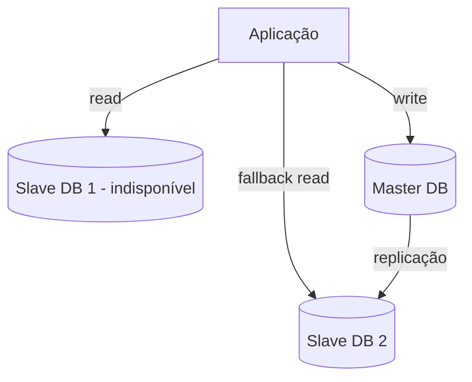
```mermaid
flowchart TD
    APP[Aplicação] -->|read| S1[(Slave DB 1 - indisponível)]
    APP -->|fallback read| S2[(Slave DB 2)]
    APP -->|write| M[(Master DB)]
    M -->|replicação| S2
```

### 7.3 Falha no banco master

Se o master falhar, uma réplica precisa ser promovida a novo master. Em produção, esse processo exige cuidado porque uma réplica pode estar atrasada em relação ao master antigo.

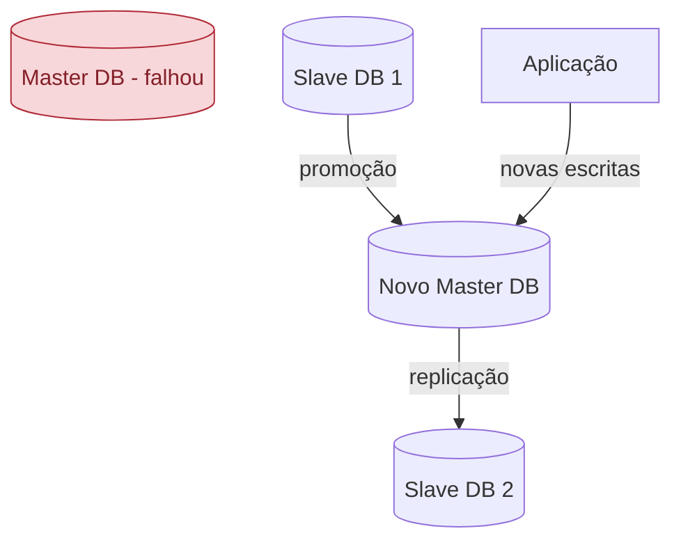
```mermaid
flowchart TD
    M[(Master DB - falhou)]:::down
    S1[(Slave DB 1)] -->|promoção| NM[(Novo Master DB)]
    APP[Aplicação] -->|novas escritas| NM
    NM -->|replicação| S2[(Slave DB 2)]

    classDef down fill:#f8d7da,stroke:#b02a37,color:#842029;
```

---

## 8. Arquitetura com load balancer e replicação

Depois de adicionar balanceador de carga e replicação de banco, a arquitetura passa a ter camadas mais claras.

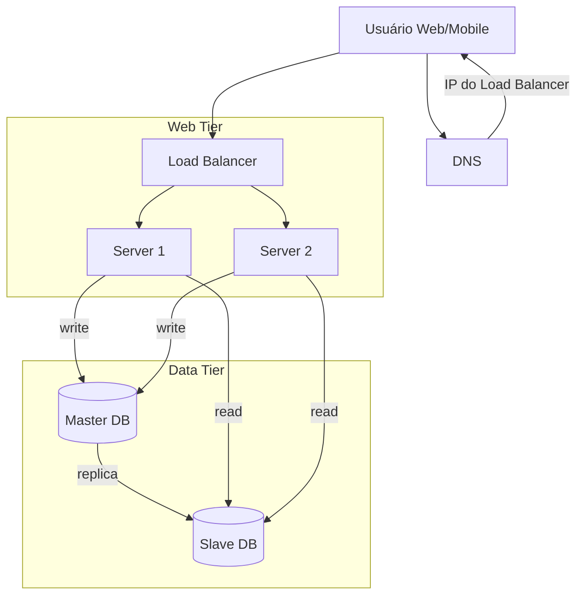
```mermaid
flowchart TD
    U[Usuário Web/Mobile] --> DNS[DNS]
    DNS -->|IP do Load Balancer| U
    U --> LB[Load Balancer]

    subgraph Web_Tier[Web Tier]
        LB --> W1[Server 1]
        LB --> W2[Server 2]
    end

    subgraph Data_Tier[Data Tier]
        M[(Master DB)] -->|replica| S[(Slave DB)]
    end

    W1 -->|write| M
    W2 -->|write| M
    W1 -->|read| S
    W2 -->|read| S
```

### 8.1 Fluxo

1. O usuário obtém o IP do load balancer via DNS.
2. O usuário envia a requisição ao load balancer.
3. O load balancer direciona a requisição para um servidor web disponível.
4. Escritas vão para o banco master.
5. Leituras podem ir para o banco slave.
6. O master replica dados para o slave.

---

## 9. Cache

Cache é uma área de armazenamento temporário usada para guardar resultados de respostas caras ou dados acessados com frequência.

O objetivo é reduzir chamadas repetidas ao banco de dados e melhorar o tempo de resposta.

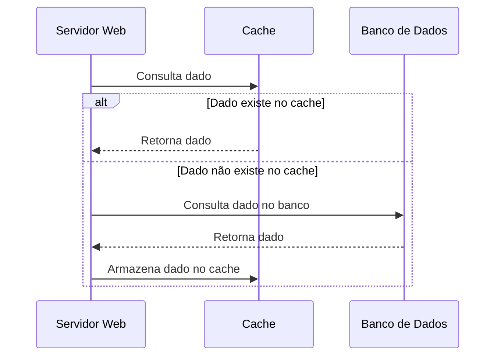
```mermaid
sequenceDiagram
    participant APP as Servidor Web
    participant C as Cache
    participant DB as Banco de Dados

    APP->>C: Consulta dado
    alt Dado existe no cache
        C-->>APP: Retorna dado
    else Dado não existe no cache
        APP->>DB: Consulta dado no banco
        DB-->>APP: Retorna dado
        APP->>C: Armazena dado no cache
    end
```

### 9.1 Camada de cache

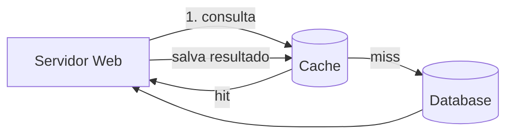
```mermaid
flowchart LR
    APP[Servidor Web] -->|1. consulta| CACHE[(Cache)]
    CACHE -->|hit| APP
    CACHE -->|miss| DB[(Database)]
    DB --> APP
    APP -->|salva resultado| CACHE
```

### 9.2 Exemplo conceitual

```text
SECONDS = 1
cache.set('myKey', 'hi there', 3600 * SECONDS)
cache.get('myKey')
```

### 9.3 Cuidados ao usar cache

| Tema                 | Atenção necessária                                                                |
| -------------------- | --------------------------------------------------------------------------------- |
| Quando usar          | Dados lidos com frequência e modificados raramente.                               |
| Dados permanentes    | Cache não deve ser fonte definitiva dos dados.                                    |
| Expiração            | TTL muito curto reduz benefício; TTL muito longo pode gerar dados desatualizados. |
| Consistência         | Banco e cache podem ficar temporariamente divergentes.                            |
| Ponto único de falha | Cache único pode derrubar parte importante do sistema se falhar.                  |
| Política de remoção  | Quando o cache enche, itens antigos precisam ser removidos.                       |

### 9.4 Políticas de remoção

Principais políticas citadas:

* **LRU** — remove o item menos usado recentemente;
* **LFU** — remove o item usado com menor frequência;
* **FIFO** — remove o item mais antigo.

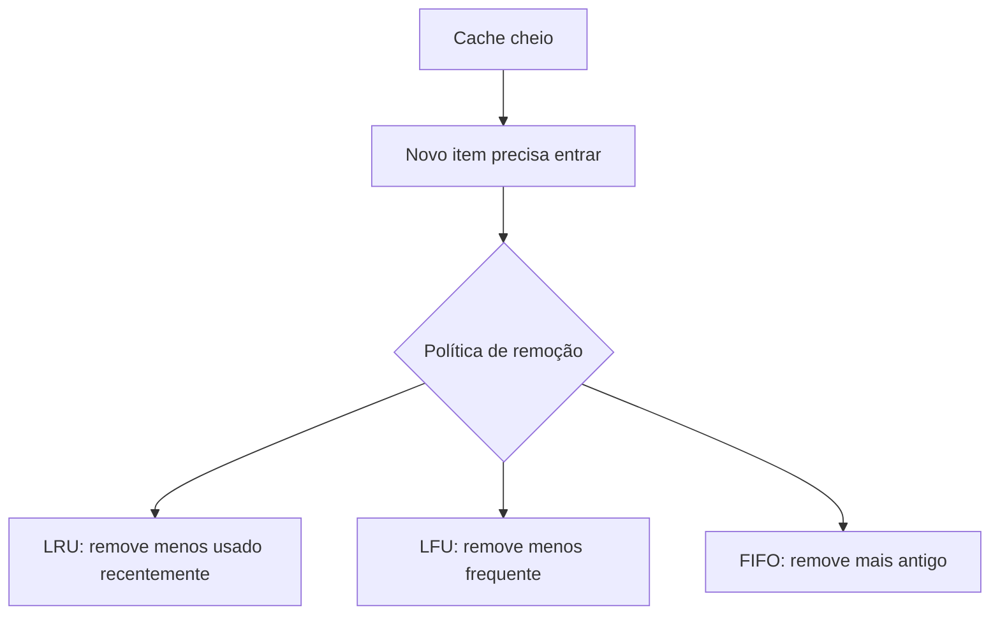
```mermaid
flowchart TD
    FULL[Cache cheio] --> NEW[Novo item precisa entrar]
    NEW --> POLICY{Política de remoção}
    POLICY --> LRU[LRU: remove menos usado recentemente]
    POLICY --> LFU[LFU: remove menos frequente]
    POLICY --> FIFO[FIFO: remove mais antigo]
```

---

## 10. CDN — Content Delivery Network

Uma CDN é uma rede de servidores distribuídos geograficamente usada para entregar conteúdo estático, como:

* imagens;
* vídeos;
* arquivos CSS;
* arquivos JavaScript.

A CDN aproxima o conteúdo do usuário, reduzindo latência e carga nos servidores de origem.

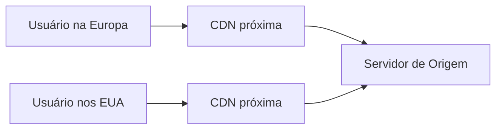
```mermaid
flowchart LR
    U1[Usuário na Europa] --> CDN_EU[CDN próxima]
    U2[Usuário nos EUA] --> CDN_US[CDN próxima]
    CDN_EU --> ORIGIN[Servidor de Origem]
    CDN_US --> ORIGIN
```

### 10.1 Fluxo de cache na CDN

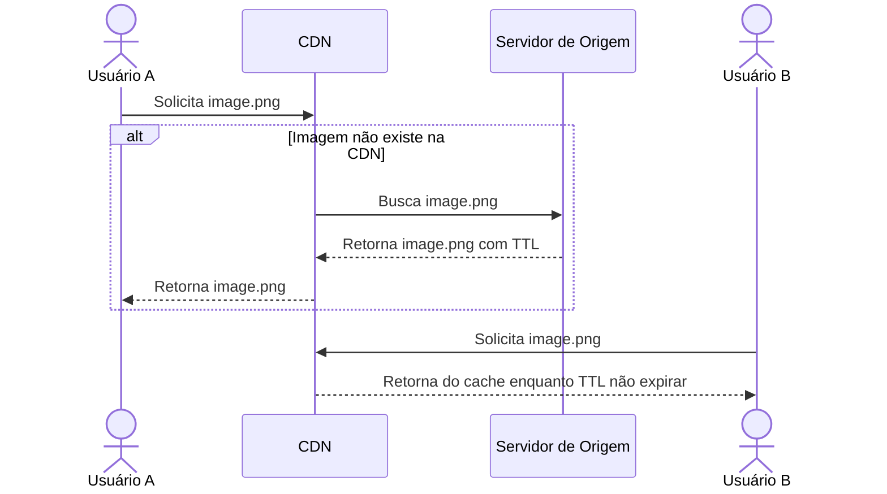
```mermaid
sequenceDiagram
    actor A as Usuário A
    participant CDN as CDN
    participant O as Servidor de Origem
    actor B as Usuário B

    A->>CDN: Solicita image.png
    alt Imagem não existe na CDN
        CDN->>O: Busca image.png
        O-->>CDN: Retorna image.png com TTL
        CDN-->>A: Retorna image.png
    end

    B->>CDN: Solicita image.png
    CDN-->>B: Retorna do cache enquanto TTL não expirar
```

### 10.2 Considerações ao usar CDN

| Tema          | Explicação                                                          |
| ------------- | ------------------------------------------------------------------- |
| Custo         | Provedores cobram tráfego de entrada e saída da CDN.                |
| Expiração     | Conteúdo sensível ao tempo precisa de TTL adequado.                 |
| Falha da CDN  | O sistema deve conseguir buscar recursos na origem se a CDN falhar. |
| Invalidação   | É possível remover ou trocar objetos antes do TTL expirar.          |
| Versionamento | Alterar a URL, como `image.png?v=2`, força nova versão do objeto.   |

---

## 11. Arquitetura com CDN e cache

Com CDN e cache, o sistema reduz carga sobre servidores web e banco de dados.

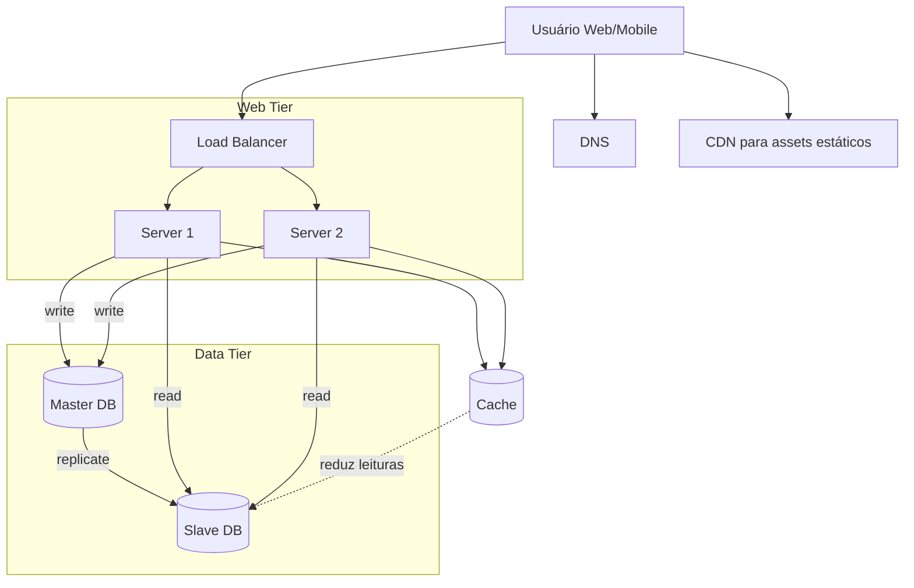
```mermaid
flowchart TD
    U[Usuário Web/Mobile] --> DNS[DNS]
    U --> CDN[CDN para assets estáticos]
    U --> LB[Load Balancer]

    subgraph Web_Tier[Web Tier]
        LB --> W1[Server 1]
        LB --> W2[Server 2]
    end

    W1 --> CACHE[(Cache)]
    W2 --> CACHE

    subgraph Data_Tier[Data Tier]
        M[(Master DB)] -->|replicate| S[(Slave DB)]
    end

    W1 -->|write| M
    W2 -->|write| M
    W1 -->|read| S
    W2 -->|read| S

    CACHE -. reduz leituras .-> S
```

### 11.1 Efeito prático

* arquivos estáticos deixam de ser servidos diretamente pela aplicação;
* dados consultados com frequência passam a vir do cache;
* banco de dados recebe menos consultas repetidas;
* tempo de resposta melhora.

---

## 12. Camada web sem estado

Para escalar horizontalmente a camada web, os servidores não devem manter estado local de sessão.

Em uma arquitetura **stateful**, o servidor guarda dados da sessão do usuário. Isso cria dependência entre usuário e servidor específico.

Em uma arquitetura **stateless**, o servidor não guarda estado local. Dados de sessão são armazenados em um repositório compartilhado, como banco relacional, cache distribuído ou banco NoSQL.

---

## 13. Arquitetura stateful

Na arquitetura stateful, cada servidor mantém dados de sessão de determinados usuários.

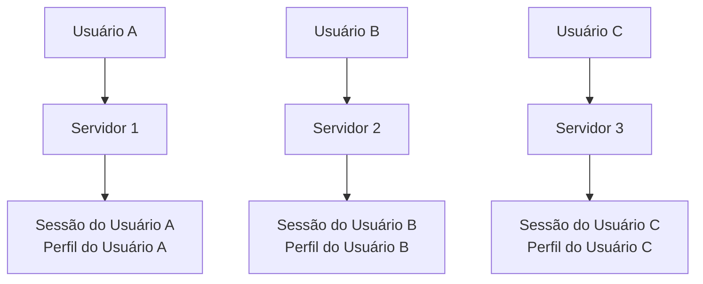
```mermaid
flowchart TD
    A[Usuário A] --> S1[Servidor 1]
    B[Usuário B] --> S2[Servidor 2]
    C[Usuário C] --> S3[Servidor 3]

    S1 --> D1["Sessão do Usuário A\nPerfil do Usuário A"]
    S2 --> D2["Sessão do Usuário B\nPerfil do Usuário B"]
    S3 --> D3["Sessão do Usuário C\nPerfil do Usuário C"]
```

### 13.1 Problema

Se o Usuário A for redirecionado para o Servidor 2, a autenticação pode falhar, porque os dados da sessão estão no Servidor 1.

Para contornar isso, seria necessário usar sessões fixas (*sticky sessions*), o que aumenta complexidade e reduz flexibilidade de escala.

---

## 14. Arquitetura stateless

Na arquitetura stateless, qualquer servidor pode atender qualquer usuário. O estado da sessão fica em armazenamento compartilhado.

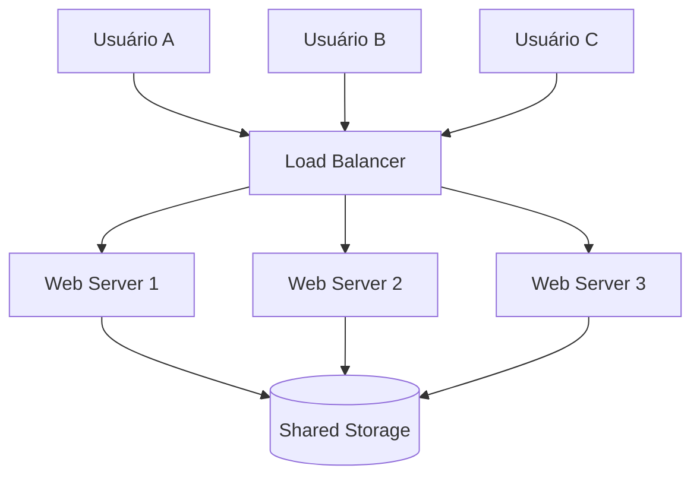
```mermaid
flowchart TD
    A[Usuário A] --> LB[Load Balancer]
    B[Usuário B] --> LB
    C[Usuário C] --> LB

    LB --> W1[Web Server 1]
    LB --> W2[Web Server 2]
    LB --> W3[Web Server 3]

    W1 --> STORE[(Shared Storage)]
    W2 --> STORE
    W3 --> STORE
```

### 14.1 Benefícios

| Benefício                | Explicação                                                      |
| ------------------------ | --------------------------------------------------------------- |
| Escalabilidade           | Novos servidores podem ser adicionados facilmente.              |
| Simplicidade operacional | Não é necessário prender usuário a um servidor específico.      |
| Alta disponibilidade     | Se um servidor falhar, outro pode atender a próxima requisição. |
| Flexibilidade            | O load balancer distribui melhor as requisições.                |

---

## 15. Arquitetura evoluída com web tier stateless

```mermaid
flowchart TD
    U[Usuário Web/Mobile] --> DNS[DNS]
    U --> CDN[CDN]
    U --> LB[Load Balancer]

    subgraph Web_Tier[Web Tier Stateless]
        LB --> W1[Server 1]
        LB --> W2[Server 2]
        LB --> W3[Server 3]
        LB --> W4[Server 4]
    end

    W1 --> CACHE[(Cache)]
    W2 --> CACHE
    W3 --> CACHE
    W4 --> CACHE

    W1 --> NOSQL[(NoSQL / Shared Storage)]
    W2 --> NOSQL
    W3 --> NOSQL
    W4 --> NOSQL

    subgraph Data_Tier[Data Tier]
        S1[(Slave DB)] <--> M[(Master DB)] <--> S2[(Slave DB)]
    end

    W1 -->|read| S1
    W2 -->|write| M
    W3 -->|read| S2
    W4 -->|write| M
```

### 15.1 Papel do auto scaling

Com servidores stateless, é mais simples adicionar ou remover instâncias automaticamente conforme o tráfego.

```mermaid
flowchart LR
    METRIC[Métricas de tráfego / CPU] --> AS[Auto Scaling]
    AS -->|alta demanda| ADD[Adiciona servidores]
    AS -->|baixa demanda| REMOVE[Remove servidores]
    ADD --> POOL[Pool de servidores web]
    REMOVE --> POOL
```

---

## 16. Data centers

Quando a aplicação cresce e passa a atender usuários em diferentes regiões, usar múltiplos data centers melhora disponibilidade e experiência do usuário.

O DNS geográfico, ou geoDNS, resolve domínios para data centers próximos do usuário.

```mermaid
flowchart TD
    U[Usuário] --> DNS[GeoDNS]
    DNS -->|usuário próximo da região 1| DC1[Data Center 1]
    DNS -->|usuário próximo da região 2| DC2[Data Center 2]

    subgraph DC1[DC1 - US-East]
        W1[Web Servers]
        DB1[(Databases)]
        C1[(Caches)]
    end

    subgraph DC2[DC2 - US-West]
        W2[Web Servers]
        DB2[(Databases)]
        C2[(Caches)]
    end

    W1 --> NS[(NoSQL Compartilhado)]
    W2 --> NS
```

### 16.1 Failover entre data centers

Se um data center falhar, o tráfego deve ser direcionado para outro data center saudável.

```mermaid
flowchart TD
    U[Usuário] --> DNS[GeoDNS]
    DNS -->|100% tráfego| DC1[DC1 saudável]
    DNS -. DC2 indisponível .-> DC2[DC2 offline]

    DC1 --> APP1[Web Servers]
    DC1 --> DB1[(Databases)]
    DC1 --> C1[(Caches)]

    DC2:::off --> APP2[Web Servers indisponíveis]

    classDef off fill:#f8d7da,stroke:#b02a37,color:#842029;
```

### 16.2 Desafios técnicos

| Desafio                     | Explicação                                                                  |
| --------------------------- | --------------------------------------------------------------------------- |
| Redirecionamento de tráfego | É necessário direcionar usuários para data centers saudáveis.               |
| Sincronização de dados      | Dados precisam ser replicados entre regiões.                                |
| Testes e deployment         | A aplicação precisa funcionar corretamente em múltiplas localidades.        |
| Consistência                | Usuários de regiões diferentes podem observar dados em momentos diferentes. |

---

## 17. Fila de mensagens

Para escalar ainda mais, é importante desacoplar componentes. Uma estratégia comum é usar filas de mensagens.

A fila permite que produtores publiquem tarefas e consumidores processem de forma assíncrona.

```mermaid
flowchart LR
    P[Produtor] --> MQ[(Fila de Mensagens)]
    MQ --> C1[Consumidor 1]
    MQ --> C2[Consumidor 2]
    MQ --> C3[Consumidor 3]
```

### 17.1 Benefícios

| Benefício                | Explicação                                                  |
| ------------------------ | ----------------------------------------------------------- |
| Desacoplamento           | Produtor e consumidor não precisam operar no mesmo ritmo.   |
| Resiliência              | Se consumidores falharem, mensagens podem aguardar na fila. |
| Escalabilidade           | É possível adicionar mais consumidores.                     |
| Processamento assíncrono | Tarefas demoradas não bloqueiam a resposta ao usuário.      |

---

## 18. Arquitetura final consolidada

```mermaid
flowchart TD
    U[Usuário Web/Mobile] --> DNS[GeoDNS]
    U --> CDN[CDN]
    DNS --> LB[Load Balancer]

    subgraph Web_Tier[Camada Web Stateless]
        LB --> W1[Web Server 1]
        LB --> W2[Web Server 2]
        LB --> W3[Web Server 3]
    end

    W1 --> CACHE[(Cache Distribuído)]
    W2 --> CACHE
    W3 --> CACHE

    W1 --> SESSION[(Shared Session Store / NoSQL)]
    W2 --> SESSION
    W3 --> SESSION

    subgraph Data_Tier[Camada de Dados]
        M[(Master DB)] -->|replicação| S1[(Slave DB 1)]
        M -->|replicação| S2[(Slave DB 2)]
    end

    W1 -->|write| M
    W2 -->|read| S1
    W3 -->|read| S2

    W1 --> MQ[(Message Queue)]
    MQ --> WORKER1[Worker 1]
    MQ --> WORKER2[Worker 2]

    WORKER1 --> M
    WORKER2 --> M
```

---

## 19. Resumo didático

A evolução apresentada no capítulo segue uma lógica incremental:

| Etapa                 | Problema                                           | Solução                    |
| --------------------- | -------------------------------------------------- | -------------------------- |
| Servidor único        | Simplicidade inicial, mas sem alta disponibilidade | Separar responsabilidades  |
| Banco separado        | Aplicação e dados competem por recursos            | Servidor dedicado de banco |
| Muitos acessos        | Servidor web sobrecarregado                        | Load balancer              |
| Banco como gargalo    | Leituras e escritas concentradas                   | Replicação master-slave    |
| Consultas repetidas   | Banco recebe chamadas desnecessárias               | Cache                      |
| Latência global       | Usuários distantes do servidor                     | CDN                        |
| Sessão local          | Usuário preso a um servidor                        | Web tier stateless         |
| Usuários globais      | Baixa disponibilidade regional                     | Múltiplos data centers     |
| Componentes acoplados | Processos lentos bloqueiam fluxo principal         | Fila de mensagens          |

---

## 20. Ideia central do capítulo

A arquitetura de sistemas escaláveis deve evoluir conforme a necessidade. Não se começa com a solução mais complexa. Começa-se simples, identifica-se o gargalo e aplica-se a técnica adequada.

O padrão de evolução é:

```mermaid
flowchart LR
    A[Comece simples] --> B[Meça gargalos]
    B --> C[Separe responsabilidades]
    C --> D[Distribua carga]
    D --> E[Reduza trabalho repetido]
    E --> F[Remova estado local]
    F --> G[Distribua geograficamente]
    G --> H[Desacople componentes]
```

---

## 21. Pontos-chave para revisão

* DNS traduz nomes de domínio para endereços IP.
* Servidor único é simples, mas possui ponto único de falha.
* Separar aplicação e banco permite escalar cada camada de forma independente.
* Escala vertical é simples, mas limitada.
* Escala horizontal é mais adequada para sistemas grandes.
* Load balancer distribui tráfego e melhora disponibilidade.
* Replicação de banco melhora leitura, disponibilidade e recuperação.
* Cache reduz latência e carga no banco.
* CDN melhora entrega de conteúdo estático para usuários geograficamente distantes.
* Web tier stateless facilita auto scaling e tolerância a falhas.
* Múltiplos data centers aumentam disponibilidade global.
* Filas de mensagens ajudam a desacoplar serviços e processar tarefas de forma assíncrona.
