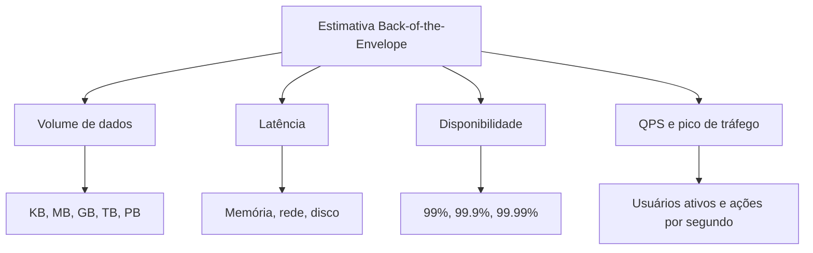
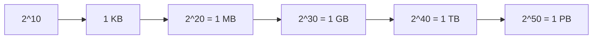
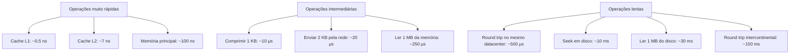
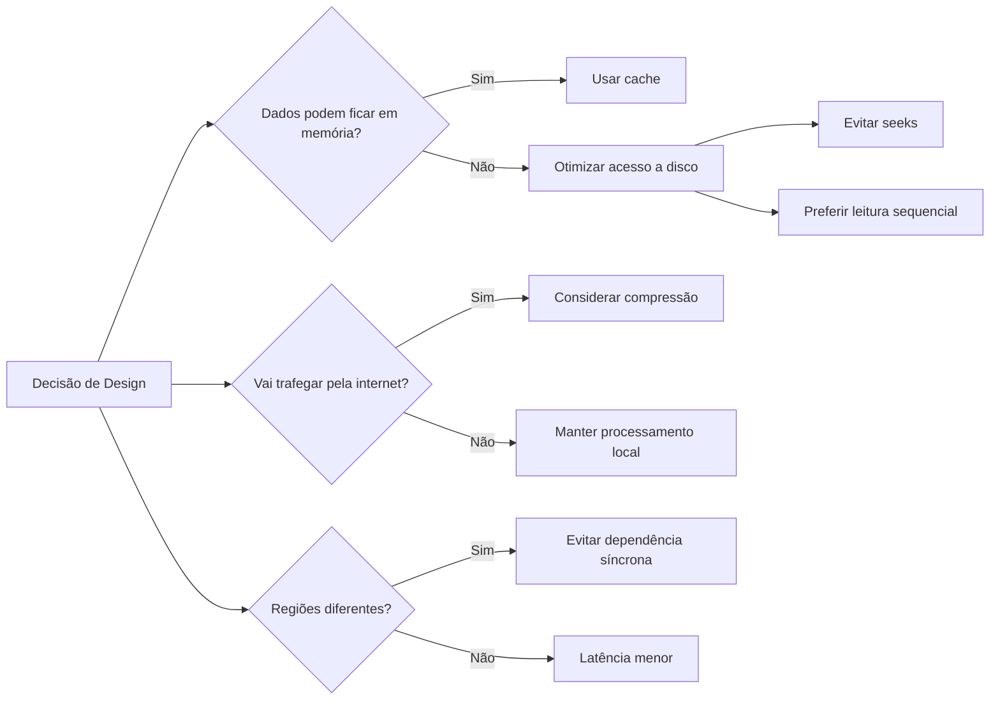
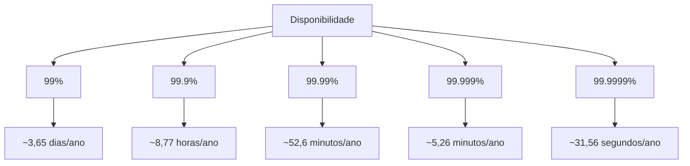
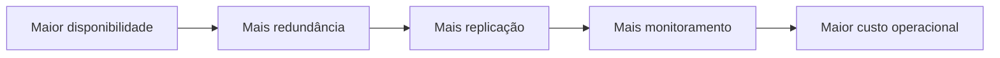
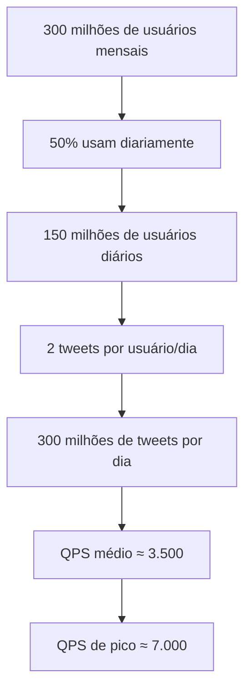
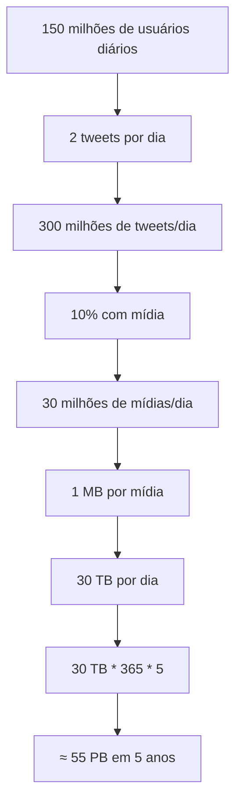
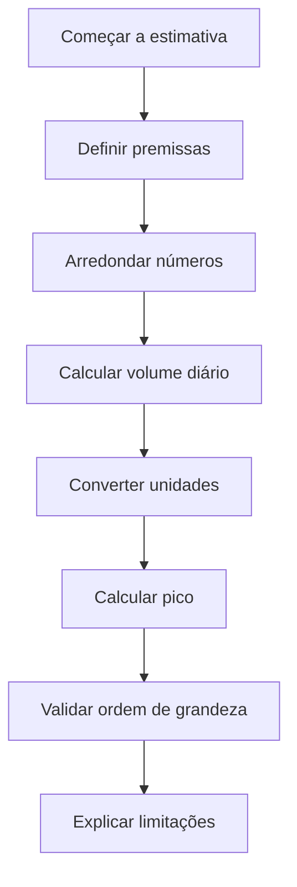
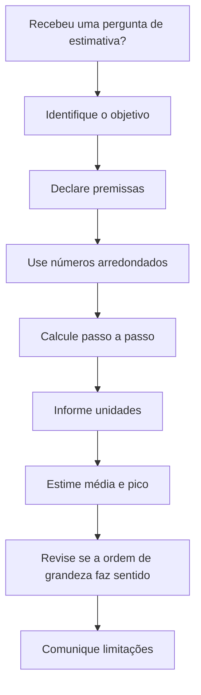

# Capítulo 02 — Estimativas “Back-of-the-Envelope”

## 1. Visão geral

Em entrevistas de **System Design**, é comum precisar estimar capacidade, volume de dados, tráfego, latência ou disponibilidade de um sistema sem ter todos os números exatos.

Esse tipo de cálculo é chamado de **back-of-the-envelope estimation**, ou seja, uma estimativa rápida feita com aproximações razoáveis.

O objetivo não é chegar a um número perfeitamente exato, mas demonstrar raciocínio, domínio de escala e capacidade de tomar decisões técnicas com base em ordens de grandeza.

---

## 2. Conceitos essenciais

Antes de estimar sistemas distribuídos, é importante dominar três grupos de números:

1. Potências de 2 e unidades de armazenamento.
2. Números típicos de latência.
3. Números de disponibilidade.



---

## 3. Potências de 2 e unidades de dados

Em sistemas distribuídos, os volumes de dados podem crescer rapidamente. Por isso, é importante conhecer aproximações simples.

| Potência | Valor aproximado | Nome completo | Nome curto |
| -------: | ---------------: | ------------- | ---------- |
|       10 |            1 mil | 1 Kilobyte    | 1 KB       |
|       20 |         1 milhão | 1 Megabyte    | 1 MB       |
|       30 |         1 bilhão | 1 Gigabyte    | 1 GB       |
|       40 |        1 trilhão | 1 Terabyte    | 1 TB       |
|       50 |     1 quadrilhão | 1 Petabyte    | 1 PB       |



### Observação importante

Um byte possui **8 bits**. Em cálculos aproximados, costuma-se usar:

```text
1 KB ≈ 1.000 bytes
1 MB ≈ 1.000.000 bytes
1 GB ≈ 1.000.000.000 bytes
1 TB ≈ 1.000.000.000.000 bytes
1 PB ≈ 1.000.000.000.000.000 bytes
```

---

## 4. Latência: números que todo programador deveria conhecer

Os números de latência ajudam a entender o custo relativo de operações como acessar memória, disco ou rede.

| Operação                                 | Tempo aproximado |
| ---------------------------------------- | ---------------: |
| Referência ao cache L1                   |           0,5 ns |
| Erro de predição de branch               |             5 ns |
| Referência ao cache L2                   |             7 ns |
| Lock/unlock de mutex                     |           100 ns |
| Referência à memória principal           |           100 ns |
| Comprimir 1 KB com Zippy                 |            10 μs |
| Enviar 2 KB em rede de 1 Gbps            |            20 μs |
| Ler 1 MB sequencialmente da memória      |           250 μs |
| Round trip no mesmo datacenter           |           500 μs |
| Seek em disco                            |            10 ms |
| Ler 1 MB sequencialmente da rede         |            10 ms |
| Ler 1 MB sequencialmente do disco        |            30 ms |
| Pacote Califórnia → Holanda → Califórnia |           150 ms |

### Conversão de unidades

```text
1 ns = nanossegundo
1 μs = microssegundo
1 ms = milissegundo

1 μs = 1.000 ns
1 ms = 1.000 μs = 1.000.000 ns
```

---

## 5. Comparação visual de latência

A principal lição é que operações locais em memória são muito rápidas, enquanto operações envolvendo disco e rede são significativamente mais lentas.



---

## 6. Conclusões práticas sobre latência

A partir dos números apresentados, podemos extrair algumas regras práticas:

| Conclusão                                 | Impacto no design                                      |
| ----------------------------------------- | ------------------------------------------------------ |
| Memória é rápida, disco é lento           | Preferir cache e estruturas em memória quando possível |
| Seek em disco deve ser evitado            | Preferir leituras sequenciais e índices bem projetados |
| Compressão simples é rápida               | Pode compensar comprimir antes de transmitir dados     |
| Rede entre regiões é cara                 | Evitar chamadas síncronas entre regiões distantes      |
| Datacenters diferentes adicionam latência | Projetar replicação e consistência com cuidado         |



---

## 7. Números de disponibilidade

Alta disponibilidade significa manter o sistema operacional pelo maior tempo possível.

A disponibilidade é normalmente expressa em percentual. Quanto maior o número de “noves”, menor o tempo de indisponibilidade esperado.

| Disponibilidade | Downtime por dia | Downtime por ano |
| --------------: | ---------------: | ---------------: |
|             99% |    14,40 minutos |        3,65 dias |
|           99,9% |     1,44 minutos |       8,77 horas |
|          99,99% |    8,64 segundos |    52,60 minutos |
|         99,999% |           864 ms |     5,26 minutos |
|        99,9999% |         86,40 ms |   31,56 segundos |



---

## 8. SLA — Service Level Agreement

SLA é o acordo formal entre provedor e cliente sobre o nível de serviço esperado.

Exemplo:

```text
Um SLA de 99,9% significa que o serviço pode ficar indisponível
aproximadamente 8,77 horas por ano.
```

Na prática, quanto maior a disponibilidade exigida, maior tende a ser o custo arquitetural.



---

## 9. Exemplo: estimando QPS e armazenamento do Twitter

O capítulo apresenta um exemplo didático com números fictícios para estimar tráfego e armazenamento.

### Premissas

| Premissa                      |       Valor |
| ----------------------------- | ----------: |
| Usuários ativos mensais       | 300 milhões |
| Usuários que usam diariamente |         50% |
| Tweets por usuário por dia    |           2 |
| Tweets com mídia              |         10% |
| Tempo de armazenamento        |      5 anos |

---

## 10. Estimativa de QPS

### Cálculo de usuários ativos diários

```text
DAU = 300 milhões * 50%
DAU = 150 milhões
```

### Cálculo de tweets por segundo

```text
Tweets por dia = 150 milhões * 2
Tweets por dia = 300 milhões

QPS = 300 milhões / 24 horas / 3600 segundos
QPS ≈ 3.500
```

### Pico de tráfego

O capítulo assume que o pico é aproximadamente o dobro do QPS médio.

```text
Peak QPS = 2 * QPS
Peak QPS ≈ 7.000
```



---

## 11. Estimativa de armazenamento de mídia

O capítulo estima apenas o armazenamento de mídia.

### Tamanho médio de um tweet

| Campo    |   Tamanho |
| -------- | --------: |
| tweet_id |  64 bytes |
| texto    | 140 bytes |
| mídia    |      1 MB |

### Cálculo de mídia por dia

```text
Tweets por dia = 150 milhões * 2
Percentual com mídia = 10%
Tamanho da mídia = 1 MB

Armazenamento por dia = 150 milhões * 2 * 10% * 1 MB
Armazenamento por dia = 30 TB
```

### Armazenamento por 5 anos

```text
Armazenamento em 5 anos = 30 TB * 365 * 5
Armazenamento em 5 anos ≈ 55 PB
```



---

## 12. Processo recomendado para estimativas



---

## 13. Dicas práticas

### 13.1 Arredonde e aproxime

Durante uma entrevista, não é necessário fazer cálculos extremamente precisos.

Exemplo:

```text
99987 / 9,1
```

Pode ser simplificado para:

```text
100.000 / 10 = 10.000
```

---

### 13.2 Escreva suas premissas

Sempre deixe claro de onde vieram os números usados.

Exemplo:

```text
Assumindo 300 milhões de usuários ativos mensais.
Assumindo que 50% usam o sistema diariamente.
Assumindo que cada usuário publica 2 vezes por dia.
```

Isso permite revisar o raciocínio depois.

---

### 13.3 Sempre escreva as unidades

Evite escrever apenas:

```text
5
```

Prefira:

```text
5 MB
5 GB
5 requisições por segundo
5 milhões de usuários
```

Unidades eliminam ambiguidades.

---

### 13.4 Pratique os cálculos mais comuns

Em entrevistas de System Design, os cálculos mais frequentes envolvem:

| Tipo de estimativa | Exemplo                                          |
| ------------------ | ------------------------------------------------ |
| QPS                | Quantas requisições por segundo o sistema recebe |
| Peak QPS           | Qual o pico esperado                             |
| Armazenamento      | Quantos TB ou PB serão necessários               |
| Cache              | Quantos dados precisam estar em memória          |
| Servidores         | Quantas máquinas suportam a carga                |
| Disponibilidade    | Quanto downtime é aceitável                      |

---

## 14. Resumo do capítulo

Estimativas back-of-the-envelope são fundamentais para projetar sistemas escaláveis.

Elas ajudam a responder perguntas como:

```text
Quantas requisições por segundo o sistema precisa suportar?
Quanto armazenamento será necessário?
Quanto tráfego de rede será gerado?
Qual disponibilidade o sistema deve oferecer?
Quantos servidores podem ser necessários?
```

O mais importante não é obter um número perfeito, mas demonstrar raciocínio estruturado, clareza nas premissas e domínio das ordens de grandeza.

---

## 15. Checklist para entrevistas



---

## 16. Fórmulas úteis

```text
DAU = MAU * percentual de uso diário

Eventos por dia = DAU * eventos por usuário por dia

QPS médio = eventos por dia / 86.400

QPS de pico ≈ QPS médio * fator de pico

Armazenamento diário = quantidade de eventos * tamanho médio do evento

Armazenamento total = armazenamento diário * dias de retenção
```

---

## 17. Exemplo genérico de cálculo

```text
MAU = 100 milhões
Usuários diários = 40%
Ações por usuário por dia = 5

DAU = 100 milhões * 40%
DAU = 40 milhões

Ações por dia = 40 milhões * 5
Ações por dia = 200 milhões

QPS = 200 milhões / 86.400
QPS ≈ 2.300
```

---

## 18. Ideia central

> Em System Design, estimar bem não significa acertar o número exato.
> Significa raciocinar corretamente sobre escala, custo, latência, armazenamento e disponibilidade.
