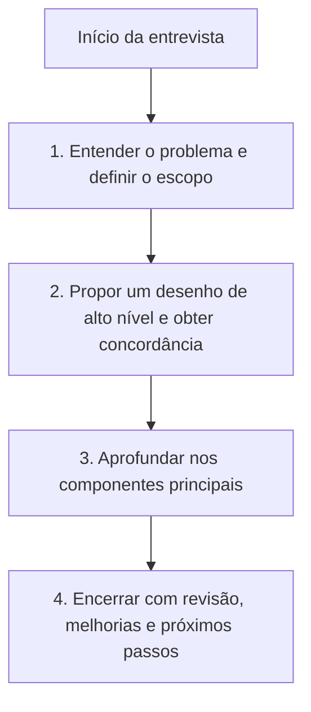
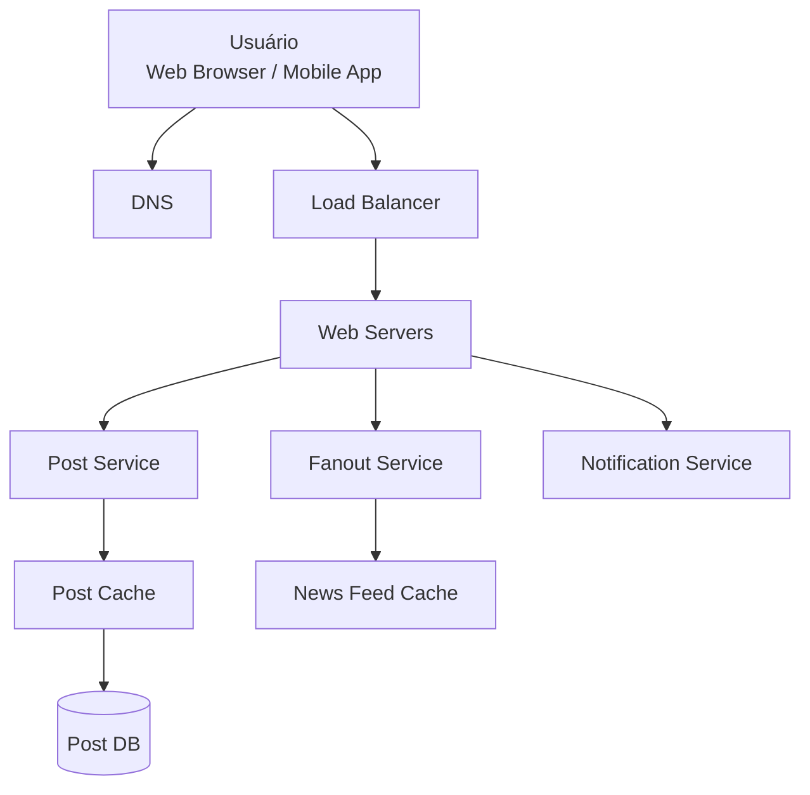
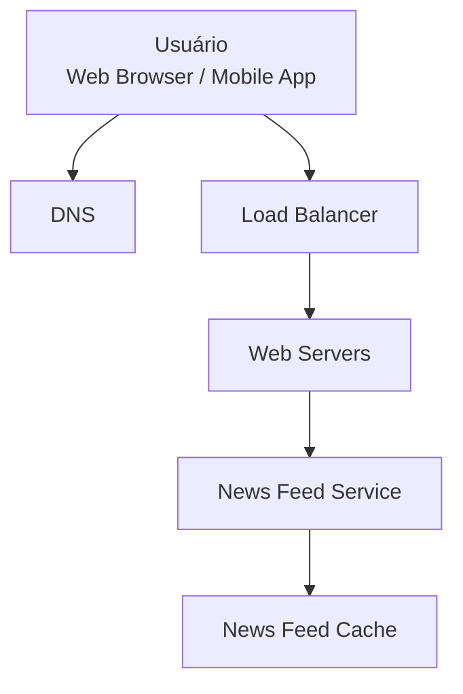
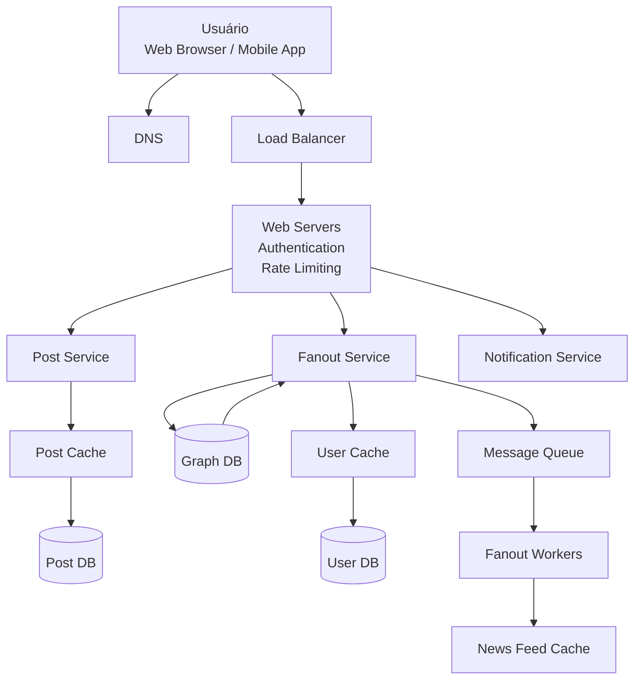
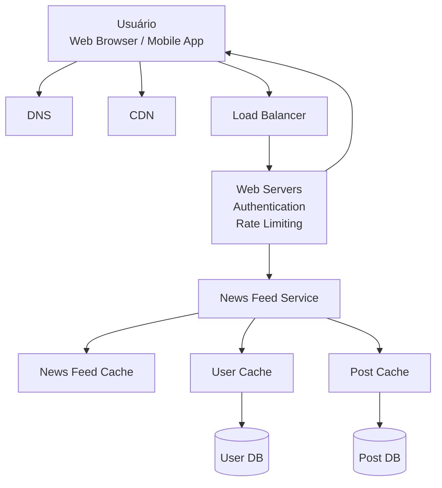
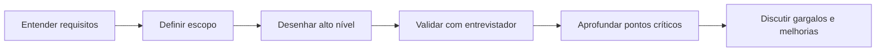

# Capítulo 03 — Um Framework para Entrevistas de System Design

## 1. Objetivo do capítulo

Este capítulo apresenta um processo simples e prático para conduzir entrevistas de **System Design**.

A ideia principal é que a entrevista não avalia apenas se o candidato sabe desenhar uma arquitetura. Ela avalia também:

* capacidade de entender requisitos ambíguos;
* habilidade de fazer boas perguntas;
* comunicação técnica;
* colaboração com o entrevistador;
* tomada de decisão sob pressão;
* capacidade de justificar escolhas;
* maturidade para lidar com trade-offs.

Em uma entrevista desse tipo, normalmente **não existe uma única resposta correta**. O mais importante é demonstrar raciocínio estruturado, clareza e capacidade de evoluir o desenho com base no feedback.

---

## 2. Visão geral do processo

O capítulo propõe um processo em **4 etapas**:

---

# 3. Etapa 1 — Entender o problema e definir o escopo

## 3.1 Ideia central

Antes de propor qualquer solução, é essencial entender o problema.

O capítulo alerta contra o comportamento de responder rápido demais, sem compreender os requisitos. Em System Design, isso é um sinal negativo, porque pode indicar precipitação, falta de análise e pouca capacidade de lidar com ambiguidade.

O candidato deve:

* desacelerar;
* fazer perguntas;
* confirmar premissas;
* entender restrições;
* definir o escopo do sistema;
* registrar suposições importantes.

## 3.2 Perguntas recomendadas

Algumas perguntas úteis:

* Quais funcionalidades específicas devem ser construídas?
* Quantos usuários o produto possui?
* Qual volume de tráfego esperado?
* Qual crescimento é esperado em 3 meses, 6 meses e 1 ano?
* Existe alguma stack tecnológica já definida?
* Há serviços existentes que podem ser reutilizados?
* O sistema precisa suportar web, mobile ou ambos?
* O sistema precisa lidar com imagens, vídeos ou apenas texto?

---

## 3.3 Exemplo: sistema de feed de notícias

O capítulo usa como exemplo o desenho de um sistema de **news feed**.

Perguntas iniciais do candidato:

* É uma aplicação mobile, web ou ambas?
* Quais são as funcionalidades mais importantes?
* O feed deve ser ordenado cronologicamente?
* Quantos amigos um usuário pode ter?
* Qual é o volume de tráfego?
* O feed pode conter imagens e vídeos?

Premissas assumidas no exemplo:

* aplicação web e mobile;
* usuário pode publicar posts;
* usuário pode ver o feed dos amigos;
* feed ordenado em ordem cronológica reversa;
* cada usuário pode ter até 5.000 amigos;
* sistema com 10 milhões de usuários ativos diários;
* posts podem conter texto, imagens e vídeos.

---

# 4. Etapa 2 — Propor um desenho de alto nível e obter concordância

## 4.1 Ideia central

Depois de entender o problema, o candidato deve propor uma arquitetura inicial de alto nível.

Essa etapa serve para alinhar a direção com o entrevistador antes de entrar nos detalhes.

O candidato deve:

* desenhar os principais blocos do sistema;
* explicar o papel de cada componente;
* validar a proposta com o entrevistador;
* fazer estimativas simples quando necessário;
* confirmar se o desenho atende à escala esperada.

---

## 4.2 Componentes comuns em um desenho de alto nível

Um desenho inicial pode conter:

* clientes web e mobile;
* DNS;
* load balancer;
* servidores web;
* APIs;
* serviços de negócio;
* banco de dados;
* cache;
* CDN;
* fila de mensagens;
* workers assíncronos.

---

# 5. Exemplo de alto nível — Publicação no feed

No fluxo de publicação, quando o usuário cria um post:

1. a requisição chega pelo cliente web ou mobile;
2. passa pelo DNS e pelo balanceador de carga;
3. chega aos servidores web;
4. o serviço de post grava os dados;
5. o cache de posts pode ser atualizado;
6. o banco de posts persiste a informação;
7. o serviço de fanout distribui o post para feeds de amigos;
8. o serviço de notificação pode avisar outros usuários.

## Diagrama Mermaid — Publicação no feed

---

# 6. Exemplo de alto nível — Consulta do feed

No fluxo de consulta do feed:

1. o usuário solicita seu feed;
2. a requisição passa pelo load balancer;
3. os servidores web encaminham para o serviço de news feed;
4. o serviço busca os dados no cache de feed;
5. o resultado é retornado ao usuário.

## Diagrama Mermaid — Consulta do feed

---

# 7. Etapa 3 — Aprofundar o desenho

## 7.1 Ideia central

Depois que o desenho de alto nível foi validado, o candidato deve aprofundar os pontos mais importantes.

O foco não é detalhar tudo. O foco é escolher os componentes críticos.

Exemplos de aprofundamento:

* gargalos de performance;
* cache;
* banco de dados;
* filas;
* workers;
* rate limiting;
* autenticação;
* consistência dos dados;
* disponibilidade;
* latência;
* escalabilidade.

---

## 7.2 Cuidado com excesso de detalhe

O capítulo alerta que entrar em detalhes desnecessários pode prejudicar a entrevista.

Por exemplo, em um sistema de feed, discutir profundamente o algoritmo de ranking pode consumir muito tempo e não demonstrar a capacidade principal esperada: desenhar um sistema escalável.

O candidato deve priorizar os pontos mais relevantes para o problema.

---

# 8. Detalhamento — Publicação no feed

O fluxo detalhado de publicação inclui autenticação, rate limiting, consulta ao grafo de amigos, fila de mensagens e workers de fanout.

## Diagrama Mermaid — Publicação detalhada no feed

---

## 8.1 Interpretação do fluxo

O fluxo pode ser entendido assim:

1. o usuário publica um post;
2. os servidores web validam autenticação e limite de requisições;
3. o serviço de post salva o conteúdo;
4. o serviço de fanout busca os amigos do usuário;
5. dados de usuário podem ser consultados via cache;
6. uma mensagem é enviada para a fila;
7. workers processam a distribuição;
8. o cache do feed dos amigos é atualizado;
9. o serviço de notificação pode disparar alertas.

---

# 9. Detalhamento — Recuperação do feed

Na consulta detalhada do feed, o sistema usa cache para reduzir latência e carga no banco.

## Diagrama Mermaid — Recuperação detalhada do feed

---

## 9.1 Interpretação do fluxo

O fluxo pode ser entendido assim:

1. o usuário solicita o feed;
2. a requisição passa pelo balanceador de carga;
3. os servidores web validam autenticação e rate limiting;
4. o serviço de news feed consulta o cache do feed;
5. se necessário, consulta cache de usuários e cache de posts;
6. os bancos são acessados apenas quando os dados não estão em cache;
7. a resposta é retornada ao usuário.

---

# 10. Etapa 4 — Encerrar a entrevista

## 10.1 Ideia central

No final, o candidato deve revisar o desenho e discutir melhorias.

Essa etapa é importante porque demonstra maturidade técnica e senso crítico.

Pontos recomendados:

* identificar gargalos;
* propor melhorias;
* discutir falhas de servidor ou rede;
* falar sobre métricas e logs;
* explicar monitoramento;
* discutir rollout;
* pensar na próxima ordem de escala;
* propor refinamentos futuros.

---

## 10.2 Exemplos de perguntas finais

O entrevistador pode perguntar:

* Onde estão os gargalos?
* Como melhorar a disponibilidade?
* Como lidar com falhas de rede?
* Como monitorar erros?
* Como escalar de 1 milhão para 10 milhões de usuários?
* O que você faria se tivesse mais tempo?

---

# 11. Boas práticas

## 11.1 Faça

* Peça esclarecimentos.
* Não assuma que suas premissas estão corretas.
* Entenda os requisitos antes de desenhar.
* Comunique seu raciocínio.
* Sugira mais de uma abordagem quando possível.
* Valide o desenho com o entrevistador.
* Aprofunde primeiro os componentes mais críticos.
* Use o entrevistador como parceiro de discussão.
* Não desista se travar.

---

## 11.2 Não faça

* Não vá direto para a solução sem entender o problema.
* Não entre em detalhes profundos logo no início.
* Não fique em silêncio enquanto pensa.
* Não ignore feedback.
* Não assuma que a entrevista acabou depois de apresentar o desenho.
* Não tente resolver tudo como se houvesse uma única resposta correta.

---

# 12. Distribuição de tempo sugerida

Para uma entrevista de aproximadamente **45 minutos**, o capítulo sugere a seguinte divisão:

| Etapa |                                         Atividade | Tempo aproximado |
| ----- | ------------------------------------------------: | ---------------: |
| 1     |              Entender o problema e definir escopo |   3 a 10 minutos |
| 2     | Propor desenho de alto nível e obter concordância |  10 a 15 minutos |
| 3     |                              Aprofundar o desenho |  10 a 25 minutos |
| 4     |                                Encerrar e revisar |    3 a 5 minutos |

---

# 13. Resumo didático

A entrevista de System Design não é apenas uma prova de arquitetura.

Ela avalia principalmente como o candidato pensa, pergunta, comunica, decide e evolui uma solução diante de requisitos incompletos.

O processo recomendado é:

A principal mensagem do capítulo é:

> Não comece pela solução. Comece pelo entendimento do problema.
