# Capítulo 04 — Design de um Rate Limiter

## 1. Visão geral

Um **rate limiter** é um componente usado para controlar a quantidade de requisições que um cliente, usuário, IP ou serviço pode enviar em determinado intervalo de tempo.

No contexto de APIs HTTP, ele impede que um cliente ultrapasse limites previamente definidos, por exemplo:

* máximo de 2 posts por segundo;
* máximo de 10 contas criadas por dia pelo mesmo IP;
* máximo de 5 recompensas solicitadas por semana pelo mesmo dispositivo.

Quando o limite é excedido, as requisições extras são bloqueadas, normalmente com o status HTTP:

```http
429 Too Many Requests
```

## 2. Por que usar um Rate Limiter?

O rate limiter ajuda a proteger o sistema contra excesso de tráfego, abuso e consumo indevido de recursos.

Principais benefícios:

| Benefício           | Explicação                                                           |
| ------------------- | -------------------------------------------------------------------- |
| Proteção contra DoS | Reduz o impacto de ataques ou tráfego abusivo.                       |
| Redução de custo    | Evita chamadas excessivas a serviços pagos ou caros.                 |
| Estabilidade        | Protege servidores contra sobrecarga.                                |
| Justiça no uso      | Impede que poucos clientes consumam recursos demais.                 |
| Controle de APIs    | Permite aplicar limites por IP, usuário, token, endpoint ou serviço. |

---

## 3. Escopo do problema

Para este projeto, o foco é projetar um **rate limiter server-side**, ou seja, aplicado no lado do servidor/API.

### Requisitos principais

| Requisito                | Descrição                                                    |
| ------------------------ | ------------------------------------------------------------ |
| Precisão                 | Deve limitar corretamente requisições excessivas.            |
| Baixa latência           | Não deve degradar perceptivelmente o tempo de resposta.      |
| Baixo consumo de memória | Deve armazenar apenas o necessário.                          |
| Suporte distribuído      | Deve funcionar com múltiplos servidores.                     |
| Tratamento de exceções   | Deve informar claramente quando o cliente foi limitado.      |
| Alta disponibilidade     | Falhas no rate limiter não devem derrubar o sistema inteiro. |

---

## 4. Onde colocar o Rate Limiter?

Há três possibilidades principais:

1. No cliente;
2. No servidor de API;
3. Como middleware/API Gateway.

A abordagem client-side não é confiável, pois o cliente pode ser alterado ou ignorar as regras. Por isso, o rate limiter geralmente fica no lado servidor ou em um gateway.

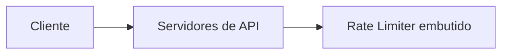

### Rate Limiter como middleware

Essa é uma abordagem mais comum em arquiteturas modernas, especialmente com API Gateway.

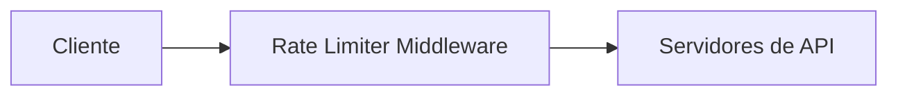

Quando o cliente ultrapassa o limite, o middleware bloqueia a requisição antes que ela chegue aos servidores de API.

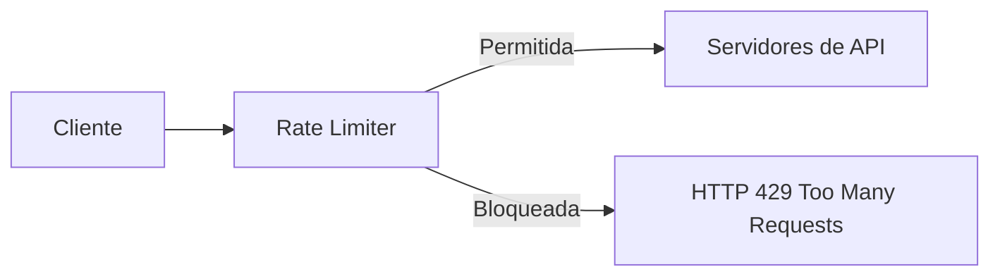

---

## 5. Algoritmos de Rate Limiting

O capítulo apresenta cinco algoritmos principais:

1. Token Bucket;
2. Leaking Bucket;
3. Fixed Window Counter;
4. Sliding Window Log;
5. Sliding Window Counter.

---

# 5.1 Token Bucket

O **Token Bucket** usa um “balde” com capacidade máxima de tokens.

A cada intervalo de tempo, novos tokens são adicionados ao balde. Cada requisição consome um token.

Se houver token disponível, a requisição passa.
Se não houver token, a requisição é bloqueada.

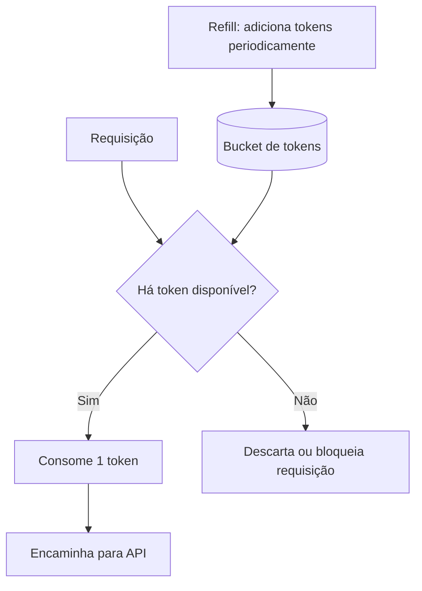

### Exemplo

Capacidade do bucket: 4 tokens.
Taxa de refill: 4 tokens por minuto.

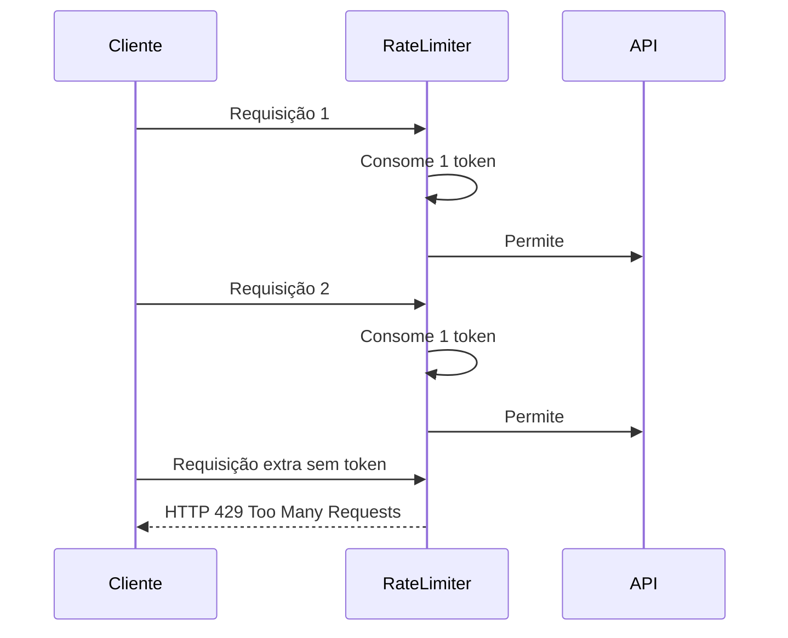

### Vantagens

| Vantagem             | Descrição                                      |
| -------------------- | ---------------------------------------------- |
| Simples              | Fácil de implementar.                          |
| Eficiente em memória | Guarda poucos dados.                           |
| Suporta rajadas      | Permite pequenos picos enquanto houver tokens. |

### Desvantagens

| Desvantagem         | Descrição                                                       |
| ------------------- | --------------------------------------------------------------- |
| Ajuste sensível     | Capacidade e refill rate precisam ser bem calibrados.           |
| Pode permitir burst | Requisições em rajada podem passar se houver tokens acumulados. |

---

# 5.2 Leaking Bucket

O **Leaking Bucket** funciona como uma fila processada em velocidade fixa.

As requisições entram na fila.
O sistema processa as requisições em uma taxa constante.
Se a fila estiver cheia, novas requisições são descartadas.

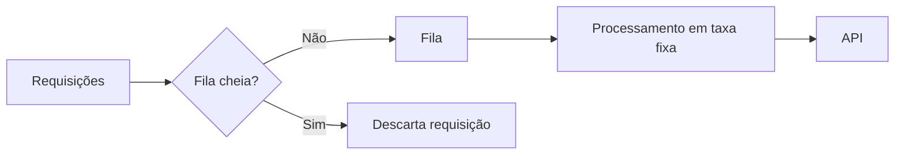

### Vantagens

| Vantagem            | Descrição                                         |
| ------------------- | ------------------------------------------------- |
| Controle estável    | Processa requisições em ritmo constante.          |
| Boa previsibilidade | Evita variações bruscas no tráfego enviado à API. |
| Memória limitada    | A fila tem tamanho fixo.                          |

### Desvantagens

| Desvantagem                      | Descrição                                                               |
| -------------------------------- | ----------------------------------------------------------------------- |
| Pode descartar requisições novas | Uma fila cheia com requisições antigas pode bloquear novas requisições. |
| Menos flexível para bursts       | Não lida tão bem com picos legítimos.                                   |
| Parâmetros difíceis              | Tamanho da fila e taxa de saída precisam ser calibrados.                |

---

# 5.3 Fixed Window Counter

O **Fixed Window Counter** divide o tempo em janelas fixas.

Exemplo: limite de 3 requisições por segundo.

A cada nova janela, o contador é zerado.
Dentro da janela, cada requisição incrementa o contador.
Quando o limite é atingido, novas requisições são bloqueadas até a próxima janela.

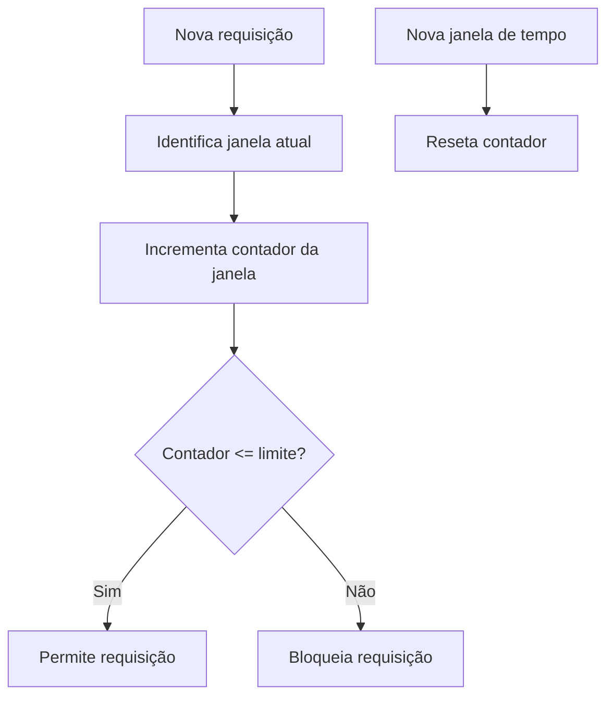

### Problema do Fixed Window

O principal problema ocorre nas bordas da janela.

Exemplo:

* limite: 5 requisições por minuto;
* 5 requisições chegam no final da janela anterior;
* mais 5 chegam no início da janela seguinte.

Na prática, 10 requisições podem passar em um curto intervalo.

```mermaid
timeline
    title Problema nas bordas da janela fixa
    00:59 : 5 requisições permitidas
    01:00 : Nova janela inicia
    01:01 : 5 requisições permitidas
    Resultado : 10 requisições em poucos segundos
```

### Vantagens

| Vantagem          | Descrição                              |
| ----------------- | -------------------------------------- |
| Fácil de entender | Modelo simples baseado em contador.    |
| Baixo custo       | Consome pouca memória.                 |
| Reset previsível  | A quota é renovada ao final da janela. |

### Desvantagens

| Desvantagem          | Descrição                                     |
| -------------------- | --------------------------------------------- |
| Impreciso nas bordas | Pode permitir mais tráfego do que o desejado. |
| Não suaviza picos    | Pode gerar bursts entre janelas consecutivas. |

---

# 5.4 Sliding Window Log

O **Sliding Window Log** registra o timestamp de cada requisição em uma janela móvel.

Quando uma nova requisição chega:

1. Remove timestamps antigos;
2. Conta os timestamps ainda dentro da janela;
3. Se a quantidade for menor que o limite, permite;
4. Caso contrário, bloqueia.

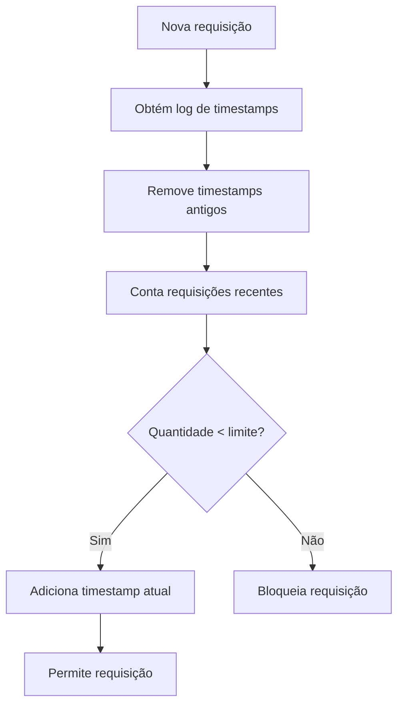

### Vantagens

| Vantagem                | Descrição                           |
| ----------------------- | ----------------------------------- |
| Alta precisão           | Controla exatamente a janela móvel. |
| Evita problema de borda | Não depende de janelas fixas.       |

### Desvantagens

| Desvantagem         | Descrição                                       |
| ------------------- | ----------------------------------------------- |
| Alto uso de memória | Guarda timestamps de várias requisições.        |
| Custo maior         | Precisa limpar e consultar logs constantemente. |

---

# 5.5 Sliding Window Counter

O **Sliding Window Counter** combina ideias do Fixed Window Counter e do Sliding Window Log.

Ele usa a janela atual e uma fração ponderada da janela anterior.

Fórmula conceitual:

```text
requisições estimadas =
requisições da janela atual +
requisições da janela anterior * percentual de sobreposição
```

Exemplo:

```text
Limite: 7 requisições por minuto

Janela anterior: 5 requisições
Janela atual: 3 requisições
Sobreposição: 70%

Estimativa = 3 + 5 * 0.7
Estimativa = 6.5
```

Como 6.5 é menor que 7, a nova requisição pode ser aceita.

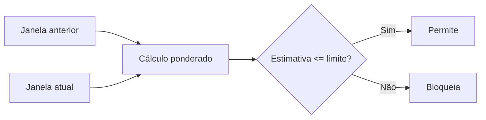

### Vantagens

| Vantagem                       | Descrição                                  |
| ------------------------------ | ------------------------------------------ |
| Mais suave que Fixed Window    | Reduz picos nas bordas.                    |
| Mais eficiente que Sliding Log | Não precisa guardar todos os timestamps.   |
| Bom equilíbrio                 | Combina precisão razoável com baixo custo. |

### Desvantagens

| Desvantagem                     | Descrição                                        |
| ------------------------------- | ------------------------------------------------ |
| Aproximado                      | Não é tão preciso quanto Sliding Window Log.     |
| Distribuição pode ser imprecisa | Assume distribuição uniforme na janela anterior. |

---

## 6. Comparativo dos algoritmos

| Algoritmo              |    Precisão |     Memória |   Suporta burst | Complexidade | Observação               |
| ---------------------- | ----------: | ----------: | --------------: | -----------: | ------------------------ |
| Token Bucket           |       Média |       Baixa |             Sim |        Baixa | Muito usado em APIs.     |
| Leaking Bucket         |       Média | Baixa/Média |       Não muito |        Média | Bom para taxa constante. |
| Fixed Window           | Baixa/Média |       Baixa | Sim, nas bordas |        Baixa | Simples, mas impreciso.  |
| Sliding Window Log     |        Alta |        Alta |      Controlado |         Alta | Preciso, porém caro.     |
| Sliding Window Counter |  Média/Alta |       Baixa |      Controlado |        Média | Bom compromisso prático. |

---

## 7. Arquitetura de alto nível

A arquitetura básica usa um middleware de rate limiting e um armazenamento rápido em memória, como Redis.

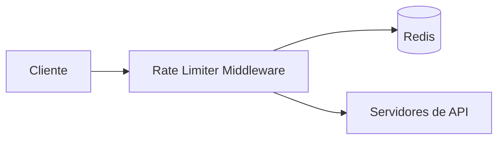

Fluxo:

1. Cliente envia requisição;
2. Rate limiter consulta contador/regra no Redis;
3. Se o limite foi atingido, retorna HTTP 429;
4. Se não foi atingido, incrementa o contador e encaminha para a API.

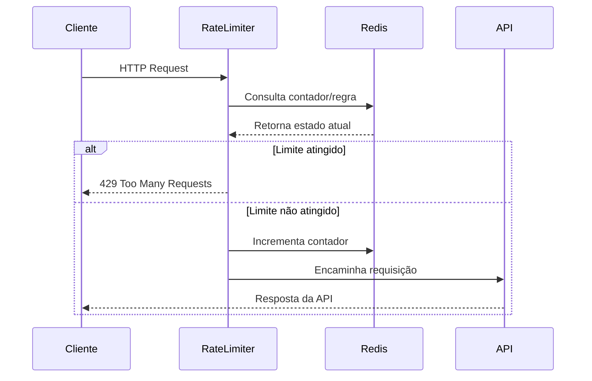

---

## 8. Regras de rate limiting

As regras definem o limite aplicado por domínio, endpoint, usuário, IP ou tipo de autenticação.

Exemplo conceitual:

```yaml
domain: messaging
descriptors:
  - key: message_type
    value: marketing
    rate_limit:
      unit: day
      requests_per_unit: 5
```

Outro exemplo:

```yaml
domain: auth
descriptors:
  - key: auth_type
    value: login
    rate_limit:
      unit: minute
      requests_per_unit: 5
```

Essas regras podem ser armazenadas em arquivos de configuração, banco de dados ou disco, e carregadas em cache por workers.

---

## 9. Headers de resposta

Quando uma requisição é limitada, a API deve informar ao cliente o motivo e quando ele poderá tentar novamente.

Headers comuns:

| Header                    | Função                                               |
| ------------------------- | ---------------------------------------------------- |
| `X-RateLimit-Remaining`   | Quantidade de requisições restantes na janela.       |
| `X-RateLimit-Limit`       | Limite máximo permitido.                             |
| `X-RateLimit-Retry-After` | Tempo necessário para tentar novamente.              |
| `Retry-After`             | Header padrão indicando quando repetir a requisição. |

Exemplo:

```http
HTTP/1.1 429 Too Many Requests
X-RateLimit-Limit: 100
X-RateLimit-Remaining: 0
Retry-After: 60
```

---

## 10. Design detalhado

No design detalhado, o rate limiter usa:

* cache para regras;
* Redis para contadores;
* workers para carregar regras;
* fila opcional para requisições bloqueadas;
* API servers para processar requisições permitidas.

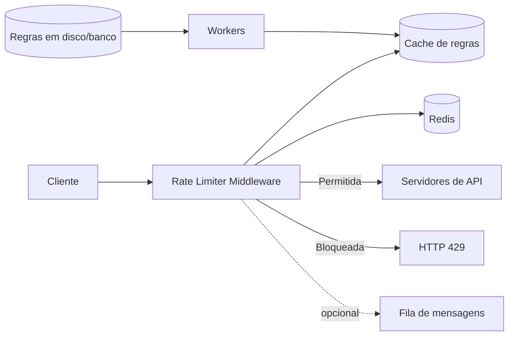

Fluxo detalhado:

1. Workers carregam regras periodicamente;
2. As regras são armazenadas em cache;
3. O cliente envia uma requisição;
4. O middleware consulta as regras no cache;
5. O middleware consulta/incrementa contadores no Redis;
6. Se a requisição estiver dentro do limite, ela vai para a API;
7. Se estiver fora do limite, recebe HTTP 429;
8. Opcionalmente, a requisição bloqueada pode ir para uma fila.

---

## 11. Rate Limiter em ambiente distribuído

Em ambientes com múltiplos servidores, surgem dois problemas principais:

1. Race condition;
2. Sincronização entre instâncias.

---

# 11.1 Race Condition

A race condition ocorre quando duas requisições leem o mesmo contador ao mesmo tempo.

Exemplo:

```text
contador atual = 3

requisição A lê 3
requisição B lê 3

A incrementa para 4
B incrementa para 4

resultado esperado: 5
resultado real: 4
```

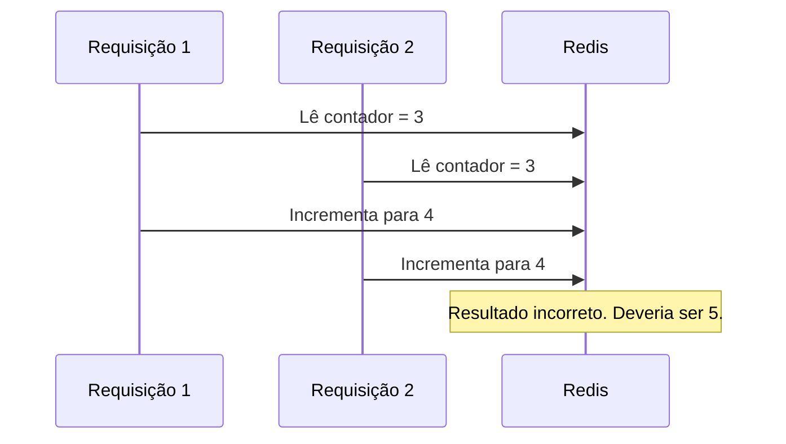

### Soluções

| Solução              | Descrição                                                   |
| -------------------- | ----------------------------------------------------------- |
| Locks                | Controlam acesso concorrente, mas podem reduzir desempenho. |
| Lua Script no Redis  | Executa leitura, validação e incremento de forma atômica.   |
| Sorted Sets no Redis | Úteis para Sliding Window Log.                              |

---

# 11.2 Sincronização entre instâncias

Se existirem múltiplos rate limiters, uma requisição do mesmo cliente pode cair em instâncias diferentes.

Sem estado compartilhado, cada instância pode tomar decisões incorretas.

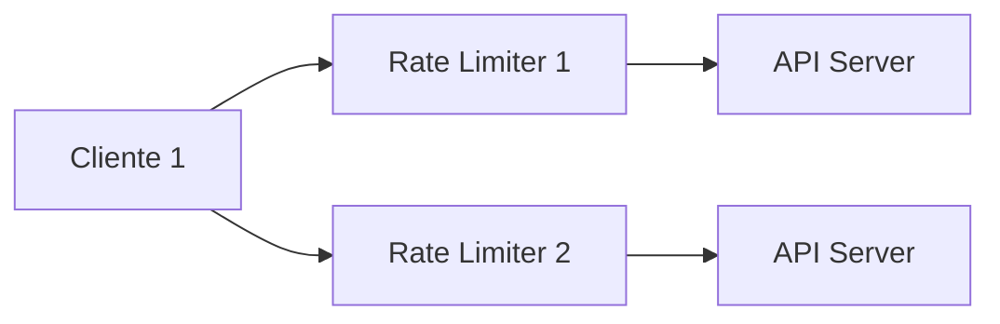

A solução mais escalável é usar um armazenamento centralizado, como Redis.

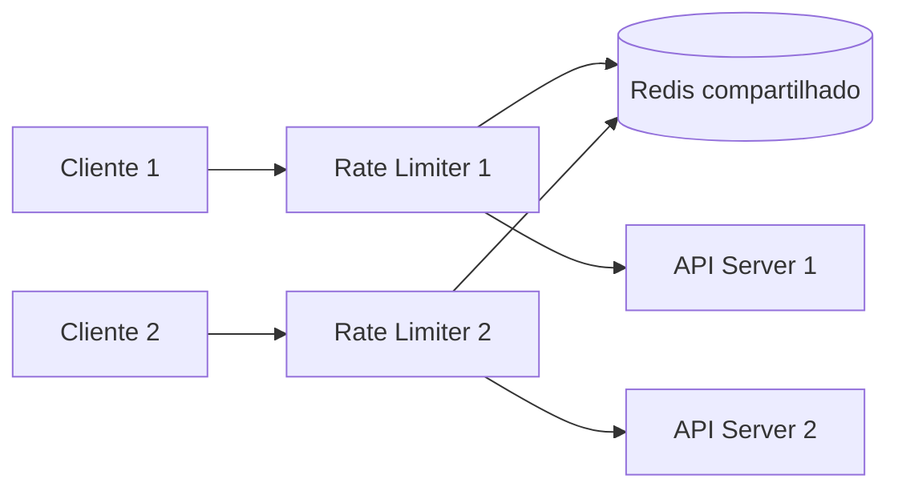

---

## 12. Otimização de performance

Duas estratégias importantes:

### 12.1 Multi-data center e edge servers

Para reduzir latência, o rate limiter pode ser executado próximo do usuário, em edge servers ou data centers distribuídos.

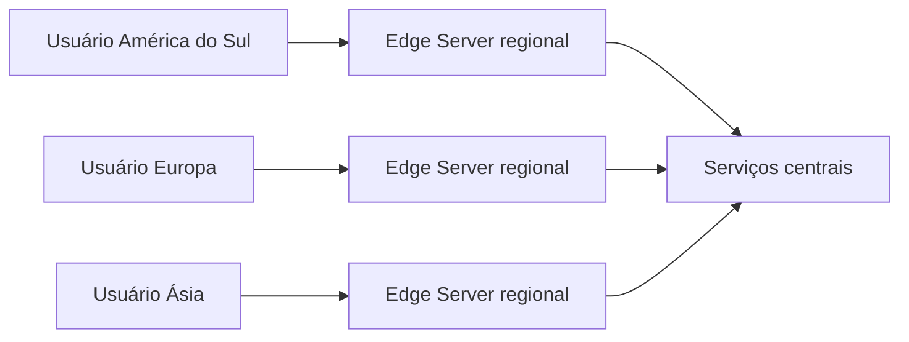

### 12.2 Consistência eventual

Em sistemas distribuídos, nem sempre é necessário sincronizar tudo imediatamente.

Pode-se aceitar uma pequena diferença temporária entre instâncias, desde que o sistema mantenha desempenho e disponibilidade.

---

## 13. Monitoramento

Após implantar o rate limiter, é essencial monitorar:

| Métrica                  | Objetivo                                   |
| ------------------------ | ------------------------------------------ |
| Requisições permitidas   | Verificar tráfego normal.                  |
| Requisições bloqueadas   | Identificar limites excessivos ou ataques. |
| Latência do rate limiter | Garantir que ele não degrade a API.        |
| Uso de Redis/cache       | Detectar gargalos.                         |
| Erros HTTP 429           | Avaliar impacto no usuário.                |
| Efetividade das regras   | Verificar se as regras estão corretas.     |

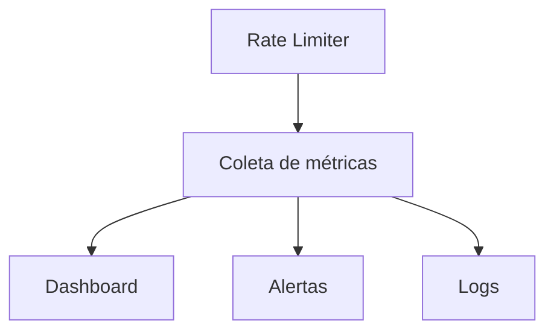

---

## 14. Boas práticas

| Boa prática                           | Explicação                                               |
| ------------------------------------- | -------------------------------------------------------- |
| Usar cache no cliente quando possível | Evita chamadas desnecessárias.                           |
| Informar limites via headers          | Ajuda o cliente a se adaptar.                            |
| Aplicar backoff                       | Cliente deve esperar antes de tentar novamente.          |
| Tratar erro 429 corretamente          | Evita falhas em cascata.                                 |
| Ter fallback                          | Falha no Redis não deve derrubar toda a API.             |
| Definir limites por contexto          | Login, pagamento e leitura podem ter limites diferentes. |
| Monitorar continuamente               | Regras podem precisar de ajuste.                         |

---

## 15. Hard vs Soft Rate Limiting

| Tipo | Descrição                                                         |
| ---- | ----------------------------------------------------------------- |
| Hard | O número de requisições nunca pode ultrapassar o limite.          |
| Soft | O limite pode ser ultrapassado temporariamente por curto período. |

Exemplo:

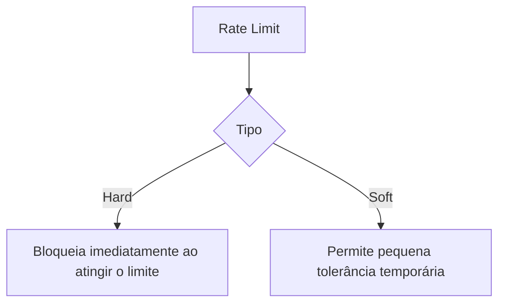

---

## 16. Rate limiting em diferentes camadas

Embora o capítulo foque na camada HTTP/API, rate limiting pode ser aplicado em outras camadas:

| Camada            | Exemplo                                    |
| ----------------- | ------------------------------------------ |
| Aplicação         | Limitar login por usuário.                 |
| API Gateway       | Limitar chamadas por token.                |
| Rede              | Limitar tráfego por IP.                    |
| Firewall/Iptables | Bloquear abuso em nível de infraestrutura. |
| Serviço externo   | Controlar chamadas para APIs pagas.        |

---

## 17. Resumo final

Um bom rate limiter precisa equilibrar:

* precisão;
* baixa latência;
* baixo consumo de memória;
* escalabilidade;
* tolerância a falhas;
* clareza para o cliente;
* facilidade de ajuste das regras.

Para APIs modernas, uma arquitetura comum é:

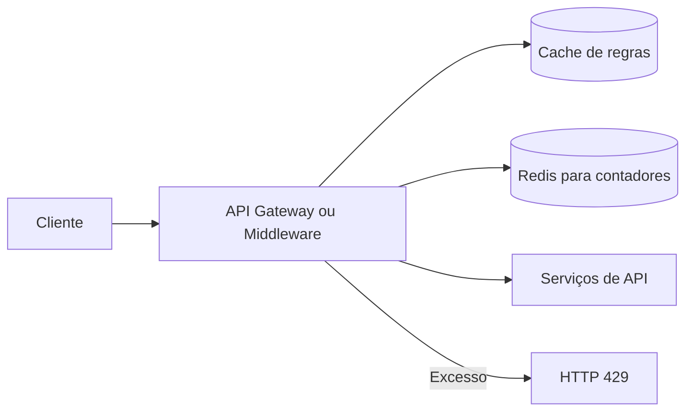

### Recomendação prática

Para a maioria dos sistemas, uma boa solução inicial é:

| Componente       | Escolha sugerida                              |
| ---------------- | --------------------------------------------- |
| Algoritmo        | Token Bucket ou Sliding Window Counter        |
| Armazenamento    | Redis                                         |
| Execução         | API Gateway ou middleware                     |
| Concorrência     | Lua Script no Redis                           |
| Resposta de erro | HTTP 429 com `Retry-After`                    |
| Monitoramento    | Métricas de permitidas, bloqueadas e latência |

**Conclusão:** o rate limiter é um componente essencial para proteger APIs, controlar custos, reduzir abuso e manter a estabilidade do sistema sob carga elevada.
