# Capítulo 05 — Design Consistent Hashing

## 1. Objetivo do capítulo

Para escalar horizontalmente um sistema, é comum distribuir requisições ou dados entre vários servidores. O desafio é fazer essa distribuição de forma equilibrada e com o menor impacto possível quando servidores são adicionados ou removidos.

O **consistent hashing**, ou **hashing consistente**, é uma técnica usada para resolver esse problema, principalmente em sistemas distribuídos, caches, bancos chave-valor, balanceadores e mecanismos de particionamento de dados.

---

# 2. O problema do rehashing

Uma forma simples de distribuir chaves entre servidores é aplicar uma função de hash e usar o resto da divisão pelo número de servidores.

```text
serverIndex = hash(key) % N
```

Onde:

```text
N = quantidade de servidores
```

Exemplo com 4 servidores:

| key  |     hash | hash % 4 | servidor |
| ---- | -------: | -------: | -------- |
| key0 | 18358617 |        1 | server 1 |
| key1 | 26143584 |        0 | server 0 |
| key2 | 18131146 |        2 | server 2 |
| key3 | 35863496 |        0 | server 0 |
| key4 | 34085809 |        1 | server 1 |
| key5 | 27581703 |        3 | server 3 |
| key6 | 38164978 |        2 | server 2 |
| key7 | 22530351 |        3 | server 3 |

## Distribuição com 4 servidores

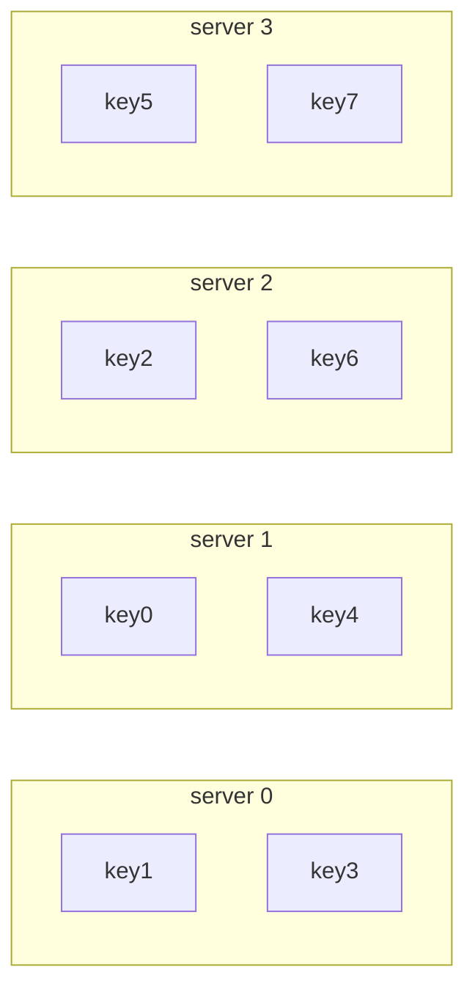

Essa abordagem funciona bem enquanto a quantidade de servidores permanece fixa.

O problema aparece quando um servidor é removido ou adicionado. Se o número de servidores muda de `4` para `3`, a fórmula também muda:

```text
serverIndex = hash(key) % 3
```

Nova distribuição:

| key  |     hash | hash % 3 | novo servidor |
| ---- | -------: | -------: | ------------- |
| key0 | 18358617 |        0 | server 0      |
| key1 | 26143584 |        0 | server 0      |
| key2 | 18131146 |        1 | server 1      |
| key3 | 35863496 |        2 | server 2      |
| key4 | 34085809 |        1 | server 1      |
| key5 | 27581703 |        0 | server 0      |
| key6 | 38164978 |        1 | server 1      |
| key7 | 22530351 |        0 | server 0      |

## Redistribuição após remover um servidor

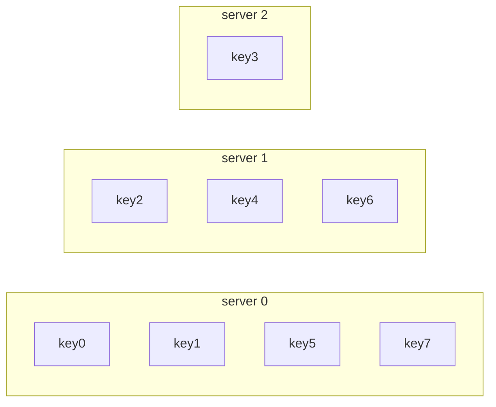

O problema é que muitas chaves mudam de servidor, mesmo que apenas um servidor tenha sido removido.

Em um sistema de cache, isso causa muitas perdas de cache ao mesmo tempo. Os clientes passam a consultar servidores errados, gerando um grande volume de cache miss.

---

# 3. O que é Consistent Hashing

O **hashing consistente** é uma técnica em que, quando servidores são adicionados ou removidos, apenas uma pequena fração das chaves precisa ser redistribuída.

Em média, se existem:

```text
k = quantidade de chaves
n = quantidade de servidores
```

Apenas aproximadamente:

```text
k / n
```

chaves precisam ser remapeadas.

Isso é muito melhor do que a abordagem tradicional com módulo, na qual quase todas as chaves podem mudar de servidor.

---

# 4. Espaço de hash e anel de hash

No consistent hashing, o espaço de hash é tratado como um intervalo circular.

Exemplo: usando SHA-1, os valores possíveis vão de:

```text
0 até 2^160 - 1
```

Esse espaço pode ser representado como uma linha:

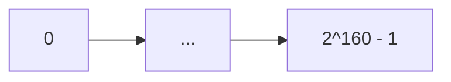

Ao conectar o fim da linha ao início, formamos um **anel de hash**.

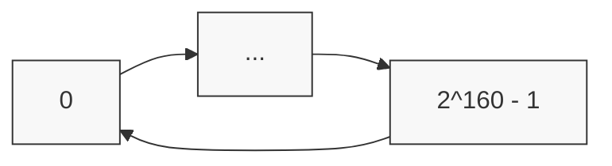

A ideia central é:

```text
servidores e chaves são posicionados no mesmo anel de hash.
```

---

# 5. Posicionando servidores no anel

Cada servidor é mapeado para uma posição no anel usando uma função de hash baseada, por exemplo, no IP ou no nome do servidor.

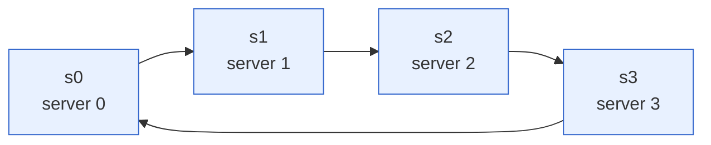

---

# 6. Posicionando chaves no anel

As chaves também são mapeadas para posições no anel.

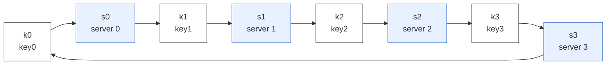

Importante: nessa abordagem, não usamos:

```text
hash(key) % N
```

A chave é posicionada diretamente no anel.

---

# 7. Como localizar o servidor de uma chave

Para descobrir em qual servidor uma chave está armazenada:

1. Calcula-se a posição da chave no anel.
2. A partir dessa posição, anda-se no sentido horário.
3. O primeiro servidor encontrado será o responsável pela chave.

Exemplo:

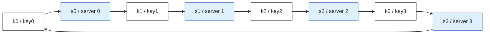

Resultado conceitual:

| chave | primeiro servidor no sentido horário |
| ----- | ------------------------------------ |
| key0  | server 0                             |
| key1  | server 1                             |
| key2  | server 2                             |
| key3  | server 3                             |

---

# 8. Adicionando um servidor

Quando um novo servidor é adicionado, apenas as chaves que ficam no intervalo afetado precisam mudar.

Exemplo: adicionando `server 4`.

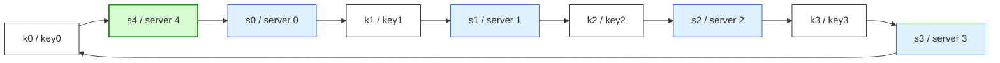

Antes:

```text
key0 estava em server 0
```

Depois:

```text
key0 passa para server 4
```

As demais chaves continuam nos mesmos servidores.

Esse é o principal ganho do consistent hashing: adicionar um servidor não exige redistribuir tudo.

---

# 9. Removendo um servidor

Quando um servidor é removido, apenas as chaves daquele servidor precisam ser redistribuídas para o próximo servidor no sentido horário.

Exemplo: removendo `server 1`.

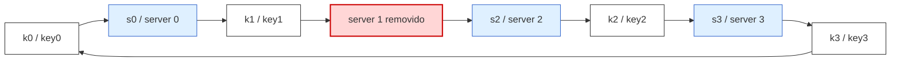

Nesse exemplo:

```text
key1 sai de server 1 e vai para server 2
```

As outras chaves permanecem inalteradas.

---

# 10. Problemas da abordagem básica

Mesmo com consistent hashing, a abordagem básica possui dois problemas importantes.

## 10.1 Partições desbalanceadas

A distância entre dois servidores no anel pode variar muito.

Se os servidores ficarem mal distribuídos, um servidor pode assumir uma fatia muito maior do anel do que os demais.

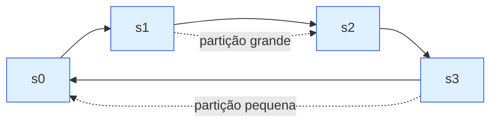

Consequência:

```text
um servidor pode armazenar muito mais dados do que os outros.
```

---

## 10.2 Distribuição não uniforme de chaves

Outro problema é que as chaves podem se concentrar em uma região do anel.

Nesse caso, alguns servidores recebem muitas chaves, enquanto outros quase não recebem dados.

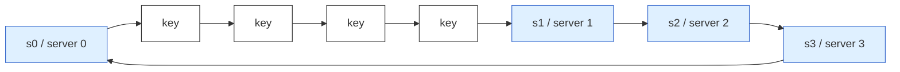

Consequência:

```text
server 0 e server 2 podem receber a maior parte dos dados,
enquanto server 1 e server 3 ficam quase vazios.
```

---

# 11. Virtual nodes ou réplicas

Para resolver esses problemas, usa-se a técnica de **virtual nodes**, também chamados de **vnodes** ou **réplicas**.

A ideia é representar cada servidor físico por vários nós virtuais no anel.

Exemplo:

```text
server 0 → s0_0, s0_1, s0_2
server 1 → s1_0, s1_1, s1_2
```

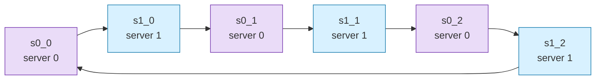

Cada nó virtual aponta para um servidor real.

Assim, o anel fica mais bem distribuído e a carga tende a ser mais equilibrada.

---

# 12. Localizando uma chave com virtual nodes

O processo continua o mesmo:

1. Calcula-se a posição da chave.
2. Anda-se no sentido horário.
3. Encontra-se o primeiro nó virtual.
4. O nó virtual indica o servidor físico responsável.

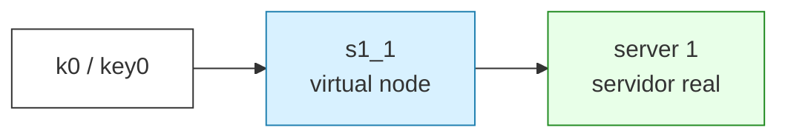

Nesse exemplo:

```text
key0 encontra s1_1 no sentido horário.
s1_1 pertence ao server 1.
Logo, key0 fica no server 1.
```

---

# 13. Quanto mais virtual nodes, melhor a distribuição

Quanto maior o número de virtual nodes, mais equilibrada tende a ser a distribuição das chaves.

Porém, existe um trade-off:

```text
mais virtual nodes = melhor balanceamento
mais virtual nodes = mais metadados para armazenar
```

O capítulo cita que, em sistemas reais, é comum usar muito mais virtual nodes do que nos exemplos didáticos.

---

# 14. Como encontrar as chaves afetadas

Quando um servidor é adicionado ou removido, precisamos identificar qual intervalo do anel será afetado.

## 14.1 Ao adicionar um servidor

Quando `server 4` é adicionado, a faixa afetada começa no novo servidor e anda no sentido anti-horário até encontrar o servidor anterior.

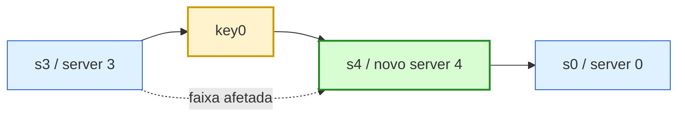

Resultado:

```text
as chaves entre s3 e s4 passam para server 4.
```

---

## 14.2 Ao remover um servidor

Quando `server 1` é removido, a faixa afetada é a região que antes pertencia a ele.

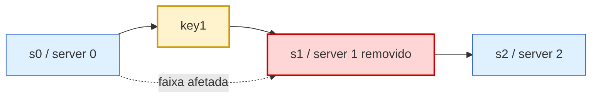

Resultado:

```text
as chaves entre s0 e s1 passam para server 2.
```

---

# 15. Benefícios do Consistent Hashing

O capítulo destaca três benefícios principais:

## 15.1 Menos redistribuição de chaves

Quando servidores são adicionados ou removidos, apenas uma parte das chaves precisa mudar de lugar.

Isso reduz:

```text
cache miss
movimentação de dados
custo de rebalanceamento
instabilidade do sistema
```

---

## 15.2 Melhor escalabilidade horizontal

É mais fácil adicionar novos servidores ao cluster, porque a redistribuição é limitada.

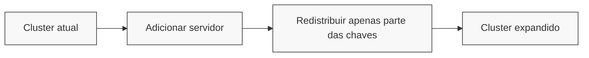

---

## 15.3 Mitigação de hotspot

Um hotspot ocorre quando muitas requisições acessam a mesma região ou o mesmo shard.

O consistent hashing ajuda a distribuir melhor os dados e reduzir a chance de um servidor específico ficar sobrecarregado.

---

# 16. Onde o Consistent Hashing é usado

O capítulo cita exemplos reais de uso:

| Sistema          | Uso                                 |
| ---------------- | ----------------------------------- |
| Amazon Dynamo    | Particionamento de dados            |
| Apache Cassandra | Distribuição de dados no cluster    |
| Discord          | Escalabilidade de aplicação de chat |
| Akamai CDN       | Distribuição de conteúdo            |
| Google Maglev    | Balanceamento de carga              |

---

# 17. Resumo final

Consistent hashing é uma técnica para distribuir chaves entre servidores de forma eficiente em sistemas distribuídos.

A ideia principal é substituir a abordagem:

```text
hash(key) % N
```

por um modelo baseado em anel:

```text
hash(key) → posição no anel → próximo servidor no sentido horário
```

Com isso, quando servidores são adicionados ou removidos, apenas uma fração das chaves precisa ser remapeada.

A abordagem básica pode gerar desequilíbrio, mas isso é mitigado com **virtual nodes**, que espalham representações virtuais dos servidores pelo anel e tornam a distribuição mais uniforme.

---

# 18. Resumo em uma frase

**Consistent hashing permite escalar horizontalmente distribuindo dados entre servidores com baixa redistribuição quando o cluster muda de tamanho.**
