# Capítulo 06 — Design de um Key-Value Store

## 1. Visão geral

Um **key-value store**, ou banco de dados chave-valor, é um banco de dados não relacional no qual cada item é armazenado como um par:

```text
chave -> valor
```

A **chave** identifica unicamente o dado, enquanto o **valor** contém a informação associada.

Exemplo simples:

| Chave | Valor |
| ----: | ----- |
|   145 | john  |
|   147 | bob   |
|   160 | Julia |

A chave pode ser:

```text
last_logged_in_at
253DDEC4
user:145:profile
```

O valor pode ser texto, lista, objeto, JSON, bytes ou qualquer estrutura serializada.

Operações principais:

```text
put(key, value) -> grava o valor associado à chave
get(key)        -> recupera o valor associado à chave
```

---

## 2. Escopo do problema

O objetivo é projetar um key-value store distribuído com as seguintes características:

| Requisito                 | Descrição                                               |
| ------------------------- | ------------------------------------------------------- |
| Chaves e valores pequenos | Menores que 10 KB                                       |
| Armazenamento massivo     | Capaz de armazenar grande volume de dados               |
| Alta disponibilidade      | Deve responder mesmo em cenários de falha               |
| Alta escalabilidade       | Deve crescer conforme o volume de dados aumenta         |
| Escala automática         | Adição e remoção de servidores deve ser automática      |
| Consistência configurável | O sistema deve permitir ajustar o nível de consistência |
| Baixa latência            | Leituras e escritas devem ser rápidas                   |

---

## 3. Key-value store em servidor único

A solução mais simples é armazenar tudo em uma **tabela hash em memória**.

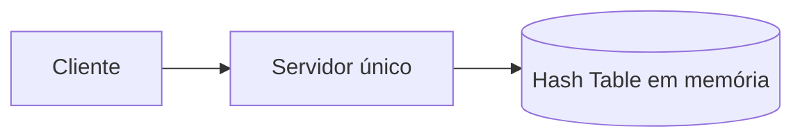

Essa abordagem é simples e rápida, mas limitada.

Problemas:

| Limitação            | Explicação                                                  |
| -------------------- | ----------------------------------------------------------- |
| Memória limitada     | Não é possível manter todos os dados em RAM indefinidamente |
| Falha única          | Se o servidor cair, o sistema fica indisponível             |
| Baixa escalabilidade | O crescimento depende da capacidade de uma única máquina    |

Otimizações possíveis:

```text
1. Compressão dos dados
2. Manter em memória apenas os dados mais acessados
3. Armazenar dados menos usados em disco
```

Mesmo com essas otimizações, um único servidor rapidamente atinge seu limite. Por isso, para grandes volumes, é necessário um **key-value store distribuído**.

---

# 4. Key-value store distribuído

Um key-value store distribuído também pode ser entendido como uma **tabela hash distribuída**.

Os dados são distribuídos entre vários servidores.

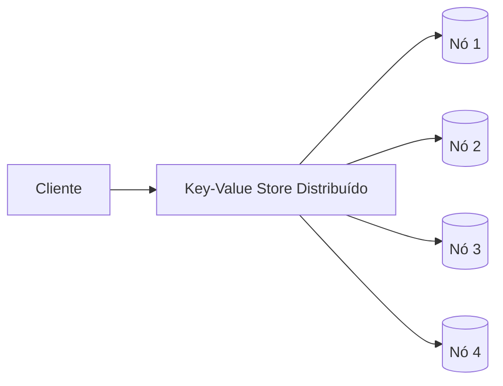

Ao projetar um sistema distribuído, precisamos considerar o teorema CAP.

---

# 5. Teorema CAP

O teorema CAP afirma que um sistema distribuído não consegue garantir simultaneamente os três atributos abaixo:

| Propriedade         | Significado                                                              |
| ------------------- | ------------------------------------------------------------------------ |
| Consistency         | Todos os clientes veem o mesmo dado ao mesmo tempo                       |
| Availability        | Toda requisição recebe resposta, mesmo em caso de falha parcial          |
| Partition Tolerance | O sistema continua funcionando mesmo com falhas de comunicação entre nós |

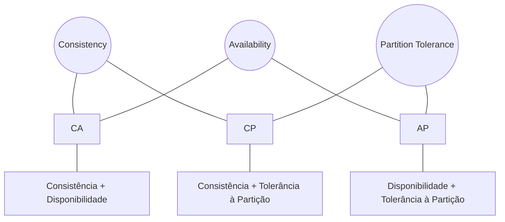

Em sistemas reais, **falhas de rede são inevitáveis**. Portanto, sistemas distribuídos precisam tolerar partições de rede.

Na prática, isso significa que normalmente escolhemos entre:

| Modelo | Prioridade                              | Sacrifício         |
| ------ | --------------------------------------- | ------------------ |
| CP     | Consistência + tolerância à partição    | Disponibilidade    |
| AP     | Disponibilidade + tolerância à partição | Consistência forte |

Sistemas key-value como Dynamo e Cassandra tendem a priorizar alta disponibilidade e consistência eventual.

---

## 5.1 Situação ideal

Em um cenário ideal, não há partição de rede. Os dados escritos em um nó são replicados normalmente para os demais.

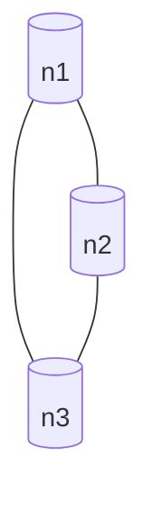

Se uma escrita acontece em `n1`, ela é propagada para `n2` e `n3`.

Resultado:

```text
Consistência: OK
Disponibilidade: OK
```

---

## 5.2 Situação real com falha

Em sistemas reais, uma partição pode impedir a comunicação entre os nós.

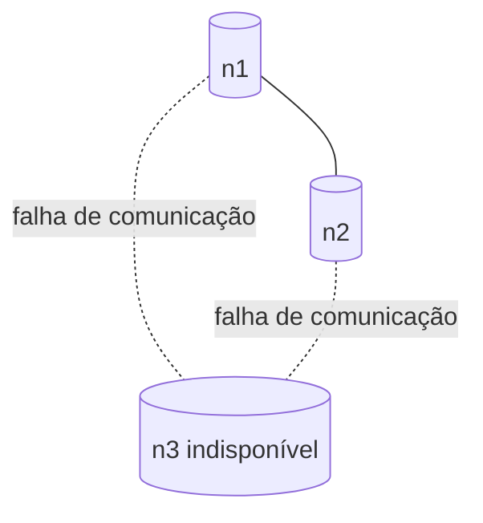

Nesse caso, precisamos escolher:

| Escolha                   | Consequência                                                       |
| ------------------------- | ------------------------------------------------------------------ |
| Priorizar consistência    | Bloqueia operações até restaurar comunicação                       |
| Priorizar disponibilidade | Continua aceitando operações, mesmo com risco de dados divergentes |

Exemplo:

```text
Se n3 recebe uma escrita, mas não consegue replicar para n1 e n2,
então n1 e n2 ficam temporariamente com dados antigos.
```

---

# 6. Componentes principais do sistema

O capítulo organiza o projeto do key-value store em torno dos seguintes temas:

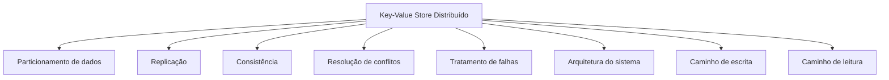

---

# 7. Particionamento de dados

Para armazenar grandes volumes, os dados precisam ser divididos entre múltiplos servidores.

Desafios:

| Desafio                        | Descrição                                                            |
| ------------------------------ | -------------------------------------------------------------------- |
| Distribuir dados uniformemente | Evitar que um servidor receba muito mais dados que outro             |
| Minimizar movimentação         | Ao adicionar ou remover servidores, mover o mínimo possível de dados |

A solução indicada é usar **consistent hashing**.

---

## 7.1 Consistent Hashing

Os servidores são posicionados em um anel lógico.

As chaves também são mapeadas para posições nesse anel.

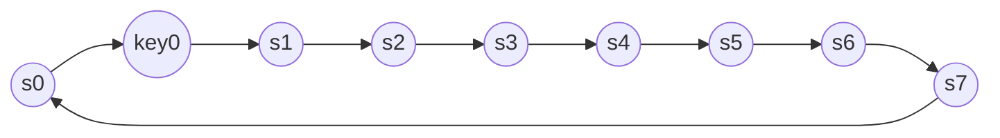

Regra:

```text
A chave é armazenada no primeiro servidor encontrado no sentido horário.
```

Exemplo:

```text
key0 -> s1
```

Vantagens:

| Vantagem             | Explicação                                                      |
| -------------------- | --------------------------------------------------------------- |
| Escala automática    | Servidores podem ser adicionados ou removidos com menor impacto |
| Heterogeneidade      | Servidores mais fortes podem receber mais nós virtuais          |
| Menos redistribuição | Não é necessário redistribuir todos os dados                    |

---

# 8. Replicação de dados

Para aumentar disponibilidade e confiabilidade, os dados são replicados em múltiplos nós.

O sistema usa um parâmetro:

```text
N = número de réplicas
```

Se `N = 3`, cada chave é armazenada em três nós.

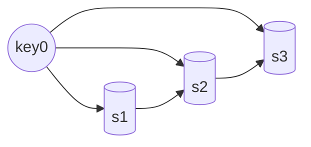

No anel de hash consistente:

```text
key0 é armazenada nos primeiros N servidores encontrados no sentido horário.
```

Exemplo:

```text
key0 -> s1, s2, s3
```

Com nós virtuais, é preciso garantir que as réplicas fiquem em **servidores físicos diferentes**.

Também é recomendado distribuir réplicas entre **data centers diferentes**, para resistir a falhas de região.

---

# 9. Consistência com Quorum

Como os dados são replicados, é necessário definir quantos nós precisam confirmar leitura e escrita.

Parâmetros:

| Parâmetro | Significado                                |
| --------- | ------------------------------------------ |
| N         | Número total de réplicas                   |
| W         | Número mínimo de confirmações para escrita |
| R         | Número mínimo de respostas para leitura    |

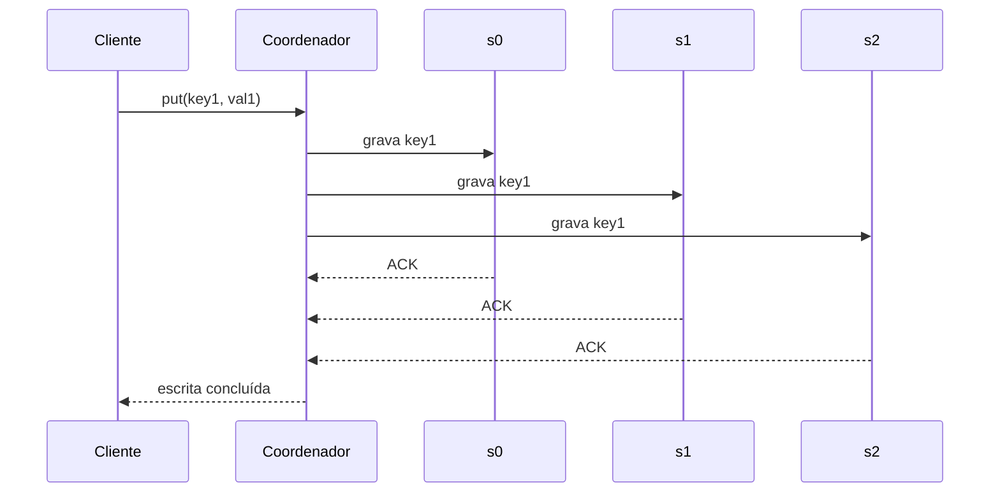

Importante:

```text
W = 1 não significa que existe apenas uma cópia.
Significa apenas que o coordenador precisa receber 1 confirmação para considerar a escrita bem-sucedida.
```

---

## 9.1 Configurações comuns

| Configuração  | Efeito                         |
| ------------- | ------------------------------ |
| R = 1 e W = N | Leitura rápida                 |
| W = 1 e R = N | Escrita rápida                 |
| W + R > N     | Garante consistência forte     |
| W + R <= N    | Não garante consistência forte |

Exemplo comum:

```text
N = 3
W = 2
R = 2
```

Nesse caso:

```text
W + R = 4
N = 3
4 > 3
```

Logo, existe sobreposição entre os nós usados na escrita e na leitura, aumentando a chance de ler o dado mais recente.

---

# 10. Modelos de consistência

| Modelo                | Descrição                                                        |
| --------------------- | ---------------------------------------------------------------- |
| Consistência forte    | Toda leitura retorna o dado mais recente                         |
| Consistência fraca    | Leituras posteriores podem retornar dados antigos                |
| Consistência eventual | Após algum tempo, todas as réplicas convergem para o mesmo valor |

A consistência forte normalmente exige bloquear novas leituras ou escritas até que todas as réplicas estejam sincronizadas.

Isso reduz disponibilidade.

Por isso, muitos sistemas distribuídos adotam **consistência eventual**.

---

# 11. Resolução de inconsistências com versionamento

Quando há replicação, duas réplicas podem receber escritas diferentes ao mesmo tempo.

Exemplo:

```text
Valor original:
name = john

Servidor 1 altera:
name = johnSanFrancisco

Servidor 2 altera:
name = johnNewYork
```

Diagrama:

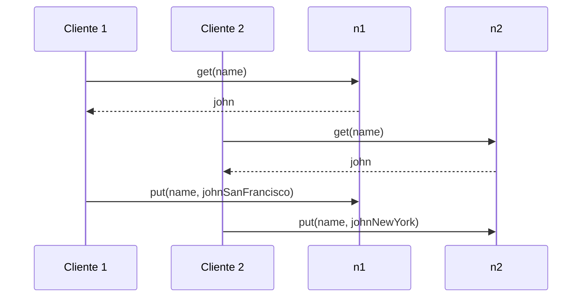

Resultado:

```text
Conflito entre versões:
v1 = johnSanFrancisco
v2 = johnNewYork
```

Como não existe uma ordem clara entre as duas alterações, o sistema precisa detectar e reconciliar o conflito.

---

# 12. Vector Clock

Um **vector clock** é uma estrutura usada para rastrear versões de dados em sistemas distribuídos.

Formato conceitual:

```text
D([S1, v1], [S2, v2], ..., [Sn, vn])
```

Onde:

| Elemento | Significado                      |
| -------- | -------------------------------- |
| D        | Item de dado                     |
| S        | Servidor responsável pela versão |
| v        | Contador de versão               |

Exemplo:

```text
D1([Sx, 1])
D2([Sx, 2])
D3([Sx, 2], [Sy, 1])
D4([Sx, 2], [Sz, 1])
D5([Sx, 3], [Sy, 1], [Sz, 1])
```

Fluxo:

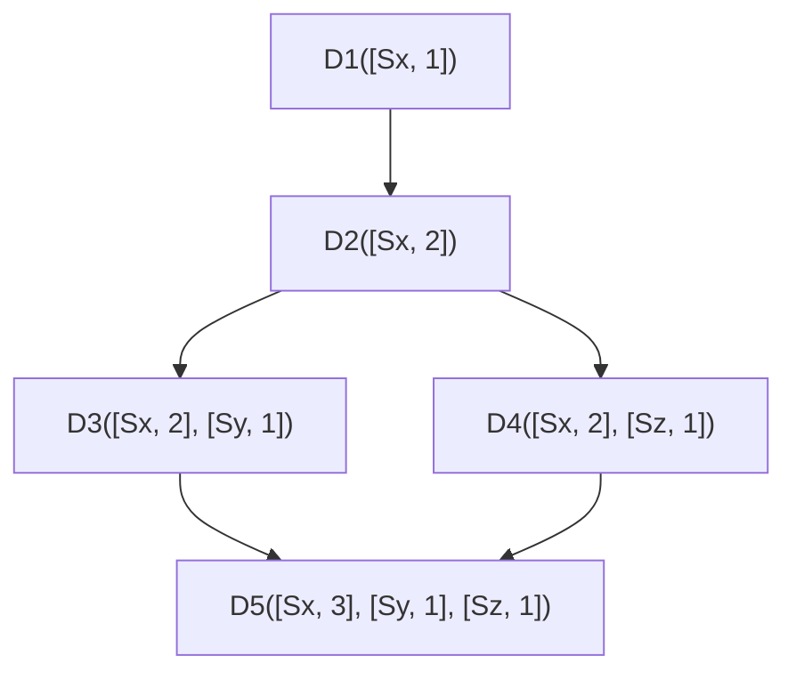

Interpretação:

| Situação                          | Significado                       |
| --------------------------------- | --------------------------------- |
| X é ancestral de Y                | Não há conflito                   |
| X e Y possuem versões divergentes | Existe conflito                   |
| Cliente resolve conflito          | Nova versão consolidada é gravada |

O vector clock permite saber se uma versão veio antes da outra ou se duas versões foram criadas em paralelo.

---

## 12.1 Limitações do Vector Clock

| Problema                 | Explicação                                                   |
| ------------------------ | ------------------------------------------------------------ |
| Complexidade no cliente  | O cliente pode precisar participar da resolução de conflitos |
| Crescimento da estrutura | A lista `[servidor, versão]` pode crescer muito              |
| Reconciliação imperfeita | Ao remover versões antigas, pode-se perder precisão          |

Na prática, sistemas como Dynamo consideram esse custo aceitável.

---

# 13. Tratamento de falhas

Em sistemas distribuídos, falhas são inevitáveis.

É preciso lidar com:

```text
1. Detecção de falhas
2. Falhas temporárias
3. Falhas permanentes
4. Falhas de data center
```

---

# 14. Detecção de falhas

Não é suficiente um único nó afirmar que outro caiu.

Normalmente são necessárias múltiplas confirmações independentes.

Uma abordagem ingênua seria todos os nós monitorarem todos os outros.

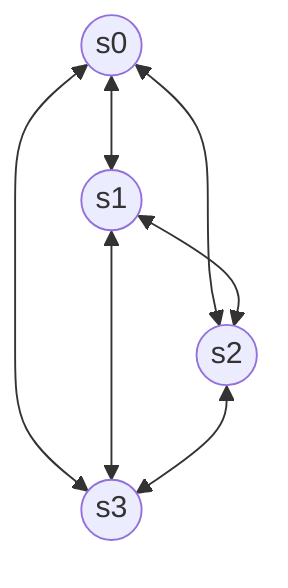

Essa abordagem é cara.

Solução melhor: **Gossip Protocol**.

---

# 15. Gossip Protocol

No gossip protocol, cada nó mantém uma lista de membros e periodicamente troca informações com alguns nós aleatórios.

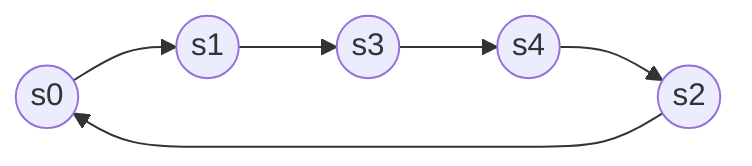

Cada nó mantém algo como:

| Member ID | Heartbeat |
| --------: | --------: |
|         0 |     10232 |
|         1 |     10224 |
|         2 |      9986 |
|         3 |     10237 |
|         4 |     10234 |

Funcionamento:

```text
1. Cada nó mantém uma lista de membros.
2. Cada nó incrementa seu contador de heartbeat.
3. Periodicamente envia heartbeats para alguns nós aleatórios.
4. Os nós propagam essas informações.
5. Se um heartbeat não aumenta por muito tempo, o nó é considerado indisponível.
```

---

# 16. Falhas temporárias — Hinted Handoff

Em uma falha temporária, um nó responsável por uma réplica pode estar indisponível.

Em vez de bloquear a operação, outro nó assume temporariamente a escrita.

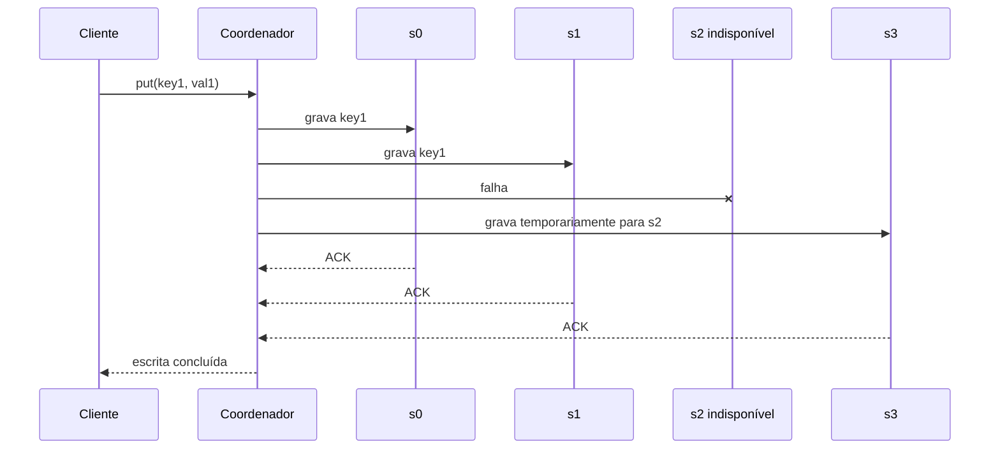

Quando `s2` voltar, `s3` entrega os dados pendentes para `s2`.

Esse mecanismo melhora a disponibilidade.

---

# 17. Falhas permanentes — Merkle Tree

Se uma réplica fica indisponível por muito tempo, é necessário sincronizar os dados quando ela voltar.

Para isso, usa-se uma **Merkle Tree**.

Uma Merkle Tree é uma árvore de hashes.

Ela permite comparar grandes conjuntos de dados sem transferir tudo.

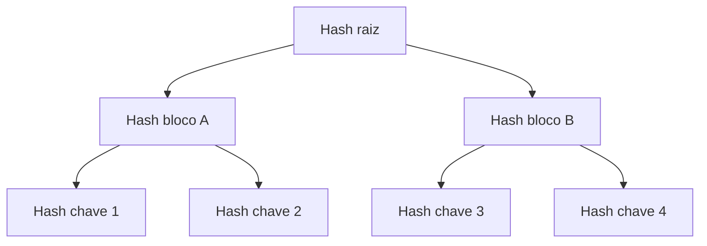

Comparação entre réplicas:

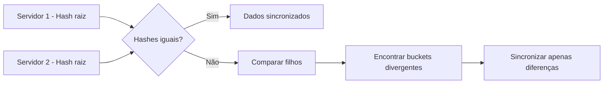

Processo:

```text
1. Divide o espaço de chaves em buckets.
2. Calcula hash de cada chave dentro do bucket.
3. Calcula hash de cada bucket.
4. Constrói a árvore até o hash raiz.
5. Compara as árvores entre réplicas.
6. Sincroniza apenas os buckets diferentes.
```

Vantagem:

```text
A quantidade de dados sincronizada é proporcional à diferença entre réplicas,
não ao volume total armazenado.
```

---

# 18. Falha de data center

Um data center pode ficar indisponível por:

```text
1. Falha de energia
2. Falha de rede
3. Desastre natural
4. Problema operacional
```

Para suportar isso, as réplicas devem ser distribuídas entre múltiplos data centers.

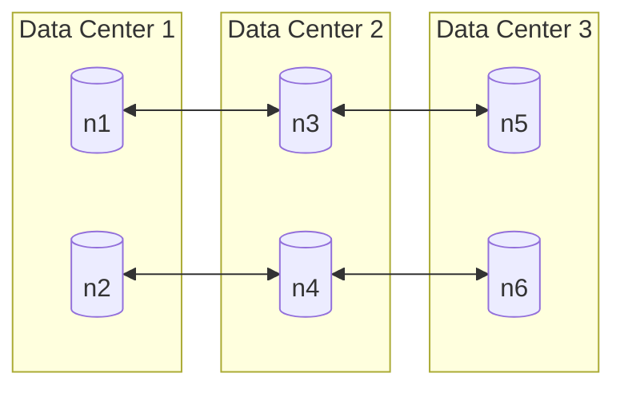

Mesmo se um data center inteiro cair, os usuários ainda podem acessar os dados por outro data center.

---

# 19. Arquitetura do sistema

A arquitetura final usa um anel de hash consistente.

Qualquer nó pode atuar como coordenador da requisição.

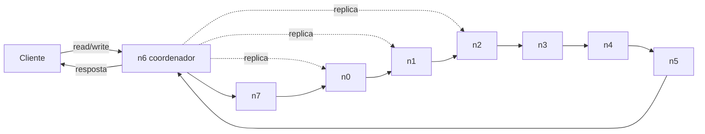

Características principais:

| Característica          | Descrição                                            |
| ----------------------- | ---------------------------------------------------- |
| API simples             | Cliente usa `get(key)` e `put(key, value)`           |
| Coordenador             | Um nó atua como proxy entre cliente e sistema        |
| Hash consistente        | Nós são organizados em um anel                       |
| Sistema descentralizado | Não há ponto único de falha                          |
| Replicação              | Dados são replicados em múltiplos nós                |
| Escala automática       | Nós podem ser adicionados ou removidos dinamicamente |

---

# 20. Responsabilidades de cada nó

Como o sistema é descentralizado, cada nó executa múltiplas funções.

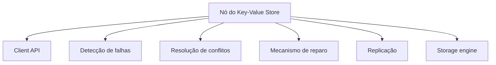

Cada nó pode:

```text
1. Receber requisições de clientes
2. Atuar como coordenador
3. Participar da replicação
4. Detectar falhas
5. Resolver conflitos
6. Reparar inconsistências
7. Armazenar dados localmente
```

---

# 21. Caminho de escrita

O caminho de escrita descreve o que acontece quando o cliente grava um valor.

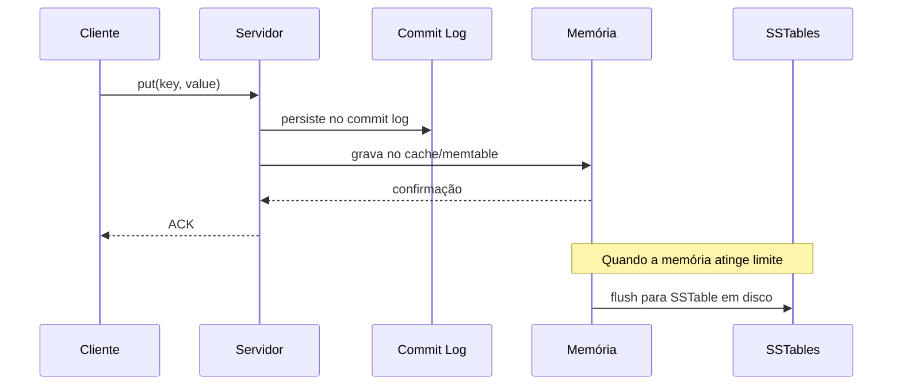

Fluxo:

```text
1. A escrita é persistida no commit log.
2. O dado é salvo em memória.
3. Quando a memória enche ou atinge um limite, os dados são gravados em SSTables no disco.
```

O commit log garante durabilidade.

A memória garante baixa latência.

A SSTable permite armazenamento eficiente em disco.

---

# 22. Caminho de leitura

Primeiro, o sistema verifica se o dado está em memória.

```mermaid
sequenceDiagram
    participant C as Cliente
    participant S as Servidor
    participant Mem as Memória
    participant Disk as Disco/SSTables

    C->>S: get(key)
    S->>Mem: procura em memória

    alt encontrado em memória
        Mem-->>S: valor
        S-->>C: retorna valor
    else não encontrado
        S->>Disk: procura em SSTables
        Disk-->>S: valor
        S-->>C: retorna valor
    end
```

Quando o dado não está em memória, é necessário buscar no disco.

Para evitar leituras desnecessárias em SSTables que não contêm a chave, usa-se um **Bloom Filter**.

```mermaid
flowchart TD
    A[Cliente faz get key] --> B[Servidor verifica memória]
    B -->|Encontrou| C[Retorna valor]
    B -->|Não encontrou| D[Consulta Bloom Filter]

    D -->|Chave provavelmente existe| E[Busca em SSTables]
    D -->|Chave não existe| F[Retorna não encontrado]

    E --> G[Retorna valor]
```

O Bloom Filter responde rapidamente se uma chave **não existe** em determinado conjunto, evitando acesso desnecessário ao disco.

---

# 23. Resumo da arquitetura

```mermaid
flowchart TD
    Client[Cliente]

    subgraph Ring[Cluster Key-Value Distribuído]
        N1[n1]
        N2[n2]
        N3[n3]
        N4[n4]
        N5[n5]
    end

    Client -->|get/put| N1

    N1 -->|replica| N2
    N1 -->|replica| N3

    N1 --> Storage1[(Storage local)]
    N2 --> Storage2[(Storage local)]
    N3 --> Storage3[(Storage local)]

    N1 --> Gossip[Gossip Protocol]
    N2 --> Gossip
    N3 --> Gossip
    N4 --> Gossip
    N5 --> Gossip

    N1 --> Repair[Merkle Tree / Anti-entropy]
    N2 --> Repair
    N3 --> Repair
```

---

# 24. Principais decisões de design

| Decisão                      | Técnica usada                   |
| ---------------------------- | ------------------------------- |
| Distribuir dados             | Consistent Hashing              |
| Evitar hotspot               | Nós virtuais                    |
| Alta disponibilidade         | Replicação                      |
| Consistência configurável    | Quorum com N, W e R             |
| Resolver conflitos           | Versionamento e Vector Clock    |
| Detectar falhas              | Gossip Protocol                 |
| Lidar com falhas temporárias | Hinted Handoff                  |
| Reparar inconsistências      | Merkle Tree e Anti-entropy      |
| Tolerar falha regional       | Replicação multi data center    |
| Escrita eficiente            | Commit Log + Memtable + SSTable |
| Leitura eficiente            | Cache + Bloom Filter + SSTable  |

---

# 25. Conclusão

Um key-value store distribuído precisa equilibrar:

```text
consistência
disponibilidade
latência
escalabilidade
durabilidade
tolerância a falhas
```

A arquitetura apresentada combina várias técnicas clássicas de sistemas distribuídos:

```text
consistent hashing
replicação
quorum
consistência eventual
vector clocks
gossip protocol
hinted handoff
Merkle tree
SSTables
Bloom filters
```

O resultado é um sistema descentralizado, escalável, tolerante a falhas e adequado para armazenar grandes volumes de dados com baixa latência.
