# Capítulo 07 — Design de um Gerador de IDs Únicos em Sistemas Distribuídos

## 1. Objetivo do capítulo

O objetivo é projetar um **gerador de IDs únicos** para um ambiente distribuído.

Em um banco de dados único, normalmente seria possível usar uma coluna com `auto_increment`. Porém, em sistemas distribuídos, essa abordagem deixa de ser suficiente, pois múltiplos bancos, servidores e datacenters podem gerar IDs ao mesmo tempo.

O desafio é criar IDs que sejam:

| Requisito               | Descrição                                                           |
| ----------------------- | ------------------------------------------------------------------- |
| Únicos                  | Nenhum ID pode se repetir.                                          |
| Numéricos               | O ID deve conter apenas números.                                    |
| Compatíveis com 64 bits | O ID precisa caber em um inteiro de 64 bits.                        |
| Ordenáveis por tempo    | IDs gerados mais tarde devem ser maiores que IDs gerados mais cedo. |
| Altamente escaláveis    | O sistema deve gerar mais de 10.000 IDs por segundo.                |

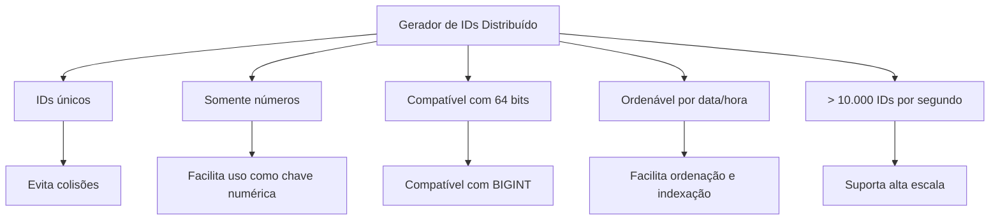

---

## 2. Por que `auto_increment` não resolve?

O `auto_increment` funciona bem quando existe **um único banco centralizado** gerando os IDs.

Exemplo:

```text
1, 2, 3, 4, 5, ...
```

O problema surge quando o sistema passa a ter vários bancos ou servidores gerando IDs ao mesmo tempo. Se cada banco gerar IDs de forma independente, podem ocorrer colisões.

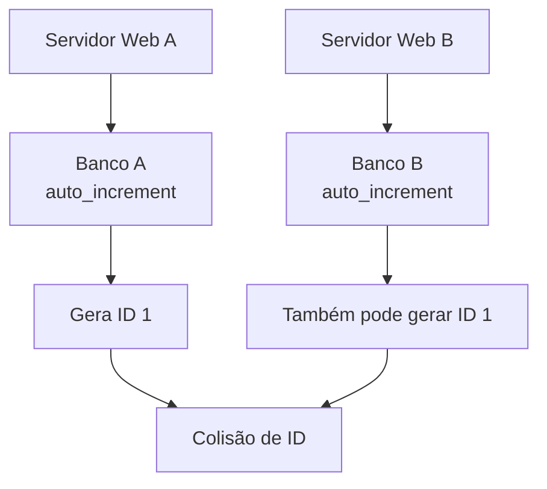

---

## 3. Abordagens avaliadas

O capítulo apresenta quatro opções principais:

1. Replicação multi-master.
2. UUID.
3. Ticket Server.
4. Abordagem Snowflake.

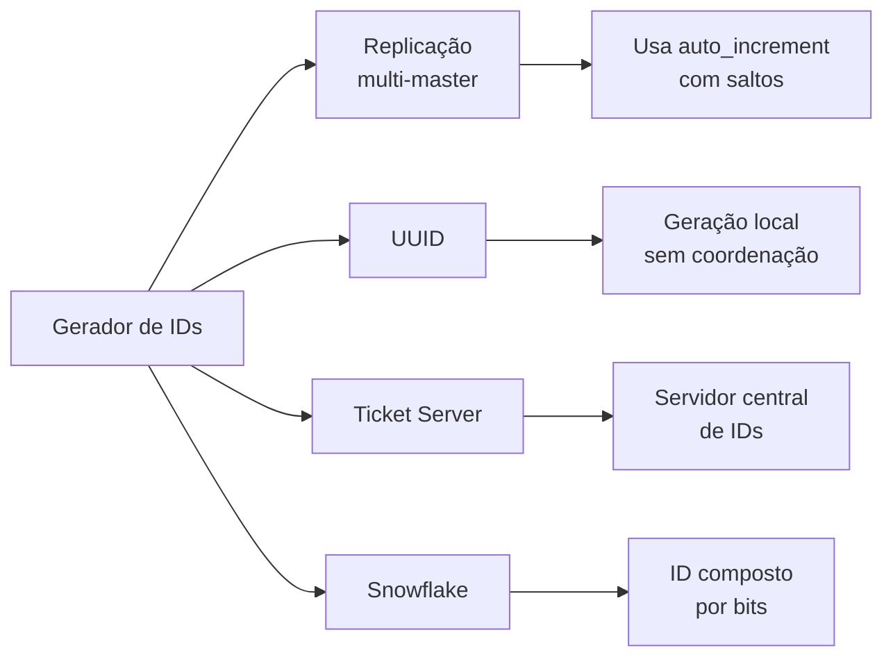

---

# 4. Opção 1 — Replicação multi-master

## 4.1 Ideia

Na replicação multi-master, vários bancos podem gerar IDs usando `auto_increment`, mas com incrementos diferentes.

Exemplo com dois bancos:

| Banco   | IDs gerados   |
| ------- | ------------- |
| Banco A | 1, 3, 5, 7... |
| Banco B | 2, 4, 6, 8... |

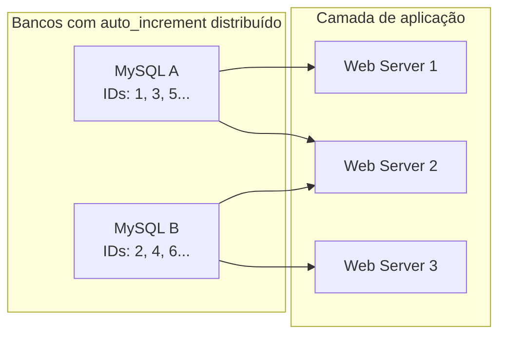

## 4.2 Vantagens

| Vantagem                | Explicação                                  |
| ----------------------- | ------------------------------------------- |
| Simples de entender     | Continua usando `auto_increment`.           |
| Resolve parte da escala | Cada banco gera uma faixa diferente de IDs. |

## 4.3 Problemas

| Problema                                  | Impacto                                                                   |
| ----------------------------------------- | ------------------------------------------------------------------------- |
| Difícil escalar entre datacenters         | A coordenação entre bancos fica complexa.                                 |
| IDs não crescem globalmente por tempo     | Bancos diferentes podem gerar IDs fora da ordem temporal esperada.        |
| Adicionar ou remover servidores é difícil | Mudar a quantidade de bancos exige recalcular a estratégia de incremento. |

Essa solução melhora o `auto_increment`, mas ainda é frágil para ambientes distribuídos maiores.

---

# 5. Opção 2 — UUID

## 5.1 Ideia

UUID é uma forma simples de gerar identificadores únicos sem coordenação central.

Cada servidor pode gerar seus próprios IDs localmente.

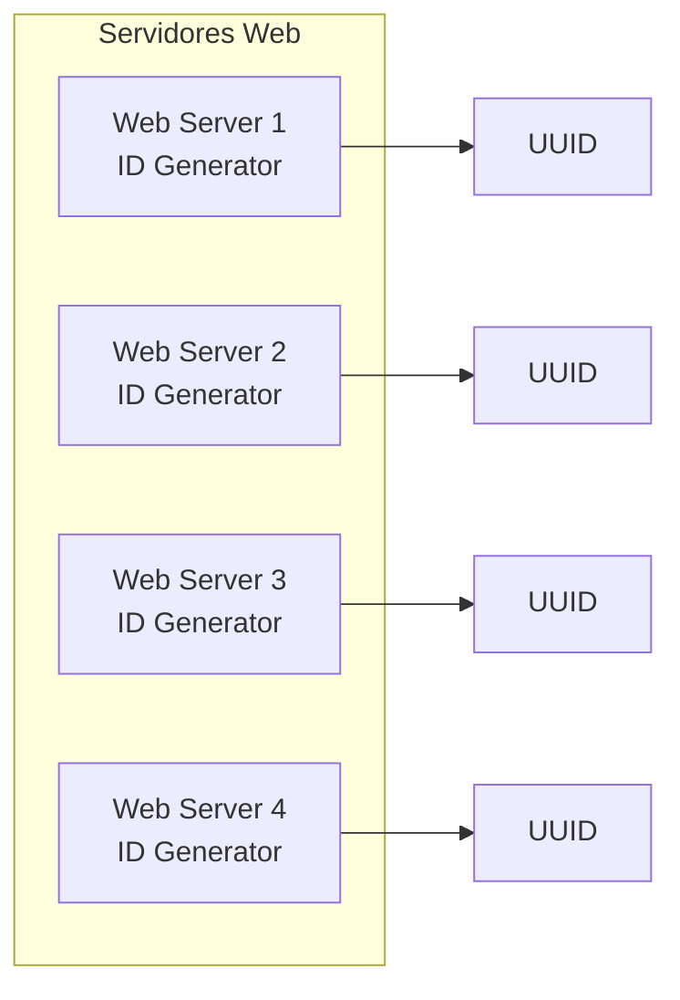

## 5.2 Vantagens

| Vantagem              | Explicação                                         |
| --------------------- | -------------------------------------------------- |
| Fácil de gerar        | Cada servidor gera o próprio ID.                   |
| Não exige coordenação | Não depende de servidor central.                   |
| Escala bem            | Novos servidores podem ser adicionados facilmente. |

## 5.3 Problemas

| Problema                         | Impacto                                             |
| -------------------------------- | --------------------------------------------------- |
| UUID tradicional tem 128 bits    | O requisito do capítulo exige 64 bits.              |
| Pode não ser numérico            | Normalmente é representado como string hexadecimal. |
| Nem sempre é ordenável por tempo | UUIDs aleatórios não preservam ordem temporal.      |

Portanto, UUID é simples e escalável, mas não atende completamente aos requisitos do problema.

> Atualização importante: o capítulo critica UUID principalmente pensando em UUIDs tradicionais, como UUID v4. Hoje existe UUIDv7, padronizado pela RFC 9562, que possui campo temporal baseado em Unix Epoch em milissegundos e melhora a ordenação por tempo. Ainda assim, UUIDv7 continua sendo um identificador de 128 bits, então não atende ao requisito estrito de caber em 64 bits. ([RFC Editor][1])

---

# 6. Opção 3 — Ticket Server

## 6.1 Ideia

A abordagem Ticket Server centraliza a geração de IDs em um único serviço ou banco.

Todos os servidores web solicitam um novo ID ao Ticket Server.

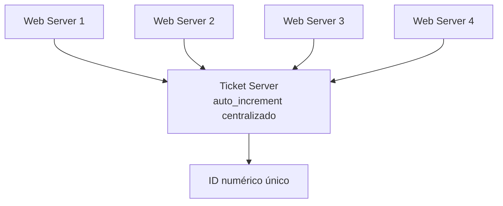

## 6.2 Vantagens

| Vantagem                        | Explicação                                      |
| ------------------------------- | ----------------------------------------------- |
| IDs numéricos                   | Atende ao requisito de IDs numéricos.           |
| Fácil de implementar            | Pode usar `auto_increment` em um banco central. |
| Bom para pequena e média escala | Simples para sistemas menos críticos.           |

## 6.3 Problemas

| Problema                               | Impacto                                                       |
| -------------------------------------- | ------------------------------------------------------------- |
| Ponto único de falha                   | Se o Ticket Server cair, o sistema para de gerar IDs.         |
| Gargalo central                        | Todo servidor precisa consultar o mesmo ponto.                |
| Alta disponibilidade fica mais difícil | Usar múltiplos Ticket Servers exige sincronização entre eles. |

O Ticket Server é simples, mas cria dependência central, o que é arriscado para sistemas críticos.

---

# 7. Opção 4 — Snowflake

## 7.1 Ideia geral

A abordagem Snowflake divide um ID de 64 bits em várias partes.

Em vez de depender de um banco central, cada máquina consegue gerar IDs localmente, combinando:

1. Timestamp.
2. ID do datacenter.
3. ID da máquina.
4. Número sequencial.

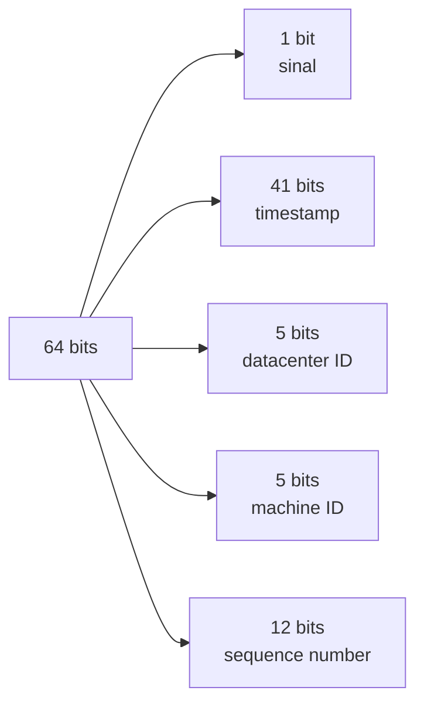

Layout conceitual:

```text
| 1 bit | 41 bits timestamp | 5 bits datacenter | 5 bits máquina | 12 bits sequência |
```

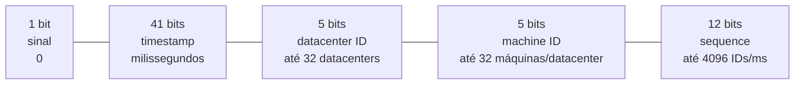

---

## 7.2 Estrutura dos bits

| Campo           | Tamanho | Função                                                           |
| --------------- | ------: | ---------------------------------------------------------------- |
| Sinal           |   1 bit | Mantido como `0`, reservado para uso futuro.                     |
| Timestamp       | 41 bits | Representa o tempo em milissegundos desde um epoch customizado.  |
| Datacenter ID   |  5 bits | Identifica o datacenter.                                         |
| Machine ID      |  5 bits | Identifica a máquina dentro do datacenter.                       |
| Sequence Number | 12 bits | Diferencia IDs gerados no mesmo milissegundo pela mesma máquina. |

---

## 7.3 Capacidade

### Timestamp — 41 bits

Com 41 bits, é possível representar:

```text
2^41 - 1 = 2.199.023.255.551 milissegundos
```

Isso equivale a aproximadamente **69 anos**.

Ou seja, usando um epoch customizado próximo da data atual, o sistema pode operar por décadas antes de precisar migrar a estratégia.

### Datacenter ID — 5 bits

```text
2^5 = 32 datacenters
```

### Machine ID — 5 bits

```text
2^5 = 32 máquinas por datacenter
```

### Sequence Number — 12 bits

```text
2^12 = 4096 IDs por milissegundo por máquina
```

Em teoria, cada máquina pode gerar:

```text
4096 IDs/ms = 4.096.000 IDs/s
```

Como há até:

```text
32 datacenters * 32 máquinas = 1024 geradores
```

A capacidade teórica é muito maior que o requisito de **10.000 IDs por segundo**.

---

# 8. Como o Snowflake gera um ID

## 8.1 Fórmula conceitual

```text
timestampDelta = timestampAtual - customEpoch

id = (timestampDelta << 22)
   | (datacenterId << 17)
   | (machineId << 12)
   | sequence
```

## 8.2 Organização dos deslocamentos

| Campo         | Bits ocupados | Deslocamento |
| ------------- | ------------: | -----------: |
| Sequence      |       12 bits |            0 |
| Machine ID    |        5 bits |           12 |
| Datacenter ID |        5 bits |           17 |
| Timestamp     |       41 bits |           22 |

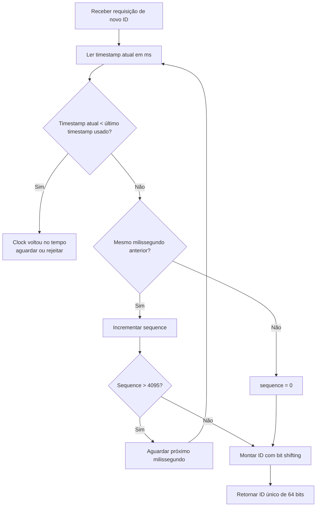

---

# 9. Por que os IDs são ordenáveis por tempo?

O timestamp ocupa a parte mais significativa do ID.

Isso significa que, conforme o tempo avança, os bits mais importantes aumentam. Assim, IDs gerados mais tarde tendem a ser maiores que IDs gerados antes.

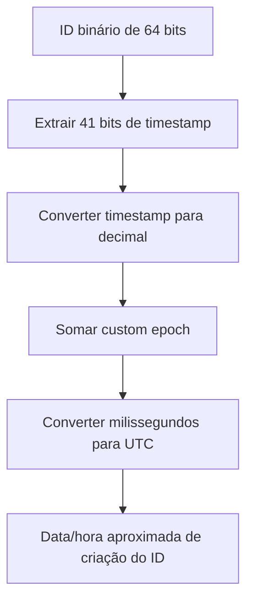

Exemplo conceitual:

```text
ID gerado de manhã  <  ID gerado à tarde  <  ID gerado à noite
```

Essa ordenação é importante para bancos de dados, logs, eventos e consultas por tempo.

---

# 10. Cuidados importantes no Snowflake

## 10.1 Sincronização de relógio

O Snowflake depende do relógio da máquina.

Se o relógio voltar no tempo, pode ocorrer risco de colisão.

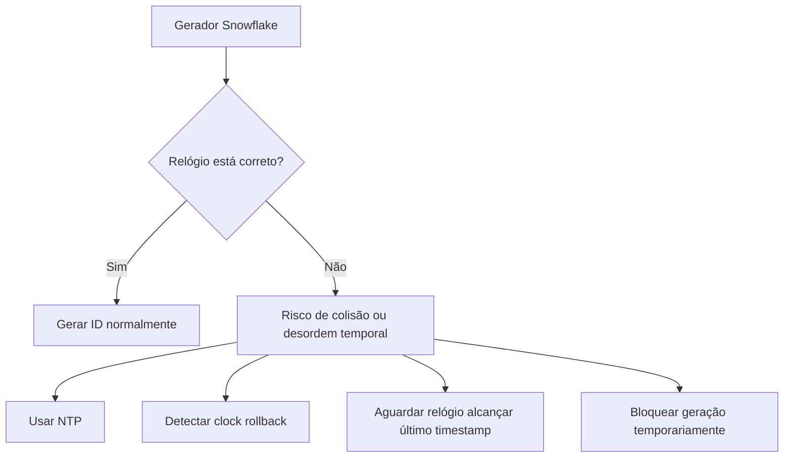

## 10.2 Configuração de datacenter e máquina

Os valores de `datacenterId` e `machineId` precisam ser definidos com cuidado.

Dois geradores diferentes **não podem usar a mesma combinação** de:

```text
datacenterId + machineId
```

Caso contrário, se gerarem IDs no mesmo milissegundo com a mesma sequência, pode haver colisão.

## 10.3 Estouro da sequência

Se uma máquina gerar mais de 4096 IDs no mesmo milissegundo, a sequência estoura.

Nesse caso, a solução comum é aguardar o próximo milissegundo.

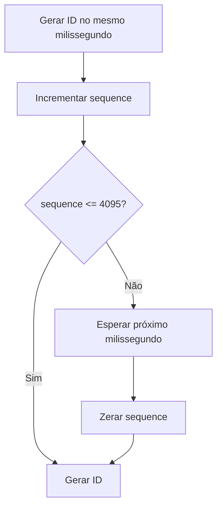

---

# 11. Comparação das soluções

| Solução          | Único            | Numérico   | 64 bits | Ordenável por tempo | Escala bem | Principal problema                       |
| ---------------- | ---------------- | ---------- | ------- | ------------------- | ---------- | ---------------------------------------- |
| Multi-master     | Sim, com cuidado | Sim        | Sim     | Não garantido       | Parcial    | Difícil adicionar/remover bancos         |
| UUID tradicional | Sim              | Nem sempre | Não     | Não garantido       | Sim        | 128 bits e pode ser string               |
| Ticket Server    | Sim              | Sim        | Sim     | Sim                 | Limitado   | Ponto único de falha                     |
| Snowflake        | Sim              | Sim        | Sim     | Sim                 | Sim        | Exige cuidado com relógio e configuração |

---

# 12. Decisão de arquitetura

A melhor escolha para os requisitos do capítulo é a abordagem **Snowflake**.

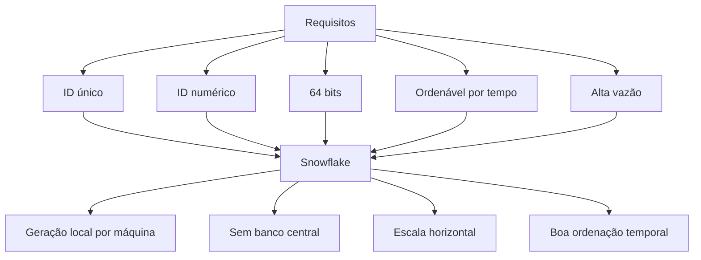

## Justificativa

Snowflake atende aos requisitos porque:

| Requisito          | Como Snowflake atende                                      |
| ------------------ | ---------------------------------------------------------- |
| Unicidade          | Combina tempo, datacenter, máquina e sequência.            |
| Numérico           | O resultado é um número inteiro.                           |
| 64 bits            | O layout foi desenhado para caber em 64 bits.              |
| Ordenação temporal | O timestamp fica nos bits mais significativos.             |
| Alta escala        | Cada máquina gera IDs localmente, sem coordenação central. |

---

# 13. Resumo final

Neste capítulo, foram avaliadas várias formas de gerar IDs únicos em sistemas distribuídos.

A replicação multi-master melhora o `auto_increment`, mas é difícil de escalar e manter. UUID é simples e escalável, mas não atende ao requisito de 64 bits numéricos. Ticket Server é fácil de implementar, mas cria ponto único de falha.

A abordagem Snowflake é a mais adequada para o cenário proposto, pois gera IDs únicos, numéricos, ordenáveis por tempo, compatíveis com 64 bits e com alta capacidade de geração em ambientes distribuídos.

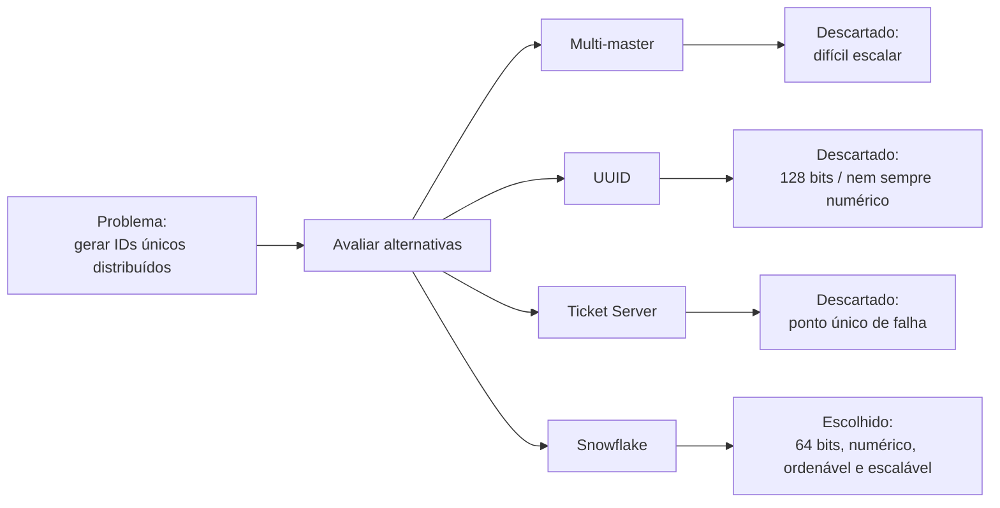

---

[1]: https://www.rfc-editor.org/rfc/rfc9562?utm_source=chatgpt.com "RFC 9562: Universally Unique IDentifiers (UUIDs)"
