# Capítulo 08 - Design de um Encurtador de URLs

> Objetivo: projetar um serviço de encurtamento de URLs, semelhante ao TinyURL, capaz de receber uma URL longa, gerar uma URL curta e redirecionar usuários para a URL original com alta disponibilidade, escalabilidade e tolerância a falhas.

---

## 1. Ideia central

Um encurtador de URLs cria um alias curto para uma URL longa.

Exemplo:

```text
URL longa:
https://www.systeminterview.com/q=chatsystem&c=loggedin&v=v3&l=long

URL curta:
https://tinyurl.com/y7keocwj
```

Quando o usuário acessa a URL curta, o serviço localiza a URL longa correspondente e retorna um redirecionamento HTTP para o destino original.

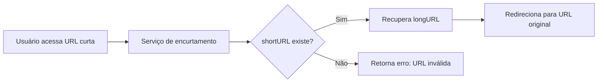

---

## 2. Escopo do problema

O problema é aberto, como ocorre em entrevistas de system design. Por isso, antes de desenhar a arquitetura, é necessário definir premissas.

### Requisitos funcionais

| Requisito | Descrição |
|---|---|
| Encurtar URL | Dada uma URL longa, retornar uma URL curta. |
| Redirecionar URL | Dada uma URL curta, redirecionar para a URL longa original. |
| Manter mapeamento | Persistir a relação entre `shortURL` e `longURL`. |

### Requisitos não funcionais

| Requisito | Descrição |
|---|---|
| Alta disponibilidade | O serviço deve continuar funcionando mesmo com falhas parciais. |
| Escalabilidade | Deve suportar grande volume de leituras e escritas. |
| Tolerância a falhas | Falhas em servidores ou banco não devem derrubar todo o sistema. |
| Baixa latência | O redirecionamento deve ser rápido, pois ocorre no caminho crítico do usuário. |

### Restrições assumidas no capítulo

| Item | Premissa |
|---|---|
| Volume de escrita | 100 milhões de URLs novas por dia. |
| Relação leitura/escrita | 10 leituras para cada escrita. |
| Tempo de retenção | 10 anos. |
| Tamanho médio da URL longa | 100 bytes. |
| Atualização/remoção | Para simplificar, URLs curtas não serão atualizadas nem removidas. |
| Caracteres permitidos | `0-9`, `a-z`, `A-Z`, totalizando 62 caracteres. |

---

## 3. Estimativas de capacidade

### Escritas por segundo

```text
100.000.000 URLs / 24 horas / 3.600 segundos ≈ 1.160 escritas por segundo
```

### Leituras por segundo

Como a relação leitura/escrita é 10:1:

```text
1.160 * 10 ≈ 11.600 leituras por segundo
```

### Total de registros em 10 anos

```text
100.000.000 URLs/dia * 365 dias * 10 anos = 365 bilhões de registros
```

### Estimativa de armazenamento

O capítulo apresenta uma estimativa de 365 TB para armazenamento ao longo de 10 anos. Como observação matemática, considerando apenas o campo da URL longa com 100 bytes, o cálculo direto seria:

```text
365 bilhões * 100 bytes = 36,5 TB
```

Na prática, o armazenamento real tende a ser maior por causa de índices, chaves, metadados, replicação, logs, overhead do banco e cache. Portanto, a estimativa do capítulo deve ser entendida como uma aproximação conservadora de capacidade, não como o tamanho exato do campo `longURL`.

---

## 4. APIs principais

O capítulo propõe duas APIs principais: uma para encurtar URLs e outra para redirecionar.

### 4.1 Criar URL curta

```http
POST /api/v1/data/shorten
```

Corpo da requisição:

```json
{
  "longUrl": "https://www.example.com/minha/url/muito/grande"
}
```

Resposta esperada:

```json
{
  "shortUrl": "https://tinyurl.com/abc123x"
}
```

### 4.2 Redirecionar URL curta

```http
GET /api/v1/{shortUrl}
```

Comportamento esperado:

1. O cliente acessa a URL curta.
2. O servidor encontra a URL longa correspondente.
3. O servidor retorna um redirect HTTP.
4. O navegador acessa a URL longa original.

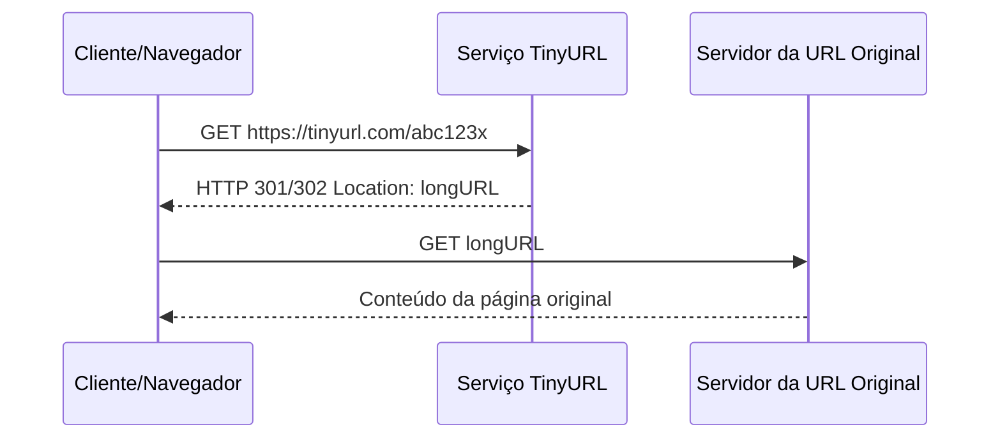

---

## 5. Redirecionamento: 301 vs 302

O redirecionamento é uma decisão importante porque afeta cache, desempenho e analytics.

| Código HTTP | Significado | Vantagem | Desvantagem |
|---|---|---|---|
| 301 | Redirecionamento permanente | O navegador pode cachear a resposta, reduzindo carga no serviço. | O serviço pode deixar de receber acessos futuros, prejudicando métricas e analytics. |
| 302 | Redirecionamento temporário | Cada clique tende a passar novamente pelo serviço, facilitando analytics. | Gera mais carga nos servidores do encurtador. |

### Decisão prática

- Use `301` quando a prioridade for reduzir carga no servidor e a URL curta for considerada permanente.
- Use `302` quando a prioridade for rastrear cliques, origem do tráfego, campanhas e estatísticas.

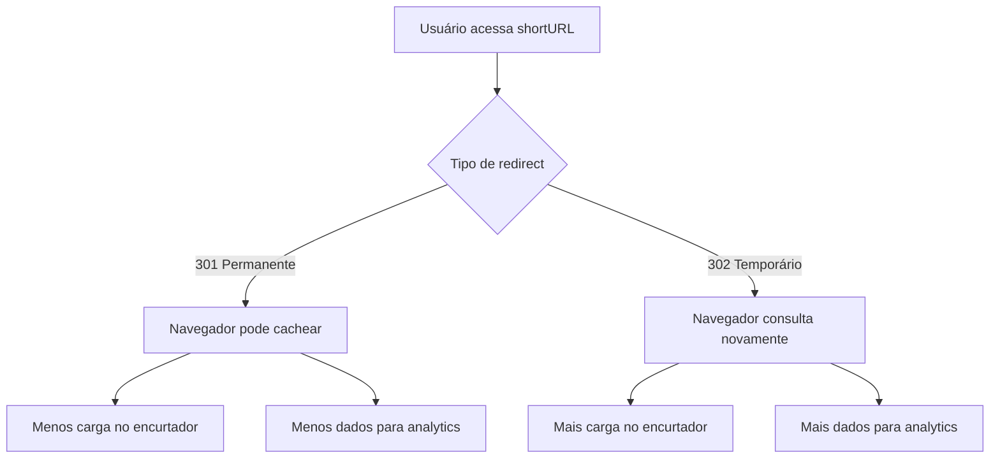

---

## 6. Design de alto nível

A solução pode ser dividida em dois fluxos principais:

1. Fluxo de criação da URL curta.
2. Fluxo de redirecionamento da URL curta.

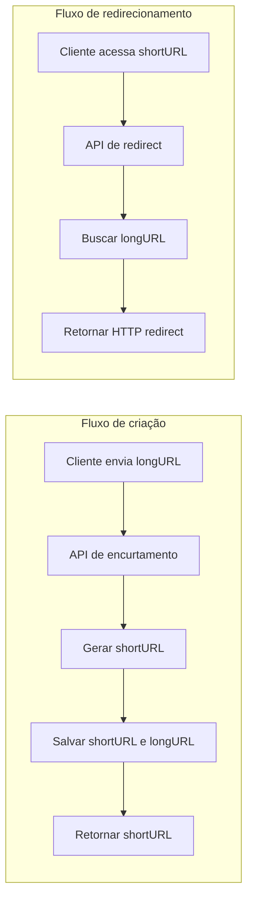

Arquitetura geral:

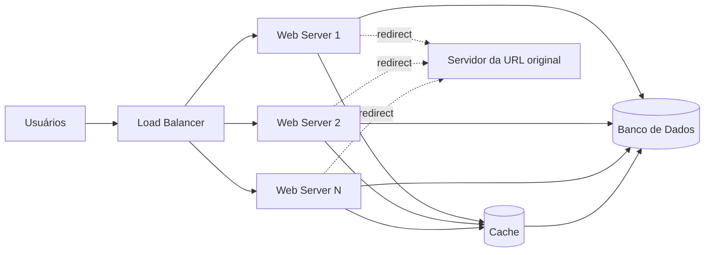

---

## 7. Modelo de dados

No design inicial, o capítulo usa uma tabela simples com três campos principais.

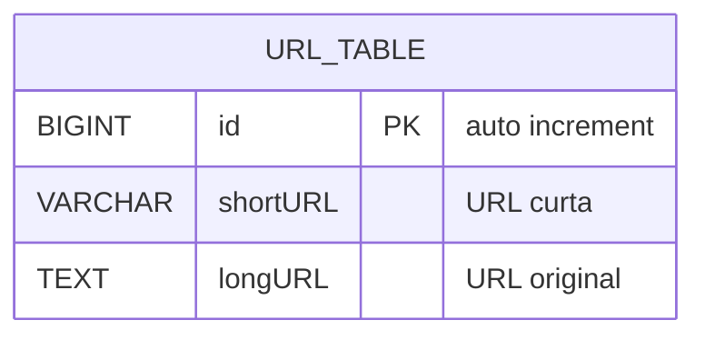

Representação tabular:

| Campo | Descrição |
|---|---|
| `id` | Identificador único, usado como chave primária. |
| `shortURL` | Código curto gerado pelo sistema. |
| `longURL` | URL original informada pelo usuário. |

### Índices recomendados

Embora o capítulo apresente o modelo simplificado, em uma solução real seriam recomendados pelo menos:

```sql
CREATE UNIQUE INDEX uk_url_short ON url_table(shortURL);
CREATE INDEX idx_url_long ON url_table(longURL);
```

O índice em `shortURL` é essencial para o redirecionamento rápido. O índice em `longURL` ajuda a verificar se uma URL longa já foi encurtada antes.

---

## 8. Função de hash

A função de hash transforma uma URL longa em um valor menor, chamado `hashValue`.


A função deve satisfazer dois requisitos:

1. Cada `longURL` deve gerar um `hashValue`.
2. Cada `hashValue` precisa permitir encontrar a `longURL` correspondente por meio da tabela de mapeamento.

A função de hash não precisa ser reversível. O sistema não descobre a URL longa matematicamente a partir do hash; ele consulta o banco usando o `shortURL` como chave.

---

## 9. Tamanho do hash

Como são permitidos 62 caracteres (`0-9`, `a-z`, `A-Z`), a quantidade máxima de URLs representáveis por um hash de tamanho `n` é:

```text
62^n
```

| n | Capacidade máxima aproximada |
|---:|---:|
| 1 | 62 |
| 2 | 3.844 |
| 3 | 238.328 |
| 4 | 14.776.336 |
| 5 | 916.132.832 |
| 6 | 56.800.235.584 |
| 7 | 3.521.614.606.208 |

Como a estimativa é de 365 bilhões de URLs em 10 anos, um hash de 7 caracteres é suficiente, pois:

```text
62^7 ≈ 3,5 trilhões
```

---

## 10. Hash com resolução de colisão

Uma primeira abordagem é aplicar uma função de hash conhecida, como CRC32, MD5 ou SHA-1, sobre a URL longa. O problema é que essas funções geram saídas maiores do que 7 caracteres.

Uma alternativa seria pegar os primeiros 7 caracteres do hash. Porém, isso pode gerar colisões, isto é, duas URLs longas diferentes resultarem na mesma URL curta.

### Fluxo de resolução de colisão

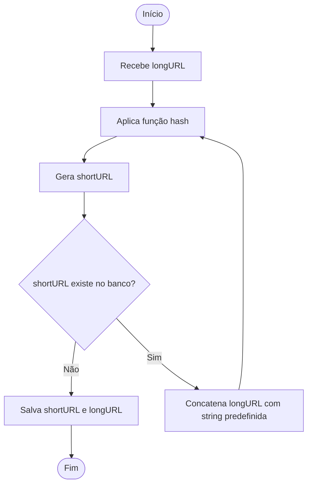

Essa abordagem funciona, mas pode ficar cara porque exige consultar o banco para verificar se cada `shortURL` já existe.

### Uso de Bloom Filter

Para reduzir consultas desnecessárias ao banco, pode-se usar um Bloom Filter. Ele ajuda a verificar rapidamente se uma URL curta provavelmente já existe.

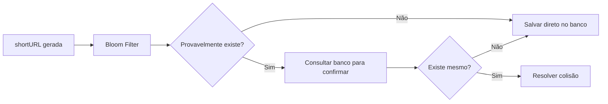

O Bloom Filter pode produzir falso positivo, mas não falso negativo. Isso significa que ele pode dizer que algo talvez exista quando não existe, mas não deve dizer que algo não existe se realmente existe.

---

## 11. Conversão Base 62

A segunda abordagem, adotada no design final do capítulo, é usar conversão Base 62.

A ideia é:

1. Gerar um ID único numérico.
2. Converter esse ID para Base 62.
3. Usar o valor convertido como `shortURL`.

### Mapeamento de caracteres

```text
0  -> 0
1  -> 1
...
9  -> 9
10 -> a
11 -> b
...
35 -> z
36 -> A
...
61 -> Z
```

### Exemplo do capítulo

Converter `11157` de base 10 para base 62:

```text
11157 = 2 * 62^2 + 55 * 62^1 + 59 * 62^0
```

Representação:

```text
[2, 55, 59] => 2TX
```

Logo:

```text
https://tinyurl.com/2TX
```

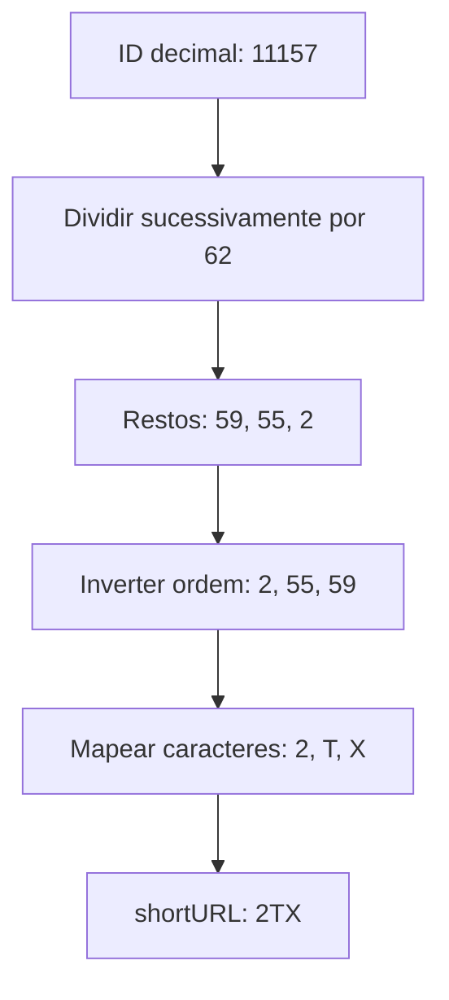

---

## 12. Comparação: hash + colisão vs Base 62

| Critério | Hash + resolução de colisão | Conversão Base 62 |
|---|---|---|
| Tamanho da URL curta | Fixo. | Variável; cresce conforme o ID aumenta. |
| Gerador de ID único | Não precisa. | Precisa. |
| Colisão | Pode ocorrer e precisa ser resolvida. | Não ocorre se o ID for realmente único. |
| Previsibilidade | Difícil prever a próxima URL curta. | Mais fácil prever a próxima URL, pois IDs podem ser sequenciais. |
| Complexidade | Exige tratamento de colisão. | Exige um gerador de IDs distribuído confiável. |

### Decisão do capítulo

O capítulo escolhe Base 62 porque evita colisões, desde que o sistema tenha um gerador de IDs únicos confiável.

O ponto de atenção é que, em ambiente distribuído, gerar IDs únicos não é trivial. Esse assunto foi tratado no capítulo anterior sobre geradores de ID distribuídos.

---

## 13. Fluxo detalhado de encurtamento

Fluxo final proposto:

1. O usuário envia uma `longURL`.
2. O sistema verifica se a `longURL` já existe no banco.
3. Se existir, retorna a `shortURL` existente.
4. Se não existir, gera um novo ID único.
5. Converte o ID para Base 62.
6. Salva `id`, `shortURL` e `longURL` no banco.
7. Retorna a `shortURL` ao usuário.

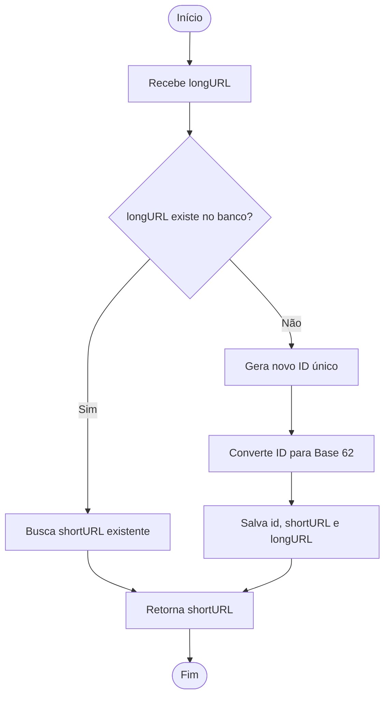

### Exemplo do capítulo

Entrada:

```text
https://en.wikipedia.org/wiki/Systems_design
```

ID gerado:

```text
2009215674938
```

Conversão Base 62:

```text
zn9edcu
```

Registro persistido:

| id | shortURL | longURL |
|---:|---|---|
| 2009215674938 | zn9edcu | https://en.wikipedia.org/wiki/Systems_design |

---

## 14. Fluxo detalhado de redirecionamento

Como o volume de leitura é maior do que o volume de escrita, o redirecionamento precisa ser otimizado. Por isso, o capítulo propõe armazenar o mapeamento `<shortURL, longURL>` em cache.

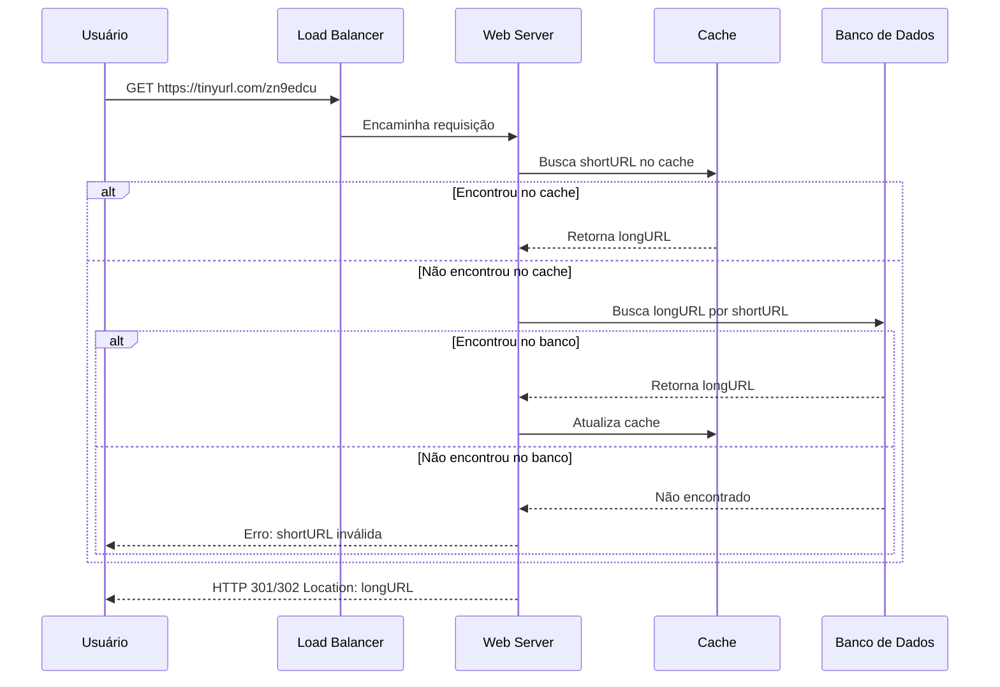

Fluxo resumido:

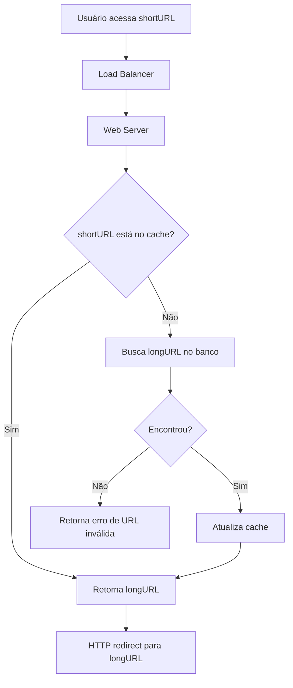

---

## 15. Pontos adicionais para discussão em entrevista

O capítulo encerra com alguns temas que podem ser mencionados caso haja tempo adicional na entrevista.

### Rate limiter

Usuários maliciosos podem enviar grande volume de requisições de encurtamento. Um rate limiter ajuda a bloquear abuso por IP, usuário, token ou outra regra de filtragem.

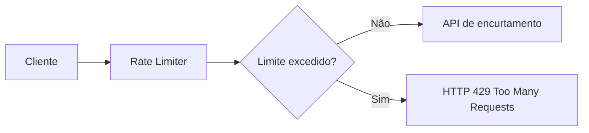

### Escalabilidade dos web servers

Como a camada web é stateless, é simples adicionar ou remover servidores atrás do load balancer.

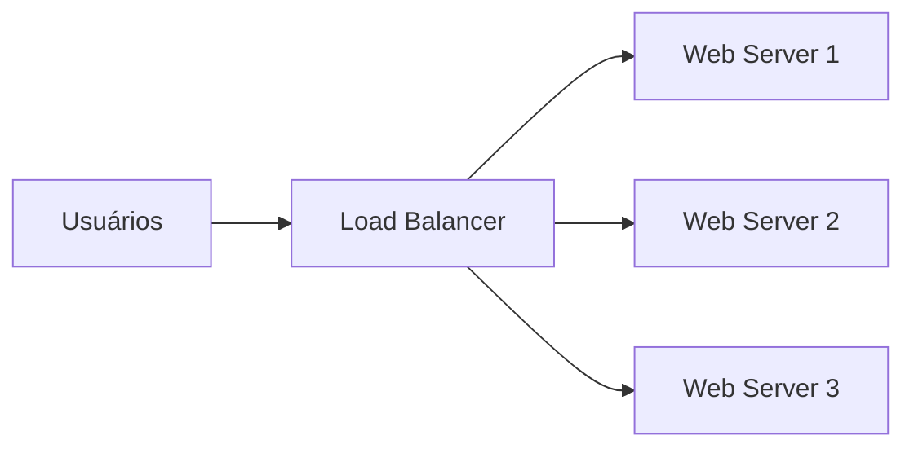

### Escalabilidade do banco

As técnicas comuns incluem:

- replicação, para melhorar leitura e disponibilidade;
- particionamento/sharding, para dividir dados por chave;
- índices em `shortURL`, para acelerar redirecionamentos;
- cache, para reduzir pressão no banco.

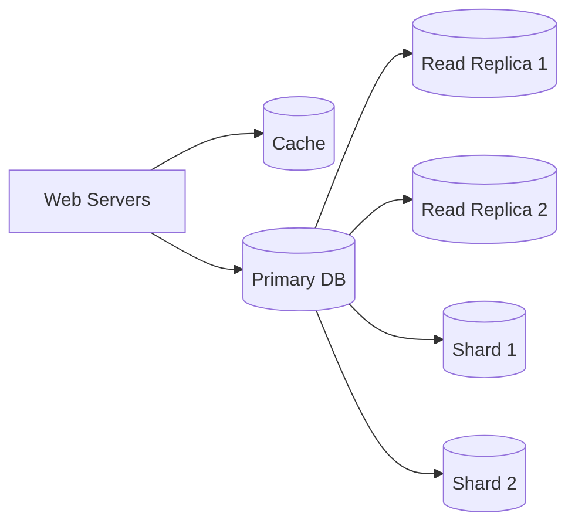

### Analytics

Analytics permite responder perguntas como:

- Quantas pessoas clicaram no link?
- Quando clicaram?
- De onde vieram?
- Qual campanha teve mais acessos?

Para isso, cada redirecionamento pode publicar um evento assíncrono.


---

## 16. Decisões arquiteturais principais

| Decisão | Escolha do capítulo | Justificativa |
|---|---|---|
| Algoritmo de geração | Base 62 sobre ID único | Evita colisões. |
| Tamanho da URL curta | Variável | Cresce conforme o ID aumenta. |
| Persistência | Banco relacional simplificado | Mantém mapeamento `shortURL -> longURL`. |
| Cache | Sim, no redirect | Leituras são muito mais frequentes que escritas. |
| Web tier | Stateless | Facilita escalar horizontalmente. |
| Redirect | 301 ou 302, conforme prioridade | 301 reduz carga; 302 melhora analytics. |

---

## 17. Checklist mental para entrevista

Ao explicar esse sistema, siga esta ordem:

1. Esclareça requisitos e premissas.
2. Faça estimativas de QPS, armazenamento e volume de registros.
3. Defina as APIs principais.
4. Explique o redirecionamento HTTP.
5. Modele a tabela `url_table`.
6. Compare hash com colisão versus Base 62.
7. Justifique a escolha por Base 62 com ID único.
8. Desenhe o fluxo de encurtamento.
9. Desenhe o fluxo de redirecionamento com cache.
10. Feche com rate limiter, escalabilidade, sharding, analytics e disponibilidade.

---

## 18. Resumo final

O design do encurtador de URLs combina conceitos clássicos de system design:

- APIs simples;
- redirecionamento HTTP;
- geração de IDs únicos;
- conversão Base 62;
- cache para leituras frequentes;
- banco para persistência do mapeamento;
- load balancer e web servers stateless;
- escalabilidade com replicação, sharding e rate limiting;
- analytics para rastrear cliques.

A principal decisão técnica é usar um ID único convertido para Base 62, evitando colisões e simplificando o processo de geração da URL curta. O custo dessa escolha é depender de um gerador de IDs distribuído confiável e lidar com a previsibilidade dos identificadores.
