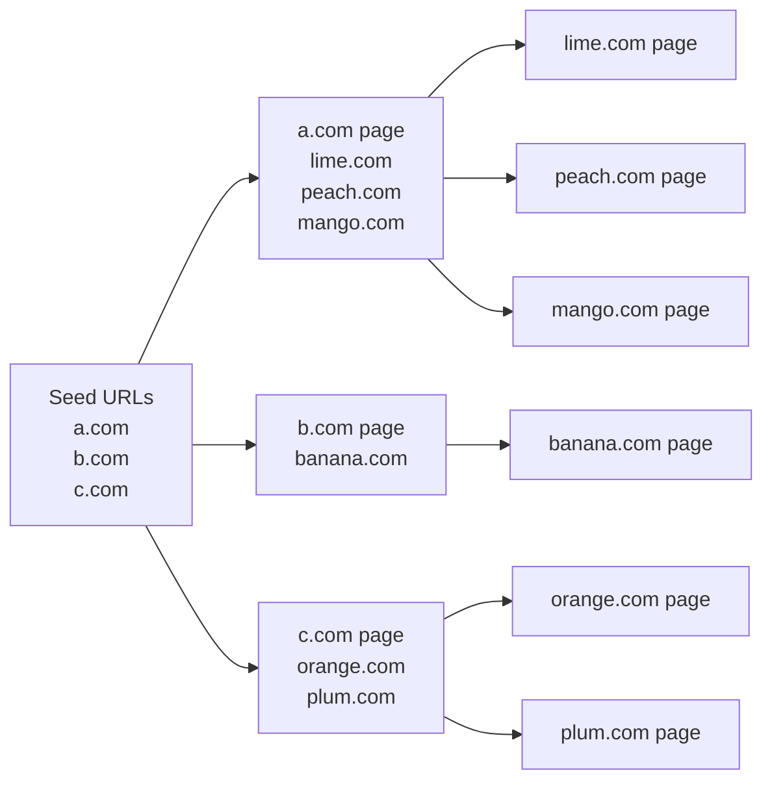
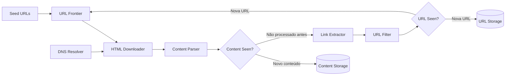
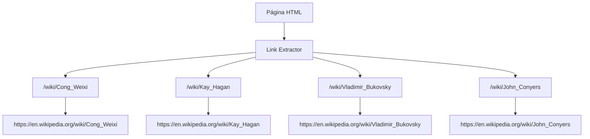
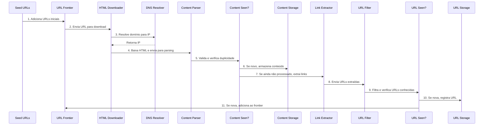
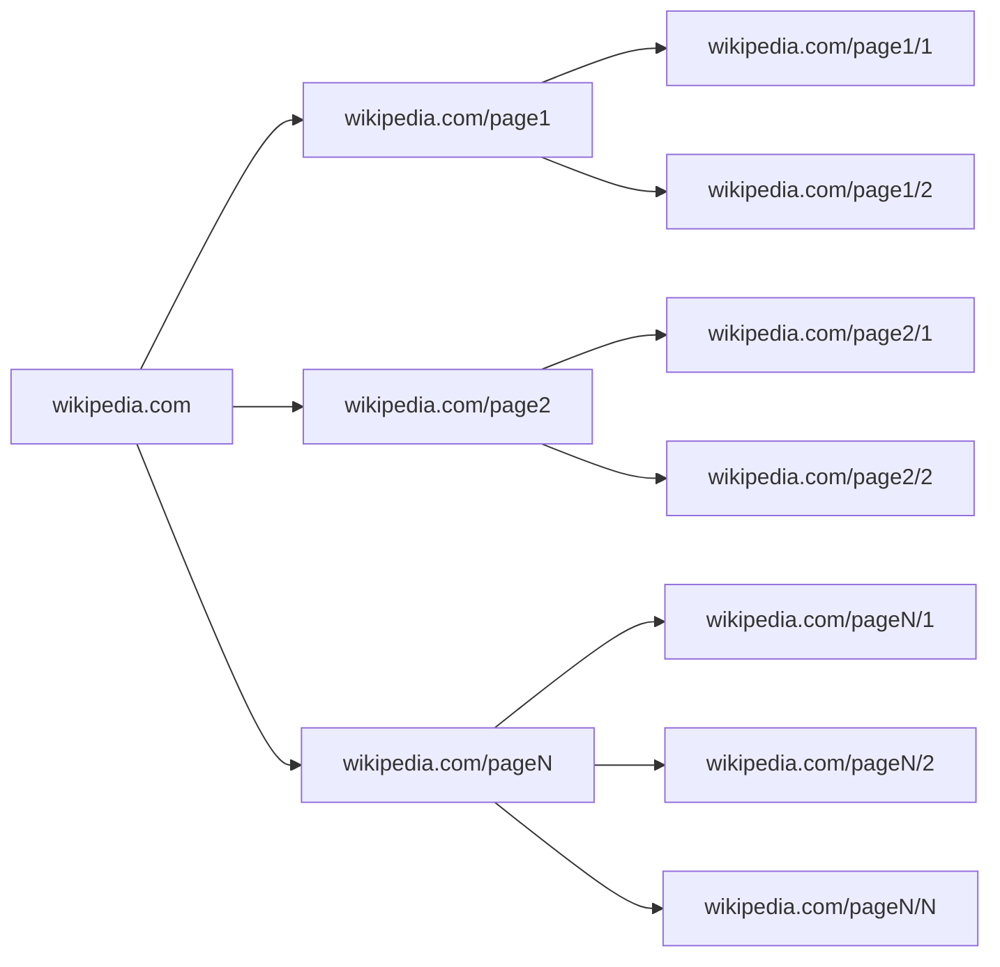
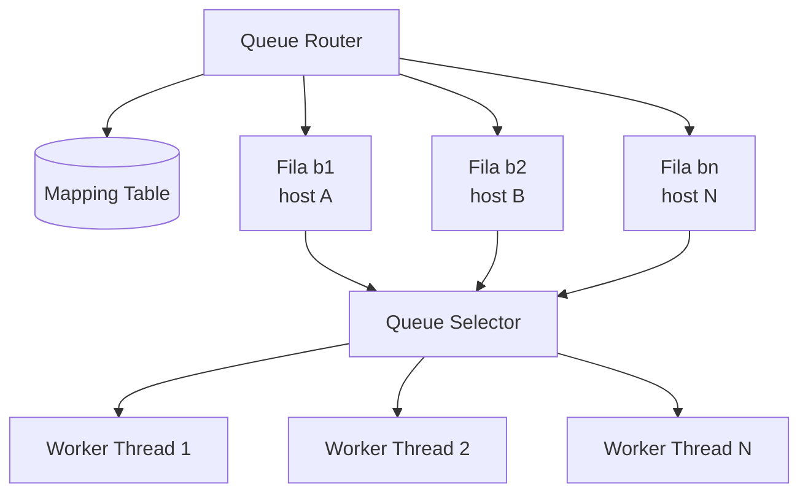
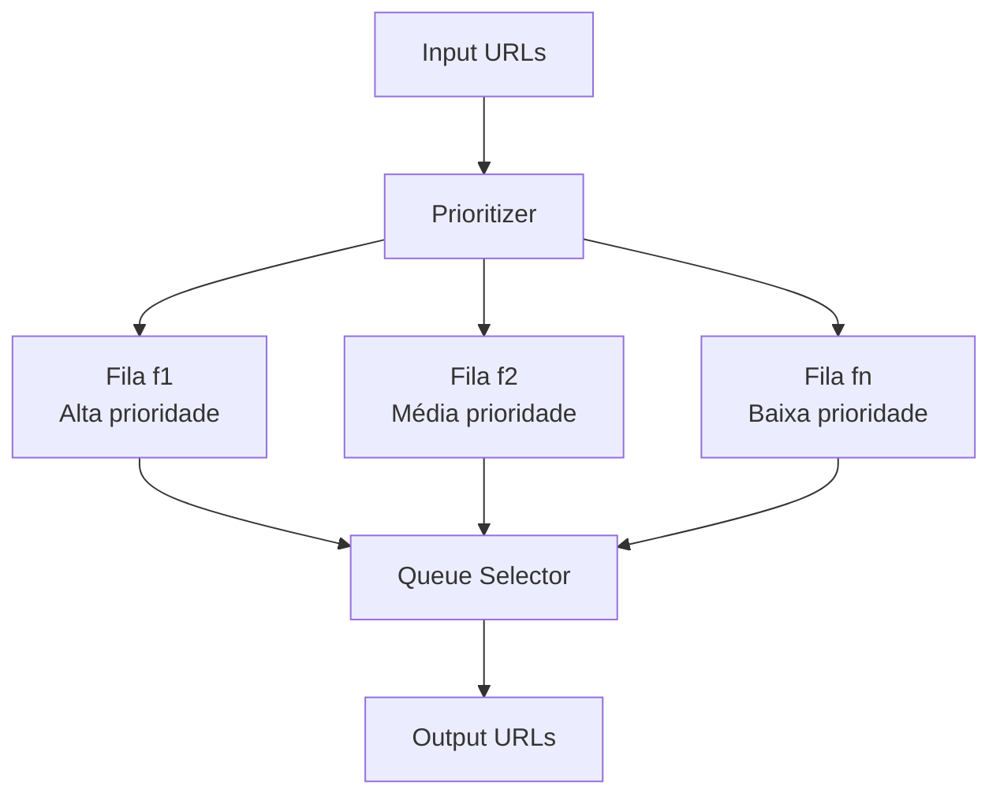
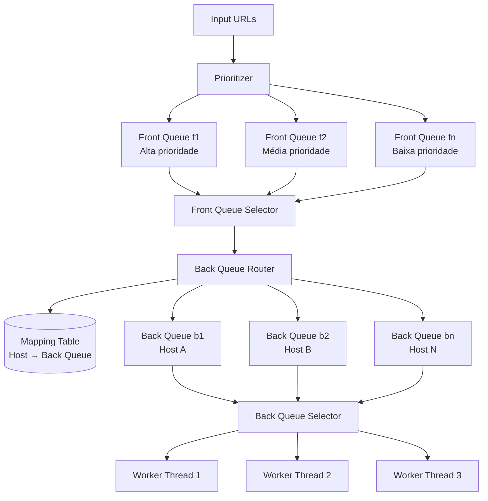
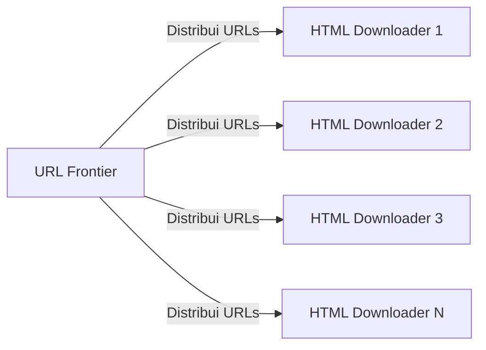
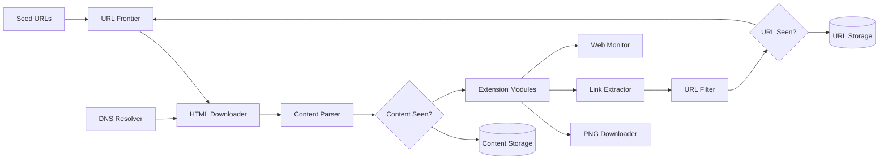

# Capítulo 09 — Design de um Web Crawler

## 1. Visão geral

Um **web crawler**, também chamado de **robot** ou **spider**, é um sistema que navega automaticamente pela web para descobrir, baixar e processar conteúdos.

Ele é amplamente utilizado por mecanismos de busca para encontrar páginas novas ou atualizadas, mas também pode ser usado para arquivamento, mineração de dados, monitoramento de conteúdo e análise da web.

O processo básico começa com um conjunto inicial de URLs, chamado de **seed URLs**. O crawler baixa essas páginas, extrai novos links encontrados nelas e continua o processo de forma recorrente.



## 2. Principais usos de um crawler

Um crawler pode ser usado para várias finalidades.

| Uso                               | Descrição                                                                                                |
| --------------------------------- | -------------------------------------------------------------------------------------------------------- |
| Indexação por mecanismos de busca | Descobrir páginas para alimentar índices de busca, como ocorre em sistemas semelhantes ao Google Search. |
| Arquivamento web                  | Preservar páginas e versões históricas da internet.                                                      |
| Mineração de dados                | Coletar informações públicas da web para análise, como relatórios, documentos e dados financeiros.       |
| Monitoramento web                 | Detectar violações de direitos autorais, marcas, pirataria ou alterações em páginas.                     |

---

## 3. Entendimento do problema

O algoritmo básico de um crawler parece simples:

1. Receber um conjunto de URLs.
2. Baixar as páginas associadas a essas URLs.
3. Extrair novas URLs das páginas baixadas.
4. Repetir o processo.

Porém, em larga escala, o problema se torna muito mais complexo. É necessário lidar com bilhões de páginas, conteúdo duplicado, falhas de rede, páginas malformadas, prioridades, limites por domínio, armazenamento massivo e atualização contínua.

## 4. Requisitos assumidos

Durante a entrevista de system design, o escopo precisa ser esclarecido. Para este capítulo, as premissas adotadas são:

| Item                 | Premissa                                         |
| -------------------- | ------------------------------------------------ |
| Finalidade principal | Search engine indexing                           |
| Volume mensal        | 1 bilhão de páginas por mês                      |
| Conteúdo             | HTML apenas                                      |
| Atualizações         | Páginas novas ou editadas devem ser consideradas |
| Retenção             | Conteúdo armazenado por 5 anos                   |
| Conteúdo duplicado   | Deve ser ignorado                                |

Além disso, um bom crawler deve atender aos seguintes requisitos não funcionais:

| Requisito       | Descrição                                                                                         |
| --------------- | ------------------------------------------------------------------------------------------------- |
| Escalabilidade  | A web é enorme; o crawler precisa trabalhar de forma distribuída e paralela.                      |
| Robustez        | Deve lidar com HTML inválido, servidores lentos, erros, links maliciosos e situações inesperadas. |
| Polidez         | Não deve sobrecarregar servidores externos com muitas requisições em curto intervalo.             |
| Extensibilidade | Deve permitir novos tipos de conteúdo e novos módulos no futuro.                                  |

---

## 5. Estimativas de capacidade

Premissas:

* 1 bilhão de páginas baixadas por mês.
* 30 dias por mês.
* 24 horas por dia.
* 3.600 segundos por hora.
* Página média com 500 KB.
* Retenção por 5 anos.

### 5.1 QPS médio

```text
1.000.000.000 páginas / 30 dias / 24 horas / 3600 segundos
≈ 400 páginas por segundo
```

### 5.2 QPS de pico

```text
Peak QPS = 2 × QPS médio
Peak QPS = 800 páginas por segundo
```

### 5.3 Armazenamento mensal

```text
1 bilhão de páginas × 500 KB = 500 TB por mês
```

### 5.4 Armazenamento para 5 anos

```text
500 TB × 12 meses × 5 anos = 30 PB
```

Resumo:

| Métrica                 | Valor estimado |
| ----------------------- | -------------: |
| Páginas por mês         |       1 bilhão |
| QPS médio               | ~400 páginas/s |
| QPS de pico             | ~800 páginas/s |
| Tamanho médio da página |         500 KB |
| Armazenamento mensal    |         500 TB |
| Armazenamento em 5 anos |          30 PB |

---

## 6. Arquitetura de alto nível

A arquitetura proposta possui os seguintes componentes principais:



## 7. Componentes da arquitetura

### 7.1 Seed URLs

As **seed URLs** são o ponto inicial do processo de crawling.

Exemplo:

* Para rastrear o site de uma universidade, uma boa seed URL seria a página principal da universidade.
* Para rastrear a web global, as seed URLs devem ser selecionadas com mais cuidado.

Uma abordagem comum é dividir o espaço de URLs por:

* Localidade geográfica.
* País.
* Tipo de site.
* Tema.
* Popularidade.

### 7.2 URL Frontier

O **URL Frontier** é o componente responsável por armazenar as URLs que ainda serão baixadas.

Ele separa o estado do crawler em dois grupos:

| Estado           | Descrição                                 |
| ---------------- | ----------------------------------------- |
| URLs pendentes   | URLs descobertas, mas ainda não baixadas. |
| URLs processadas | URLs já visitadas ou descartadas.         |

Na forma mais simples, pode ser visto como uma fila FIFO. Porém, em larga escala, ele precisa lidar com:

* Priorização.
* Polidez.
* Frequência de atualização.
* Evitar duplicidade.
* Distribuição entre workers.

### 7.3 HTML Downloader

O **HTML Downloader** baixa páginas da internet usando HTTP.

Ele recebe URLs do URL Frontier e executa o download do conteúdo HTML.

Antes de baixar uma página, a URL precisa ser resolvida para um endereço IP. Essa tarefa é feita pelo **DNS Resolver**.

### 7.4 DNS Resolver

O **DNS Resolver** converte um domínio em endereço IP.

Exemplo:

```text
www.wikipedia.org → 198.35.26.96
```

Como chamadas DNS podem ser lentas, em sistemas reais é comum usar cache DNS para reduzir latência.

### 7.5 Content Parser

Após o download, a página precisa ser analisada.

O **Content Parser** verifica se o HTML é válido e evita que páginas malformadas desperdicem recursos do crawler.

Separar esse componente é importante porque parsing pode ser custoso e pode impactar o desempenho geral do sistema.

### 7.6 Content Seen?

Muitas páginas na web possuem conteúdo duplicado.

O componente **Content Seen?** verifica se o conteúdo já foi armazenado antes. Comparar páginas caractere por caractere seria muito caro. Por isso, uma estratégia comum é calcular um **hash** ou **checksum** do conteúdo e comparar esse identificador.

Se o conteúdo já existir, ele pode ser descartado.

### 7.7 Content Storage

O **Content Storage** armazena o conteúdo HTML baixado.

A escolha da tecnologia depende de:

* Tipo de dado.
* Tamanho do conteúdo.
* Frequência de acesso.
* Tempo de retenção.
* Padrão de leitura e escrita.

Como o volume é muito grande, a maior parte do conteúdo fica em disco. Conteúdos populares podem ser mantidos em memória para reduzir latência.

### 7.8 Link Extractor

O **Link Extractor** extrai links de páginas HTML.

Links relativos são convertidos para URLs absolutas.

Exemplo:

```html
<a href="/wiki/Cong_Weixi">Cong Weixi</a>
```

Se a página base for:

```text
https://en.wikipedia.org
```

A URL final será:

```text
https://en.wikipedia.org/wiki/Cong_Weixi
```

Diagrama simplificado:



### 7.9 URL Filter

O **URL Filter** remove URLs indesejadas, como:

* Tipos de arquivo não suportados.
* Extensões bloqueadas.
* Links inválidos.
* URLs de erro.
* Sites em blacklist.
* URLs suspeitas ou maliciosas.

### 7.10 URL Seen?

O componente **URL Seen?** controla quais URLs já foram visitadas ou adicionadas ao frontier.

Isso evita que a mesma URL seja processada repetidamente, o que poderia gerar loops infinitos e carga desnecessária.

Técnicas comuns:

* Hash table.
* Bloom filter.

### 7.11 URL Storage

O **URL Storage** armazena URLs já visitadas.

Ele serve como histórico persistente para evitar reprocessamento desnecessário.

---

## 8. Fluxo completo do crawler



Fluxo resumido:

1. Seed URLs são adicionadas ao URL Frontier.
2. HTML Downloader busca URLs no Frontier.
3. DNS Resolver converte o host em IP.
4. Downloader baixa o HTML.
5. Content Parser valida a página.
6. Content Seen verifica duplicidade de conteúdo.
7. Link Extractor extrai novos links.
8. URL Filter remove URLs inválidas ou indesejadas.
9. URL Seen verifica se a URL já foi processada.
10. URL Storage registra URLs novas.
11. URLs novas retornam ao URL Frontier.

---

## 9. Deep dive

## 9.1 DFS vs BFS

A web pode ser modelada como um grafo direcionado:

* Páginas são nós.
* Links são arestas.

Existem duas formas clássicas de percorrer um grafo:

| Estratégia                 | Descrição                                                                   |
| -------------------------- | --------------------------------------------------------------------------- |
| DFS — Depth-First Search   | Explora profundamente um caminho antes de voltar.                           |
| BFS — Breadth-First Search | Explora os vizinhos em largura antes de avançar para níveis mais profundos. |

Para crawlers, **DFS não é uma boa escolha**, porque a profundidade da web pode ser muito grande ou infinita.

A abordagem mais comum é baseada em **BFS**, geralmente implementada com uma fila FIFO.



Apesar disso, BFS puro tem dois problemas:

1. Não considera prioridade das URLs.
2. Pode gerar muitas requisições para o mesmo host em pouco tempo.

Por isso, crawlers reais usam uma versão mais sofisticada do URL Frontier.

---

# 10. URL Frontier

O **URL Frontier** é um dos componentes mais importantes do crawler.

Ele precisa resolver dois problemas principais:

| Problema   | Objetivo                               |
| ---------- | -------------------------------------- |
| Polidez    | Evitar sobrecarregar o mesmo servidor. |
| Prioridade | Baixar primeiro URLs mais importantes. |

---

## 10.1 Polidez

Um crawler educado evita enviar muitas requisições ao mesmo servidor em um curto intervalo.

A regra geral é:

> Não baixar muitas páginas do mesmo host ao mesmo tempo.

Uma solução é separar URLs por host em filas diferentes.



Componentes:

| Componente     | Função                                                            |
| -------------- | ----------------------------------------------------------------- |
| Queue Router   | Garante que URLs do mesmo host fiquem na mesma fila.              |
| Mapping Table  | Mapeia host para fila.                                            |
| FIFO Queues    | Cada fila contém URLs de um mesmo host.                           |
| Queue Selector | Seleciona filas para os workers.                                  |
| Worker Threads | Baixam páginas, respeitando atraso entre downloads do mesmo host. |

Exemplo de tabela de mapeamento:

| Host          | Fila |
| ------------- | ---- |
| wikipedia.com | b1   |
| apple.com     | b2   |
| nike.com      | bn   |

---

## 10.2 Prioridade

Nem todas as URLs têm a mesma importância.

Exemplo:

* A página inicial da Apple provavelmente é mais importante do que uma discussão aleatória em um fórum.
* Uma página com alto PageRank pode ser mais relevante.
* Uma página muito acessada pode merecer prioridade maior.
* Uma página que muda com frequência pode ser recrawleada antes.

O componente responsável por isso é o **Prioritizer**.



Componentes:

| Componente     | Função                                                  |
| -------------- | ------------------------------------------------------- |
| Prioritizer    | Calcula prioridade das URLs.                            |
| Filas f1...fn  | Guardam URLs agrupadas por prioridade.                  |
| Queue Selector | Seleciona filas dando preferência às mais prioritárias. |

---

## 10.3 URL Frontier completo

O design completo combina:

* **Front queues**: responsáveis por prioridade.
* **Back queues**: responsáveis por polidez.



Resumo:

| Parte           | Responsabilidade                    |
| --------------- | ----------------------------------- |
| Front queues    | Priorização das URLs.               |
| Back queues     | Polidez por host.                   |
| Prioritizer     | Define a importância da URL.        |
| Queue selectors | Escolhem próximas URLs a processar. |
| Workers         | Fazem download respeitando limites. |

---

# 11. Freshness

A web muda constantemente. Páginas são criadas, alteradas e removidas.

Por isso, um crawler precisa revisitar páginas periodicamente. Essa característica é chamada de **freshness**.

Estratégias comuns:

* Recrawlear com base no histórico de atualização da página.
* Priorizar URLs importantes.
* Recrawlear páginas populares com mais frequência.
* Recrawlear páginas que mudam com frequência em intervalos menores.

---

# 12. Armazenamento do URL Frontier

Em um crawler real, o número de URLs pode chegar a centenas de milhões ou bilhões.

Guardar tudo em memória não é viável.

A abordagem adotada é híbrida:

| Local   | Uso                                                       |
| ------- | --------------------------------------------------------- |
| Disco   | Armazena a maior parte das URLs.                          |
| Memória | Mantém buffers para operações rápidas de enqueue/dequeue. |

Funcionamento:

1. A maior parte das URLs fica em disco.
2. Buffers em memória aceleram leitura e escrita.
3. Dados dos buffers são periodicamente gravados em disco.

---

# 13. HTML Downloader

O **HTML Downloader** baixa páginas usando HTTP.

Antes de discutir otimizações, é necessário considerar o protocolo **robots.txt**.

## 13.1 Robots.txt

O arquivo `robots.txt` informa quais páginas ou diretórios podem ou não ser acessados por crawlers.

Exemplo conceitual:

```text
User-agent: Googlebot
Disallow: /creatorhub/*
Disallow: /rss/people/*/reviews
Disallow: /gp/pdp/rss/*/reviews
Disallow: /gp/cdp/member-reviews/
Disallow: /gp/aw/cr/
```

Um crawler deve respeitar essas regras para evitar acessar áreas bloqueadas.

Como baixar `robots.txt` repetidamente é ineficiente, o resultado pode ser armazenado em cache.

---

# 14. Otimizações de performance

## 14.1 Crawling distribuído

Para alta performance, o trabalho de crawling é distribuído entre múltiplos servidores.

Cada servidor executa múltiplas threads e processa apenas uma parte do espaço de URLs.



## 14.2 Cache DNS

DNS pode se tornar gargalo porque chamadas de DNS podem levar dezenas ou centenas de milissegundos.

Solução:

* Manter cache DNS próprio.
* Atualizar periodicamente esse cache.
* Evitar que cada thread bloqueie esperando resolução DNS.

## 14.3 Localidade

Distribuir crawlers geograficamente ajuda a reduzir latência.

Exemplo:

* Crawlers próximos dos servidores de origem baixam páginas mais rapidamente.
* A mesma ideia se aplica a cache, servidores e filas.

## 14.4 Timeout curto

Alguns servidores respondem lentamente ou não respondem.

Para evitar que workers fiquem bloqueados, o crawler deve usar timeout máximo.

Exemplo:

```text
Se a página não responder em X segundos, abortar e processar outra URL.
```

---

# 15. Robustez

Um crawler em larga escala precisa continuar funcionando mesmo com falhas.

Estratégias importantes:

| Estratégia             | Descrição                                                                     |
| ---------------------- | ----------------------------------------------------------------------------- |
| Consistent hashing     | Distribui carga entre downloaders e facilita redistribuição em caso de falha. |
| Salvamento de estado   | Estados e dados são gravados em disco para permitir recuperação.              |
| Tratamento de exceções | Erros devem ser tratados sem derrubar o sistema.                              |
| Validação de dados     | Dados inválidos devem ser detectados e descartados.                           |

---

# 16. Extensibilidade

O crawler deve permitir novos módulos sem exigir reescrita da arquitetura.

Exemplos:

* Adicionar downloader para PNG.
* Adicionar web monitor.
* Adicionar parser para novos formatos.
* Adicionar filtros especializados.



Essa separação facilita evolução do sistema.

---

# 17. Conteúdo problemático

Um crawler precisa detectar e evitar conteúdos que desperdiçam recursos ou prejudicam o sistema.

## 17.1 Conteúdo redundante

Cerca de uma parte significativa da web contém páginas duplicadas ou muito semelhantes.

Solução comum:

* Hash.
* Checksum.
* Deduplicação por assinatura de conteúdo.

## 17.2 Spider traps

Uma **spider trap** é uma página que gera infinitas URLs ou uma sequência enorme de links, prendendo o crawler.

Exemplo conceitual:

```text
example.com/foo/bar/foo/bar/foo/bar/...
```

Mitigações:

* Definir tamanho máximo de URL.
* Detectar padrões repetitivos.
* Aplicar filtros por domínio.
* Bloquear sites problemáticos manualmente.
* Limitar profundidade ou expansão por host.

## 17.3 Data noise

Alguns conteúdos têm pouco ou nenhum valor:

* Anúncios.
* Spam.
* Código irrelevante.
* URLs artificiais.
* Conteúdo duplicado.
* Páginas de baixa qualidade.

Esses conteúdos devem ser filtrados sempre que possível.

---

# 18. Tópicos adicionais importantes

Mesmo após a arquitetura principal, alguns pontos ainda são relevantes em crawlers reais.

| Tópico                    | Descrição                                                                                                                               |
| ------------------------- | --------------------------------------------------------------------------------------------------------------------------------------- |
| Server-side rendering     | Muitos sites geram links com JavaScript, AJAX ou renderização dinâmica. Pode ser necessário renderizar a página antes de extrair links. |
| Filtro anti-spam          | Ajuda a remover páginas de baixa qualidade.                                                                                             |
| Replicação e sharding     | Melhoram disponibilidade, escalabilidade e confiabilidade.                                                                              |
| Escalabilidade horizontal | Crawlers grandes podem precisar de centenas ou milhares de servidores.                                                                  |
| Stateless workers         | Workers sem estado são mais fáceis de escalar e substituir.                                                                             |
| Observabilidade           | Métricas e análise de dados ajudam a ajustar o sistema.                                                                                 |

---

# 19. Decisões principais de design

| Decisão                                  | Justificativa                                                   |
| ---------------------------------------- | --------------------------------------------------------------- |
| BFS em vez de DFS                        | Evita exploração profunda infinita.                             |
| URL Frontier sofisticado                 | Permite prioridade e polidez.                                   |
| Back queues por host                     | Evitam sobrecarregar servidores externos.                       |
| Front queues por prioridade              | Permitem baixar páginas mais importantes primeiro.              |
| Hash para conteúdo duplicado             | Evita comparação cara entre páginas inteiras.                   |
| Bloom filter ou hash table para URL Seen | Evita adicionar URLs repetidas ao frontier.                     |
| Armazenamento híbrido                    | Usa disco para volume e memória para desempenho.                |
| Crawling distribuído                     | Necessário para processar bilhões de páginas.                   |
| Cache DNS                                | Reduz latência e bloqueios.                                     |
| Robots.txt                               | Mantém o crawler educado e compatível com restrições dos sites. |

---

# 20. Resumo final

Um web crawler em larga escala é muito mais do que um script que baixa páginas.

Ele precisa lidar com:

* Bilhões de URLs.
* Alto volume de armazenamento.
* Conteúdo duplicado.
* Servidores lentos.
* Regras de robots.txt.
* Priorização de páginas.
* Polidez por domínio.
* Falhas de rede.
* Extensibilidade.
* Recrawling para manter dados atualizados.

A peça central do design é o **URL Frontier**, pois ele coordena o que será baixado, em qual ordem, com qual prioridade e respeitando limites por host.

O crawler final deve ser:

* Escalável.
* Robusto.
* Educado com servidores externos.
* Extensível.
* Capaz de evitar conteúdo duplicado ou problemático.

---

# 21. Pontos de entrevista

Em uma entrevista de system design, os pontos mais importantes deste capítulo são:

1. Começar esclarecendo escopo e requisitos.
2. Fazer estimativas de QPS e armazenamento.
3. Apresentar arquitetura simples primeiro.
4. Explicar o papel do URL Frontier.
5. Destacar prioridade e polidez.
6. Explicar deduplicação de URL e conteúdo.
7. Discutir robots.txt.
8. Mostrar como escalar com crawlers distribuídos.
9. Explicar robustez contra falhas.
10. Mencionar spider traps, spam e conteúdo irrelevante.

Um bom resumo verbal seria:

> O crawler começa com seed URLs, baixa páginas, extrai links, filtra URLs inválidas, evita duplicidades e adiciona novas URLs ao frontier. Em larga escala, o componente mais importante é o URL Frontier, que combina prioridade e polidez. O sistema precisa ser distribuído, tolerante a falhas, respeitar robots.txt, evitar conteúdo duplicado e suportar recrawling para manter os dados atualizados.
