# Capítulo 10 — Design de um Sistema de Notificações

## 1. Visão geral

Um sistema de notificações é responsável por enviar mensagens importantes aos usuários, como:

* alertas de notícias;
* atualizações de produtos;
* eventos;
* ofertas;
* confirmações de pagamento;
* avisos operacionais.

O capítulo considera três formatos principais de notificação:

| Tipo              | Exemplo                                |
| ----------------- | -------------------------------------- |
| Push notification | Notificação no celular ou desktop      |
| SMS               | Mensagem de texto no telefone          |
| Email             | Mensagem enviada para caixa de entrada |

---

## 2. Entendimento do problema e escopo

O objetivo é projetar um sistema escalável capaz de enviar milhões de notificações por dia.

### Requisitos levantados

| Pergunta                                   | Resposta definida no capítulo                     |
| ------------------------------------------ | ------------------------------------------------- |
| Quais tipos de notificação são suportados? | Push, SMS e email                                 |
| É um sistema em tempo real?                | Semi-real-time                                    |
| Quais dispositivos são suportados?         | iOS, Android, laptop/desktop                      |
| O que dispara notificações?                | Aplicações clientes ou jobs agendados no servidor |
| Usuários podem cancelar recebimento?       | Sim, opt-out deve ser respeitado                  |
| Volume diário esperado                     | 10 milhões push, 1 milhão SMS, 5 milhões emails   |

### Observação importante

O sistema não precisa garantir entrega instantânea em todos os cenários. Ele deve entregar as notificações o mais rápido possível, mas pequenos atrasos são aceitáveis em momentos de alta carga.

---

# 3. Tipos de notificações

## 3.1 Push notification para iOS

No iOS, o envio ocorre por meio do **APNs — Apple Push Notification service**.

### Componentes principais

| Componente | Responsabilidade                                               |
| ---------- | -------------------------------------------------------------- |
| Provider   | Serviço que monta e envia a requisição de notificação          |
| APNs       | Serviço da Apple que entrega notificações aos dispositivos iOS |
| iOS Device | Dispositivo final que recebe a notificação                     |

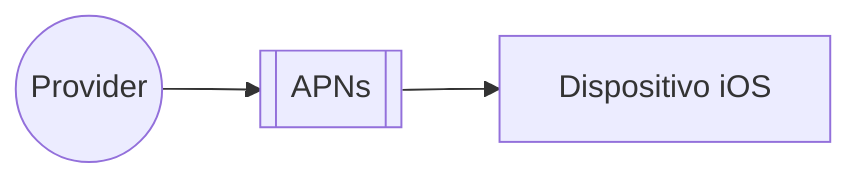

### Dados necessários

Para enviar uma notificação push no iOS, o provider precisa informar:

* **device token**: identificador único do dispositivo;
* **payload**: conteúdo da notificação em JSON.

Exemplo conceitual de payload:

```json
{
  "aps": {
    "alert": {
      "title": "Game Request",
      "body": "Bob wants to play chess",
      "action-loc-key": "PLAY"
    },
    "badge": 5
  }
}
```

---

## 3.2 Push notification para Android

No Android, o fluxo é semelhante, mas o serviço utilizado é o **FCM — Firebase Cloud Messaging**.

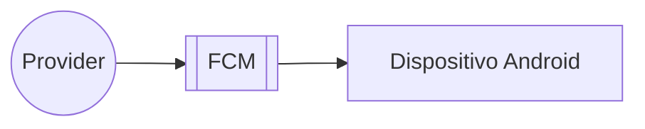

---

## 3.3 SMS

Para SMS, normalmente são usados serviços comerciais de terceiros, como Twilio ou Nexmo, conforme citado no capítulo.

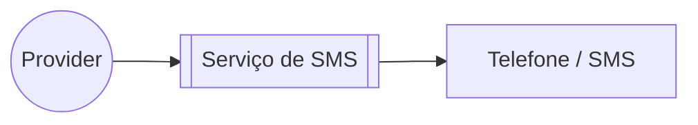

---

## 3.4 Email

Para email, empresas podem manter servidores próprios, mas o capítulo recomenda o uso de serviços comerciais, como SendGrid ou Mailchimp, por oferecerem melhor taxa de entrega e analytics.

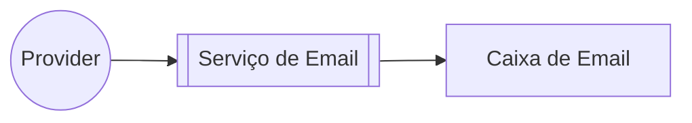

---

# 4. Serviços de terceiros

O sistema depende de serviços externos para entregar as notificações aos usuários finais.

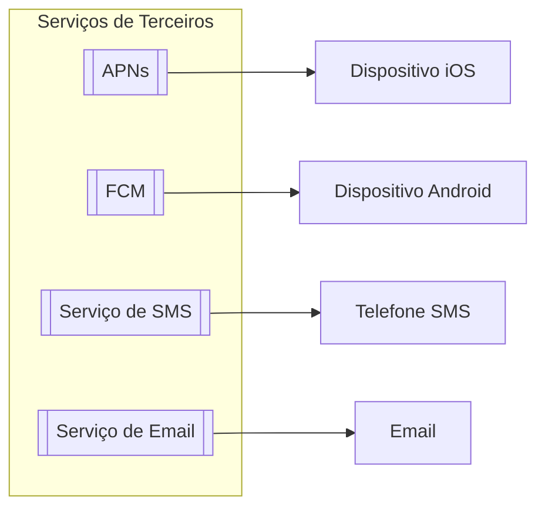

## Ponto importante

O sistema deve ser extensível para permitir troca ou adição de provedores.

Exemplo:

* FCM pode não estar disponível em alguns mercados;
* pode ser necessário integrar provedores alternativos;
* falhas em um provedor não devem afetar todos os canais.

---

# 5. Coleta de informações de contato

Antes de enviar notificações, o sistema precisa coletar dados como:

* email;
* telefone;
* código do país;
* device token;
* vínculo entre usuário e dispositivo.

Esse fluxo ocorre normalmente quando o usuário instala o app ou faz cadastro/login.

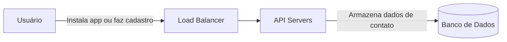

---

## 5.1 Modelo simplificado de dados

O capítulo apresenta duas tabelas principais: `user` e `device`.

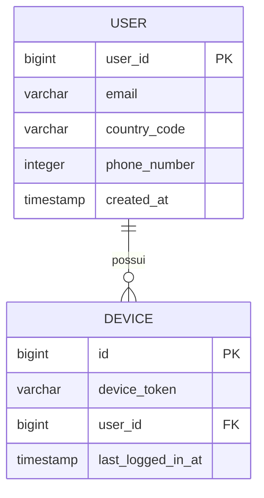

## Observação

Um usuário pode possuir múltiplos dispositivos. Portanto, uma única notificação push pode precisar ser enviada para todos os dispositivos vinculados ao mesmo usuário.

---

# 6. Design inicial

O primeiro desenho é simples: vários serviços internos chamam diretamente o sistema de notificações, que envia mensagens para os provedores externos.

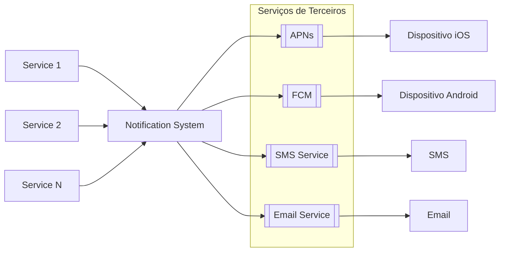

## Componentes

| Componente           | Função                                                 |
| -------------------- | ------------------------------------------------------ |
| Service 1 to N       | Serviços que disparam notificações                     |
| Notification System  | Serviço central que recebe, monta e envia notificações |
| Third-party services | Serviços externos responsáveis pela entrega            |
| Dispositivos finais  | Recebem as mensagens                                   |

---

## 6.1 Problemas do design inicial

O capítulo destaca três problemas principais:

| Problema                | Explicação                                                 |
| ----------------------- | ---------------------------------------------------------- |
| Single Point of Failure | Um único servidor de notificação vira ponto único de falha |
| Difícil de escalar      | Tudo fica concentrado em um único componente               |
| Gargalo de performance  | Montagem, processamento e envio ficam acoplados            |

Esse desenho é simples, mas não suporta bem alto volume.

---

# 7. Design de alto nível melhorado

Para resolver os problemas, o capítulo propõe:

* mover banco e cache para fora do servidor de notificação;
* adicionar múltiplos servidores de notificação;
* usar filas de mensagens;
* usar workers para processamento assíncrono;
* separar filas por tipo de notificação.

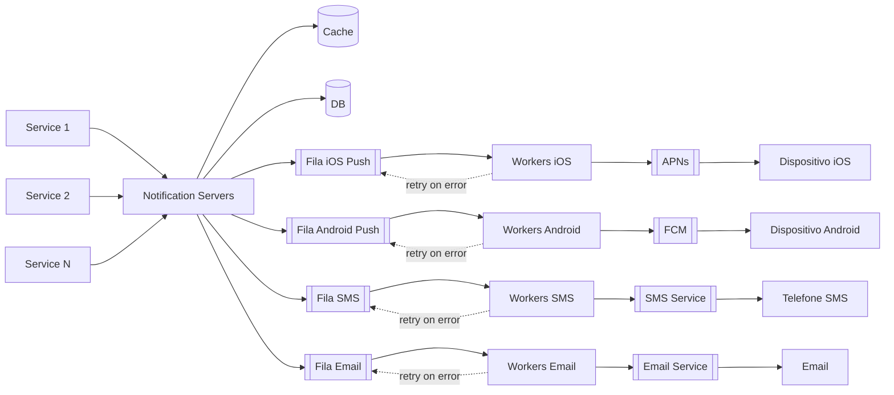

---

## 7.1 Responsabilidades dos servidores de notificação

Os servidores de notificação passam a ter funções mais específicas:

| Responsabilidade    | Descrição                                                       |
| ------------------- | --------------------------------------------------------------- |
| Expor APIs internas | Serviços internos chamam essas APIs para solicitar notificações |
| Validar dados       | Verificar email, telefone, permissões e dados obrigatórios      |
| Consultar cache/DB  | Buscar dados do usuário, device token e templates               |
| Publicar em filas   | Colocar eventos de notificação nas filas corretas               |

---

## 7.2 Exemplo de API

Exemplo conceitual de endpoint para envio:

```http
POST https://api.example.com/v/sms/send
```

Exemplo de corpo da requisição:

```json
{
  "to": [
    {
      "user_id": 123456
    }
  ],
  "from": {
    "email": "from_address@example.com"
  },
  "subject": "Hello, World!",
  "content": [
    {
      "type": "text/plain",
      "value": "Hello, World!"
    }
  ]
}
```

---

# 8. Filas de mensagens

As filas são fundamentais para desacoplar os componentes.

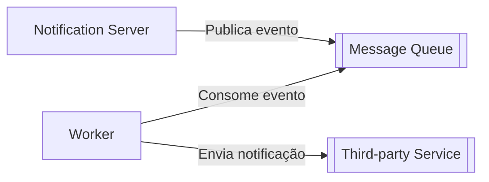

## Benefícios

| Benefício            | Explicação                                                     |
| -------------------- | -------------------------------------------------------------- |
| Desacoplamento       | Servidor de notificação não precisa esperar o provedor externo |
| Escalabilidade       | Workers podem ser escalados horizontalmente                    |
| Isolamento de falhas | Falha em SMS não afeta email ou push                           |
| Retry                | Mensagens podem voltar para fila em caso de erro               |

---

# 9. Workers

Workers são servidores que:

* consomem mensagens das filas;
* montam ou completam a notificação;
* chamam serviços externos;
* registram logs;
* fazem retry quando necessário.

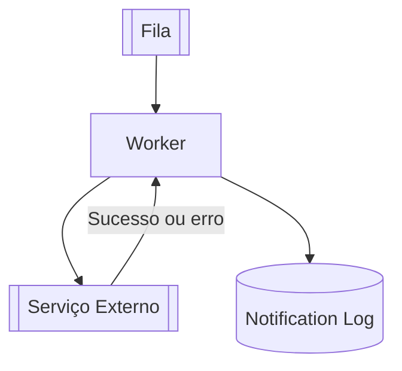

---

# 10. Fluxo completo de envio

O capítulo resume o fluxo de envio em etapas:

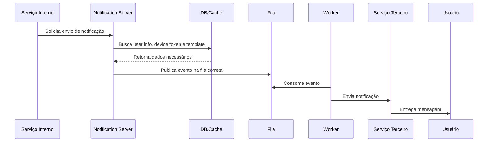

---

# 11. Deep dive

## 11.1 Confiabilidade

Um requisito importante é evitar perda de dados.

Mesmo que uma notificação possa atrasar, ela não deve ser perdida.

Para isso, o capítulo propõe persistir os dados em um **notification log**.

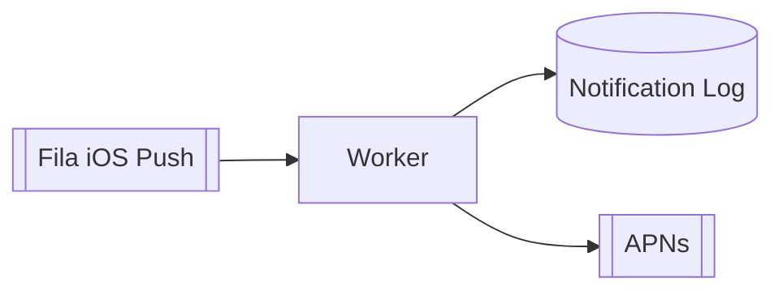

## Ideia central

Antes ou durante o envio, o evento da notificação é registrado em uma base persistente. Assim, caso ocorra falha, existe histórico para auditoria, reprocessamento ou diagnóstico.

---

## 11.2 Entrega exatamente uma vez

O capítulo deixa claro que, em sistemas distribuídos, não é possível garantir com simplicidade que uma notificação será entregue exatamente uma vez.

Na prática, a maioria dos sistemas trabalha com:

* entrega pelo menos uma vez;
* controle de duplicidade;
* deduplicação por `event_id`.

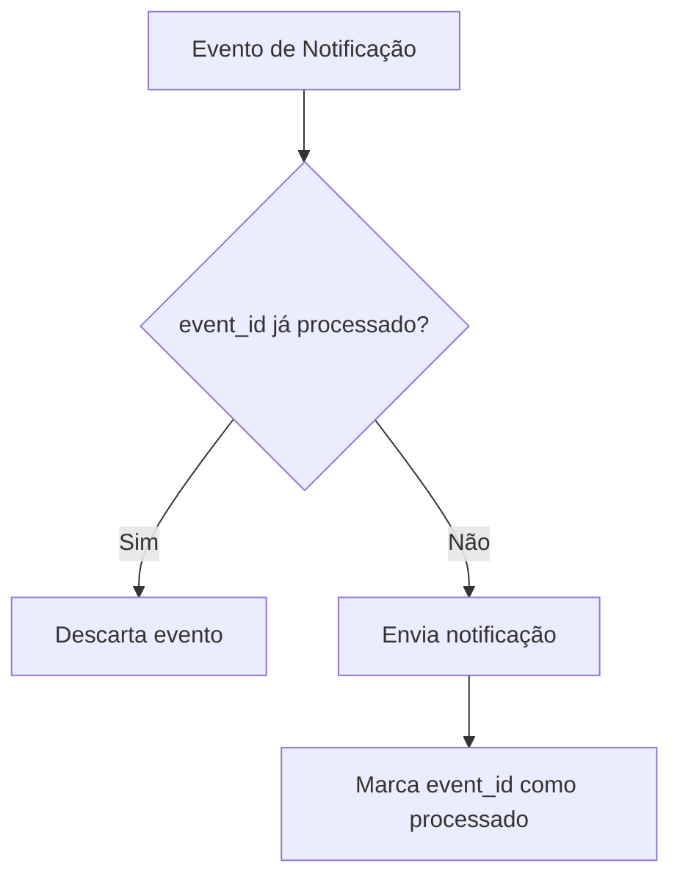

---

# 12. Componentes adicionais

## 12.1 Template de notificação

Templates evitam criar notificações do zero a cada envio.

Exemplo conceitual:

```text
BODY:
You dreamed of it. We dared it. [ITEM NAME] is back — only until [DATE].

CTA:
Order Now. Or, Save My [ITEM NAME]
```

## Benefícios

| Benefício         | Explicação                                       |
| ----------------- | ------------------------------------------------ |
| Consistência      | Mantém formato padronizado                       |
| Redução de erro   | Evita montagem manual repetitiva                 |
| Economia de tempo | Reutiliza estrutura pronta                       |
| Personalização    | Permite trocar parâmetros como nome, item e data |

---

## 12.2 Configurações de notificação

Usuários podem querer controlar o que recebem.

O sistema deve respeitar preferências como:

* tipo de canal;
* opt-in;
* opt-out;
* frequência;
* categoria da notificação.

Modelo simplificado:

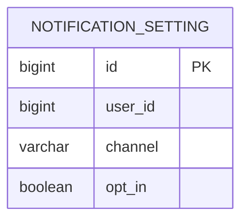

Antes de enviar uma notificação, o sistema consulta essa configuração.

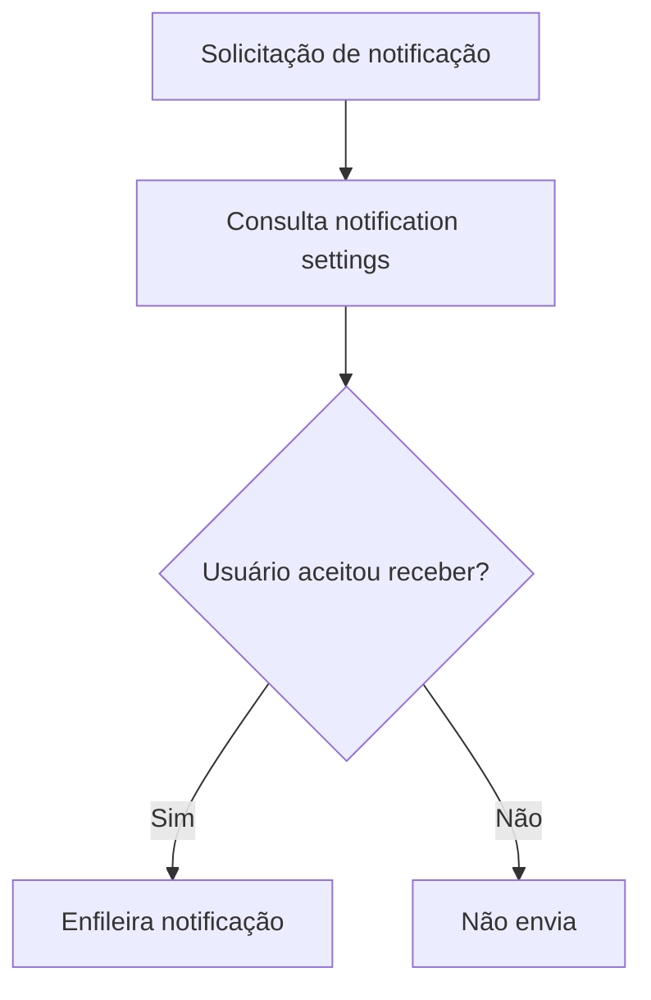

---

## 12.3 Rate limiting

Para evitar incomodar os usuários, o sistema deve limitar a quantidade de notificações enviadas.

Exemplos:

* no máximo X emails por dia;
* no máximo Y push notifications por hora;
* limitar notificações promocionais;
* priorizar notificações transacionais.

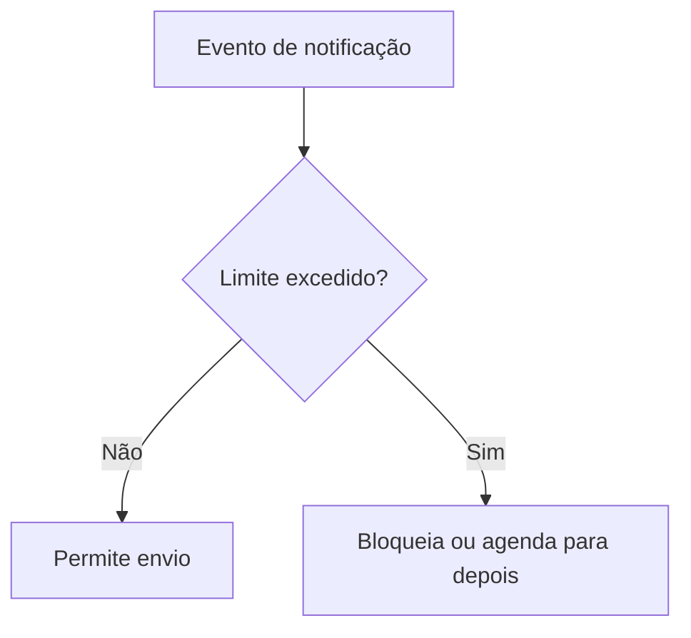

---

## 12.4 Retry mechanism

Quando um serviço terceiro falha, a mensagem não deve ser perdida.

O evento volta para a fila para nova tentativa.

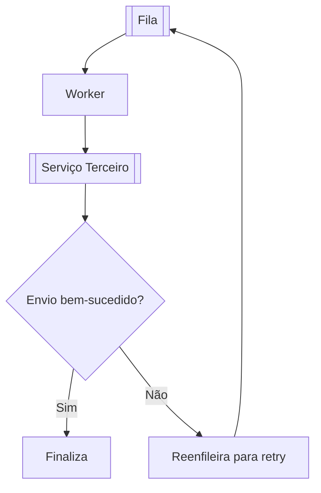

---

## 12.5 Segurança

Para proteger APIs de notificação, o capítulo cita o uso de:

* `appKey`;
* `appSecret`;
* autenticação de clientes;
* autorização para impedir abuso ou spam.

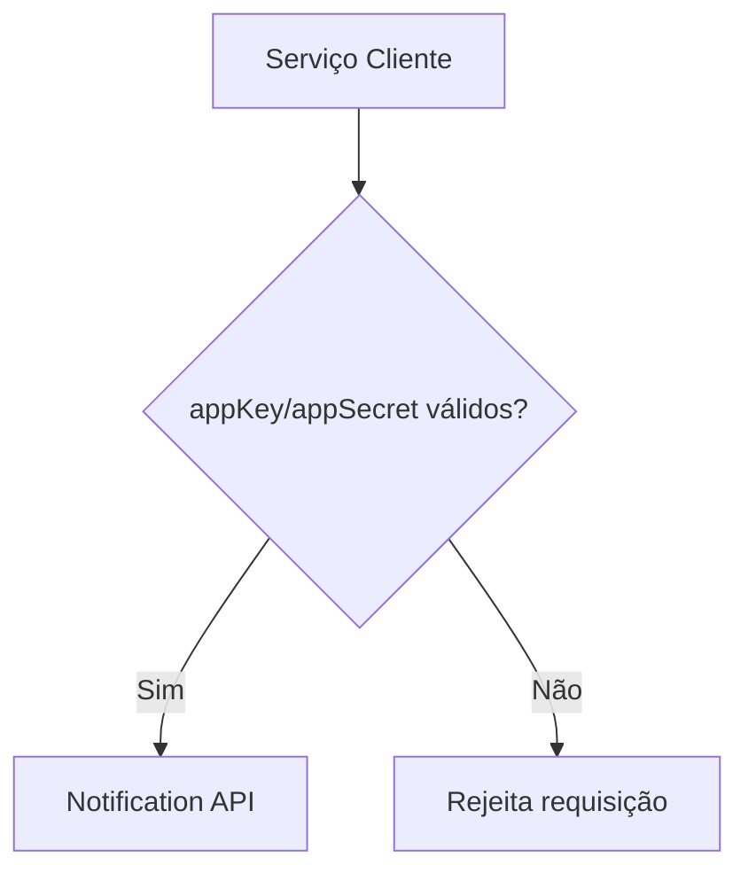

---

## 12.6 Monitoramento de filas

Uma métrica importante é a quantidade de mensagens acumuladas nas filas.

Se a fila cresce demais, pode indicar:

* poucos workers;
* falha em serviço terceiro;
* pico de carga;
* gargalo no processamento.

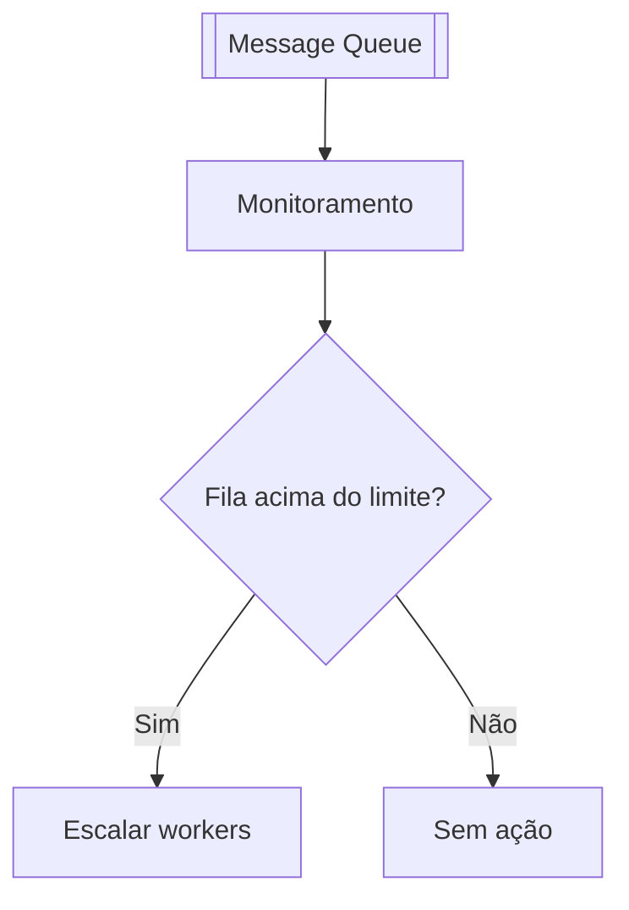

---

## 12.7 Rastreamento de eventos

O sistema deve rastrear eventos importantes para analytics, como:

* pending;
* sent;
* delivered;
* click;
* unsubscribe;
* error.

```mermaid
stateDiagram-v2
    [*] --> Pending
    Pending --> Sent
    Pending --> Error
    Sent --> Delivered
    Sent --> Error
    Delivered --> Click
    Delivered --> Unsubscribe
```

Esses eventos ajudam a medir:

* taxa de abertura;
* taxa de clique;
* engajamento;
* falhas de entrega;
* cancelamentos de inscrição.

---

# 13. Design final atualizado

O design final combina:

* servidores de notificação;
* autenticação;
* rate limiting;
* cache;
* banco de dados;
* filas;
* workers;
* templates;
* logs;
* analytics;
* serviços externos;
* tracking de eventos.

```mermaid
flowchart LR
    service[Service N]

    subgraph notificationLayer[Notification Servers]
        ns[Notification Server]
        auth[Authentication]
        rate[Rate Limit]
    end

    cache[(Cache)]
    db[(DB<br/>device setting<br/>user info)]

    queue[[Fila iOS Push]]

    subgraph workerLayer[Processamento]
        worker[Workers]
        template[(Notification Template)]
        log[(Notification Log)]
    end

    analytics[Analytics Service]

    apns[[APNs]]
    ios[Dispositivo iOS]

    service --> ns
    ns --> auth --> rate
    rate --> cache
    rate --> db
    rate --> queue

    queue --> worker
    worker --> template
    worker --> log
    worker --> apns --> ios

    ns -->|send pending| analytics
    worker -->|sent| analytics
    ios -->|click tracking| analytics

    worker -. retry on error .-> queue
```

---

# 14. Decisões arquiteturais principais

| Decisão                            | Justificativa                                                |
| ---------------------------------- | ------------------------------------------------------------ |
| Usar filas por tipo de notificação | Isola falhas e melhora escalabilidade                        |
| Usar workers                       | Permite processamento assíncrono e horizontalmente escalável |
| Usar cache                         | Reduz consultas repetidas ao banco                           |
| Persistir notification log         | Evita perda de rastreabilidade                               |
| Usar templates                     | Padroniza e acelera criação de mensagens                     |
| Aplicar rate limiting              | Evita excesso de notificações ao usuário                     |
| Respeitar opt-out                  | Atende preferência do usuário                                |
| Usar autenticação                  | Evita abuso das APIs internas                                |
| Monitorar filas                    | Detecta gargalos e necessidade de escala                     |
| Rastrear eventos                   | Permite analytics e melhoria contínua                        |

---

# 15. Resumo final

O capítulo apresenta a evolução de um sistema simples de notificações para uma arquitetura escalável e resiliente.

A arquitetura final suporta múltiplos canais:

* push iOS;
* push Android;
* SMS;
* email.

E adiciona recursos essenciais:

* filas de mensagens;
* workers;
* retry;
* cache;
* banco de dados;
* notification log;
* deduplicação;
* templates;
* configurações por usuário;
* rate limiting;
* autenticação;
* monitoramento;
* rastreamento de eventos.

A ideia central é que o sistema de notificações não deve enviar tudo diretamente de forma síncrona. Ele deve receber solicitações, validar, buscar dados, publicar em filas e deixar workers especializados realizarem o envio para serviços externos.
