# Capítulo 11 — Design de um Sistema de Feed de Notícias

## 1. Objetivo do sistema

Um **feed de notícias** é a lista de histórias exibidas continuamente na página inicial de uma aplicação social. Ele pode conter:

* publicações de texto;
* imagens;
* vídeos;
* links;
* atividades de aplicativos;
* curtidas;
* páginas seguidas;
* pessoas seguidas;
* recomendações.

Exemplos comuns desse tipo de sistema são:

* feed do Facebook;
* timeline do Instagram;
* timeline do Twitter/X.

O objetivo deste capítulo é projetar um sistema capaz de permitir que usuários publiquem conteúdo e vejam publicações de seus amigos em ordem cronológica reversa.

---

## 2. Entendimento do problema

Antes de desenhar a arquitetura, é necessário definir o escopo.

### 2.1 Perguntas de clarificação

| Pergunta                             | Resposta assumida                            |
| ------------------------------------ | -------------------------------------------- |
| O sistema será mobile, web ou ambos? | Ambos                                        |
| Quais funcionalidades principais?    | Publicar posts e visualizar posts dos amigos |
| Como o feed será ordenado?           | Ordem cronológica reversa                    |
| Quantos amigos um usuário pode ter?  | Até 5.000                                    |
| Qual o volume de tráfego?            | 10 milhões de usuários ativos diários        |
| O feed aceita mídia?                 | Sim, imagens e vídeos                        |

### 2.2 Requisitos funcionais

O sistema deve permitir que:

1. o usuário publique um post;
2. o post seja persistido;
3. o post seja distribuído para os feeds dos amigos;
4. os amigos recebam notificação de novo conteúdo;
5. o usuário consulte seu feed;
6. o feed seja retornado em ordem cronológica reversa;
7. posts possam conter texto, imagens e vídeos.

### 2.3 Requisitos não funcionais

O sistema deve priorizar:

* baixa latência na leitura do feed;
* alta disponibilidade;
* escalabilidade horizontal;
* tolerância a picos de tráfego;
* uso intensivo de cache;
* separação entre escrita e leitura;
* desacoplamento com filas de mensagens.

---

# 3. APIs principais

O capítulo apresenta duas APIs essenciais:

1. API de publicação de feed;
2. API de recuperação do feed.

---

## 3.1 API de publicação de post

```http
POST /v1/me/feed
```

### Parâmetros

| Parâmetro    | Descrição                                |
| ------------ | ---------------------------------------- |
| `content`    | Conteúdo textual do post                 |
| `auth_token` | Token usado para autenticar a requisição |

### Exemplo conceitual

```json
{
  "content": "Hello",
  "auth_token": "token-do-usuario"
}
```

---

## 3.2 API de recuperação do feed

```http
GET /v1/me/feed
```

### Parâmetros

| Parâmetro    | Descrição                                |
| ------------ | ---------------------------------------- |
| `auth_token` | Token usado para autenticar a requisição |

### Exemplo conceitual

```http
GET /v1/me/feed?auth_token=token-do-usuario
```

---

# 4. Visão geral da arquitetura

O design é dividido em dois fluxos principais:

1. **Publicação de feed**
2. **Construção e recuperação do feed**

---

## 4.1 Fluxo de publicação de feed

Quando um usuário publica um post:

1. a requisição passa pelo DNS;
2. chega ao load balancer;
3. é encaminhada para os servidores web;
4. os servidores web validam autenticação e limites de uso;
5. o serviço de post grava o conteúdo;
6. o serviço de fanout distribui o post para os feeds dos amigos;
7. o serviço de notificação avisa os amigos.

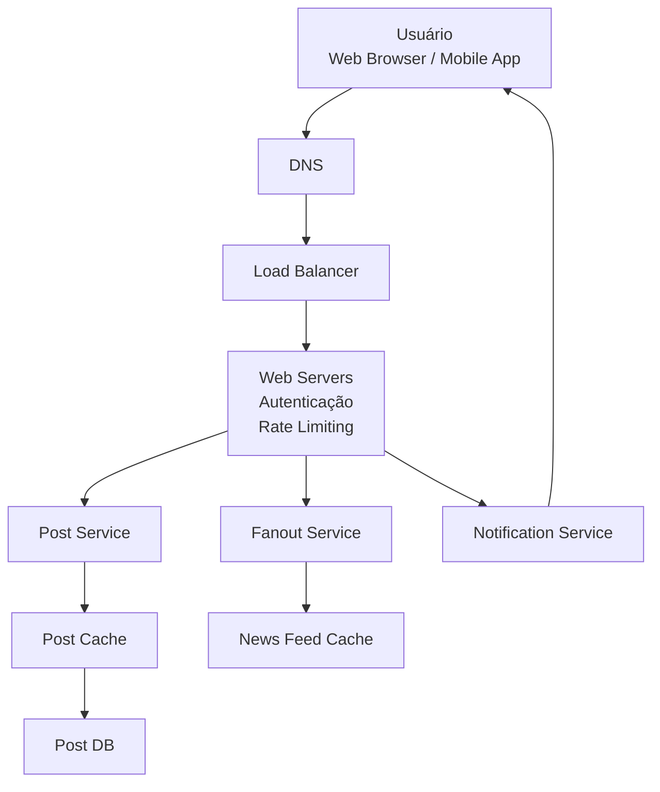

---

## 4.2 Responsabilidades dos componentes

| Componente           | Responsabilidade                                        |
| -------------------- | ------------------------------------------------------- |
| Usuário              | Publica posts e consulta o feed                         |
| DNS                  | Resolve o endereço da aplicação                         |
| Load Balancer        | Distribui tráfego entre servidores web                  |
| Web Servers          | Autenticam, aplicam rate limiting e roteiam requisições |
| Post Service         | Persiste posts no cache e banco                         |
| Post Cache           | Armazena posts recentes ou populares                    |
| Post DB              | Armazena posts de forma durável                         |
| Fanout Service       | Distribui novos posts para os feeds dos amigos          |
| News Feed Cache      | Armazena o feed pré-computado dos usuários              |
| Notification Service | Envia notificações push sobre novos conteúdos           |

---

# 5. Fluxo de recuperação do feed

Quando um usuário abre o feed:

1. o cliente chama `GET /v1/me/feed`;
2. a requisição passa pelo load balancer;
3. os servidores web encaminham para o News Feed Service;
4. o News Feed Service busca IDs de posts no cache;
5. os dados completos dos posts são buscados em caches auxiliares;
6. a resposta é retornada ao cliente em JSON.

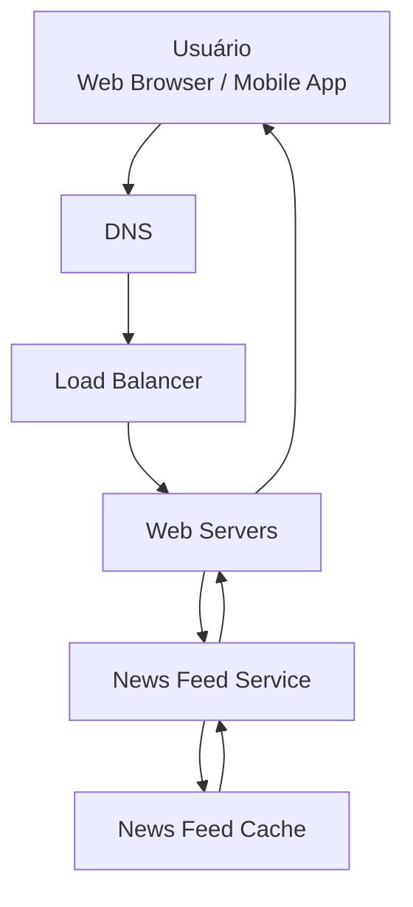

---

# 6. Deep dive: publicação de feed

A publicação é mais complexa do que apenas gravar um post. O sistema precisa:

* autenticar o usuário;
* limitar spam;
* gravar o post;
* descobrir amigos;
* aplicar filtros;
* distribuir o post;
* atualizar caches;
* notificar usuários.

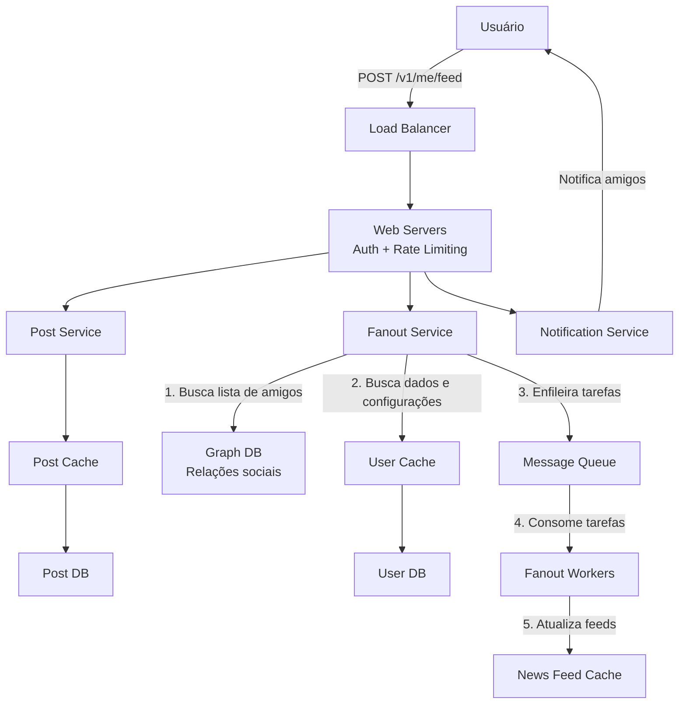

---

## 6.1 Web servers

Os servidores web fazem mais do que apenas encaminhar requisições.

Eles são responsáveis por:

* validar `auth_token`;
* garantir que apenas usuários autenticados publiquem;
* aplicar rate limiting;
* bloquear excesso de publicações;
* reduzir spam;
* encaminhar chamadas para serviços internos.

---

## 6.2 Fanout Service

O **fanout** é o processo de entregar um post para todos os usuários que devem recebê-lo.

Existem dois modelos principais:

1. **Fanout on write**
2. **Fanout on read**

---

# 7. Fanout on write

No modelo **fanout on write**, o feed é pré-computado no momento da escrita.

Ou seja, quando um usuário publica um post, esse post é imediatamente inserido no cache de feed dos seus amigos.

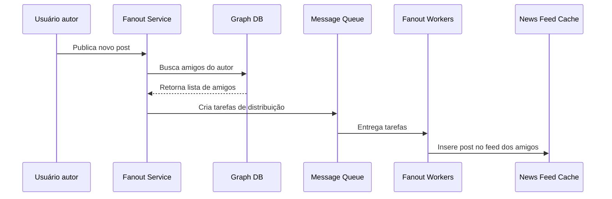

## 7.1 Vantagens

| Vantagem                       | Explicação                              |
| ------------------------------ | --------------------------------------- |
| Leitura rápida                 | O feed já está pronto no cache          |
| Boa experiência para o usuário | O conteúdo aparece rapidamente          |
| Baixa latência na consulta     | Evita montar o feed em tempo de leitura |

## 7.2 Desvantagens

| Desvantagem                        | Explicação                                            |
| ---------------------------------- | ----------------------------------------------------- |
| Alto custo de escrita              | Um único post pode ser copiado para milhares de feeds |
| Problema com usuários famosos      | Celebridades podem ter milhões de seguidores          |
| Desperdício para usuários inativos | O sistema calcula feeds que talvez nunca sejam lidos  |

---

# 8. Fanout on read

No modelo **fanout on read**, o feed é construído apenas quando o usuário abre a página.

Ou seja, o sistema busca os posts dos amigos no momento da leitura.

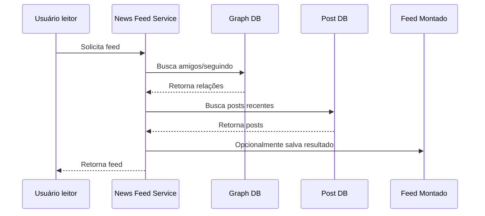

## 8.1 Vantagens

| Vantagem                           | Explicação                                    |
| ---------------------------------- | --------------------------------------------- |
| Menor custo para usuários inativos | Só calcula quando alguém acessa               |
| Melhor para contas muito seguidas  | Evita distribuir para milhões de feeds        |
| Não gera hotkey na escrita         | Reduz concentração de carga em grandes perfis |

## 8.2 Desvantagens

| Desvantagem                    | Explicação                                     |
| ------------------------------ | ---------------------------------------------- |
| Leitura mais lenta             | O feed precisa ser montado na hora             |
| Maior complexidade na consulta | Exige buscar relações e posts em tempo real    |
| Pode gerar latência alta       | Principalmente para usuários com muitos amigos |

---

# 9. Estratégia híbrida

O capítulo recomenda uma abordagem híbrida.

A ideia é combinar os dois modelos:

| Tipo de usuário                           | Estratégia recomendada             |
| ----------------------------------------- | ---------------------------------- |
| Usuários comuns                           | Fanout on write                    |
| Usuários famosos ou com muitos seguidores | Fanout on read                     |
| Usuários inativos                         | Evitar pré-computação excessiva    |
| Usuários ativos                           | Manter feed pré-computado em cache |

Essa abordagem reduz o risco de sobrecarga e melhora a distribuição de carga.

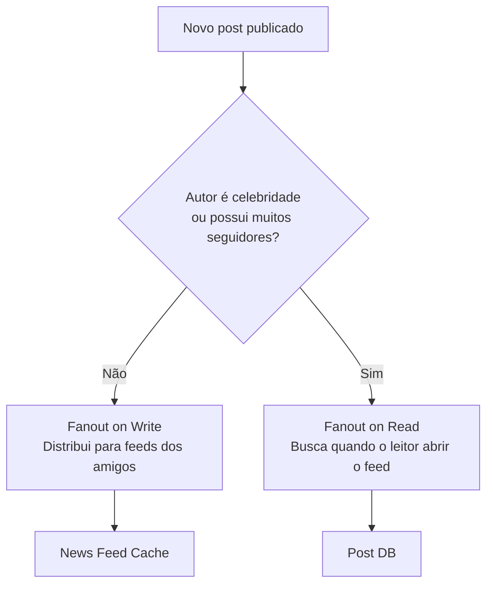

---

# 10. Fluxo detalhado do Fanout Service

O serviço de fanout trabalha em etapas:

1. buscar IDs dos amigos no Graph DB;
2. buscar informações dos usuários no User Cache;
3. filtrar usuários conforme configurações;
4. enviar IDs de amigos e post para fila;
5. workers atualizam o News Feed Cache.

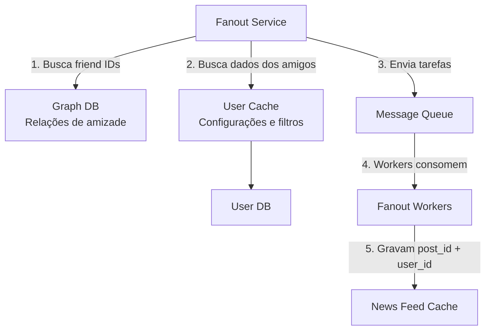

---

## 10.1 Estrutura lógica do News Feed Cache

O cache de feed não precisa armazenar o post completo. Ele pode armazenar apenas referências.

Exemplo:

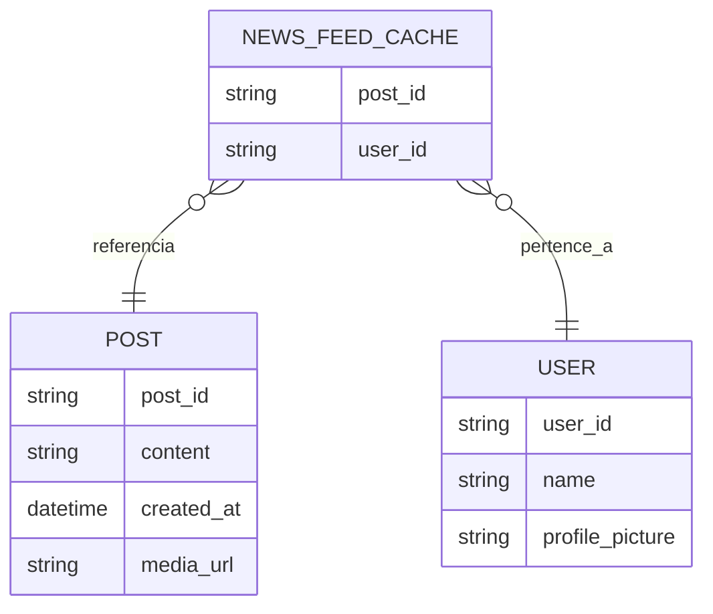

Na prática, o feed de um usuário pode ser uma lista como:

| `post_id` | `user_id` |
| --------- | --------- |
| post_001  | user_100  |
| post_002  | user_100  |
| post_003  | user_100  |
| post_004  | user_100  |

O sistema pode limitar o tamanho desse cache, pois a maioria dos usuários consome apenas os posts mais recentes.

---

# 11. Deep dive: recuperação do feed

No fluxo de leitura, o sistema precisa transformar uma lista de IDs em objetos completos para renderização.

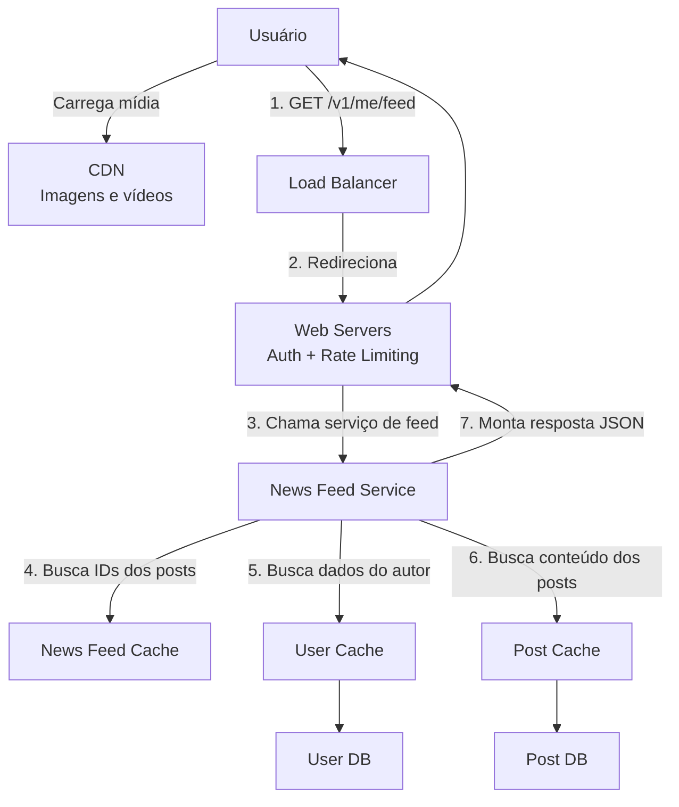

---

## 11.1 Passos da recuperação

| Passo | Descrição                                                |
| ----- | -------------------------------------------------------- |
| 1     | Usuário solicita o feed                                  |
| 2     | Load balancer distribui a requisição                     |
| 3     | Web server chama o News Feed Service                     |
| 4     | News Feed Service busca IDs dos posts no News Feed Cache |
| 5     | Serviço busca dados do usuário no User Cache             |
| 6     | Serviço busca conteúdo dos posts no Post Cache           |
| 7     | Feed completo é retornado em JSON                        |

---

# 12. CDN para mídia

Imagens e vídeos não devem ser servidos diretamente pelos servidores da aplicação.

O conteúdo de mídia deve ser armazenado em uma **CDN** para:

* reduzir latência;
* melhorar distribuição geográfica;
* aliviar servidores internos;
* acelerar carregamento de imagens e vídeos;
* melhorar experiência do usuário.

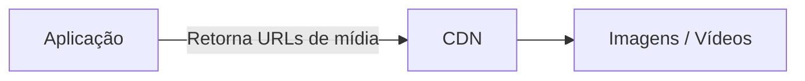

---

# 13. Arquitetura de cache

Cache é uma peça central no sistema de feed.

O capítulo divide o cache em cinco camadas:

1. News Feed
2. Content
3. Social Graph
4. Action
5. Counters

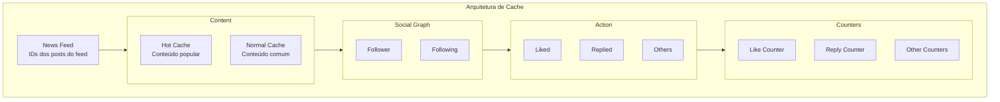

---

## 13.1 Camadas de cache

| Camada       | O que armazena                                      |
| ------------ | --------------------------------------------------- |
| News Feed    | IDs dos posts que compõem o feed                    |
| Content      | Dados dos posts; conteúdo popular fica em hot cache |
| Social Graph | Relações entre usuários, seguidores e seguidos      |
| Action       | Ações do usuário, como curtidas e respostas         |
| Counters     | Contadores de curtidas, respostas, seguidores etc.  |

---

# 14. Banco de dados e escalabilidade

O capítulo menciona alguns pontos importantes para escalar o banco de dados.

## 14.1 Estratégias

| Estratégia              | Descrição                                     |
| ----------------------- | --------------------------------------------- |
| Escala vertical         | Aumentar CPU, memória e disco da máquina      |
| Escala horizontal       | Adicionar mais servidores                     |
| SQL vs NoSQL            | Escolher conforme modelo de consulta e volume |
| Replicação master-slave | Separar escrita e leitura                     |
| Réplicas de leitura     | Reduzir carga no banco principal              |
| Modelos de consistência | Definir consistência forte ou eventual        |
| Sharding                | Particionar dados entre vários nós            |

---

## 14.2 Possível separação de armazenamento

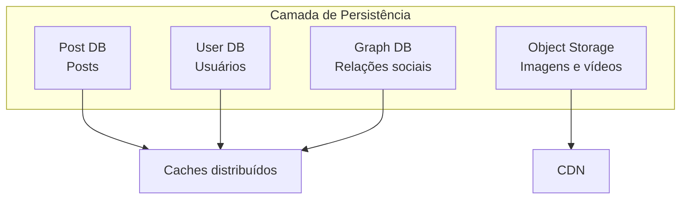

---

# 15. Outros pontos de arquitetura

Além do banco, o capítulo recomenda observar:

| Ponto                   | Motivo                                          |
| ----------------------- | ----------------------------------------------- |
| Web tier stateless      | Facilita escalar servidores web horizontalmente |
| Cache intensivo         | Reduz latência e carga nos bancos               |
| Múltiplos data centers  | Aumenta disponibilidade                         |
| Filas de mensagens      | Desacoplam componentes                          |
| Monitoramento           | Permite acompanhar QPS e latência               |
| Métricas de atualização | Importante medir latência ao atualizar o feed   |

---

# 16. Arquitetura consolidada

Abaixo está uma visão consolidada do sistema inteiro.

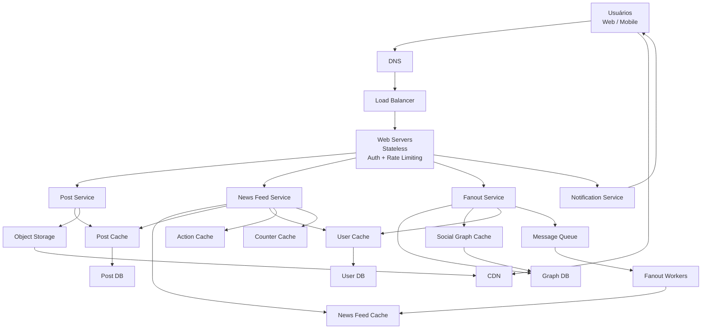

---

# 17. Resumo final

O sistema de feed de notícias é composto por dois grandes fluxos:

| Fluxo       | Objetivo                                            |
| ----------- | --------------------------------------------------- |
| Publicação  | Receber, validar, persistir e distribuir posts      |
| Recuperação | Buscar o feed do usuário de forma rápida e ordenada |

A decisão mais importante está no modelo de fanout.

| Modelo          | Melhor uso                                         |
| --------------- | -------------------------------------------------- |
| Fanout on write | Usuários comuns, leitura rápida                    |
| Fanout on read  | Celebridades, muitos seguidores, usuários inativos |
| Híbrido         | Abordagem mais equilibrada para produção           |

A arquitetura final depende fortemente de:

* cache;
* filas;
* CDN;
* bancos especializados;
* servidores stateless;
* monitoramento;
* particionamento de dados;
* replicação;
* múltiplos data centers.

O ponto central é que o feed deve ser rápido para ler, mesmo que isso aumente a complexidade na escrita.
