# Capítulo 12 — Design de um Sistema de Chat

Documentação baseada no PDF do Capítulo 12, que trata do design de um sistema de chat semelhante a WhatsApp, Facebook Messenger, WeChat, Line ou Discord. 

---

## 1. Objetivo do capítulo

O objetivo é projetar um sistema de chat escalável, com suporte a mensagens em tempo real, conversas individuais, grupos pequenos, presença online, múltiplos dispositivos e notificações push.

O foco principal do capítulo não é criar todas as funcionalidades de um aplicativo real completo, mas desenhar a arquitetura central de comunicação.

---

## 2. Requisitos do sistema

### Requisitos funcionais

O sistema deve suportar:

| Requisito              | Descrição                                                 |
| ---------------------- | --------------------------------------------------------- |
| Chat 1 para 1          | Um usuário envia mensagem diretamente para outro usuário  |
| Chat em grupo          | Grupo com limite máximo de 100 participantes              |
| Indicador de presença  | Mostrar se o usuário está online ou offline               |
| Múltiplos dispositivos | O mesmo usuário pode estar logado em celular e computador |
| Notificação push       | Usuário offline recebe notificação                        |
| Histórico de mensagens | As mensagens devem ser armazenadas indefinidamente        |
| Mensagens de texto     | O sistema suporta apenas texto neste escopo               |

Fora do escopo inicial:

| Item                       | Situação                                |
| -------------------------- | --------------------------------------- |
| Anexos                     | Não suportado neste design              |
| Criptografia ponta a ponta | Não será considerada inicialmente       |
| Áudio/vídeo                | Não faz parte do escopo                 |
| Grupos muito grandes       | O foco é grupo pequeno, até 100 pessoas |

### Escala definida

O sistema será projetado para:

```text
50 milhões de usuários ativos diários - DAU
```

---

## 3. Visão geral da comunicação

Clientes não se comunicam diretamente entre si. Toda mensagem passa pelo serviço de chat.

Fluxo conceitual:

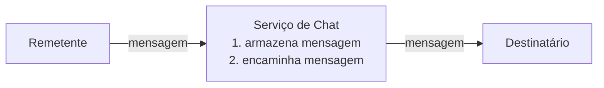

O serviço de chat precisa:

1. Receber mensagens dos clientes.
2. Identificar os destinatários corretos.
3. Encaminhar mensagens para usuários online.
4. Guardar mensagens para usuários offline.
5. Sincronizar mensagens entre múltiplos dispositivos.

---

## 4. Escolha do protocolo de comunicação

Para envio de mensagens do cliente para o servidor, HTTP com keep-alive poderia funcionar. O problema maior está no sentido contrário: o servidor precisa entregar mensagens ao cliente assim que elas chegam.

Como HTTP tradicional é iniciado pelo cliente, o servidor não consegue “empurrar” mensagens para o cliente sem algum mecanismo adicional.

O capítulo compara três alternativas:

1. Polling.
2. Long polling.
3. WebSocket.

---

## 5. Polling

No polling, o cliente pergunta periodicamente ao servidor se existem novas mensagens.

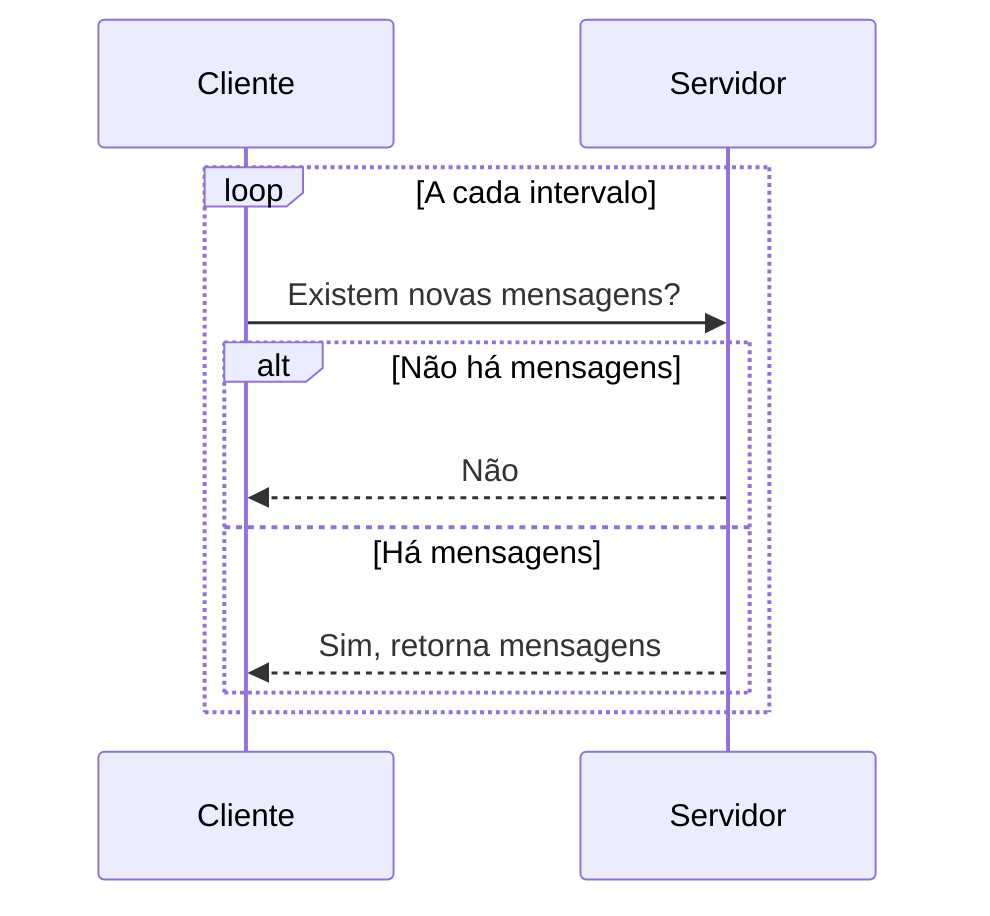

### Problema do polling

Polling é simples, mas pode ser ineficiente.

Se o cliente pergunta a cada poucos segundos e quase nunca há mensagens novas, o servidor desperdiça recursos respondendo várias requisições inúteis.

---

## 6. Long polling

No long polling, o cliente abre uma requisição e o servidor mantém essa conexão aberta até que exista uma nova mensagem ou até ocorrer timeout.

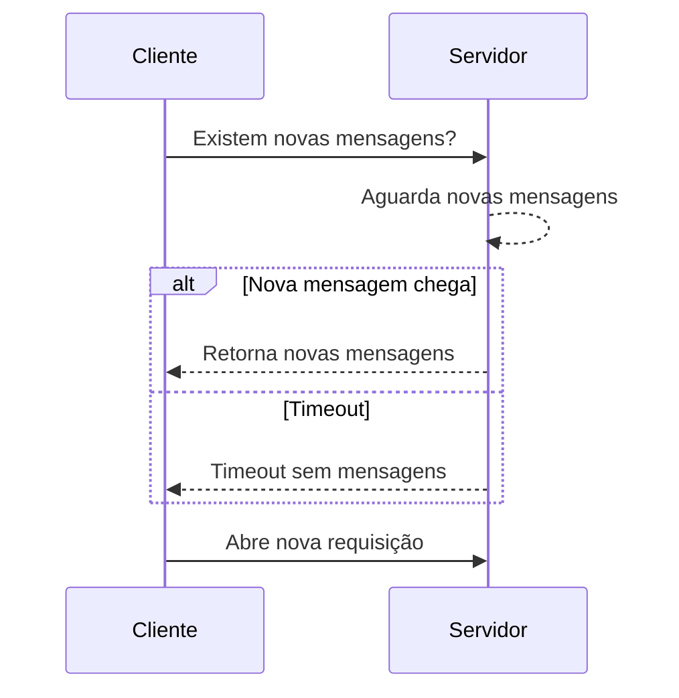

### Vantagens

Reduz chamadas desnecessárias quando comparado ao polling tradicional.

### Limitações

O long polling ainda tem problemas importantes:

| Problema                        | Explicação                                                                  |
| ------------------------------- | --------------------------------------------------------------------------- |
| Balanceamento de carga          | O remetente e o destinatário podem estar conectados a servidores diferentes |
| Detecção de desconexão          | O servidor pode não saber rapidamente que o cliente caiu                    |
| Ineficiência em baixa atividade | Mesmo sem mensagens, o cliente precisa renovar conexões após timeout        |
| Complexidade operacional        | Cada requisição fica presa por mais tempo no servidor                       |

---

## 7. WebSocket

WebSocket é a alternativa escolhida no capítulo.

Ele começa como uma conexão HTTP normal e depois é promovido para uma conexão persistente e bidirecional.

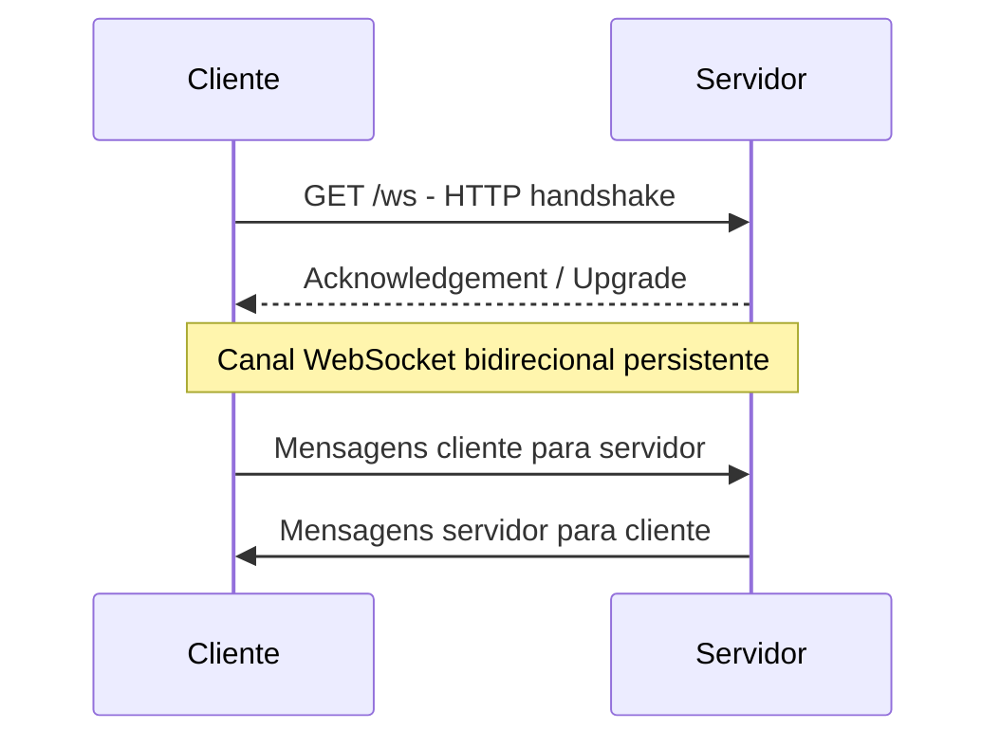

### Por que WebSocket é adequado?

| Característica            | Benefício                                   |
| ------------------------- | ------------------------------------------- |
| Conexão persistente       | Evita abrir e fechar conexões repetidamente |
| Bidirecional              | Cliente e servidor podem enviar mensagens   |
| Baixa latência            | Mensagens chegam em tempo quase real        |
| Funciona sobre HTTP/HTTPS | Normalmente usa portas 80 ou 443            |
| Simplifica o design       | Pode ser usado para envio e recebimento     |

No design do capítulo, WebSocket é usado tanto pelo remetente quanto pelo destinatário.

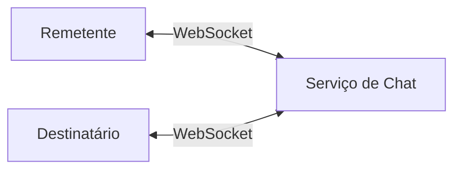

---

## 8. Separação entre serviços stateless e stateful

Nem tudo precisa usar WebSocket.

Funcionalidades como login, cadastro, perfil e gerenciamento de grupos podem continuar usando HTTP tradicional.

O sistema é separado em três grandes categorias:

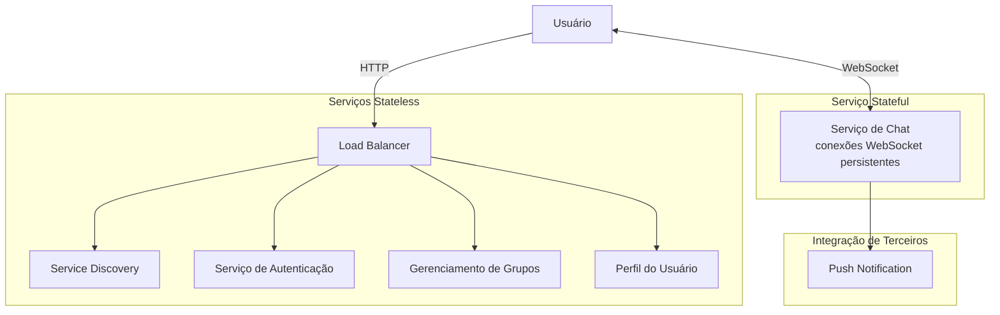

### Serviços stateless

São serviços tradicionais de requisição e resposta.

Exemplos:

| Serviço                 | Responsabilidade                   |
| ----------------------- | ---------------------------------- |
| Autenticação            | Login e validação de usuário       |
| Perfil                  | Dados do usuário                   |
| Gerenciamento de grupos | Criação e manutenção de grupos     |
| Service discovery       | Escolher o melhor servidor de chat |

Esses serviços podem ficar atrás de um load balancer.

### Serviço stateful

O serviço de chat é stateful porque mantém conexões WebSocket persistentes com os clientes.

Um cliente normalmente permanece conectado ao mesmo servidor de chat enquanto a conexão estiver ativa.

### Integração de terceiros

Notificações push são tratadas como integração externa.

Quando o usuário está offline, o sistema pode enviar uma notificação por meio de serviços de push notification.

---

## 9. Arquitetura de alto nível

A arquitetura ajustada do capítulo separa:

1. API servers.
2. Chat servers.
3. Presence servers.
4. Notification servers.
5. KV stores.
6. Load balancer.
7. Service discovery.

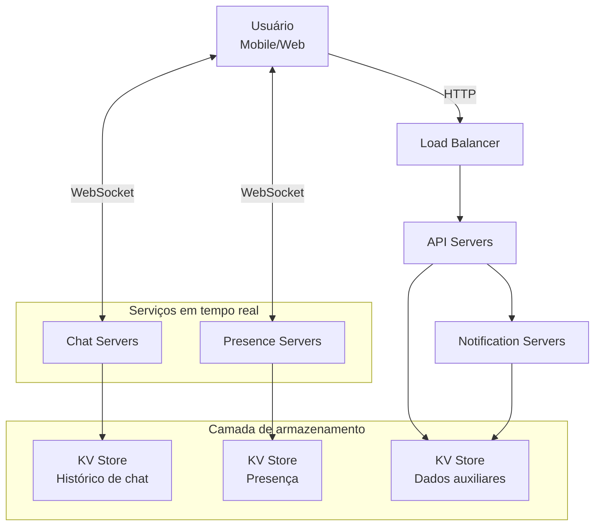

### Responsabilidades principais

| Componente           | Responsabilidade                                       |
| -------------------- | ------------------------------------------------------ |
| API servers          | Login, cadastro, perfil, grupos e operações HTTP       |
| Chat servers         | Envio e recebimento de mensagens em tempo real         |
| Presence servers     | Controle de online/offline                             |
| Notification servers | Envio de notificações push                             |
| KV store             | Armazenamento de histórico, estado e dados de presença |
| Load balancer        | Distribuição de tráfego HTTP                           |
| Service discovery    | Escolha do servidor de chat adequado                   |

---

## 10. Camada de armazenamento

O capítulo separa os dados em dois tipos.

### Dados genéricos

Exemplos:

| Tipo de dado      | Exemplo                  |
| ----------------- | ------------------------ |
| Perfil de usuário | Nome, foto, preferências |
| Configurações     | Preferências do app      |
| Lista de amigos   | Relações entre usuários  |

Esses dados podem ser armazenados em banco relacional.

### Dados de chat

Exemplos:

| Tipo de dado        | Exemplo                           |
| ------------------- | --------------------------------- |
| Mensagens           | Conteúdo, remetente, destinatário |
| Histórico           | Conversas antigas                 |
| Mensagens de grupos | Mensagens por canal/grupo         |

Para mensagens, o capítulo recomenda key-value stores.

Motivos:

1. Escalam horizontalmente.
2. Oferecem baixa latência.
3. Funcionam bem com grande volume de dados.
4. São usados em sistemas reais de chat.
5. Evitam problemas de índices muito grandes em bancos relacionais.

Exemplos citados pelo capítulo:

| Sistema            | Tecnologia citada |
| ------------------ | ----------------- |
| Facebook Messenger | HBase             |
| Discord            | Cassandra         |

---

## 11. Modelo de dados para chat 1 para 1

Tabela conceitual de mensagens individuais:

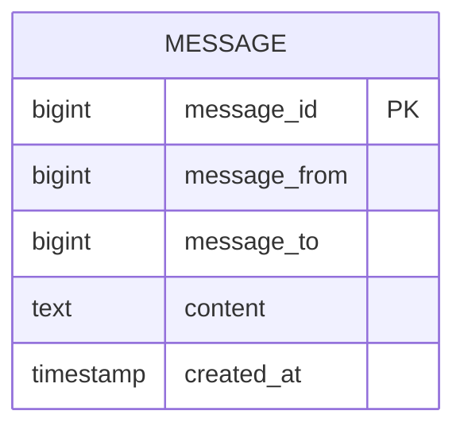

### Observação importante

O campo `created_at` não deve ser usado para definir a ordem das mensagens, porque duas mensagens podem ser criadas no mesmo timestamp.

Por isso, o `message_id` também precisa ajudar na ordenação.

---

## 12. Modelo de dados para chat em grupo

Tabela conceitual de mensagens em grupo:

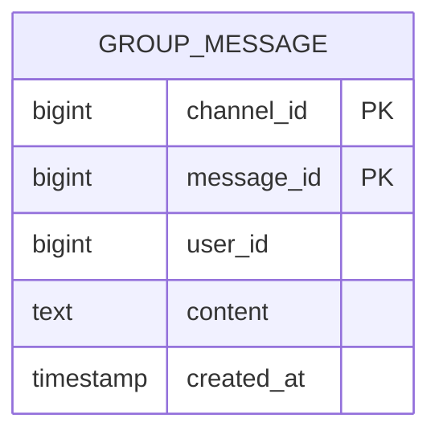

No modelo de grupo:

| Campo        | Papel                                          |
| ------------ | ---------------------------------------------- |
| `channel_id` | Identifica o grupo ou canal                    |
| `message_id` | Identifica e ordena a mensagem dentro do grupo |
| `user_id`    | Usuário que enviou a mensagem                  |
| `content`    | Texto da mensagem                              |
| `created_at` | Data/hora de criação                           |

A chave composta é:

```text
(channel_id, message_id)
```

O `channel_id` funciona como chave de partição. Todas as mensagens de um mesmo grupo ficam agrupadas logicamente.

---

## 13. Geração de `message_id`

O `message_id` tem duas responsabilidades:

1. Ser único.
2. Ser ordenável por tempo.

Ou seja, mensagens novas devem ter IDs maiores que mensagens antigas.

### Alternativas

| Alternativa             | Comentário                                                      |
| ----------------------- | --------------------------------------------------------------- |
| `auto_increment`        | Simples em banco relacional, mas nem sempre existe em NoSQL     |
| Gerador global 64-bit   | Exemplo: Snowflake                                              |
| Gerador local por canal | Mais simples; IDs únicos apenas dentro de uma conversa ou grupo |

O capítulo considera aceitável usar gerador local por canal, porque a ordenação só precisa ser garantida dentro de uma conversa individual ou dentro de um grupo.

---

## 14. Service discovery

O service discovery escolhe o melhor servidor de chat para o cliente.

Critérios possíveis:

| Critério               | Exemplo                          |
| ---------------------- | -------------------------------- |
| Localização geográfica | Servidor mais próximo            |
| Capacidade             | Servidor menos carregado         |
| Disponibilidade        | Servidor saudável                |
| Balanceamento          | Distribuir conexões persistentes |

O capítulo cita Apache ZooKeeper como exemplo de tecnologia para coordenar servidores disponíveis.

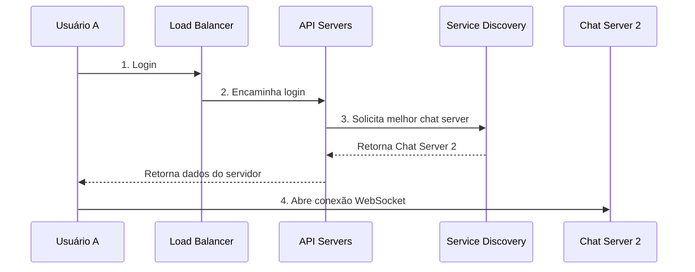

---

## 15. Fluxo de mensagem 1 para 1

Quando o Usuário A envia uma mensagem para o Usuário B:

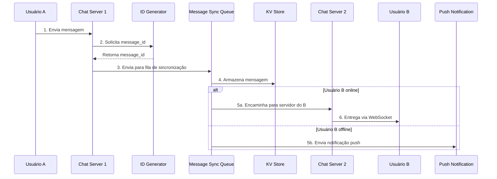

### Explicação

1. Usuário A envia mensagem ao seu chat server.
2. O servidor gera ou obtém um `message_id`.
3. A mensagem entra em uma fila de sincronização.
4. A mensagem é persistida no KV store.
5. Se o destinatário estiver online, a mensagem é encaminhada.
6. Se estiver offline, uma notificação push é enviada.

---

## 16. Sincronização entre múltiplos dispositivos

O mesmo usuário pode estar conectado em vários dispositivos.

Exemplo:

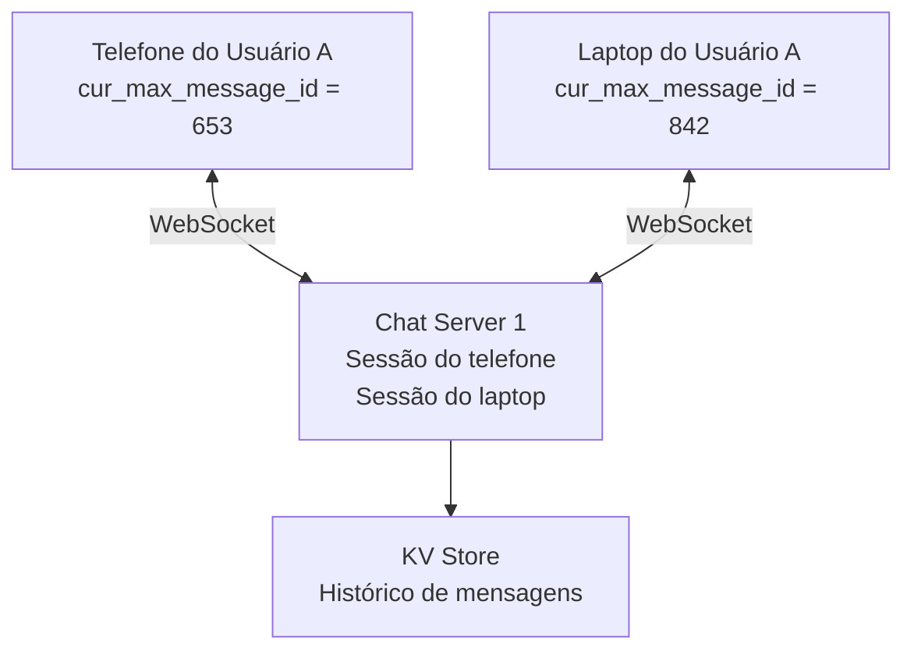

Cada dispositivo mantém uma variável:

```text
cur_max_message_id
```

Ela indica a última mensagem recebida naquele dispositivo.

Uma mensagem é considerada nova para o dispositivo quando:

```text
message_id > cur_max_message_id
```

E o destinatário da mensagem é o usuário logado.

Com isso, cada dispositivo consegue buscar no KV store apenas as mensagens que ainda não recebeu.

---

## 17. Chat em grupo pequeno

Para grupos pequenos, o capítulo usa uma abordagem simples: copiar a mensagem para a fila de cada destinatário.

Exemplo com Usuário A enviando mensagem para um grupo com Usuários B e C:

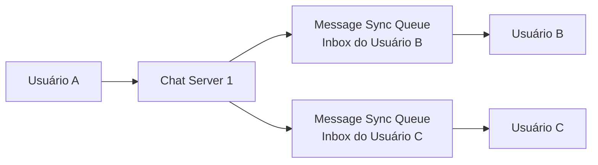

### Vantagens

| Vantagem                 | Explicação                                 |
| ------------------------ | ------------------------------------------ |
| Simplicidade             | Cada cliente só consulta sua própria inbox |
| Reuso do fluxo 1 para 1  | O modelo de entrega fica parecido          |
| Bom para grupos pequenos | O custo de duplicação é aceitável          |

### Limitação

Essa abordagem não escala bem para grupos muito grandes, porque cada mensagem precisa ser copiada para muitos destinatários.

---

## 18. Inbox por destinatário

A fila de sincronização de cada usuário funciona como uma inbox que recebe mensagens de diferentes remetentes.

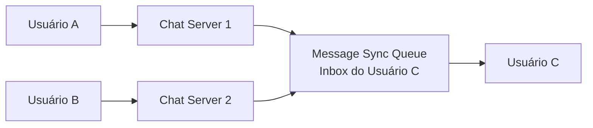

A inbox do Usuário C pode conter mensagens vindas de vários remetentes.

---

## 19. Presença online

A presença online indica se um usuário está disponível no momento.

O capítulo trata três fluxos principais:

1. Login.
2. Logout.
3. Desconexão inesperada.

---

## 20. Presença no login

Quando o usuário faz login e estabelece WebSocket, o sistema registra o status online.

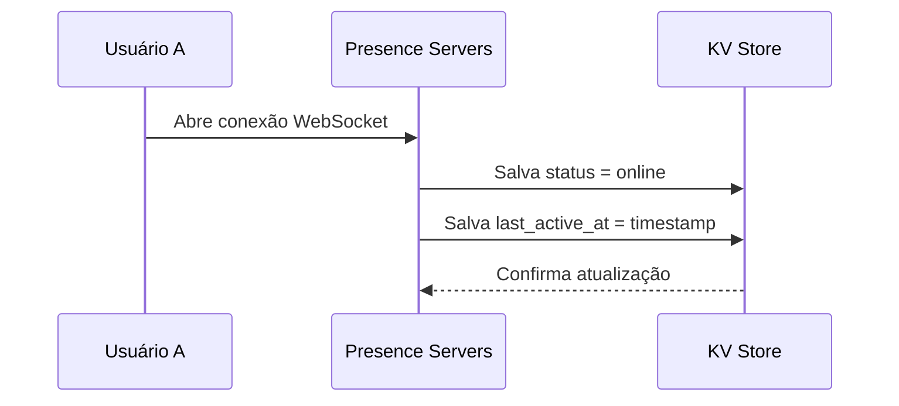

Estado salvo:

```text
User A {
  status: online,
  last_active_at: timestamp
}
```

---

## 21. Presença no logout

Quando o usuário faz logout explicitamente, o status é alterado para offline.

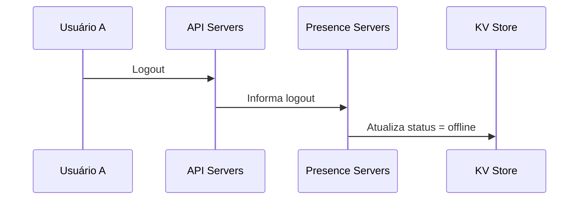

Estado final:

```text
User A {
  status: offline
}
```

---

## 22. Desconexão inesperada e heartbeat

Nem sempre o usuário faz logout corretamente. A internet pode cair, o app pode fechar ou o dispositivo pode perder conexão.

Se o sistema marcasse o usuário como offline imediatamente após qualquer queda, a experiência seria ruim, porque conexões móveis oscilam com frequência.

Por isso, o capítulo usa heartbeat.

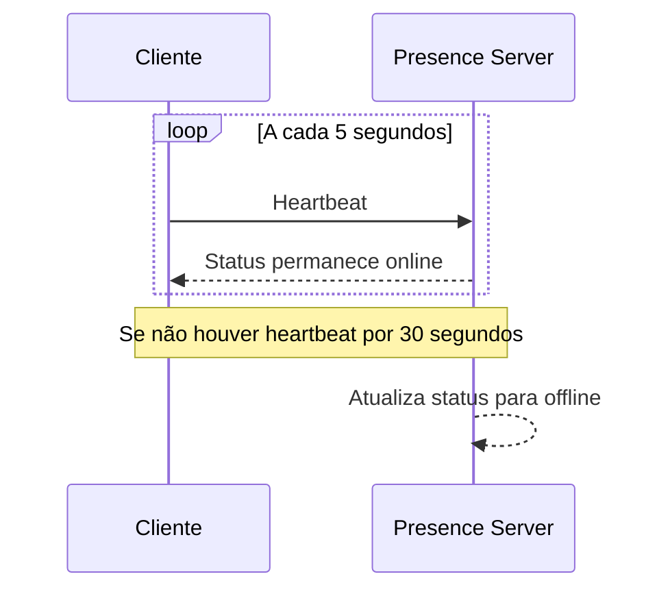

Regra do capítulo:

```text
Cliente envia heartbeat a cada 5 segundos.
Se o servidor não receber heartbeat por 30 segundos,
o usuário é considerado offline.
```

---

## 23. Fanout de status online

Quando o status de um usuário muda, seus amigos precisam ser informados.

O capítulo apresenta uma abordagem publish-subscribe.

Cada par de amigos mantém um canal.

Exemplo:

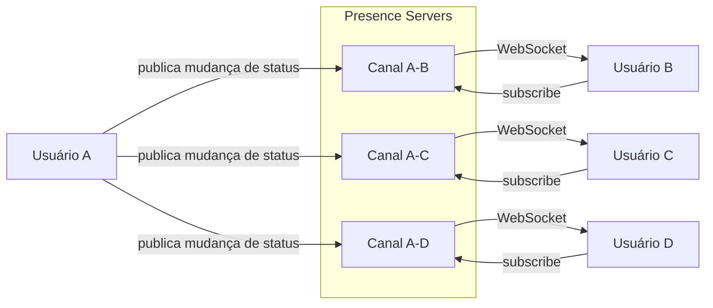

Quando o Usuário A muda de status, o evento é publicado nos canais relacionados a seus amigos.

---

## 24. Limitação do fanout em grupos grandes

A abordagem de fanout funciona bem para grupos pequenos.

Mas em grupos muito grandes, ela se torna cara.

Exemplo:

```text
Grupo com 100.000 membros
1 mudança de status
= 100.000 eventos gerados
```

Para grupos grandes, uma solução melhor é buscar o status online apenas quando:

1. O usuário entra no grupo.
2. O usuário atualiza manualmente a lista.
3. A interface realmente precisa mostrar a informação.

---

## 25. Decisões arquiteturais principais

| Decisão                    | Escolha                                      |
| -------------------------- | -------------------------------------------- |
| Protocolo principal        | WebSocket                                    |
| API tradicional            | HTTP para login, cadastro, perfil e grupos   |
| Serviço de chat            | Stateful                                     |
| Serviços auxiliares        | Stateless                                    |
| Armazenamento de mensagens | Key-value store                              |
| Modelo de presença         | Presence server + KV store                   |
| Entrega offline            | Push notification                            |
| Grupos pequenos            | Copiar mensagem para inbox dos destinatários |
| Grupos grandes             | Evitar fanout massivo de presença            |

---

## 26. Trade-offs

| Tema               | Escolha                  | Vantagem                     | Custo                          |
| ------------------ | ------------------------ | ---------------------------- | ------------------------------ |
| WebSocket          | Conexão persistente      | Baixa latência               | Servidor mantém estado         |
| KV store           | Histórico de mensagens   | Alta escala e baixa latência | Consulta relacional limitada   |
| Inbox por usuário  | Copiar mensagens         | Simples para cliente         | Duplicação de dados            |
| Heartbeat          | Detectar presença        | Evita falso offline          | Tráfego periódico              |
| Fanout de presença | Pub-sub por amizade      | Atualização em tempo real    | Não escala para grupos enormes |
| Service discovery  | Escolher melhor servidor | Melhor distribuição          | Mais componente operacional    |

---

## 27. Resumo final

O sistema de chat proposto usa WebSocket como base para comunicação em tempo real. As operações tradicionais, como login e perfil, continuam usando HTTP. O núcleo do sistema é dividido entre serviços stateless, serviços stateful e integrações externas.

A arquitetura usa chat servers para mensagens, presence servers para status online/offline, notification servers para usuários offline e key-value stores para armazenar o histórico de mensagens.

Para grupos pequenos, o design copia mensagens para a inbox de cada destinatário. Para grupos grandes, essa abordagem precisa ser revista, principalmente no caso de presença online, pois fanout massivo pode gerar custo elevado.

O ponto central do capítulo é entender que um sistema de chat não é apenas envio de mensagens. Ele envolve baixa latência, persistência, sincronização entre dispositivos, controle de presença, entrega offline, balanceamento de conexões persistentes e escalabilidade horizontal.
