# Capítulo 13 — Design de um Sistema de Autocomplete de Busca

> Documentação em português baseada no material enviado para o Capítulo 13: *Design a Search Autocomplete System*. 

---

## 1. Objetivo do sistema

Um sistema de **autocomplete de busca** sugere termos enquanto o usuário digita em uma caixa de pesquisa.

Exemplos comuns:

* Google Search;
* Amazon;
* YouTube;
* marketplaces;
* sistemas internos com busca por produtos, pessoas, processos ou documentos.

A ideia central é retornar rapidamente os termos mais prováveis com base no prefixo digitado.

Exemplo:

```text
Usuário digita: din

Sugestões:
- dinner ideas
- dinner recipes
- dinner near me
- dinner
- dinner tonight
```

Também é conhecido como:

* autocomplete;
* typeahead;
* top-k most searched queries;
* prefix search.

---

## 2. Escopo e requisitos

### 2.1 Premissas da entrevista

O sistema deve sugerir resultados **somente no início da consulta**, ou seja, baseado no prefixo.

Exemplo válido:

```text
Entrada: tw
Sugestões:
- twitter
- twitch
- twilight
```

Não será feito, neste escopo inicial:

* correção ortográfica;
* autocorrect;
* spell check;
* suporte completo a múltiplos idiomas;
* tratamento avançado de letras maiúsculas/minúsculas;
* suporte a caracteres especiais;
* personalização por usuário.

---

## 3. Requisitos funcionais

O sistema deve:

1. receber um prefixo digitado pelo usuário;
2. retornar as **5 consultas mais frequentes** relacionadas ao prefixo;
3. ordenar as sugestões por popularidade;
4. atualizar os dados com base em consultas reais dos usuários;
5. filtrar sugestões inadequadas ou perigosas.

---

## 4. Requisitos não funcionais

| Requisito                  | Descrição                                                                  |
| -------------------------- | -------------------------------------------------------------------------- |
| Baixa latência             | As sugestões devem aparecer quase em tempo real enquanto o usuário digita. |
| Alta disponibilidade       | O sistema deve continuar disponível mesmo com falhas parciais.             |
| Escalabilidade             | Deve suportar grande volume de usuários e consultas.                       |
| Relevância                 | As sugestões precisam estar relacionadas ao prefixo informado.             |
| Ordenação por popularidade | Os resultados mais buscados devem aparecer primeiro.                       |
| Tolerância a falhas        | Falhas em cache, servidores ou banco não devem derrubar toda a busca.      |

---

## 5. Estimativas iniciais

Premissas do capítulo:

| Item                              |      Valor |
| --------------------------------- | ---------: |
| Usuários ativos mensais           | 10 milhões |
| Buscas por usuário por dia        |         10 |
| Tamanho médio da consulta         |   20 bytes |
| Caracteres médios por consulta    |         20 |
| Nova parcela de consultas por dia |        20% |

### 5.1 QPS médio

Cada caractere digitado pode gerar uma requisição ao backend.

```text
QPS = 10.000.000 usuários * 10 consultas/dia * 20 caracteres
      / 24 horas / 3600 segundos

QPS ≈ 24.000
```

### 5.2 Pico de QPS

```text
Pico = QPS médio * 2

Pico ≈ 48.000 QPS
```

### 5.3 Crescimento diário de dados

```text
10.000.000 usuários * 10 consultas/dia * 20 bytes * 20%

≈ 0,4 GB por dia
```

---

## 6. Arquitetura de alto nível

Inicialmente, o sistema é dividido em dois grandes blocos:

1. **Serviço de Coleta de Dados**

   * coleta consultas feitas pelos usuários;
   * agrega frequência das buscas;
   * alimenta a estrutura usada para autocomplete.

2. **Serviço de Consulta**

   * recebe o prefixo digitado;
   * busca as sugestões mais populares;
   * retorna os top 5 resultados.

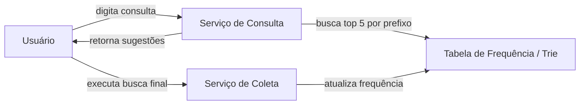

---

## 7. Solução ingênua com tabela de frequência

Uma solução inicial seria armazenar todas as consultas em uma tabela simples:

| Query          | Frequency |
| -------------- | --------: |
| twitter        |        35 |
| twitch         |        29 |
| twilight       |        25 |
| twin peak      |        21 |
| twitch prime   |        18 |
| twitter search |        14 |
| twillo         |        10 |
| twin peak sf   |         8 |

Consulta SQL para prefixo `tw`:

```sql
SELECT *
FROM frequency_table
WHERE query LIKE 'tw%'
ORDER BY frequency DESC
LIMIT 5;
```

### Problema

Essa abordagem funciona para poucos dados, mas não escala bem.

Quando o volume aumenta:

* `LIKE 'prefix%'` fica caro;
* o banco vira gargalo;
* ordenar por frequência a cada requisição é ineficiente;
* o sistema precisa responder a cada caractere digitado.

---

## 8. Estrutura Trie

Para otimizar a busca por prefixo, o capítulo propõe o uso de uma **Trie**.

Uma Trie é uma árvore especializada em armazenar strings por prefixo.

Cada nó representa:

* um caractere;
* uma palavra completa;
* ou um prefixo.

Exemplo com as palavras:

```text
tree
try
true
toy
wish
win
```

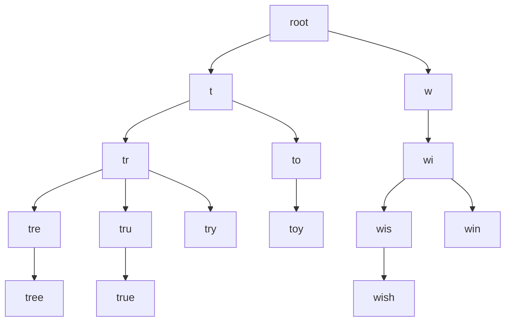

---

## 9. Trie com frequência

Para retornar os termos mais populares, cada nó terminal pode armazenar a frequência da consulta.

Exemplo:

| Query | Frequência |
| ----- | ---------: |
| tree  |         10 |
| try   |         29 |
| true  |         35 |
| toy   |         14 |
| wish  |         25 |
| win   |         50 |

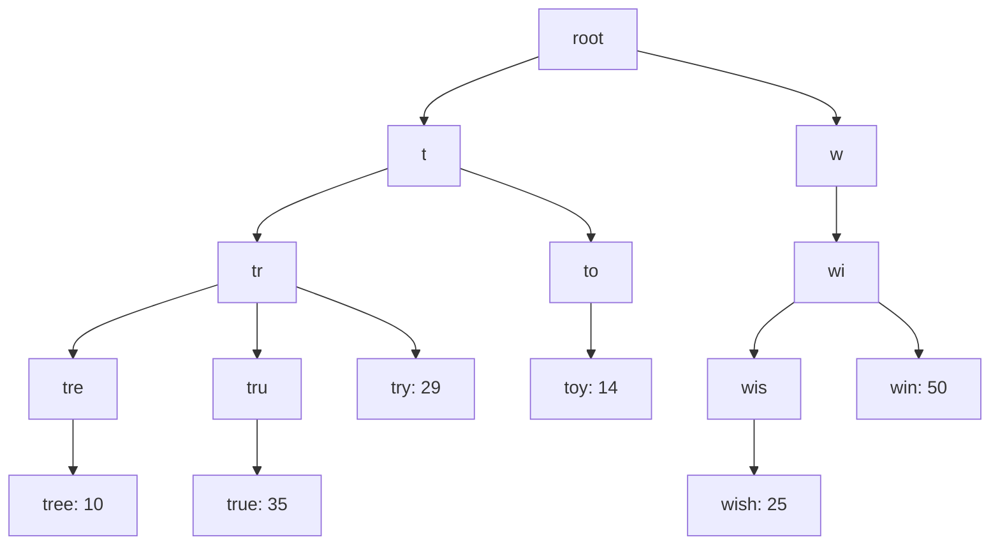

---

## 10. Algoritmo básico para autocomplete

Para obter os top `k` termos mais buscados:

1. Encontrar o nó correspondente ao prefixo.
2. Percorrer a subárvore abaixo desse nó.
3. Coletar todos os termos válidos.
4. Ordenar por frequência.
5. Retornar os top `k`.

Exemplo:

```text
Prefixo: tr
k = 2

Candidatos:
- tree: 10
- true: 35
- try: 29

Resultado:
- true
- try
```

### Complexidade

| Etapa               | Complexidade |
| ------------------- | ------------ |
| Encontrar prefixo   | O(p)         |
| Percorrer subárvore | O(c)         |
| Ordenar candidatos  | O(c log c)   |

Onde:

* `p` = tamanho do prefixo;
* `c` = número de candidatos na subárvore.

Problema: no pior caso, `c` pode ser muito grande.

---

## 11. Otimizações da Trie

O capítulo apresenta duas otimizações principais.

---

### 11.1 Limitar o tamanho máximo do prefixo

Como o usuário raramente digita consultas muito longas antes de receber sugestões, podemos limitar o tamanho máximo considerado.

Exemplo:

```text
Tamanho máximo do prefixo = 50 caracteres
```

Assim, a busca pelo prefixo passa a ser tratada como custo constante na prática.

```text
O(p) => O(1)
```

---

### 11.2 Armazenar top sugestões em cada nó

Em vez de percorrer toda a subárvore a cada consulta, cada nó da Trie pode armazenar previamente os top `k` resultados para aquele prefixo.

Exemplo:

```text
Nó "be" armazena:
- best: 35
- bet: 29
- bee: 20
- be: 15
- beer: 10
```

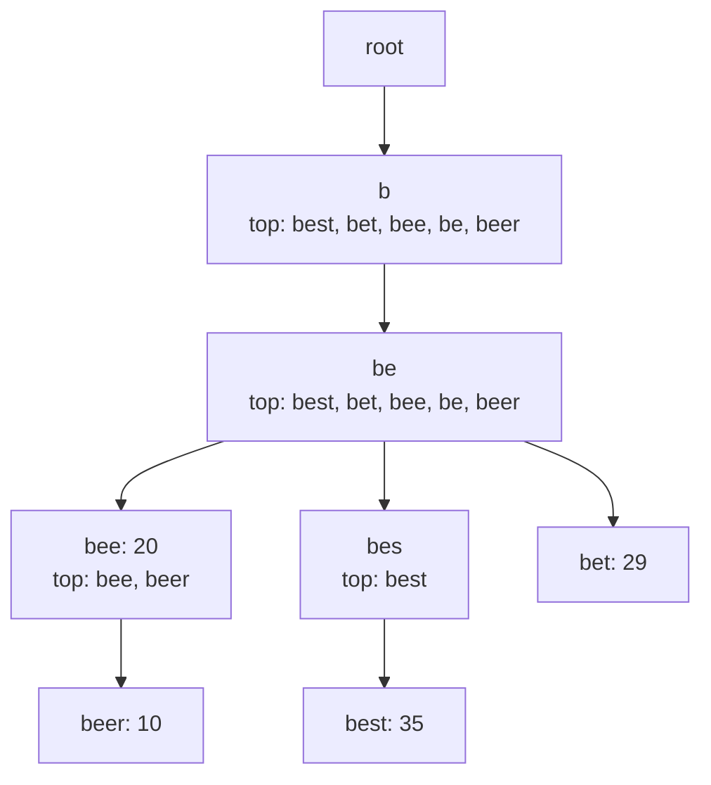

Com essa otimização:

| Etapa             | Complexidade     |
| ----------------- | ---------------- |
| Encontrar prefixo | O(1), na prática |
| Retornar top k    | O(1)             |

A leitura fica extremamente rápida.

### Trade-off

Essa melhoria consome mais memória, porque cada nó passa a guardar uma lista de sugestões.

---

## 12. Serviço de coleta de dados

A primeira ideia seria atualizar a Trie em tempo real a cada consulta feita pelo usuário.

Mas isso não é eficiente porque:

* milhões de usuários podem gerar bilhões de atualizações;
* atualizar a Trie em tempo real degrada o serviço de consulta;
* rankings de autocomplete não precisam mudar a cada segundo;
* atualizar periodicamente é suficiente para muitos cenários.

---

## 13. Arquitetura de coleta escalável

A versão mais escalável usa processamento assíncrono.

Fluxo:

1. Usuários fazem buscas.
2. As consultas são gravadas em logs analíticos.
3. Agregadores processam os logs.
4. Dados agregados são salvos.
5. Workers constroem uma nova Trie.
6. A Trie é persistida no banco.
7. Um snapshot é carregado no cache.

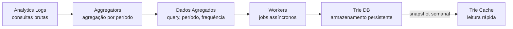

---

## 14. Logs analíticos

Os logs armazenam eventos brutos de busca.

Exemplo:

| Query | Time                |
| ----- | ------------------- |
| tree  | 2019-10-01 22:01:01 |
| try   | 2019-10-01 22:01:05 |
| tree  | 2019-10-01 22:01:30 |
| toy   | 2019-10-01 22:02:22 |
| tree  | 2019-10-02 22:02:42 |
| try   | 2019-10-03 22:03:03 |

Esses dados são append-only, ou seja, novos registros são adicionados, mas os antigos não são alterados.

---

## 15. Dados agregados

Os agregadores consolidam as buscas por período.

Exemplo semanal:

| Query | Time       | Frequency |
| ----- | ---------- | --------: |
| tree  | 2019-10-01 |     12000 |
| tree  | 2019-10-08 |     15000 |
| tree  | 2019-10-15 |      9000 |
| toy   | 2019-10-01 |      8500 |
| toy   | 2019-10-08 |      6256 |
| toy   | 2019-10-15 |      8866 |

Esses dados são usados pelos workers para reconstruir a Trie.

---

## 16. Armazenamento da Trie

O capítulo apresenta duas opções principais.

---

### 16.1 Document Store

A Trie pode ser serializada e armazenada como documento.

Exemplo de tecnologias:

* MongoDB;
* bancos orientados a documento.

Vantagem:

* simples de armazenar;
* bom para dados semi-estruturados.

Desvantagem:

* pode ser ruim para atualizações parciais;
* documentos grandes podem ser difíceis de manipular.

---

### 16.2 Key-Value Store

Outra opção é representar cada nó da Trie como uma entrada chave-valor.

Exemplo:

| Key  | Value                                   |
| ---- | --------------------------------------- |
| b    | `[be: 15, bee: 20, beer: 10, best: 35]` |
| be   | `[be: 15, bee: 20, beer: 10, best: 35]` |
| bee  | `[bee: 20, beer: 10]`                   |
| beer | `[beer: 10]`                            |
| best | `[best: 35]`                            |

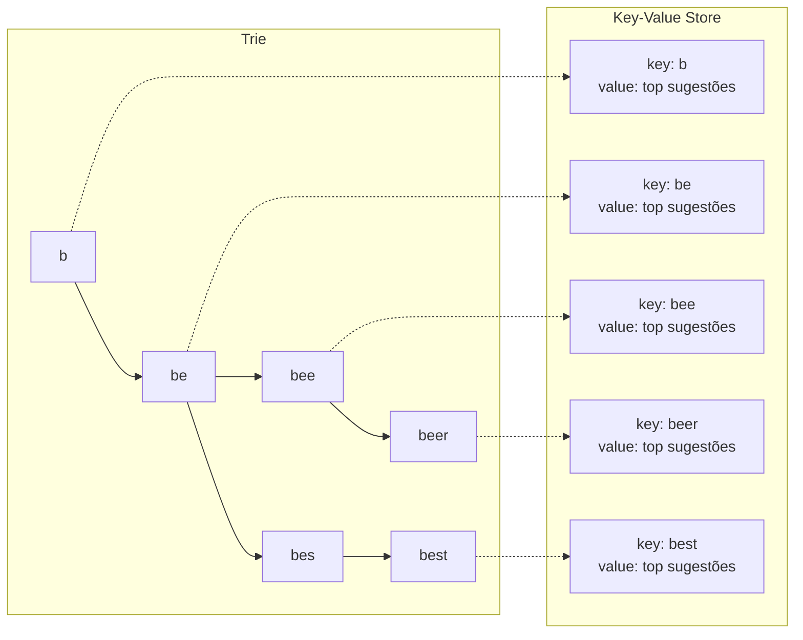

Essa abordagem é boa para leitura rápida e distribuição horizontal.

---

## 17. Serviço de consulta otimizado

A versão otimizada não consulta diretamente a tabela de frequência a cada requisição.

Ela usa:

* Load Balancer;
* API Servers;
* Trie Cache;
* Trie DB.

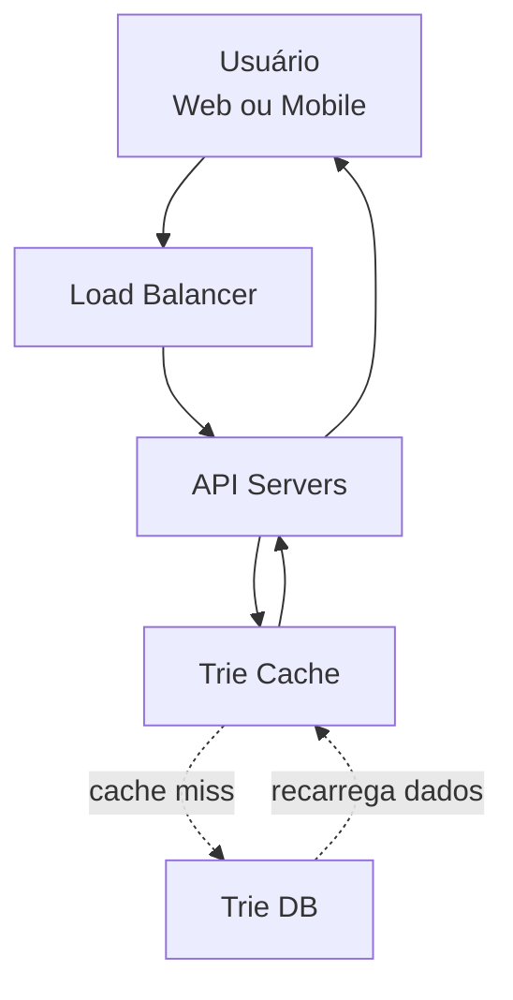

### Fluxo

1. O usuário digita um prefixo.
2. A requisição chega ao Load Balancer.
3. O Load Balancer encaminha para um API Server.
4. O API Server consulta o Trie Cache.
5. Se houver cache hit, retorna as sugestões.
6. Se houver cache miss, busca no Trie DB e repopula o cache.
7. O resultado é devolvido ao usuário.

---

## 18. Cache no navegador

Além do cache no backend, o sistema pode usar cache no navegador.

Isso é útil porque:

* muitos usuários digitam prefixos repetidos;
* evita chamadas desnecessárias;
* reduz latência;
* reduz carga nos servidores.

Exemplo:

```text
Cache-Control: private, max-age=3600
```

Significado:

| Diretiva     | Explicação                                                                                 |
| ------------ | ------------------------------------------------------------------------------------------ |
| private      | O resultado é específico para um usuário e não deve ser compartilhado por caches públicos. |
| max-age=3600 | O navegador pode manter o resultado por 3600 segundos, ou seja, 1 hora.                    |

---

## 19. Data sampling

Para sistemas muito grandes, registrar todas as consultas pode custar muito caro.

Uma alternativa é usar amostragem.

Exemplo:

```text
Registrar apenas 1 a cada 100 consultas
```

Isso reduz:

* volume de armazenamento;
* custo de processamento;
* tráfego interno;
* carga nos agregadores.

Trade-off:

* menor precisão;
* risco de perder sinais de consultas menos frequentes.

---

## 20. Operações da Trie

O sistema precisa suportar três operações principais:

1. criação;
2. atualização;
3. remoção/filtro.

---

### 20.1 Create

A Trie é criada por workers a partir dos dados agregados.

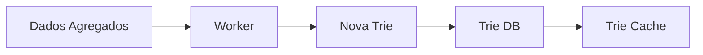

---

### 20.2 Update

O capítulo apresenta duas formas de atualização.

#### Opção 1 — Recriar a Trie inteira

É a opção recomendada para grandes volumes.

Fluxo:

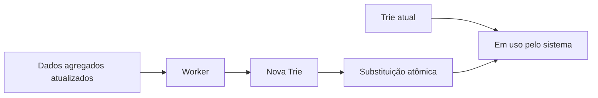

Vantagens:

* evita inconsistência;
* simplifica atualização;
* reduz impacto no serviço de consulta.

Desvantagem:

* exige processamento em lote;
* atualização não é instantânea.

#### Opção 2 — Atualizar nós individualmente

Atualiza nós específicos da Trie.

Problema:

* pode ser lento;
* alterações em um termo afetam todos os ancestrais;
* aumenta a complexidade de consistência.

Exemplo:

```text
Termo: beer
Frequência antiga: 10
Frequência nova: 30

Nós afetados:
- b
- be
- bee
- beer
```

---

### 20.3 Delete e filtro de conteúdo

O sistema deve remover sugestões:

* ofensivas;
* violentas;
* sexualmente explícitas;
* perigosas;
* indesejadas por política de produto.

A arquitetura usa uma camada de filtro antes do Trie Cache.

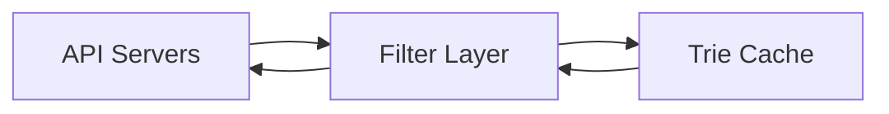

Esse filtro pode atuar de forma síncrona na consulta, mas também deve alimentar o processo assíncrono de reconstrução da Trie.

---

## 21. Escalabilidade do armazenamento

Quando a Trie cresce demais para caber em um único servidor, é necessário particionar os dados.

---

### 21.1 Particionamento simples por primeira letra

Exemplo com dois servidores:

```text
Servidor 1: consultas iniciadas de a até m
Servidor 2: consultas iniciadas de n até z
```

Com três servidores:

```text
Servidor 1: a até i
Servidor 2: j até r
Servidor 3: s até z
```

Problema:

* a distribuição pode ficar desbalanceada;
* letras como `s`, `t`, `a` ou `c` podem ter muito mais buscas que outras.

---

### 21.2 Sharding com mapa de distribuição

Para resolver o desbalanceamento, o capítulo propõe um **Shard Map Manager**.

Ele mantém uma tabela de roteamento indicando em qual shard cada prefixo deve ficar.

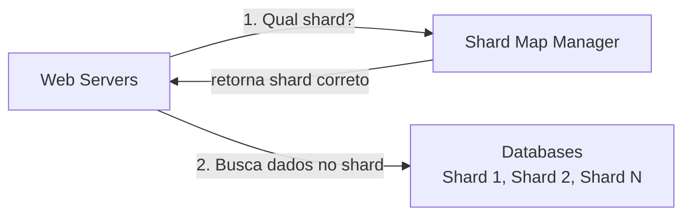

Exemplo:

```text
Se houver muitas buscas iniciadas com s,
o prefixo s pode ficar sozinho em um shard.

Outras letras menos frequentes, como u, v, w, x, y, z,
podem ser agrupadas em outro shard.
```

---

## 22. Suporte a múltiplos idiomas

Para suportar idiomas diferentes do inglês, o sistema deve usar Unicode nos nós da Trie.

Isso permite representar:

* caracteres latinos;
* acentos;
* alfabetos não latinos;
* símbolos de outros idiomas.

Exemplo:

```text
português: ação, coração, órgão
espanhol: niño
francês: école
japonês: 東京
```

Impactos:

* maior consumo de memória;
* mais complexidade na normalização;
* necessidade de regras por idioma;
* ranking possivelmente diferente por região.

---

## 23. Diferenças por país ou região

As consultas populares podem variar de país para país.

Exemplo:

```text
Prefixo: foot

Estados Unidos:
- football
- foot locker

Brasil:
- futebol
- futebol hoje
```

Solução possível:

* manter Tries separadas por país;
* usar CDN para reduzir latência;
* aplicar ranking regional;
* combinar popularidade global e local.

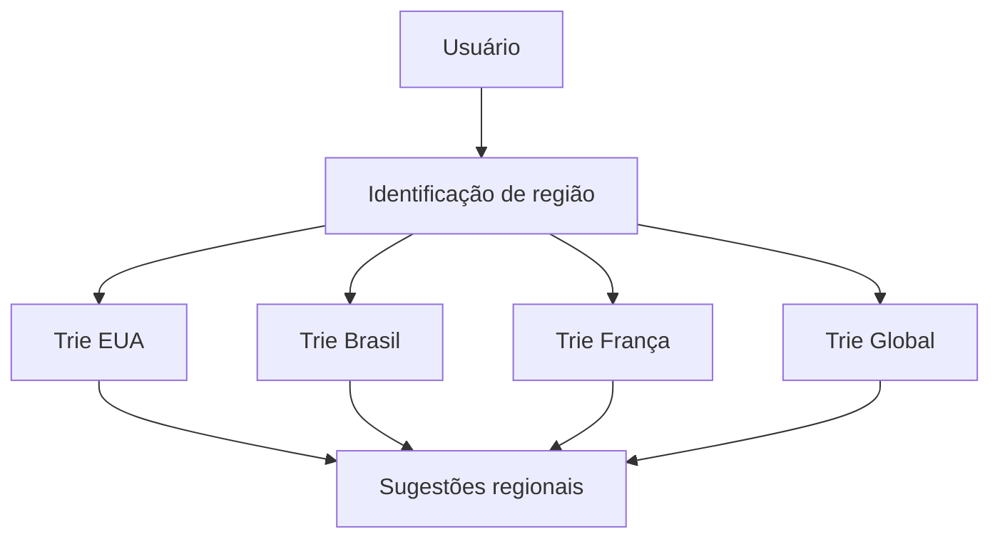

---

## 24. Suporte a buscas em tendência

O desenho principal do capítulo não atende bem consultas em tempo real.

Exemplo:

```text
Um evento acontece agora.
Uma nova busca começa a explodir em popularidade.
O autocomplete semanal ainda não sabe disso.
```

Problemas:

* workers offline podem rodar apenas semanalmente;
* reconstruir a Trie demora;
* o ranking antigo pode continuar sendo servido;
* o sistema não captura tendências recentes.

Possíveis melhorias:

1. reduzir o conjunto de trabalho com sharding;
2. dar mais peso para consultas recentes;
3. usar dados de streaming;
4. processar eventos em tempo quase real.

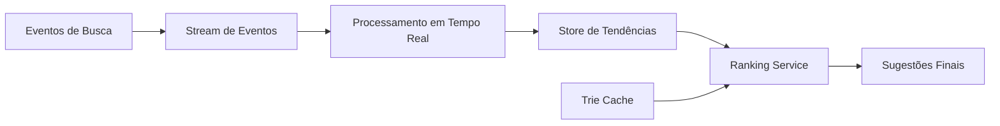

---

## 25. Arquitetura final consolidada

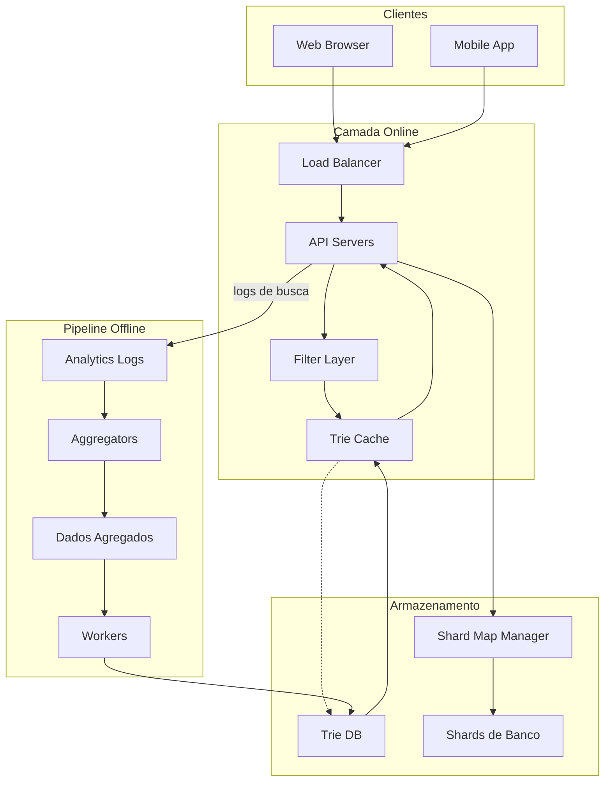

---

## 26. Fluxo principal da consulta

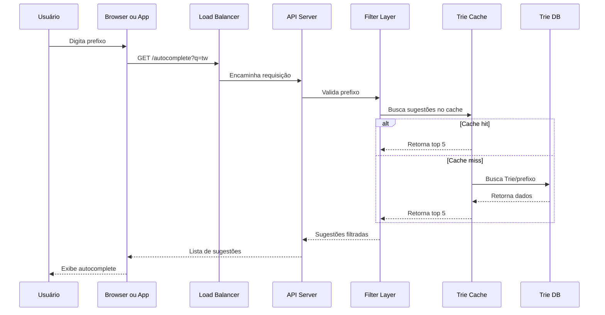

---

## 27. Pontos fortes da solução

* Consulta muito rápida com Trie Cache.
* Boa escalabilidade usando sharding.
* Atualização assíncrona evita sobrecarregar o serviço online.
* Cache no navegador reduz chamadas repetidas.
* Filtro de conteúdo melhora segurança e qualidade.
* Separação clara entre pipeline offline e consulta online.

---

## 28. Trade-offs

| Decisão             | Benefício                       | Custo                            |
| ------------------- | ------------------------------- | -------------------------------- |
| Trie                | Busca rápida por prefixo        | Maior uso de memória             |
| Top k em cada nó    | Resposta O(1) na prática        | Dados duplicados nos nós         |
| Atualização offline | Baixo impacto no serviço online | Dados não são 100% em tempo real |
| Cache no browser    | Menos carga no backend          | Pode retornar sugestões antigas  |
| Sharding            | Escala horizontal               | Mais complexidade operacional    |
| Filtro online       | Bloqueia sugestões ruins        | Adiciona latência                |

---

## 29. Resumo final

O sistema de autocomplete precisa responder rapidamente enquanto o usuário digita. A solução inicial com banco relacional e `LIKE 'prefix%'` é simples, mas não escala bem.

A solução evolui para uma arquitetura baseada em:

* Trie para busca eficiente por prefixo;
* top sugestões armazenadas em cada nó;
* cache distribuído para leitura rápida;
* pipeline offline para agregação e reconstrução da Trie;
* banco persistente para armazenar snapshots;
* filtro de conteúdo;
* sharding para escalar armazenamento;
* possíveis extensões para múltiplos idiomas, regiões e tendências em tempo real.

A ideia mais importante do capítulo é separar o sistema em duas partes:

```text
Consulta online: extremamente rápida, baseada em cache e Trie.
Atualização offline: assíncrona, agregada e reconstruída periodicamente.
```

Essa separação permite manter baixa latência para o usuário sem abrir mão de atualização contínua dos dados.
