# Capítulo 14 — Design YouTube

Documentação baseada no PDF enviado do capítulo 14. 

> O objetivo do capítulo é projetar uma plataforma de compartilhamento e streaming de vídeos semelhante ao YouTube. O foco não é recriar todas as funcionalidades do produto, mas explicar uma arquitetura escalável para **upload**, **transcodificação**, **armazenamento**, **entrega via CDN** e **streaming**.

---

## 1. Escopo do problema

O YouTube parece simples para o usuário: alguém envia um vídeo e outras pessoas clicam em “play”. Porém, em escala global, isso exige resolver problemas de armazenamento, processamento, rede, latência, custo e disponibilidade.

### Funcionalidades consideradas no design

O capítulo restringe o escopo às seguintes funções principais:

* Upload rápido de vídeos.
* Streaming suave de vídeos.
* Alteração da qualidade do vídeo.
* Baixo custo de infraestrutura.
* Alta disponibilidade, escalabilidade e confiabilidade.
* Suporte a mobile apps, navegadores web e smart TVs.

### Fora do escopo principal

Funcionalidades como comentários, curtidas, playlists, recomendações, inscrições e compartilhamento são citadas como existentes no YouTube real, mas não entram no centro do design da entrevista.

---

## 2. Premissas e estimativas

As estimativas do capítulo servem para orientar decisões arquiteturais.

| Item                                  |            Premissa |
| ------------------------------------- | ------------------: |
| Usuários ativos diários               |           5 milhões |
| Vídeos assistidos por usuário por dia |                   5 |
| Usuários que fazem upload diariamente |                 10% |
| Tamanho médio de vídeo                |              300 MB |
| Armazenamento diário estimado         |      150 TB por dia |
| Custo estimado de CDN                 | US$ 150.000 por dia |

### Cálculo de armazenamento

```text
5 milhões de usuários * 10% * 300 MB = 150 TB por dia
```

### Cálculo aproximado de CDN

```text
5 milhões de usuários * 5 vídeos * 0,3 GB * US$ 0,02 = US$ 150.000 por dia
```

A conclusão importante é que **CDN é indispensável para baixa latência**, mas também é um dos maiores custos do sistema.

---

## 3. Arquitetura de alto nível

O capítulo recomenda usar serviços de nuvem existentes, especialmente **CDN** e **blob storage**, em vez de construir tudo do zero.

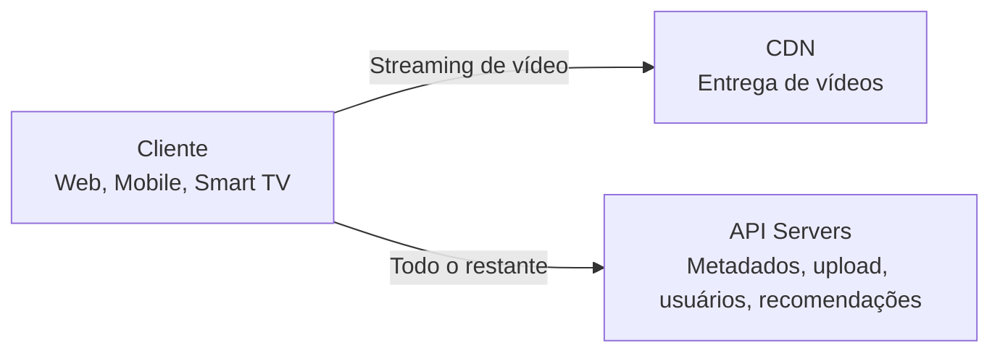

### Componentes principais

| Componente          | Responsabilidade                                               |
| ------------------- | -------------------------------------------------------------- |
| Cliente             | Dispositivo usado para assistir ou enviar vídeos.              |
| CDN                 | Entrega vídeos com baixa latência, próxima ao usuário.         |
| API Servers         | Processam operações que não são o streaming direto.            |
| Blob Storage        | Armazena vídeos originais e vídeos processados.                |
| Metadata DB         | Guarda informações como nome, tamanho, formato, URL e usuário. |
| Metadata Cache      | Acelera leituras frequentes de metadados.                      |
| Transcoding Servers | Convertem vídeos para formatos e qualidades diferentes.        |
| Completion Queue    | Recebe eventos de conclusão da transcodificação.               |
| Completion Handler  | Atualiza banco e cache após o processamento.                   |

---

## 4. Fluxo de upload de vídeo

O upload é dividido em dois fluxos que acontecem em paralelo:

1. Upload do arquivo de vídeo.
2. Atualização dos metadados do vídeo.

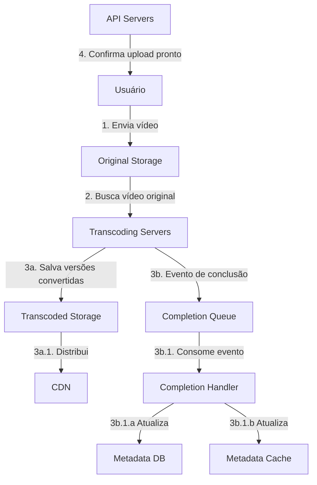

### Etapas do fluxo

1. O usuário envia o vídeo para o armazenamento original.
2. Os servidores de transcodificação buscam o vídeo original.
3. A transcodificação gera versões em diferentes formatos e resoluções.
4. Os vídeos transcodificados são salvos no armazenamento final.
5. Um evento de conclusão é enviado para a fila.
6. Workers consomem a fila e atualizam banco e cache.
7. A API informa ao cliente que o vídeo foi enviado e está pronto para streaming.

---

## 5. Fluxo de atualização de metadados

Enquanto o vídeo é enviado, o cliente também envia metadados para os servidores de API.

Exemplos de metadados:

* Nome do arquivo.
* Tamanho.
* Formato.
* Resolução.
* Usuário responsável.
* URL do vídeo.

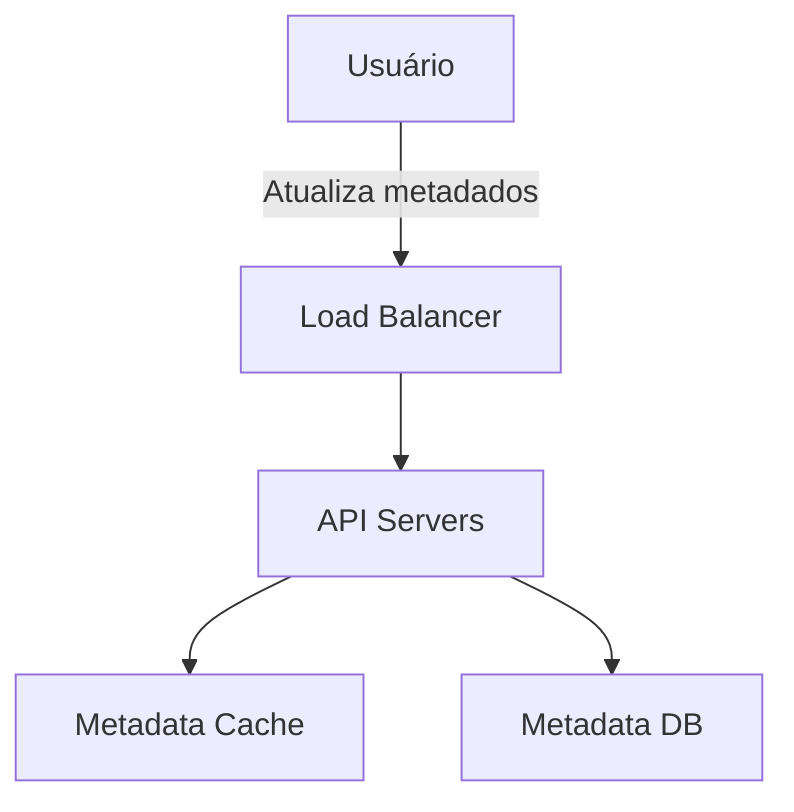

O cache de metadados é importante porque páginas de vídeo, buscas, listagens e recomendações fazem muitas leituras dessas informações.

---

## 6. Fluxo de streaming

No streaming, o cliente não baixa o vídeo inteiro antes de assistir. O vídeo é entregue em pequenos segmentos enquanto a reprodução acontece.

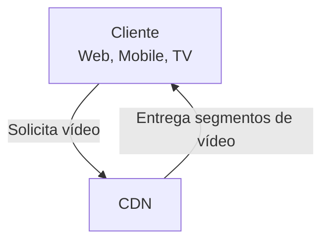

O vídeo é entregue diretamente pela CDN, preferencialmente a partir do edge server mais próximo do usuário.

### Protocolos de streaming citados

O capítulo cita alguns protocolos populares:

* MPEG-DASH.
* Apple HLS.
* Microsoft Smooth Streaming.
* Adobe HTTP Dynamic Streaming.

O ponto principal não é decorar os protocolos, mas entender que o sistema precisa escolher um protocolo compatível com os clientes e os casos de uso.

---

## 7. Por que transcodificar vídeos?

A transcodificação é necessária porque o vídeo enviado pelo usuário pode não estar adequado para todos os dispositivos, redes e formatos.

Principais motivos:

1. **Vídeo bruto é muito grande**
   Um vídeo HD de uma hora a 60 FPS pode ocupar centenas de GB.

2. **Dispositivos suportam formatos diferentes**
   Celulares, navegadores e smart TVs podem ter capacidades distintas.

3. **A rede do usuário varia**
   Usuários com internet rápida podem assistir em alta resolução. Usuários com internet lenta precisam de versões menores.

4. **A qualidade precisa se adaptar durante a reprodução**
   Se a rede piorar, o player pode trocar para uma qualidade inferior sem interromper o vídeo.

---

## 8. Container e codec

Um arquivo de vídeo normalmente contém três partes:

| Parte     | Descrição                                                                        |
| --------- | -------------------------------------------------------------------------------- |
| Container | Estrutura que agrupa vídeo, áudio e metadados. Exemplos: `.avi`, `.mov`, `.mp4`. |
| Codec     | Algoritmo de compressão e descompressão. Exemplos: H.264, VP9, HEVC.             |
| Metadados | Informações auxiliares do vídeo.                                                 |

---

## 9. Modelo DAG para processamento de vídeo

O capítulo usa um modelo de **DAG — Directed Acyclic Graph** para representar tarefas de processamento.

A ideia é que algumas tarefas dependem da conclusão de outras. Isso permite executar partes do processamento em paralelo quando não há dependência direta.

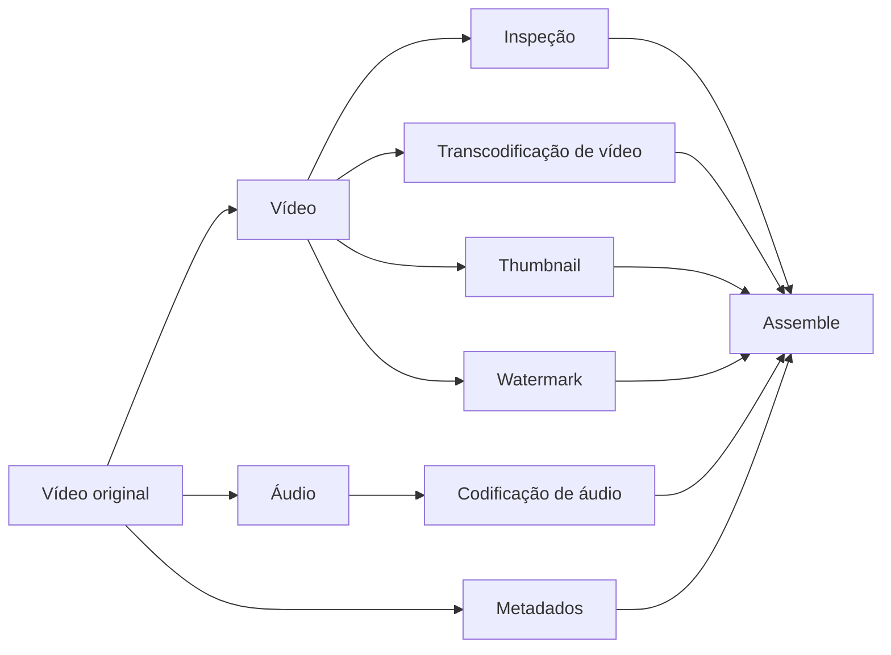

### Exemplos de tarefas

| Tarefa         | Função                                                          |
| -------------- | --------------------------------------------------------------- |
| Inspection     | Verifica se o vídeo tem boa qualidade e não está malformado.    |
| Video encoding | Converte o vídeo para diferentes resoluções, codecs e bitrates. |
| Thumbnail      | Gera ou recebe a miniatura do vídeo.                            |
| Watermark      | Adiciona marca visual sobre o vídeo.                            |
| Audio encoding | Processa a faixa de áudio.                                      |
| Assemble       | Junta os resultados finais.                                     |

---

## 10. Saídas de codificação

Um mesmo vídeo pode gerar várias versões.

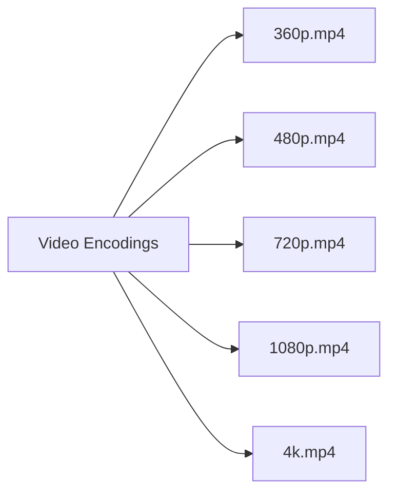

Isso permite que o player escolha a melhor versão conforme dispositivo, banda e preferência do usuário.

---

## 11. Arquitetura de transcodificação

A arquitetura proposta possui seis componentes principais:

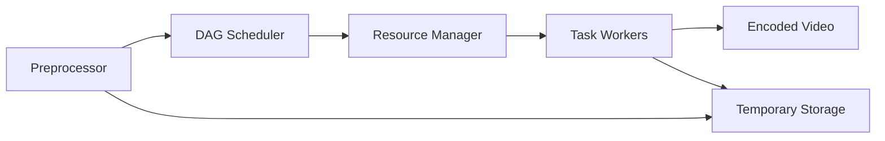

### Componentes

| Componente        | Responsabilidade                                              |
| ----------------- | ------------------------------------------------------------- |
| Preprocessor      | Divide o vídeo, gera o DAG e prepara dados temporários.       |
| DAG Scheduler     | Divide o DAG em estágios e envia tarefas para execução.       |
| Resource Manager  | Escolhe tarefas e workers de forma eficiente.                 |
| Task Workers      | Executam tarefas como encoding, thumbnail, watermark e merge. |
| Temporary Storage | Guarda dados intermediários durante o processamento.          |
| Encoded Video     | Resultado final da pipeline.                                  |

---

## 12. Preprocessor

O preprocessor tem quatro responsabilidades principais:

1. **Dividir o vídeo por GOP alignment**
   GOP significa Group of Pictures, ou seja, grupos de frames organizados em uma sequência.

2. **Tratar clientes antigos**
   Alguns dispositivos ou navegadores antigos não conseguem dividir vídeos no cliente. Nesse caso, a divisão é feita no servidor.

3. **Gerar o DAG**
   O DAG é criado com base em arquivos de configuração definidos pelos engenheiros.

4. **Armazenar dados temporários**
   Os segmentos do vídeo são salvos em armazenamento temporário para permitir retry em caso de falha.

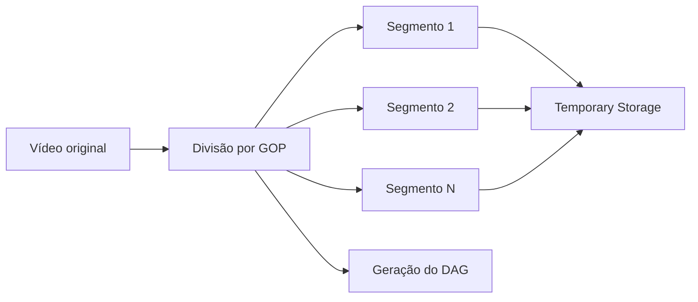

---

## 13. DAG Scheduler

O scheduler organiza o DAG em estágios.

No exemplo do capítulo:

* **Estágio 1:** divide o vídeo em vídeo, áudio e metadados.
* **Estágio 2:** executa codificação de vídeo, thumbnail e codificação de áudio.

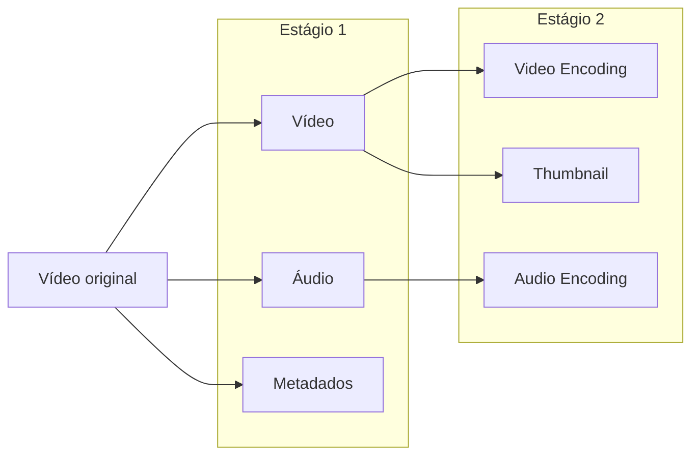

---

## 14. Resource Manager

O Resource Manager gerencia a alocação eficiente dos workers.

Ele mantém três filas:

| Fila          | Função                                          |
| ------------- | ----------------------------------------------- |
| Task Queue    | Fila de tarefas com prioridade.                 |
| Worker Queue  | Fila com informações de utilização dos workers. |
| Running Queue | Fila com tarefas e workers em execução.         |

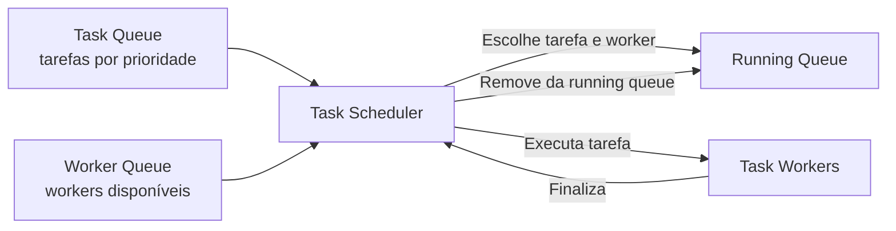

Fluxo de decisão:

1. Pega a tarefa de maior prioridade.
2. Escolhe o worker mais adequado.
3. Instrui o worker a executar a tarefa.
4. Registra a execução na running queue.
5. Remove o job da running queue quando terminar.

---

## 15. Task Workers

Os workers executam tarefas específicas do DAG.

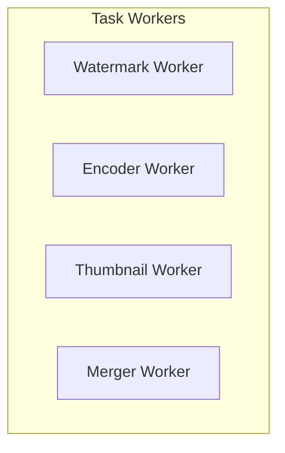

Cada tipo de worker pode escalar de forma independente, conforme a demanda.

---

## 16. Temporary Storage

O armazenamento temporário depende de:

* Tipo de dado.
* Tamanho.
* Frequência de acesso.
* Tempo de vida do dado.

O capítulo sugere:

| Tipo de dado          | Estratégia                      |
| --------------------- | ------------------------------- |
| Metadados temporários | Cache em memória.               |
| Vídeo e áudio         | Blob storage.                   |
| Dados intermediários  | Removidos após o processamento. |

---

## 17. Otimização de velocidade

### 17.1 Upload paralelo por GOP

Enviar um vídeo inteiro de uma só vez é ineficiente. O sistema pode dividir o vídeo em segmentos menores e fazer upload paralelo.

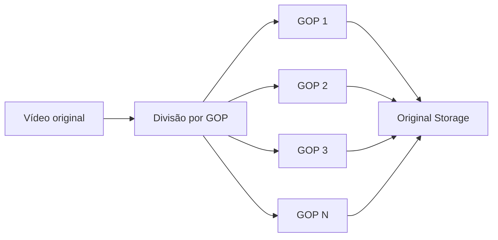

Benefícios:

* Upload mais rápido.
* Retomada mais simples em caso de falha.
* Reenvio apenas dos segmentos com erro.

---

### 17.2 Upload centers próximos dos usuários

Outra otimização é posicionar centros de upload em várias regiões.

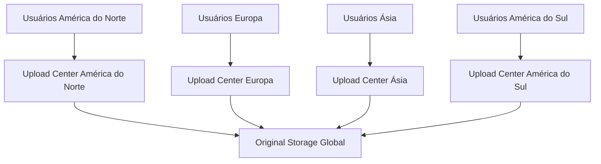

A lógica é simples: quanto mais próximo o ponto de entrada estiver do usuário, menor tende a ser a latência do upload.

---

### 17.3 Paralelismo com filas

Sem filas, um módulo precisa esperar o anterior terminar. Com filas, os módulos ficam mais desacoplados e podem trabalhar em paralelo.

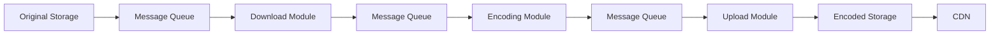

Esse modelo melhora:

* Paralelismo.
* Escalabilidade.
* Isolamento entre componentes.
* Tolerância a falhas.
* Controle de backpressure.

---

## 18. Otimização de segurança

### 18.1 Pre-signed upload URL

Para garantir que apenas usuários autorizados enviem vídeos para o local correto, o capítulo propõe o uso de URLs pré-assinadas.

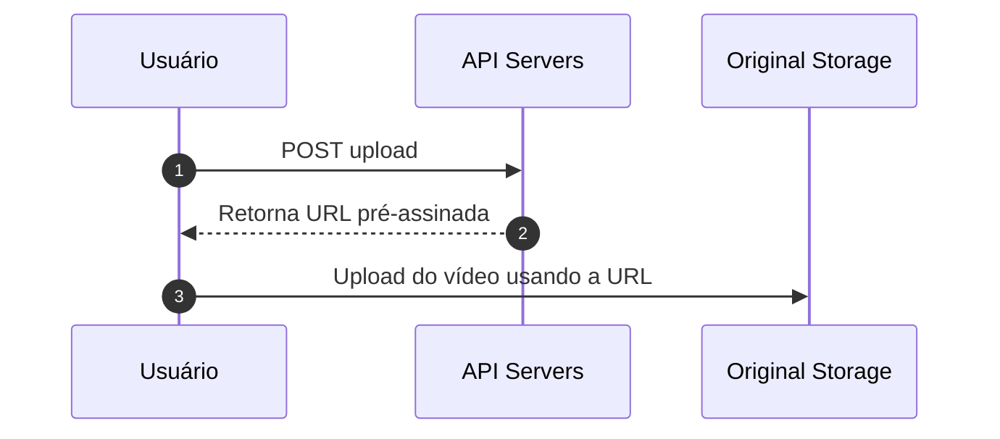

A URL pré-assinada concede permissão temporária para upload em um objeto específico no storage.

---

### 18.2 Proteção do conteúdo

Para proteger vídeos contra uso indevido, o capítulo cita três opções:

| Técnica             | Descrição                                                               |
| ------------------- | ----------------------------------------------------------------------- |
| DRM                 | Sistemas como Apple FairPlay, Google Widevine e Microsoft PlayReady.    |
| AES Encryption      | Vídeo criptografado e descriptografado apenas na reprodução autorizada. |
| Visual Watermarking | Marca visual com logo ou identificação da empresa.                      |

---

## 19. Otimização de custo

CDN é essencial, mas cara. O capítulo sugere reduzir custo com base em popularidade, região e padrão de acesso.

### Estratégias

1. Servir vídeos populares pela CDN e vídeos menos populares por servidores próprios de vídeo.
2. Para conteúdos pouco acessados, evitar armazenar muitas versões codificadas.
3. Codificar vídeos curtos sob demanda.
4. Distribuir vídeos apenas para regiões onde são populares.
5. Grandes empresas podem construir CDN própria ou fazer parceria com ISPs.

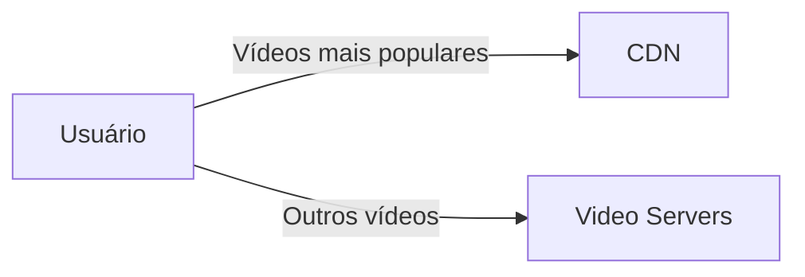

A ideia central é que o consumo de vídeo segue uma distribuição de cauda longa: poucos vídeos concentram grande parte dos acessos, enquanto muitos vídeos têm pouca ou nenhuma visualização.

---

## 20. Tratamento de erros

Em sistemas grandes, falhas são inevitáveis. O capítulo divide erros em dois tipos.

| Tipo            | Estratégia                                             |
| --------------- | ------------------------------------------------------ |
| Recuperável     | Tentar novamente algumas vezes.                        |
| Não recuperável | Encerrar a tarefa e retornar erro adequado ao cliente. |

### Playbook de falhas

| Falha                           | Tratamento                                          |
| ------------------------------- | --------------------------------------------------- |
| Erro de upload                  | Retry algumas vezes.                                |
| Cliente antigo não divide vídeo | Servidor faz a divisão.                             |
| Erro de transcodificação        | Retry.                                              |
| Erro no preprocessor            | Regenerar DAG.                                      |
| Erro no DAG scheduler           | Reagendar tarefa.                                   |
| Resource manager queue fora     | Usar réplica.                                       |
| Task worker fora                | Executar tarefa em outro worker.                    |
| API server fora                 | Redirecionar para outro servidor stateless.         |
| Metadata cache fora             | Usar réplicas e substituir nó morto.                |
| Metadata DB master fora         | Promover réplica para novo master.                  |
| Metadata DB replica fora        | Usar outra réplica para leitura e criar substituta. |

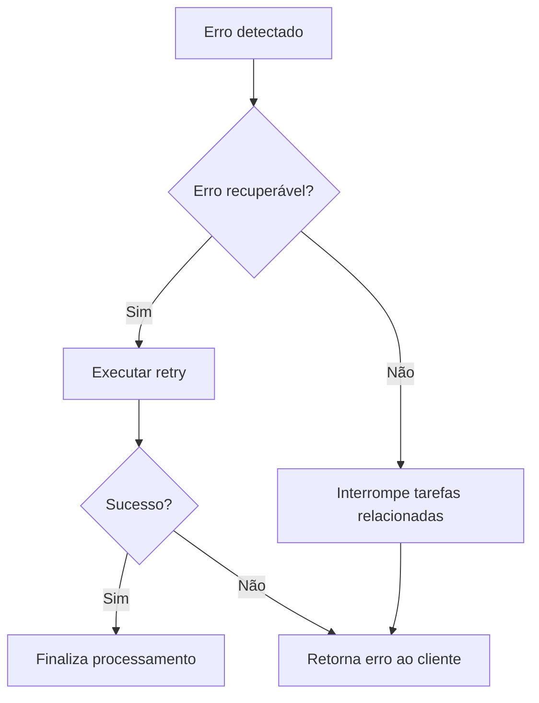

---

## 21. Encerramento do design

O capítulo finaliza com pontos adicionais que podem ser mencionados em uma entrevista.

### Escalar API

Como os API servers são stateless, é simples escalar horizontalmente adicionando novas instâncias atrás de um load balancer.

### Escalar banco de dados

Pode-se discutir:

* Replicação.
* Sharding.
* Separação de leitura e escrita.
* Failover de master.

### Live streaming

O sistema projetado não é especificamente para live streaming, mas há semelhanças:

* Upload.
* Encoding.
* Streaming.

Diferenças importantes:

| Aspecto            | Vídeo sob demanda              | Live streaming                         |
| ------------------ | ------------------------------ | -------------------------------------- |
| Latência           | Pode tolerar mais atraso       | Exige latência menor                   |
| Paralelismo        | Pode processar grandes blocos  | Processa pequenos blocos em tempo real |
| Tratamento de erro | Pode haver retry mais demorado | Retry demorado pode ser inaceitável    |

### Video takedown

Vídeos que violam direitos autorais, pornografia ou leis devem ser removidos. Alguns podem ser detectados durante o upload, outros por denúncia de usuários.

---

## 22. Resumo final

O design do YouTube gira em torno de quatro fluxos principais:

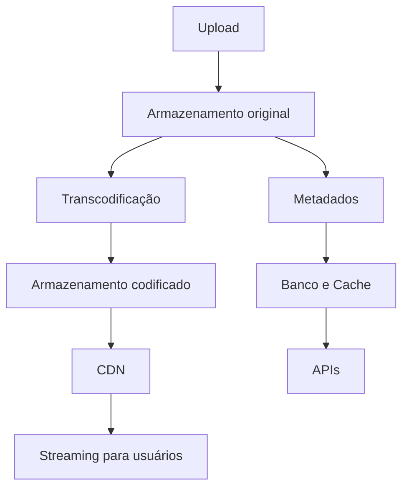

A arquitetura precisa equilibrar:

* **Performance**, usando CDN, upload paralelo e transcodificação distribuída.
* **Escalabilidade**, usando APIs stateless, filas e workers especializados.
* **Confiabilidade**, com retries, réplicas e tratamento claro de falhas.
* **Custo**, evitando servir todo conteúdo pela CDN quando não for necessário.
* **Segurança**, com URLs pré-assinadas, DRM, criptografia e watermarking.
