# Capítulo 15 — Design Google Drive

Documentação em português baseada no capítulo 15 do PDF enviado. 

> Observação: o capítulo usa “Google Drive” como problema de entrevista de system design. A arquitetura abaixo não representa necessariamente a arquitetura interna real do Google Drive.

---

## 1. Objetivo do sistema

Projetar um sistema de armazenamento e sincronização de arquivos semelhante ao Google Drive, permitindo que usuários façam upload, download, sincronizem arquivos entre dispositivos, consultem versões e compartilhem arquivos.

O foco principal é suportar:

* upload e download de arquivos;
* sincronização entre dispositivos;
* histórico de versões;
* compartilhamento de arquivos;
* notificações quando arquivos forem alterados;
* alta disponibilidade;
* baixa latência de sincronização;
* economia de banda.

Fora do escopo do capítulo:

* edição colaborativa simultânea, como Google Docs;
* resolução sofisticada de conflitos em tempo real;
* algoritmos avançados de edição concorrente.

---

## 2. Requisitos

### Requisitos funcionais

| Requisito        | Descrição                                                                                |
| ---------------- | ---------------------------------------------------------------------------------------- |
| Upload           | Usuário pode enviar arquivos para a nuvem.                                               |
| Download         | Usuário pode baixar arquivos armazenados.                                                |
| Sincronização    | Arquivos enviados ou modificados em um dispositivo devem aparecer nos demais.            |
| Histórico        | Usuário pode consultar versões anteriores de arquivos.                                   |
| Compartilhamento | Usuário pode compartilhar arquivos com outras pessoas.                                   |
| Notificações     | Usuário deve ser avisado quando arquivos forem modificados, excluídos ou compartilhados. |

### Requisitos não funcionais

| Requisito            | Descrição                                                               |
| -------------------- | ----------------------------------------------------------------------- |
| Confiabilidade       | Arquivos não podem ser perdidos.                                        |
| Sincronização rápida | Alterações devem aparecer rapidamente nos dispositivos.                 |
| Baixo uso de banda   | O sistema deve evitar transferências desnecessárias.                    |
| Escalabilidade       | Deve suportar grande volume de usuários e arquivos.                     |
| Alta disponibilidade | Usuário deve conseguir acessar arquivos mesmo com falhas parciais.      |
| Segurança            | Arquivos devem ser transmitidos por HTTPS e armazenados criptografados. |

---

## 3. Estimativas iniciais

Premissas usadas no capítulo:

| Item                          |      Valor |
| ----------------------------- | ---------: |
| Usuários cadastrados          | 50 milhões |
| Usuários ativos diários       | 10 milhões |
| Espaço por usuário            |      10 GB |
| Uploads por usuário ativo/dia | 2 arquivos |
| Tamanho médio do arquivo      |     500 KB |
| Relação leitura/escrita       |        1:1 |

### Cálculos

```text
Espaço total = 50 milhões * 10 GB
Espaço total = 500 PB

Uploads por dia = 10 milhões * 2
Uploads por dia = 20 milhões

QPS upload = 20 milhões / 24 / 3600
QPS upload ≈ 240

Pico estimado = 240 * 2
Pico estimado ≈ 480 QPS
```

---

## 4. Modelo inicial simples

Uma primeira solução poderia usar apenas:

* um servidor web/API;
* um banco de dados para metadados;
* um sistema local de arquivos para armazenar os arquivos.

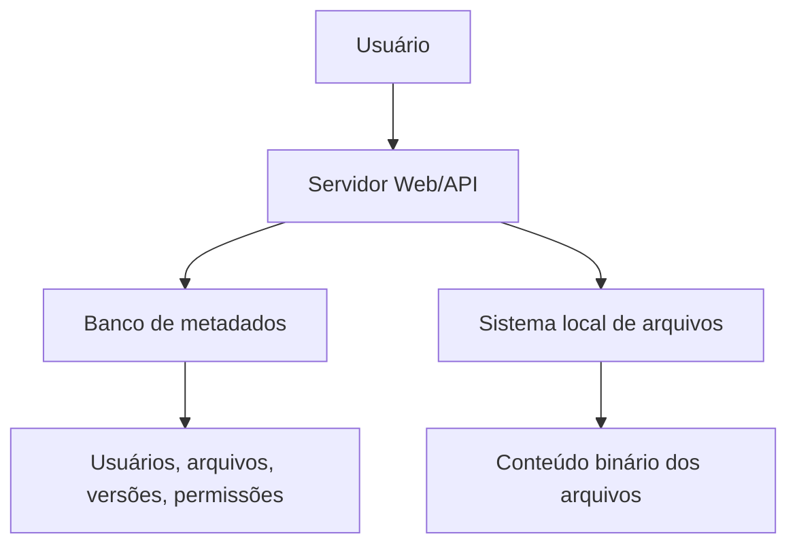

Essa solução funciona para poucos usuários, mas não escala bem.

Principais problemas:

* o servidor vira ponto único de falha;
* o disco local fica cheio rapidamente;
* o banco de dados cresce muito;
* falhas podem causar perda de arquivos;
* não há boa distribuição de carga.

---

## 5. Namespace de arquivos

O capítulo propõe organizar os arquivos em um namespace semelhante a um sistema de diretórios.

Exemplo:

```text
/drive
  /user1
    /recipes
      chicken_soup.txt
  /user2
    football.mov
    sports.txt
  /user3
    best_pic_ever.png
```

Cada arquivo pode ser identificado por:

```text
namespace + caminho relativo
```

Exemplo:

```text
/drive/user1/recipes/chicken_soup.txt
```

Representação em Mermaid:

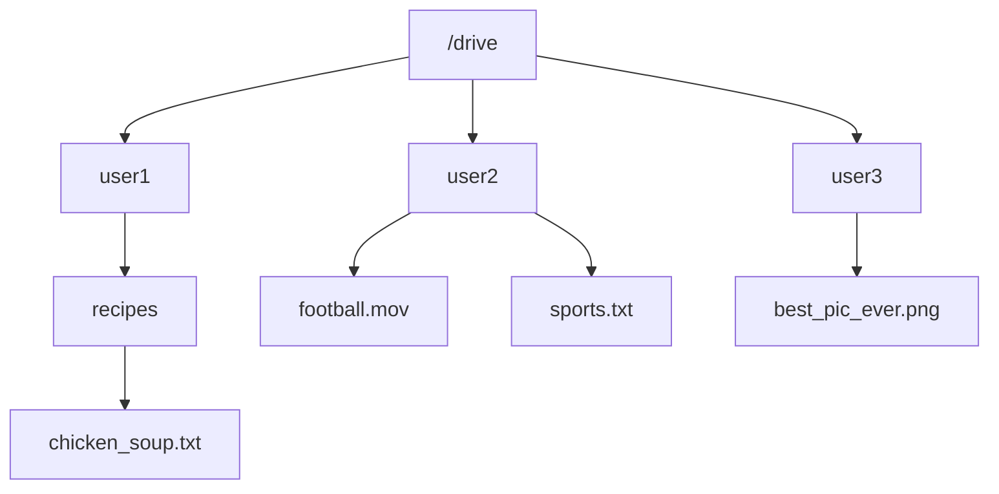

---

## 6. APIs principais

O capítulo considera três APIs principais.

### 6.1 Upload de arquivo

Tipos de upload:

| Tipo             | Uso                                  |
| ---------------- | ------------------------------------ |
| Upload simples   | Arquivos pequenos.                   |
| Upload resumível | Arquivos grandes ou redes instáveis. |

Exemplo conceitual:

```http
POST /files/upload?uploadType=resumable
```

Parâmetros:

```json
{
  "uploadType": "resumable",
  "data": "conteúdo do arquivo"
}
```

Fluxo resumível:

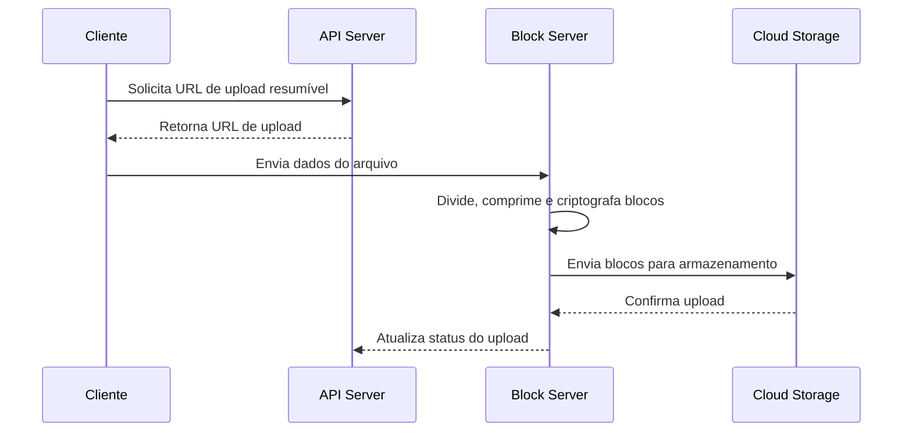

---

### 6.2 Download de arquivo

Exemplo conceitual:

```http
GET /files/download
```

Parâmetros:

```json
{
  "path": "/recipes/soup/best_soup.txt"
}
```

---

### 6.3 Histórico de versões

Exemplo conceitual:

```http
GET /files/list_revisions
```

Parâmetros:

```json
{
  "path": "/recipes/soup/best_soup.txt",
  "limit": 20
}
```

---

## 7. Evolução da arquitetura

A arquitetura inicial precisa ser melhorada para suportar escala.

Melhorias propostas:

| Problema            | Solução                                        |
| ------------------- | ---------------------------------------------- |
| Servidor único      | Load balancer + múltiplos servidores API       |
| Disco local cheio   | Armazenamento em cloud storage                 |
| Banco único         | Banco de metadados separado e escalável        |
| Arquivos grandes    | Divisão em blocos                              |
| Sincronização lenta | Delta sync                                     |
| Uso alto de banda   | Compressão e upload apenas de blocos alterados |
| Falhas              | Replicação e failover                          |

---

## 8. Arquitetura de alto nível

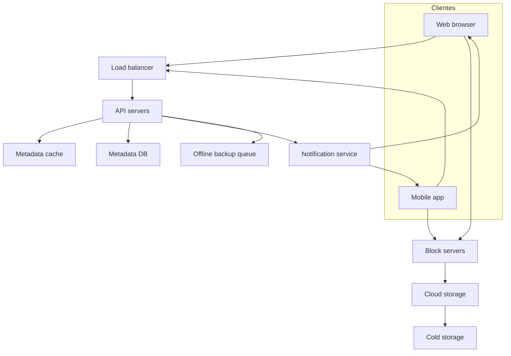

### Responsabilidade dos componentes

| Componente           | Responsabilidade                                          |
| -------------------- | --------------------------------------------------------- |
| Cliente              | Aplicação web ou mobile usada pelo usuário.               |
| Load balancer        | Distribui tráfego entre servidores API.                   |
| API servers          | Autenticação, perfil, metadados, versões e permissões.    |
| Block servers        | Processam upload/download dos blocos de arquivos.         |
| Cloud storage        | Armazena blocos ativos dos arquivos.                      |
| Cold storage         | Armazena dados antigos ou pouco acessados.                |
| Metadata DB          | Guarda metadados de usuários, arquivos, versões e blocos. |
| Metadata cache       | Acelera leitura de metadados frequentes.                  |
| Notification service | Notifica clientes sobre alterações.                       |
| Offline backup queue | Guarda eventos para clientes offline.                     |

---

## 9. Block servers

Os block servers fazem o trabalho pesado do sistema.

Responsabilidades:

* dividir arquivos em blocos menores;
* comprimir blocos;
* criptografar blocos;
* enviar blocos para o cloud storage;
* baixar blocos quando necessário;
* permitir delta sync.

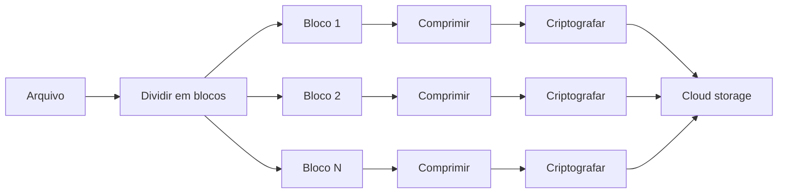

---

## 10. Delta sync

Em vez de reenviar o arquivo inteiro quando ele é alterado, o sistema envia apenas os blocos modificados.

Exemplo:

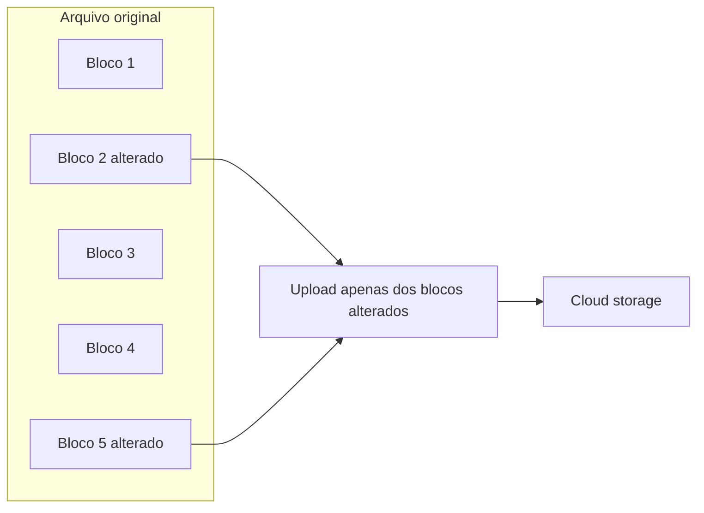

Vantagens:

* reduz uso de banda;
* acelera sincronização;
* melhora experiência do usuário;
* reduz custo de transferência.

---

## 11. Consistência forte

O capítulo destaca que o sistema precisa de consistência forte para metadados.

Exemplo de problema:

* cliente A atualiza um arquivo;
* cliente B consulta o mesmo arquivo logo depois;
* o cliente B não deve enxergar uma versão antiga.

Para isso:

* o banco de metadados deve manter consistência forte;
* o cache deve ser invalidado quando houver escrita no banco;
* réplicas precisam estar consistentes com o nó principal;
* operações críticas devem ter comportamento transacional.

O capítulo sugere banco relacional porque bancos relacionais oferecem suporte nativo a propriedades ACID.

---

## 12. Modelo de dados

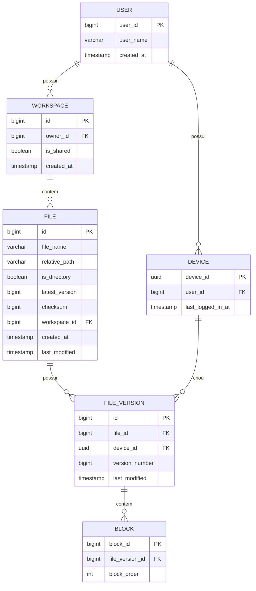

### Descrição das tabelas

| Tabela         | Finalidade                                           |
| -------------- | ---------------------------------------------------- |
| `user`         | Dados básicos do usuário.                            |
| `device`       | Dispositivos associados ao usuário.                  |
| `workspace`    | Espaço raiz de arquivos do usuário ou compartilhado. |
| `file`         | Metadados da versão mais recente do arquivo.         |
| `file_version` | Histórico de versões de um arquivo.                  |
| `block`        | Blocos que compõem uma versão do arquivo.            |

---

## 13. Fluxo de upload

O upload possui dois fluxos paralelos:

1. criação dos metadados;
2. envio dos blocos para o cloud storage.

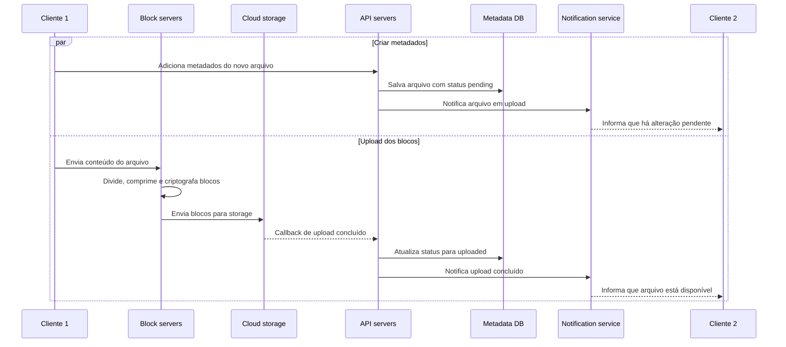

---

## 14. Fluxo de download

Um cliente pode descobrir alterações de duas formas:

* se estiver online, recebe notificação;
* se estiver offline, consulta alterações acumuladas quando voltar.

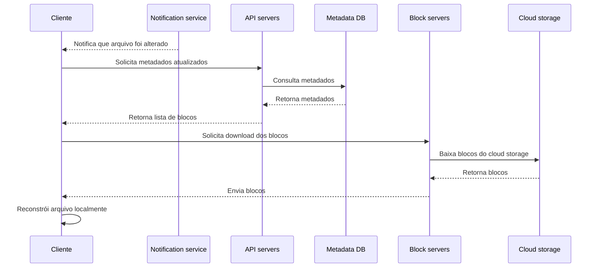

---

## 15. Conflitos de sincronização

Conflitos acontecem quando dois usuários editam o mesmo arquivo ao mesmo tempo.

Estratégia apresentada:

* a primeira atualização processada vence;
* a segunda vira uma cópia conflitante;
* o usuário decide se quer mesclar ou sobrescrever.

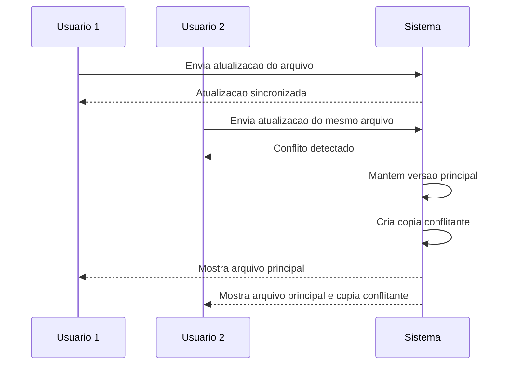

Exemplo de nomes:

```text
SystemDesignInterview
SystemDesignInterview_user_2_conflicted_copy_2019-05-01
```

---

## 16. Serviço de notificações

O serviço de notificações avisa os clientes quando arquivos mudam.

Opções consideradas:

| Opção        | Característica                                          |
| ------------ | ------------------------------------------------------- |
| Long polling | Cliente mantém uma requisição aberta esperando eventos. |
| WebSocket    | Conexão persistente bidirecional.                       |

O capítulo escolhe **long polling** porque:

* as notificações são pouco frequentes;
* o fluxo principal é servidor → cliente;
* não há grande necessidade de comunicação bidirecional;
* é suficiente para informar mudanças em arquivos.

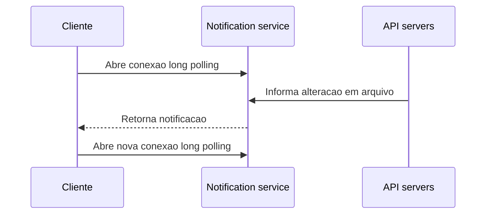

---

## 17. Economia de armazenamento

O sistema pode economizar espaço com três estratégias principais.

| Estratégia        | Descrição                                             |
| ----------------- | ----------------------------------------------------- |
| Deduplicação      | Blocos idênticos são armazenados apenas uma vez.      |
| Limite de versões | Mantém apenas quantidade limitada de versões antigas. |
| Cold storage      | Move versões antigas para armazenamento mais barato.  |

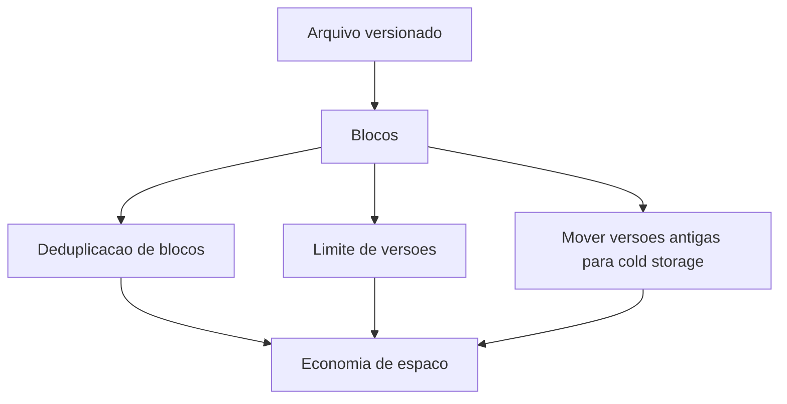

---

## 18. Tratamento de falhas

| Falha                | Estratégia                                   |
| -------------------- | -------------------------------------------- |
| Load balancer        | Usar par ativo/passivo com heartbeat.        |
| API server           | Servidores stateless atrás do load balancer. |
| Block server         | Outro servidor assume uploads pendentes.     |
| Cloud storage        | Replicação multi-região.                     |
| Metadata cache       | Réplicas múltiplas.                          |
| Metadata DB          | Failover com promoção de réplica.            |
| Notification service | Clientes reconectam em outro servidor.       |
| Offline queue        | Filas replicadas.                            |

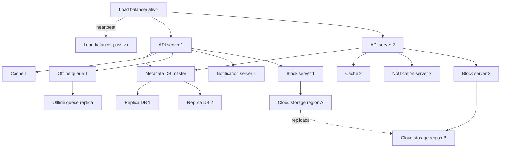

---

## 19. Trade-off: upload direto para cloud storage

Uma alternativa seria o cliente enviar arquivos diretamente para o cloud storage.

### Vantagem

* upload mais rápido;
* arquivo trafega uma vez só até o storage;
* reduz carga nos block servers.

### Desvantagens

* lógica de divisão em blocos precisa existir em todos os clientes;
* compressão e criptografia também precisariam ser implementadas em web, iOS e Android;
* aumenta complexidade dos clientes;
* clientes podem ser adulterados ou comprometidos;
* concentrar a lógica nos block servers simplifica governança e segurança.

---

## 20. Resumo final

A arquitetura proposta combina:

* **block servers** para divisão, compressão, criptografia e delta sync;
* **cloud storage** para armazenamento durável dos blocos;
* **metadata DB relacional** para consistência forte;
* **cache** para acelerar leituras de metadados;
* **notification service** com long polling;
* **offline queue** para sincronizar clientes que ficaram offline;
* **cold storage** para reduzir custo com versões antigas;
* **replicação e failover** para alta disponibilidade.

A parte mais importante do design é separar claramente:

```text
metadados != conteúdo do arquivo
```

Metadados ficam no banco.
Conteúdo binário fica em blocos no cloud storage.
A sincronização é feita com notificações e delta sync.
