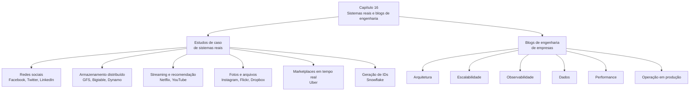
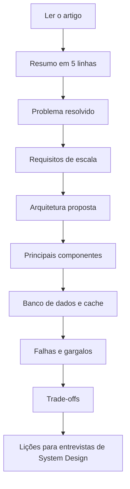

# Capítulo 16 — Sistemas do Mundo Real e Blogs de Engenharia

## 1. Objetivo do capítulo

Este capítulo apresenta uma lista de materiais para estudar **arquiteturas reais de sistemas em produção**. A ideia central é aprender System Design observando como grandes empresas resolveram problemas concretos de escala, armazenamento, performance, disponibilidade, comunicação em tempo real, recomendação, experimentação e evolução arquitetural.

O capítulo também recomenda acompanhar **blogs de engenharia** de empresas conhecidas, pois eles mostram decisões técnicas reais, tecnologias adotadas, falhas, trade-offs e aprendizados de engenharia.

---

## 2. Visão geral



---

## 3. Como estudar os sistemas reais

Ao ler cada artigo ou estudo de caso, a leitura deve ser guiada por perguntas técnicas.

```mermaid
flowchart LR
    A["Escolher um sistema real"] --> B["Entender o problema de negócio"]
    B --> C["Identificar requisitos funcionais"]
    C --> D["Identificar requisitos não funcionais"]
    D --> E["Mapear componentes principais"]
    E --> F["Analisar dados e armazenamento"]
    F --> G["Avaliar escalabilidade e disponibilidade"]
    G --> H["Identificar trade-offs"]
    H --> I["Registrar lições aprendidas"]
```



### Perguntas recomendadas

| Área            | Perguntas                                                                         |
| --------------- | --------------------------------------------------------------------------------- |
| Produto         | Qual problema o sistema resolve?                                                  |
| Escala          | Quantos usuários, requisições, mensagens ou arquivos ele precisa suportar?        |
| Dados           | Que tipo de dado é armazenado? Relacional, documento, chave-valor, grafo, blob?   |
| Arquitetura     | Quais componentes aparecem na solução?                                            |
| Performance     | Onde estavam os gargalos?                                                         |
| Disponibilidade | Como o sistema lida com falhas?                                                   |
| Consistência    | O sistema prioriza consistência forte ou eventual?                                |
| Evolução        | O que mudou conforme a escala aumentou?                                           |
| Trade-offs      | O que foi sacrificado para ganhar desempenho, escala ou simplicidade operacional? |

---

## 4. Estudos de caso citados no capítulo

### 4.1 Facebook

| Tema                                                              | Link original                                  |
| ----------------------------------------------------------------- | ---------------------------------------------- |
| Facebook Timeline: Brought To You By The Power Of Denormalization | [https://goo.gl/FCNrbm](https://goo.gl/FCNrbm) |
| Scale at Facebook                                                 | [https://goo.gl/NGTdCs](https://goo.gl/NGTdCs) |
| Building Timeline: Scaling up to hold your life story             | [https://goo.gl/8p5wDV](https://goo.gl/8p5wDV) |
| Erlang at Facebook — Facebook Chat                                | [https://goo.gl/zSLHrj](https://goo.gl/zSLHrj) |
| Facebook Chat                                                     | [https://goo.gl/qzSiWC](https://goo.gl/qzSiWC) |
| Finding a needle in Haystack — Facebook photo storage             | [https://goo.gl/edj4FL](https://goo.gl/edj4FL) |
| Serving Facebook Multifeed                                        | [https://goo.gl/adFVMQ](https://goo.gl/adFVMQ) |
| Scaling Memcache at Facebook                                      | [https://goo.gl/rZiAhX](https://goo.gl/rZiAhX) |
| TAO: Facebook’s Distributed Data Store for the Social Graph       | [https://goo.gl/Tk1DyH](https://goo.gl/Tk1DyH) |

### 4.2 Amazon

| Tema                                              | Link original                                  |
| ------------------------------------------------- | ---------------------------------------------- |
| Amazon Architecture                               | [https://goo.gl/k4feoW](https://goo.gl/k4feoW) |
| Dynamo: Amazon’s Highly Available Key-value Store | [https://goo.gl/C7zxDL](https://goo.gl/C7zxDL) |

### 4.3 Netflix

| Tema                                                          | Link original                                  |
| ------------------------------------------------------------- | ---------------------------------------------- |
| A 360 Degree View Of The Entire Netflix Stack                 | [https://goo.gl/rYSDTz](https://goo.gl/rYSDTz) |
| It’s All A/Bout Testing: The Netflix Experimentation Platform | [https://goo.gl/agbA4K](https://goo.gl/agbA4K) |
| Netflix Recommendations: Beyond the 5 stars — Part 1          | [https://goo.gl/A4FkYj](https://goo.gl/A4FkYj) |
| Netflix Recommendations: Beyond the 5 stars — Part 2          | [https://goo.gl/XNPMXm](https://goo.gl/XNPMXm) |

### 4.4 Google e YouTube

| Tema                                                       | Link original                                  |
| ---------------------------------------------------------- | ---------------------------------------------- |
| Google Architecture                                        | [https://goo.gl/dvkDlY](https://goo.gl/dvkDlY) |
| The Google File System — Google Docs                       | [https://goo.gl/xj5r9R](https://goo.gl/xj5r9R) |
| Differential Synchronization — Google Docs                 | [https://goo.gl/PzqC7x](https://goo.gl/PzqC7x) |
| YouTube Architecture                                       | [https://goo.gl/mCPRUF](https://goo.gl/mCPRUF) |
| YouTube Scalability                                        | [https://goo.gl/dH3zYq](https://goo.gl/dH3zYq) |
| Bigtable: A Distributed Storage System for Structured Data | [https://goo.gl/6NaZca](https://goo.gl/6NaZca) |

### 4.5 Instagram, Twitter, Uber, Pinterest e outros

| Tema                                                         | Link original                                    |
| ------------------------------------------------------------ | ------------------------------------------------ |
| Instagram Architecture                                       | [https://goo.gl/s1VcW5](https://goo.gl/s1VcW5)   |
| The Architecture Twitter Uses To Deal With 150M Active Users | [https://goo.gl/EwvfRd](https://goo.gl/EwvfRd)   |
| Scaling Twitter: Making Twitter 10000 Percent Faster         | [https://goo.gl/nYGC1k](https://goo.gl/nYGC1k)   |
| Announcing Snowflake                                         | [https://goo.gl/GzVWYm](https://goo.gl/GzVWYm)   |
| Timelines at Scale                                           | [https://goo.gl/8KbqTy](https://goo.gl/8KbqTy)   |
| How Uber Scales Their Real-Time Market Platform              | [https://goo.gl/kGZuVy](https://goo.gl/kGZuVy)   |
| Scaling Pinterest                                            | [https://goo.gl/KtmjW3](https://goo.gl/KtmjW3)   |
| Pinterest Architecture Update                                | [https://goo.gl/w6rRsf](https://goo.gl/w6rRsf)   |
| A Brief History of Scaling LinkedIn                          | [https://goo.gl/8A1Pi8](https://goo.gl/8A1Pi8)   |
| Flickr Architecture                                          | [https://goo.gl/dWtgYa](https://goo.gl/dWtgYa)   |
| How We’ve Scaled Dropbox                                     | [https://goo.gl/NjBDtC](https://goo.gl/NjBDtC)   |
| The WhatsApp Architecture Facebook Bought For $19 Billion    | [https://bit.ly/2AHJnFn](https://bit.ly/2AHJnFn) |

---

## 5. Principais temas arquiteturais encontrados nos estudos

```mermaid
flowchart TD
    A["Sistemas em larga escala"]

    A --> B["Escalabilidade"]
    B --> B1["Particionamento"]
    B --> B2["Cache"]
    B --> B3["Filas"]
    B --> B4["Replicação"]

    A --> C["Dados"]
    C --> C1["Key-value store"]
    C --> C2["Blob storage"]
    C --> C3["Grafo social"]
    C --> C4["Armazenamento distribuído"]

    A --> D["Performance"]
    D --> D1["Denormalização"]
    D --> D2["Pré-computação"]
    D --> D3["Índices"]
    D --> D4["Redução de latência"]

    A --> E["Disponibilidade"]
    E --> E1["Tolerância a falhas"]
    E --> E2["Degradação graciosa"]
    E --> E3["Failover"]
    E --> E4["Consistência eventual"]

    A --> F["Produto"]
    F --> F1["Feed"]
    F --> F2["Chat"]
    F --> F3["Recomendação"]
    F --> F4["Experimentação A/B"]
```



---

## 6. Blogs de engenharia citados no capítulo

O capítulo recomenda acompanhar blogs de engenharia para entender como empresas resolvem problemas reais e evoluem suas arquiteturas.

| Empresa / Fonte      | Link original                                                                                              |
| -------------------- | ---------------------------------------------------------------------------------------------------------- |
| Airbnb               | [https://medium.com/airbnb-engineering](https://medium.com/airbnb-engineering)                             |
| Amazon               | [https://developer.amazon.com/blogs](https://developer.amazon.com/blogs)                                   |
| Asana                | [https://blog.asana.com/category/eng](https://blog.asana.com/category/eng)                                 |
| Atlassian            | [https://developer.atlassian.com/blog](https://developer.atlassian.com/blog)                               |
| BitTorrent           | [http://engineering.bittorrent.com](http://engineering.bittorrent.com)                                     |
| Cloudera             | [https://blog.cloudera.com](https://blog.cloudera.com)                                                     |
| Docker               | [https://blog.docker.com](https://blog.docker.com)                                                         |
| Dropbox              | [https://blogs.dropbox.com/tech](https://blogs.dropbox.com/tech)                                           |
| eBay                 | [http://www.ebaytechblog.com](http://www.ebaytechblog.com)                                                 |
| Facebook             | [https://code.facebook.com/posts](https://code.facebook.com/posts)                                         |
| GitHub               | [https://githubengineering.com](https://githubengineering.com)                                             |
| Google               | [https://developers.googleblog.com](https://developers.googleblog.com)                                     |
| Groupon              | [https://engineering.groupon.com](https://engineering.groupon.com)                                         |
| High Scalability     | [http://highscalability.com](http://highscalability.com)                                                   |
| Instacart            | [https://tech.instacart.com](https://tech.instacart.com)                                                   |
| Instagram            | [https://engineering.instagram.com](https://engineering.instagram.com)                                     |
| LinkedIn             | [https://engineering.linkedin.com/blog](https://engineering.linkedin.com/blog)                             |
| Mixpanel             | [https://mixpanel.com/blog](https://mixpanel.com/blog)                                                     |
| Netflix              | [https://medium.com/netflix-techblog](https://medium.com/netflix-techblog)                                 |
| Nextdoor             | [https://engblog.nextdoor.com](https://engblog.nextdoor.com)                                               |
| PayPal               | [https://www.paypal-engineering.com](https://www.paypal-engineering.com)                                   |
| Pinterest            | [https://engineering.pinterest.com](https://engineering.pinterest.com)                                     |
| Quora                | [https://engineering.quora.com](https://engineering.quora.com)                                             |
| Reddit               | [https://redditblog.com](https://redditblog.com)                                                           |
| Salesforce           | [https://developer.salesforce.com/blogs/engineering](https://developer.salesforce.com/blogs/engineering)   |
| Shopify              | [https://engineering.shopify.com](https://engineering.shopify.com)                                         |
| Slack                | [https://slack.engineering](https://slack.engineering)                                                     |
| SoundCloud           | [https://developers.soundcloud.com/blog](https://developers.soundcloud.com/blog)                           |
| Spotify              | [https://labs.spotify.com](https://labs.spotify.com)                                                       |
| Stripe               | [https://stripe.com/blog/engineering](https://stripe.com/blog/engineering)                                 |
| System Design Primer | [https://github.com/donnemartin/system-design-primer](https://github.com/donnemartin/system-design-primer) |
| Twitter              | [https://blog.twitter.com/engineering/en_us.html](https://blog.twitter.com/engineering/en_us.html)         |
| Thumbtack            | [https://www.thumbtack.com/engineering](https://www.thumbtack.com/engineering)                             |
| Uber                 | [http://eng.uber.com](http://eng.uber.com)                                                                 |
| Yahoo                | [https://yahooeng.tumblr.com](https://yahooeng.tumblr.com)                                                 |
| Yelp                 | [https://engineeringblog.yelp.com](https://engineeringblog.yelp.com)                                       |
| Zoom                 | [https://medium.com/zoom-developer-blog](https://medium.com/zoom-developer-blog)                           |

---

## 7. Método prático para estudar um artigo de engenharia



### Template de ficha de estudo

```markdown
# Ficha de estudo — Nome do sistema

## 1. Contexto
Explique qual problema o sistema resolve.

## 2. Escala
Informe usuários, requisições, volume de dados ou throughput, quando disponível.

## 3. Arquitetura
Liste os principais componentes.

## 4. Dados
Descreva o modelo de dados, bancos, caches, filas e armazenamento.

## 5. Gargalos
Explique quais problemas de escala ou performance apareceram.

## 6. Soluções aplicadas
Explique as decisões arquiteturais tomadas.

## 7. Trade-offs
Liste ganhos e perdas da solução.

## 8. Lições aprendidas
Explique o que pode ser reaproveitado em entrevistas ou projetos reais.
```

---

## 8. Leitura recomendada por objetivo

| Objetivo de estudo          | Referências mais úteis                         |
| --------------------------- | ---------------------------------------------- |
| Feed e timeline             | Facebook Timeline, Twitter Timeline, Pinterest |
| Chat em larga escala        | Facebook Chat, Erlang at Facebook, WhatsApp    |
| Cache distribuído           | Scaling Memcache at Facebook                   |
| Armazenamento chave-valor   | Amazon Dynamo                                  |
| Armazenamento distribuído   | Google File System, Bigtable                   |
| Fotos e arquivos            | Haystack, Instagram, Flickr, Dropbox           |
| Recomendação                | Netflix Recommendations                        |
| Experimentação              | Netflix A/B Testing                            |
| Geração de IDs distribuídos | Snowflake                                      |
| Marketplace em tempo real   | Uber Real-Time Market Platform                 |
| Evolução arquitetural       | LinkedIn, Twitter, Pinterest, Dropbox          |

---

## 9. Conclusão

O Capítulo 16 não apresenta uma nova arquitetura específica. Ele funciona como uma ponte entre teoria e prática, indicando fontes para estudar sistemas reais usados por empresas de grande escala.

A principal lição é: para evoluir em System Design, não basta conhecer padrões abstratos. É necessário estudar como sistemas reais foram construídos, quais gargalos apareceram, quais decisões foram tomadas e quais trade-offs foram aceitos em produção.
