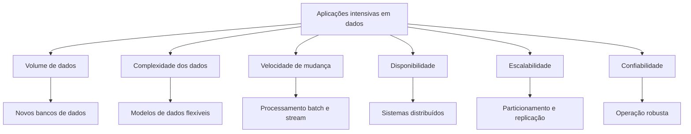
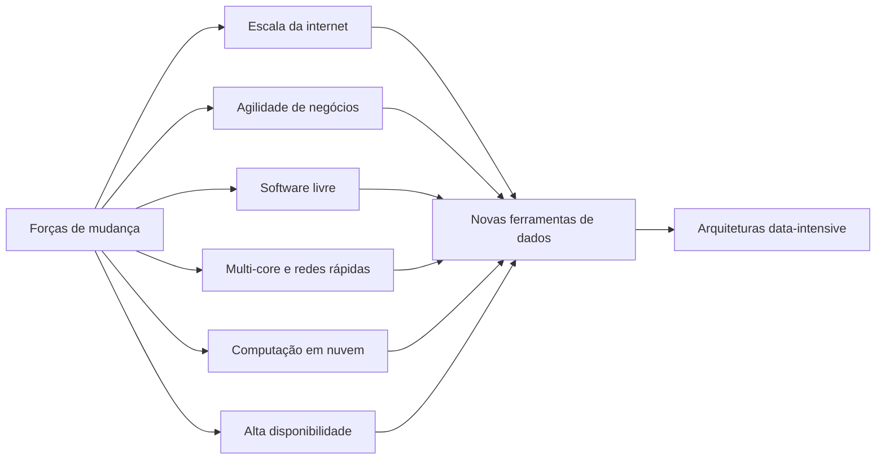
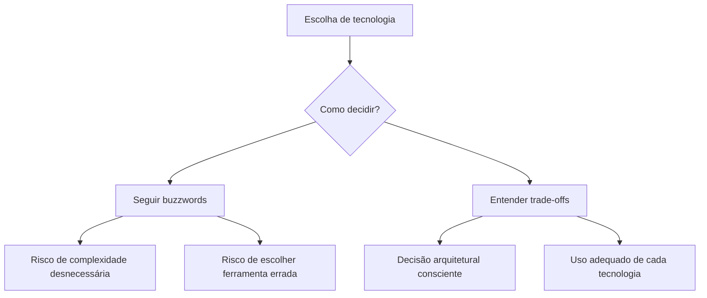
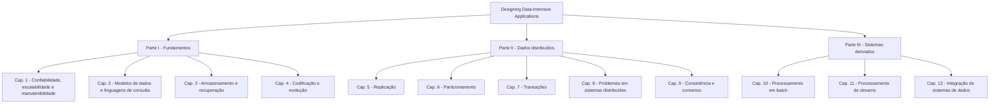

# Capítulo 00 — Sobre este Livro

## 1. Ideia central

O livro apresenta os fundamentos para projetar **aplicações intensivas em dados**. Esse tipo de aplicação tem como principal desafio lidar com:

* grande volume de dados;
* complexidade dos dados;
* velocidade com que os dados mudam;
* necessidade de alta disponibilidade;
* escalabilidade;
* confiabilidade operacional.

A proposta do livro não é ensinar uma ferramenta específica, mas explicar os **princípios duradouros** por trás de bancos de dados, sistemas distribuídos e arquiteturas modernas de processamento de dados.

## 2. Contexto

Nos últimos anos, a engenharia de software passou a lidar com termos como:

* NoSQL;
* Big Data;
* web-scale;
* sharding;
* consistência eventual;
* ACID;
* teorema CAP;
* serviços em nuvem;
* MapReduce;
* sistemas em tempo real.

O livro destaca que esses termos refletem mudanças reais na forma como sistemas são construídos, mas também alerta que buzzwords não bastam. Para tomar boas decisões arquiteturais, é necessário entender os **trade-offs** entre tecnologias.

## 3. Por que esses sistemas ganharam importância

O crescimento das aplicações intensivas em dados foi impulsionado por vários fatores:

| Fator                               | Impacto na arquitetura                                              |
| ----------------------------------- | ------------------------------------------------------------------- |
| Grandes empresas de internet        | Necessidade de lidar com volumes massivos de dados e tráfego        |
| Negócios mais ágeis                 | Sistemas precisam mudar rapidamente para testar hipóteses           |
| Software livre                      | Ferramentas abertas se tornaram base de muitos sistemas modernos    |
| Processadores multi-core            | Aumento da importância do paralelismo                               |
| Nuvem e infraestrutura como serviço | Facilidade para distribuir sistemas em múltiplas máquinas e regiões |
| Alta disponibilidade                | Indisponibilidades longas se tornaram cada vez menos aceitáveis     |

## 4. Objetivo do livro

O objetivo principal é ajudar o leitor a navegar pelo cenário de tecnologias de armazenamento e processamento de dados.

O livro procura responder perguntas como:

* Qual tecnologia usar em determinado cenário?
* Como diferentes ferramentas podem ser combinadas?
* Quais são os pontos fortes e fracos de cada abordagem?
* Como raciocinar sobre escalabilidade, confiabilidade e manutenção?
* Quais princípios permanecem válidos mesmo quando ferramentas mudam?

O foco está menos em “como instalar ou usar uma ferramenta” e mais em entender **como os sistemas funcionam internamente**.

## 5. Público-alvo

O livro é voltado para:

* engenheiros de software;
* arquitetos de software;
* gerentes técnicos que gostam de entender código e arquitetura;
* profissionais que trabalham com sistemas web, backend, serviços de rede ou aplicações conectadas à internet.

O leitor deve ter alguma familiaridade com:

* aplicações web;
* serviços backend;
* bancos relacionais;
* SQL;
* conceitos básicos de rede, como TCP e HTTP.

Não é obrigatório conhecer bancos NoSQL ou sistemas distribuídos previamente.

## 6. Quando este livro é especialmente útil

O livro é valioso quando o leitor precisa:

* construir sistemas escaláveis;
* manter aplicações altamente disponíveis;
* tornar sistemas mais fáceis de manter ao longo do tempo;
* entender o que acontece internamente em bancos de dados e sistemas de processamento;
* tomar decisões melhores entre diferentes tecnologias.

Um ponto importante do capítulo é evitar duas decisões ruins:

## 7. Escopo do livro

O livro não pretende ser um manual de instalação, configuração ou uso de APIs específicas.

O foco está na **arquitetura dos sistemas de dados** e nas decisões de projeto tomadas por diferentes produtos e tecnologias.

Também há uma preferência por tecnologias livres e abertas, porque permitem estudar código-fonte e entender melhor os detalhes internos. Ainda assim, o livro reconhece que softwares proprietários, serviços em nuvem e sistemas internos de empresas também são relevantes.

## 8. Organização geral do livro

O livro é dividido em três partes.

## 9. Mensagem principal do capítulo

A introdução estabelece uma ideia importante para todo o restante do livro:

> Tecnologias mudam rapidamente, mas os princípios por trás de bons sistemas de dados permanecem relevantes.

Por isso, o livro busca desenvolver a capacidade de raciocinar sobre sistemas, e não apenas ensinar ferramentas específicas.

## 10. Resumo executivo

O Capítulo 00 apresenta o propósito do livro: estudar como projetar sistemas confiáveis, escaláveis e manuteníveis em um mundo onde os dados são cada vez mais volumosos, complexos e distribuídos.

A introdução deixa claro que a escolha de tecnologia não deve ser guiada por modismos. A decisão correta depende do entendimento dos requisitos, dos trade-offs e dos princípios internos de cada abordagem.
