# Capítulo 01 — Aplicações Confiáveis, Escaláveis e Manuteníveis

Baseado no PDF enviado do Capítulo 1, incluindo as figuras das páginas 3, 10, 12 e 15. 

## 1. Ideia central do capítulo

Aplicações modernas são, em grande parte, **data-intensive applications**: sistemas em que o maior desafio não é apenas CPU, mas sim **volume de dados**, **complexidade dos dados** e **velocidade com que os dados mudam**.

Um sistema desse tipo normalmente combina vários blocos:

* banco de dados;
* cache;
* índice de busca;
* fila de mensagens;
* processamento assíncrono;
* processamento em lote;
* serviços de aplicação.

O ponto principal do capítulo é: **não basta escolher tecnologias isoladas**. O arquiteto precisa entender como elas se combinam para produzir sistemas **confiáveis**, **escaláveis** e **manuteníveis**.

---

## 2. Sistema de dados como composição de componentes

A figura da página 3 mostra uma arquitetura em que a aplicação combina banco primário, cache, índice de busca e fila de mensagens.

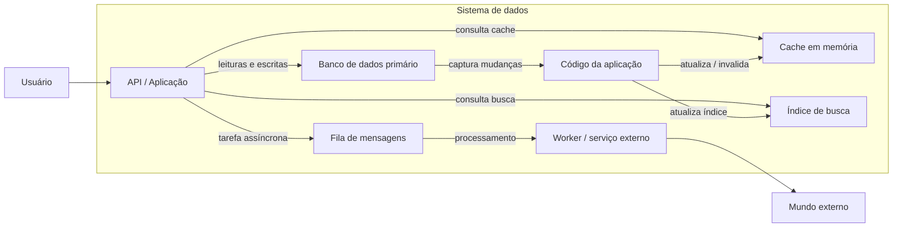

### Interpretação

O capítulo chama atenção para um ponto importante: quando combinamos componentes como banco, cache, índice e fila, deixamos de ser apenas “usuários” dessas ferramentas. Passamos a projetar um **sistema de dados composto**.

Isso gera perguntas arquiteturais:

* O que acontece se o banco estiver lento?
* Como manter cache e índice de busca consistentes?
* Como lidar com tarefas assíncronas que falham?
* Como manter a API simples mesmo com vários componentes internos?
* Como escalar sem tornar o sistema impossível de operar?

---

## 3. Três propriedades fundamentais

O capítulo organiza a discussão em três grandes objetivos.

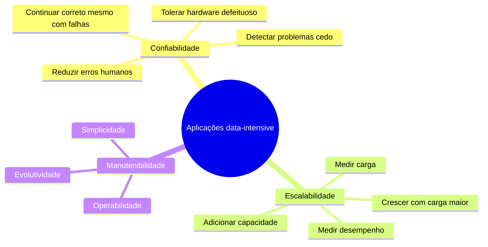

## 4. Confiabilidade

Confiabilidade significa que o sistema continua funcionando corretamente mesmo quando algo dá errado.

Um sistema confiável deve:

* executar a função esperada pelo usuário;
* tolerar erros de uso;
* manter desempenho aceitável sob carga esperada;
* impedir acesso não autorizado;
* recuperar-se de falhas previsíveis.

### Falha, defeito e tolerância

O capítulo diferencia dois conceitos:

| Conceito    | Significado                                                 |
| ----------- | ----------------------------------------------------------- |
| **Fault**   | Um componente interno se comporta de forma incorreta.       |
| **Failure** | O sistema como um todo deixa de prestar o serviço esperado. |

O objetivo não é eliminar todo defeito possível, porque isso é inviável. O objetivo é evitar que defeitos internos virem falhas visíveis para o usuário.

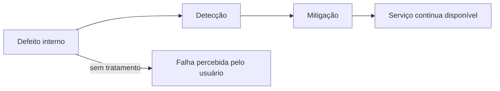

---

## 5. Tipos de falhas

### 5.1 Falhas de hardware

São problemas como:

* disco com defeito;
* memória com erro;
* fonte queimada;
* cabo desconectado;
* máquina indisponível;
* datacenter com instabilidade.

A abordagem tradicional é usar redundância: discos em RAID, fontes duplicadas, baterias, máquinas reservas e replicação.

Mas o capítulo destaca uma mudança importante: em sistemas grandes, principalmente em ambientes distribuídos e cloud, é comum assumir que máquinas vão falhar. Por isso, a arquitetura precisa tolerar a perda de máquinas inteiras.

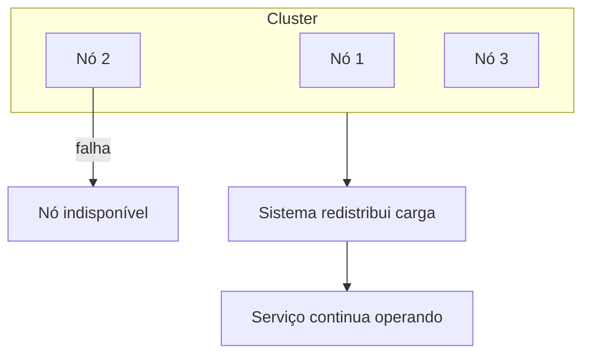

### 5.2 Erros de software

Erros de software costumam ser mais perigosos porque podem ser **sistemáticos**. Diferente de uma falha isolada de disco, um bug pode afetar todas as máquinas ao mesmo tempo.

Exemplos:

* bug ativado por uma entrada específica;
* processo consumindo CPU, memória ou disco sem controle;
* dependência externa lenta;
* falha em cascata entre componentes;
* comportamento incorreto depois de muito tempo rodando.

### 5.3 Erros humanos

Pessoas configuram, implantam, operam e modificam sistemas. Logo, erros humanos são inevitáveis.

O capítulo recomenda projetar sistemas que reduzam oportunidades de erro:

* interfaces administrativas claras;
* ambientes de teste isolados;
* rollback rápido;
* deploy gradual;
* monitoramento;
* bons logs;
* automação;
* validações;
* documentação operacional.

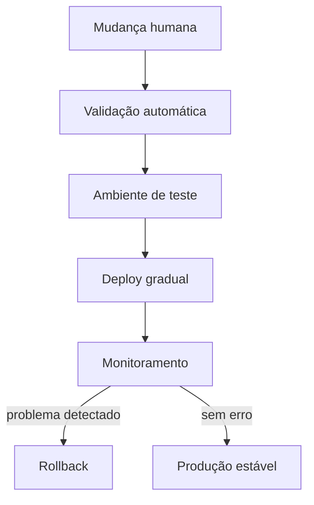

---

## 6. Escalabilidade

Escalabilidade não significa simplesmente dizer “o sistema escala” ou “não escala”. A pergunta correta é:

> Quando a carga aumenta, o que acontece com o desempenho e quais recursos precisamos adicionar para manter o sistema aceitável?

O capítulo propõe analisar escalabilidade em três etapas:

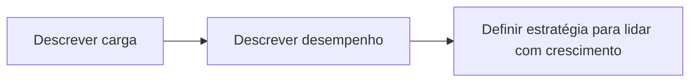

---

## 7. Descrevendo carga

Para discutir escalabilidade, primeiro precisamos definir os **parâmetros de carga**.

Exemplos:

* requisições por segundo;
* leituras por segundo;
* escritas por segundo;
* número de usuários simultâneos;
* tamanho dos dados;
* taxa de cache hit;
* número de seguidores por usuário;
* quantidade de mensagens em fila;
* fan-out de uma operação.

### Exemplo do Twitter

O capítulo usa o Twitter como exemplo. Duas operações principais:

| Operação       | Característica               |
| -------------- | ---------------------------- |
| Publicar tweet | Escrita relativamente menor. |
| Ler timeline   | Leitura muito frequente.     |

A dificuldade não está apenas em armazenar tweets, mas em entregar rapidamente a timeline dos usuários.

---

## 8. Modelo relacional simples para timeline

A figura da página 10 mostra um esquema relacional simplificado para implementar timeline.

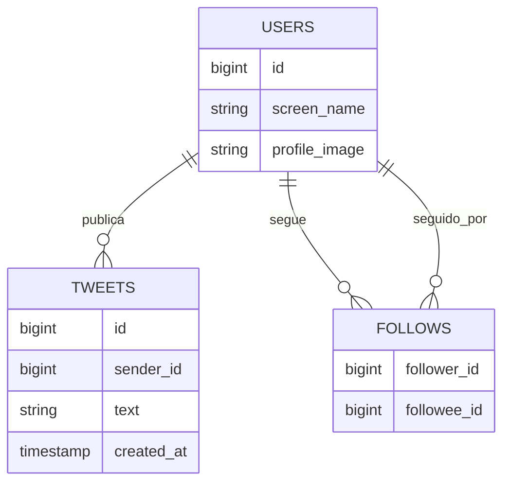

### Abordagem 1 — calcular timeline na leitura

Quando o usuário abre a timeline:

1. buscar quem ele segue;
2. buscar tweets dessas pessoas;
3. ordenar por tempo;
4. retornar a timeline.

Vantagem: escrita simples.

Desvantagem: leitura cara, especialmente quando a timeline é acessada com muita frequência.

---

## 9. Abordagem com fan-out na escrita

A figura da página 10 também mostra a segunda abordagem: quando alguém publica um tweet, o sistema já entrega esse tweet para a timeline de todos os seguidores.

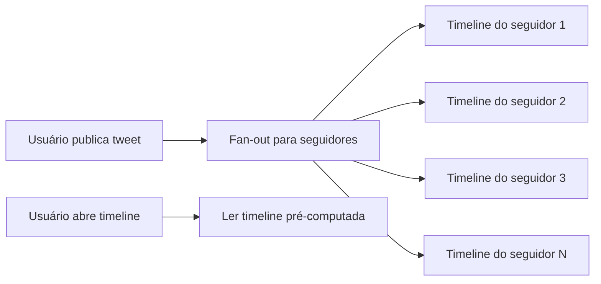

Vantagem: leitura rápida.

Desvantagem: escrita pode ficar muito cara, principalmente quando o usuário tem milhões de seguidores.

### Comparação

| Estratégia          | Escrita |      Leitura | Problema principal                 |
| ------------------- | ------: | -----------: | ---------------------------------- |
| Calcular na leitura |  Barata |         Cara | Timeline lenta                     |
| Fan-out na escrita  |    Cara |       Barata | Celebridades geram muitas escritas |
| Híbrida             |   Média | Média/rápida | Mais complexidade                  |

O capítulo mostra que o Twitter acabou usando uma abordagem híbrida: usuários comuns seguem o fan-out tradicional; usuários com muitos seguidores são tratados de forma especial.

---

## 10. Descrevendo desempenho

Depois de descrever carga, precisamos medir desempenho.

Em sistemas batch, a métrica comum é **throughput**: quantidade de registros processados por unidade de tempo.

Em sistemas online, a métrica mais importante é o **tempo de resposta**: tempo entre o cliente enviar uma requisição e receber a resposta.

### Latência versus tempo de resposta

O capítulo diferencia os termos:

| Termo                 | Ideia                                                                              |
| --------------------- | ---------------------------------------------------------------------------------- |
| **Latência**          | Tempo em que uma requisição fica esperando para ser tratada.                       |
| **Tempo de resposta** | Tempo total observado pelo cliente, incluindo processamento, rede, filas e espera. |

---

## 11. Média, mediana e percentis

A figura da página 12 mostra que tempos de resposta variam. Não basta olhar apenas a média.

A média pode esconder usuários que tiveram experiência ruim.

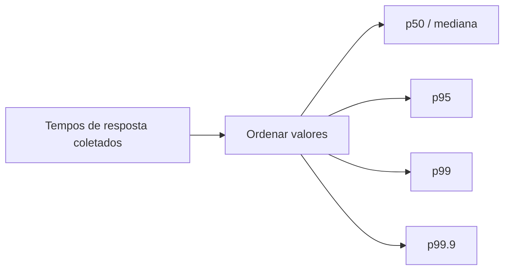

### Como interpretar

| Métrica   | Interpretação                                                       |
| --------- | ------------------------------------------------------------------- |
| **p50**   | 50% das requisições foram mais rápidas que esse valor.              |
| **p95**   | 95% das requisições foram mais rápidas que esse valor.              |
| **p99**   | 99% das requisições foram mais rápidas que esse valor.              |
| **p99.9** | Mostra casos extremos, geralmente importantes em sistemas críticos. |

Percentis altos são importantes porque mostram a experiência dos usuários mais afetados.

---

## 12. Tail latency e fan-out para backends

A figura da página 15 mostra uma aplicação web chamando vários backends. Mesmo que quase todos respondam rápido, basta um backend lento para atrasar a resposta final.

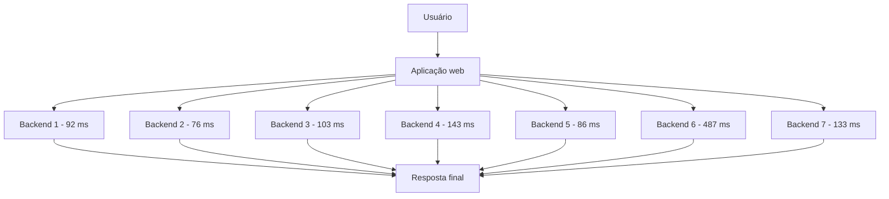

O tempo final fica preso ao backend mais lento. Esse efeito é uma forma de **tail latency**: a cauda da distribuição de tempos de resposta prejudica a experiência do usuário.

---

## 13. Head-of-line blocking

Outro conceito importante é o bloqueio por uma requisição lenta. Se poucas requisições lentas seguram recursos, outras requisições rápidas podem ficar esperando.

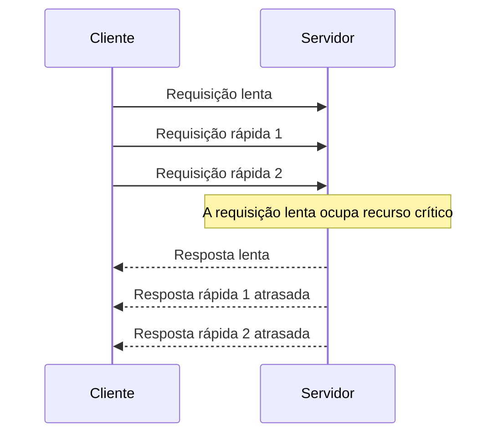

Por isso, testes de carga precisam simular clientes independentes. Se o teste envia uma nova requisição apenas depois da anterior terminar, ele pode esconder filas reais.

---

## 14. Estratégias para lidar com carga

O capítulo apresenta duas formas clássicas de escalar:

| Estratégia      | Nome comum        | Ideia                                   |
| --------------- | ----------------- | --------------------------------------- |
| **Scaling up**  | Escala vertical   | Usar uma máquina maior.                 |
| **Scaling out** | Escala horizontal | Distribuir carga entre várias máquinas. |

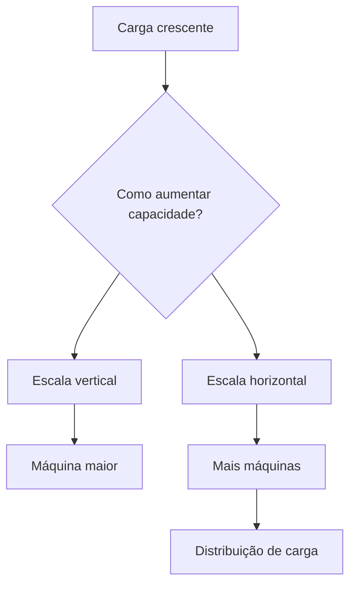

### Observação importante

Escalar serviços sem estado costuma ser mais simples. Escalar dados com estado é mais complexo, porque envolve:

* particionamento;
* replicação;
* consistência;
* rebalanceamento;
* tolerância a falhas;
* recuperação;
* coordenação entre nós.

---

## 15. Manutenibilidade

A maior parte do custo de software não está na primeira versão, mas na manutenção:

* corrigir bugs;
* investigar falhas;
* adaptar para novos requisitos;
* migrar plataformas;
* melhorar desempenho;
* operar produção;
* integrar com novos sistemas.

O capítulo divide manutenibilidade em três princípios.

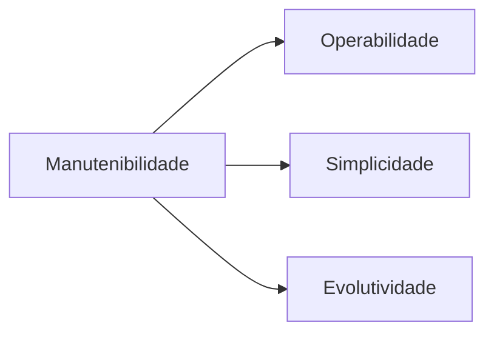

---

## 16. Operabilidade

Operabilidade significa facilitar a vida de quem mantém o sistema funcionando.

Um sistema operável deve oferecer:

* monitoramento claro;
* logs úteis;
* métricas;
* automação;
* deploy previsível;
* configuração compreensível;
* documentação operacional;
* recuperação de falhas;
* comportamento previsível em produção.

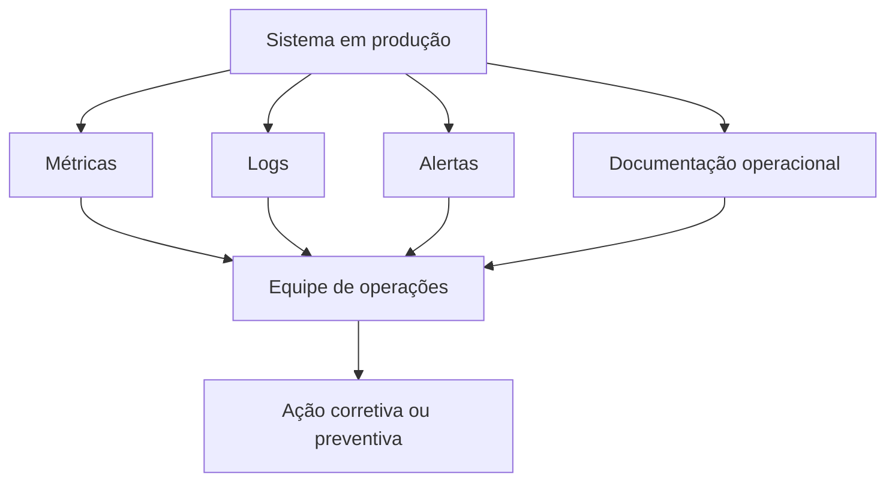

---

## 17. Simplicidade

Simplicidade não significa falta de funcionalidade. Significa reduzir **complexidade acidental**.

Complexidade acidental é tudo aquilo que torna o sistema difícil de entender sem agregar valor real ao domínio.

Exemplos:

* acoplamento excessivo;
* dependências confusas;
* nomes inconsistentes;
* regras espalhadas;
* comportamento implícito;
* hacks locais;
* tratamento especial para muitos casos;
* falta de abstrações claras.

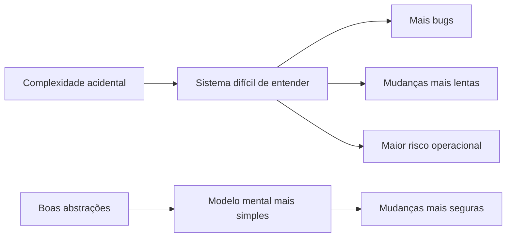

---

## 18. Evolutividade

Evolutividade é a capacidade de adaptar o sistema a mudanças futuras.

Mudanças comuns:

* novos requisitos;
* crescimento de tráfego;
* novos casos de uso;
* alterações legais;
* migração tecnológica;
* troca de plataforma;
* necessidade de integração;
* novos padrões de uso.

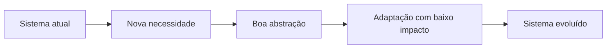

Um sistema evolutivo não é aquele que prevê perfeitamente o futuro. É aquele que consegue mudar sem exigir reescrita completa.

---

## 19. Relação entre confiabilidade, escalabilidade e manutenibilidade

Essas três propriedades se influenciam.

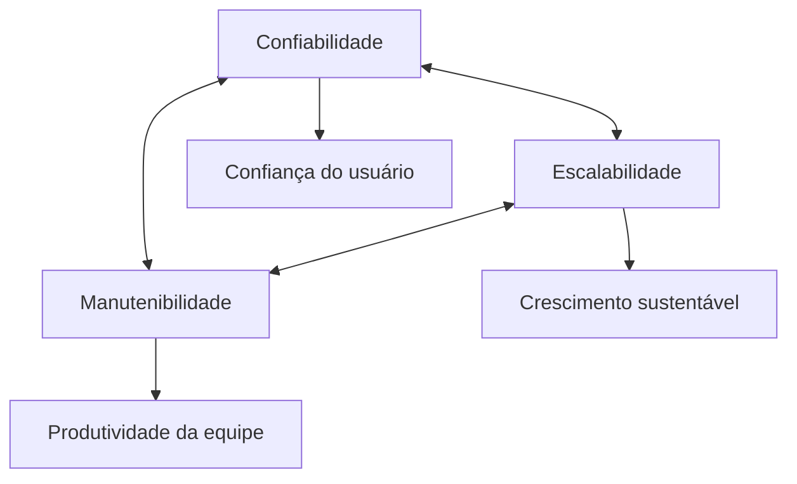

Exemplos:

* Um sistema pode ser escalável, mas difícil de operar.
* Um sistema pode ser confiável hoje, mas impossível de evoluir.
* Uma otimização de desempenho pode aumentar complexidade.
* Uma arquitetura simples pode facilitar recuperação de falhas.
* Boa observabilidade melhora confiabilidade e operabilidade.

---

## 20. Checklist de arquitetura do capítulo

Use este checklist ao avaliar um sistema data-intensive.

### Confiabilidade

* O sistema continua funcionando se uma máquina falhar?
* Existe retry, timeout e fallback?
* Há monitoramento de erros?
* Existe rollback?
* O deploy é gradual?
* Falhas parciais são isoladas?
* O sistema evita falhas em cascata?

### Escalabilidade

* Quais são os principais parâmetros de carga?
* O gargalo está em leitura, escrita, CPU, memória, rede ou disco?
* O sistema mede p95 e p99, não apenas média?
* A arquitetura suporta crescimento de dados?
* O sistema escala horizontalmente?
* Serviços com estado foram tratados com cuidado?

### Manutenibilidade

* O sistema é fácil de entender?
* A operação tem logs e métricas suficientes?
* Existe documentação operacional?
* O modelo de domínio está claro?
* Há abstrações úteis?
* Mudanças pequenas exigem alterações em muitos lugares?
* A equipe consegue diagnosticar problemas rapidamente?

---

## 21. Resumo final

O Capítulo 1 estabelece a base conceitual do livro.

Aplicações modernas orientadas a dados combinam diversos componentes: bancos, caches, índices, filas e processamentos assíncronos. Essa composição aumenta poder e flexibilidade, mas também aumenta a responsabilidade arquitetural.

Os três objetivos principais são:

| Objetivo             | Pergunta central                                                          |
| -------------------- | ------------------------------------------------------------------------- |
| **Confiabilidade**   | O sistema continua correto mesmo quando algo falha?                       |
| **Escalabilidade**   | O sistema continua performático quando a carga cresce?                    |
| **Manutenibilidade** | A equipe consegue operar, entender e evoluir o sistema ao longo do tempo? |

A mensagem mais importante do capítulo é que arquitetura de sistemas não é apenas escolher tecnologia. É entender **trade-offs**, medir corretamente e projetar sistemas que sobrevivam ao crescimento, às falhas e às mudanças.
