# Capítulo 02 — Modelos de Dados e Linguagens de Consulta

Documentação em português baseada no PDF enviado do capítulo 2, páginas 25–44. 

---

## 1. Ideia central do capítulo

O capítulo defende que **modelos de dados são uma das partes mais importantes no desenvolvimento de software**, porque influenciam diretamente:

* como pensamos sobre o problema;
* como representamos entidades do mundo real;
* como armazenamos dados;
* como consultamos dados;
* como a aplicação evolui ao longo do tempo.

A frase de abertura do capítulo, atribuída a Wittgenstein, resume bem a ideia:

> Os limites da linguagem influenciam os limites do mundo que conseguimos representar.

Em software, isso significa que o modelo de dados escolhido limita ou facilita o modo como conseguimos descrever o domínio da aplicação.

---

## 2. Camadas de modelos de dados

Uma aplicação normalmente não trabalha com um único modelo de dados. Ela empilha várias representações.

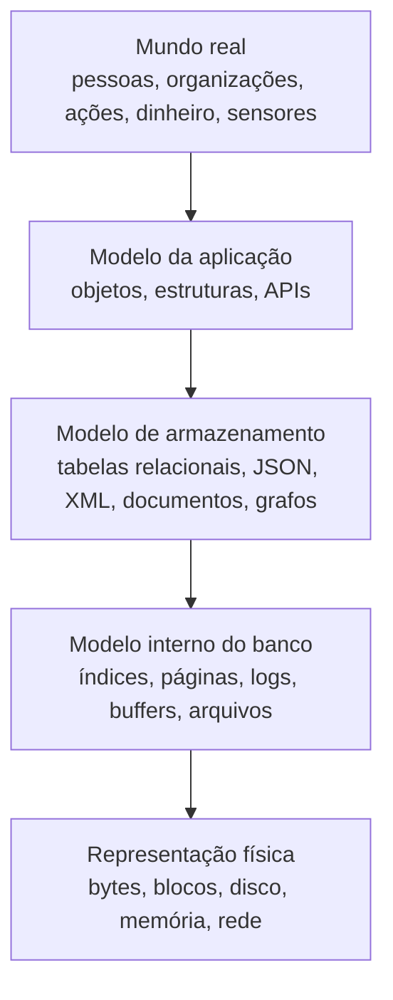

Cada camada esconde detalhes da camada inferior. Isso permite que o desenvolvedor pense em conceitos de negócio sem precisar lidar diretamente com bytes em disco, corrente elétrica ou pulsos magnéticos.

---

## 3. Modelo relacional versus modelo documental

O capítulo começa comparando dois modelos muito importantes:

| Modelo     | Ideia principal                                                            | Exemplo                     |
| ---------- | -------------------------------------------------------------------------- | --------------------------- |
| Relacional | Dados organizados em relações, ou seja, tabelas com linhas e colunas       | PostgreSQL, MySQL, Oracle   |
| Documental | Dados organizados em documentos autocontidos, geralmente JSON, XML ou BSON | MongoDB, CouchDB, RethinkDB |

O modelo relacional dominou o mercado por décadas porque é flexível, possui boa base matemática e separa bem a forma de consulta da forma física de armazenamento.

O modelo documental ganhou força porque algumas estruturas de dados da aplicação já se parecem naturalmente com documentos, especialmente quando há muitos relacionamentos **um-para-muitos** internos a uma entidade principal.

---

## 4. O nascimento do NoSQL

O termo **NoSQL** surgiu como uma tentativa de descrever bancos de dados não relacionais, mas o próprio capítulo destaca que o nome é impreciso. O uso mais comum passou a ser:

> **Not Only SQL** — não apenas SQL.

A adoção de bancos NoSQL foi impulsionada por alguns fatores:

1. necessidade de maior escalabilidade do que muitos bancos relacionais conseguiam oferecer na época;
2. preferência por software livre em vez de produtos comerciais;
3. necessidade de operações de consulta não bem atendidas pelo modelo relacional;
4. frustração com esquemas rígidos;
5. desejo por modelos mais dinâmicos e expressivos.

Um ponto importante do capítulo é que **NoSQL não substitui automaticamente SQL**. Muitas aplicações combinam tecnologias diferentes, prática chamada de **persistência poliglota**.

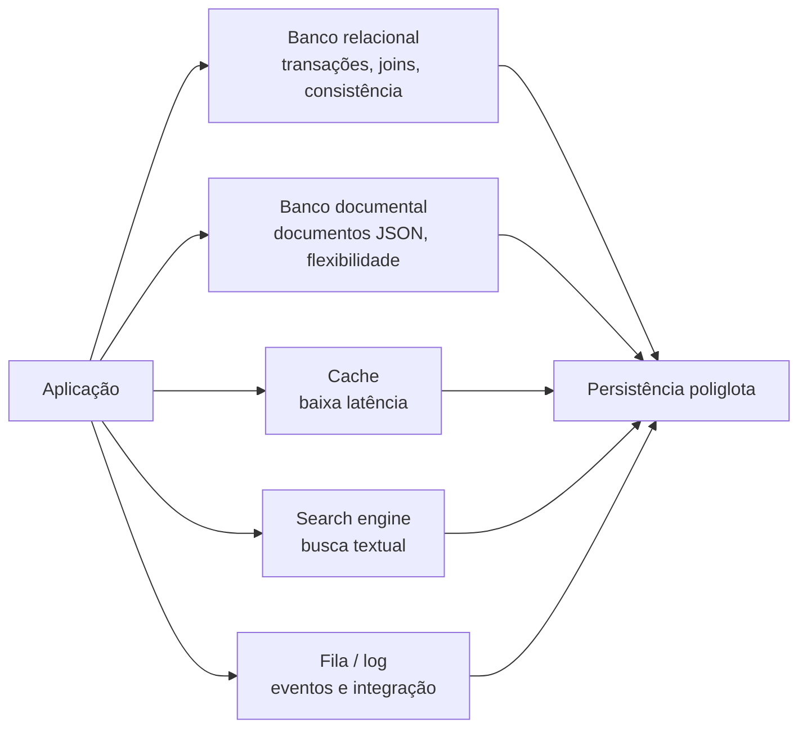

---

## 5. O problema do descompasso objeto-relacional

Grande parte das aplicações é escrita em linguagens orientadas a objetos, mas os dados são armazenados em tabelas relacionais. Isso cria um descompasso conhecido como:

> **Object-relational impedance mismatch**

Na prática, a aplicação pensa em objetos aninhados, enquanto o banco relacional exige decomposição em várias tabelas.

Exemplo conceitual: um perfil profissional pode ter:

* dados pessoais;
* região;
* setor de atuação;
* cargos anteriores;
* formação acadêmica;
* contatos;
* links externos.

Em uma aplicação, isso parece um único objeto `Perfil`. Em um banco relacional normalizado, isso vira várias tabelas.

---

## 6. Representação relacional de um perfil

A figura 2-1 mostra um perfil no estilo LinkedIn representado com tabelas relacionais.

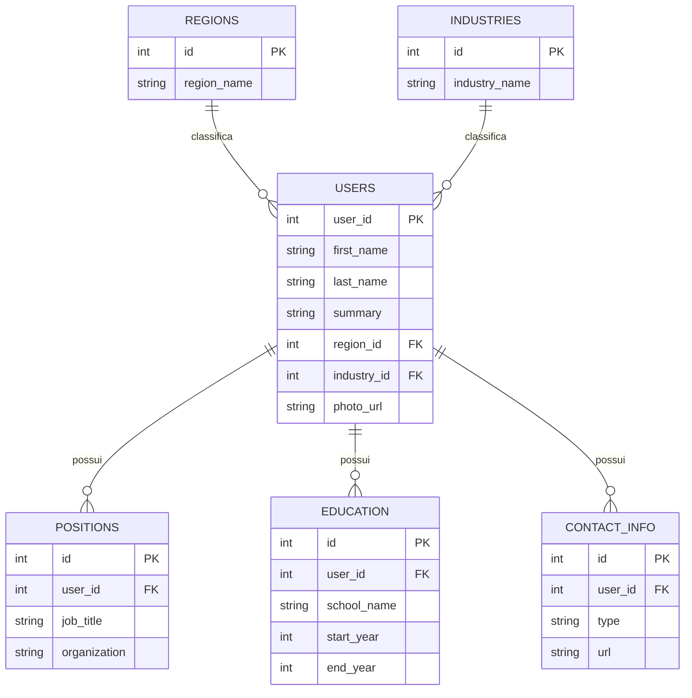

### Interpretação

No modelo relacional, cada grupo de dados repetível fica em uma tabela separada. Isso evita duplicação, mas exige consultas com `JOIN` ou múltiplas consultas.

---

## 7. Representação documental do mesmo perfil

No modelo documental, os dados podem ser agrupados em um documento JSON.

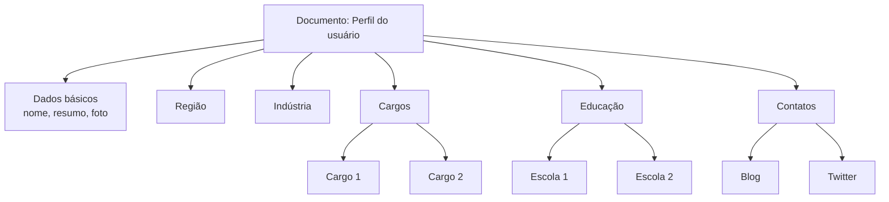

### Vantagem

A aplicação pode carregar o perfil completo com uma única leitura.

### Desvantagem

Se os dados começarem a apontar para muitas entidades externas, o documento deixa de ser tão simples.

---

## 8. Relacionamentos um-para-muitos

Documentos funcionam bem quando existe uma estrutura de árvore.

Exemplo:

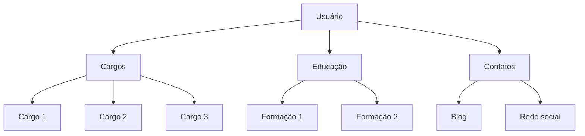

Esse caso é naturalmente documental porque os dados pertencem ao usuário e normalmente são acessados junto com ele.

---

## 9. Relacionamentos muitos-para-um

O capítulo mostra que alguns campos não devem ser apenas texto livre. Por exemplo:

* região;
* indústria;
* organização;
* escola.

Em vez de armazenar `"Greater Seattle Area"` como texto em cada perfil, pode ser melhor armazenar um ID para uma tabela ou entidade de regiões.

### Por que usar IDs?

Usar IDs traz vantagens:

| Vantagem             | Explicação                                                           |
| -------------------- | -------------------------------------------------------------------- |
| Consistência         | Todos usam a mesma referência                                        |
| Evita ambiguidade    | Diferencia lugares ou nomes parecidos                                |
| Facilita atualização | Altera-se o nome em um só lugar                                      |
| Suporte a tradução   | O mesmo ID pode ter rótulos em vários idiomas                        |
| Melhor busca         | A busca pode entender relações, como cidade dentro de estado ou país |

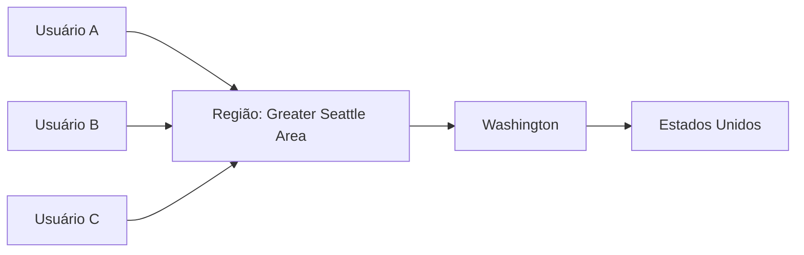

Aqui aparece uma tensão importante:

* **normalizar** reduz duplicação;
* **desnormalizar** pode facilitar leitura e melhorar desempenho em alguns cenários.

---

## 10. Relacionamentos muitos-para-muitos

Quando a aplicação cresce, os dados tendem a ficar mais interconectados.

O capítulo usa dois exemplos:

1. organizações e escolas deixam de ser apenas strings e passam a ser entidades próprias;
2. usuários podem recomendar outros usuários.

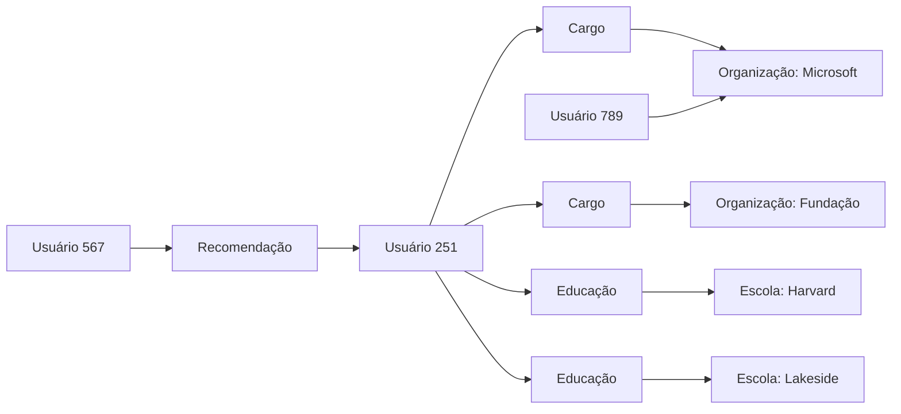

Esse tipo de conexão reduz a vantagem do modelo documental puro, porque os documentos passam a ter referências externas. Para montar a visão completa, a aplicação precisa fazer joins, consultas adicionais ou resolver referências manualmente.

---

## 11. Bancos documentais estão repetindo a história?

O capítulo faz uma comparação histórica com bancos hierárquicos, especialmente o **IMS**, usado desde os anos 1960.

O IMS armazenava dados em árvores, algo parecido com documentos JSON. Ele funcionava bem para relacionamentos um-para-muitos, mas tinha dificuldade com muitos-para-muitos.

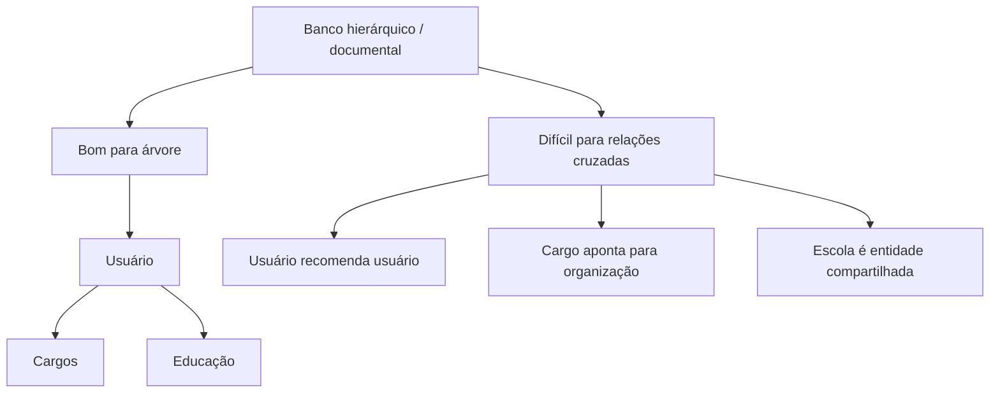

A pergunta central é: bancos documentais modernos estão reencontrando problemas antigos dos bancos hierárquicos?

A resposta do capítulo é equilibrada: eles resolvem muito bem alguns casos, mas relacionamentos complexos continuam exigindo cuidado.

---

## 12. Modelo em rede

O modelo em rede, padronizado pelo CODASYL, foi uma tentativa de resolver limitações do modelo hierárquico.

A diferença principal:

| Modelo      | Estrutura                        |
| ----------- | -------------------------------- |
| Hierárquico | Cada registro tem um único pai   |
| Em rede     | Um registro pode ter vários pais |

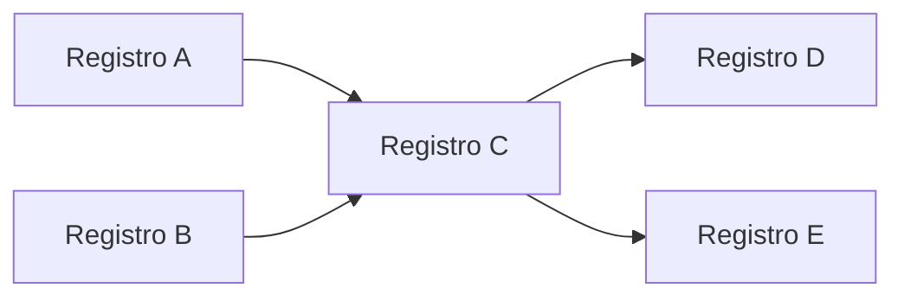

O problema era que o acesso aos dados dependia de caminhos explícitos. O programador precisava saber como navegar de um registro para outro.

Isso tornava as consultas frágeis: se o caminho mudasse, o código da aplicação também precisava mudar.

---

## 13. Modelo relacional

O modelo relacional simplificou esse problema ao colocar os dados “em aberto”.

Em vez de navegar manualmente por caminhos, a aplicação declara o que deseja.

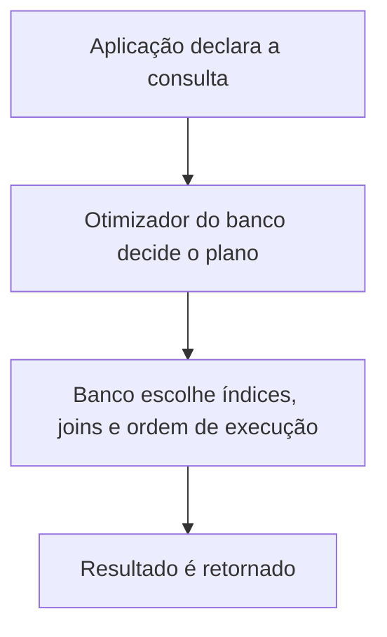

A grande vantagem é que o banco pode reorganizar a execução internamente sem exigir mudanças na aplicação.

---

## 14. Comparação: documental versus relacional

### Quando o modelo documental tende a ser melhor

O modelo documental é adequado quando os dados têm estrutura semelhante a uma árvore.

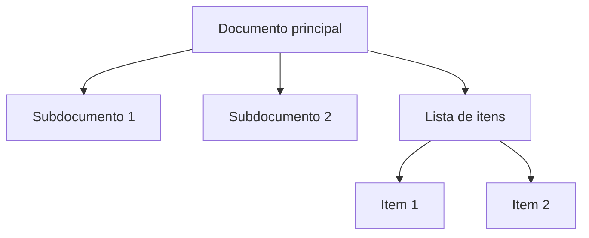

Exemplos:

* perfil de usuário;
* currículo;
* documento de configuração;
* pedido com seus itens;
* objeto recebido de uma API externa.

### Quando o modelo relacional tende a ser melhor

O modelo relacional é mais adequado quando há muitos relacionamentos cruzados.

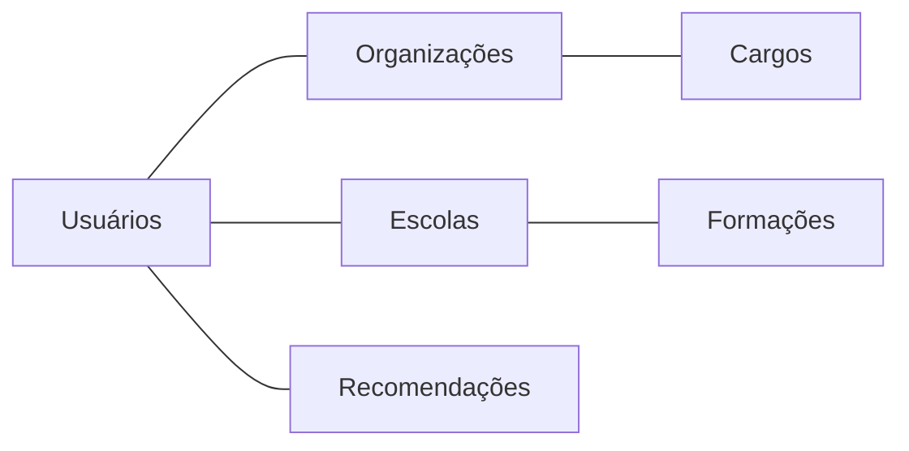

Exemplos:

* redes sociais;
* sistemas financeiros;
* sistemas administrativos complexos;
* domínios com muitas entidades compartilhadas;
* consultas variadas e imprevisíveis.

---

## 15. Flexibilidade de esquema no modelo documental

Bancos documentais geralmente são chamados de **schemaless**, mas o capítulo explica que isso é enganoso.

Na prática, sempre existe algum esquema. A diferença é onde ele é aplicado.

| Abordagem       | Característica                                |
| --------------- | --------------------------------------------- |
| Schema-on-write | O banco valida a estrutura na escrita         |
| Schema-on-read  | A aplicação interpreta a estrutura na leitura |

### Schema-on-write

É a abordagem tradicional dos bancos relacionais. Antes de gravar, a estrutura precisa estar definida.

Exemplo conceitual:

```sql
ALTER TABLE users ADD COLUMN first_name text;
ALTER TABLE users ADD COLUMN last_name text;
```

### Schema-on-read

É comum em bancos documentais. O documento pode ter formatos diferentes, e a aplicação decide como interpretar.

Exemplo conceitual:

```javascript
if (user && user.name && !user.first_name) {
  // interpreta um documento antigo em tempo de leitura
}
```

### Quando schema-on-read ajuda

Essa abordagem é útil quando:

* os dados são heterogêneos;
* existem muitos tipos diferentes de objetos;
* a estrutura muda com frequência;
* os dados vêm de sistemas externos sobre os quais não há controle.

---

## 16. Localidade dos dados

Uma vantagem importante do modelo documental é a **localidade**.

Se a aplicação precisa carregar o documento inteiro com frequência, armazenar tudo junto pode ser eficiente.

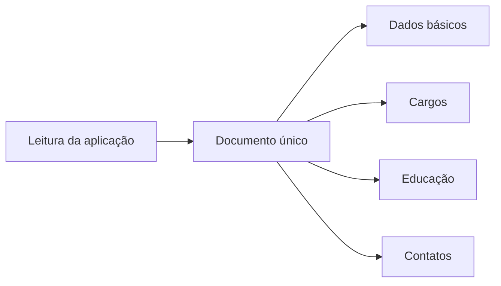

No modelo relacional, a mesma leitura poderia exigir múltiplos índices e joins.

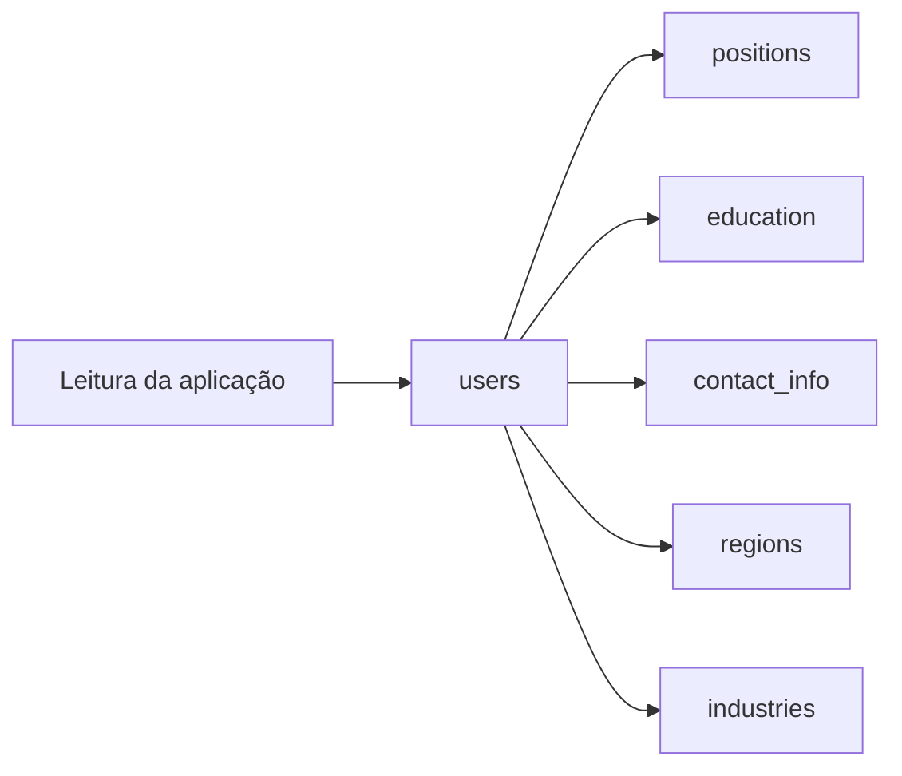

### Limitação

A localidade só ajuda se a aplicação realmente precisa de grande parte do documento ao mesmo tempo.

Se a aplicação atualiza frequentemente apenas um pequeno campo, pode ser custoso reescrever o documento inteiro.

---

## 17. Convergência entre bancos relacionais e documentais

O capítulo mostra que a separação entre relacional e documental está ficando menos rígida.

Bancos relacionais passaram a suportar XML e JSON. Bancos documentais passaram a oferecer recursos parecidos com joins ou linguagens de consulta mais sofisticadas.

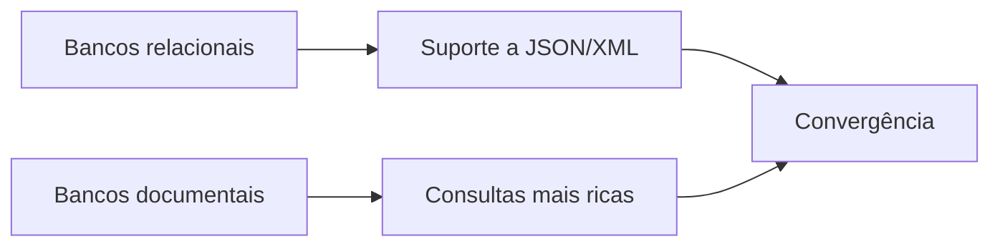

A tendência apresentada é que os bancos de dados combinem características dos dois mundos.

---

## 18. Linguagens de consulta

O capítulo passa então para a diferença entre linguagens **imperativas** e **declarativas**.

### Linguagem imperativa

A aplicação diz **como** fazer.

Exemplo conceitual:

```javascript
function buscarTubaroes(animais) {
  const resultado = [];

  for (const animal of animais) {
    if (animal.familia === "Sharks") {
      resultado.push(animal);
    }
  }

  return resultado;
}
```

### Linguagem declarativa

A aplicação diz **o que** quer.

```sql
SELECT *
FROM animals
WHERE family = 'Sharks';
```

A diferença é fundamental:

| Estilo      | A aplicação define                          |
| ----------- | ------------------------------------------- |
| Imperativo  | como percorrer, testar e montar o resultado |
| Declarativo | qual resultado deseja obter                 |

---

## 19. Por que linguagens declarativas são importantes?

Linguagens declarativas permitem que o banco otimize a execução.

A aplicação não precisa saber:

* qual índice usar;
* em que ordem processar os dados;
* qual algoritmo de join aplicar;
* como paralelizar a execução;
* como reorganizar fisicamente os dados.

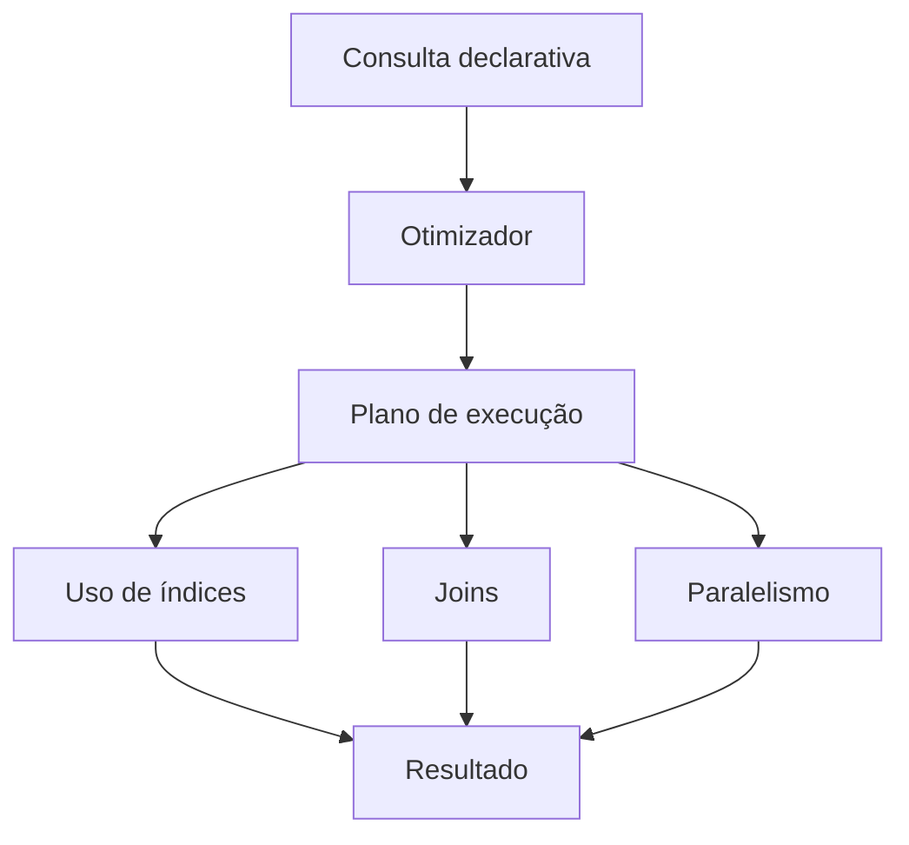

Essa é uma das grandes forças do SQL: ele não obriga o programador a codificar o algoritmo de busca manualmente.

---

## 20. Consultas declarativas na web

O capítulo mostra que linguagens declarativas não existem apenas em bancos de dados.

CSS também é declarativo.

Exemplo: selecionar o item marcado como `selected` e mudar seu estilo.

```css
li.selected > p {
  background-color: blue;
}
```

A regra não diz como percorrer a árvore DOM. Ela apenas declara o padrão desejado.

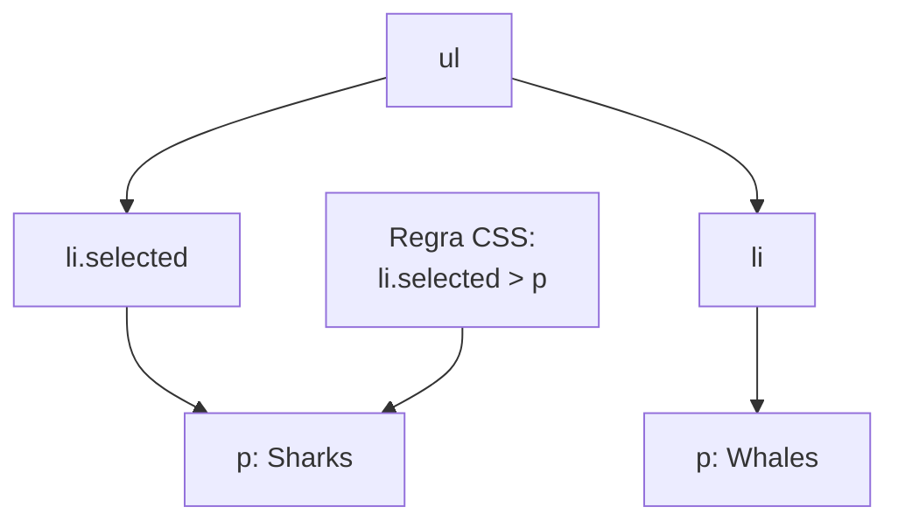

Em JavaScript imperativo, seria necessário percorrer elementos, verificar classes, verificar filhos e aplicar estilo manualmente. O código fica mais longo, mais acoplado à estrutura da página e mais difícil de manter.

---

## 21. Síntese do capítulo

O capítulo constrói uma ideia progressiva:

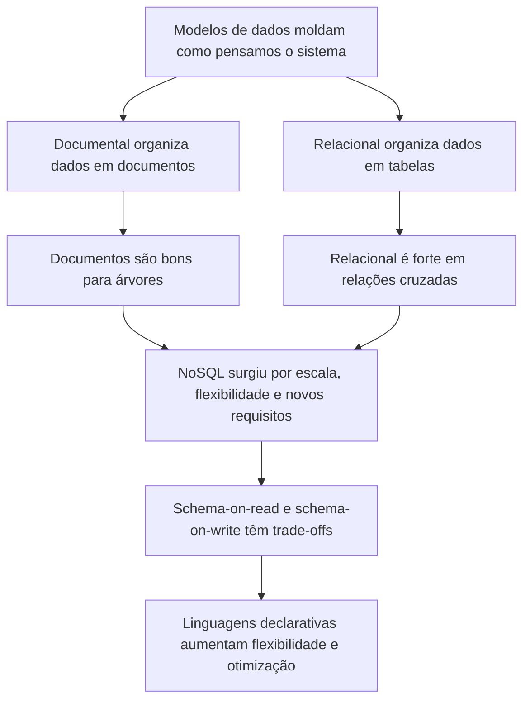

---

## 22. Regras práticas para arquitetura

### Use modelo documental quando:

* a entidade principal é naturalmente autocontida;
* a maioria das leituras precisa do documento inteiro;
* os dados possuem estrutura de árvore;
* a estrutura muda com frequência;
* a aplicação recebe dados heterogêneos de fontes externas.

### Use modelo relacional quando:

* há muitos relacionamentos muitos-para-muitos;
* os dados precisam ser consultados de várias formas;
* consistência e integridade referencial são importantes;
* joins são frequentes e relevantes;
* o domínio possui muitas entidades compartilhadas.

### Evite decisões simplistas

A escolha não deve ser:

```text
SQL é antigo e NoSQL é moderno
```

Nem:

```text
Relacional é sempre melhor
```

A escolha correta depende do formato dos dados, dos padrões de acesso, da necessidade de consistência, da frequência de mudança do esquema e da complexidade dos relacionamentos.

---

## 23. Resumo final

O capítulo 2 mostra que modelos de dados não são apenas detalhes técnicos. Eles afetam profundamente o desenho da aplicação.

O modelo relacional continua forte porque lida muito bem com dados interconectados, consultas flexíveis e separação entre lógica de consulta e armazenamento físico.

O modelo documental é poderoso quando os dados têm formato de árvore, quando a localidade melhora o desempenho e quando a flexibilidade de esquema é importante.

A principal lição é:

> Escolha o modelo de dados conforme a forma dos dados e os padrões de acesso da aplicação, não por moda tecnológica.
