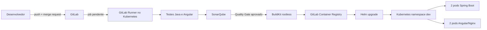

# Lab Kubernetes + Terraform + GitLab CI/CD + SonarQube

Laboratório local e descartável para simular um ambiente de desenvolvimento composto por:

- Kubernetes local com **Kind**, contendo um control plane e dois workers;
- infraestrutura reproduzível com **Terraform**;
- **GitLab Runner** executado dentro do cluster;
- **SonarQube Community Build** e PostgreSQL no Kubernetes;
- microbackend **Java 21 + Spring Boot**;
- microfrontend implantável **Angular 18 + Nginx**;
- imagens armazenadas no **GitLab Container Registry**;
- deploy com **Helm**;
- rolling update automático após merge na branch principal.

> Este projeto é um laboratório. Há escolhas deliberadamente simplificadas,
> como runner privilegiado, senhas mantidas no state local do Terraform e
> exposição por NodePort. Não replique essas escolhas diretamente em produção.

## 1. O que será simulado



O fluxo foi dividido em dois momentos:

1. **Merge request:** valida Terraform/Helm e executa testes Java e Angular.
2. **Merge na branch padrão:** repete testes, executa SonarQube, cria as imagens,
   envia ao Registry e atualiza os Deployments por `helm upgrade --install`.

A análise SonarQube ocorre depois do merge porque a Community Build analisa a
branch principal. Mesmo assim, o deploy só começa quando o Quality Gate passa.
Para bloquear o merge usando análise nativa de merge request, seria necessário
usar uma edição do SonarQube com suporte a pull requests ou SonarQube Cloud.

## 2. Capacidade da máquina

A máquina informada possui 24 GiB de RAM e 16 threads lógicas, capacidade
suficiente para o laboratório. Recomenda-se manter pelo menos:

- 10 a 12 GiB disponíveis para WSL2/Docker;
- 4 GiB livres para o SonarQube;
- 2 GiB livres para PostgreSQL, runner e jobs;
- espaço livre para imagens Docker e caches Maven/NPM.

Caso exista um limite baixo em `%UserProfile%\.wslconfig`, ajuste-o e execute
`wsl --shutdown` no PowerShell antes de recriar o ambiente.

## 3. Pré-requisitos

No Ubuntu/WSL2, devem estar instalados:

- Docker Engine ou Docker Desktop com integração WSL2;
- Terraform 1.11 ou superior (o pipeline usa 1.15.8);
- kubectl 1.35.5;
- Helm 4 (o pipeline usa 4.2.3);
- Kind 0.32.0;
- Git.

Valide tudo:

```bash
make check
```

Na primeira execução do frontend, o NPM pode gerar `package-lock.json`. Versione
esse arquivo; a partir daí, o Dockerfile e o pipeline passam automaticamente a
usar `npm ci`, tornando as dependências transitivas reproduzíveis.

## 4. Estrutura do projeto

```text
.
├── .gitlab-ci.yml                   # Pipeline completo
├── Makefile                         # Comandos simplificados
├── apps/
│   ├── backend/                     # Spring Boot + Java 21
│   └── frontend/                    # Angular 18 + Nginx
├── deploy/helm/microplatform/       # Deployments e Services
├── infra/
│   ├── cluster/                     # Kind criado pelo Terraform
│   └── platform/                    # Sonar, PostgreSQL, Runner e RBAC
├── scripts/                         # Diagnóstico e operação
├── ci/examples/                     # Alternativa Docker-in-Docker
└── docs/                            # Explicações e exercícios
```

## 5. Criar o projeto no GitLab

Crie um projeto vazio no GitLab. Não marque a opção para inicializar com README,
pois este diretório já contém os arquivos iniciais.

Na raiz do laboratório:

```bash
git init
git branch -M main
git add .
git commit -m "feat: adiciona laboratório Kubernetes CI/CD"
git remote add origin <URL_DO_PROJETO_GITLAB>
```

Ainda não faça o primeiro push. Primeiro crie o runner e o SonarQube.

## 6. Criar o Project Runner

No projeto GitLab:

1. Acesse **Settings > CI/CD > Runners**.
2. Selecione **New project runner**.
3. Use a tag `kubernetes`.
4. Permita jobs sem tag ou mantenha a tag configurada no pipeline.
5. Copie o token com prefixo `glrt-`.

No terminal, exporte o token sem gravá-lo no repositório:

```bash
export TF_VAR_gitlab_runner_token='glrt-COLE_O_TOKEN_AQUI'
```

O runner inicia conexões de saída para o GitLab. Não é necessário publicar a API
do Kubernetes nem abrir portas de entrada na internet.

## 7. Criar o cluster com Terraform

```bash
make cluster
```

O Terraform executa o equivalente conceitual a:

```bash
kind create cluster --name microplatform-dev
```

mas trata o cluster como recurso de infraestrutura. O arquivo kubeconfig será
gravado em:

```text
.kube/kind-config
```

Carregue-o na sessão:

```bash
export KUBECONFIG="$PWD/.kube/kind-config"
kubectl get nodes -o wide
```

Resultado esperado: um control plane e dois workers em estado `Ready`.

## 8. Instalar SonarQube, PostgreSQL e Runner

```bash
make platform
```

A instalação pode levar alguns minutos principalmente na primeira execução,
porque o SonarQube precisa baixar imagens, iniciar o PostgreSQL e preparar o
índice de busca.

Verifique:

```bash
make status
```

## 9. Configurar o SonarQube

Abra um segundo terminal:

```bash
make sonar
```

Acesse no navegador:

```text
http://localhost:9000
```

Credenciais iniciais:

```text
usuário: admin
senha:   admin
```

Altere a senha e gere um token em **My Account > Security**. No GitLab, acesse
**Settings > CI/CD > Variables** e crie:

```text
SONAR_TOKEN=<token gerado>
```

Marque a variável como mascarada. Caso a branch `main` seja protegida, pode
marcá-la também como protegida.

O pipeline usa internamente:

```text
http://sonarqube.sonarqube.svc.cluster.local:9000
```

Esse endereço só precisa existir dentro do cluster.

## 10. Criar credencial de leitura do Registry

O build usa as credenciais temporárias fornecidas pelo GitLab para publicar as
imagens. Para que os pods possam baixar novamente uma imagem após reinício ou
reagendamento, crie um Deploy Token permanente de somente leitura:

1. Acesse **Settings > Repository > Deploy tokens**.
2. Nome sugerido: `k8s-pull`.
3. Habilite apenas `read_registry`.
4. Copie o usuário e a senha apresentados.

Cadastre no GitLab CI/CD:

```text
REGISTRY_DEPLOY_USER=<usuário do deploy token>
REGISTRY_DEPLOY_PASSWORD=<senha do deploy token>
```

Marque ambas como mascaradas.

## 11. Teste local antes do GitLab

Esta etapa comprova o cluster e o Helm chart sem depender do pipeline:

```bash
make local-deploy
```

O comando:

1. cria as imagens Docker localmente com uma tag baseada no horário;
2. carrega as imagens nos nós Kind;
3. executa `helm upgrade --install`;
4. aguarda o rollout dos Deployments.

Acesse:

```text
Frontend: http://localhost:8080
Backend:  http://localhost:8081/api/info
```

Clique várias vezes em **Consultar outro pod**. Como há duas réplicas do backend,
o campo `pod` poderá alternar conforme o Service distribui novas conexões.

## 12. Enviar o projeto ao GitLab

```bash
git push -u origin main
```

O primeiro pipeline da branch principal executará:

```text
validate → test → quality → build → deploy → verify
```

O pipeline só chegará a `deploy` quando os dois Quality Gates forem aprovados.

## 13. Simular o ciclo de merge e atualização automática

Crie uma branch:

```bash
git switch -c feature/altera-saudacao
```

Altere, por exemplo, o texto retornado em:

```text
apps/backend/src/main/java/br/com/lab/backend/GreetingController.java
```

Faça commit e push:

```bash
git add .
git commit -m "feat: altera mensagem de saudação"
git push -u origin feature/altera-saudacao
```

Abra uma merge request para `main`. O pipeline da MR executará validações e
testes, mas não fará deploy.

Antes de concluir o merge, acompanhe os pods:

```bash
make watch
```

Conclua o merge no GitLab. O pipeline da `main` fará:

1. testes Java e Angular;
2. análise e Quality Gate no SonarQube;
3. build das imagens com a tag do commit;
4. push para o GitLab Container Registry;
5. atualização do Helm release;
6. rolling update dos pods;
7. chamadas de verificação aos Services internos.

Durante o rolling update, os pods novos entram em `Running/Ready` antes que os
antigos sejam removidos porque o chart usa:

```yaml
rollingUpdate:
  maxUnavailable: 0
  maxSurge: 1
```

## 14. Comandos de observação

```bash
export KUBECONFIG="$PWD/.kube/kind-config"

kubectl get nodes -o wide
kubectl get pods -A -o wide
kubectl get pods -n dev -w
kubectl describe deployment microplatform-backend -n dev
kubectl rollout history deployment/microplatform-backend -n dev
kubectl rollout status deployment/microplatform-backend -n dev
helm list -A
helm history microplatform -n dev
```

Verificar a imagem efetivamente usada:

```bash
kubectl -n dev get deployment microplatform-backend \
  -o jsonpath='{.spec.template.spec.containers[0].image}{"\n"}'
```

Forçar rollback didático:

```bash
helm rollback microplatform 1 -n dev --wait
```

## 15. Pipeline resumido

| Job | MR | `main` | Finalidade |
|---|---:|---:|---|
| `terraform-format` | sim | sim | valida formatação HCL |
| `helm-lint` | sim | sim | valida o chart |
| `backend-test` | sim | sim | testes JUnit e cobertura JaCoCo |
| `frontend-test` | sim | sim | testes Jasmine/Karma e build Angular |
| `backend-sonar` | não | sim | análise Java e Quality Gate |
| `frontend-sonar` | não | sim | análise TypeScript e Quality Gate |
| `build-*` | não | sim | cria e publica as imagens |
| `deploy-development` | não | sim | executa Helm upgrade |
| `verify-development` | não | sim | testa os Services após o rollout |

## 16. O que significa “microfrontend” neste lab

O Angular é empacotado e implantado de forma independente do backend, com imagem,
Deployment, Service e ciclo de release próprios. O exemplo não implementa
Module Federation nem composição de vários frontends na mesma página; isso foi
mantido fora do escopo para que o foco permaneça em Kubernetes e CI/CD.

## 17. Limitações didáticas importantes

### SonarQube Community Build

A Community Build trabalha com a análise da branch principal. Assim, este lab
impede um deploy ruim depois do merge, mas não oferece decoração/análise nativa
da merge request. Para bloquear o merge pelo Quality Gate, use uma edição com
suporte a pull requests ou SonarQube Cloud.

### Runner privilegiado

O runner está configurado com `privileged = true` para diminuir atritos em WSL2
e permitir experiências com BuildKit ou Docker-in-Docker. Em produção, prefira
rootless BuildKit/Buildah com políticas restritivas, runners dedicados e menor
conjunto possível de permissões.

### Terraform state

As senhas locais do PostgreSQL e o passcode de monitoramento são gerados pelo
Terraform e ficam no state local. O `.gitignore` impede o commit acidental, mas
isso não equivale a um cofre de segredos.

### Exposição local

Frontend e backend são Services `NodePort` mapeados apenas para `127.0.0.1` nas
portas 8080 e 8081. O SonarQube é acessado por `kubectl port-forward`.

## 18. Remover tudo

```bash
make destroy
```

O comando remove primeiro os recursos da plataforma e depois destrói o cluster
Kind pelo Terraform.

## 19. Próximos estudos

Após concluir o roteiro básico, siga os exercícios em:

- `docs/EXERCISES.md`;
- `docs/PIPELINE.md`;
- `docs/TERRAFORM.md`;
- `docs/KUBERNETES.md`;
- `docs/TROUBLESHOOTING.md`;
- `docs/VERSIONS.md`;
- `docs/VALIDATION.md`.
