# Capítulo 01 - Construindo sua primeira aplicação Angular

> Baseado no capítulo **Building Your First Angular Application**.  
> Objetivo deste documento: transformar o conteúdo do capítulo em uma documentação técnica, didática e reutilizável em repositório GitHub.

---

## 1. Objetivos do capítulo

Ao final deste capítulo, você deve compreender:

- o que é Angular e como ele evoluiu a partir do AngularJS;
- por que Angular é usado para aplicações web escaláveis;
- quais ferramentas são necessárias para iniciar um projeto Angular;
- como instalar e usar o Angular CLI;
- como criar uma primeira aplicação com `ng new` e executá-la com `ng serve`;
- como é organizada a estrutura básica de uma aplicação Angular;
- como Angular inicia a aplicação e renderiza o componente principal;
- quais extensões do VS Code ajudam no desenvolvimento Angular.

---

## 2. Visão geral do capítulo

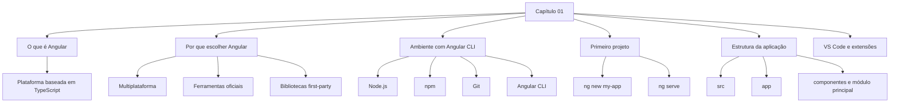

---

## 3. O que é Angular?

Angular é uma **plataforma de desenvolvimento** escrita em **TypeScript**. Ele não é apenas uma biblioteca de interface: o ecossistema Angular reúne várias partes que trabalham juntas para criação, manutenção, teste, build e evolução de aplicações web.

A plataforma inclui:

| Parte | Papel |
|---|---|
| Framework JavaScript/TypeScript | Base para criação de aplicações web baseadas em componentes. |
| Angular CLI | Ferramenta de linha de comando para criar, executar, testar, gerar artefatos e publicar aplicações. |
| Angular Language Service | Recurso de produtividade para editores, com autocomplete, navegação e diagnóstico em templates. |
| Bibliotecas oficiais | Recursos fornecidos pelo próprio Angular, como HTTP Client, Forms e Router. |

Angular usa TypeScript, que é um superconjunto de JavaScript com tipagem estática. O capítulo destaca que não é obrigatório dominar JavaScript profundamente para iniciar com Angular, mas esse conhecimento ajuda bastante.

### 3.1 AngularJS versus Angular

Angular nasceu dentro do Google. A primeira versão, chamada **AngularJS**, foi lançada em 2012 e era baseada em JavaScript. Em 2016, a equipe fez uma mudança importante: o framework foi reescrito com TypeScript e renomeado para **Angular**.

Um dos motivos relevantes para essa mudança foi o uso de **decorators**, recurso muito utilizado pelo Angular para declarar metadados em classes, componentes, módulos e outros artefatos.

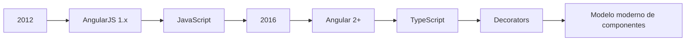

### Nota de atualização

O livro trabalha com Angular 15. Em projetos atuais, consulte sempre a documentação oficial de versões do Angular antes de instalar dependências, porque a compatibilidade entre **Angular**, **Node.js**, **TypeScript** e **RxJS** muda ao longo do tempo. A documentação oficial atual lista Angular 21 e Angular 20 como versões suportadas e informa que versões de Angular 2 até 19 não estão mais em suporte.

---

## 4. Por que escolher Angular?

O capítulo apresenta três grandes pilares que justificam o uso de Angular:

1. capacidade multiplataforma;
2. ferramentas fortes de desenvolvimento;
3. facilidade de entrada por meio de bibliotecas oficiais.

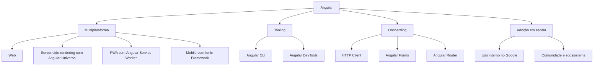

### 4.1 Multiplataforma

Angular executa nativamente no navegador, pois é baseado em JavaScript. Com integrações e ferramentas do ecossistema, ele também pode ser usado em outros contextos:

| Plataforma | Como Angular se conecta |
|---|---|
| Web | Execução nativa no navegador. |
| Servidor | Angular Universal permite renderização server-side. |
| Desktop/PWA | Angular Service Worker permite Progressive Web Apps instaláveis. |
| Mobile | Ionic Framework permite criar aplicações mobile usando Angular. |

### 4.2 Tooling

O capítulo destaca duas ferramentas importantes:

| Ferramenta | Finalidade |
|---|---|
| Angular CLI | Automatiza criação de projeto, geração de artefatos, build, testes e deploy. |
| Angular DevTools | Extensão de navegador para depurar e analisar aplicações Angular. |

A principal ideia é reduzir configuração manual. O desenvolvedor deve gastar energia criando funcionalidades, não ajustando manualmente arquivos de build.

### 4.3 Onboarding

Angular fornece bibliotecas oficiais, também chamadas de **first-party libraries**. Elas são mantidas pelo próprio ecossistema Angular e evitam que o desenvolvedor precise buscar soluções externas para necessidades comuns.

Exemplos:

| Biblioteca | Uso |
|---|---|
| Angular HTTP Client | Comunicação com APIs REST via HTTP. |
| Angular Forms | Criação e validação de formulários HTML. |
| Angular Router | Navegação entre telas dentro da aplicação. |

> Uma biblioteca first-party é fornecida pelo próprio Angular. Ela pode estar disponível no ecossistema do framework, mas só será usada pela aplicação quando for importada explicitamente.

---

## 5. Preparando o ambiente Angular CLI

O capítulo explica que projetos frontend modernos dependem de ferramentas de build, empacotamento, módulos, preprocessadores e automações. O Angular CLI existe para padronizar esse processo e reduzir a complexidade inicial.

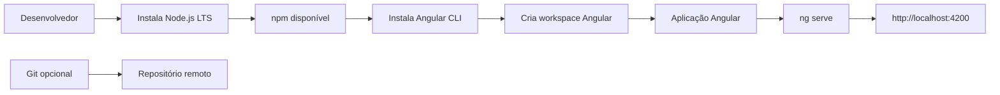

### 5.1 Pré-requisitos

| Ferramenta | Obrigatória? | Papel |
|---|---:|---|
| Node.js | Sim | Runtime JavaScript usado pelo Angular CLI para servir, construir e empacotar a aplicação. |
| npm | Sim | Gerenciador de pacotes instalado junto com o Node.js. Baixa dependências do npm registry. |
| Git | Recomendado | Controle de versão e integração com GitHub, GitLab ou Bitbucket. |
| VS Code | Recomendado | Editor usado no livro, com bom suporte a TypeScript e extensões Angular. |

Comandos de verificação:

```bash
node -v
npm -v
git --version
```

### 5.2 Instalando o Angular CLI

Instalação global:

```bash
npm install -g @angular/cli
```

Verificação da versão instalada:

```bash
ng version
# ou
ng v
```

Instalação de uma versão específica do Angular CLI, como usado no livro:

```bash
npm install -g @angular/cli@15
```

> Em alguns ambientes Windows, pode ser necessário abrir o terminal como administrador. Em Linux/macOS, pode ser necessário usar permissões elevadas, dependendo da configuração do Node/npm.

---

## 6. Comandos principais do Angular CLI

A sintaxe geral do Angular CLI é:

```bash
ng comando [opcoes]
```

Para consultar todos os comandos disponíveis:

```bash
ng help
```

### 6.1 Comandos mais usados

| Comando | Alias | Finalidade |
|---|---|---|
| `ng new` | `ng n` | Cria um novo workspace Angular. |
| `ng build` | `ng b` | Compila a aplicação e gera arquivos de saída. |
| `ng generate` | `ng g` | Gera arquivos Angular, como componentes, serviços e módulos. |
| `ng serve` | `ng s` | Compila e executa a aplicação em um servidor local. |
| `ng test` | `ng t` | Executa testes unitários. |
| `ng deploy` | - | Publica a aplicação em um provedor de hospedagem. |
| `ng add` | - | Adiciona uma biblioteca Angular ao projeto. |
| `ng completion` | - | Ativa autocomplete dos comandos Angular CLI no terminal. |
| `ng update` | - | Atualiza a aplicação para uma versão mais recente do Angular. |

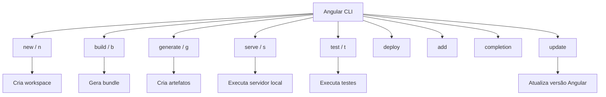

> Manter aplicações Angular atualizadas é importante para receber melhorias de desempenho, correções de bugs, atualizações de segurança e novos recursos.

---

## 7. Criando o primeiro projeto

Para criar a primeira aplicação:

```bash
ng new my-app
```

Durante a criação, o Angular CLI pode fazer perguntas de configuração.

### 7.1 Analytics

O CLI pode perguntar se você deseja compartilhar dados anônimos de uso com a equipe Angular. Essa configuração é aplicada globalmente na primeira execução, mas pode ser alterada depois.

### 7.2 Roteamento

Pergunta típica:

```text
Would you like to add Angular routing? (y/N)
```

No capítulo, a orientação é responder **No**, pois roteamento será estudado posteriormente.

### 7.3 Formato de estilos

Pergunta típica:

```text
Which stylesheet format would you like to use?
```

O livro usa **CSS** diretamente, embora Angular também suporte opções como SCSS e Less.

### 7.4 Executando a aplicação

Depois da criação, acesse a pasta do projeto:

```bash
cd my-app
```

Execute:

```bash
ng serve
```

Abra no navegador:

```text
http://localhost:4200
```

Fluxo completo:

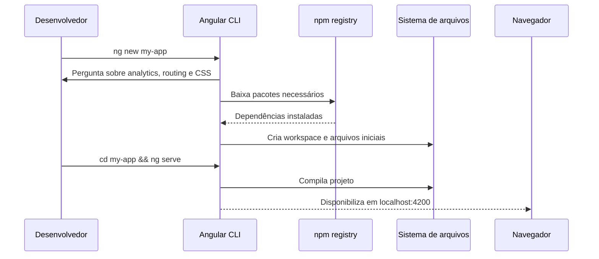

---

## 8. Estrutura inicial do workspace

Após `ng new my-app`, o Angular CLI cria um workspace com arquivos e pastas de configuração.

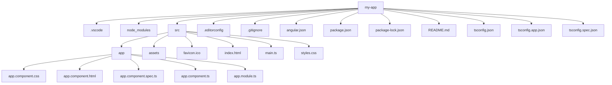

### 8.1 Arquivos e pastas do workspace

| Item | Finalidade |
|---|---|
| `.vscode` | Configurações do VS Code para o projeto. |
| `node_modules` | Dependências instaladas via npm. |
| `src` | Código-fonte, estilos e assets da aplicação. |
| `.editorconfig` | Regras de estilo de código para o editor. |
| `.gitignore` | Arquivos e pastas ignorados pelo Git. |
| `angular.json` | Arquivo principal de configuração do Angular CLI. |
| `package.json` | Lista dependências, scripts e metadados do projeto. |
| `package-lock.json` | Registra versões exatas das dependências instaladas. |
| `README.md` | Documentação inicial gerada pelo Angular CLI. |
| `tsconfig*.json` | Configurações TypeScript para aplicação, workspace e testes. |

### 8.2 Pasta `src`

| Item | Finalidade |
|---|---|
| `app` | Contém os arquivos Angular da aplicação. É a pasta mais usada no desenvolvimento. |
| `assets` | Contém arquivos estáticos, como imagens, ícones, fontes e JSON. |
| `favicon.ico` | Ícone exibido na aba do navegador. |
| `index.html` | Página HTML principal da aplicação. |
| `main.ts` | Ponto de entrada da aplicação Angular. |
| `styles.css` | Estilos globais da aplicação. |

### 8.3 Pasta `app`

| Arquivo | Finalidade |
|---|---|
| `app.component.css` | Estilos CSS específicos do componente principal. |
| `app.component.html` | Template HTML do componente principal. |
| `app.component.spec.ts` | Testes unitários do componente principal. |
| `app.component.ts` | Lógica de apresentação do componente principal. |
| `app.module.ts` | Módulo principal da aplicação, conforme modelo usado no Angular 15 do livro. |

> A extensão `.ts` identifica arquivos TypeScript.

---

## 9. Componentes Angular

Arquivos iniciados por `app.component` formam o componente principal da aplicação. Um **componente** controla uma parte da página, combinando:

- lógica de apresentação em TypeScript;
- template HTML;
- estilos CSS;
- testes unitários.

O componente principal costuma ser chamado de `AppComponent`.

Exemplo simplificado:

```ts
import { Component } from '@angular/core';

@Component({
  selector: 'app-root',
  templateUrl: './app.component.html',
  styleUrls: ['./app.component.css']
})
export class AppComponent {
  title = 'my-app';
}
```

O campo `selector: 'app-root'` conecta o componente a uma tag HTML personalizada.

---

## 10. Como Angular renderiza a aplicação

A aplicação Angular possui um arquivo HTML principal chamado `index.html`. Dentro dele, o corpo da página contém a tag associada ao componente raiz:

```html
<body>
  <app-root></app-root>
</body>
```

A tag `<app-root>` funciona como ponto de montagem da aplicação. Angular identifica essa tag, encontra o componente cujo `selector` é `app-root` e renderiza o template do componente dentro dela.

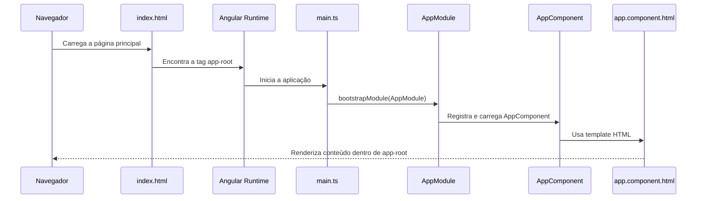

### 10.1 Bootstrapping

O processo de inicialização da aplicação é chamado de **bootstrapping**. No modelo do Angular 15 apresentado no capítulo, o arquivo `main.ts` carrega o módulo principal:

```ts
import { platformBrowserDynamic } from '@angular/platform-browser-dynamic';
import { AppModule } from './app/app.module';

platformBrowserDynamic()
  .bootstrapModule(AppModule)
  .catch(err => console.error(err));
```

A função `platformBrowserDynamic()` aponta para a plataforma de navegador. Em seguida, `bootstrapModule(AppModule)` informa qual módulo será usado como ponto de entrada.

### Nota de atualização sobre Angular moderno

O exemplo acima é fiel ao Angular 15 do capítulo. Em versões modernas do Angular, é comum encontrar inicialização com componentes standalone usando `bootstrapApplication`, que inicializa diretamente um componente raiz standalone.

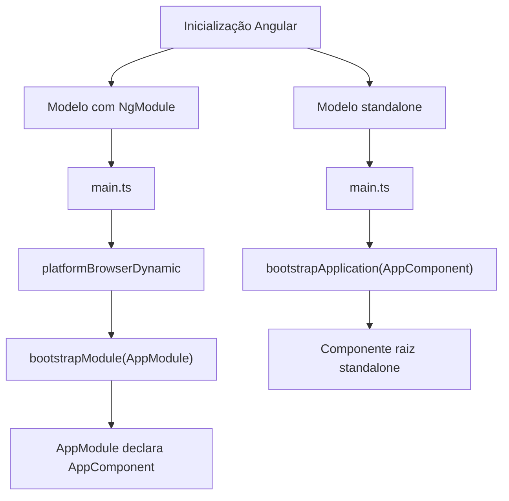

---

## 11. Sintaxe de template

Angular estende o HTML com uma sintaxe própria de templates.

No exemplo do capítulo, o componente possui a propriedade `title`:

```ts
export class AppComponent {
  title = 'my-app';
}
```

No template, essa propriedade é exibida por interpolação:

```html
<span>{{ title }} app is running!</span>
```

A sintaxe `{{ title }}` é chamada de **interpolation**. Ela converte o valor da propriedade do componente para texto e exibe esse valor no HTML.

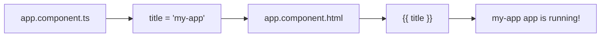

Se o valor for alterado para:

```ts
title = 'Learning Angular';
```

O navegador passa a exibir:

```text
Learning Angular app is running!
```

---

## 12. VS Code para Angular

O capítulo usa o **Visual Studio Code** como editor. Ele é muito popular no ecossistema Angular por causa do suporte a TypeScript, realce de erros, extensões e integração com ferramentas de desenvolvimento.

### 12.1 Angular Essentials

O pacote **Angular Essentials**, de John Papa, reúne extensões úteis para desenvolvimento Angular.

Instalação pelo VS Code:

1. abrir o menu **Extensions**;
2. pesquisar por `Angular Essentials`;
3. instalar o primeiro resultado relevante.

O projeto do livro também pode recomendar extensões automaticamente ao abrir o repositório no VS Code.

---

## 13. Extensões citadas no capítulo

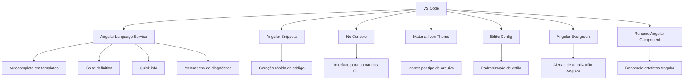

### 13.1 Angular Language Service

Fornecido pela equipe Angular, melhora a experiência em templates Angular.

Recursos principais:

- autocomplete;
- navegação para definição;
- informações rápidas;
- mensagens de diagnóstico.

Exemplo do capítulo:

```ts
export class AppComponent {
  title = 'Learning Angular';
  description = 'Hello World';
}
```

Ao digitar no template:

```html
<span>{{ descr }}</span>
```

O Angular Language Service pode sugerir `description` automaticamente. Se a propriedade não existir ou estiver escrita incorretamente, o editor mostra erro.

> O capítulo destaca que autocomplete em templates funciona com propriedades e métodos públicos. Em TypeScript, membros são públicos por padrão quando não usamos `private`.

### 13.2 Angular Snippets

Extensão com atalhos para gerar estruturas comuns de código Angular.

Exemplo de snippet para componente:

```ts
import { Component, OnInit } from '@angular/core';

@Component({
  selector: 'selector-name',
  templateUrl: 'name.component.html'
})
export class NameComponent implements OnInit {
  constructor() { }

  ngOnInit() { }
}
```

Os snippets citados seguem o prefixo `a-`.

### 13.3 Nx Console

Nx Console oferece uma interface visual para comandos do Angular CLI. Ele ajuda desenvolvedores que não querem memorizar a sintaxe completa dos comandos.

Exemplos de ações disponíveis:

- `generate`;
- `run`;
- `build`;
- `serve`;
- `extract-i18n`;
- `test`.

### 13.4 Material Icon Theme

Fornece ícones baseados no Material Design para facilitar a identificação visual de arquivos. Em projetos grandes, isso ajuda a localizar rapidamente componentes, módulos e outros artefatos Angular.

### 13.5 EditorConfig

Permite padronizar regras como indentação e espaçamento em nível de projeto. O arquivo `.editorconfig`, localizado na raiz do workspace Angular, ajuda a manter estilo consistente entre membros da equipe.

### 13.6 Angular Evergreen

Acompanha versões do Angular e alerta quando há atualizações disponíveis. A extensão compara a versão local do projeto com versões mais recentes e pode oferecer ações de atualização.

### 13.7 Rename Angular Component

Ajuda a renomear componentes e outros artefatos Angular sem precisar alterar manualmente vários arquivos. Embora o nome cite componentes, o capítulo informa que a extensão também pode ser usada com serviços, diretivas e guards.

---

## 14. Fluxo mental: da criação ao primeiro componente renderizado

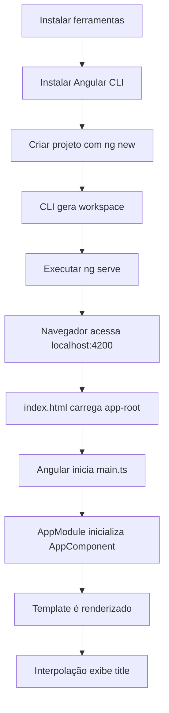

---

## 15. Checklist prático

Use este checklist para validar se o ambiente inicial está pronto:

- [ ] Node.js instalado em versão compatível com a versão do Angular escolhida.
- [ ] npm disponível no terminal.
- [ ] Git instalado, caso o projeto seja versionado.
- [ ] Angular CLI instalado globalmente ou executado via `npx`.
- [ ] VS Code instalado.
- [ ] Extensões Angular instaladas no VS Code.
- [ ] Projeto criado com `ng new my-app`.
- [ ] Aplicação executando com `ng serve`.
- [ ] Navegador abrindo `http://localhost:4200`.
- [ ] Propriedade `title` alterada no `AppComponent` e refletida no template.

---

## 16. Pontos de atenção

| Ponto | Observação |
|---|---|
| Versão do Angular | O capítulo usa Angular 15. Para projetos novos, consulte a versão suportada atual. |
| Estrutura com `AppModule` | O capítulo usa arquitetura baseada em NgModule. Projetos modernos podem usar standalone components. |
| `node_modules` | Pasta pesada e gerada automaticamente. Não deve ser versionada no Git. |
| `package-lock.json` | Deve ser mantido para garantir versões exatas de dependências. |
| `angular.json` | Centraliza configurações importantes do workspace. |
| Interpolation | `{{ valor }}` exibe propriedades do componente no template. |
| Propriedades privadas | Templates não devem depender de propriedades privadas da classe. |
| Atualizações | `ng update` e o guia oficial de atualização devem ser usados para migrações. |

---

## 17. Resumo do capítulo

Neste capítulo, vimos que Angular é uma plataforma baseada em TypeScript para construção de aplicações web escaláveis. A evolução de AngularJS para Angular marcou uma mudança importante de JavaScript para TypeScript e consolidou o modelo moderno baseado em componentes.

Também estudamos por que Angular é uma escolha forte para desenvolvimento web: ele possui ferramentas oficiais, bibliotecas integradas, suporte a diferentes plataformas e ampla adoção. Em seguida, configuramos o ambiente com Node.js, npm, Git, VS Code e Angular CLI.

Com o Angular CLI, criamos uma primeira aplicação usando `ng new`, executamos o projeto com `ng serve` e entendemos a estrutura inicial do workspace. Por fim, analisamos o funcionamento básico de inicialização: `index.html` contém `<app-root>`, Angular carrega o componente principal e o template exibe dados usando interpolação.

O capítulo encerra apresentando extensões do VS Code que aumentam produtividade, especialmente Angular Language Service, Angular Snippets, Nx Console, Material Icon Theme, EditorConfig, Angular Evergreen e Rename Angular Component.

---

## 18. Perguntas de revisão

1. Qual é a diferença principal entre AngularJS e Angular moderno?
2. Por que o Angular CLI é importante em projetos Angular?
3. Qual comando cria um novo workspace Angular?
4. Qual arquivo contém a tag `<app-root>`?
5. Qual propriedade do decorator `@Component` conecta um componente a uma tag HTML?
6. O que é interpolation em Angular?
7. Qual é a função do arquivo `main.ts`?
8. Para que serve o Angular Language Service?
9. Por que `node_modules` não deve ser versionado?
10. Por que é importante verificar a compatibilidade entre Angular, Node.js e TypeScript?

---

## 19. Referências úteis

- Documentação oficial Angular: https://angular.dev/
- Compatibilidade de versões Angular: https://angular.dev/reference/versions
- Versionamento e releases Angular: https://angular.dev/reference/releases
- Configuração local Angular CLI: https://angular.dev/tools/cli/setup-local
- Guia oficial de atualização: https://angular.dev/update
- API `bootstrapApplication`: https://angular.dev/api/platform-browser/bootstrapApplication
