# Capítulo 02 — Introdução ao TypeScript

> Baseado no capítulo **“Introduction to TypeScript”** do material enviado. O conteúdo foi traduzido, reorganizado e explicado em português, mantendo fidelidade ao texto original e acrescentando diagramas Mermaid para facilitar a consulta futura no GitHub.

---

## 1. Visão geral do capítulo

O capítulo apresenta o TypeScript como a linguagem utilizada em projetos Angular. A ideia central é mostrar que o Angular se apoia fortemente em **tipagem estática**, e que o TypeScript oferece uma forma mais segura, organizada e produtiva de escrever aplicações JavaScript de grande porte.

O conteúdo aborda:

* a história e a motivação do TypeScript;
* os benefícios da linguagem;
* recursos oficiais para estudo;
* tipos básicos e tipos personalizados;
* declaração de variáveis com `let` e `const`;
* funções, parâmetros, lambdas e fluxo de execução;
* recursos modernos como spread, template strings, generics, optional chaining e nullish coalescing;
* introdução a classes, interfaces e herança.

---

## 2. Por que TypeScript existe?

Aplicações JavaScript pequenas eram mais simples de manter. Porém, conforme os sistemas web cresceram, a ausência de alguns mecanismos robustos da linguagem tornou mais difícil manter aplicações grandes, complexas e com muitos desenvolvedores envolvidos.

O capítulo destaca alguns problemas históricos do JavaScript tradicional:

* dificuldade de manter grandes aplicações clientes;
* ausência inicial de mecanismos fortes para organização modular;
* pouca segurança em tempo de compilação;
* maior chance de erros aparecerem apenas em tempo de execução;
* dificuldade de aplicar padrões comuns da programação orientada a objetos em sistemas grandes.

Com o avanço do ECMAScript 6, também conhecido como ES6 ou ES2015, muitos recursos importantes foram introduzidos, como melhor modularização, suporte mais claro a classes, escopo de bloco e sintaxe mais moderna. O TypeScript aproveitou essa evolução e foi além, adicionando tipagem estática e outros recursos úteis para grandes projetos.

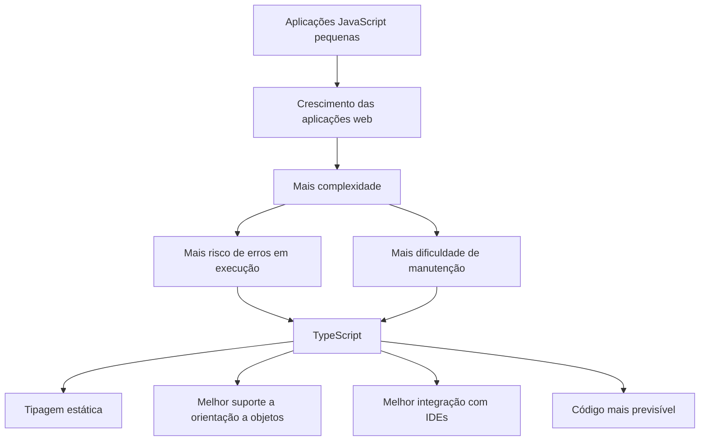
```mermaid
flowchart TD
    A[Aplicações JavaScript pequenas] --> B[Crescimento das aplicações web]
    B --> C[Mais complexidade]
    C --> D[Mais risco de erros em execução]
    C --> E[Mais dificuldade de manutenção]
    D --> F[TypeScript]
    E --> F
    F --> G[Tipagem estática]
    F --> H[Melhor suporte a orientação a objetos]
    F --> I[Melhor integração com IDEs]
    F --> J[Código mais previsível]
```

---

## 3. História do TypeScript

O TypeScript foi criado pela Microsoft como um **superset do JavaScript**. Isso significa que todo código JavaScript válido também pode ser considerado TypeScript válido, mas o TypeScript acrescenta recursos extras sobre a linguagem.

Segundo o capítulo, a primeira versão pública do TypeScript foi anunciada em 2012, liderada por Anders Hejlsberg, arquiteto relacionado a linguagens como C# e Delphi.

A proposta era permitir que desenvolvedores criassem aplicações de larga escala com mais segurança, sem abandonar o ecossistema JavaScript.

### Ideia principal

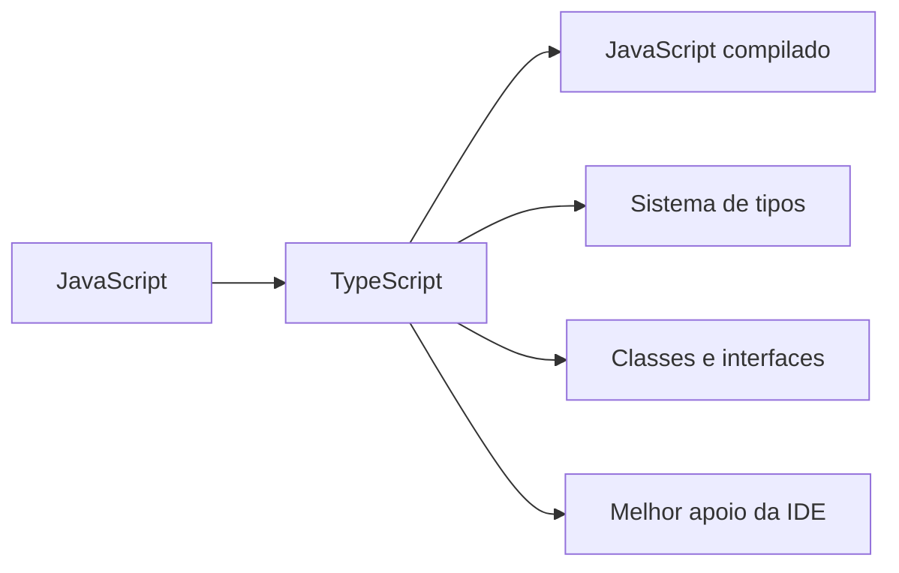
```mermaid
flowchart LR
    JS[JavaScript] --> TS[TypeScript]
    TS --> JSOUT[JavaScript compilado]
    TS --> TIPOS[Sistema de tipos]
    TS --> CLASSES[Classes e interfaces]
    TS --> IDE[Melhor apoio da IDE]
```

O TypeScript não substitui o JavaScript. Ele é compilado para JavaScript, permitindo que o código final continue sendo executado nos ambientes compatíveis com JavaScript.

---

## 4. Benefícios do TypeScript

O capítulo lista vários benefícios do TypeScript. O ponto central é que a tipagem ajuda a tornar o código mais seguro, compreensível e fácil de manter.

| Benefício                          | Explicação                                                              |
| ---------------------------------- | ----------------------------------------------------------------------- |
| Tipagem estática                   | Permite declarar tipos e identificar inconsistências antes da execução. |
| Verificação em tempo de compilação | O compilador ajuda a encontrar erros cedo.                              |
| Classes e interfaces               | Facilitam a organização de código orientado a objetos.                  |
| Encapsulamento                     | Permite controlar acesso a membros públicos e privados.                 |
| Melhor integração com IDEs         | Recursos como autocomplete, navegação e refatoração funcionam melhor.   |
| Adoção gradual                     | Como é um superset de JavaScript, pode ser introduzido aos poucos.      |
| Familiaridade para quem vem de OOP | Desenvolvedores de Java, C# e C++ encontram conceitos conhecidos.       |

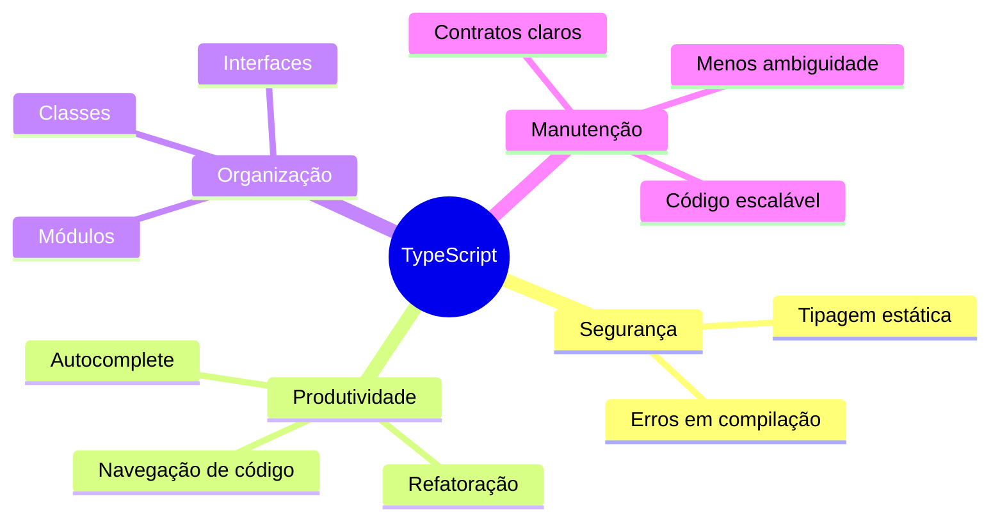
```mermaid
mindmap
  root((TypeScript))
    Segurança
      Tipagem estática
      Erros em compilação
    Produtividade
      Autocomplete
      Refatoração
      Navegação de código
    Organização
      Classes
      Interfaces
      Módulos
    Manutenção
      Contratos claros
      Menos ambiguidade
      Código escalável
```

---

## 5. Recursos para aprender TypeScript

O capítulo recomenda como pontos principais de consulta:

* o site oficial do TypeScript;
* a documentação oficial;
* o repositório/wiki no GitHub;
* exemplos de código e tutoriais rápidos.

O material também informa que será usado **TypeScript 4.8**, por ser a versão suportada pelo Angular 15 no contexto do livro.

> Observação importante para documentação: mantenha essa informação como referência histórica do livro. Em projetos atuais, a versão do TypeScript deve ser verificada conforme a versão do Angular utilizada.

---

## 6. Sistema de tipos

O sistema de tipos é uma das bases do TypeScript. Em JavaScript puro, uma variável pode receber valores de diferentes tipos ao longo da execução. Isso oferece flexibilidade, mas também pode gerar bugs difíceis de rastrear.

No TypeScript, é possível declarar explicitamente o tipo esperado de uma variável, parâmetro ou retorno de função.

Exemplo:

```ts
const brand: string = 'Chevrolet';
```

A anotação `: string` informa que a variável deve conter uma string.

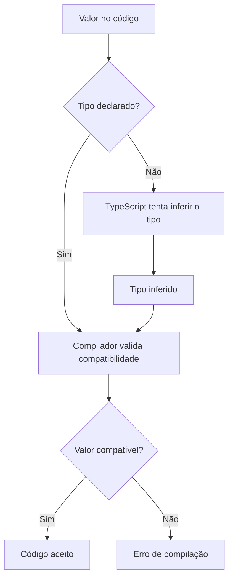
```mermaid
flowchart TD
    A[Valor no código] --> B{Tipo declarado?}
    B -->|Sim| C[Compilador valida compatibilidade]
    B -->|Não| D[TypeScript tenta inferir o tipo]
    C --> E{Valor compatível?}
    E -->|Sim| F[Código aceito]
    E -->|Não| G[Erro de compilação]
    D --> H[Tipo inferido]
    H --> C
```

---

## 7. Tipos primitivos

### 7.1 `string`

O tipo `string` representa texto.

```ts
const brand: string = 'Chevrolet';
```

Também é possível usar template strings com crases, especialmente quando o texto precisa interpolar variáveis.

```ts
const brand: string = 'Chevrolet';
const message: string = `Today is a happy day! I just bought a new ${brand} car`;
```

Template strings tornam o código mais legível do que concatenações longas.

---

### 7.2 `number`

O tipo `number` representa valores numéricos.

```ts
const age: number = 7;
const height: number = 5.6;
```

O capítulo menciona que esse tipo cobre números de ponto flutuante, decimais, hexadecimais, binários e octais.

---

### 7.3 `boolean`

O tipo `boolean` representa valores lógicos: `true` ou `false`.

```ts
const isZeroGreaterThanOne: boolean = false;
```

Esse tipo é usado para expressar condições, flags e resultados de validações.

---

### 7.4 `array`

Arrays armazenam listas de valores. Em TypeScript, é possível tipar o conteúdo da lista.

```ts
const brands: string[] = ['Chevrolet', 'Ford', 'General Motors'];
const ages: number[] = [8, 5, 12, 3, 1];
```

Com isso, o compilador evita que valores incompatíveis sejam adicionados.

```ts
const ages: number[] = [8, 5, 12];

// Erro: string não é compatível com number
ages.push('texto');
```

---

## 8. Tipagem dinâmica com `any`

O tipo `any` permite representar qualquer valor.

```ts
let distance: any;
distance = '100km';
distance = 1000;

const distances: any[] = ['100km', 1000];
```

O capítulo explica que `any` pode ser útil quando não se conhece o tipo de dado em determinado momento. Porém, ele deve ser usado com cuidado, porque reduz os benefícios da tipagem estática.

### Regra prática

Use `any` apenas quando realmente necessário. Sempre que possível, prefira tipos específicos, interfaces, `unknown`, union types ou generics.

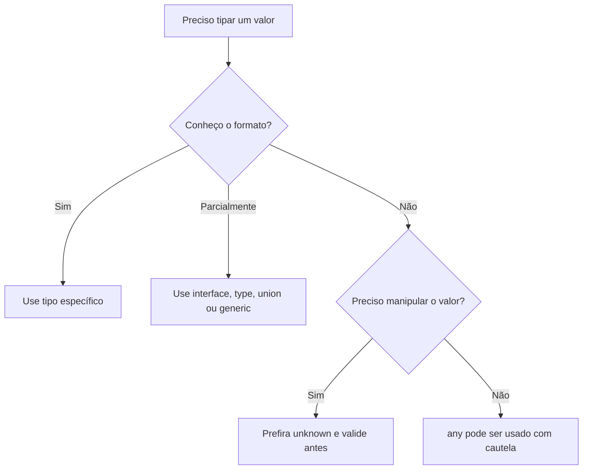
```mermaid
flowchart TD
    A[Preciso tipar um valor] --> B{Conheço o formato?}
    B -->|Sim| C[Use tipo específico]
    B -->|Parcialmente| D[Use interface, type, union ou generic]
    B -->|Não| E{Preciso manipular o valor?}
    E -->|Sim| F[Prefira unknown e valide antes]
    E -->|Não| G[any pode ser usado com cautela]
```

---

## 9. Tipos personalizados

TypeScript permite criar tipos próprios com a palavra-chave `type`.

```ts
type Animal = 'Cheetah' | 'Lion';

const animal: Animal = 'Cheetah';
```

Nesse exemplo, `Animal` aceita apenas os valores `'Cheetah'` ou `'Lion'`.

```ts
const animal: Animal = 'Turtle';
```

Esse código gera erro, pois `'Turtle'` não pertence ao conjunto permitido.

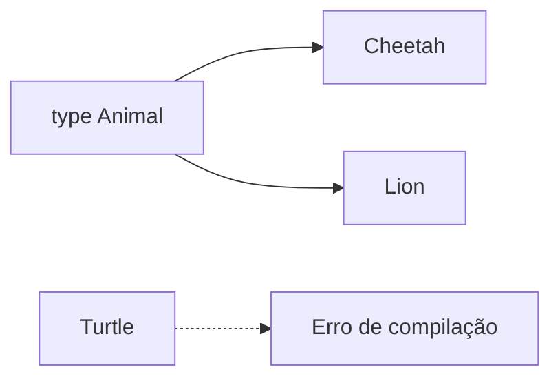
```mermaid
flowchart LR
    A[type Animal] --> B[Cheetah]
    A --> C[Lion]
    D[Turtle] -.-> E[Erro de compilação]
```

---

## 10. `enum`

Enums representam um conjunto de valores nomeados. Eles ajudam a dar significado a valores numéricos ou textuais.

```ts
enum Brands {
  Chevrolet,
  Cadillac,
  Ford,
  Buick,
  Chrysler,
  Dodge
}

const myCar: Brands = Brands.Cadillac;
```

Por padrão, o primeiro item recebe valor `0`, o segundo `1`, e assim por diante.

Também é possível definir valores personalizados:

```ts
enum BrandsReduced {
  Tesla = 1,
  GMC,
  Jeep
}

const myTruck: BrandsReduced = BrandsReduced.GMC;
```

Nesse caso, `Tesla` vale `1` e `GMC` passa a valer `2`.

Também é possível usar `enum` para mapear número para nome:

```ts
enum Brands {
  Chevrolet,
  Cadillac,
  Ford,
  Buick,
  Chrysler,
  Dodge
}

const myCarBrandName: string = Brands[1];
```

O valor de `myCarBrandName` será `Cadillac`.

---

## 11. `void`

O tipo `void` representa ausência de retorno. Ele é usado principalmente em funções que executam uma ação, mas não retornam valor.

```ts
function test(): void {
  const a = 0;
}
```

Nesse caso, a função não retorna nada.

---

## 12. Inferência de tipos

TypeScript consegue inferir tipos a partir do valor atribuído.

```ts
const name = 'Angular';
```

Mesmo sem escrever `: string`, o TypeScript entende que `name` é uma string.

A inferência reduz a necessidade de anotações explícitas, mas sem remover a segurança da linguagem.

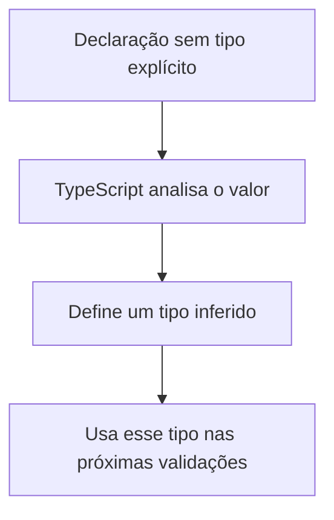
```mermaid
flowchart TD
    A[Declaração sem tipo explícito] --> B[TypeScript analisa o valor]
    B --> C[Define um tipo inferido]
    C --> D[Usa esse tipo nas próximas validações]
```

---

## 13. Declaração de variáveis

### 13.1 `let`

O `let` declara variáveis com escopo de bloco.

Antes do ES6, era comum usar `var`, que possui escopo de função. Isso podia causar vazamento de variável em blocos como `for` e `if`.

Exemplo com `var`:

```ts
var i = 3;

for (var i = 0; i < 10; i++) {
}
```

O mesmo identificador `i` pode ser redefinido no mesmo escopo de função.

Com `let`:

```ts
let i = 3;

for (let i = 0; i < 10; i++) {
}
```

Agora, o `i` do laço fica restrito ao bloco do `for`.

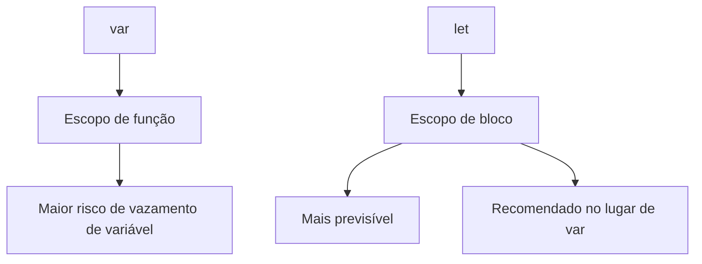
```mermaid
flowchart TD
    A[var] --> B[Escopo de função]
    B --> C[Maior risco de vazamento de variável]
    D[let] --> E[Escopo de bloco]
    E --> F[Mais previsível]
    E --> G[Recomendado no lugar de var]
```

### Regra prática

Prefira `let` quando o valor precisa mudar. Evite `var`.

---

### 13.2 `const`

O `const` declara uma variável cuja referência não deve ser reatribuída.

```ts
const PI = 3.14;
PI = 3; // Erro
```

No caso de objetos, `const` impede a troca da referência, mas não torna automaticamente todo o objeto imutável.

```ts
const obj = {
  a: 3
};

obj.a = 4; // Permitido

obj = {}; // Erro
```

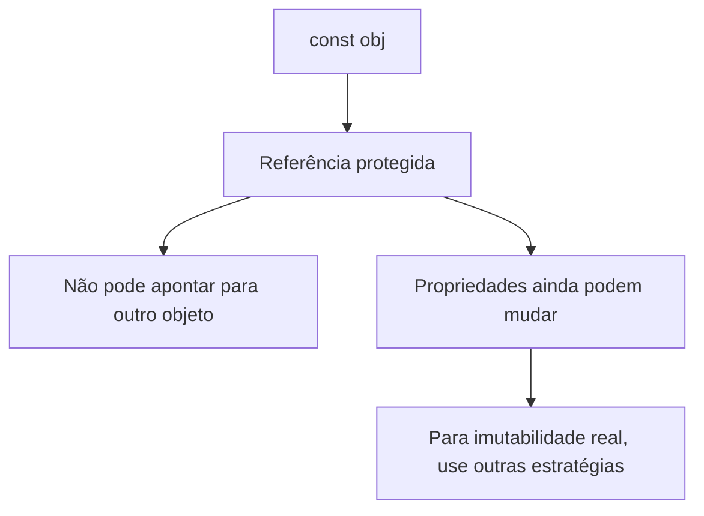
```mermaid
flowchart TD
    A[const obj] --> B[Referência protegida]
    B --> C[Não pode apontar para outro objeto]
    B --> D[Propriedades ainda podem mudar]
    D --> E[Para imutabilidade real, use outras estratégias]
```

### Regra prática

Use `const` sempre que a variável não precisar ser reatribuída. Isso comunica intenção e reduz mudanças acidentais.

---

## 14. Funções, lambdas e fluxo de execução

Funções processam entrada, aplicam uma transformação e retornam uma saída.

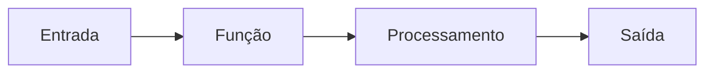
```mermaid
flowchart LR
    A[Entrada] --> B[Função]
    B --> C[Processamento]
    C --> D[Saída]
```

No TypeScript, podemos tipar parâmetros e retorno.

```ts
function sayHello(name: string): string {
  return 'Hello, ' + name;
}
```

Nesse exemplo:

* `name: string` tipa o parâmetro;
* `: string` depois dos parênteses tipa o retorno da função.

---

## 15. Funções anônimas tipadas

Funções também podem ser representadas como expressões.

```ts
const sayHello = function (name: string): string {
  return 'Hello, ' + name;
};
```

O capítulo alerta que é possível melhorar a tipagem declarando o tipo da variável que aponta para a função.

```ts
const sayHello: (name: string) => string = function (name: string): string {
  return 'Hello, ' + name;
};
```

Essa forma deixa claro o contrato completo da função: argumentos e retorno.

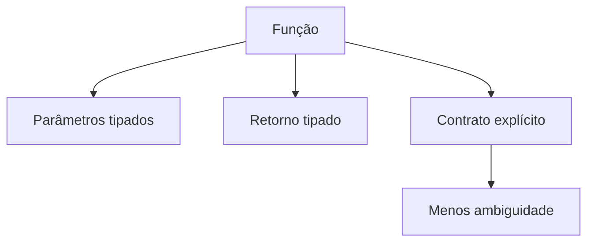
```mermaid
flowchart TD
    A[Função] --> B[Parâmetros tipados]
    A --> C[Retorno tipado]
    A --> D[Contrato explícito]
    D --> E[Menos ambiguidade]
```

---

## 16. Parâmetros opcionais

Parâmetros opcionais recebem `?`.

```ts
function greetMe(name: string, greeting?: string): string {
  if (!greeting) {
    greeting = 'Hello';
  }

  return greeting + ', ' + name;
}
```

A função pode ser chamada omitindo o segundo parâmetro:

```ts
greetMe('John');
```

Parâmetros opcionais devem ser colocados depois dos obrigatórios.

```ts
function add(mandatory: string, optional?: number) {
}
```

Evite:

```ts
function add(optional?: number, mandatory: string) {
}
```

Nesse caso, o compilador pode reclamar quando o parâmetro obrigatório não for fornecido corretamente.

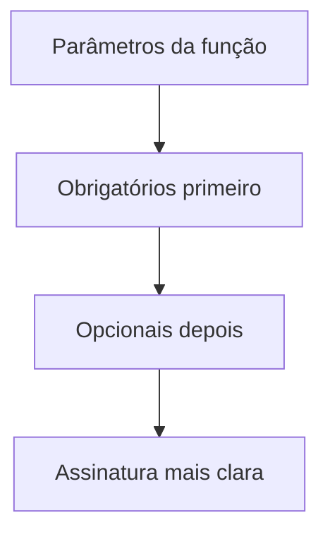
```mermaid
flowchart TD
    A[Parâmetros da função] --> B[Obrigatórios primeiro]
    B --> C[Opcionais depois]
    C --> D[Assinatura mais clara]
```

---

## 17. Parâmetros com valor padrão

Parâmetros padrão permitem definir um valor quando o argumento não é informado.

```ts
function greetMe(name: string, greeting: string = 'Hello'): string {
  return `${greeting}, ${name}`;
}
```

Assim como parâmetros opcionais, parâmetros com valor padrão devem vir depois dos obrigatórios.

---

## 18. Rest parameters

Rest parameters permitem receber uma quantidade indefinida de argumentos.

```ts
function greetPeople(greeting: string, ...names: string[]): string {
  return greeting + ', ' + names.join(' and ') + '!';
}
```

O operador `...names` agrupa os argumentos restantes em um array.

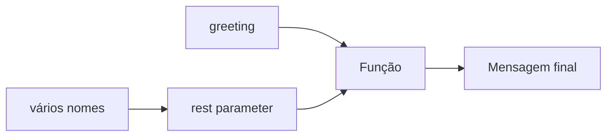
```mermaid
flowchart LR
    A[greeting] --> C[Função]
    B[vários nomes] --> D[rest parameter]
    D --> C
    C --> E[Mensagem final]
```

---

## 19. Sobrecarga de funções

A sobrecarga permite declarar múltiplas assinaturas para uma mesma função.

```ts
function hello(names: string): string;
function hello(names: string[]): string;
function hello(names: any, greeting?: string): string {
  let namesArray: string[];

  if (Array.isArray(names)) {
    namesArray = names;
  } else {
    namesArray = [names];
  }

  if (!greeting) {
    greeting = 'Hello';
  }

  return greeting + ', ' + namesArray.join(' and ') + '!';
}
```

O TypeScript permite expor várias assinaturas públicas e concentrar a implementação em uma única função mais genérica.

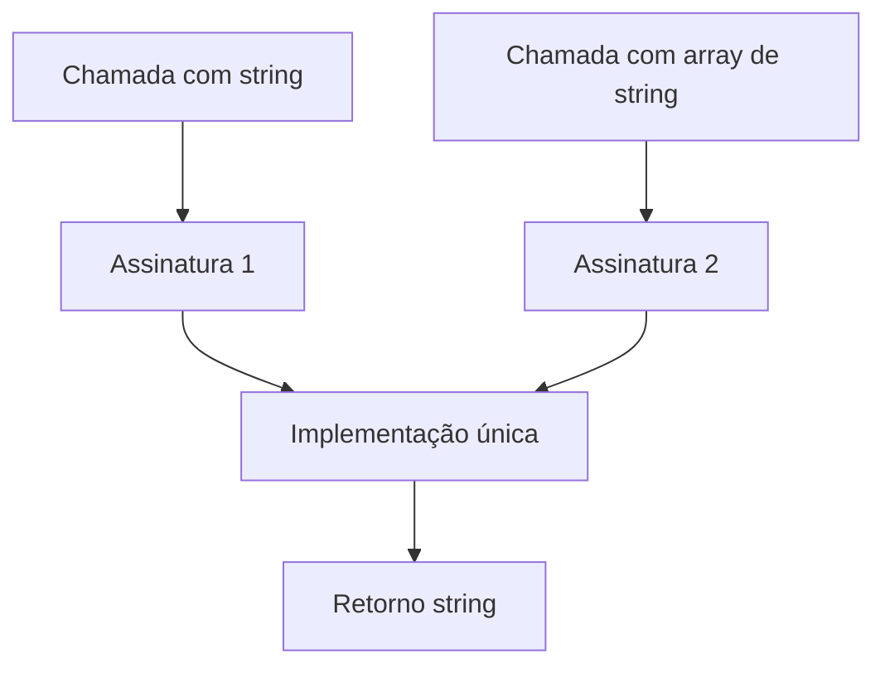
```mermaid
flowchart TD
    A[Chamada com string] --> C[Assinatura 1]
    B[Chamada com array de string] --> D[Assinatura 2]
    C --> E[Implementação única]
    D --> E
    E --> F[Retorno string]
```

---

## 20. Arrow functions

Arrow functions, também chamadas de lambdas em outras linguagens, oferecem uma sintaxe mais curta para funções.

```ts
const double = x => x * 2;
```

Quando há mais de uma linha de implementação, usamos chaves:

```ts
const addAndDouble = (x, y) => {
  const sum = x + y;
  return sum * 2;
};
```

O capítulo destaca uma vantagem importante: arrow functions ajudam a preservar o contexto de `this`.

Exemplo problemático com função tradicional:

```ts
function delayedGreeting(name): void {
  this.name = name;

  this.greet = function () {
    setTimeout(function () {
      console.log('Hello ' + this.name);
    }, 0);
  };
}
```

A função dentro de `setTimeout` pode ter outro contexto de `this`, gerando comportamento inesperado.

Com arrow function:

```ts
function delayedGreeting(name): void {
  this.name = name;

  this.greet = function () {
    setTimeout(() => console.log('Hello ' + this.name), 0);
  };
}
```

A arrow function preserva o `this` do contexto externo.

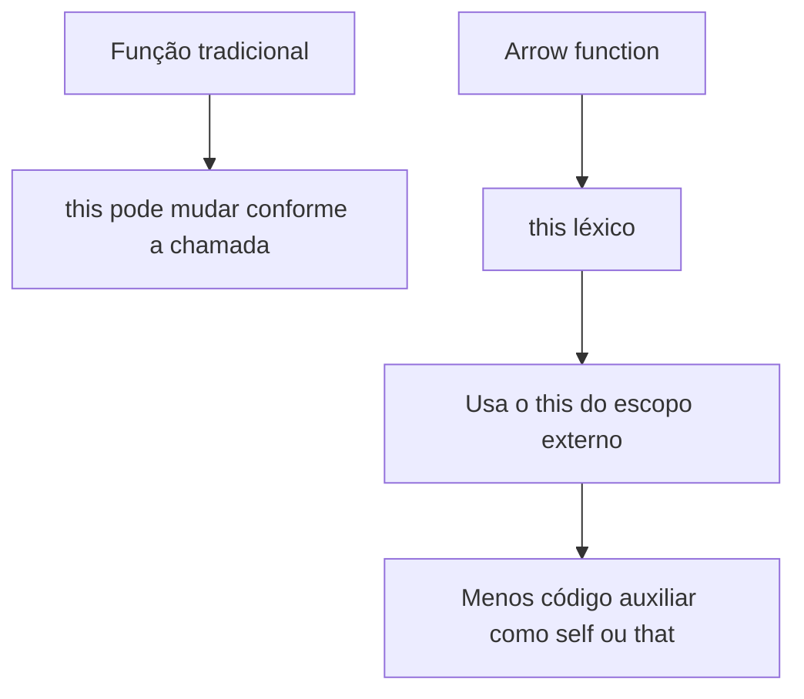
```mermaid
flowchart TD
    A[Função tradicional] --> B[this pode mudar conforme a chamada]
    C[Arrow function] --> D[this léxico]
    D --> E[Usa o this do escopo externo]
    E --> F[Menos código auxiliar como self ou that]
```

---

## 21. Recursos comuns do TypeScript

### 21.1 Spread parameter

O operador spread usa a mesma sintaxe `...`, mas com finalidade diferente do rest parameter.

Rest parameter agrupa valores. Spread espalha valores.

```ts
const newItem = 3;
const oldArray = [1, 2];
const newArray = [...oldArray, newItem];
```

Esse exemplo cria um novo array, sem alterar o array original.

Também pode ser usado com objetos:

```ts
const oldPerson = { name: 'John' };
const newPerson = { ...oldPerson, age: 20 };
```

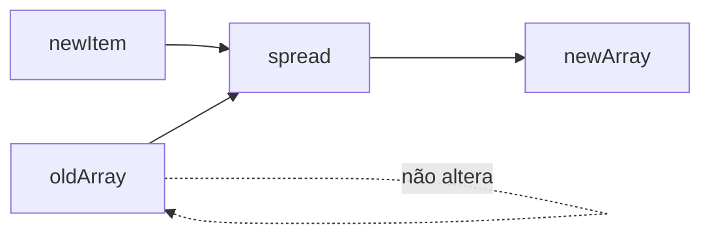
```mermaid
flowchart LR
    A[oldArray] --> C[spread]
    B[newItem] --> C
    C --> D[newArray]
    A -.não altera.-> A
```

---

### 21.2 Template strings

Template strings melhoram a legibilidade de textos com variáveis.

Concatenação tradicional:

```ts
const url = 'http://path_to_domain' +
  'path_to_resource' +
  '?param1=' + parameter +
  '&param2=' + parameter2;
```

Com template string:

```ts
const url = `${baseUrl}/${path_to_resource}?param=${parameter}&param2=${parameter2}`;
```

A segunda versão é mais curta, mais clara e menos propensa a erros.

---

### 21.3 Generics

Generics permitem criar código reutilizável sem perder tipagem.

```ts
function method<T>(arg: T): T {
  return arg;
}
```

A letra `T` representa um tipo que será informado ou inferido no momento de uso.

```ts
method<number>(1);
method<string>('texto');
```

Também é possível restringir o tipo genérico.

```ts
function method<T>(arg: T[]): T[] {
  console.log(arg.length);
  return arg;
}
```

Nesse caso, `arg` precisa ser um array.

Outro exemplo do capítulo usa herança:

```ts
class Person {}
class CustomPerson extends Person {}

const people: Person[] = [];
const newPerson = new CustomPerson();

method<Person>(people);
method<CustomPerson>(newPerson);
```

O material também mostra que generics podem trabalhar com interfaces.

```ts
interface Shape {
  area(): number;
}

class Square implements Shape {
  area() { return 1; }
}

class Circle implements Shape {
  area() { return 2; }
}

function allAreas<T extends Shape>(...args: T[]): number {
  let total = 0;

  args.forEach((x) => {
    total += x.area();
  });

  return total;
}

allAreas(new Square(), new Circle());
```

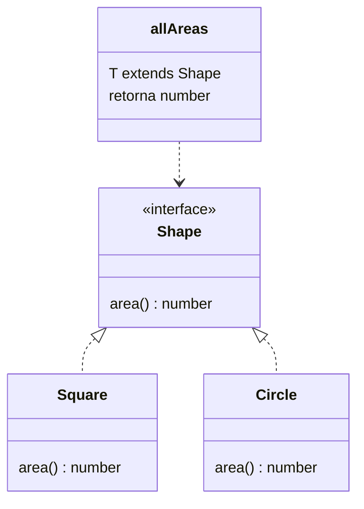
```mermaid
classDiagram
    class Shape {
      <<interface>>
      area() number
    }

    class Square {
      area() number
    }

    class Circle {
      area() number
    }

    Shape <|.. Square
    Shape <|.. Circle

    class allAreas {
      T extends Shape
      retorna number
    }

    allAreas ..> Shape
```

### Ideia central dos generics

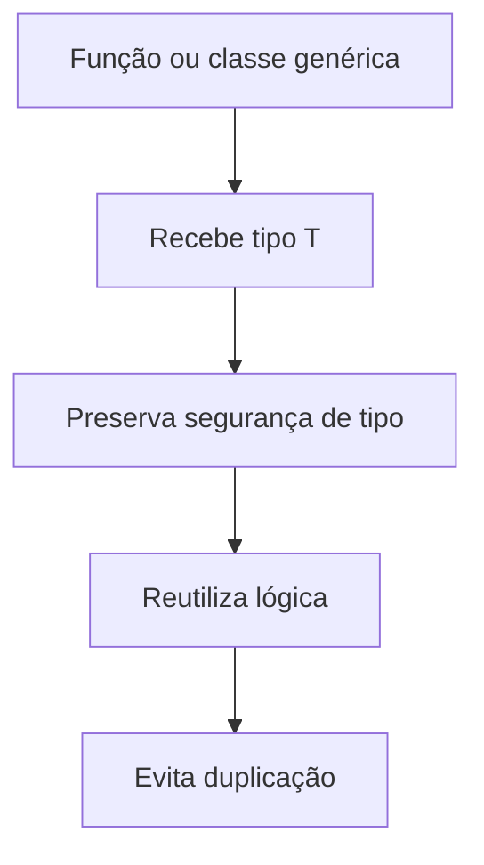
```mermaid
flowchart TD
    A[Função ou classe genérica] --> B[Recebe tipo T]
    B --> C[Preserva segurança de tipo]
    C --> D[Reutiliza lógica]
    D --> E[Evita duplicação]
```

---

## 22. Optional chaining

Optional chaining permite acessar propriedades ou métodos apenas se o objeto existir.

Sem optional chaining:

```ts
if (square !== undefined) {
  const area = square.area();
}
```

Com optional chaining:

```ts
const area = square?.area();
```

O operador `?.` evita erro quando `square` é `null` ou `undefined`.

Também pode ser usado em cadeias mais profundas:

```ts
const width = square?.area?.width;
```

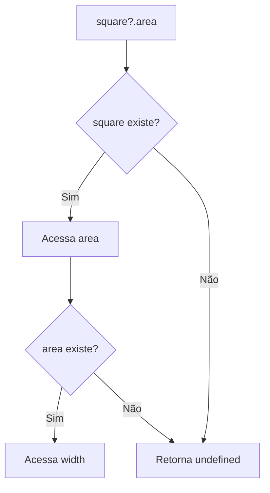
```mermaid
flowchart TD
    A[square?.area] --> B{square existe?}
    B -->|Sim| C[Acessa area]
    B -->|Não| D[Retorna undefined]
    C --> E{area existe?}
    E -->|Sim| F[Acessa width]
    E -->|Não| D
```

---

## 23. Nullish coalescing

Nullish coalescing permite definir um valor padrão quando uma expressão é `null` ou `undefined`.

Exemplo com operador ternário:

```ts
const mySquare = square ? square : new Square();
```

Com nullish coalescing:

```ts
const mySquare = square ?? new Square();
```

O operador `??` usa o valor da direita somente se o valor da esquerda for `null` ou `undefined`.

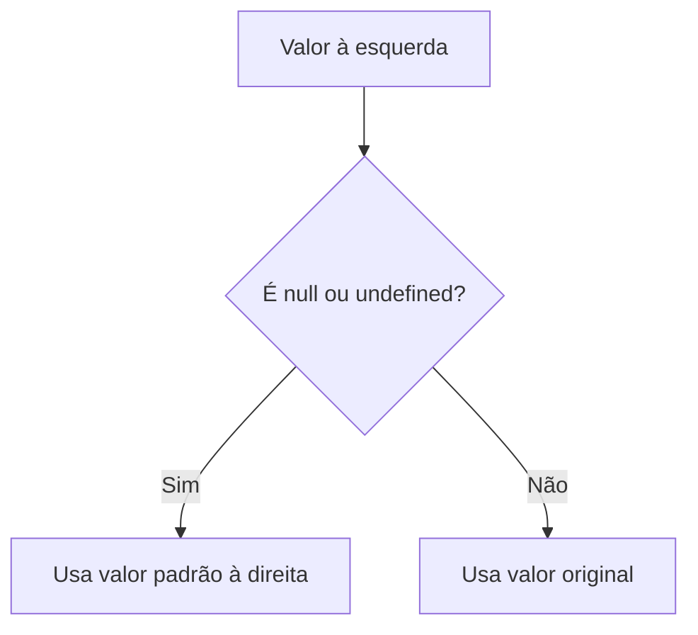
```mermaid
flowchart TD
    A[Valor à esquerda] --> B{É null ou undefined?}
    B -->|Sim| C[Usa valor padrão à direita]
    B -->|Não| D[Usa valor original]
```

### Diferença importante entre `??` e `||`

| Operador | Usa valor padrão quando       |   |                                                               |
| -------- | ----------------------------- | - | ------------------------------------------------------------- |
| `??`     | valor é `null` ou `undefined` |   |                                                               |
| `        |                               | ` | valor é falsy, como `false`, `0`, `''`, `null` ou `undefined` |

---

## 24. Classes, interfaces e herança

O capítulo começa a introduzir classes, interfaces e herança como fundamentos importantes para aplicações Angular.

Uma classe permite agrupar:

* propriedades;
* construtor;
* métodos;
* métodos estáticos;
* acessores `get` e `set`.

```mermaid
classDiagram
    class Car {
      -distanceRun number
      -color string
      +constructor(isHybrid boolean, color string)
      +getGasConsumption() string
      +drive(distance number) void
      +honk() string
      +distance number
    }
```

Exemplo do capítulo:

```ts
class Car {
  private distanceRun: number = 0;
  private color: string;

  constructor(private isHybrid: boolean, color: string = 'red') {
    this.color = color;
  }

  getGasConsumption(): string {
    return this.isHybrid ? 'Very low' : 'Too high!';
  }

  drive(distance: number): void {
    this.distanceRun += distance;
  }

  static honk(): string {
    return 'HOOONK!';
  }

  get distance(): number {
    return this.distanceRun;
  }
}
```

---

## 25. Anatomia de uma classe

O material divide a classe em partes principais.

| Parte             | Explicação                                                               |
| ----------------- | ------------------------------------------------------------------------ |
| Membros           | Propriedades e métodos pertencentes à instância.                         |
| Construtor        | Método executado ao criar uma nova instância.                            |
| Métodos           | Funções disponíveis na classe. Podem ser públicas ou privadas.           |
| Membros estáticos | Pertencem à classe, não à instância.                                     |
| Acessores         | `get` e `set` permitem ler ou escrever propriedades de forma controlada. |

```mermaid
flowchart TD
    A[Classe] --> B[Membros]
    A --> C[Construtor]
    A --> D[Métodos]
    A --> E[Membros estáticos]
    A --> F[Acessores]

    B --> B1[Propriedades da instância]
    C --> C1[Inicialização do objeto]
    D --> D1[Comportamentos]
    E --> E1[Acesso pela própria classe]
    F --> F1[get e set]
```

---

## 26. Parâmetros de construtor com modificadores de acesso

O TypeScript permite declarar e inicializar propriedades diretamente no construtor usando modificadores de acesso, como `private`, `public` ou `protected`.

No exemplo:

```ts
constructor(private isHybrid: boolean, color: string = 'red') {
  this.color = color;
}
```

A propriedade `isHybrid` é criada automaticamente como membro privado da classe.

Sem esse recurso, seria necessário declarar a propriedade e atribuí-la manualmente no construtor.

```ts
class Car {
  private isHybrid: boolean;

  constructor(isHybrid: boolean) {
    this.isHybrid = isHybrid;
  }
}
```

Com parâmetro de construtor:

```ts
class Car {
  constructor(private isHybrid: boolean) {}
}
```

---

## 27. Construtor e inicialização manual

A última página do PDF enviado começa uma seção sobre construtores com acessores, mostrando a forma tradicional de criar uma classe com propriedades e atribuições no construtor.

```ts
class Car {
  make: string;
  model: string;

  constructor(make: string, model: string) {
    this.make = make;
    this.model = model;
  }
}
```

Para cada campo, normalmente seria necessário:

1. adicionar a propriedade na classe;
2. receber o valor no construtor;
3. atribuir o valor à propriedade.

O TypeScript simplifica esse padrão com parâmetros de construtor usando modificadores de acesso.

```mermaid
flowchart TD
    A[Campo da classe] --> B[Parâmetro no construtor]
    B --> C[Atribuição manual]
    C --> D[Objeto inicializado]

    E[Parâmetro com modificador de acesso] --> F[Cria propriedade]
    F --> G[Atribui valor automaticamente]
    G --> D
```

---

## 28. Resumo executivo

O capítulo mostra que TypeScript é essencial para o desenvolvimento Angular porque adiciona uma camada de segurança e organização ao JavaScript.

Os principais pontos são:

* TypeScript é um superset de JavaScript;
* seu principal diferencial é o sistema de tipos;
* `let` e `const` tornam o escopo e a intenção do código mais claros;
* tipos primitivos ajudam a evitar erros simples;
* tipos personalizados e enums tornam o domínio mais expressivo;
* funções podem ter parâmetros e retornos tipados;
* arrow functions simplificam sintaxe e preservam o contexto de `this`;
* spread, template strings, generics, optional chaining e nullish coalescing tornam o código mais moderno e expressivo;
* classes, interfaces e herança são fundamentais para compreender aplicações Angular.

---

## 29. Mapa geral do capítulo

```mermaid
flowchart TD
    A[Introdução ao TypeScript] --> B[História]
    A --> C[Benefícios]
    A --> D[Sistema de tipos]
    A --> E[Funções]
    A --> F[Recursos modernos]
    A --> G[Classes e interfaces]

    D --> D1[string]
    D --> D2[number]
    D --> D3[boolean]
    D --> D4[array]
    D --> D5[any]
    D --> D6[type]
    D --> D7[enum]
    D --> D8[void]

    E --> E1[Parâmetros opcionais]
    E --> E2[Parâmetros padrão]
    E --> E3[Rest parameters]
    E --> E4[Sobrecarga]
    E --> E5[Arrow functions]

    F --> F1[Spread]
    F --> F2[Template strings]
    F --> F3[Generics]
    F --> F4[Optional chaining]
    F --> F5[Nullish coalescing]

    G --> G1[Construtor]
    G --> G2[Métodos]
    G --> G3[Static]
    G --> G4[Getters e setters]
```

---

## 30. Pontos de atenção para projetos Angular

### 30.1 Evite `any` como padrão

Em Angular, usar `any` em excesso reduz a segurança da aplicação. Prefira criar interfaces para DTOs, modelos de resposta de API e objetos de domínio.

```ts
interface Produto {
  id: number;
  nome: string;
  preco: number;
}
```

---

### 30.2 Use inferência quando o tipo for óbvio

```ts
const nome = 'Angular';
```

Não é obrigatório escrever:

```ts
const nome: string = 'Angular';
```

A inferência já resolve esse caso.

---

### 30.3 Tipar funções melhora manutenção

```ts
function calcularTotal(preco: number, quantidade: number): number {
  return preco * quantidade;
}
```

O contrato da função fica claro: recebe dois números e retorna um número.

---

### 30.4 Prefira `const` por padrão

Use `const` quando não houver reatribuição. Use `let` quando o valor precisar mudar. Evite `var`.

```ts
const limite = 10;
let contador = 0;
```

---

## 31. Glossário rápido

| Termo              | Significado                                                              |
| ------------------ | ------------------------------------------------------------------------ |
| Superset           | Linguagem que inclui outra linguagem e adiciona recursos extras.         |
| Tipagem estática   | Verificação de tipos antes da execução.                                  |
| Inferência de tipo | Capacidade do TypeScript de deduzir o tipo automaticamente.              |
| Enum               | Conjunto de valores nomeados.                                            |
| Generic            | Recurso para criar código reutilizável com segurança de tipo.            |
| Optional chaining  | Operador `?.` para acessar propriedades com segurança.                   |
| Nullish coalescing | Operador `??` para definir valor padrão quando há `null` ou `undefined`. |
| Arrow function     | Sintaxe curta de função que preserva o `this` léxico.                    |
| Constructor        | Método executado quando uma classe é instanciada.                        |
| Static member      | Membro acessado pela classe, não pela instância.                         |

---

## 32. Checklist de fixação

* [ ] Sei explicar por que o TypeScript foi criado.
* [ ] Sei diferenciar JavaScript de TypeScript.
* [ ] Sei declarar variáveis com `let` e `const`.
* [ ] Sei usar tipos primitivos como `string`, `number` e `boolean`.
* [ ] Sei criar arrays tipados.
* [ ] Entendo o risco de usar `any` sem necessidade.
* [ ] Sei criar tipos personalizados com `type`.
* [ ] Sei usar `enum`.
* [ ] Sei tipar parâmetros e retorno de funções.
* [ ] Sei usar parâmetros opcionais, padrão e rest parameters.
* [ ] Entendo a diferença entre função tradicional e arrow function.
* [ ] Sei usar spread para arrays e objetos.
* [ ] Sei usar template strings.
* [ ] Entendo a finalidade de generics.
* [ ] Sei usar optional chaining e nullish coalescing.
* [ ] Entendo a estrutura básica de uma classe TypeScript.

---

## 33. Exercícios práticos

### Exercício 1

Crie uma interface `Usuario` com os campos:

* `id: number`
* `nome: string`
* `ativo: boolean`

Depois crie uma função que receba um `Usuario` e retorne uma mensagem informando se ele está ativo.

---

### Exercício 2

Crie um `type` chamado `StatusPedido` que aceite apenas:

* `'ABERTO'`
* `'PAGO'`
* `'CANCELADO'`

Depois crie uma função que receba esse status e retorne uma mensagem correspondente.

---

### Exercício 3

Crie uma função genérica `primeiro<T>` que receba um array de `T` e retorne o primeiro item.

```ts
function primeiro<T>(itens: T[]): T | undefined {
  return itens[0];
}
```

Teste com array de `number` e array de `string`.

---

### Exercício 4

Crie uma classe `Produto` com:

* `nome`
* `preco`
* método `aplicarDesconto(percentual: number)`
* getter `valorFormatado`

---

## 34. Conclusão

Este capítulo estabelece a base necessária para trabalhar com Angular usando TypeScript. Antes de avançar em componentes, serviços, injeção de dependência e módulos Angular, é importante compreender bem o sistema de tipos, funções, classes e recursos modernos da linguagem.

A principal mensagem é: TypeScript ajuda a transformar JavaScript em uma linguagem mais previsível para aplicações grandes, reduzindo erros e melhorando a manutenção do código.
