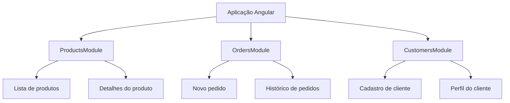
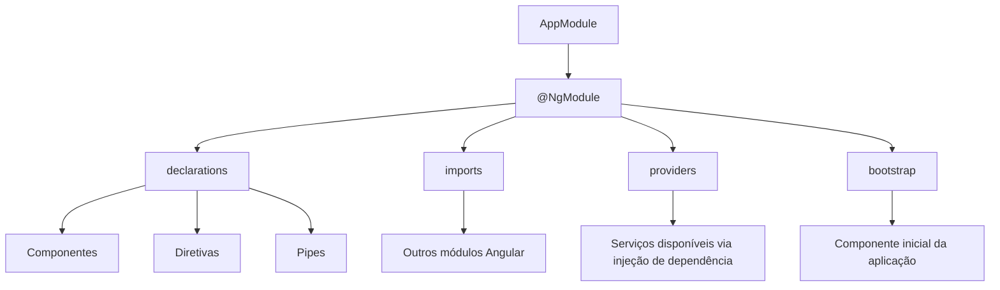
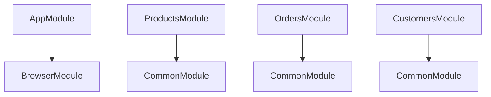
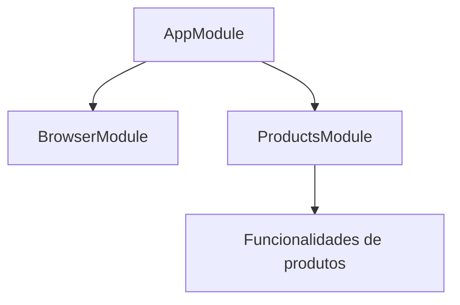
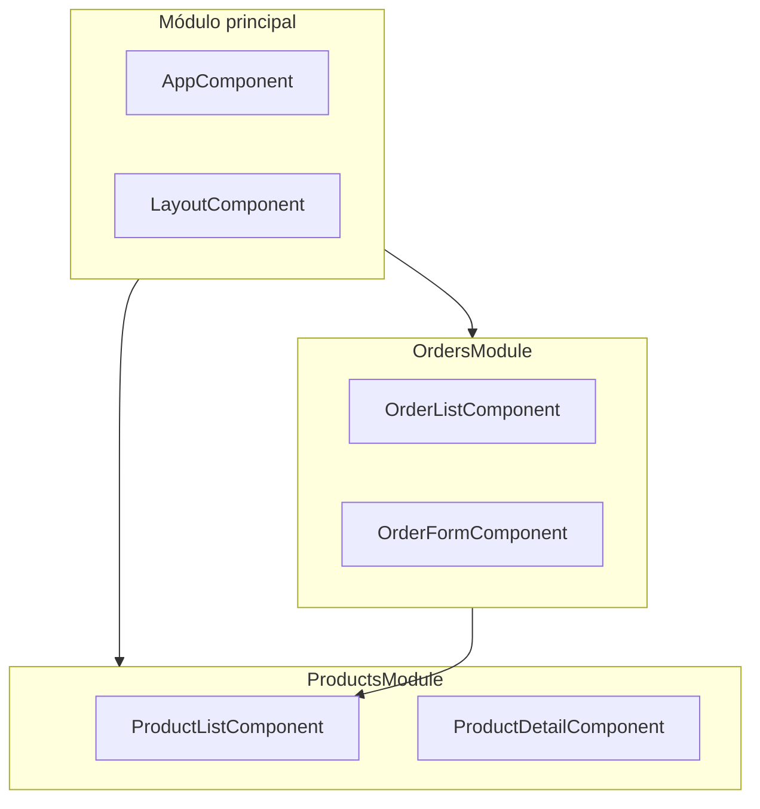
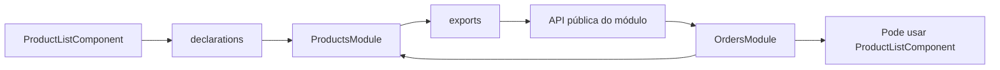
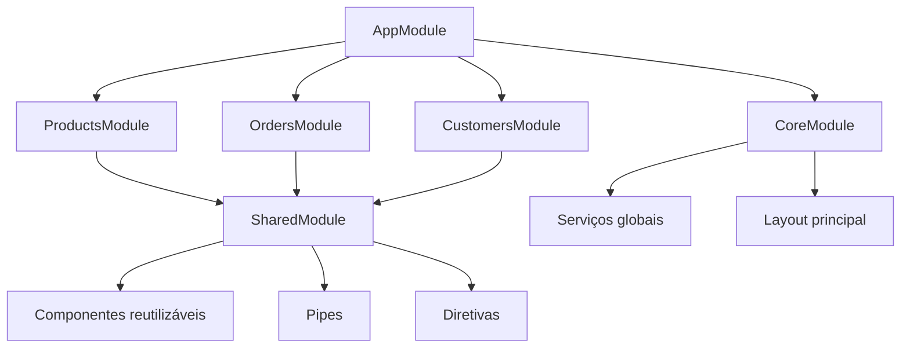

# Capítulo 03 — Organização da Aplicação em Módulos

Fonte-base: *Capítulo 03.pdf* 

## 1. Objetivo do capítulo

O capítulo explica como organizar uma aplicação Angular em **módulos**, agrupando funcionalidades relacionadas em blocos coesos. A ideia central é que uma aplicação web não deve crescer como um conjunto desorganizado de componentes, serviços e arquivos, mas sim como uma estrutura modular, separada por responsabilidades.

> Atualização importante: em versões modernas do Angular, a recomendação oficial para novos códigos é usar **standalone components** em vez de `NgModule`. Mesmo assim, `NgModule` continua essencial para entender projetos Angular existentes e aplicações legadas. ([Angular][1])

---

## 2. O que é um módulo Angular

Um **Angular Module** é um contêiner lógico para agrupar partes da aplicação que pertencem a uma mesma funcionalidade, domínio ou fluxo de trabalho.

Exemplos:

* módulo de produtos;
* módulo de pedidos;
* módulo de clientes;
* módulo de autenticação;
* módulo de relatórios.

Em uma aplicação de e-commerce, por exemplo, produtos, pedidos e clientes podem ser organizados em módulos separados.



A principal vantagem dessa organização é permitir que a aplicação cresça com mais controle. Cada módulo concentra uma parte da aplicação e pode ser desenvolvido, testado e mantido de forma mais independente.

---

## 3. Módulo Angular não é o mesmo que módulo JavaScript

O capítulo destaca uma diferença importante:

| Conceito                           | Finalidade                                                                                 |
| ---------------------------------- | ------------------------------------------------------------------------------------------ |
| **Módulo JavaScript / TypeScript** | Organiza arquivos e permite importar/exportar classes, funções e constantes.               |
| **Módulo Angular**                 | Organiza artefatos Angular, como componentes, diretivas, pipes, serviços e outros módulos. |

Exemplo de `import` TypeScript:

```ts
import { NgModule } from '@angular/core';
import { BrowserModule } from '@angular/platform-browser';
import { AppComponent } from './app.component';
```

Esses imports trazem símbolos para o arquivo TypeScript. Já o array `imports` dentro de `@NgModule` registra outros módulos Angular que serão usados pelo módulo atual.

---

## 4. Estrutura básica do `AppModule`

Uma aplicação Angular tradicional baseada em módulos possui um módulo principal, normalmente chamado de `AppModule`.

```ts
import { NgModule } from '@angular/core';
import { BrowserModule } from '@angular/platform-browser';

import { AppComponent } from './app.component';

@NgModule({
  declarations: [
    AppComponent
  ],
  imports: [
    BrowserModule
  ],
  providers: [],
  bootstrap: [
    AppComponent
  ]
})
export class AppModule { }
```

A classe `AppModule` geralmente fica vazia. O comportamento do módulo é definido pelo decorator `@NgModule`.



---

## 5. Principais propriedades do `@NgModule`

### `declarations`

Define os artefatos Angular pertencentes ao módulo.

Normalmente inclui:

* componentes;
* diretivas;
* pipes.

Exemplo:

```ts
declarations: [
  AppComponent
]
```

Um componente declarado em um módulo pertence àquele módulo. Em aplicações baseadas em `NgModule`, componentes precisam estar declarados em algum módulo para serem usados por outros componentes do mesmo contexto. ([Angular][2])

---

### `imports`

Define quais outros módulos Angular o módulo atual precisa usar.

Exemplo:

```ts
imports: [
  BrowserModule
]
```

No `AppModule`, o `BrowserModule` é usado porque a aplicação será executada no navegador.

Atenção: o array `imports` do `@NgModule` não é a mesma coisa que os imports do TypeScript no topo do arquivo.

---

### `providers`

Define serviços disponíveis para injeção de dependência.

Exemplo:

```ts
providers: []
```

Serviços registrados no módulo principal podem ficar disponíveis para toda a aplicação, dependendo da forma como são providos.

---

### `bootstrap`

Define qual componente será carregado na inicialização da aplicação.

Exemplo:

```ts
bootstrap: [
  AppComponent
]
```

Normalmente essa propriedade aparece apenas no módulo principal da aplicação.

---

## 6. Criando um módulo de funcionalidade

O capítulo usa como exemplo um módulo de produtos.

Com Angular CLI:

```bash
ng generate module products
```

Esse comando cria uma pasta `products` dentro de `src/app` e gera o arquivo:

```text
src/app/products/products.module.ts
```

Exemplo de módulo gerado:

```ts
import { NgModule } from '@angular/core';
import { CommonModule } from '@angular/common';

@NgModule({
  declarations: [],
  imports: [
    CommonModule
  ]
})
export class ProductsModule { }
```

O `ProductsModule` começa com `declarations` vazio porque ainda não possui componentes, diretivas ou pipes próprios.

---

## 7. `BrowserModule` x `CommonModule`

O capítulo diferencia dois módulos importantes:

| Módulo          | Uso                                                                                          |
| --------------- | -------------------------------------------------------------------------------------------- |
| `BrowserModule` | Usado no módulo principal da aplicação para executar Angular no navegador.                   |
| `CommonModule`  | Usado em módulos de funcionalidade para acessar recursos comuns, como diretivas estruturais. |

Em aplicações tradicionais com `NgModule`, o `BrowserModule` deve ser importado apenas uma vez no módulo raiz. Módulos de funcionalidade normalmente usam `CommonModule`.



---

## 8. Registrando um módulo no módulo principal

Criar um módulo com Angular CLI não o torna automaticamente disponível para a aplicação inteira.

Para que o `AppModule` conheça o `ProductsModule`, é necessário importá-lo.

```ts
import { ProductsModule } from './products/products.module';
```

Depois, adicioná-lo ao array `imports`:

```ts
@NgModule({
  declarations: [
    AppComponent
  ],
  imports: [
    BrowserModule,
    ProductsModule
  ],
  providers: [],
  bootstrap: [
    AppComponent
  ]
})
export class AppModule { }
```

A partir disso, a aplicação passa a conhecer o módulo de produtos.



A função do módulo principal deve ser principalmente **orquestrar** os demais módulos, e não concentrar toda a lógica da aplicação.

---

## 9. Hierarquia de módulos

O capítulo apresenta a ideia de uma aplicação organizada em módulos relacionados hierarquicamente.



A relação acima mostra uma situação comum: o módulo de pedidos pode precisar usar uma funcionalidade do módulo de produtos, como uma lista de produtos.

---

## 10. Expondo funcionalidades entre módulos

Nem tudo que está dentro de um módulo fica automaticamente disponível para outros módulos.

Imagine que o `ProductsModule` possui um componente chamado `ProductListComponent`.

```ts
import { NgModule } from '@angular/core';
import { CommonModule } from '@angular/common';
import { ProductListComponent } from './product-list/product-list.component';

@NgModule({
  declarations: [
    ProductListComponent
  ],
  imports: [
    CommonModule
  ]
})
export class ProductsModule { }
```

Mesmo que outro módulo importe `ProductsModule`, o `ProductListComponent` ainda não estará disponível para uso externo.

Para expor esse componente, é necessário adicioná-lo ao array `exports`:

```ts
@NgModule({
  declarations: [
    ProductListComponent
  ],
  imports: [
    CommonModule
  ],
  exports: [
    ProductListComponent
  ]
})
export class ProductsModule { }
```

Agora outro módulo pode importar `ProductsModule` e usar o componente exportado.

```ts
import { NgModule } from '@angular/core';
import { CommonModule } from '@angular/common';
import { ProductsModule } from '../products/products.module';

@NgModule({
  declarations: [],
  imports: [
    CommonModule,
    ProductsModule
  ]
})
export class OrdersModule { }
```



A regra prática é:

> Um módulo só consegue usar diretamente aquilo que outro módulo exporta.

A documentação oficial também descreve `exports` como o conjunto de componentes, diretivas e pipes declarados em um `NgModule` que podem ser usados por módulos que importam esse módulo. ([Angular][3])

---

## 11. Organização de módulos por tipo

Além dos módulos de funcionalidade, o capítulo apresenta outros tipos comuns de módulos.

### `CoreModule`

Usado para recursos globais da aplicação.

Exemplos:

* barra superior;
* menu principal;
* componente de erro;
* loading spinner;
* serviços globais;
* serviço de log;
* interceptadores;
* guardas globais.

Normalmente é importado apenas uma vez, no `AppModule`.

---

### `SharedModule`

Usado para recursos reutilizáveis por vários módulos.

Exemplos:

* botões customizados;
* pipes compartilhados;
* diretivas reutilizáveis;
* componentes visuais genéricos;
* módulos de UI exportados para reaproveitamento.

Normalmente é importado por módulos de funcionalidade.



---

## 12. Módulos carregados imediatamente e sob demanda

O capítulo também diferencia módulos pela forma como são carregados.

### Eager-loaded modules

São carregados na inicialização da aplicação.

Normalmente aparecem diretamente no array `imports`.

```ts
imports: [
  BrowserModule,
  ProductsModule
]
```

### Lazy-loaded modules

São carregados sob demanda, geralmente quando o usuário acessa uma rota específica.

```mermaid
flowchart TD
    Start["Aplicação inicia"] --> AppModule["AppModule"]

    AppModule --> Eager["Módulos eager-loaded"]
    Eager --> Core["CoreModule"]
    Eager --> Shared["SharedModule"]

    AppModule --> Router["Roteamento"]

    Router --> LazyCondition{"Usuário acessou rota?"}
    LazyCondition -->|Sim| LazyModule["Carrega módulo lazy-loaded"]
    LazyCondition -->|Não| Wait["Módulo ainda não é carregado"]
```



O carregamento sob demanda ajuda a reduzir o tamanho inicial do bundle carregado pelo navegador.

---

## 13. Módulos built-in do Angular

O capítulo lista alguns módulos fornecidos pelo próprio Angular.

| Módulo                    | Finalidade                                               |
| ------------------------- | -------------------------------------------------------- |
| `BrowserModule`           | Executa a aplicação Angular no navegador.                |
| `CommonModule`            | Fornece recursos comuns usados em templates Angular.     |
| `FormsModule`             | Suporte a formulários template-driven.                   |
| `ReactiveFormsModule`     | Suporte a formulários reativos.                          |
| `HttpClientModule`        | Comunicação HTTP com backend.                            |
| `RouterModule`            | Navegação e roteamento.                                  |
| `BrowserAnimationsModule` | Suporte a animações e bibliotecas como Angular Material. |

Atualização técnica: em Angular moderno, `HttpClientModule` aparece como API antiga baseada em `NgModule`; a recomendação atual é usar `provideHttpClient(...)` em novas configurações. ([Angular][4]) Também houve mudança em animações: `BrowserAnimationsModule` está depreciado em versões recentes, com recomendação para usar recursos como `animate.enter` e `animate.leave`. ([Angular][5])

---

## 14. Resumo didático

Um módulo Angular serve para organizar a aplicação em blocos funcionais. O `AppModule` é o módulo principal em aplicações tradicionais baseadas em `NgModule`. Módulos de funcionalidade, como `ProductsModule` e `OrdersModule`, ajudam a separar responsabilidades, melhorar a manutenção e facilitar a evolução da aplicação.

A comunicação entre módulos ocorre por meio de imports e exports. Importar um módulo permite acessar sua API pública, mas somente os artefatos declarados em `exports` ficam disponíveis para outros módulos.

A organização recomendada em aplicações modulares costuma separar:

* `CoreModule` para recursos globais;
* `SharedModule` para recursos reutilizáveis;
* módulos de funcionalidade para domínios específicos;
* lazy-loaded modules para carregamento sob demanda.

---

## 15. Checklist de fixação

* `declarations` registra componentes, diretivas e pipes pertencentes ao módulo.
* `imports` registra outros módulos Angular necessários.
* `providers` registra serviços disponíveis por injeção de dependência.
* `bootstrap` define o componente inicial da aplicação.
* `exports` define a API pública do módulo.
* `BrowserModule` fica no módulo raiz.
* `CommonModule` é usado em módulos de funcionalidade.
* `CoreModule` concentra recursos globais.
* `SharedModule` concentra recursos reutilizáveis.
* Lazy loading melhora o carregamento inicial da aplicação.
* Em Angular moderno, standalone components são recomendados para novos projetos, mas `NgModule` continua importante para entender e manter aplicações existentes.

[1]: https://angular.dev/guide/ngmodules/overview?utm_source=chatgpt.com "NgModules"
[2]: https://angular.dev/api/core/Component?utm_source=chatgpt.com "Component"
[3]: https://angular.dev/api/core/NgModule?utm_source=chatgpt.com "NgModule"
[4]: https://angular.dev/api/common/http/HttpClientModule?utm_source=chatgpt.com "HttpClientModule"
[5]: https://angular.dev/api/platform-browser/animations/BrowserAnimationsModule?utm_source=chatgpt.com "BrowserAnimationsModule"
