# Capítulo 04 - Habilitando a Experiência do Usuário com Componentes

> Baseado no conteúdo do PDF enviado para o Capítulo 04.

## 1. Visão geral

Este capítulo aprofunda o uso de **componentes Angular** como principal unidade de construção da interface. Até aqui, a aplicação Angular já havia sido criada com Angular CLI e organizada em módulos. Agora, o foco passa a ser entender como componentes são criados, registrados, exibidos, estilizados e como se comunicam entre si.

Em Angular, um componente controla uma parte da tela. Uma aplicação real é formada por uma árvore de componentes, na qual componentes maiores podem conter componentes menores.

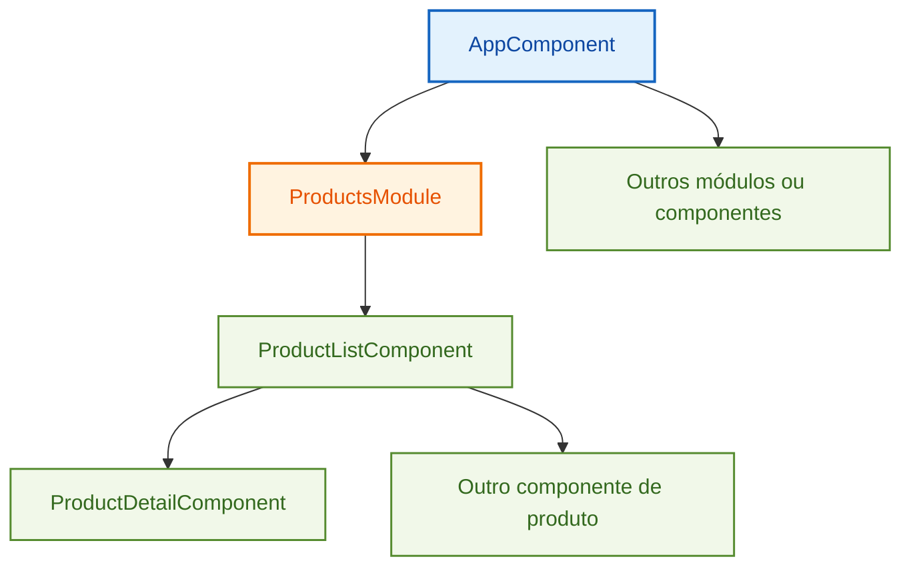

## 2. Estrutura de um componente Angular

Um componente Angular normalmente é formado por três partes principais:

| Parte | Responsabilidade |
|---|---|
| Classe TypeScript | Contém estado e comportamento do componente |
| Template HTML | Define o que será renderizado na tela |
| CSS do componente | Define estilos visuais aplicados ao componente |

Exemplo conceitual:

```ts
import { Component } from '@angular/core';

@Component({
  selector: 'app-root',
  templateUrl: './app.component.html',
  styleUrls: ['./app.component.css']
})
export class AppComponent {
  title = 'Learning Angular';
}
```

O decorador `@Component` informa ao Angular que aquela classe TypeScript deve ser tratada como um componente.

Principais propriedades:

| Propriedade | Função |
|---|---|
| `selector` | Nome usado para carregar o componente dentro de um template HTML |
| `templateUrl` | Caminho para o arquivo HTML externo do componente |
| `template` | Permite declarar o HTML inline, dentro do próprio decorator |
| `styleUrls` | Lista de arquivos CSS associados ao componente |
| `styles` | Permite declarar CSS inline |

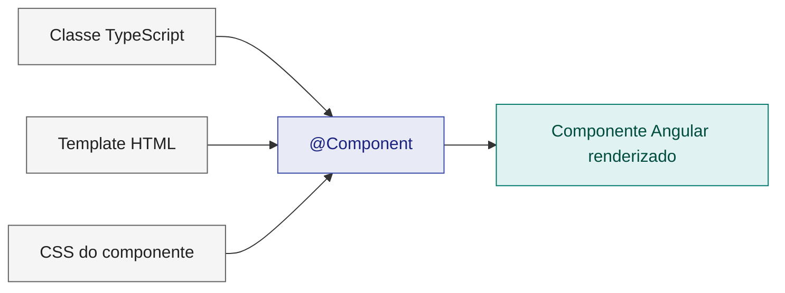

## 3. Registrando componentes em módulos

Em aplicações baseadas em `NgModule`, um componente precisa ser registrado em um módulo Angular para ter contexto de compilação. Isso é feito no array `declarations`.

Exemplo:

```ts
import { NgModule } from '@angular/core';
import { CommonModule } from '@angular/common';
import { ProductListComponent } from './product-list/product-list.component';

@NgModule({
  declarations: [
    ProductListComponent
  ],
  imports: [
    CommonModule
  ]
})
export class ProductsModule { }
```

Um componente declarado em um módulo fica disponível dentro do contexto daquele módulo. Para expor esse componente para outro módulo, é necessário adicioná-lo também em `exports`.

```ts
@NgModule({
  declarations: [
    ProductListComponent
  ],
  imports: [
    CommonModule
  ],
  exports: [
    ProductListComponent
  ]
})
export class ProductsModule { }
```

Ponto importante: um componente Angular baseado em módulo deve ser declarado em apenas um `NgModule`.

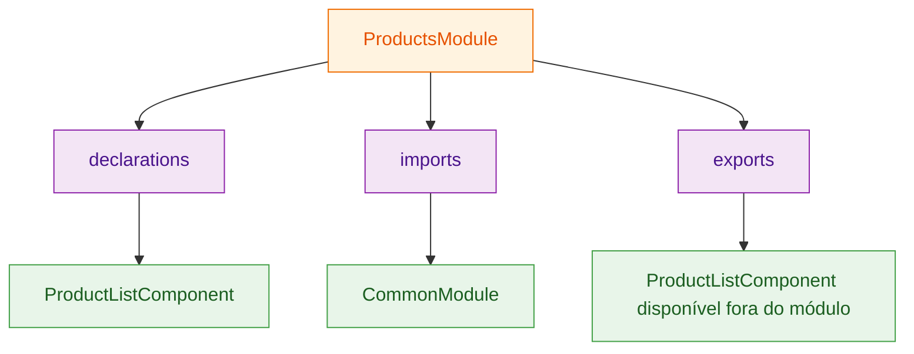

## 4. Componentes standalone

Um componente **standalone** não precisa ser declarado em um `NgModule`. Ele possui seu próprio contexto de importação e declara explicitamente suas dependências.

Exemplo:

```ts
import { Component } from '@angular/core';
import { CommonModule } from '@angular/common';

@Component({
  selector: 'app-product',
  standalone: true,
  imports: [
    CommonModule
  ],
  templateUrl: './product.component.html',
  styleUrls: ['./product.component.css']
})
export class ProductComponent { }
```

Diferença principal:

| Modelo | Como o componente é disponibilizado |
|---|---|
| Com `NgModule` | O componente entra em `declarations` do módulo |
| Standalone | O componente entra em `imports` de outro componente ou módulo |

Um componente standalone **não deve** ser colocado em `declarations`. Se for usado dentro de um módulo, ele deve ser importado:

```ts
@NgModule({
  declarations: [
    ProductListComponent
  ],
  imports: [
    CommonModule,
    ProductComponent
  ]
})
export class ProductsModule { }
```

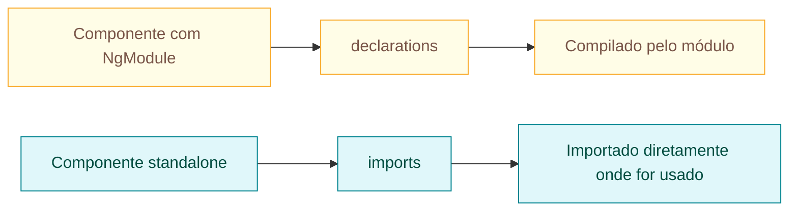

### Nota de atualização

O capítulo apresenta os dois modelos: componentes registrados em módulos e componentes standalone. No Angular atual, a própria documentação oficial recomenda componentes standalone para código novo, enquanto `NgModule` continua importante para entender aplicações existentes. A CLI também documenta `standalone` como opção de geração de componentes. 

## 5. Carregando um componente no template

Para renderizar um componente dentro de outro, usa-se o `selector`.

Se o componente tem:

```ts
@Component({
  selector: 'app-product-list'
})
export class ProductListComponent { }
```

Ele pode ser carregado no template assim:

```html
<app-product-list></app-product-list>
```

Caso o componente pertença a um módulo diferente e ainda não tenha sido exportado, Angular não reconhecerá o seletor no template. A solução, em aplicações com `NgModule`, é exportar o componente no módulo de origem e importar esse módulo onde o componente será usado.

## 6. Exibindo dados da classe no template

A forma mais simples de exibir dados no template é a **interpolação**.

```ts
export class AppComponent {
  title = 'Learning Angular';
}
```

```html
<span>{{ title }}</span>
```

A expressão entre `{{ }}` é avaliada com base na classe do componente. O valor da propriedade `title` é convertido para texto e exibido no HTML.

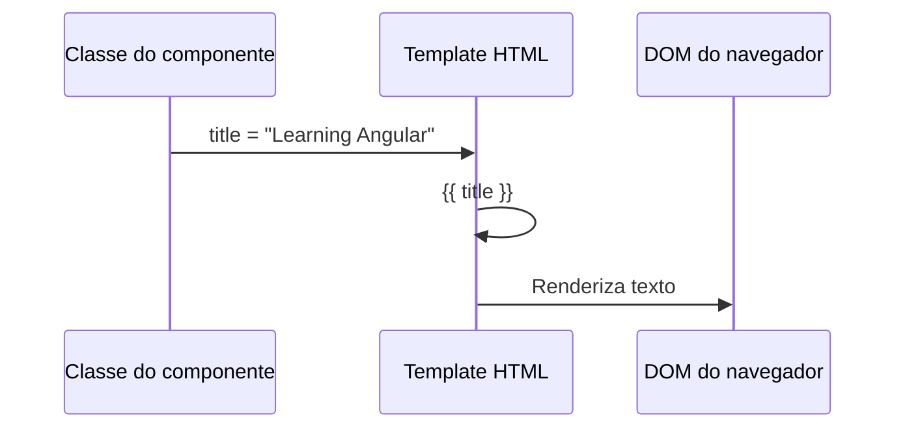

## 7. Property binding

A interpolação é adequada para texto. Quando o objetivo é alterar uma propriedade do DOM, utiliza-se **property binding**.

Exemplo:

```html
<span [innerText]="title"></span>
```

Aqui, `innerText` é uma propriedade do elemento no DOM, e `title` é uma propriedade da classe do componente.

É importante diferenciar:

```html
<p attr.aria-label="myText"></p>
```

Neste caso, `myText` é tratado como texto fixo.

```html
<p [attr.aria-label]="myText"></p>
```

Neste caso, `myText` é avaliado como propriedade do componente.

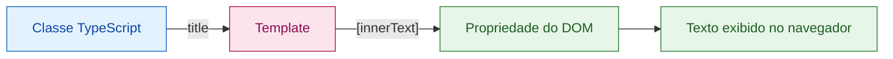

## 8. Class binding e style binding

Angular permite alterar classes e estilos dinamicamente.

### Class binding

Aplicando uma classe de forma condicional:

```html
<p [class.star]="isLiked"></p>
```

Se `isLiked` for `true`, a classe `star` será adicionada. Se for `false`, será removida.

Também é possível aplicar múltiplas classes:

```html
<p [class]="currentClasses"></p>
```

A propriedade pode ser uma string:

```ts
currentClasses = 'star active';
```

Ou um objeto:

```ts
currentClasses = {
  star: true,
  active: false
};
```

### Style binding

Aplicando um estilo diretamente:

```html
<p [style.color]="'greenyellow'"></p>
```

Com unidade de medida:

```html
<p [style.width.px]="100"></p>
```

Ou múltiplos estilos:

```html
<p [style]="currentStyles"></p>
```

```ts
currentStyles = {
  color: 'greenyellow',
  width: '100px'
};
```

## 9. Event binding

Para capturar eventos do DOM no template, Angular usa **event binding**.

```html
<button (click)="onClick()">Click me</button>
```

O evento `click` do botão chama o método `onClick()` da classe do componente.

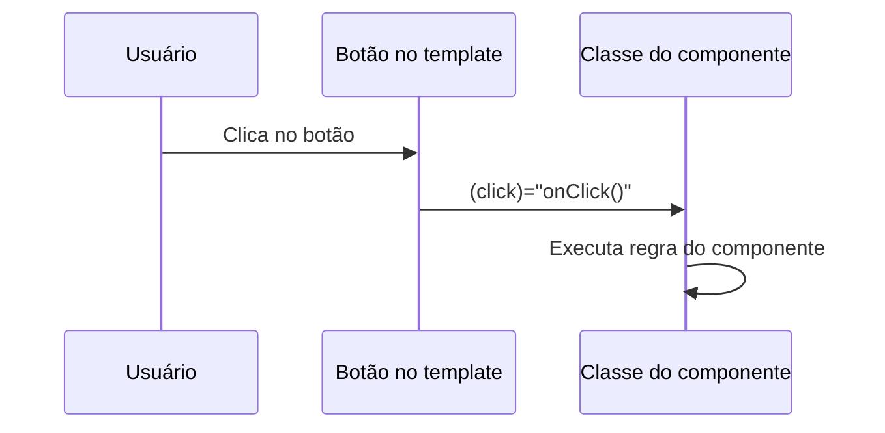

Em Angular:

| Sintaxe | Direção do fluxo |
|---|---|
| `{{ valor }}` | Classe para template |
| `[propriedade]="valor"` | Classe para DOM |
| `(evento)="metodo()"` | Template para classe |

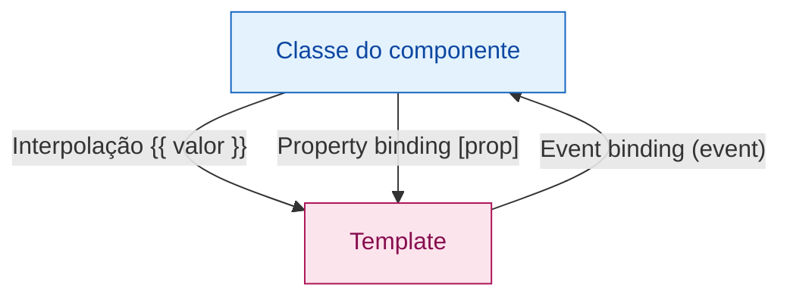

## 10. Comunicação entre componentes com `@Input`

Um componente pode receber dados de outro usando `@Input`.

Exemplo: o componente de detalhe recebe o nome de um produto.

```ts
import { Component, Input } from '@angular/core';

@Component({
  selector: 'app-product-detail',
  templateUrl: './product-detail.component.html',
  styleUrls: ['./product-detail.component.css']
})
export class ProductDetailComponent {
  @Input() name = '';
}
```

Template do detalhe:

```html
<h2>Product Details</h2>
<h3>{{ name }}</h3>
```

Componente pai:

```ts
export class ProductListComponent {
  selectedProduct = '';
}
```

Template do componente pai:

```html
<h2>Product List</h2>

<ul>
  <li (click)="selectedProduct = 'Webcam'">Webcam</li>
  <li (click)="selectedProduct = 'Microphone'">Microphone</li>
  <li (click)="selectedProduct = 'Wireless Keyboard'">Wireless Keyboard</li>
</ul>

<app-product-detail [name]="selectedProduct"></app-product-detail>
```

Fluxo:

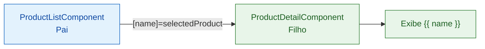

## 11. Comunicação entre componentes com `@Output`

Quando o componente filho precisa avisar o componente pai sobre uma ação, usa-se `@Output` com `EventEmitter`.

No componente filho:

```ts
import { Component, Input, Output, EventEmitter } from '@angular/core';

@Component({
  selector: 'app-product-detail',
  templateUrl: './product-detail.component.html',
  styleUrls: ['./product-detail.component.css']
})
export class ProductDetailComponent {
  @Input() name = '';

  @Output() bought = new EventEmitter<void>();

  buy() {
    this.bought.emit();
  }
}
```

Template do filho:

```html
<h2>Product Details</h2>
<h3>{{ name }}</h3>
<button (click)="buy()">Buy Now</button>
```

No componente pai:

```ts
export class ProductListComponent {
  selectedProduct = '';

  onBuy() {
    window.alert(`You just bought ${this.selectedProduct}!`);
  }
}
```

Template do pai:

```html
<app-product-detail
  [name]="selectedProduct"
  (bought)="onBuy()">
</app-product-detail>
```

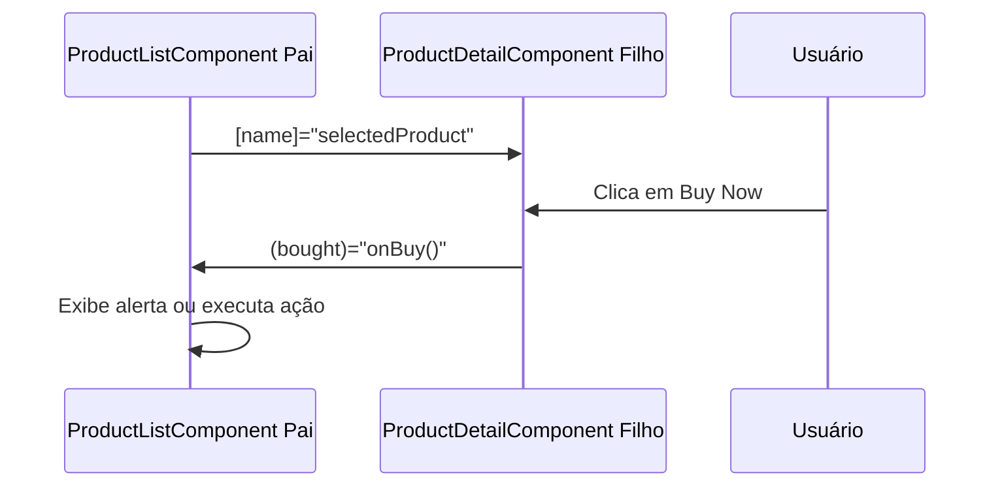

## 12. Enviando dados em eventos customizados

O `EventEmitter` também pode enviar dados para o componente pai.

No filho:

```ts
@Output() bought = new EventEmitter<string>();

buy() {
  this.bought.emit(this.name);
}
```

No pai:

```html
<app-product-detail
  [name]="selectedProduct"
  (bought)="onBuy($event)">
</app-product-detail>
```

Classe do pai:

```ts
onBuy(name: string) {
  window.alert(`You just bought ${name}!`);
}
```

O `$event` representa o valor enviado pelo `emit`.

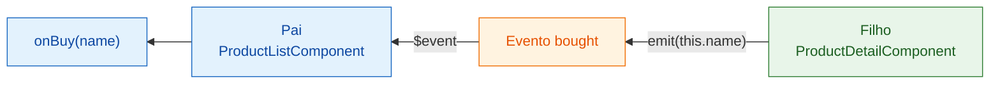

## 13. Variáveis de referência local no template

Além de `@Input` e `@Output`, Angular permite criar uma referência local no template usando `#`.

Exemplo:

```html
<app-product-detail
  #product
  [name]="selectedProduct"
  (bought)="onBuy()">
</app-product-detail>

<span>{{ product.name }}</span>
```

A variável `#product` permite acessar membros públicos do componente diretamente no template.

Essa abordagem é útil quando não temos controle sobre o componente filho para adicionar `@Input` ou `@Output`. Porém, deve ser usada com cuidado para não criar acoplamento excessivo entre o template do pai e a implementação interna do filho.

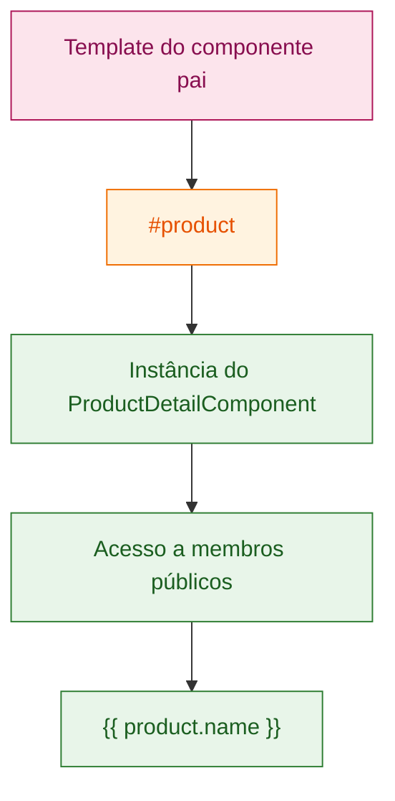

## 14. Encapsulamento de CSS

O capítulo introduz a ideia de encapsular estilos CSS para evitar que estilos de um componente vazem para outros componentes da aplicação.

Angular permite controlar esse comportamento por meio da propriedade `encapsulation` do `@Component`.

Exemplo conceitual:

```ts
import { Component, ViewEncapsulation } from '@angular/core';

@Component({
  selector: 'app-product-detail',
  templateUrl: './product-detail.component.html',
  styleUrls: ['./product-detail.component.css'],
  encapsulation: ViewEncapsulation.Emulated
})
export class ProductDetailComponent { }
```

Principais modos:

| Modo | Ideia |
|---|---|
| `Emulated` | Padrão. Angular simula escopo de CSS por componente |
| `ShadowDom` | Usa Shadow DOM nativo do navegador |
| `None` | Não encapsula. O CSS pode afetar outros elementos da aplicação |

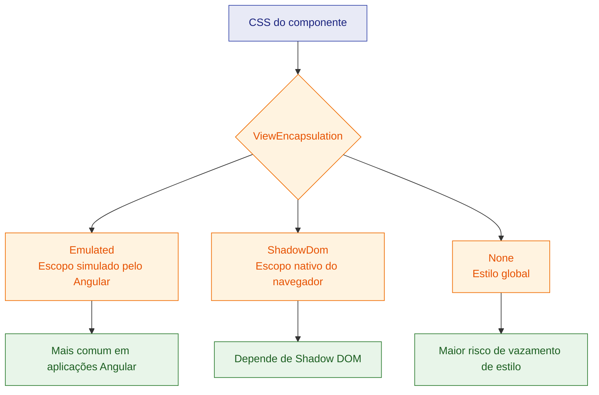

### Observação de atualização

O capítulo menciona o modo `Native`, usado em versões antigas do Angular. Na documentação atual, o modo equivalente é `ShadowDom`.

## 15. Resumo prático do capítulo

| Conceito | Sintaxe principal | Uso |
|---|---|---|
| Interpolação | `{{ title }}` | Exibir texto vindo da classe |
| Property binding | `[innerText]="title"` | Alterar propriedade do DOM |
| Attribute binding | `[attr.aria-label]="myText"` | Alterar atributo HTML |
| Class binding | `[class.star]="isLiked"` | Aplicar classe condicional |
| Style binding | `[style.width.px]="100"` | Aplicar estilo dinâmico |
| Event binding | `(click)="onClick()"` | Reagir a eventos do usuário |
| Input binding | `[name]="selectedProduct"` | Pai envia dados para filho |
| Output binding | `(bought)="onBuy($event)"` | Filho envia evento para pai |
| Template reference | `#product` | Referenciar componente ou elemento no template |
| CSS encapsulation | `ViewEncapsulation.Emulated` | Controlar escopo dos estilos |

## 16. Checklist de fixação

- [ ] Sei explicar a diferença entre classe TypeScript, template HTML e CSS do componente.
- [ ] Sei criar um componente com Angular CLI.
- [ ] Sei registrar um componente em um `NgModule`.
- [ ] Sei diferenciar componente com módulo e componente standalone.
- [ ] Sei usar o seletor de um componente no template.
- [ ] Sei usar interpolação, property binding e event binding.
- [ ] Sei aplicar classes e estilos dinamicamente.
- [ ] Sei passar dados do componente pai para o filho com `@Input`.
- [ ] Sei emitir eventos do componente filho para o pai com `@Output`.
- [ ] Sei enviar dados usando `EventEmitter<T>` e `$event`.
- [ ] Sei usar variáveis locais de template com `#`.
- [ ] Sei explicar o propósito do encapsulamento de CSS.

## 17. Pontos de atenção para projetos reais

1. Prefira `@Input` e `@Output` para comunicação clara entre pai e filho.
2. Evite manipular diretamente o DOM quando Angular já oferece binding.
3. Não declare componente standalone em `declarations`; use `imports`.
4. Evite usar `ViewEncapsulation.None` sem necessidade, pois os estilos podem vazar globalmente.
5. Use variáveis locais de template com moderação, para não acoplar demais o template ao componente filho.
6. Para código Angular novo, avalie usar componentes standalone como padrão.
